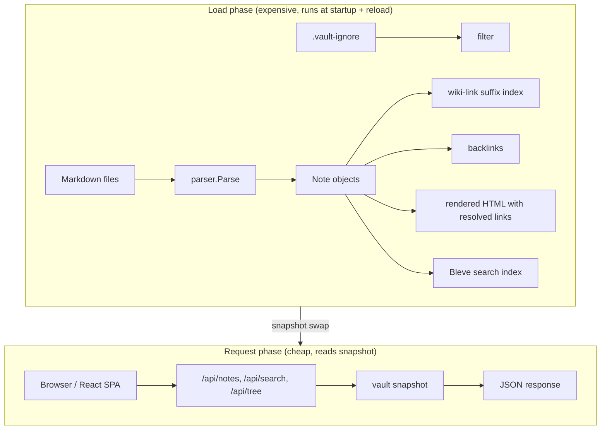
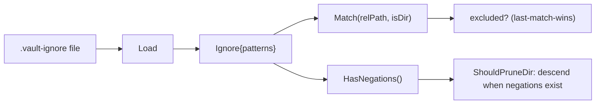
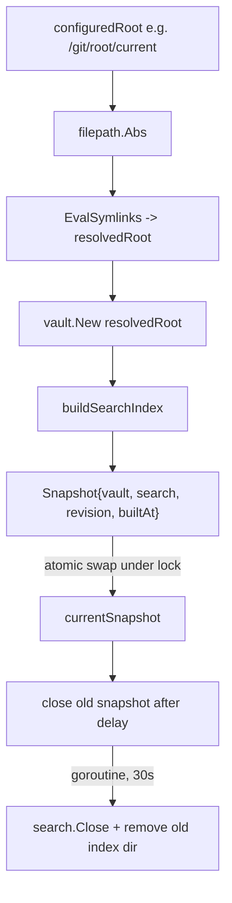
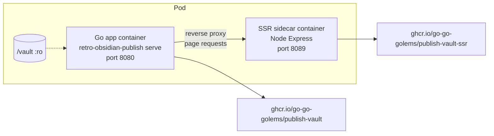

# Deep Dive: Retro Obsidian Publish — Vault-Driven Publishing Architecture

This article is a technical analysis of Retro Obsidian Publish, the application that turns an Obsidian vault directory into a self-hosted website. It is written for an engineer who wants to understand how the system works internally: where the boundaries are, why they exist, and how the parts cooperate. The analysis is grounded in a specific source snapshot so that future readers can assess whether a conclusion is still current.

The binary is `retro-obsidian-publish`. The Go module is `github.com/go-go-golems/publish-vault`. The source analyzed here is commit `560e71d2eb8d0999585ad8f48bb3f17e9c21fcdd`, dated 2026-07-26. The repository contains 55 Go files and roughly 7,900 lines of TypeScript and React, organized as a Go backend with an embedded Vite/React frontend.

> [!summary]
> - The architecture separates a one-time **load phase** (parse Markdown, build note index, wiki-link index, backlinks, HTML, search index) from a **request phase** that reads the prepared in-memory snapshot.
> - The vault loader is a single choke point for publication decisions: every downstream surface reads from one in-memory map of notes, so exclusion rules enforced at load time propagate everywhere.
> - An atomic snapshot model supports reloads in git-sync deployments without ever exposing a half-built vault to request handlers.
> - A gitignore-subset ignore file, a goldmark-based Markdown parser, a Bleve full-text index, and an embedded React SPA are woven together through narrow, stable interfaces.

## What the system is

Retro Obsidian Publish treats a directory of Markdown files as read-only content and derives a website from it. The directory is an Obsidian vault: a normal folder of Markdown with YAML frontmatter, `[[wiki links]]`, `![[embeds]]`, callouts, and attached images. The application does not modify the vault. It builds an in-memory representation, serves a JSON REST API over that representation, and optionally serves a retro monochrome React frontend from the same process.

The deployment unit is one Go binary. The binary can serve the API alone, or the API plus the bundled web application. For server-side rendering, a Node.js sidecar runs alongside the Go process and the Go server reverse-proxies page requests to it. The same binary is shipped as a container image and deployed to a Kubernetes cluster through a GitOps pipeline.

The scope is deliberately bounded. The system is not a reimplementation of Obsidian. It publishes a readable, linkable, searchable website from the same Markdown source files, approximating some Obsidian behavior where a full reimplementation would be out of scope.

## The two-phase execution model

Understanding the system begins with the distinction between load time and request time. This distinction is the organizing principle of the whole architecture, and almost every design decision follows from it.

At load time, the application does expensive work. It walks the vault directory, parses every Markdown file, extracts frontmatter and wiki links, resolves wiki-link targets to full vault paths, computes backlinks, renders HTML with resolved links, and builds a full-text search index. This work runs once on startup and again on every reload.

At request time, HTTP handlers do only cheap work. They read the prepared in-memory snapshot and return JSON. They do not parse Markdown, they do not walk the filesystem, and they do not build indexes. The expensive work is front-loaded so that page loads are fast.



The consequence for anyone extending the system is direct: a new publication rule must be enforced at load time, not in the HTTP handlers. If the loader excludes a note, that note is absent from the in-memory map, and because every consumer reads from that map, the note is absent from the API list, the file tree, the search index, the backlink graph, and the raw-source endpoint. There is no per-request check to forget.

## The vault loader as the central choke point

The core of the system is the `vault` package, located at `pkg/vault/vault.go`. A `Vault` struct holds the note index, the wiki-link resolution index, the asset index for image embeds, the vault root path, and the compiled ignore rules. The note index is a `map[string]*Note` keyed by slug.

The loading flow has three responsibilities that interlock. First, it walks the filesystem and decides which files enter the index. Second, it parses each Markdown file into a `Note`. Third, after all notes are loaded, it builds derived structures: the wiki-link index, the backlink graph, and the final HTML with resolved links.

```go
// pkg/vault/vault.go (selected, line-anchored to commit 560e71d)
type Vault struct {                                  // line 68
    mu            sync.RWMutex
    notes         map[string]*Note
    wikiLinkIndex map[string]string
    assetIndex    map[string]string
    root          string
    ignore        *ignore.Ignore                   // line 74
}
```

The walk in `LoadAll` (line 102) prunes ignored directories, skips ignored files, parses non-ignored Markdown files, and indexes non-ignored assets. The pruning decision is subtle: ignored directories are pruned only when the ignore file contains no negation patterns. The `ShouldPruneDir` method (line 455) encodes this rule. A negation pattern such as `!Secrets/Public.md` means an ignored directory might contain a file that should be re-included, so the walk must descend into the directory and match each file individually rather than skipping the directory wholesale.

This subtlety exists because the ignore matcher uses a last-match-wins semantics rather than strict gitignore semantics. The package documentation in `internal/ignore/ignore.go` states this explicitly: negation cannot re-include a file under an excluded directory the way real git does; instead, a later `!` simply overrides an earlier exclusion. The `HasNegations` method (line 187) exists solely so the walker knows when descending is necessary.

The single most important property of this design is that `v.notes` only ever contains notes that passed every exclusion check. Every downstream consumer reads from this map.

## Path exclusion: the `.vault-ignore` file

Exclusion is handled by a dedicated `internal/ignore` package. It parses a `.vault-ignore` file at the vault root and answers path-exclusion queries for the loader, the file watcher, and the static-asset handler.

The package implements a documented subset of gitignore. Blank lines and `#` comments are ignored. A leading `!` negates a pattern with last-match-wins. A trailing `/` restricts a pattern to directories. A leading `/` or any internal `/` anchors the pattern to the vault root; otherwise the pattern matches a single path segment at any depth. Globs use the standard library `path.Match` semantics, which means `*` and `?` do not cross `/`.

Two limitations are documented and intentional. The `**` glob, which matches across directory boundaries, is not supported. Nested ignore files are not supported; only the single file at the vault root is read.



The decision to implement a subset rather than reuse an existing gitignore library is a deliberate trade-off. The hand-rolled matcher is small, has no external dependencies, and its limitations are explicit. The cost is that patterns common in real gitignore files, such as `**/node_modules/`, cannot be expressed.

## Markdown parsing and frontmatter

The parser lives in `internal/parser/parser.go` and is built on goldmark with several extensions: GitHub-flavored Markdown, tables, strikethrough, task lists, footnotes, and the `goldmark-meta` extension for YAML frontmatter.

The `Parse` function (line 56) takes raw Markdown bytes and returns a `ParsedNote` containing the rendered HTML, the parsed frontmatter as a normalized `map[string]interface{}`, the extracted wiki links, the tags, the title, and an excerpt. Frontmatter is normalized so that YAML maps with non-string keys, which goldmark-meta can produce, are flattened to string-keyed maps before being served as JSON.

Wiki links are extracted with a regular expression before goldmark sees the source, then replaced with HTML placeholder anchors so goldmark does not mangle them. This two-phase approach exists because goldmark's Markdown grammar would otherwise treat `[[Target]]` as a combination of link syntax and raw text. The placeholders carry `data-target`, `data-raw`, and `data-alias` attributes that a later resolution pass rewrites with the correct resolved slugs and note titles.

The parser does not model publication policy. It does not know whether a note should be published. It returns frontmatter as a generic map, and the vault layer reads specific keys such as `title` and `tags` from it. This separation is important: any new frontmatter-driven policy belongs in the vault layer, not in the parser, because the parser is a general Markdown engine and publication is an application concern.

## Wiki-link resolution and backlinks

Obsidian wiki links often use short paths. A note may contain `[[Tribal/App-Auth]]` while the actual file lives at `Research/KB/Tribal/App-Auth.md`. The vault builds a suffix-based index so short links resolve to full vault slugs.

For a file at `Research/KB/Tribal/App-Auth.md`, the index registers the full slug and progressively shorter suffixes: `research/kb/tribal/app-auth`, `kb/tribal/app-auth`, `tribal/app-auth`, `app-auth`. The first note to register a suffix wins, so ambiguous short links resolve deterministically. This is documented in the repository README as an intentional approximation of Obsidian behavior.

Backlinks are computed after all notes are loaded. The vault iterates every note, follows each note's wiki links through the resolver, and appends the linking note's slug to the target note's backlink list. Because backlinks are derived from the note map, a note excluded at load time cannot appear as a backlink target. The resolver returns "not found" for any slug not in the map, and the backlink is silently dropped. This is the desired behavior, and it is a direct consequence of gating at load time.

## The search index

Full-text search uses Bleve, wrapped in the `pkg/search` package. The search index is built from the notes that the vault loaded, using the Markdown source text converted to plain text. Because the index is built from `v.notes`, it contains only published notes. There is no separate exclusion step for search; it inherits the loader's decisions.

The system supports two index modes. In the default mode, the index lives in memory and is rebuilt on every load. In the persistent mode, enabled with `--search-index-path`, indexes are written to a per-revision directory on disk. The persistent mode exists for deployments where rebuilding a large index on every reload is too expensive. The revision naming scheme, based on the vault directory basename and a timestamp, allows old indexes to be cleaned up after a delay.

## The atomic snapshot model

The `pkg/server/runtime.go` package manages the lifecycle of the vault and search index as a single immutable snapshot. This design supports deployments where an external process updates the vault directory and then asks the running server to reload.

A `Snapshot` bundles a vault, a search index, a revision identifier, the resolved root path, and a build timestamp. The `RuntimeState` holds one current snapshot behind a read-write lock. Request handlers call `Snapshot()` to get the active vault and search index; they never see a partially built state.



The reload flow is the most safety-critical part of this design. When `Reload()` is called, it builds an entirely new snapshot first. If loading or indexing fails, the old snapshot remains active and the failure is returned. Only after the new snapshot is fully built is it swapped in under the lock. The old snapshot is then closed after a delay in a separate goroutine, so in-flight requests that still hold references to the old vault can complete.

Symlink resolution happens before loading. This matters for git-sync deployments, where a stable path like `/git/root/current` is a symlink that an external process atomically flips to a new checkout. The server resolves the symlink to the concrete directory, so the loaded vault and the reload target are consistent.

The admin reload endpoint, `POST /api/admin/reload`, is disabled by default. It is enabled either by setting a bearer token through the `RETRO_RELOAD_TOKEN` environment variable, or by allowing unauthenticated reloads from loopback clients with `--reload-allow-loopback`. The loopback option exists for same-host automation such as a git-sync sidecar calling `127.0.0.1`.

## The file watcher

When file watching is enabled (the default for local use), the `pkg/watcher/watcher.go` package uses `fsnotify` to monitor the vault directory and debounce rapid events. The watcher watches the vault root and all non-ignored subdirectories. Ignored directories are pruned from the watch set using the same `ShouldPruneDir` logic as the loader, so the watcher and the loader agree on what is excluded.

On a Markdown file change, the watcher calls `ReloadNote`, which re-parses a single file and updates the vault index. `ReloadNote` re-checks the ignore rules, because a file may have been moved into an ignored tree mid-run, and returns a sentinel error `ErrIgnored` if the path is now excluded. The watcher treats this error as a no-op. For non-Markdown files, the watcher marks the asset index dirty and refreshes it on the next debounce tick, so image embeds in subsequently reloaded notes resolve against current attachments.

The watcher's incremental model is consistent with the loader's full-load model because both consult the same ignore rules on every event. A note toggled to an excluded state disappears from the snapshot on the next debounced reload. There is no separate incremental exclusion path.

## The HTTP API and the asset handler

The API is defined in `pkg/api/api.go` and registers routes on a `gorilla/mux` router. The endpoints are narrow and read-only: list notes, get a single note by slug, get the file tree, search, list tags, and get site config. Every handler obtains the current snapshot from a provider and reads from it.

The asset handler serves non-Markdown files such as images from the `/vault-assets/` path. It re-checks the ignore rules on every request, using the same snapshot for the ignore decision and the file open so a concurrent reload cannot gate bytes from the new root with the old vault's ignore rules. An excluded asset returns a 404 before the handler touches disk.

The raw-source endpoint serves Markdown source for a note. It also re-checks the ignore rules, so the ignore file cannot be bypassed through the raw endpoint. File access uses `os.OpenRoot`, which opens a filesystem root and restricts subsequent file operations to paths under that root, providing path-traversal protection.

## The embedded React frontend

The web application is a Vite and React single-page application written in TypeScript. In production, the built bundle is embedded into the Go binary using `go:embed` and served from the same process as the API. A build tag controls the embedding behavior.

When the `embed` build tag is set, the `pkg/web/embed.go` file embeds the contents of `pkg/web/embed/public` as an `embed.FS` and exposes a sub-filesystem rooted at the public directory. When the tag is absent, `pkg/web/embed_none.go` serves the bundle from disk relative to the repository root, which is the development mode.

The build process that produces the embedded bundle is a separate Cobra command, `build web`. It can build the frontend either with a local `pnpm` installation or with a Dagger pipeline that runs the build inside a container. The Dagger path mounts a pnpm cache volume and runs the build in a Node image, then exports the `dist` directory and copies it into `pkg/web/embed/public`. This keeps the Go binary self-contained: after `build web`, a normal `go build -tags embed` produces a single binary that serves both the API and the frontend.

## Server-side rendering as a sidecar

For server-side rendering, the system uses a Node.js sidecar. The `web/ssr.Dockerfile` builds a container image that runs an Express server rendering React on the server. When the `--ssr-url` flag is set, the Go server reverse-proxies page requests to the sidecar. Static assets such as `/assets/`, `/fonts/`, and `/__manus__/` are served directly from the Go server rather than through the proxy, because the SSR sidecar only renders page HTML.

The proxy includes a fallback. If the sidecar returns a server error or is unreachable, the handler falls back to serving the SPA's `index.html` directly, so the site stays functional even when the sidecar is unavailable. This is a deliberate resilience choice: the SSR sidecar is an enhancement, not a hard dependency.

## Deployment topology

The repository ships a multi-stage Dockerfile and a `docker-compose.yml` that define the canonical deployment shape. The compose file runs two services: the Go application and the SSR sidecar. The Go application mounts the vault directory read-only and is configured through environment variables and command flags.



The `deploy/gitops-targets.json` file declares the GitOps integration. It maps the application to a GitOps repository, a branch, a manifest path, and the container images that should be updated. Two images are published: the main application image and the SSR sidecar image. The GitHub Actions workflow `publish-image.yaml` builds and pushes both images to the GitHub Container Registry, using a reusable workflow from the shared `infra-tooling` repository. The workflow triggers on pushes to `main` and on pull requests that touch the relevant paths.

This deployment shape is consistent across the go-go-golems ecosystem: a Go binary with an embedded frontend, an optional SSR sidecar, container images published to a registry, and a GitOps target declaration that a separate automation pipeline consumes to open pull requests against the cluster configuration repository.

## Configuration

Configuration is split across three layers. The first layer is the command-line interface, built with Cobra and the Glazed command framework. The serve command exposes flags for the vault directory, port, vault name, page title, watch mode, reload token, SSR URL, favicon, search index path, and widget pages directory. The Glazed framework provides schema-backed flags, help generation, and structured logging.

The second layer is environment variables. The `VAULT_DIR` variable provides a default vault path when the `--vault` flag is omitted. The `RETRO_RELOAD_TOKEN` variable holds the reload bearer token. The `BUILD_WEB_LOCAL` variable forces the web build to use local pnpm instead of Dagger. Vite-specific variables configure the frontend during development.

The third layer is vault-scoped configuration that travels with the vault. Today this layer is minimal: the `.vault-ignore` file and the `.publish/` directory, which holds widget page scripts. There is no general configuration file for the vault. Server behavior is configured entirely through flags and environment variables, which means vault-scoped settings do not travel with the vault in git.

## The widget DSL extension

The system includes a server-driven widget subsystem that reuses the widget DSL from the `rag-evaluation-system` repository. The `pkg/widgethost` package executes JavaScript page scripts using the `goja` runtime and serves the resulting widget IR over the same HTTP contract as the RAG evaluation system. Page scripts live in `.js` files under a configurable directory and define pages and actions using a `widget.page(...)` builder API.

The `pkg/vaultwidgets` package exposes note-domain widget builders to JavaScript as a native module. Scripts can call functions to render note HTML, frontmatter panels, breadcrumbs, backlinks, and tag clouds. Every render runs in a fresh goja VM, prioritizing correctness over throughput. This subsystem connects the vault content to a reusable widget rendering pipeline that originated in another repository, demonstrating how a pattern migrates across the ecosystem.

## What is solid

Several structures in this codebase are stable and worth preserving.

The two-phase execution model is the foundation. By front-loading expensive parsing and indexing, the system keeps request handlers simple and fast. Any future feature that does expensive work per request is likely a design smell; the work should move to load time or to a background rebuild.

The vault loader as a single choke point for publication decisions is the second solid structure. Because every consumer reads from one in-memory map, exclusion rules enforced at load time propagate everywhere without per-consumer logic. This invariant is what makes the ignore file, and any future per-note or config-driven exclusion, simple to reason about.

The atomic snapshot model is the third. It allows reloads in deployments where an external process updates the vault, without ever exposing a half-built state to request handlers. The build-then-swap discipline, with delayed cleanup of the old snapshot, is the correct pattern for hot-reloadable state.

The embedded SPA with build-tag-controlled embedding is the fourth. It produces a single deployable binary while preserving a development mode that serves from disk. The separation between the build command and the Go build means the frontend toolchain does not leak into the Go build path.

## What is emergent or incomplete

Several areas have the right shape but lack an explicit contract or are still evolving.

There is no general vault-scoped configuration file. The `.vault-ignore` file handles exclusion, and the `.publish/` directory handles widget scripts, but there is no single place for vault-scoped settings to live with the vault in version control. This is a gap relative to the needs of operators who want publishing policy to travel with the vault repository.

The `.vault-ignore` matcher is a documented subset of gitignore. It does not support `**` or nested files. This is fine for current needs, but it means common gitignore patterns cannot be expressed, and operators coming from git may be surprised by the limitations.

The widget DSL subsystem is a sibling-module workaround, as documented in the `vaultwidgets` package comment. It reuses the widget IR contract from another repository but has not yet graduated to a first-class namespace. This is an active migration in progress.

## How the parts cooperate

The architecture is not a set of independent components. It is a set of responsibilities that cooperate through narrow interfaces. The following trace shows how a single note edit propagates through the system in watch mode.

1. A Markdown file is saved in the vault.
2. `fsnotify` reports the event to the watcher, which debounces it.
3. The watcher checks the ignore rules. If the path is now excluded, it returns `ErrIgnored` and stops.
4. Otherwise, the watcher calls `ReloadNote`, which re-parses the file.
5. The vault updates the note in its map, rebuilds the wiki-link index, recomputes backlinks, and re-renders HTML with resolved links.
6. The watcher builds a search document from the note and indexes it in Bleve.
7. A subsequent request to `/api/notes/{slug}` reads the updated note from the snapshot.
8. A subsequent request to `/api/search?q=...` returns the updated content because the search index was updated.

Every step consults the same ignore rules and reads from or writes to the same note map. There is no second source of truth for what is published. This coherence is the property that makes the system maintainable, and it is the property most worth protecting when extending it.

## Snapshot identity and how to read this analysis

This analysis is tied to a precise source snapshot. The repository, commit, and date are recorded in the frontmatter. Future readers should compare their source commit against `560e71d2eb8d0999585ad8f48bb3f17e9c21fcdd` before treating any conclusion as current. The repository had 269 commits as of this snapshot, with the initial commit on 2026-05-13.

The line-anchored references to `pkg/vault/vault.go` and `internal/ignore/ignore.go` are accurate as of this commit. If the code has moved, the section names and the described responsibilities remain the more durable guide; the line numbers are a verification aid, not the primary claim.

## Related notes

- [[PROJ - Retro Obsidian Publish - A Retro Monochrome Vault Browser]] — project status and shape.
- [[ARTICLE - Publish Vault Memory Architecture - Reload-Safe Persistent Search Indexes]] — the persistent search index design in depth.
- [[PROJ - Publish Vault Widget DSL - Server-Driven Pages from an Embedded JavaScript Runtime]] — the widget DSL subsystem.
- [[ARTICLE - Retro Obsidian Publish - Building a Self-Hosted Knowledge Base from Markdown Files]] — the original build writeup.
