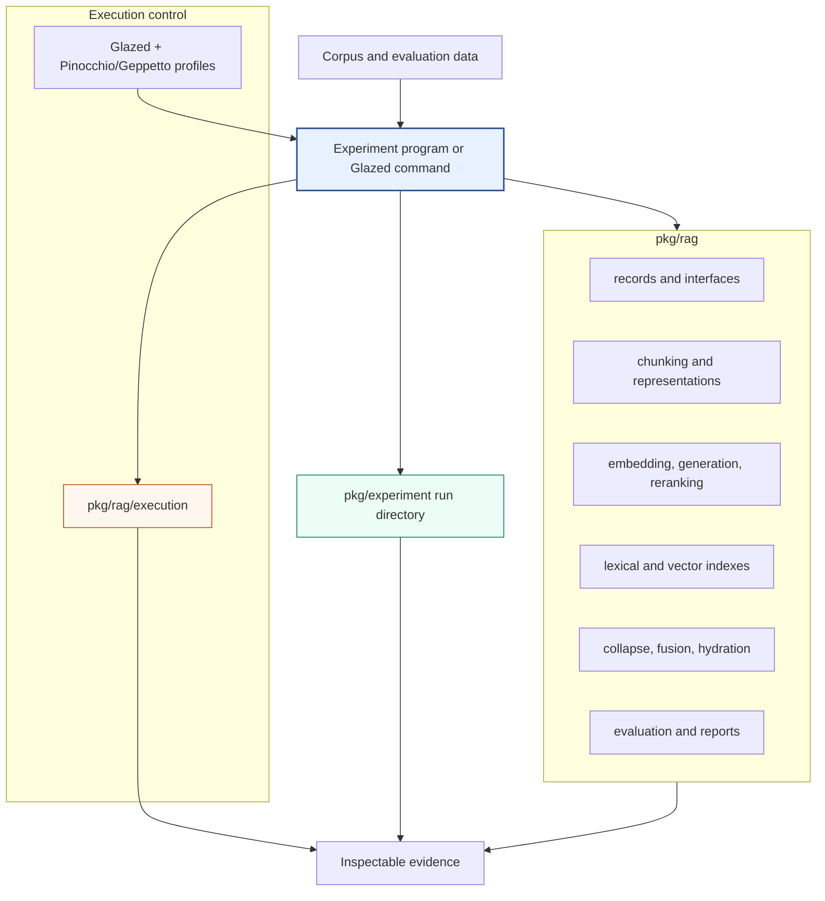
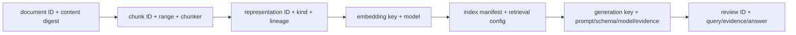

# rag-ttc: Architecture of a Reproducible Go RAG Evaluation System

`rag-ttc` is a Go system for constructing, executing, and measuring
retrieval-augmented generation experiments. Its architecture separates domain
capabilities, expensive-work control, experiment artifact custody, provider
configuration, and individual experiment programs. An experiment remains
ordinary Go control flow or a concrete Glazed command. Shared packages expose
chunking, representations, embeddings, lexical and vector indexes, retrieval,
fusion, reranking, generation, evaluation, reporting, budgets, rate limits,
parallel maps, and recoverable caching.

This article describes the repository as a technical system. It does not
reconstruct its development sequence. For that account, read [[PROJECT REPORT - rag-ttc - From Clean-Slate Toolbox to Live TTC Answer Quality Evaluation]].

> [!summary]
> - `pkg/rag` defines serializable domain records and narrow component
>   interfaces. Implementations can be local, persistent, or provider-backed.
> - `pkg/rag/execution` applies cache-first recovery, worker bounds, rates,
>   finite budgets, and application-level work-call accounting.
> - `pkg/experiment` gives every execution an inspectable filesystem record
>   with configuration, input digests, observations, results, and terminal
>   state.
> - The answer-quality command compares fixed retrieval arms, generates
>   schema-constrained cited answers, emits blinded review queues, and reports
>   retrieval, answer-contract, human-review, usage, latency, budget, and cache
>   measurements separately.

## 1. System boundary

The repository has four principal layers:



No library owns a generic end-to-end pipeline. This is a dependency rule, not
merely an implementation preference. Chunking can be used without generation.
An exact vector index can be used as an oracle without the answer-quality
experiment. Cached execution can wrap any typed operation. Run directories can
record experiments unrelated to RAG.

## 2. Canonical domain records

The public records in `pkg/rag/types.go` are JSON-serializable because a run
must remain inspectable after the Go process exits.

### 2.1 Documents

A document contains source identity, title, text, metadata, and a content
digest:

```go
type Document struct {
    ID            string
    SourceURI     string
    Title         string
    Text          string
    ContentDigest string
    Metadata      map[string]string
}
```

`ID` identifies the source record. `ContentDigest` identifies its content
revision. The distinction allows a stable source identifier to refer to
different immutable experiment inputs over time.

### 2.2 Chunks

A chunk retains exact source lineage:

```go
type Chunk struct {
    ID            string
    DocumentID    string
    Ordinal       int
    Range         Range
    Text          string
    ContentDigest string
    Chunker       string
}
```

Ranges are half-open byte intervals. Chunking strategies may choose boundaries
in runes to avoid splitting Unicode code points, but final ranges address Go
string bytes. Validation checks:

```text
document.Text[byte_start:byte_end] == chunk.Text
```

Chunk IDs and digests therefore refer to material that can be reconstructed
from the declared source document.

### 2.3 Representations

A representation is searchable text derived from a chunk. The repository
supports raw chunk text and leaves room for summaries, generated questions,
and other retrieval surfaces. Representation identity records:

- the source chunk;
- representation kind;
- text and content digest;
- optional model and prompt lineage.

Search indexes representations. Answer evidence is hydrated back to chunks.
This separation lets a generated summary improve recall without making the
summary the cited source.

### 2.4 Queries and judgments

A query has a stable ID, text, optional split, and metadata. An evaluation set
contains queries and graded judgments against an explicit target level:

- representation;
- chunk;
- document;
- evaluation unit.

The target level is part of metric semantics. A document-level judgment cannot
be compared directly with a representation ID without an explicit mapping.

### 2.5 Retrieval records

`Hit` retains:

- representation ID;
- chunk ID;
- document ID;
- channel;
- rank;
- score.

`FusedHit` adds per-channel rank contributions. `Evidence` contains the
hydrated source chunk, final rank, retrieval score, and optional reranker score.
These records preserve both the source material and the observations needed to
explain ranking.

## 3. Component interfaces

The core interfaces are deliberately small:

| Interface | Operation |
| --- | --- |
| `Chunker` | one document to source-preserving chunks |
| `Embedder` | one text batch to vectors and usage |
| `Searcher` | one query to ranked hits |
| `Index` | search plus resource cleanup |
| `Generator` | one typed generation request to text and usage |
| `Reranker` | one query and evidence set to reordered evidence |

Each operation accepts `context.Context`. Provider adapters use
`github.com/pkg/errors` to retain causal context. Implementations include
compile-time assertions such as:

```go
var _ rag.Embedder = (*Embedder)(nil)
var _ rag.Index = (*Index)(nil)
```

The interfaces do not expose lifecycle methods that only one provider needs.
Provider construction, profile resolution, and cleanup remain at the command
boundary.

## 4. Chunking and representation generation

`pkg/rag/chunking` contains fixed and Markdown-aware strategies. Both preserve
source ranges and stable identity. Chunker configuration participates in the
chunk identity, so a different window or overlap creates a different set of
chunks rather than silently replacing an earlier interpretation.

The fixed strategy uses a maximum rune count and overlap:

```text
start at rune 0
choose end = min(start + window, document length)
map rune boundaries to byte offsets
emit chunk with source byte range
if end is final: stop
start = end - overlap
```

The Markdown-aware strategy attempts to preserve structural boundaries while
respecting size limits. The important invariant is unchanged: emitted text
must be an exact source slice with stable document lineage.

Representation generation is a separate step:

```text
Document
  -> Chunk
      -> raw representation
      -> summary representation
      -> hypothetical-question representation
```

Raw representation generation is deterministic. Model-derived
representations use the generic generator and must record model, prompt, and
adapter identity.

## 5. Embeddings

`rag.EmbeddingRequest` contains a model and a batch of texts.
`rag.EmbeddingResult` contains one vector per input and optional usage.

The repository provides two classes of embedder:

- the signed hashing embedder gives deterministic offline vectors for tests and
  examples;
- the Geppetto adapter calls a configured provider and validates its response.

The Geppetto adapter rejects empty batches, model mismatches, result-count
mismatches, unexpected dimensions, NaN values, and infinite values. It does not
accept partially valid provider output.

Corpus and query embeddings use separate cache reports because they have
different cardinalities and operational meanings. Query embedding is budgeted
even when the corpus is already cached.

## 6. Lexical backends

### 6.1 In-memory BM25

The local BM25 implementation tokenizes representations, records term and
document frequencies, tracks average length, and applies:

```text
IDF(t) = log(1 + (N - DF(t) + 0.5) / (DF(t) + 0.5))

score(t,d) =
  IDF(t) * TF(t,d) * (k1 + 1)
  / (TF(t,d) + k1 * (1 - b + b * len(d) / avg_len))
```

It provides a transparent baseline and a deterministic test implementation.

### 6.2 Bleve BM25

The Bleve backend stores representation, chunk, and document identities along
with title and body fields. Queries build a boosted disjunction over title and
body. Search results are converted to generic `rag.Hit` records.

Build publication is atomic:

```text
create sibling temporary directory
build complete Bleve index
write rag-manifest.json
close index
verify destination does not exist
rename temporary directory to destination
open published index
```

If construction fails, the temporary directory is removed. Existing
destinations are never overwritten implicitly.

### 6.3 SQLite FTS5

The FTS5 backend stores a compact lexical index in SQLite and returns the same
generic hit contract. It is useful when an experiment benefits from a single
inspectable database file or direct SQL diagnostics.

## 7. Vector backends

### 7.1 In-memory exact cosine

The exact vector implementation scans all vectors, calculates cosine
similarity, and returns a deterministic top-k. Its linear complexity is
acceptable for tests, small corpora, and correctness comparisons.

### 7.2 SQLite exact vector

The persistent exact backend stores:

```sql
embedding(
    representation_id TEXT PRIMARY KEY,
    chunk_id          TEXT NOT NULL,
    document_id       TEXT NOT NULL,
    model             TEXT NOT NULL,
    dimensions        INTEGER NOT NULL,
    values_blob       BLOB NOT NULL,
    content_digest    TEXT NOT NULL
)
```

Float vectors are encoded into blobs. Build validates model identity,
dimensions, representation references, and chunk references inside one
transaction, then atomically renames the completed database into place.

Search embeds the query with the configured model, scans only matching model
rows, decodes vectors, validates dimensions, and maintains a bounded heap for
the best `k` cosine scores. The database is opened read-only after publication.

## 8. Retrieval composition

Retrieval has three distinct operations:

1. collapse duplicate representation hits;
2. combine channels;
3. hydrate final source evidence.

### 8.1 Collapse

Multiple representations may refer to one chunk or document. Collapse chooses
the best hit for the configured target before fusion. Without this operation,
a document with several generated representations could receive several votes
from one channel.

### 8.2 Weighted reciprocal-rank fusion

RRF combines rank positions rather than incomparable raw scores:

```text
for channel in sorted(channel names):
    for hit in channel:
        contribution =
            channel_weight / (rank_constant + hit.rank)
        fused[target] += contribution
```

Channel names and final ties are sorted deterministically. `FusedHit` retains
each contribution so a final rank can be inspected.

### 8.3 Hydration

Fusion operates on IDs and ranks. Hydration resolves final targets to complete
source chunks and produces `rag.Evidence`. Generation and human review receive
evidence, not internal representation text alone.

## 9. Reranking

The local term-overlap reranker provides deterministic contract coverage.
Geppetto supplies provider-backed reranking. A request declares:

- provider model;
- query;
- candidate evidence;
- desired result count.

Reranking cache identity includes model, query digest, ordered candidate chunk
identities, result count, and adapter version. The answer-quality experiment
reranks RRF candidates, not an unrelated candidate population.

## 10. Recoverable execution

`pkg/rag/execution` is generic and does not depend on RAG domain types except in
the provider-specific wrappers.

### 10.1 Ordered bounded maps

`Map` starts a bounded worker group, propagates cancellation through context,
and stores results by original input index. Completion order does not change
output order.

### 10.2 Resource limiters

A limiter admits an integer resource cost. Implementations include:

- finite total budget;
- token-bucket rate limiter;
- limiter chain.

Budgets are permanent authorization counters. Failed provider attempts still
consume their admitted budget because the external work was attempted.

### 10.3 Cache keys

A cache key contains:

- step name;
- key-schema version;
- canonical structured input.

The filesystem cache hashes the complete key and stores an envelope atomically.
Semantic inputs include content digests, model names, prompt and schema
digests, adapter versions, and context policies as appropriate.

### 10.4 Cache-first execution

`MapCached` performs:

```text
derive keys
load hits
deduplicate equal misses
admit only misses
execute bounded work
store each successful result atomically
restore input order
```

Cache corruption is an error, not a miss. Treating corruption as a miss could
silently trigger unexpected paid work.

### 10.5 Recoverable batches

`MapCachedBatches` groups unique misses into bounded provider batches. Limiter
cost is the sum of item costs in the batch. Each successful provider result is
stored independently:

```text
batch provider call returns N results
for i in 0..N:
    store item i under its semantic key
```

A later store or batch failure preserves prior committed items.

### 10.6 Work-call accounting

`CacheReport` distinguishes:

- hits;
- misses;
- writes;
- work calls;
- per-item outcomes.

One embedding batch can represent 100 misses, 100 writes, and one work call.
The report counts application adapter invocations, not internal HTTP retries.

## 11. Provider configuration

Commands use Glazed fields and sections. Provider selection follows
Pinocchio/Geppetto profile registries:

```text
profile registry files
  -> selected composite profile
  -> generation settings
  -> embedding provider
  -> optional reranking provider
  -> safe provider metadata
```

The command resolves the bundle once and owns cleanup. Credential-bearing
configuration stays outside the repository. CLI fields can select registries
and profiles without direct environment reads.

The profile command reports effective model and API metadata while avoiding
credential serialization.

## 12. Experiment directories

`pkg/experiment` records one run as a filesystem tree. The main operations are:

```go
Create(ctx, root, name, description, config)
CopyInput(ctx, logicalName, sourcePath)
WriteJSON(ctx, relativePath, value)
AppendJSONL(ctx, relativePath, value)
Complete(ctx)
Fail(ctx, err)
```

Paths are constrained to the run directory. Input copies include digests.
JSONL observations are appendable as work completes. Terminal state
distinguishes complete, failed, and incomplete directories.

The answer-quality experiment extends the generic shape:

```text
run/
├── config.json
├── manifest.json
├── inputs/
├── preparation/
│   ├── chunks and representations
│   └── index metadata
├── observations/
│   ├── stages.jsonl
│   ├── budgets.json
│   ├── cache.json
│   ├── provider-usage.jsonl
│   └── failures.jsonl
└── results/
    ├── retrieval records and metrics
    ├── generated-answers.json
    ├── answer-contract-summary.json
    ├── review-queue.jsonl
    ├── review-key.json
    ├── annotations.jsonl
    ├── human-review-summary.json
    └── summary.md
```

## 13. Answer-quality experiment

The Glazed command is implemented under
`cmd/rag-ttc/cmds/experiments/answerquality`.

### 13.1 Settings

Typed settings validate:

- input paths;
- arms and query selection;
- positive retrieval and context limits;
- worker counts;
- non-negative budgets and prices;
- provider profile selection;
- optional annotations.

The command does not accept arbitrary stages. Its fields describe one fixed
experiment.

### 13.2 Provider preflight

Cold ceilings are calculated before paid work:

```text
embedding = corpus representations + selected queries
generation = selected queries × enabled answer arms
reranking = selected queries × enabled reranked arms
```

The operator supplies conservative per-unit prices. Preflight rejects:

- a disabled zero USD ceiling when paid work is possible;
- a computed ceiling above the maximum;
- missing prices unless explicitly permitted;
- incomplete stage budgets unless a partial warm-cache run is explicitly
  authorized.

Runtime budgets remain authoritative after preflight.

### 13.3 Retrieval arms

The fixed arms are:

```text
bm25
vector
rrf
rrf-reranked
```

BM25 and vector each collapse their own results and hydrate evidence. RRF
retrieves both channels, collapses within each, fuses rankings, and hydrates the
top evidence. The reranked arm applies a configured reranker to the RRF
candidate set.

### 13.4 Context packing

The current policy includes whole evidence chunks in rank order until reaching
the evidence-count or rune limit. It records used runes, omitted chunk IDs,
maximum runes, maximum evidence count, and a policy version.

Whole-chunk packing keeps citation identity direct. It does not truncate a
chunk into a new untracked evidence fragment.

### 13.5 Structured answer contract

Generation receives a versioned prompt and JSON schema. Parsing:

- permits exactly one JSON object;
- disallows unknown fields;
- requires all fields;
- validates abstention and citation rules.

The contract separates provider success from application validity. Raw text is
always retained. Invalid output becomes a safe abstention with a failure
category.

### 13.6 Blinded review

`BuildReviewArtifacts` produces a public queue and private key. The queue omits
arm identity. An annotation contains:

```go
type HumanAnnotation struct {
    ReviewID            string
    Reviewer            string
    Correctness         int // 0..3
    Groundedness        int // 0..3
    Completeness        int // 0..3
    CitationCorrectness int // 0..3
    AppropriateAbstain  int // 0..2
    Notes               string
}
```

Loading rejects unknown IDs, blank reviewers, score-range violations, unknown
fields, and duplicate `(review_id, reviewer)` pairs.

### 13.7 Human-review aggregation

The report calculates:

- reviewed items and annotation count;
- per-arm dimension means;
- paired query counts;
- wins, losses, ties, and mean deltas;
- bootstrap intervals when the minimum population is available;
- unique overlap items;
- per-reviewer-pair exact agreement;
- mean and maximum absolute score differences;
- item-level disagreements.

Retrieval metrics and human scores remain separate. A high-recall arm can
still produce a poor answer, and a strict answer contract can fail despite
useful retrieval.

## 14. Measurement model

The system records several evidence classes:

| Evidence class | Question answered |
| --- | --- |
| Retrieval metrics | Did ranked results contain judged relevant targets? |
| Answer contract | Did the model produce locally valid cited structured output? |
| Human review | Was the answer correct, grounded, complete, and appropriately abstaining? |
| Reviewer overlap | Is the rubric applied consistently? |
| Provider usage | What usage did the provider report during this run? |
| Work calls | How many application adapter invocations occurred? |
| Budgets | How much work was authorized, spent, and remaining? |
| Cache outcomes | Which items were reused, computed, stored, or failed? |
| Stage latency | Where did execution time occur? |
| Failures | Which provider, parse, contract, retrieval, or artifact operation failed? |

No one measurement substitutes for another. In particular:

- valid JSON is not factual correctness;
- cache writes are not provider calls;
- token usage is not an invoice unless every stage reports compatible usage and
  pricing is frozen;
- aggregate retrieval quality is not answer quality;
- a successful command is not a reproducible experiment until replay passes.

## 15. Identity and reproducibility

The system depends on several identities:



Each identity must include every semantic input that can affect its result and
exclude observations that can vary without changing the result. Version fields
permit deliberate identity-rule changes.

A reproducibility test is stronger than comparing aggregate metrics:

```text
same frozen inputs and configuration
  -> same selected evidence membership and order
  -> same cache keys
  -> zero-work replay
  -> same semantic answers
  -> same review IDs
```

Floating retrieval scores require explicit treatment. If scores are
observational and do not enter prompts, review material, or selection
decisions, they should not destabilize downstream semantic identity. If they
can alter selection or are shown downstream, their normalization and tie rules
must be versioned and tested.

## 16. Testing strategy

The repository uses layered tests:

- unit tests validate data invariants, parsing, metrics, ranking, cache keys,
  budget behavior, and annotation rules;
- backend tests build, reopen, query, and close persistent indexes;
- fake providers test adapter translation, cleanup, error redaction, and usage;
- late-failure tests prove completed work remains cached;
- zero-budget tests prove replay cannot call providers;
- race tests cover concurrent maps, caches, callbacks, and reports;
- Glazed command tests exercise settings and structured output;
- sample runs validate the complete artifact tree;
- live experiments remain separately authorized and are never normal unit
  tests.

The main commands are:

```bash
go test ./...
go test -race ./...
go build ./...
make lint
go run ./cmd/rag-ttc --help
```

## 17. Extension points

Adding a provider or backend should preserve the existing interfaces and
evidence contracts.

### New embedding provider

Implement `rag.Embedder`, validate response cardinality and dimensions, expose
safe model metadata, and use cached bounded execution. Do not embed credential
lookup inside the adapter.

### New lexical backend

Implement `rag.Index`, retain representation/chunk/document IDs in hits, write
a backend manifest, publish atomically, and test reopen behavior.

### Approximate vector backend

Implement `rag.Index`, record approximation parameters in the manifest, and
compare recall against the exact vector oracle on the same vectors.

### New representation

Produce a `rag.Representation` with chunk lineage, kind, content digest, and
model/prompt identity when generated. Retrieval must still hydrate source
chunks before citation.

### New experiment

Write an ordinary Go program or a concrete Glazed command. Reuse the toolbox,
execution primitives, and run ledger. Do not add a generic pipeline builder
unless repeated experiments demonstrate one stable shared control-flow
contract.

## 18. Operational rules

- Resolve cache hits before rate or budget admission.
- Store successful expensive items independently.
- Treat corrupted cache content as an error.
- Record application work calls separately from item budgets and provider
  usage.
- Freeze prompts, schemas, models, data digests, and retrieval settings.
- Keep raw provider output beside parsed output.
- Preserve invalid answer cells in evaluation denominators.
- Keep review queues separate from private arm keys.
- Require zero-budget replay before distributing stable review IDs.
- Do not tune on a pilot and report the same pilot as confirmatory evidence.
- Do not claim an actual USD cost from incomplete usage.

## 19. Repository map

| Concern | Location |
| --- | --- |
| Domain records and interfaces | `pkg/rag/types.go`, `pkg/rag/components.go` |
| Identity and validation | `pkg/rag/identity.go`, `pkg/rag/validate.go` |
| Chunking | `pkg/rag/chunking` |
| Dataset loading | `pkg/rag/dataset` |
| Embeddings | `pkg/rag/embedding`, `pkg/rag/providers/geppetto` |
| Lexical search | `pkg/rag/lexical`, `pkg/rag/lexical/bleve`, `pkg/rag/lexical/sqlitefts` |
| Vector search | `pkg/rag/vector`, `pkg/rag/vector/sqliteexact` |
| Retrieval and RRF | `pkg/rag/retrieval` |
| Reranking | `pkg/rag/reranking`, `pkg/rag/providers/geppetto` |
| Generation | `pkg/rag/generation`, `pkg/rag/providers/geppetto` |
| Metrics and reports | `pkg/rag/evaluation`, `pkg/rag/report` |
| Execution control | `pkg/rag/execution` |
| Run ledger | `pkg/experiment` |
| Provider profiles | `cmd/rag-ttc/cmds/profiles` |
| Backend bakeoff | `cmd/rag-ttc/cmds/experiments/bakeoff*.go` |
| Answer-quality experiment | `cmd/rag-ttc/cmds/experiments/answerquality` |
| Prompts and schemas | `prompts/` |
| TTC data | `datasets/ttc/` |
| Ticket documentation | `ttmp/2026/07/25/` |

## 20. Related notes

- [[PROJECT REPORT - rag-ttc - Clean-Slate RAG Experiments in Plain Go]]
- [[PROJECT REPORT - rag-ttc - From Clean-Slate Toolbox to Live TTC Answer Quality Evaluation]]
- [[ARTICLE - RAG Evaluation System - Search Retrieval Foundation Deep Dive]]
- [[ARTICLE - RAG Evaluation - Building and Validating an Initial Fixed-Truth Dataset]]
- [[ARTICLE - Exporting WordPress WooCommerce Data into a RAG SQLite Corpus]]
- [[rag-ttc]]
- [[rag-evaluation-system]]
- [[geppetto]]
- [[pinocchio]]
- [[glazed]]
