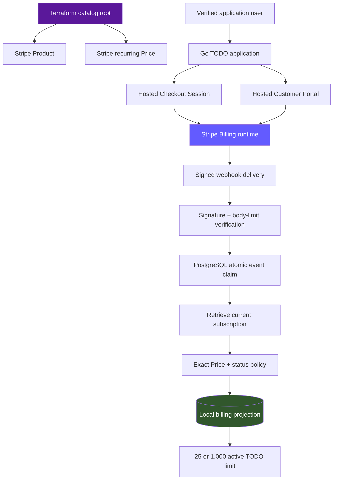
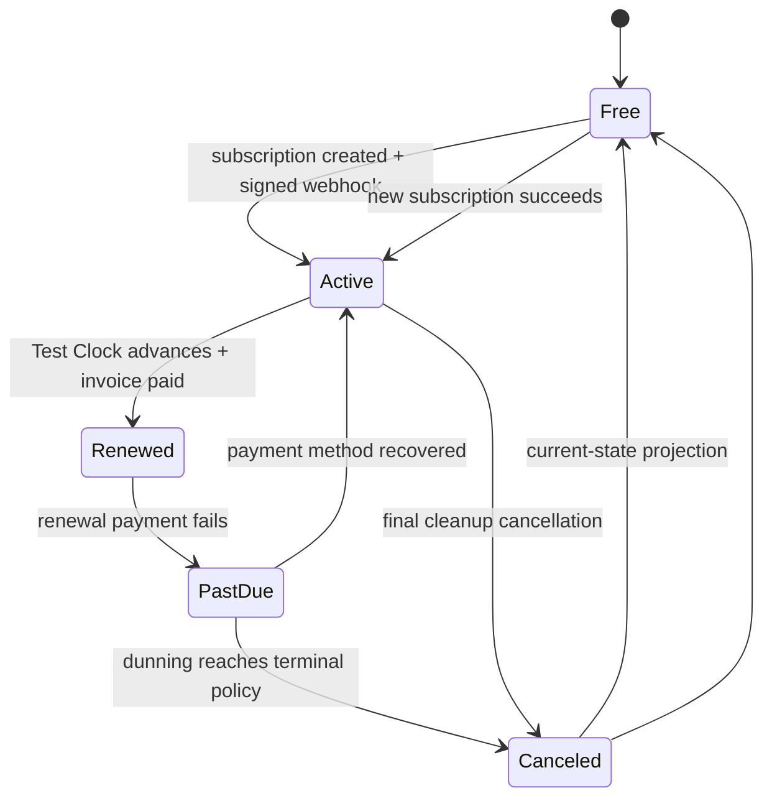

# Stripe Billing: End-to-End Subscription Infrastructure and Acceptance

This report explains the complete Stripe Billing system built for the ZITADEL-backed TODO application. The system begins with a Terraform-managed Product and recurring Price, creates hosted Checkout and Customer Portal sessions from a Go application, treats signed webhooks and current Stripe state as the authority for entitlement, projects that state transactionally into PostgreSQL, and enforces Free and Pro TODO limits under concurrency. Stripe Tax, cancellation, payment failure, recovery, signing-secret rotation, Test Clocks, Vault delivery, and production deployment boundaries are part of the same design.

The central requirement is that billing must remain correct when browser redirects are interrupted, events are duplicated, deliveries race, payloads arrive out of order, subscriptions move through failure states, webhook secrets rotate, and users downgrade while retaining data. A successful Checkout redirect cannot establish entitlement. Product metadata cannot establish entitlement. A webhook payload alone cannot establish current state when a later event may already exist. The application grants Pro only after a signed event causes a current-state Stripe retrieval whose exact configured Price and allowed subscription status satisfy the entitlement policy.

This report is indexed from [[Research/KB/Projects/infrastructure-and-release]]. It records both the implemented sandbox system and the production-host rollout state as of July 26, 2026. Sandbox Billing and Tax acceptance is comprehensive. The K3s application currently uses approved Stripe sandbox credentials temporarily at `todo.yolo.scapegoat.dev`; final live-mode catalog, Tax registration, restricted live key, and production payment acceptance remain separate gates.

> [!summary] Current result
>
> - The official `stripe/stripe` Terraform provider v0.2.2 owns separate sandbox and guarded live catalog roots with independent remote-state keys.
> - Sandbox Terraform owns one Pro Product and one USD 5/month recurring Price with stable lookup key, explicit tax code, exclusive tax behavior, and zero drift.
> - The Go application creates hosted subscription Checkout and Customer Portal sessions. It never handles card numbers or embeds Stripe secret keys in browser code.
> - Entitlement requires exactly the configured Terraform Price and one of `trialing`, `active`, or `past_due`. Unknown, incomplete, paused, unpaid, canceled, and terminal states map to Free.
> - PostgreSQL serializes webhook processing through claim leases/tokens and commits entitlement projection with event completion in one transaction.
> - Automatic Tax, customer address/name persistence, Checkout attempt idempotency, open-subscription rejection, current-state convergence, and overlapping signing secrets are implemented.
> - Real sandbox acceptance covered signed Stripe CLI delivery, Checkout, test-card payment, Tax completion, Pro projection, Portal cancellation, scheduled retention, terminal downgrade, resubscription, renewal, payment failure, recovery, and cleanup.
> - A sandbox endpoint now targets `https://todo.yolo.scapegoat.dev/webhooks/stripe`, with its signing secret stored directly in Vault. Production-host Checkout/webhook/Portal acceptance still remains to be executed.

## 1. Scope and repository map

The application implementation is in:

```text
/home/manuel/code/wesen/2026-07-25--zitadel-go-test/
  internal/billing/stripe.go
  internal/billing/stripe_test.go
  internal/app/profile.go
  internal/app/app.go
  internal/store/postgres/
    migrations/002_identity_billing_profile.sql
    migrations/003_stripe_processing.sql
    migrations/004_reclaim_legacy_stripe_events.sql
  internal/web/templates/profile.html
```

The ticket contains the design, implementation guide, acceptance automation, and sanitized evidence:

```text
/ttmp/2026/07/25/ZITADEL-002-IDENTITY-BILLING--.../
  design-doc/
    01-email-verification-recovery-billing-and-profile-management-architecture.md
  implementation-guide/
    01-stripe-billing-tax-and-terraform-implementation-guide.md
    02-production-k3s-zitadel-todo-and-vault-deployment-guide.md
  scripts/
    08-validate-stripe-sandbox.sh
    09-accept-stripe-test-clock.sh
    10-scan-stripe-secrets.sh
    11-bootstrap-production-webhook.sh
    12-configure-stripe-sandbox-tax.py
  sources/experiments/
    09-stripe-cli-signed-webhook.json
    10-stripe-test-clock-acceptance.json
    11-stripe-customer-portal-acceptance.json
    13-production-webhook-bootstrap-validation.json
    15-stripe-browser-checkout-tax-acceptance.json
    16-stripe-browser-portal-cancellation.json
    19-production-stripe-readiness.json
```

Stable Stripe catalog infrastructure is in a separate repository:

```text
/home/manuel/code/wesen/terraform/stripe/
  modules/billing-catalog/
  envs/sandbox/
  envs/live/
  README.md
```

This separation is deliberate. Catalog resources have infrastructure lifecycles. Customers, Checkout Sessions, subscriptions, invoices, payment methods, Test Clocks, and webhook event projections have runtime lifecycles. Putting all of them into one ownership system would make catalog plans depend on transactional user activity.

## 2. Product contract

The application offers two plans:

| Plan | Active TODO limit | Billing state |
| --- | ---: | --- |
| Free | 25 | No qualifying Stripe subscription |
| Pro | 1,000 | Exact configured Price in an allowed subscription status |

Only active TODOs consume quota. Completing a TODO frees capacity. Downgrading does not delete, hide, or mutate existing TODO data. If an account has more active TODOs than the new limit after downgrade, read and completion operations remain available, while quota-increasing creation is denied until usage falls below the limit.

The product contract produces several implementation constraints:

- Stripe does not own TODO data.
- The local database does not invent subscription state.
- Browser redirects are advisory because they can be replayed, interrupted, or reached before webhook processing.
- Email cannot correlate application users to Stripe Customers because identity is keyed by `(issuer, subject)`.
- Subscription metadata is diagnostic, not authorization.
- A downgrade changes future capacity; it does not destroy user content.

## 3. Architecture and authority

The system uses four ownership domains.

### 3.1 Terraform owns stable catalog intent

Terraform owns:

- the Pro Product;
- the recurring monthly Price;
- currency and amount;
- Product tax code;
- Price tax behavior;
- stable lookup key and environment metadata;
- separate sandbox/live state boundaries; and
- nonsecret catalog outputs.

### 3.2 The Go application owns runtime orchestration

The application owns:

- Customer correlation to local user IDs;
- hosted Checkout Session creation;
- hosted Portal Session creation;
- Stripe signature verification;
- webhook claiming and processing;
- current-subscription retrieval;
- local billing projection; and
- quota authorization.

### 3.3 Stripe owns commercial runtime state

Stripe owns:

- subscriptions and their status transitions;
- invoices;
- payment methods;
- payment retries and dunning;
- cancellation timing;
- calculated Tax transactions; and
- Test Clock simulations.

### 3.4 Operators own legal and account-level decisions

Operators own:

- business origin;
- Tax registrations and filing obligations;
- legal product classification;
- Customer Portal configuration when unsupported by Terraform;
- branding;
- retry/dunning policy; and
- restricted production API-key provisioning.



The authoritative path is `signed event -> current Stripe retrieval -> policy -> transactional projection`. The event indicates that reconciliation should occur. The retrieved object establishes current Stripe state. The configured Price establishes catalog membership. The local projection makes authorization fast and auditable.

## 4. Terraform catalog design

The official provider is pinned exactly:

```hcl
terraform {
  required_providers {
    stripe = {
      source  = "stripe/stripe"
      version = "0.2.2"
    }
  }
}
```

The provider reads `STRIPE_API_KEY` from the process environment. API keys do not appear in HCL, tfvars, plans, outputs, or committed shell scripts. `.terraform.lock.hcl` is committed so provider upgrades are explicit.

The catalog module creates a service Product and recurring Price. Its stable fields include:

```text
Product name: The Scapegoat Pro
Currency: USD
Amount: 500 cents
Interval: month
Tax code: txcd_10103000 in accepted sandbox configuration
Tax behavior: exclusive
Lookup key: environment-qualified and stable
Metadata: app, plan_key, environment
```

Sandbox and live are independent roots with independent backend keys:

```text
stripe/the-scapegoat/sandbox/terraform.tfstate
stripe/the-scapegoat/live/terraform.tfstate
```

The remote backend uses encrypted, versioned, public-access-blocked S3 state with native lockfile support. Repeated sandbox plans return zero drift.

### 4.1 Import before apply

The first sandbox inventory found zero Products and zero Prices, so initial creation did not require import. The live root requires inventory before apply. If a semantically matching Product or Price already exists, it must be imported. Creating a duplicate because Terraform does not yet know an external object violates the catalog ownership contract.

The comparison includes:

- active status;
- Product name and type;
- currency;
- unit amount;
- recurring interval;
- lookup key;
- Product tax code;
- Price tax behavior; and
- environment metadata.

Prices have effectively immutable commercial semantics. Changing amount, interval, currency, or tax behavior creates a new Price. Migration then proceeds by deploying the new Price ID, deciding how existing subscriptions move, and archiving the old Price only after new Checkout no longer references it.

### 4.2 Live-root guards

The live root rejects sandbox API keys and uses a separate state key. It also requires an explicit approved Tax code. These checks do not prove that a key belongs to the intended live account, but they prevent the most common cross-environment error from becoming a catalog mutation.

## 5. Secret boundaries

Three Stripe secret classes exist:

| Secret | Purpose | Runtime owner |
| --- | --- | --- |
| Secret API key | Stripe API requests | Local ignored environment or production Vault |
| Webhook signing secret | Verify one endpoint's signatures | Local CLI runtime or production Vault |
| Publishable key | Browser Stripe.js operations | Not currently required |

Hosted Checkout is created server-side, so the current application does not need a publishable key. It never sends the secret API key to browser code.

The canonical local variable is `STRIPE_SECRET_KEY`. Process boundaries map it to:

```bash
STRIPE_API_KEY="$STRIPE_SECRET_KEY"
TODO_DEMO_STRIPE_SECRET_KEY="$STRIPE_SECRET_KEY"
```

Webhook secrets remain separate. The application accepts:

```text
TODO_DEMO_STRIPE_WEBHOOK_SECRETS=current,previous
```

This ordered overlap permits bounded rotation without a period in which either Stripe or the application signs/verifies with an unsupported secret.

Production runtime values live at:

```text
kv/apps/todo-demo/prod/runtime
```

Vault Secrets Operator renders them into the `todo-demo` namespace. GitOps contains the secret references and nonsecret settings, never the values.

## 6. Why webhook endpoints are outside Terraform

Creating a Stripe webhook endpoint returns its signing secret once. Marking a Terraform output `sensitive` hides routine display but does not remove the value from state. The project did not approve Terraform state as a secret-bearing system for this credential.

The selected policy is therefore:

- Terraform owns Product, Price, Tax metadata, environment isolation, and nonsecret outputs.
- An operational bootstrap owns endpoint creation and rotation.
- The one-time signing secret streams directly into Vault.

`11-bootstrap-production-webhook.sh` implements the initial operation. It requires:

- an HTTPS receiver URL;
- an authenticated Vault session;
- an empty destination field;
- a key in the expected mode;
- no existing endpoint at the target URL; and
- the exact SDK-compatible event set.

Its failure contract is important. If Stripe creates the endpoint but Vault persistence fails, the script deletes the endpoint. It never leaves an enabled endpoint whose signing secret was lost. It emits neither endpoint identifiers nor secrets.

The script was mock-tested for both success and rollback. A sandbox endpoint was later created for:

```text
https://todo.yolo.scapegoat.dev/webhooks/stripe
```

It uses Stripe API version `2026-06-24.dahlia` and thirteen relevant Checkout, subscription, and invoice events. Its signing secret was stored directly in Vault.

## 7. Checkout request path

Checkout starts from an authenticated profile action. The handler identifies the local user from the verified OIDC session. It does not use the email address as a Stripe join key.

The creation algorithm is:

```text
require authenticated user with email_verified=true
load local billing projection
if an open subscription exists:
    reject duplicate Checkout
load or create deterministic Stripe Customer for local user ID
create a persisted Checkout attempt ID
create subscription Checkout Session with:
    exact configured Pro Price
    one line item
    automatic Tax enabled
    billing address required
    customer address update enabled
    success and cancel URLs on the configured public host
    idempotency key checkout:<user-id>:<attempt-id>
redirect with HTTP 303 to hosted Checkout
```

Customer creation is user-scoped and deterministic. Checkout creation is attempt-scoped. A user-wide Checkout idempotency key would return an old Session forever and prevent legitimate retry after expiration or cancellation. Persisting an attempt ID preserves retry safety within one attempt while permitting a fresh Session for a later attempt.

The server rejects Checkout whenever Stripe already has a nonterminal subscription for the user. The profile UI uses the same `HasOpenStripeSubscription` decision. This avoids a state where the UI offers Upgrade but the server rejects it, or the UI hides Upgrade after terminal cancellation.

## 8. Stripe Tax

Automatic Tax requires several independent facts:

1. The Product has an appropriate tax code.
2. The Price declares inclusive or exclusive behavior.
3. Checkout enables automatic Tax.
4. Stripe has a valid customer location.
5. The account has an origin address.
6. Relevant legal registrations exist.

The application configures Checkout to collect billing address and persist customer address/name. This matters for renewal invoices; a location gathered only for the initial payment would not be enough if it were not saved on the Customer.

Sandbox Tax initially blocked Checkout with:

```text
You must have a valid head office address to enable automatic tax calculation in test mode.
```

`12-configure-stripe-sandbox-tax.py` resolved the sandbox-only account prerequisite. The script rejects live keys, reuses the existing support address in memory, sets personal-use SaaS defaults, and prints neither address nor credential. Sandbox Tax is active with Product tax code `txcd_10103000`, exclusive pricing, and zero registrations. Zero registrations intentionally produce zero calculated tax in the accepted test journey.

That sandbox result must not be promoted as a live legal decision. Live mode still requires owner approval for product classification, origin, registrations, threshold review, and filing responsibility.

## 9. Webhook transport and verification

The endpoint accepts the exact raw request body, bounded to 1 MiB. It verifies Stripe's signature before parsing or writing business state. It is intentionally exempt from browser CSRF because it is not a browser form; the cryptographic signature is its request-authentication mechanism.

The verification sequence is:

```text
read at most 1 MiB + 1 byte
reject oversized body
read Stripe-Signature header
for secret in [current, previous]:
    attempt SDK signature verification against exact raw bytes
    stop at first valid secret
if no secret verifies:
    return failure without event mutation
parse verified event
claim event by Stripe event ID
reconcile current Stripe state
commit projection and event completion
return success
```

The endpoint does not log raw payloads. Payloads can contain customer addresses, email addresses, invoice details, subscription identifiers, and payment metadata. Sanitized evidence records event classes, status transitions, booleans, and counts.

Real Stripe CLI forwarding proved the HTTP transport and SDK signature path. Invalid signatures, missing signatures, malformed payloads, oversized bodies, and duplicate event IDs are covered by automated tests.

## 10. Atomic claim and transactional convergence

A unique event ledger prevents simple duplicate insertion, but uniqueness alone does not prevent two workers from processing the same existing `received` row concurrently. The hardened design adds claim leases and claim tokens.

Conceptually:

```sql
UPDATE stripe_events
   SET processing_state = 'processing',
       claim_token = :new_token,
       lease_expires_at = now() + :lease
 WHERE stripe_event_id = :event_id
   AND (
        processing_state IN ('received', 'retryable_error')
        OR lease_expires_at < now()
   )
RETURNING claim_token;
```

Exactly one transaction receives the claim token. Other deliveries observe that another worker owns the event and do not project state.

After claiming, the worker retrieves current Stripe subscription state instead of trusting event payload chronology. It computes entitlement, then writes the user billing projection and marks the event processed in one PostgreSQL transaction. If projection fails, event completion does not commit. Retryable failures retain enough state for a bounded lease reclaim.

Migration `003_stripe_processing.sql` introduced processing leases/tokens. Migration `004_reclaim_legacy_stripe_events.sql` made legacy received/error rows reclaimable under the new state machine.

A PostgreSQL concurrency test executed simultaneous claims and observed exactly one winner. Expired retry leases were then reclaimed safely.

## 11. Entitlement policy

Pro requires two simultaneous conditions:

1. The subscription contains exactly the configured Terraform Price.
2. Its status belongs to the allowed status set.

The status table is explicit:

| Stripe status | Local plan | Rationale |
| --- | --- | --- |
| `trialing` | Pro | Subscription is intentionally usable during trial |
| `active` | Pro | Payment/subscription is current |
| `past_due` | Pro | Bounded dunning grace; avoid immediate destructive experience |
| `incomplete` | Free | Initial payment is not complete |
| `incomplete_expired` | Free | Initial subscription attempt terminated |
| `paused` | Free | Subscription is not currently serviceable |
| `unpaid` | Free | Dunning reached terminal nonpayment |
| `canceled` | Free | Subscription is terminal |
| unknown/unsupported | Free | Fail closed |

Price metadata cannot grant entitlement. Metadata can be edited independently and is useful only for diagnostics and correlation. Multiple subscription items, an unknown Price, or ambiguous catalog state fail closed to Free and produce an operationally visible condition.

`past_due` retention is a deliberate product policy. Stripe's configured Test Clock dunning sequence demonstrated that accounts can recover during retries. Terminal cancellation still downgrades to Free.

## 12. Scheduled and terminal cancellation

Current Stripe API responses can represent scheduled cancellation through either `cancel_at_period_end` or a nonzero `cancel_at` timestamp. The application normalizes both:

```text
scheduled_cancel = subscription.cancel_at_period_end OR subscription.cancel_at > 0
```

While cancellation is scheduled and the subscription remains active, the user retains Pro until period end. The profile displays the scheduled end state and continues to offer billing management.

At terminal cancellation:

- the webhook/current-state retrieval projects Free;
- active TODO capacity drops from 1,000 to 25;
- existing TODO rows remain visible and unchanged;
- the profile offers Upgrade again;
- billing history remains reachable; and
- a new Checkout attempt can create one replacement subscription.

A post-cancellation browser test created a fresh Checkout Session and confirmed that no duplicate subscription was created. The unused Session was expired during cleanup.

## 13. Customer Portal

The application creates short-lived hosted Portal Sessions server-side for authenticated users with a Stripe Customer. The return URL is fixed to the configured profile host. Browser code never constructs arbitrary return locations.

Real sandbox acceptance proved:

- Portal Session creation;
- hosted Portal rendering;
- subscription and invoice visibility;
- period-end cancellation selection;
- return to the application;
- Pro retention while cancellation remained scheduled; and
- terminal convergence after cleanup.

The Content Security Policy permits form actions only to:

```text
'self'
https://checkout.stripe.com
https://billing.stripe.com
```

This resolved hosted form navigation without broadening `form-action` to arbitrary HTTPS destinations.

## 14. Test Clock lifecycle acceptance

`scripts/09-accept-stripe-test-clock.sh` creates a temporary mapped local user and disposable Stripe fixtures. It uses the exact Terraform Price and cleans up Customers, subscriptions, clocks, and local mappings.

The accepted lifecycle included:



Assertions covered:

- one qualifying subscription grants Pro;
- renewal retains Pro and advances the period;
- payment failure enters `past_due` without immediate downgrade;
- recovery during retries returns to `active`;
- terminal cancellation produces Free;
- resubscription restores Pro;
- final cancellation restores Free;
- duplicate/stale events converge rather than regress state; and
- fixture cleanup leaves no temporary billing objects.

Test Clocks are runtime simulations. Terraform must never own them.

## 15. Browser acceptance

The full sandbox browser journey used the server-rendered application and hosted Stripe pages:

1. A verified user opened the profile and selected Upgrade.
2. The application created a hosted subscription Checkout Session.
3. Stripe rendered Checkout under its own origin.
4. A test card completed payment.
5. Automatic Tax reported `complete`.
6. Customer name, location, and address were persisted.
7. Signed webhook delivery reconciled the exact Terraform Price.
8. The profile showed Pro with a 1,000 active TODO limit.
9. Customer Portal rendered billing and subscription information.
10. Period-end cancellation retained Pro.
11. Terminal cleanup converged to Free with a 25 active TODO limit.
12. The application offered Upgrade again and generated a fresh attempt-scoped Session.

Sanitized artifacts include JSON evidence and a profile screenshot. Independent visual review found no contradictory state, missing action, clipping, overlap, or serious usability defect.

## 16. Production K3s deployment state

The TODO application now runs on K3s at:

```text
https://todo.yolo.scapegoat.dev
```

Its production namespace receives through Vault Secrets Operator:

- a Stripe sandbox secret API key;
- the deployed endpoint signing secret;
- the Terraform sandbox Pro Price ID;
- PostgreSQL credentials; and
- session/CSRF keys.

The application image is immutable and private:

```text
ghcr.io/wesen/2026-07-25--zitadel-go-test:sha-aec7bc0
sha256:ef70ba8ef512e6edfc7ec1e404ad372f4e1ad28ee80a201369a9711b2ad9bc39
```

Argo CD reports the TODO and ZITADEL applications Synced and Healthy. Trusted Let's Encrypt certificates cover the application and issuer. The database bootstrap succeeded. Health and readiness return HTTP 200.

This deployment intentionally uses sandbox Stripe credentials on a public production-shaped hostname. It is not a live-money deployment. It permits end-to-end receiver, OIDC, Checkout, and Portal acceptance under the exact ingress, Vault, PostgreSQL, and application topology intended for production.

The sandbox endpoint exists and its secret is in Vault, but the production-host Stripe journey has not yet been completed in the current evidence set. That is the next acceptance phase.

## 17. Webhook secret rotation

Rotation uses an overlap window:

1. Create a replacement endpoint or secret according to the operational procedure.
2. Store `new,old` in `TODO_DEMO_STRIPE_WEBHOOK_SECRETS`.
3. Wait for Vault Secrets Operator and application rollout.
4. Confirm both secrets verify.
5. Enable delivery through the replacement.
6. Confirm signed processing and no backlog.
7. Disable and remove the old endpoint/secret.
8. Store only `new` and roll out again.

The application attempts verification against the ordered list and accepts the first match. It never selects secrets based on payload content. The overlap is bounded; retaining old secrets indefinitely would widen endpoint impersonation risk.

## 18. Security audit

`10-scan-stripe-secrets.sh` scans tracked files and every reachable Git blob. It compares against exact local credential values without printing them and searches for suspicious Stripe credential signatures.

The audit found:

- zero exact local credential matches;
- zero suspicious committed API keys or webhook secrets; and
- one digest-pinned public Stripe documentation sample, classified as nonsecret.

The scanner is part of `07-validate-implementation.sh`.

Other security properties include:

- API keys are absent from Terraform state and GitOps manifests.
- Webhook signing secrets are absent from Terraform state.
- Raw webhook payloads are not retained as evidence.
- Checkout and Portal are hosted by Stripe.
- CSP permits only the exact Stripe hosted form-action origins.
- OIDC identity remains `(issuer, subject)`; email never joins billing records.
- Entitlement fails closed on unknown Price/status combinations.
- Quota enforcement uses PostgreSQL locks rather than browser-visible counters.

## 19. Quota concurrency

Billing projection decides the plan. PostgreSQL enforces the plan's active TODO limit under concurrency.

The creation algorithm obtains a transaction-scoped advisory lock derived from the local user ID, counts active TODOs, reads the current projected plan limit, and either inserts or rejects:

```text
BEGIN
acquire pg_advisory_xact_lock(user)
active = count(active TODOs for user)
limit = 25 if Free else 1000
if active >= limit:
    ROLLBACK with quota error
else:
    INSERT TODO
    COMMIT
```

Without serialization, two requests can both observe `active = 24` and both insert, violating the Free limit. The advisory lock makes count-and-insert one user-scoped critical section while allowing unrelated users to proceed concurrently.

Downgrade never invokes deletion. If a Pro account with more than 25 active TODOs becomes Free, it can complete existing work but cannot add another active TODO until usage is below the limit.

## 20. Failure modes

| Symptom | Likely boundary | Correct response |
| --- | --- | --- |
| Checkout redirects but account remains Free | Webhook or current-state projection | Inspect sanitized event status; never grant from redirect |
| Duplicate subscriptions | UI/server open-subscription checks or idempotency | Reject nonterminal subscription and use persisted attempt IDs |
| Duplicate webhook processing | Claim state | Verify exactly one lease/token winner |
| Old event regresses entitlement | Payload chronology | Retrieve current subscription before projection |
| Metadata grants Pro for unknown Price | Authorization policy defect | Remove metadata fallback; require exact Price |
| Renewal Tax failure | Customer location/account registration | Preserve address, alert on Tax status, review registrations |
| Portal cancellation appears immediate | Scheduled-cancel normalization | Normalize both cancellation fields and retain Pro until terminal |
| Terraform proposes duplicate Product/Price | Missing import | Stop, inventory, and import matching resources |
| Signing secret appears in state | Wrong endpoint ownership model | Remove Terraform endpoint creation and rotate credential |
| Sandbox key reaches live root | Environment guard failure | Reject `sk_test_` and use independent state/credentials |
| TODOs disappear after downgrade | Data lifecycle defect | Never delete/hide data during entitlement change |

## 21. Validation matrix

The completed local/sandbox validation includes:

| Layer | Evidence |
| --- | --- |
| Go correctness | Formatting, race tests, unit/integration tests, vet |
| Database | Ownership isolation, quota locking, billing claim/projection tests |
| Webhook | Real Stripe CLI signature transport and invalid-signature tests |
| Catalog | Sandbox Terraform apply and repeated zero-drift plan |
| Tax | Active test-mode Tax, valid origin, exact tax code and behavior |
| Billing lifecycle | Test Clock renewal, failure, dunning, recovery, cancellation |
| Hosted UX | Real Checkout and Customer Portal browser acceptance |
| Container | Distroless nonroot UID 65532, native health/readiness |
| Secrets | Tracked and all-history scanner |
| Documentation | docmgr doctor and sanitized evidence artifacts |
| GitOps | Argo Synced/Healthy, trusted TLS, Vault-projected runtime |

Passing tests at one layer does not replace another. Unit signature tests do not prove ingress delivery. A successful Terraform plan does not prove Checkout uses the output. Browser payment does not prove retry convergence. The matrix is intentionally cumulative.

## 22. What remains

The remaining work is production-host and live-mode acceptance:

1. Complete a fresh verified login after privately rotating the password exposed during SES testing.
2. Run sandbox Checkout against `todo.yolo.scapegoat.dev`.
3. Confirm the deployed endpoint receives signed events and projects Pro/1,000.
4. Run Portal cancellation and terminal downgrade on the K3s deployment.
5. Confirm event ledger contains no processing errors or expired claims.
6. Approve live product Tax classification, origin, registrations, and filing ownership.
7. Provision a restricted live runtime key directly into Vault.
8. Inventory the live Stripe account and import matching catalog resources.
9. Plan/apply the guarded live Terraform root and verify zero drift.
10. Create the live endpoint operationally and stream its signing secret to Vault.
11. Replace sandbox runtime fields through Vault/VSO and roll out.
12. Complete low-risk live Checkout/Portal/Tax acceptance approved by the operator.
13. Exercise live signing-secret rotation and retained-event recovery.

The system is production-shaped but not yet live-money complete. That distinction must remain explicit in operational documentation.

## 23. Working rules

- Terraform owns stable catalog infrastructure; it does not own transactional billing objects.
- Import matching Stripe objects before the first apply.
- Keep sandbox and live roots, state keys, and credentials independent.
- Keep API keys and webhook secrets out of Git, plans, outputs, logs, and unapproved state.
- Create Checkout and Portal Sessions server-side and use Stripe-hosted surfaces.
- Treat redirects as advisory and signed webhook/current Stripe state as authoritative.
- Grant Pro only for the exact configured Price and explicit allowed statuses.
- Claim webhook events atomically and commit projection with event completion.
- Use per-attempt Checkout idempotency and reject an existing open subscription.
- Accept current and previous signing secrets only during a bounded rotation window.
- Configure Automatic Tax with product classification, explicit Price behavior, and persistent customer location.
- Never delete user TODOs on downgrade.
- Enforce quota under a PostgreSQL transaction lock.
- Do not mark live production complete from sandbox evidence.

## 24. References

### Local implementation

- `/home/manuel/code/wesen/2026-07-25--zitadel-go-test/internal/billing/stripe.go`
- `/home/manuel/code/wesen/2026-07-25--zitadel-go-test/internal/billing/stripe_test.go`
- `/home/manuel/code/wesen/2026-07-25--zitadel-go-test/ttmp/2026/07/25/ZITADEL-002-IDENTITY-BILLING--plan-email-verification-recovery-stripe-subscriptions-and-profile-management-for-the-zitadel-go-webapp/implementation-guide/01-stripe-billing-tax-and-terraform-implementation-guide.md`
- `/home/manuel/code/wesen/terraform/stripe/README.md`
- `/home/manuel/code/wesen/2026-03-27--hetzner-k3s/gitops/kustomize/todo-demo/`

### Upstream references

- [Stripe Terraform provider](https://registry.terraform.io/providers/stripe/stripe/latest/docs)
- [Stripe subscriptions](https://docs.stripe.com/billing/subscriptions/overview)
- [Stripe Checkout and Tax](https://docs.stripe.com/tax/checkout)
- [Stripe Test Clocks](https://docs.stripe.com/billing/testing/test-clocks)
- [Stripe webhook signatures](https://docs.stripe.com/webhooks/signature)
- [Stripe API key security](https://docs.stripe.com/keys-best-practices)

## Related notes

- [[Research/KB/Projects/infrastructure-and-release]]
- [[PROJECT REPORT - ZITADEL SES SMTP - Vault Backed Verification and Recovery]]
