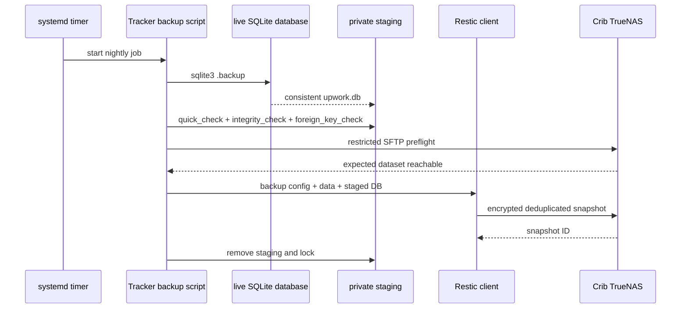
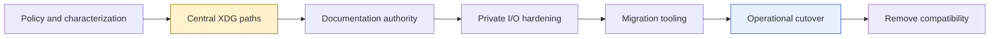

# PROJECT REPORT - Upwork Tracker Self-Containment - XDG State and WAL-Safe Restic Backups

Upwork Tracker is a local-first marketplace research and application-workflow system. It stores captured job evidence, workflow state, project evidence, proposal versions, form observations, application transitions, and private operator facts in SQLite. Its Go commands capture and ingest evidence; an embedded xgoja application exposes human and agent interfaces; a React frontend renders Widget IR; and native delivery commands produce decision sheets, printable layouts, and other operator artifacts.

This report documents the work required to separate that product from its private operational state and then protect the state with an encrypted Restic backup. The core engineering problem was not moving a single database file. It was defining which facts belong to source control, which belong to the operator, which SQLite tables may be rebuilt, which state must survive projection replay, how every command selects its database, and how a WAL-mode database can be backed up without creating a filesystem copy that only appears recoverable.

The implemented minimum viable backup is intentionally smaller than the full recovery design. Tracker configuration and data now use private permissions. A dedicated script creates a validated SQLite logical snapshot, excludes the live DB/WAL/SHM files, and sends the logical snapshot plus the XDG configuration and data tree to the existing encrypted Crib Restic repository. A user systemd timer retries nightly. The first run processed 271 files and 89.153 MiB in 23 seconds and created snapshot `a84b98e9` with tags `upwork-tracker,laptop-f`.

> [!summary]
> - A Git checkout is replaceable source; databases, captures, proposals, receipts, and reports are private operational state. The two must not share an implicit working-directory boundary.
> - Tracker's persistence model separates immutable observations, rebuildable remote projections, and locally owned workflow state. Backup and migration procedures must preserve that ownership model.
> - SQLite WAL files cannot be treated as ordinary backup inputs. Every Restic run creates a consistent database through SQLite `.backup`, validates it, and archives the logical snapshot instead.
> - The MVP reuses the existing encrypted Restic repository, excludes live SQLite sidecars from the whole-home backup, and runs nightly through systemd. Restore drills and additional health infrastructure are deliberately deferred for this low-usage application.

## 1. The project and the boundary problem

The standalone Tracker repository is:

```text
/home/manuel/code/wesen/go-go-golems/upwork
```

The self-containment ticket is:

```text
/home/manuel/code/wesen/go-go-golems/upwork/ttmp/2026/07/25/
  UPWORK-TRACKER-SELF-CONTAINMENT-2026-07-25--
  make-upwork-tracker-self-contained-and-separate-operational-state/
```

A source repository should answer four questions without access to the operator's private environment:

1. How is the product built?
2. How does the architecture work?
3. How can tests run with wholly fictional data?
4. Which external inputs and optional tools are required at runtime?

It should not contain the operator's live answers to a different set of questions:

- Which jobs were captured today?
- Which proposal was written for a particular client?
- Which private profile facts support that proposal?
- What is the current application state?
- Which browser form was filled?
- Which database contains the current workflow history?

The repository had already been extracted from `claw-stuff`, and most current implementation and documentation lived in the standalone project. The remaining problem was incomplete separation. Repository-local database and capture-shaped files still existed in the checkout. Several scripts and documents assumed `upwork.db` relative to the current directory. `tracker.example.yaml` contained machine-specific paths. The root `PLAYBOOK.md` described the repository as an operational base even though focused help pages documented external state paths.

The desired invariant can be stated precisely:

> Cloning the repository must not discover live operational data. Deleting the repository must not destroy operational data. Running tests must not read or mutate live operational data. Installing the binary must not require `claw-stuff` or a developer-specific absolute path.

This invariant is stricter than adding files to `.gitignore`. Ignored files still live inside the checkout. They can be force-added, deleted with the repository, captured by broad filesystem backups, or selected implicitly by a process that uses the current directory. Ignore rules are useful as defense in depth, but they do not define runtime ownership.

## 2. Current system architecture

Understanding the state boundary requires understanding the complete command and persistence path. Upwork Tracker is not one Go process with a few SQL statements. It combines native Go commands, a generated xgoja host, JavaScript services, stable automation APIs, Widget UI routes, a React shell, and embedded documentation.

```mermaid
flowchart TD
    Marketplace[Upwork and Freelancer pages] --> Surf[Surf browser capture]
    Surf --> Capture[Native capture commands]
    Capture --> Evidence[Immutable capture envelopes and files]
    Evidence --> Ingestion[Go ingestion and importer]
    Ingestion --> DB[(SQLite)]

    DB --> Projection[Deterministic remote projection]
    DB --> Store[JavaScript store.js]
    Store --> Service[agent-service.js]
    Store --> Pages[pages.js Widget IR]

    Service --> Rest[/api/v1 REST API]
    Service --> CLI[Explicit-DB agent CLI]
    Pages --> Widget[/api/widget]
    Widget --> React[React frontend]

    DB --> Delivery[Native delivery commands]
    Delivery --> Reports[Decision sheets, Almanach, PDF, reMarkable]

    style DB fill:#e6ffe6,stroke:#27802c
    style Evidence fill:#e7f0ff,stroke:#315fbd
    style Service fill:#fff2cc,stroke:#9a7300
    style Reports fill:#f3e8ff,stroke:#75439c
```

### 2.1 The Go composition root

`cmd/tracker/main.go` is the application composition root. It loads Tracker configuration, constructs the generated xgoja runtime, configures the application database, and attaches native command trees. Those command trees include capture, import, ingestion, projection, reconciliation, audit, delivery, and agent-session operations.

The thin `cmd/import-upwork/main.go` compatibility entrypoint delegates to the same importer command constructor. This detail matters for self-containment: compatibility binaries must use the same database resolution rules as the primary binary. A secondary entrypoint that falls back to `./upwork.db` can silently recreate the state/source coupling after the main binary has been fixed.

### 2.2 Capture does not mean import

`internal/capturecmd/capturecmd.go` treats Surf output as evidence. Search, detail, and availability capture commands write files and manifests. They do not silently mutate the Tracker database. This preserves a reviewable boundary between remote observations and local state changes.

The newer canonical ingestion path lives in `internal/ingestion/ingestion.go`. A capture envelope includes versioned metadata, marketplace identity, records, compensation, descriptions, and raw evidence. Validation checks required fields and enum values, derives canonical IDs, and computes a content fingerprint before apply.

The simplified flow is:

```text
function ingest(envelope):
    validate schema version
    validate marketplace and capture kind
    validate every record
    compute deterministic fingerprint

    begin transaction
    store capture run
    store valid immutable observations
    store explicit rejection diagnostics
    commit
```

A rejected record remains visible as a diagnostic. The importer does not silently discard malformed evidence, and it does not allow the source adapter to define canonical identity arbitrarily.

### 2.3 Canonical identity

Jobs use IDs of the form:

```text
<marketplace>:<remoteId>
```

For example:

```text
upwork:022080229229205727145
```

`internal/importer/database.go` rejects unprefixed or mismatched identities. The prefix is not presentation decoration. It prevents collisions between marketplaces and makes the source of a remote identifier explicit in every relationship, audit entry, proposal version, and application transition.

### 2.4 Immutable evidence, rebuildable projection, local state

The most important database design is the separation of three ownership classes.

| Ownership class | Examples | Mutation rule | Recovery rule |
|---|---|---|---|
| Immutable evidence | Capture runs, capture observations, import rejections | Append new evidence | Preserve and replay |
| Rebuildable remote projection | Job title, compensation, description, normalized skills, search index | Recompute from observations | Delete and rebuild safely |
| Locally owned workflow | Shortlist, triage, tags, proposal lifecycle, operator facts, audit logs | Explicit bounded mutations | Preserve exactly |

`internal/projection/projection.go` implements this split. It chooses the best observation by completeness and recency, rebuilds remote columns and full-text search, and leaves local workflow state intact.

```text
function rebuildProjection(database):
    begin transaction

    ensure every observed identity has local-state seed
    delete remote projection
    delete normalized remote skills
    delete remote search index

    for each canonical identity:
        winner = chooseBestObservation(identity)
        writeRemoteProjection(winner)
        writeNormalizedSkills(winner)
        updateOnlyRemoteCompatibilityColumns(winner)

    rebuildFullTextSearch()
    commit
```

This distinction controls both migration and backup. A projection can be regenerated if its implementation changes. A proposal version, a human triage decision, or a confirmed application event cannot be reconstructed from a marketplace page. The backup must protect the complete database because the locally owned rows are primary records, even though some other tables are derived.

## 3. The embedded application and API layers

The generated runtime is described by `xgoja.yaml`. It embeds JavaScript verbs, help Markdown, frontend assets, filesystem providers, SQLite modules, HTTP integration, Widget DSL support, and runtime identity. Generated Go under `internal/xgojaruntime` is an artifact; contributors change source providers and regenerate rather than editing generated host code.

The JavaScript application follows a store/service/adapter structure:

```mermaid
flowchart LR
    DB[(SQLite)] --> Store[verbs/lib/store.js]
    Store --> Service[verbs/lib/agent-service.js]
    Service --> API[verbs/lib/agent-api.js]
    Service --> AgentCLI[verbs/agent-cli.js]
    Store --> Pages[verbs/lib/pages.js]
    API --> REST[/api/v1]
    AgentCLI --> Shell[Generated Glazed commands]
    Pages --> Widget[/api/widget]

    style DB fill:#e6ffe6,stroke:#27802c
    style Service fill:#fff2cc,stroke:#9a7300
```

The REST and direct CLI transports do not implement their own SQL policy. Both call the same service. This gives optimistic concurrency, idempotency, pagination, validation, and application lifecycle operations one implementation.

The direct agent CLI intentionally requires an explicit database path. An interactive server may load a configured application database once at startup. A coding agent running a mutation command should not rely on whatever database happens to be selected by its current directory. The explicit path is a safety property and remains stricter than ordinary native command configuration.

### 3.1 Application lifecycle and remote-action truth

Tracker separates proposal preparation from remote marketplace outcome:

```text
shortlisted
    -> planning
    -> drafting
    -> review
    -> ready
    -> verified draft receipt
    -> human remote submission
    -> confirmed local submission record
```

A draft receipt means that approved material was visible and verified in a form. It does not prove that Upwork accepted the application. Audit logs describe local Tracker activity. They do not prove Connects spending or a remote state transition. Only a human-confirmed operation records submission.

This boundary is relevant to state placement because proposal bodies, receipts, form observations, and operator facts are private. They belong under operator-controlled storage and in the private database, not in test fixtures or repository examples.

## 4. Why XDG is the correct runtime boundary

The XDG base-directory model distinguishes configuration, durable data, persistent state, cache, and runtime objects. Those classes correspond well to Tracker's operating requirements.

```text
~/.config/upwork-tracker/
  config.yaml

~/.local/share/upwork-tracker/
  upwork.db
  private/
    captures/
    upwork-proposals/
    ops/
    db-backups/

~/.local/state/upwork-tracker/
  restic-backup.log
  temporary backup staging during a run

~/.cache/upwork-tracker/
  regenerable rendering or extraction cache

${XDG_RUNTIME_DIR}/upwork-tracker/
  locks, sockets, and PIDs
```

The categories have different backup semantics:

| XDG class | Durable | Backup | Typical permissions |
|---|---:|---:|---:|
| Configuration | Yes | Yes | directory `0700`, file `0600` |
| Data | Yes | Yes | directory `0700`, files `0600` |
| State | Sometimes | Selectively | directory `0700`, files `0600` |
| Cache | No | No | private but regenerable |
| Runtime | No | No | session-scoped, `0700` |

A central path resolver should apply one precedence rule everywhere:

```text
explicit flag
    > environment override
    > layered configuration
    > XDG-derived default
```

The resolver should return both the path and its provenance. A diagnostic such as `upwork-tracker config paths --output json` can then report that the database came from an explicit flag, a configuration file, or the XDG default without exposing any database content.

A proposed Go API is:

```go
type Source string

const (
    SourceFlag    Source = "flag"
    SourceEnv     Source = "environment"
    SourceConfig  Source = "configuration"
    SourceDefault Source = "xdg-default"
)

type ResolvedValue struct {
    Value  string
    Source Source
}

type Paths struct {
    ConfigDir  string
    DataDir    string
    StateDir   string
    CacheDir   string
    RuntimeDir string
    Database   string
}

func Resolve(env Environment, flags Flags, cfg Config) (Paths, Provenance, error)
```

The current project still has implementation work remaining here. `internal/trackerconfig/config.go`, Make targets, devctl configuration, and some commands retain CWD-relative or machine-specific defaults. The report distinguishes the implemented operational state and backup from the unfinished product-level path cleanup. The database already lives under `~/.local/share/upwork-tracker`, but every executable path has not yet been proven independent of the checkout.

## 5. Repository self-containment is selective, not additive

The investigation found several scripts and historical guides in `claw-stuff` that appeared relevant. Current source inspection showed that most behavior had already been productized.

| Historical helper | Current product owner |
|---|---|
| `capture_upwork_search.sh` | `upwork-tracker capture search` |
| `capture_upwork_job_details.sh` | `upwork-tracker capture detail` |
| `check_upwork_job_availability.sh` | `upwork-tracker capture availability` |
| `generate_recent_upwork_decision_sheets.py` | `deliver decision-sheets` |
| `generate_upwork_almanach_recent_jobs.py` | `deliver almanach recent` |
| `generate_single_job_almanach_detail.py` | `deliver almanach detail` |
| `pi_upwork_tmux_agent.sh` | `agent start` and `agent steer` |

Copying those scripts would reintroduce two implementations and restore obsolete assumptions about paths and schema. The correct migration unit is durable knowledge that current docs still lack:

- WAL-safe database backup and recovery rules;
- proposal-form verification requirements;
- documentation authority and ADRs;
- privacy-safe minitrace guidance;
- repository cleanliness and release checks.

Private historical artifacts remain excluded:

- live captures and job contexts;
- proposal drafts and operator facts;
- database backups and WAL files;
- form receipts and transition results;
- screenshots and generated reports;
- prompts, transcripts, and minitrace archives.

The product uses fictional `testdata/fixture` records for examples and smoke tests. Real operator data does not become documentation material merely because it illustrates a feature well.

## 6. The documentation authority problem

The standalone repository already contains focused embedded help. `upwork-tracker help upwork-tracker-user-agent-guide` is the conceptual entrypoint, and additional pages cover fetch/import, shortlist preparation, operator facts, proposal lifecycle, safe agent workflow, CLI, REST, schema, and development.

The root `PLAYBOOK.md` conflicts with that system. It describes repository-local operational paths, references helper scripts absent from the standalone repository, copies DB/WAL/SHM files directly, and writes private reports beneath the checkout. A new contributor has no reliable way to decide whether the monolithic playbook or embedded help is authoritative.

The proposed hierarchy is:

1. Generated command help defines executable flags and schemas.
2. The user-agent guide defines the conceptual workflow.
3. Focused embedded help defines safe procedures.
4. Schema and developer guides define persistence and code ownership.
5. ADRs preserve durable decisions.
6. Tickets and diaries preserve investigation history.
7. The root README navigates.
8. The root playbook is retired or reduced to a compatibility index.

This is not only editorial structure. Unsafe documentation can cause destructive behavior even when code is correct. A raw filesystem copy instruction for a WAL database can create a backup that exists, has a plausible size, and fails only during recovery.

## 7. The SQLite WAL backup problem

The authoritative operational database was found at:

```text
/home/manuel/.local/share/upwork-tracker/upwork.db
```

At backup time the XDG tree was approximately 90 MiB. The database itself was approximately 56.9 MiB and had active `upwork.db-wal` and `upwork.db-shm` sidecars. SQLite `PRAGMA quick_check` returned `ok`.

A broad home-directory Restic job already included the XDG tree. That did not make the database safely backed up. Restic opens and reads filesystem objects independently. It could observe:

```text
upwork.db      at T1
upwork.db-wal  at T2
upwork.db-shm  at T3
```

WAL mode allows committed transactions to remain in the WAL before checkpointing into the main database. The three files read at different times are not guaranteed to describe one coherent SQLite state. A backup tool's snapshot abstraction does not automatically create an application-level transaction boundary.

The minimum safe operation is SQLite's online backup:

```bash
sqlite3 "$LIVE_DB" ".backup '$SNAPSHOT_DB'"
```

The online backup API reads committed database state, including committed WAL content, and writes a single ordinary SQLite database. The snapshot can then be validated:

```bash
sqlite3 "$SNAPSHOT_DB" 'PRAGMA quick_check;'
sqlite3 "$SNAPSHOT_DB" 'PRAGMA integrity_check;'
sqlite3 "$SNAPSHOT_DB" 'PRAGMA foreign_key_check;'
```

The first two commands must return `ok`. The foreign-key check must produce no rows. Only then is the snapshot accepted as a Restic source.



## 8. The implemented MVP

The original design included dedicated backup commands, synthetic WAL fixtures, restore drills, repository health checks, a possible dedicated dataset, explicit retention policy, and absence-of-success monitoring. Those are defensible controls, but they were not necessary to protect a low-usage application immediately.

The accepted MVP has six properties:

1. Tracker source directories are private.
2. Every backup creates a fresh logical SQLite snapshot.
3. Every snapshot passes basic SQLite validation.
4. The whole-home backup excludes the live DB/WAL/SHM files.
5. A dedicated Restic invocation archives Tracker configuration, data, and the staged snapshot.
6. A nightly timer retries after ordinary failures.

The implementation lives outside product source because it contains machine-specific operational configuration:

```text
/home/manuel/.local/bin/restic-upwork-tracker-backup
/home/manuel/.config/systemd/user/restic-upwork-tracker-backup.service
/home/manuel/.config/systemd/user/restic-upwork-tracker-backup.timer
/home/manuel/.config/restic/crib/excludes
```

The script reuses the existing protected Restic environment at `~/.config/restic/crib/env`. It does not print repository credentials or the Restic password.

### 8.1 Private source permissions

Before the change, several Tracker private directories were mode `0775`, and `server.log` was mode `0664`. The implementation normalized Tracker configuration and data directories to `0700` and files to `0600`.

```text
700 ~/.config/upwork-tracker
600 ~/.config/upwork-tracker/config.yaml
700 ~/.local/share/upwork-tracker
600 ~/.local/share/upwork-tracker/upwork.db
700 ~/.local/state/upwork-tracker
700 ~/.local/bin/restic-upwork-tracker-backup
```

The executable is mode `0700` rather than `0755` because it is operator-specific and does not need to be readable by other local users.

### 8.2 Exact global exclusions

The broad laptop backup now excludes:

```text
/home/manuel/.local/share/upwork-tracker/upwork.db
/home/manuel/.local/share/upwork-tracker/upwork.db-wal
/home/manuel/.local/share/upwork-tracker/upwork.db-shm
```

Exact paths matter. A broad `*.db` rule would hide unrelated databases that may be valid backup inputs. The exclusions express one specific ownership decision: these live SQLite files are replaced by the logical snapshot generated by the dedicated job.

### 8.3 Backup script structure

The script uses `set -euo pipefail` and `umask 077`. It acquires a local lock, prepares staging, validates the snapshot, loads the protected Restic environment, performs an SFTP preflight, and invokes Restic.

The key control flow is:

```text
function backupTracker():
    resolve XDG config, data, and state paths
    create state directory with mode 0700
    acquire lock directory or exit successfully if already running
    register cleanup trap

    require sqlite3, restic, live DB, and protected Restic environment

    recreate private staging
    run SQLite online backup
    require quick_check == ok
    require integrity_check == ok
    require foreign_key_check is empty

    load Restic environment without printing values
    require password file is readable
    require SFTP preflight reaches exact TrueNAS dataset

    backup:
        staged logical database
        Tracker configuration
        Tracker data tree
    exclude:
        live database
        live WAL
        live SHM
    tag snapshot:
        upwork-tracker
        laptop-f

    cleanup staging and lock on success or failure
```

The cleanup trap is important because retry semantics depend on a failed run not leaving a stale lock. The persistent log remains under `~/.local/state/upwork-tracker/restic-backup.log`; staging and lock directories are removed.

### 8.4 Fail-closed transport

The script uses the established Crib SFTP preflight:

```bash
ssh -i "$HOME/.ssh/id_restic_crib_f" \
  -o BatchMode=yes \
  -o IdentitiesOnly=yes \
  -o ConnectTimeout=10 \
  backup-f@192.168.0.25 \
  'test -d /mnt/media-pool/backups/laptops/f-restic'
```

There is no NFS or local-directory fallback. If TrueNAS is unavailable, authentication fails, or the expected dataset is absent, the job exits. This prevents a backup from succeeding against an unintended local path.

Restic receives SFTP arguments through its backend option:

```bash
restic -o "sftp.args=${RESTIC_SFTP_ARGS}" backup ...
```

A successful standalone `sftp` command does not prove that Restic's SFTP backend is configured correctly. The backend option is part of the known working Crib configuration documented in [[PLAYBOOK - Restic Backups to the Crib NAS]].

## 9. First backup evidence

The supervised run began by creating and validating the logical SQLite snapshot:

```text
[2026-07-26T15:17:17-04:00] creating WAL-safe SQLite snapshot
[2026-07-26T15:17:18-04:00] SQLite snapshot validation passed
[2026-07-26T15:17:19-04:00] starting encrypted Restic backup
```

Restic reported:

```text
Files:         271 new,     0 changed,     0 unmodified
Dirs:           24 new,     0 changed,     0 unmodified
Added to the repository: 3.396 MiB (456.964 KiB stored)

processed 271 files, 89.153 MiB in 0:23
snapshot a84b98e9 saved
```

A subsequent snapshot query confirmed:

| Field | Value |
|---|---|
| Snapshot | `a84b98e9` |
| Host | `f` |
| Tags | `upwork-tracker`, `laptop-f` |
| Paths | Tracker config, Tracker data, staged logical DB |
| Logical size | 89.153 MiB |
| Stored bytes for new snapshot | 456.964 KiB |
| Duration | 23 seconds |

The large difference between logical and stored size is expected. The machine repository already contained much of the data through the broad home backup, and Restic deduplicated content. The new snapshot's purpose is not to duplicate every byte. It establishes a consistent logical database object and an explicit Tracker recovery unit.

After completion, the state directory contained only the persistent log. Staging and lock directories were gone.

## 10. Scheduling and retry semantics

The dedicated systemd user service is intentionally simple:

```ini
[Unit]
Description=Restic backup of Upwork Tracker XDG state to crib TrueNAS
Wants=network-online.target
After=network-online.target

[Service]
Type=oneshot
ExecStart=%h/.local/bin/restic-upwork-tracker-backup
Nice=10
IOSchedulingClass=best-effort
IOSchedulingPriority=7
```

The timer runs after the general laptop backup window:

```ini
[Unit]
Description=Nightly Restic backup of Upwork Tracker XDG state

[Timer]
OnCalendar=*-*-* 04:30:00
Persistent=true
RandomizedDelaySec=30m

[Install]
WantedBy=timers.target
```

`Persistent=true` allows systemd to run the job after the laptop resumes if it missed the scheduled time. `RandomizedDelaySec` avoids making every backup job start at one exact instant. The local lock prevents overlap between two Tracker invocations. Restic's repository lock provides a final repository-level guard if another Restic job is still active.

The retry model is ordinary and observable:

- A failed SQLite check exits nonzero.
- A failed SFTP preflight exits nonzero.
- A failed Restic process exits nonzero.
- The systemd service records failure.
- The next timer invocation starts a fresh staging directory and tries again.

No automatic retry loop runs continuously. For a low-usage application with a small state tree, nightly retry is sufficient for the accepted MVP.

## 11. What the MVP deliberately omits

The design ticket retains a fuller recovery program, but the running implementation does not currently include:

- automatic isolated restore tests;
- a dedicated Tracker Restic repository or TrueNAS dataset;
- Tracker-specific prune policy;
- sampled or full repository checks in the dedicated script;
- stale-success alerting;
- offsite replication;
- a native `upwork-tracker backup snapshot` command;
- a synthetic WAL-to-Restic integration test in product CI.

These omissions are explicit rather than accidental. The application has low usage, the state tree is small, an encrypted machine repository already exists, and the first supervised snapshot completed successfully. The operational objective was to stop archiving live WAL sidecars and establish a consistent nightly snapshot quickly.

The decision should be revisited if any of these conditions change:

- proposal or application volume increases materially;
- Tracker becomes a shared service;
- loss of recent state becomes expensive;
- the database grows enough to make online backup duration significant;
- retention or access rules diverge from the laptop repository;
- backup failures become frequent or remain unnoticed;
- a compliance requirement demands recovery evidence.

## 12. Failure modes and their controls

### 12.1 Live WAL files are included by another backup path

**Symptom:** A snapshot contains `upwork.db`, `upwork.db-wal`, and `upwork.db-shm` directly.

**Control:** Keep exact exclusions in the shared Restic exclude file. Search backup configuration after changing XDG paths.

### 12.2 The logical snapshot fails validation

**Symptom:** `quick_check` or `integrity_check` is not `ok`, or `foreign_key_check` returns rows.

**Control:** Stop before Restic. Preserve the live database. Investigate database health separately. Never fall back to copying live files.

### 12.3 A stale lock suppresses future backups

**Symptom:** Every timer run logs that a backup is already running when no process exists.

**Control:** Register cleanup with a shell trap. A future hard-kill or machine crash can still leave the directory, so the script may later need PID-aware stale-lock recovery if this occurs in practice.

### 12.4 The NAS path is unavailable

**Symptom:** SSH preflight or Restic SFTP initialization fails.

**Control:** Exit. Do not write to an NFS mount or local fallback. Retry at the next timer invocation.

### 12.5 The general backup and Tracker backup overlap

**Symptom:** Restic reports a repository lock.

**Control:** Schedule Tracker after the broad laptop job. Treat repository locking as the final guard. If overlap becomes frequent, move the timer later rather than adding aggressive lock deletion.

### 12.6 Private permissions break another service

**Symptom:** A process running under another account cannot open the Tracker data or log.

**Control:** Tracker is currently user-owned and should run as Manuel. If service ownership changes, define a dedicated group and explicit access policy rather than reverting the full tree to `0775` or files to `0664`.

### 12.7 The Restic password is lost with the machine

**Symptom:** The repository exists but cannot be decrypted after source-machine loss.

**Control:** Escrow the Restic password outside both the source machine and NAS, as defined by the Crib backup playbook. Backing up the password only inside the repository creates a circular recovery dependency.

### 12.8 Documentation again teaches repository-local state

**Symptom:** A new README command uses `./upwork.db`, or generated reports are written under the checkout.

**Control:** Establish focused embedded help as authority and add CI scans for repository-local state examples, machine-specific home paths, database artifacts, captures, proposals, and transcripts.

## 13. The remaining product implementation

The backup is operating, but the broader self-containment ticket remains active. The most important remaining product work is:

1. Replace or retire the stale root `PLAYBOOK.md`.
2. Add a documentation authority map.
3. Centralize XDG path resolution in product code.
4. Remove machine-specific optional-tool defaults.
5. Add portable configuration examples.
6. Add proposal-form verification guidance based only on generalized rules.
7. Add ADRs for source/state ownership, explicit agent DB selection, human-confirmed submission, WAL-safe backups, and minitrace privacy.
8. Add repository privacy gates and neutral-CWD CI tests.
9. Move residual operational artifacts out of the standalone checkout after verification.

The architecture guide proposes a phased sequence:



The current operational database already uses the XDG data path, but this does not prove every binary, devctl command, Make target, and server startup uses one centralized resolver. Characterization tests should precede default changes.

## 14. Testing the final self-contained product

The complete test strategy should run with temporary HOME and XDG roots from a neutral working directory. A test that runs only from the repository root can accidentally validate CWD coupling.

```text
function selfContainmentTest():
    create temporary HOME
    create temporary XDG_CONFIG_HOME
    create temporary XDG_DATA_HOME
    create temporary XDG_STATE_HOME
    create temporary XDG_CACHE_HOME
    change working directory outside checkout

    build Tracker
    create fictional fixture database
    run importer and projection
    run direct agent CLI with explicit fixture DB
    run REST and Widget smoke tests

    assert no upwork.db exists in working directory
    assert no operational artifact exists in checkout
    assert no API response exposes host paths
    assert git worktree remains clean except known generated outputs
```

A future backup integration test can use a disposable local Restic repository and fictional WAL database. It need not contact TrueNAS or expose operational credentials:

```text
create fixture DB in WAL mode
commit rows while WAL remains active
run logical snapshot wrapper
validate snapshot
restic backup snapshot to temporary local repository
restic restore into isolated directory
validate restored SQLite database
open restored database through explicit Tracker CLI path
```

This test is deferred from the MVP but remains the correct product-level proof if backup behavior moves into the repository.

## 15. Engineering decisions

### 15.1 Source and operational state have separate owners

Git owns product source, documentation, build metadata, tests, and fictional fixtures. The operator owns databases, captures, proposals, receipts, evidence, reports, and logs. This decision makes source replaceable and private data independently backupable.

### 15.2 Projection does not own local workflow

Remote projection tables can be rebuilt from immutable observations. Locally owned state cannot. Projection code updates only remote-owned columns and search structures.

### 15.3 Agent mutations retain explicit database selection

The direct agent CLI continues to require a DB path even after native commands gain XDG defaults. Explicit selection prevents automation from mutating a database chosen by current-directory coincidence.

### 15.4 Proposal submission remains human-confirmed

Drafts, form observations, receipts, and submissions remain distinct. Backup logs and local audit records do not become proof of remote action.

### 15.5 SQLite produces the backup object

Restic transports and encrypts the snapshot. SQLite defines the transactionally valid database object. The backup wrapper does not ask Restic to infer application consistency from filesystem sidecars.

### 15.6 The existing Restic repository is sufficient for the MVP

A dedicated repository would add credentials, provisioning, quota, retention, and monitoring. The existing encrypted per-machine repository already provides a restricted SFTP path and deduplication. Tags identify the Tracker recovery unit.

### 15.7 Retry is adequate at current usage

The application has low write volume. A failed nightly run can be retried manually or at the next timer invocation. The implementation therefore does not add continuous retries or a monitoring service yet.

## 16. Concrete file reference

### Product repository

```text
/home/manuel/code/wesen/go-go-golems/upwork/
```

Key files:

- `cmd/tracker/main.go` — application composition root.
- `cmd/import-upwork/main.go` — compatibility importer entrypoint.
- `internal/trackerconfig/config.go` — current layered configuration.
- `internal/capturecmd/capturecmd.go` — search, detail, and availability capture.
- `internal/importcmd/importcmd.go` — import command tree.
- `internal/ingestion/ingestion.go` — canonical capture validation and apply.
- `internal/projection/projection.go` — remote projection rebuild.
- `internal/importer/schema.go` — schema and migrations.
- `internal/importer/database.go` — canonical identity validation.
- `internal/delivercmd/delivercmd.go` — delivery integrations.
- `xgoja.yaml` — runtime providers and embedded sources.
- `verbs/lib/store.js` — SQLite data access.
- `verbs/lib/agent-service.js` — shared agent domain service.
- `verbs/lib/agent-api.js` — REST adapter.
- `verbs/agent-cli.js` — explicit-DB CLI adapter.
- `verbs/lib/application-lifecycle.js` — transition policy.
- `verbs/lib/pages.js` — Widget page composition.
- `web/src/main.tsx` — React shell.
- `testdata/fixture/README.md` — fictional fixture policy.

### Ticket documentation

- `design-doc/01-upwork-tracker-self-containment-analysis-design-and-implementation-guide.md`
- `design-doc/02-upwork-tracker-xdg-restic-backup-and-restore-design.md`
- `reference/01-investigation-diary.md`
- `tasks.md`
- `changelog.md`

### Local backup implementation

- `/home/manuel/.local/bin/restic-upwork-tracker-backup`
- `/home/manuel/.config/systemd/user/restic-upwork-tracker-backup.service`
- `/home/manuel/.config/systemd/user/restic-upwork-tracker-backup.timer`
- `/home/manuel/.config/restic/crib/excludes`
- `/home/manuel/.local/state/upwork-tracker/restic-backup.log`

## 17. Operational commands

Inspect the timer:

```bash
systemctl --user status restic-upwork-tracker-backup.timer
systemctl --user list-timers restic-upwork-tracker-backup.timer --no-pager
```

Run a backup manually:

```bash
~/.local/bin/restic-upwork-tracker-backup
```

Inspect the service log:

```bash
journalctl --user -u restic-upwork-tracker-backup.service --since today --no-pager
```

Inspect tagged snapshots after loading the protected Restic environment:

```bash
set -a
source "$HOME/.config/restic/crib/env"
set +a

restic -o "sftp.args=${RESTIC_SFTP_ARGS}" \
  snapshots --tag upwork-tracker
```

Do not print the sourced environment or password. Snapshot IDs, timestamps, hosts, tags, and path classes are sufficient non-secret operational evidence.

## 18. Working rules

The project now has a small set of rules that should remain stable:

- The Git checkout contains source and fictional fixtures, not live operational state.
- Every command must make database selection deterministic and inspectable.
- Direct agent mutations require an explicit database.
- Immutable remote observations and local workflow state have different ownership.
- Projection rebuilds may replace remote facts but must preserve local state.
- Proposal review and form verification do not mean submission.
- SQLite `.backup` creates the database artifact given to Restic.
- Live DB/WAL/SHM files remain excluded from the broad filesystem backup.
- The Restic repository password has independent recovery escrow.
- SFTP failure stops backup; there is no local fallback.
- The MVP retries nightly and does not claim stronger recovery evidence than it has.
- If Tracker usage grows, add restore testing and stale-success monitoring before adding more automation.

## 19. Current status

The operational backup MVP is complete and running. The first encrypted snapshot succeeded, the timer is enabled, private path permissions are normalized, and live SQLite sidecars are excluded from the general laptop backup.

The source repository self-containment project is still active. Architecture and migration designs are complete; documentation cleanup, centralized product path resolution, privacy gates, residual checkout-state cleanup, ADRs, and neutral-CWD validation remain open. The running backup reduces immediate data-loss risk while that product work proceeds.

The result is deliberately scoped. It establishes a consistent encrypted recovery unit without expanding a low-usage application into a large backup subsystem. The implementation can be extended when operational evidence justifies the additional controls.
