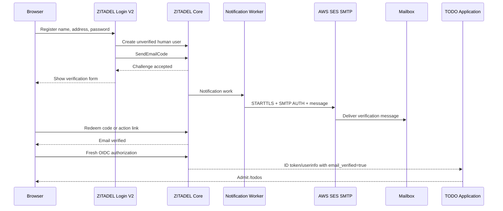
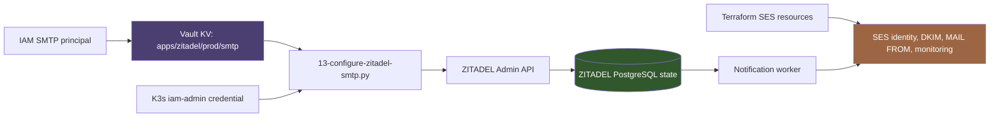

# ZITADEL SES SMTP: Vault-Backed Verification and Recovery on K3s

This report explains the production email path built for the ZITADEL-backed TODO application at `yolo.scapegoat.dev`. The implementation connects a self-hosted ZITADEL v4.16.1 deployment to an existing Terraform-managed AWS SES identity without storing SMTP credentials in Git, Terraform state, Argo CD manifests, or ordinary operational evidence. Vault owns the SMTP credential values. An explicit reconciliation program reads those values and configures one active ZITADEL email provider through the Admin API. Real signup verification and password recovery then establish whether the complete path works.

The work produced a useful distinction between three independent states: ZITADEL may require verification, ZITADEL may create a verification challenge, and an external mail system may deliver that challenge. None of these states proves the next. Login V2 issue `#12474` concerned the first boundary. PR `#11995` repaired challenge initiation behavior at the second boundary. The production incident encountered here occurred at the third boundary: Login V2 reported that a code had been sent while the notification worker had no SMTP provider and failed asynchronously.

This report is indexed from [[Research/KB/Projects/infrastructure-and-release]]. It is written as a technical account of the resulting system, its control planes, its failure semantics, and the evidence required to operate it safely.

> [!summary] Production result
>
> - ZITADEL v4.16.1 and Login V2 v4.16.1 run on K3s with `EMAIL_VERIFICATION=true`, trusted TLS, PostgreSQL, Argo CD, and Vault Secrets Operator.
> - Terraform owns the SES domain identity, DKIM, MAIL FROM domain, configuration set, monitoring, and IAM policy boundary. It does not store application SMTP credentials.
> - Vault path `kv/apps/zitadel/prod/smtp` owns the approved SES SMTP record. The record was seeded by streaming an existing approved credential in memory; no credential value entered Git or command output.
> - `13-configure-zitadel-smtp.py` converges one provider through the ZITADEL Admin API and emits only provider-created/provider-active booleans.
> - A real message reached `wesen@ruinwesen.com`, verification completed, OIDC login succeeded, and the TODO application admitted the identity only after `email_verified=true`.
> - Password recovery and the reset-confirmation message also arrived through SES. A cross-browser callback failed closed because the browser lacked the original state cookie; this was correct OIDC CSRF/PKCE enforcement, not a failed reset.
> - The supplied password and callback URL were later posted in chat. They must be treated as exposed. The password requires private rotation, and acceptance evidence must never retain passwords, codes, action links, callback codes, cookies, or raw notification logs.

## 1. Scope and evidence

The source implementation and design live in:

```text
/home/manuel/code/wesen/2026-07-25--zitadel-go-test/
  ttmp/2026/07/25/
    ZITADEL-002-IDENTITY-BILLING--.../
      design-doc/
        01-email-verification-recovery-billing-and-profile-management-architecture.md
      implementation-guide/
        02-production-k3s-zitadel-todo-and-vault-deployment-guide.md
      scripts/
        13-configure-zitadel-smtp.py
      sources/experiments/
        21-production-zitadel-smtp-provider.json
      reference/
        01-investigation-diary.md
```

The deployed platform is declared in:

```text
/home/manuel/code/wesen/2026-03-27--hetzner-k3s/
  gitops/applications/zitadel.yaml
  gitops/applications/zitadel-prereqs.yaml
  gitops/applications/todo-demo.yaml
  gitops/kustomize/zitadel/
  gitops/kustomize/todo-demo/
  vault/policies/kubernetes/
  vault/roles/kubernetes/
```

The SES control plane is in `/home/manuel/code/wesen/terraform/ses`. Its integration playbook is:

```text
/home/manuel/code/wesen/terraform/ttmp/2026/03/24/
  TF-002-SES-TERRAFORM--set-up-ses-with-terraform/
    playbook/02-ses-smtp-integration-playbook.md
```

The report relies on five evidence classes:

1. **Desired-state evidence.** GitOps manifests, Terraform SES resources, Vault policies, and the SMTP reconciliation source establish the intended ownership boundaries.
2. **Live provider evidence.** Sanitized Admin API search showed exactly one managed provider in `EMAIL_PROVIDER_ACTIVE` state.
3. **External delivery evidence.** The operator confirmed receipt of signup verification, password recovery, and reset-confirmation messages in an external mailbox.
4. **Application evidence.** After verification, a fresh OIDC login created an application session and `/todos` displayed the verified identity with the Free plan quota.
5. **Failure evidence.** Before SMTP deployment, the notification worker reported `Errors.SMTPConfig.NotFound`; after deployment, the same registration path produced no SMTP channel failures.

Raw email addresses are used only where the operator explicitly supplied the controlled acceptance mailbox. No SMTP username, password, ZITADEL PAT, verification code, action URL, authorization code, PKCE verifier, session cookie, or provider identifier belongs in this report.

## 2. The system has three independent email boundaries

Email verification is often described as one feature. In this deployment it consists of three state transitions owned by different components.

| Boundary | Owner | Success condition | What success does not prove |
| --- | --- | --- | --- |
| Verification policy | Login V2 and ZITADEL identity policy | The user remains unverified and the flow requires redemption | That a challenge was created or sent |
| Challenge initiation | Login V2 server action and ZITADEL user API | A verification challenge exists and notification work was requested | That an SMTP channel exists or delivery succeeded |
| Message delivery | ZITADEL notification worker and AWS SES | SES accepts and delivers the message to the external mailbox | That the user redeemed the challenge |
| Redemption | ZITADEL user state | The one-time code/link changes the email to verified | That the relying application accepted the new claim |
| Application authorization | TODO OIDC middleware | `email_verified=true` is present and protected routes admit the user | That future recovery messages will work |

The acceptance sequence must cross every row. A successful banner at the challenge-initiation boundary is not external delivery evidence. A message in the mailbox is not redemption evidence. A verified ZITADEL user is not application evidence until a new OIDC transaction returns the claim and the application enforces it.



This sequence also defines the logging boundary. The application may log request paths and status. The notification worker may log delivery status. Neither should log challenge codes, action links, rendered template arguments containing codes, SMTP credentials, or OIDC callback parameters.

## 3. Infrastructure ownership

The production path uses three control planes because their state has different lifecycle and secrecy requirements.

### 3.1 Terraform owns SES infrastructure

Terraform owns stable AWS resources:

- the `mail.scapegoat.dev` SES identity;
- DKIM configuration;
- the custom MAIL FROM domain `bounce.mail.scapegoat.dev`;
- the `mail-scapegoat-dev` configuration set;
- EventBridge publication;
- CloudWatch reputation alarms and SNS notification infrastructure; and
- least-privilege IAM policy intent for sending from the verified identity.

Terraform does not create or retain the SMTP access key secret. The SES SMTP username is an IAM access-key ID, and the SMTP password is derived from the corresponding secret access key for a specific AWS region. Both values are operational credentials. Storing either in Terraform inputs or provider-managed application resources would extend their lifetime into state snapshots, plans, logs, and state-reader permissions.

### 3.2 Vault owns SMTP values

The dedicated production record is:

```text
kv/apps/zitadel/prod/smtp
```

Its schema is explicit:

```text
host
port
username
password
from_address
from_name
reply_to
configuration_set
starttls
ssl
```

The deployed values use the SES `us-east-1` SMTP endpoint, port `587`, and STARTTLS. The sender and reply-to addresses belong to the verified SES identity. The implementation copied the already approved platform SES record into the dedicated path by streaming JSON through standard input and changing only the sender display name in memory.

This operation preserved two properties:

- ZITADEL has its own named Vault ownership boundary even when the underlying credential is currently shared.
- No secret value appeared in a shell argument, Git diff, Terraform plan, ticket artifact, or terminal output.

Credential reuse is operationally expedient but broadens impact. The long-term production posture should use a dedicated IAM SMTP principal for ZITADEL, with `ses:SendRawEmail` limited to the verified identity, followed by a controlled Vault update and revocation of the shared credential.

### 3.3 ZITADEL owns mutable provider state

ZITADEL stores email-provider configuration in its PostgreSQL-backed instance state. Argo CD cannot declare that state directly, and Terraform was deliberately excluded because its provider representation would persist the SMTP username in state. An explicit reconciliation operation bridges Vault and ZITADEL.



The reconciler is an explicit operator action rather than a sidecar. This gives the operation a bounded authorization interval and clear retry behavior. A scheduled reconciler can be added if credential rotation frequency or manual provider drift justifies another continuous control loop.

## 4. The reconciliation algorithm

`13-configure-zitadel-smtp.py` uses Python's standard library and existing `vault` and `kubectl` CLIs. It never accepts credential values as command-line arguments.

The program performs these steps:

```text
assert ZITADEL_ADMIN_URL uses HTTPS
read kv/apps/zitadel/prod/smtp from Vault
assert required fields exist and are non-empty
assert host is an approved AWS SES endpoint
assert port == 587 and STARTTLS == true
read chart-created iam-admin PAT from the Kubernetes Secret
POST /admin/v1/email/_search

if more than one managed provider exists:
    stop without mutation
if an unmanaged provider exists:
    stop and require an import/ownership decision
if no provider exists:
    POST /admin/v1/email/smtp
    POST /admin/v1/email/{id}/_activate
else:
    PUT /admin/v1/email/smtp/{id}

GET /admin/v1/email
assert active provider description matches the managed description
print only created, active, and secrets-emitted booleans
```

The SMTP request uses the current v4.16.1 API shape:

```json
{
  "senderAddress": "<Vault from_address>",
  "senderName": "<Vault from_name>",
  "tls": true,
  "host": "<Vault host>:<Vault port>",
  "user": "<Vault username>",
  "replyToAddress": "<Vault reply_to>",
  "description": "Vault-managed SES for The Scapegoat",
  "plain": {
    "password": "<Vault password>"
  }
}
```

The `plain` object is the modern authentication oneof. The older top-level password field is deprecated. The host must include the port. Updating an SMTP provider activates the updated configuration automatically; explicit activation is necessary only after creation.

Three failures during implementation established the actual API contract:

1. A jq validation expression changed context inside a pipeline and attempted to index a string as an object. Parenthesizing each comparison kept evaluation rooted at the response object.
2. Active-provider readback wraps the provider under `config`, while list results expose providers under `result`. The reconciler now handles the active endpoint's wrapper explicitly.
3. Activating an already active provider returns HTTP 400. The reconciler now activates only on creation and relies on update semantics for existing providers.

These failures matter because an idempotent script must implement the server's state transitions, not merely send the same requests repeatedly.

## 5. Login V2 issue #12474 and PR #11995

Issue `#12474` described Login V2 v4.15.3 self-registration bypassing email verification. The checked-in Login environment defaulted `EMAIL_VERIFICATION=false`, and the flow could proceed from registration to authentication without a verification screen. The application could then receive an identity associated with an address the user had not proven.

The production fix has two required parts:

```text
Login V2 image >= v4.16.1
EMAIL_VERIFICATION=true on the Login V2 container
```

PR `#11995` moved the initial verification send into an awaited server-side action and removed the fragile client-side `send=true` trigger. That repair prevents duplicate initial messages and code invalidation caused by repeated verification-page loads. It does not make SMTP delivery synchronous.

The distinction appeared directly during acceptance. Before the provider existed:

```text
Login V2: Verification email sent successfully
ZITADEL worker: Errors.SMTPConfig.NotFound
```

The first line meant that `SendEmailCode` completed. The second meant that the asynchronous notification worker could not construct a delivery channel. Login V2 displayed a success message even though no SMTP provider existed.

After provider deployment, the registration flow showed the verification screen, the worker reported no channel failures, and the external mailbox received the message. This proves that issue `#12474` was not the current failure: the gate worked. The missing provider was an independent operational defect. The UI's optimistic delivery language remains a potential upstream observability issue.

## 6. Production deployment sequence

The full deployment occurred in this order:

1. The K3s API was reached through the Tailscale kubeconfig rather than the disabled public API endpoint.
2. Argo CD deployed the official ZITADEL Helm chart `10.0.4` with ZITADEL and Login V2 v4.16.1.
3. Vault Secrets Operator supplied the database DSN, master key, and first-instance secret values.
4. cert-manager issued trusted certificates for `zitadel.yolo.scapegoat.dev` and `todo.yolo.scapegoat.dev`.
5. Login V2 was configured with `EMAIL_VERIFICATION=true`.
6. The TODO OIDC client was created through the Management API and stored at the application boundary without printing the client identifier in evidence.
7. The existing SES SMTP record was streamed into `kv/apps/zitadel/prod/smtp`.
8. The reconciliation program created and activated one managed provider.
9. A second run updated the same provider and proved that no duplicate was created.
10. A real user registered with the controlled mailbox, received the verification message, redeemed it, performed a fresh OIDC login, and reached `/todos`.
11. Password recovery delivered a reset message and a reset-confirmation message through SES.

The deployed provider itself is mutable ZITADEL state. The source of truth for its credential remains Vault, and the reconciliation program is the repeatable operation that restores that state.

## 7. Acceptance results

### 7.1 Signup verification

The controlled signup used `wesen@ruinwesen.com`. Before redemption, Login V2 displayed the verification form and did not complete the relying-party session. The external mailbox received the verification message. After the operator followed the message, a fresh login completed OIDC authorization and the application rendered:

```text
Signed in as Manuel Wesen
0 / 25 active TODOs
free plan
```

This proves the complete chain:

```text
unverified ZITADEL user
  -> SES delivery
  -> challenge redemption
  -> fresh OIDC transaction
  -> email_verified=true
  -> application authorization
```

The TODO application retains its own defense-in-depth check. It does not infer ownership from the mere presence of an email claim. Protected routes require `email_verified=true`, and local identity remains keyed by `(issuer, subject)` rather than by email.

### 7.2 Password recovery

The password-reset request delivered a real SES message. The reset form accepted a new password, and a separate reset-confirmation message arrived. These observations prove challenge generation, delivery, redemption, password mutation, and notification of the security-sensitive change.

The browser then displayed:

```text
failed to get state: http: named cookie not present
not authenticated
```

This occurred because the recovery/OIDC flow began in the agent-controlled browser and the email action opened in the operator's browser. OIDC state and PKCE cookies belong to the browser that initiated authorization. The operator's browser received a callback URL but did not possess the matching state cookie. The application rejected the callback before authentication.

That rejection is correct. Accepting a callback without the initiating state cookie would remove the CSRF binding. The reset itself had already succeeded, as confirmed by the reset-confirmation message. A fresh login initiated and completed in one browser is the correct follow-up.

```mermaid
sequenceDiagram
    participant A as Agent browser
    participant Z as ZITADEL
    participant M as Mailbox
    participant U as Operator browser
    participant T as TODO callback

    A->>Z: Start recovery within OIDC request
    Z->>M: Send reset action
    U->>Z: Open action and reset password
    Z->>M: Send reset confirmation
    Z->>T: Redirect with authorization response
    T-->>U: Reject: matching state cookie absent
    Note over T,U: Password reset succeeded; OIDC callback failed closed
```

### 7.3 Security cleanup

During the interactive test, the operator pasted a password and a callback URL containing a short-lived authorization code into chat. The password must be rotated privately and never reused. The authorization code was PKCE-bound and short-lived, but it must still be treated as exposed and allowed to expire.

The agent-generated initial password was held in a mode-`0600` ignored file, served briefly over a loopback-only local HTTP endpoint for Playwright, and destroyed after recovery began. The synthetic earlier test user and its temporary credential material were also removed.

## 8. Failure modes and diagnostic rules

| Symptom | Actual boundary | Diagnostic action | Correct response |
| --- | --- | --- | --- |
| Registration skips verification entirely | Login policy / Login V2 configuration | Check image version and effective `EMAIL_VERIFICATION` boolean | Upgrade to v4.16.1+ and enable the gate |
| UI says code sent, mailbox receives nothing | Notification delivery | Inspect sanitized worker error counts and SMTP provider state | Configure/test provider; do not accept the UI banner as evidence |
| `SMTPConfig.NotFound` | ZITADEL provider state | Query `/admin/v1/email/_search` | Run the Vault-backed reconciler |
| Multiple providers exist | Ownership ambiguity | Count and classify provider descriptions | Stop; make an explicit import/removal decision |
| Provider update succeeds but activation call fails | API state transition | Check whether provider is already active | Activate only after creation |
| Reset succeeds but callback reports missing state cookie | Cross-browser OIDC continuation | Compare initiating and completing browser contexts | Start a fresh login in one browser; never weaken state checks |
| Application rejects a user after verification | Claim/session freshness | Start a new OIDC authorization and inspect only claim booleans | Ensure `email_verified=true`; preserve the app gate |
| Codes appear in logs | Notification logging | Search securely for template-argument logging | Reduce log exposure and never retain raw lines in evidence |

The diagnostic sequence should proceed from policy to challenge to transport to redemption to application claim. Skipping directly to SMTP can conceal a disabled verification gate. Checking only ZITADEL user state can conceal an application that ignores `email_verified`.

## 9. Rotation and steady-state operation

SMTP credential rotation is an explicit sequence:

1. Create a replacement IAM access key for the dedicated ZITADEL SMTP principal.
2. Derive the region-specific SES SMTP password outside Terraform state.
3. Update `kv/apps/zitadel/prod/smtp` through standard input without printing values.
4. Run `13-configure-zitadel-smtp.py`.
5. Confirm one managed provider remains active.
6. Send a canary recovery message to a controlled mailbox.
7. Confirm the message and reset-confirmation delivery.
8. Revoke the superseded IAM access key.
9. Inspect SES bounce, complaint, and reputation telemetry.
10. Record only metadata, timing, and booleans in operational evidence.

The provider password is write-only in normal readback. A successful visible-field comparison cannot prove which password is stored. The current explicit sync always writes the current Vault password and then validates active-provider identity. A future scheduled reconciler should retain a password-derived desired-state hash in Kubernetes state, following the established Keycloak SMTP reconciler pattern, without storing the password itself.

## 10. Observability requirements

A production email system needs signals at each boundary:

- Login V2 registration and recovery request rates;
- notification-worker channel construction failures;
- SMTP authentication and transport errors;
- SES send, delivery, bounce, and complaint events;
- verification and recovery redemption outcomes;
- application denials caused by `email_verified=false`; and
- reconciler success/failure and provider-count drift.

Logs must be designed around event classes rather than rendered payloads. A safe notification log can contain the template type, provider class, result, and duration. It should not contain recipient addresses, template variables, challenge codes, action URLs, passwords, access tokens, authorization codes, or cookies.

The observed ZITADEL warning rendered translation arguments that included challenge context. That output was useful for diagnosis but violates the intended evidence boundary. Production logging configuration and upstream behavior should be reviewed so verification material cannot enter ordinary aggregation or ticket artifacts.

## 11. What remains

The central production path now works, but several hardening tasks remain:

- Rotate the password that was exposed in chat and prove a fresh same-browser login.
- Move from a shared SES SMTP credential to a dedicated ZITADEL IAM principal.
- Exercise invalid, expired, resent, and replayed verification and recovery challenges.
- Execute SMTP credential rotation and revoke the old key.
- Confirm configuration-set event publication for ZITADEL messages. ZITADEL's SMTP provider API does not expose arbitrary `X-SES-CONFIGURATION-SET` headers in the current configuration, so monitoring coverage must be verified rather than assumed.
- Inspect SES bounce/complaint evidence for the controlled sends.
- Decide whether to package the reconciler as a scheduled K3s Job with a narrower machine identity instead of the chart-generated IAM owner PAT.
- File or track an upstream issue if Login V2 continues claiming successful delivery when asynchronous provider delivery fails.

These are not reasons to discount the current result. They define the difference between a working production path and a fully rotated, continuously reconciled, exhaustively failure-tested email subsystem.

## 12. Working rules

- Treat verification policy, challenge initiation, SMTP delivery, redemption, and application authorization as separate acceptance boundaries.
- Keep SES infrastructure in Terraform and SMTP credential values in Vault.
- Do not put the SES access-key ID or derived SMTP password in Terraform state.
- Reconcile mutable ZITADEL provider state through an explicit, idempotent API operation.
- Refuse ambiguous provider ownership instead of creating duplicates.
- Require Login V2 v4.16.1+ and `EMAIL_VERIFICATION=true`.
- Preserve the application-level `email_verified` gate and `(issuer, subject)` identity key.
- Start and finish OIDC authorization in the same browser context.
- Never retain passwords, codes, action links, callback query strings, cookies, or raw notification payloads in reports.
- Accept email delivery only when a controlled external mailbox receives the message.

## 13. References

### Local implementation

- `/home/manuel/code/wesen/2026-07-25--zitadel-go-test/ttmp/2026/07/25/ZITADEL-002-IDENTITY-BILLING--plan-email-verification-recovery-stripe-subscriptions-and-profile-management-for-the-zitadel-go-webapp/implementation-guide/02-production-k3s-zitadel-todo-and-vault-deployment-guide.md`
- `/home/manuel/code/wesen/2026-07-25--zitadel-go-test/ttmp/2026/07/25/ZITADEL-002-IDENTITY-BILLING--plan-email-verification-recovery-stripe-subscriptions-and-profile-management-for-the-zitadel-go-webapp/scripts/13-configure-zitadel-smtp.py`
- `/home/manuel/code/wesen/2026-03-27--hetzner-k3s/docs/keycloak-vault-smtp-reconciler-pattern.md`
- `/home/manuel/code/wesen/terraform/ttmp/2026/03/24/TF-002-SES-TERRAFORM--set-up-ses-with-terraform/playbook/02-ses-smtp-integration-playbook.md`

### Upstream references

- [ZITADEL issue #12474: Login V2 self-registration skips email verification](https://github.com/zitadel/zitadel/issues/12474)
- [ZITADEL PR #11995: server-side initial verification send](https://github.com/zitadel/zitadel/pull/11995)
- [ZITADEL AddEmailProviderSMTP API](https://zitadel.com/docs/reference/api/admin/zitadel.admin.v1.AdminService.AddEmailProviderSMTP)
- [AWS SES SMTP credentials](https://docs.aws.amazon.com/ses/latest/dg/smtp-credentials.html)
- [AWS SES SMTP connection](https://docs.aws.amazon.com/ses/latest/dg/smtp-connect.html)

## Related notes

- [[Research/KB/Projects/infrastructure-and-release]]
- [[PROJ - Vault on K3s - Auth and Secret Delivery Platform]]
- [[ARTICLE - Vault OIDC for GitHub Actions - Secretless CI GitOps]]
