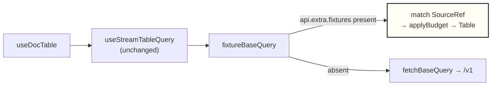
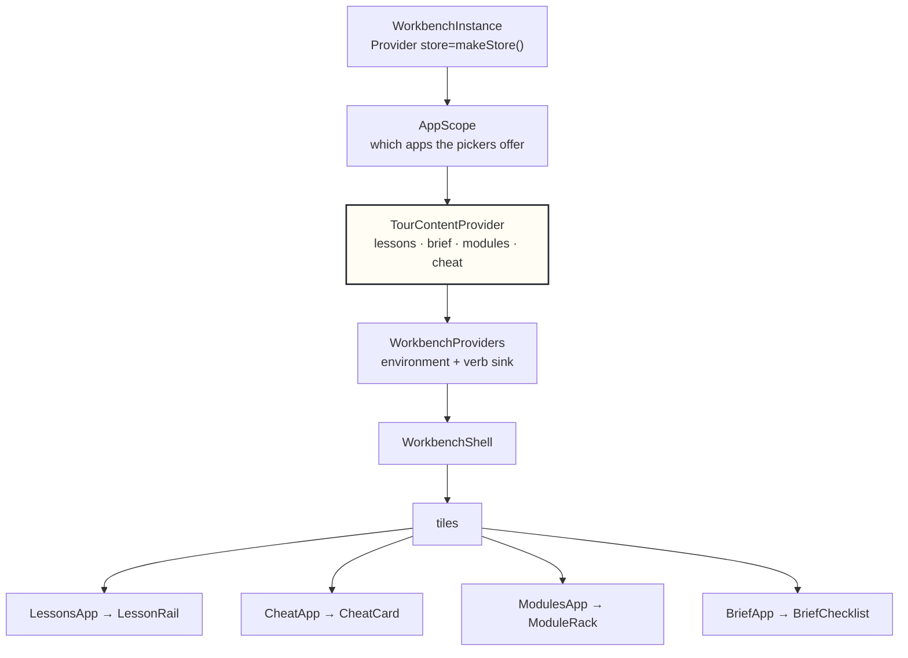

# PROJECT REPORT - go-go-datadrop v0.6 - Six Workbenches on One Page, and a Tutorial That Cannot Rot

This report explains the sixth layer of `go-go-datadrop`. [[PROJECT REPORT - go-go-datadrop v0.1 - Building an Append-Only Event Store from Two Reference Implementations|v0.1]] stores append-only events, [[PROJECT REPORT - go-go-datadrop v0.2 - Content-Addressed Datasets and the Staged Upload Protocol|v0.2]] stores immutable dataset versions, [[PROJECT REPORT - go-go-datadrop v0.3 - One Typed Table, and Four Defects Only a Browser Could Find|v0.3]] draws charts of both, [[PROJECT REPORT - go-go-datadrop v0.4 - Two Credentials, One Principal, and an Issuer That Is Not an Address|v0.4]] added people, and [[PROJECT REPORT - go-go-datadrop v0.5 - The Missing Middle, and Six Copies of One Style Object|v0.5]] finished the design system underneath all of it. This layer adds a tour: a scrolling page containing six complete, independent instances of the application, with lessons that mark themselves complete by observing state rather than by observing clicks.

The interesting work was not the page. It was discovering how much of the application had quietly assumed there would only ever be one of it, and then removing those assumptions one at a time under a test that could see them.

> [!summary]
> - A single `grep` established that multi-instance embedding was seven one-line changes rather than a rewrite: across the 246 source files that existed at the time there was exactly one runtime import of the store singleton.
> - Lesson completion is a predicate over `RootState`, never a button press, which makes any route to a goal count and makes every lesson unit-testable with no DOM.
> - A test that runs each lesson's "do it for me" button and then asks that lesson's own predicate found two broken lessons on its first execution.
> - Nine defects were found by opening the page in a browser after the build was green, including three classes of unreachable content that no test would plausibly have caught.

## The starting position

The application before this cycle was a tiled workbench: a workspace strip, a split tree of tiles, twenty-one registered applications sharing one world, and a presentation protocol underneath in which every visible object carries its type and therefore its verbs. It ran at one URL, filled the viewport, and read its data from a server that required an account.

The requirement was a prototype file, `pbui-landing.jsx`, 2 719 lines with no imports beyond React, containing five sandboxed copies of that workbench embedded in a marketing-and-teaching page. Its header comment states the thesis:

> Nothing here is a mockup. Each widget owns its own World, its own workspaces, its own accept plumbing. Lesson steps complete by OBSERVING world state, so any route to the goal counts — including ones this file never anticipated.

Two claims are doing the work and they pull in opposite directions. The first is that the tutorial is the application, with no demonstration mode and no fake data path — worth having because a walkthrough assembled from screenshots is wrong within a month and tells nobody. The second is that there are five of them on one page sharing nothing, and that is what forces architectural work. A tutorial *tile*, which the application already shipped, lives inside the one workbench and inherits the one world. Five workbenches need five worlds, and every piece of state reachable through a module-level import becomes a collision.

Stated precisely:

```
today:     one page  →  one store  →  one world  →  N tiles
required:  one page  →  N stores   →  N worlds   →  N × M tiles
```

## The census

The analysis phase produced a 1 617-line guide, but the sentence that determined the shape of the work came from one command:

```console
$ grep -rn 'from "[./]*store"' src .storybook test | grep -v 'import type'
src/main.tsx:9:import { store } from "./store";
```

Sixteen files named the store module. Fifteen imported only `type RootState` or `type AppDispatch`. **There was exactly one runtime import of the store singleton in the entire frontend**, and it was the entry point.

That fact converted the question from "how do we make the workbench embeddable" into "which seven lines have to move". The store had been written as a factory during v0.3 for an unrelated reason — Storybook needed a fresh store per story, because a `play` function that dispatched in one story must not leave state behind for the next — and the factory had been correct and unused ever since.

The general form of this is worth stating, because it is cheap and it is not habitual. Before designing a migration, measure how much of the thing being migrated actually depends on the property being removed. The answer here was one file. It could as easily have been ninety, and the design would have been different.

## The seven singletons

Each is a specific line with a specific failure mode. Enumerating the failures rather than the facts is what settled several design decisions later.

| # | Singleton | Location | Failure with five instances |
|---|---|---|---|
| 1 | `export const store` | `store/index.ts:79` | none yet — but the wrong import works |
| 2 | persistence key | `store/persist.ts:20` | **silent**: the user's real layout is overwritten by whichever tutorial section they last scrolled past |
| 3 | `height: 100vh` | `Workbench.module.css:5` | five viewport-height panels on a scrolling page |
| 4 | `?first=1` URL read | `Workbench.tsx:61` | five instances race for one query parameter; four discard their seeded layout |
| 5 | signed-out gate | `Workbench.tsx:41` | every embedded instance shows the sign-in tile to an anonymous visitor — which a landing page's visitor always is |
| 6 | data path | `useTable.ts:31` | the page needs a server, an account and a drop |
| 7 | seeded document | `store/index.ts:94` | correct behaviour, wrong place |

Four of the seven were in one file, and all four were *session* concerns — routing, authentication, persistence — that had ended up in the workbench shell because there was only ever one shell. Splitting the shell from the application was therefore not a new abstraction invented for this cycle. It was the separation those four lines had been implying since v0.4.

## What a factory is not

The store module exported a factory *and* an instance built beside it, restored from `localStorage` as a side effect of being imported. Removing the instance is the whole of the first change, and the reasoning is about availability rather than tidiness: a wrong import that works is a wrong import that will be written. A guard test now asserts the absence by shape rather than by name, so `export const workbench = makeStore()` fails too:

```ts
const instances = Object.entries(storeModule).filter(
  ([, v]) => typeof v?.dispatch === "function" && typeof v?.getState === "function",
);
expect(instances.map(([name]) => name)).toEqual([]);
```

A second guard walks the module graph and permits `import type` while forbidding a runtime import of the store value outside `main.tsx`. Both were verified by breaking them, which is the only evidence that a structural test constrains anything.

Persistence became a parameter rather than a module constant, and the default is the design decision. It could have defaulted to the application's key, which would have made the call sites quieter. That is the wrong direction, and writing out both failure modes settles it without argument:

```
default = the app's key            default = null
------------------------           ------------------------
forgot to opt out:                 forgot to opt in:
  the user's real layout is          the instance persists
  silently overwritten by a          nothing; its layout resets
  tutorial section they              on reload
  scrolled past
                                   recoverable, and visible the
  no error, no warning, no          first time you reload
  symptom until much later
```

The asymmetry is total. Whenever a default is genuinely arguable, naming what happens when someone forgets — on both sides — usually ends the discussion.

## The two defects one store could not reveal

Writing a test called "workspace ids do not collide across stores", expecting it to pass trivially, produced a failure. `layoutSlice`'s `initialState: initialLayout()` is evaluated **once, at module load**, so every store built without preloaded state began with the same workspace id. With one store that is unobservable. With five it is a page on which five different workspaces claim to be the same object.

The same line concealed a second defect. Because `preloadedState` was `undefined` when no preload was supplied, the fallback layout came from the slice — a single "build" workspace holding one launcher tile — rather than from `defaultSpaces()`, the nine-workspace arrangement the product actually opens on. Which means `Applications/Workbench`, the one page-level story in the tree and the one described in v0.5 as "an integration test rather than a component story", had been rendering **an empty workbench with a single empty tile** since it was written. It was showing the fallback, not the product.

Both are fixed by constructing `preloadedState` unconditionally. The lesson generalises: **a test of a property nobody has ever been able to observe is not redundant; it is the first observation.**

## The data problem, stated exactly

A landing page must render real charts with the API absent, returning 500, or demanding an account, because a landing page's visitor has none of those. At the same time the applications must be byte-identical to the product's. The moment a tour needs its own `ChartApp`, a lesson can go stale without anything failing, and the claim that the tutorial is executable documentation is dead.

Four mechanisms were considered:

| | Mechanism | Verdict |
|---|---|---|
| a | Mock Service Worker | Rejected. A service worker in the production bundle to serve fixture data is a large amount of machinery, and it sits between the product and its own server. |
| b | A second `createApi` with a fixture base query | Rejected. `reducerPath` and the generated hooks are fixed at creation, so two APIs means two hook sets and a conditional import at every call site. Fails the byte-identical requirement outright. |
| c | A React context supplying the hook | Rejected. Legal only while the context value never changes identity after mount — a rule no test can express and every future contributor can break. |
| d | **A base query consulting a fixture map on the store's thunk extra argument** | **Chosen.** About twenty-five lines, zero call sites changed. |

Mechanism (d) works because RTK Query hands `api.extra` — the thunk extra argument, which `configureStore` accepts per store — to every base query call. The fixture map's scope is therefore exactly the instance's scope, which is the same boundary the store already draws.



A fixture-backed store **never** falls through to the network — not "prefers not to". Falling through would mean a tour panel on a machine with a dev server running behaves differently from the same panel on a laptop without one, which is the class of difference that makes a bug report unreproducible, and which is invisible to the person who always has the server available.

Two details are easy to get wrong. `applyBudget` must actually truncate, because `TruncationNotice` and the source browser's row-budget selector read `truncated`, `row_count` and `strategy`; a fixture returning every row leaves both describing something that cannot happen. And the drop, stream and dataset listings are *derived* from the fixture set rather than declared, so a tour cannot name a drop it has no table for — a state that would produce an empty chart and a reader who concludes they broke something.

## The fragile part, and the test that makes it survivable

`sourceFromRequest` re-parses a URL that the API client built, because RTK Query offers no hook between the generated query hook and the base query. A renamed query parameter or a changed path shape would break the landing page and nothing else, silently.

The mitigation is a round-trip test: build each request with the API's own `query` function, parse it back, assert equality. The first version reached for `api.endpoints.streamTable.query` and got `undefined` — RTK builds endpoints into thunk, selector and hook triples and keeps the definitions private:

```console
endpoint keys: name, select, initiate, matchPending, matchFulfilled,
               matchRejected, useQuery, useLazyQuery, useQueryState, …
```

The fix was not to work around this but to make the request shapes addressable. `client.ts` now holds `PATHS`, a set of named request builders that every endpoint's `query` points at and that the test calls directly. Verified by renaming `/drops/{drop}/table` to `/rows`, which fails four tests.

This is worth generalising. A library's public surface and its testable surface are different things, and the gap between them is a design signal. The instinct on hitting "the library does not expose that" is to find another route to it. The better move is to notice that if you want to call something, it should be callable — and that making it so is usually an improvement independent of the test.

## Completion as a predicate

A lesson is a plain object with a title, a body, an optional runner and an optional predicate:

```ts
export interface Lesson {
  id: string;
  title: string;
  body: ReactNode;
  done?: (state: RootState) => boolean;   // complete when the WORLD says so
  run?: (ctx: LessonContext) => void | Promise<void>;   // "▶ do it for me"
  manual?: boolean;                        // nothing in the store to observe
  predict?: Prediction;                    // one binary question, before the reveal
}
```

The completion loop is eleven lines and every property of the teaching layer follows from it:

```tsx
useEffect(() => {
  setDone((prev) => {
    let next = prev;
    for (const lesson of lessons) {
      if (next[lesson.id] || !lesson.done) continue;   // monotonic: never un-ticks
      let ok = false;
      try { ok = lesson.done(state); } catch { ok = false; }   // a throw is false
      if (ok) next = { ...next, [lesson.id]: ranRef.current[lesson.id] ? "watched" : "self" };
    }
    return next;                                        // identity return ends the update
  });
}, [state, lessons]);
```

**Any route counts.** A step that says "filter to one station" is satisfied by the pipeline editor's `+ filter…` button, by right-clicking a legend swatch, by right-clicking a mark in the chart, or by a field chip's object menu, because all four write the same step into the same document. A tutorial that checks which button was pressed is teaching button locations.

**A predicate that throws is false rather than a crash**, because the reader is free to delete the document a predicate names and that is a legal move. **Completion is monotonic**, which is right for a tutorial and wrong for a validator. And because a predicate is a pure function of one value, every shipped lesson has a unit test that renders nothing at all.

## Watched is not done

The runner does not mark a step complete. The predicate does, and the rail records whether the runner was pressed first, so a step completed after pressing "▶ do it for me" renders in line-grey and labelled `WATCHED` rather than in green. Colour is reinforcement; the word carries the meaning.

This distinction cost one ref and one tick colour, and it caught a design defect that would otherwise have shipped. Completing a step auto-advanced to the next one — a convenience nobody would question. But the watched state's follow-up text, *you watched this one; try the same move by hand in the panel*, lives in the step body, so advancing past it meant that sentence was written, rendered, and unreachable. Worse, pressing ▶ produced a tick **and** a fresh step, which reads as progress: precisely the incentive the watched state exists to remove.

The fix is one line — advance only on a `self` completion — and the general observation is that **any interface that advances on completion is telling the reader what counts as completion.** That is worth deciding before writing the convenience.

## The probe that was not needed

The prototype publishes a summary of its tile layout through a ref written *during render*:

```jsx
if (probeRef) {
  probeRef.current = {
    spaces, cur, tree, leaves: allLeaves(tree), nLeaves: countLeaves(tree),
    docsShown: new Set(…), api: { accept, setLeafApp, splitLeaf, addSpace, … },
  };
}
```

with a comment explaining the timing: the rail's effect runs after the workbench's, so the ref must be current by then. It exists because the prototype's layout lives in the shell's `useState` and the lesson rail is a sibling, so a predicate like "more than two tiles are open" has nowhere else to read from.

This application has no such problem. The tile layout is a Redux slice in the same store as the world, so one `useSelector` gives a predicate both halves and the probe collapses to nothing — along with a side effect in a render body, which is fragile under concurrent rendering. The capstone goal *a table and a chart, on one document, at once* reads `state.layout` in a plain selector.

The general point is that a prototype's workarounds are evidence about its substrate, not requirements for yours. Three of this one's were rejected: the probe, a resize listener where a media query belongs, and a fixed pixel height passed in as a number.

## Two lessons the anti-rot test rejected

The test that makes the tutorial executable documentation runs every "do it for me" against a real store and then asks that lesson's own predicate. It failed twice on its first execution, and neither failure was an artefact.

**Lesson B3 could not be completed at all.** The `leaf()` helper defaults a tile's `docId` to `null`, which means *follow the active document*. Both tiles therefore displayed document α, and the section's opening sentence — "Both tiles are pointed at document α — look at their DOC strips" — was **visually true and structurally false**. Re-pointing one left the other still following the active document, so the state the lesson asks for was never reached. Sections now seed world and layout together, so a tile that is supposed to be bound is bound.

**Lesson C6's predicate silently required lesson C2.** It counted filter steps and asked for at least two, which is the prototype's approach. Run from the section's starting state it counts one. That is not a testing inconvenience: it means a reader who skipped C2 and went straight to right-clicking a mark — doing exactly what C6 asks — would get no tick. The replacement asks for an *exclusion*, `op === "!="`, which is what the "Exclude …" verb dispatches from both routes the lesson names.

There is a rule here that "any route counts" implies but does not state. A cumulative predicate looks like it satisfies the rule, because it does not care *how* two filters arrived, while quietly requiring a specific history. **Write the predicate against the state the step reaches, not against a difference from the state before it.** A difference needs a baseline, and the baseline is what "any route" refuses to fix.

The harness that exposed both uses one fresh store per lesson. Running the track cumulatively would have made both failures disappear, and would have hidden a defect readers experience: the rail does not enforce order, so a reader can and will do step six before step two.

## Naming the dead end

Two states are reachable in three clicks in which a lesson becomes impossible: a filter chain that removes every row, and a channel mapped to a column that a summarize step has since removed. Neither is an error. The reader has not broken anything, but the next step cannot succeed, and a rail that says nothing leaves them pressing ▶ and watching nothing happen.

`wedgeOf` detects both and returns a sentence that ends mid-clause, because the rail appends the reset control:

> chart α has no rows left — a filter step is too strict. Switch one off with its ✓ box, **or** ↺ start this panel over

The prototype's version carries the instruction that makes this work: *phrased as a teaching moment, never as an apology.* An option offered rather than a dead end announced.

## A card for every application

Section D of the tour is not a lesson track. It is a reference card for each registered application with a live specimen beside it, and selecting a card re-points a sibling tile to that application so the description and the behaviour are on screen together.

Each card has five fixed rows, and the fifth earns the format:

| Row | Question it answers |
|---|---|
| **FOR** | what the application is for, in one sentence |
| **EMITS** | which presentation types are *born* in this tile |
| **ACCEPTS** | which types its commands pause and ask for |
| **L / R** | what left-click and right-click do here |
| **NOT TO BE** | which other module people confuse it with, and why they differ |

Four pairs in this system get confused — pipeline≠table, charts≠snapshots, watchlist≠inspector, trace≠pipeline — and a fixed slot forces the author of a new card to answer the question rather than skip it. "Nothing; this one is not mistaken for anything" is a real answer that tells you something.

The two groups the rack presents — document-bound views and world singletons — are derived from `AppDescriptor.docBound`, which the registry already carried. That distinction is the single thing a reader must internalise about the shell, and a hand-maintained list would eventually disagree with the applications it describes, teaching the wrong model with full confidence.

The prototype documents twelve applications. This one had twenty-one when the cards were written, of which nine had never been described anywhere, and twenty-five by the end of the cycle. Writing those nine was the most useful work in that phase, because filling a fixed slot forces a question that free-form prose lets you skip: producing `EMITS` for the source browser required checking what it actually mints, and producing `NOT TO BE` for the token manager produced the clearest statement of that distinction anywhere in the tree — *a session is a browser, a token is a program*.

A test asserts that the set of registered application ids and the set of documented ids are the same, in both directions. It fired immediately when four new applications registered.

## The panel that argued against the product

The teaching surfaces shipped as a panel beside the workbench. That worked, looked correct, and was quietly wrong: a tour arguing for a tiling window manager was doing so from a fixed panel bolted to the side of one.

They are now registered applications — `lessons`, `cheat`, `modules`, `brief` — so they can be closed, split, moved, or swapped for the trace like anything else. The reader learns the shell by rearranging the thing teaching them about it.

This created a problem the registry cannot solve alone. Applications are registered once, globally, as stateless components, but section A's rail and section C's rail are different content in the same application. The content cannot live in the store either: a `Lesson` holds a `ReactNode` and two functions, and the world must remain serialisable. So it travels in a React context scoped to the instance, exactly as the visible-application allow-list does.



The generalisable observation: **when a tool is teaching its own model, any part of the teaching that sits outside the model is a counter-argument.** Nobody would have filed the panel as a bug. It took reading the page as a reader rather than as its author.

## Full frame, and why not the Fullscreen API

A workbench in a 720-pixel band on a scrolling page is not enough room to do the work a lesson asks for, and telling the reader to open the application in another tab defeats the point of embedding it. An expand control in the shell chrome makes an embedded instance fill the window; the control again or `Escape` collapses it.

It is implemented with `position: fixed; inset: 0` rather than the Fullscreen API, and the reason is specific. The API places the element in a top layer that escapes the page's stacking context, which sounds like exactly what a full-frame mode wants — until the object menu, itself `position: fixed` at z-index 100, lands *behind* it. Every verb in this interface arrives through that menu, so a mode that breaks right-click is not a mode. This was checked rather than assumed:

```
expanded height   800   = viewport height
menu present      true
menu z-index      100   above the workbench's 50
menu visible      true
```

`Escape` is bound only while expanded, so a page of six collapsed instances adds no listeners at all — and an `Escape` meant for a pending accept is never intercepted by a workbench sitting quietly in a page.

## What only the browser found

The pattern from v0.3 held throughout. Nine defects were found by opening the page after the build was green, typecheck was clean and the suite passed:

| Defect | Why no test would have caught it |
|---|---|
| Auto-advance skipped the watched nudge | The string is present in the source and present in the DOM of a state the reader cannot reach |
| A capstone goal satisfied by `null === null` | Two unbound tiles both follow the active document; the goal ticked on load |
| Two password fields on a page with no server | The source browser offered a bearer token unconditionally — also a product defect in `--auth=none` deployments, present since v0.4 |
| A store constructed in a render body | Works; StrictMode would have doubled it, producing a workbench that resets at random |
| The Storybook decorator rendered a second accept banner | Correct behaviour, indistinguishable chrome, a story teaching something false |
| The full-frame control did not change height | An explicit height on the same element beat `inset: 0` |
| The hero rendered an empty `lessons` tile | The layout asked a question its content had no answer to |
| Three sections had cheat content with no tile to show it in | Unreachable content, again |
| Marks appeared bunched in the hero chart | **Not a defect.** Measuring the plot frame against the mark extents took thirty seconds and prevented an hour of fixing a working plot engine |

Two of these are the same shape: content that exists, is correct, and is unreachable. The check that finds them is the same every time — count what is on screen, not what is in the source — and it is one `querySelectorAll`.

## The guards, and the one that took three deferrals

Five structural tests were added or extended. Every one was verified by breaking it first.

| Test | What it asserts |
|---|---|
| `instances.test.ts` | The store module exports no instance; nothing outside `main.tsx` imports one; two stores share nothing; two persistence keys do not overwrite each other |
| `fixture-query.test.ts` | Every table request round-trips back to its `SourceRef`; a fixture instance never reaches the network; the row budget truncates |
| `tour.test.ts` | Every registered application has a module card and every card names a real one; nothing under `tour/` imports a component |
| `lessons.test.ts` | Every "do it for me" satisfies its own predicate; no lesson is both manual and runnable; nothing is satisfied by the starting state |
| `tokens-used.test.ts` | Every `var(--pbui-…)` names a declared token |

The last one had been recorded as a follow-up three times across three phases before it was written, and the cycle produced three mistyped tokens in the meantime. A mistyped CSS custom property invalidates the whole declaration and renders *nothing* — invisible to TypeScript, invisible to the bundler, invisible in review, and visible in a browser only to someone who knows what the element was supposed to look like.

Its first version was wrong, which was useful. It forbade any component from declaring a `--pbui-` name and failed immediately on the one place doing it correctly: the inverted surface re-points three tokens for its subtree so that nothing below has to know which kind of surface it is sitting on. The failure taught the distinction the test actually needed — **re-pointing an existing token is a technique; inventing a name is a defect** — which is a rule that would not have been articulated by a test that passed on its first run.

The heuristic that follows: **the third time something goes into "what should be done in the future", do it instead.**

## Verification

```text
tests                229   across 20 files    (was 177 across 14)
components            69   5 foundation · 4 layout · 19 atoms · 23 molecules · 14 organisms · 4 pages
stories              254   across 71 files
applications          25   every one with a reference card
source files         310
decision records     DR-45 … DR-57
commits               19
```

The tour was verified against the static Storybook build served by a plain file server, with no API anywhere:

```text
shells                 6      six independent stores
chart marks         1825
teaching tiles         9      lessons ×3 · cheat ×4 · modules · brief
empty states           0      all content reachable
expand controls        6
requests to /v1/       0
section A progress   1/4      while B, C and the brief stay at 0
```

The last line is the point of the whole exercise: six stores, one page, no bleed.

## What generalises

**Measure the dependency before designing the migration.** One `grep` turned a rewrite into seven one-line changes. The answer could have been ninety files, and the plan would have been different — which is exactly why it is worth spending a minute on.

**Enumerate the failure, not the fact.** "The persistence key is shared" is a fact. "Five instances each run a debounced write against one key, so the user's real layout is overwritten by whichever tutorial section they last scrolled past, with no error and no symptom until they next reload" is an argument, and it settles the default without further discussion.

**Test the property that has never been observable.** Two defects had been in the codebase for two releases. Both became visible the moment a second store existed, and both were found by tests written to state the obvious.

**A predicate must not require a history.** "Any route counts" implies more than it says: a cumulative check quietly demands that earlier steps were taken. Write against the state the step reaches.

**A library's testable surface is a design signal.** When the framework will not let you call the thing you want to assert against, the useful response is usually to make it callable rather than to reach around it.

**Content and somewhere for content to go are two changes.** Three separate defects in this cycle were correct content with no reachable state to render it in. Counting rendered elements catches all three and costs one line.

**A demonstration should be built out of the thing it demonstrates.** The teaching panel worked and was quietly arguing against the product. When a tool teaches its own model, anything outside that model is a counter-argument.

## Open questions

Four things were left open rather than settled:

- **The capstone has never been solved by hand.** The question is *which region has the highest average population per station*, over a twenty-four-row census fixture. It has five goals and seven hints, and nobody has sat down and answered it by a route the lessons did not teach. It may be a recipe rather than a question.
- **`wedgeOf` matches the first cached table rather than the document's own source**, unlike `useTableFor`, which compares five fields. Section B is seeded with two documents on two different sources, so its stuck-banner can describe a document the reader is not looking at. This also blocks a stronger predicate for lesson C4, which would otherwise ask the plot engine directly whether the result is drawable.
- **`sourceFromRequest` covers exactly the two table URL shapes that exist.** A third endpoint added later would need a third branch, and nothing fails until a tour uses it.
- **Whether the root URL should redirect to the tour.** The tour is built at `/ui/tour` and the existing redirect is untouched, deliberately: whether it becomes the front door is a product decision this cycle does not make.

## Repository

- Repository: `/home/manuel/code/wesen/go-go-golems/go-go-datadrop`
- Ticket: `ttmp/2026/07/26/DATADROP-7--landing-page-and-embedded-tutorial-workbenches-multi-instance-workbench-lesson-rail-and-the-module-rack/`
- Design document: 1 617 lines in five parts, with decision records DR-45 through DR-57
- Diary: nine steps, of which the two worth reading are the anti-rot test's first execution and the phase in which three defects were found in four minutes of browsing after a green build
- Prototype: `sources/pbui-landing.jsx` — read lines 1466–1761 for embeddability and 1763–1988 for the lesson machinery; roughly sixty per cent of the rest re-derives things this codebase already had
- The tour: `make storybook`, then `Applications/Tour/Page`. Stop the API server first; if anything on the page needs it, the fixture mechanism has failed
