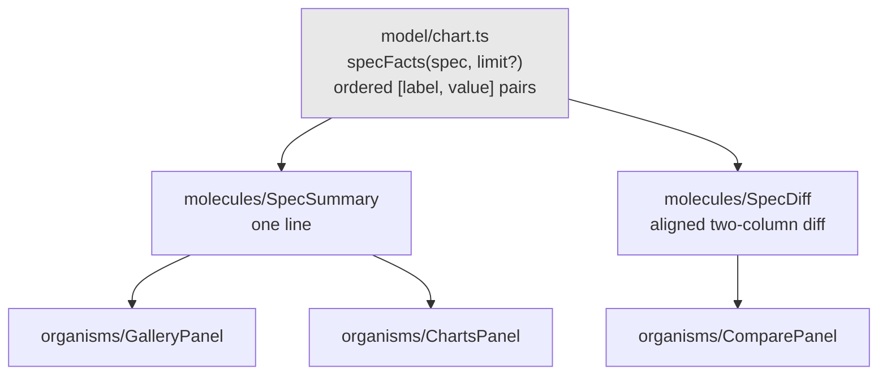
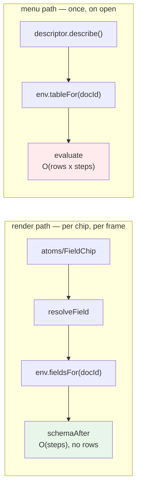

# PROJECT REPORT - go-go-datadrop v0.7 - What Makes a Defect Findable

This report closes [[PROJECT REPORT - go-go-datadrop v0.5 - The Missing Middle, and Six Copies of One Style Object|v0.5]]'s ticket, which had been left seven phases in and six phases short while [[PROJECT REPORT - go-go-datadrop v0.6 - Six Workbenches on One Page, and a Tutorial That Cannot Rot|v0.6]] built the tour. The remaining work was of two kinds: extracting nine applications that still rendered their own JSX, and repairing a performance defect that a correctness fix had introduced.

Neither is interesting on its own. What is interesting is that this cycle produced four defects, and each was found by a different mechanism — a story, a measurement, a linter, and a screenshot — while the codebase's 229 tests found none of them. That distribution is the subject of this report.

> [!summary]
> - A correctness fix in the previous cycle cost 144 ms per frame at the row budget the interface offers as a button, and the reasoning that dismissed the cost was wrong in a specific, repeatable way: it reasoned about the function's *category* rather than its *call sites*.
> - Six Storybook stories were written to demonstrate states nobody had seen. Two of them instead demonstrated defects in the code they were written for.
> - Biome, run for the first time on a codebase with 229 passing tests, found two genuine defects in its first execution, one of which would have silently emptied a table.
> - The most dangerous defect of the four was found by neither a test nor a tool: a shared function that lost information during a refactor, discovered by looking at a rendered screenshot and noticing that two obviously different charts agreed.

## The starting position

`go-go-datadrop` is an append-only event store with a browser workbench. The workbench arranges named workspaces of tiles; each tile names one of twenty-two registered applications; every visible object carries its presentation type and therefore its verbs. Underneath is an atomic design system whose layer graph is enforced by a test that walks every import.

The v0.5 ticket had established the pattern that makes that design system work: **the container keeps the hooks and the fetches; the panel takes data and callbacks.** Eight applications had been converted. Nine had not, and the reason they had not is that they were the harder nine — the pipeline editor at 293 lines, three snapshot applications that shared a shape, and a static glossary that arguably should not be converted at all.

## Part I — What a story is for

### The nine, and the argument for the order

The nine were ordered by what a story would catch rather than by size. That distinction matters, because it produces a different order:

| Application | Lines | The state that needed a story |
|---|---|---|
| `PipelineApp` | 293 | five step editors, a dropped-row warning, a column-loss note |
| `EncodingApp` | 159 | a stale mapping; a log scale on a domain that cannot take one |
| `GalleryApp` | 118 | no snapshots; both compare slots pinned |
| `ChartsApp` | 117 | the undeletable last document |
| `CompareApp` | 116 | neither pinned; specifications that agree |
| `WatchlistApp` | 89 | six presentation types in one list |
| `TraceApp` | 85 | a trace long enough to have dropped its own beginning |
| `InspectorApp` | 50 | nothing inspected; a deeply nested value |

After extraction those nine total 554 lines of container, against 1 135 before. The panels and molecules they produced carry 54 new story exports.

The line count is the least interesting number in that paragraph. The useful one is that eleven of the nineteen applications had been calling a single helper whose entire body was "encode this with two-space indent", so eleven applications had no table rendering at all — `datadrop dataset list` printed JSON whether or not `--output table` was passed. Nobody had written a twelfth `tabwriter` block, and the absence of one had become the design.

### Three states that could not be reached by clicking

The point of extraction is not smaller files. It is that a state which requires a particular dataset and a particular sequence of clicks becomes one line of story arguments.

**A unary derive operator.** The pipeline's `derive` step takes two operands and an operator, except for `log10`, which takes one — so the component hides the right-hand select. Reaching that in the running application required adding a derive step to a live pipeline and then opening a select nobody had reason to open. It is now `args: { step: make.derive("log_temp", READINGS.temp, "log10", "") }`.

**A stale channel mapping.** A channel mapped to a column that a later summarize removed renders the dead name marked stale rather than blanking the control, because a blank control and a wrong specification look identical and only one of them is recoverable by the user. Reaching it by clicking meant building a chart, mapping colour, and then adding a summarize that ate the column. Nobody does that on purpose.

**A step's schema, as of that step.** The pipeline editor's third step must offer the columns the second step produced. This is computed by `schemaAfter(table, steps, index)` and was invisible without a running three-step chain. The story now shows a sort step whose dropdown offers `mean_data.temp_c` — a column that exists only because the summarize before it produced one.

### The story that found the defect it was written to demonstrate

The pipeline panel's dropped-row story was written to show a partial drop: a derive step whose arithmetic produces a non-finite result for some rows, with `evaluate` removing those rows and the panel reporting the count under the step that caused it.

The rendered story showed **360 dropped, 0 rows out**. Probing the engine directly explained it:

```text
data.temp_c / data.ok         rows=0    dropped={p:360}
data.temp_c / data.humidity   rows=360  dropped={}
data.ok / data.temp_c         rows=0    dropped={p:360}
```

`asNumber` returns `NaN` for a boolean rather than coercing it to 0 or 1. Any derive step touching a boolean column therefore empties the entire pipeline, and the user's only evidence is an empty chart and one line of red text. The fixture contains no column that produces a *partial* drop — every quantitative column in it is strictly positive, so division never goes non-finite and `log10` never goes undefined.

Whether `NaN`-for-booleans is the right engine behaviour is a separate question and a separate ticket. What this cycle established is that the behaviour was invisible until someone rendered it, and that the story's prose had confidently described something else.

### A decision record tested and refuted

The v0.5 design had required the three snapshot-family applications to be designed together before any was extracted, on the explicit suspicion that the right answer was one shared list component and three thin panels. That instruction was load-bearing: extracting one in isolation is how three panels end up with three different ideas of what a pinned snapshot is.

Reading all three refuted the suspicion. The card shells rhyme — a surface, a chip, a summary line, a row of buttons — but the gallery restores and pins, the document manager renames and duplicates, and the compare view is not a list at all. A shared list taking a configuration object would have been a generic solution to three specific instances.

What *is* shared is the description of a specification, and all three were building it independently out of the same six fields:



One pure function, two small molecules, three separate panels. Recorded as DR-85, and it is a decision record whose value is that it says *no* to a shape the previous cycle had guessed at.

## Part II — The cost of a correct fix

### The original defect, and the fix that was right

A field chip resolves a column against the environment the presentation protocol supplies. Before v0.6 it resolved against the **source** table, so any column a pipeline step *produced* — `mean_data.temp_c`, a derived name — was not found, and the chip rendered stale: dashed border, warning glyph, "not in the pipeline output". It is precisely the pipeline output; it is the source it is absent from.

The encoding editor made this a visible contradiction. It computes staleness correctly from the pipeline's fields and then drew a chip beside it that computed the opposite answer.

The fix was to make the environment's table lookup evaluate the pipeline:

```ts
const out = evaluate(data, doc.spec.steps, doc.spec.typeOverrides);
return { ...data, fields: out.fields, rows: out.rows };
```

That is correct and it stays. It also settled a second question in passing: a descriptor's statistics now describe the rows the chart drew rather than the rows the server sent, which is what a presentation of something on screen should report.

### The reasoning failure

The implementation diary recorded the cost as: *runs once per menu open over at most the row budget, so this is very probably fine.*

That sentence is wrong, and the way it is wrong is worth naming because it is a reasoning failure rather than a typo. Descriptors *are* mostly called from menu handlers. But `resolveField` is not a descriptor method — it is a helper, and the atom that draws a field chip calls it **during render**:

```tsx
// components/atoms/FieldChip/FieldChip.tsx
const { field, type } = resolveField(ref, pbui.environment);
```

The reasoning classified the function by the category of its neighbours rather than by enumerating its call sites. One `grep` would have settled it; the diary entry did not contain one.

### The measurement

Timed over the committed fixture repeated to each row budget, with two steps, after a warm-up loop so the first figure is not measuring JIT compilation. Thirteen iterations, because the fixture has thirteen columns and a table header renders one chip per column of pipeline output:

```text
                    13x evaluate   13x schemaAfter    ratio
  2 000 rows              5.2 ms        0.032 ms        161x
 10 000 rows             30.6 ms        0.080 ms        381x
 50 000 rows            144.0 ms        0.023 ms      6 329x
```

144 ms is roughly nine dropped frames. It is paid on every render of that header, which includes every keystroke in the pipeline editor, every divider drag, and every arriving event on a live stream. The 50 000-row budget is one of four buttons in the source browser.

The exposure had also grown during this cycle without anyone noticing: the newly extracted pipeline panel draws one field chip per output column too, so there are now two unbounded chip sites rather than one, and they are commonly on screen together — the default `build` workspace puts the pipeline editor beside the table.

### The decisive observation

`resolveField` never touches a row. It wants the post-pipeline **schema**, and the engine already computes exactly that without evaluating anything: `schemaAfter` walks the steps transforming a list of field descriptors, which is O(steps) and independent of row count.

So the environment splits along that line:



Only the statistics a descriptor reports need rows, and those are computed when a menu entry is chosen. That is the boundary the interface should have had from the start.

Two further changes fell out of it. `resolveField` stopped returning the table, because its callers used the field and the type and nothing else — returning a table it never needed is what made a cheap call look like an expensive one, which is how the next person reaches for a cache instead of a schema. And the datum descriptor's actions moved to the schema lookup as well, having only ever read `table.fields`.

### Why not memoisation

Memoising the table lookup on `(docId, table identity, steps identity)` would have worked. The three identities are stable: the query cache holds a table reference until a refetch, and the reducers update the specification immutably.

It is the second choice for two reasons. It caches a computation the render path should not be performing at all, and a cache turning 144 ms into 12 ms is a worse outcome than a call that never costs more than a microsecond — with the cost left one invalidation away, and the invalidating event is a specification edit, which is exactly when the pipeline editor re-renders hardest. And it makes the interface defect survivable rather than removing it: the next component to reach for rows during render pays the same cost again with no warning.

### Two guards, for two different failures

The cost guard asserts that thirteen schema resolutions at 50 000 rows cost under 5 ms — an absolute bound rather than a ratio against `evaluate`. The ratio is the more informative number and the more flaky assertion: it fails when the machine is loaded rather than when the code is wrong. Five milliseconds is roughly two hundred times the measured cost.

The structural guard asserts that nothing under `components/` names the table lookup at all, with one allow-listed entry — the component that builds the environment, which is where the lookup is supposed to enter the tree. It is the stronger of the two, because the cost guard only notices a regression once it is slow enough to measure while this one fails on the import.

Both were verified by breaking them: adding a table lookup to a panel fails the structural guard with a file and a line; making the schema walker touch rows fails all three cost assertions.

## Part III — What a linter found that 229 tests did not

Biome 2.5.5 was added at the end of the cycle. Configured to the style the tree already used — two spaces, double quotes, trailing commas, hundred columns — the reformat was eighteen files of line wrapping rather than a change of house style, and the linter produced nineteen findings.

Two of those were genuine defects in code that had passed every test in the repository.

**Conditional hooks in the Storybook decorator.** The decorator returned early when a story asked to supply its own presentation context, and then called `useState` and `useMemo`. The hook count therefore varied with a story parameter. It had survived because a story's parameters rarely change while the story is mounted; editing them live in the Storybook interface is exactly when they would. The repair is the standard one: a decorator that decides whether to wrap, and a component beneath it that always runs the same hooks in the same order.

**A filter that would have silently emptied the table.** Both filter callbacks in the pipeline engine switch over the four members of the comparison-operator union and return nothing on the implicit fifth path:

```ts
rows = rows.filter((row) => {
  const v = asNumber(row[step.field]);
  switch (step.op) {
    case "=":  return v === bound;
    case "!=": return v !== bound;
    case ">":  return v > bound;
    case "<":  return v < bound;
  }
});
```

`Array.prototype.filter` reads the resulting `undefined` as false. A fifth operator added without a case here would have removed every row, in both branches, with no error anywhere. The repair adds an exhaustiveness assertion that the compiler enforces:

```ts
default: {
  const unknown: never = step;
  void unknown;
  return true;
}
```

The assertion is on `step` rather than on `step.op`, because TypeScript narrows the whole discriminated union to `never` in that branch, so a property access on it does not compile. Verified by adding a fifth operator and watching both branches fail the type check.

The direction of the fallback is a judgement rather than a derivation. Returning `true` keeps every row, which produces an unfiltered table beside a step row that says otherwise — a visible contradiction. Returning `false` produces an empty table, which reads as a data problem. The contradiction is the more legible failure.

Four further findings were false positives in context and were suppressed at the site with a written reason rather than globally: a drop target is a pointer gesture whose keyboard route is the button above it; there is no semantic element for a splitter, and the ARIA pattern for one has to sit on a button precisely so it is keyboard-operable.

One of those suppressions records a real gap rather than concealing one. Double-clicking a workspace chip renames it, and that has no keyboard route — because the `workspace` presentation type is declared and has no descriptor, so there is no rename verb to reach through a menu. The suppression says so and names the ticket that adds it. A comment in the place a reader will already be standing is more likely to be read than a list of known issues.

### Whether GritQL gives semantic matching

Biome's plugin mechanism uses GritQL, and the question of whether it can express a rule like "do not evaluate the pipeline on a render path" is worth answering precisely, because the answer is *partly*, and the part it cannot do is the interesting one.

Probed with three shapes:

```ts
env.tableFor("x")                        // matched by `$env.tableFor($_)`
const { tableFor } = env; tableFor("x")  // matched only by a bare-name pattern
const t = env.tableFor; t("x")           // NOT matched by either
```

GritQL matches the abstract syntax tree. That is a real advantage over text search — it ignores the name in comments and in string literals, which was confirmed separately — but it has no symbol table, no type information and no dataflow analysis. It cannot follow an alias through a differently-named binding, and it cannot express "on a render path" at all, because that is a property of *where a call happens* rather than of *what it looks like*.

The file-boundary rule is a proxy for the rule anyone actually wants, and it is expressible either way. The plugin is scoped to the component tree through configuration overrides, so it stays silent on the legitimate menu-path calls in the descriptor files, and it fails in the editor before the test suite runs. The test remains the guard that holds the line.

## Part IV — The one that nearly got away

The three defects above were each found by a mechanism designed to find defects. The fourth was not, and it is the one worth the most attention.

Extracting the snapshot family produced `specFacts`, the single function that says what a chart specification contains. Its steps entry returned a **count**:

```ts
["steps", String(spec.steps.filter((s) => s.on).length)]
```

That reads well in a one-line summary. In the comparison view it is useless: two snapshots with one step each both report `1`, so a comparison of a filter against a summarize displayed the steps row as **matching**. The application this replaced had joined the step labels, so this was a loss of information dressed as a refactor.

Nothing failed. There is no test over that row. There was no visual regression, because both sides rendered a plausible number in an unremarkable style. The type checker was satisfied, the 229 tests passed, and the build was green.

It was found by opening the rendered story and noticing that two charts which were obviously different agreed about their pipelines. The repair carries the labels in the shared function and counts them in the summary component, which has the specification anyway.

The general shape is worth stating plainly: **a refactor can remove information while every automated check passes, because automated checks assert that values are correct and not that they are informative.** The only instrument that catches it is a person looking at the output and knowing what it ought to say.

## Verification

The ticket's own acceptance criteria, measured rather than asserted:

| Criterion | Target | Actual |
|---|---|---|
| Applications over an extracted panel | 16 | 18 of 22 |
| Applications deliberately left inline | 1 | 2 (the glossary, and the four tutorials) |
| Story exports | ≈260 | 308 |
| Pipeline evaluations per table-header render | 0 | 0 |
| Cost at the 50 000-row budget | ~0 ms | 0.023 ms |

Two criteria were visual and were checked in a browser rather than inferred. The summarized table's header must still show non-stale chips — the split must not reintroduce the defect that the evaluation fixed — and it does: `mean_data.temp_c` renders solid with its quantitative badge. The encoding contradiction must stay fixed, and it does: a mapping to a column a summarize removed shows the same staleness in the row and in the chip.

233 tests, a clean type check, a clean build, and 425 files clean under the linter.

## Two decisions recorded rather than deferred

The ticket's final phase required two questions to be answered explicitly rather than by omission, and both answers are written into the files themselves.

**The glossary stays an application.** Applying the container/panel rule to it produces a panel that takes nothing at all — no properties, no hooks, no state, no callbacks — and a container that renders it. There is no second state to reach. The chips it draws are already storied where they live, which is where a change to them would need reviewing. If it ever takes a property, that is the moment there is a second state and the moment to revisit.

**The four tutorials stay inline**, and the decision gains new evidence. Their shared machinery is already extracted; what remains in each is seventy to a hundred lines of prose and step content, which is the genuinely one-off part. And a fifth teaching surface *was* written during v0.6 — the tour, which is content in its own layer behind three extracted organisms, exactly the shape the original decision predicted a fifth would need. But it was designed that way from the start rather than retrofitted, so it is evidence about how to build the next teaching surface rather than evidence that these four should be rebuilt. The open question they now raise is not whether to extract them but whether they should exist, given the tour covers the same ground.

## What generalises

- **Classify a function by its call sites, not by its neighbours.** The 144 ms defect existed because a helper was reasoned about as though it were a descriptor. The check costs one `grep` and was not performed.
- **A cheap call should not look expensive.** Returning a table that nobody reads is what invites the next person to cache it instead of replacing it.
- **Prefer an absolute performance bound to a ratio in a test.** A ratio is the better number to report and the worse thing to assert, because it fails under load rather than under regression.
- **Two guards for one rule, if they fail for different reasons.** A cost bound catches a slow regression; a structural rule catches the import that will eventually cause one.
- **A suppression comment is a good place to record a gap.** It sits where a reader is already standing, which a list of known issues does not.
- **Automated checks assert correctness, not informativeness.** A value can be right and useless, and only a person reading the output notices.

## Open questions

1. **Boolean columns in arithmetic.** A derive step touching one empties the pipeline, because the coercion returns `NaN`. Either coerce to 0 and 1, or refuse the step when it is minted and say why. Made visible by this cycle; not decided by it.
2. **A development-mode call counter.** The design proposed one as a second guard on the table lookup, warning when it is called several times within one tick. The structural test catches a call inside the component tree; a counter would catch indirection and any call site outside it. Not built.
3. **The linter in continuous integration.** The script exists and nothing runs it automatically. The Go side has a pre-commit hook; the browser side does not.
4. **The four tutorials against the tour.** A product question rather than an engineering one.

## Repository

- Source: `/home/manuel/code/wesen/go-go-golems/go-go-datadrop`
- The extraction: `ui/src/components/organisms/{PipelinePanel,EncodingPanel,TracePanel,InspectorPanel,GalleryPanel,ChartsPanel,ComparePanel,WatchlistPanel}` and `ui/src/components/molecules/{StepEditor,SpecSummary,SpecDiff}`
- The split: `ui/src/pbui/types.ts`, `ui/src/pbui/descriptors/field.ts`, `ui/src/apps/useTable.ts`
- The guards: `ui/test/render-path.test.ts`, `ui/biome/no-table-for-in-render.grit`
- Ticket and diary: `ttmp/2026/07/25/DATADROP-6--design-system-coverage-.../`

## Related notes

- [[PROJECT REPORT - go-go-datadrop v0.6 - Six Workbenches on One Page, and a Tutorial That Cannot Rot]]
- [[PROJECT REPORT - go-go-datadrop v0.5 - The Missing Middle, and Six Copies of One Style Object]]
- [[PROJECT REPORT - go-go-datadrop v0.3 - One Typed Table, and Four Defects Only a Browser Could Find]]
