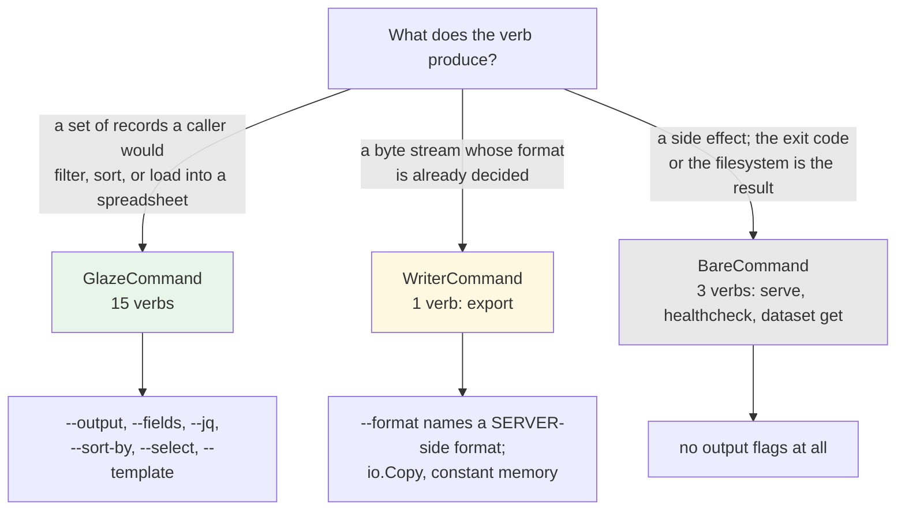
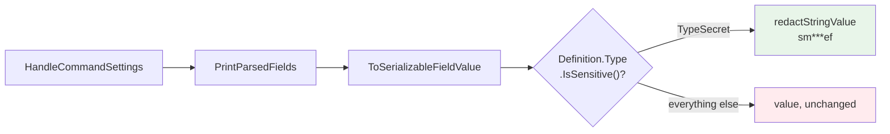
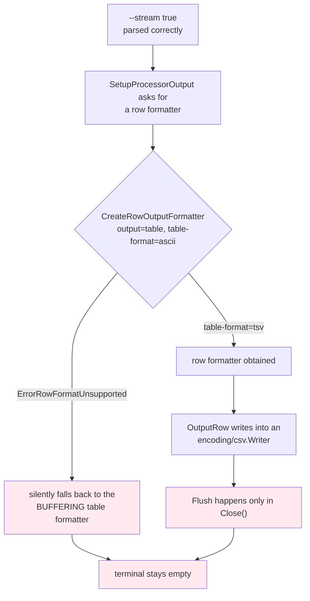
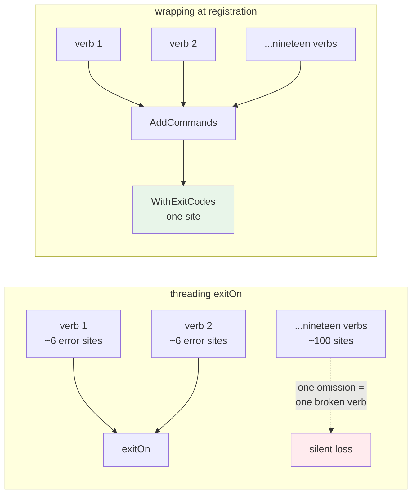

# PROJECT REPORT - go-go-datadrop v0.8 - Nineteen Verbs, and the Four Silences of Framework Adoption

This report covers DATADROP-9, which converted all nineteen `datadrop` CLI verbs from hand-written Cobra commands to Glazed commands. The mechanical result is that `pkg/cli/output.go` — 162 lines of `tabwriter` renderers and a three-valued `--output` flag — is deleted, eleven verbs that had no table rendering now have one, and every verb that produces data gained CSV, YAML, Markdown, Excel, field selection, jq filtering, sorting and templating without a line of formatting code.

That summary is not what the cycle is worth recording for. Adopting a framework that owns an application's output, flags and error handling is a merge of two namespaces and two sets of assumptions, and every conflict in that merge was **silent**. Not one of the four significant problems announced itself. Each was found by running the thing and looking, and one of them was found only because a test asserted a property nobody would think to check by hand. This report is organised around those four silences, because the pattern they form is the transferable part.

> [!summary]
> - Glazed's `--print-parsed-fields` prints a `fields.TypeString` bearer token in full, three times — the value, the parse log, and the environment variable it came from. `fields.TypeSecret` redacts it. The distinction is invisible at the Cobra layer, so the flag registers as `string` either way and no test at that layer can see it.
> - The design guide's fix for the buffering `--follow` does not work, and does not work at two independent layers: the framework refuses a row formatter for an ASCII table and falls back silently, and the CSV/TSV row formatters buffer until close. Measured with byte counts in the pipe, one second after a known write.
> - Framework adoption is a namespace merge, and namespace collisions fail in three ways with three different blast radii: a fatal build of the whole command tree, a silent semantic change hidden by Cobra's flag shadowing, and a semantic overlap that only a human notices.
> - Applying the error-code adapter once at registration rather than at every `return err` converts a discipline problem into a structural one. The design document specified the latter; the cost of the former is one wrapper type per command interface.

## The starting position

`go-go-datadrop` is a self-hostable append-only event store: producers append events over HTTP, the server keeps them in one SQLite file, and the same binary serves a browser workbench. The CLI is the primary interface for everything the browser does not do.

Before this cycle, nineteen leaf verbs lived in five files under `pkg/cli/`, totalling 2 486 lines. The output layer was `pkg/cli/output.go`: two `tabwriter` renderers, a three-valued `--output` flag accepting `table`, `json` and `ndjson`, a truncation helper, and a JSON encoder configured three different ways.

The measurable problem was that **eleven of the nineteen verbs called one helper whose entire body was "encode this with two-space indent."** Those eleven had no table rendering at all. `datadrop dataset list mydrop` printed JSON whether or not `--output table` was passed; the flag was accepted and ignored. This was recorded in the Architecture Garden as [[Research/Software Architecture Garden/go-go-datadrop/08 - Architecture Debt and Patterns Not to Repeat|debt item 1]] with the observation that a flag which is parsed and unused is worse than an unimplemented flag, because a user cannot discover the lie by reading the help text.

## Part I — What the conversion actually is

### Three interfaces, and classifying by what a verb produces

A Glazed command does not render. It emits rows, and everything downstream of `gp.AddRow(ctx, row)` — the output format, the field selection, the jq filter, the sort order, the destination file — belongs to the framework. There are three interfaces, and choosing correctly among them is most of the design work:

```go
type GlazeCommand interface {
    RunIntoGlazeProcessor(ctx context.Context, vals *values.Values, gp middlewares.Processor) error
}
type WriterCommand interface {
    RunIntoWriter(ctx context.Context, vals *values.Values, w io.Writer) error
}
type BareCommand interface {
    Run(ctx context.Context, vals *values.Values) error
}
```

The question that decides which one a verb takes is not "how important is this command" but "what does a caller do with the output." Three answers:



`export` is the classification easiest to get wrong, because it produces exactly the kind of tabular data the framework exists for. What the command actually does is open a response body and copy it; the formatting happens on the server, in `pkg/tabular`, which is the same code path `curl` and the browser download button use. Converting it to rows would mean fetching NDJSON, parsing it, and re-serialising it as CSV on the client — which moves the export format definition from one place to two, loses constant-memory streaming over a large export, and gains nothing a caller asked for.

This produces a rule a reviewer can apply without reading the implementation: **`--format` names a server-side format and `--output` names a client-side rendering, so a verb with both flags has been classified wrong.** A test enforces it, and Part IV records that the test caught a verb written twenty minutes earlier.

### The row shape is a public API, and it is shared with the browser

The moment `datadrop query --fields seq` works, `seq` is something scripts depend on, and renaming it to `sequence` is a breaking change that no compiler catches. So each response type gets exactly one projection function in `pkg/cli/rows.go`, and `rows_test.go` pins the exact key set of each.

The event projection is the interesting one, because it does not implement its own flattening. It calls `tabular.FromEvents`, which is the projection the server's `/table` endpoint returns and therefore the projection the browser workbench names on its field chips:

```go
func RowsForEnvelopes(events []datadrop.Envelope) ([]types.Row, error) {
    table, err := tabular.FromEvents(tabular.SourceRef{Kind: tabular.KindStream}, events)
    ...
    for i, projected := range table.Rows {
        row := types.NewRow()
        for _, field := range table.Fields {          // Fields carries the resolved order
            if value, ok := projected[field.Name]; ok {
                row.Set(field.Name, value)
            }
        }
        ...
    }
}
```

The consequence is checkable from the outside. Two commands that share no code path produce identical column sets:

```console
$ datadrop query greenhouse --output csv
id,drop,stream,seq,time,received_at,source,type,subject,data.humidity,data.location.lat,data.temperature

$ datadrop export greenhouse --format csv
id,drop,stream,seq,time,received_at,source,type,subject,data.humidity,data.location.lat,data.temperature
```

One is rendered on the client from rows the CLI emitted. The other is bytes the server wrote. They agree because the flattening exists once.

Passing a whole page to the projection rather than one event at a time is load-bearing. `tabular` resolves the column set over the whole sample, so every returned row carries the same keys in the same order even when one event's payload is missing a field another one has. Projecting event by event gives the first row three columns and the second row four, in map-iteration order. `RowForEnvelope` is therefore the one-element special case of `RowsForEnvelopes`, not the other way round.

### What the eleven verbs gained

The headline effect is visible in commands that never had a table:

```console
$ datadrop dataset list greenhouse
+------------+----------+--------------------------+----------+----------------+--------------+--------------+
| drop       | name     | created_at               | versions | latest_version | latest_files | latest_bytes |
+------------+----------+--------------------------+----------+----------------+--------------+--------------+
| greenhouse | readings | 2026-07-26T22:58:28.565Z | 1        | 1              | 1            | 12           |
+------------+----------+--------------------------+----------+----------------+--------------+--------------+
```

And in compositions that were previously impossible, such as an NDJSON bulk push reporting every sequence it allocated:

```console
$ printf '{"t":1}\n{"t":2}\n' | datadrop push greenhouse --stdin --ndjson --select seq
pushed 2 events        # stderr
2                      # stdout
3
```

A single object is emitted as a one-row set rather than as a bare JSON object. That looks like ceremony and is not: it makes `--output json` mean the same thing on every verb, so a script no longer has to know whether the verb it called returns an object or an array. Before the conversion, `whoami` printed prose, `inspect` printed an object, and `list` printed an array.

The measured shape of the change:

| | Before | After |
|---|---|---|
| Files under `pkg/cli/` holding verbs | 5 | 19, one per verb, in 5 directories |
| Lines in `pkg/cli/` | 2 486 | 4 721 |
| Lines deleted outright (`output.go`, `read.go`, `push.go`, `dataset.go`) | — | 1 467 |
| Verbs with table rendering | 8 | 15 |
| Output flags on `query --help` | 1 | 11 (66 with `--long-help`) |
| Tests over the CLI | 14 | 44 |

The line count went up. That is worth stating plainly rather than hiding: what replaced the renderers is not smaller, it is declarative — field definitions, help text with runnable examples, and the projections that are now a pinned contract. The 1 467 deleted lines are the part that had to be maintained by hand for every new verb.

## Part II — The four silences

### Silence 1: the flag that prints the credential

`--addr` and `--token` became a Glazed *section* rather than persistent Cobra flags, which is what allows them to be filled from a configuration file or a named profile and to appear only on the verbs that talk to a server. Every Glazed command also receives the framework's command-settings section, which adds `--print-parsed-fields`: a flag that dumps every resolved value together with the source it came from. On a CLI where `--addr` is reachable from a flag, an environment variable and a configuration file, that flag ends a category of support question.

It also prints the bearer token. Built with `fields.TypeString`, which is what the design document's own example specifies:

```console
$ DATADROP_TOKEN=smoke-token-abcdef datadrop list --print-parsed-fields
  token:
    log:
      - source: defaults
        value: ""
      - metadata:
          env_key: DATADROP_TOKEN
          parsed-strings:
            - smoke-token-abcdef
        source: env
        value: smoke-token-abcdef
    value: smoke-token-abcdef
```

The secret appears three times and the environment variable it came from is named. Built with `fields.TypeSecret`, the same command in the same environment:

```console
  token:
    log:
      - source: defaults
        value: '***'
      - metadata:
          env_key: DA***EN
          parsed-strings:
            - sm***ef
        source: env
        value: sm***ef
```

The mechanism is a single conditional. `PrintParsedFields` serialises each value through `fields.ToSerializableFieldValue`, which calls `fields.RedactValue(pp.Definition.Type, value)`, and `RedactValue` returns the value **unchanged** unless `Type.IsSensitive()` — which is true for `TypeSecret` and for nothing else.



Two properties make this the most dangerous of the four silences.

The first is that there is no way to opt out of the exposure. The command-settings section is attached by the parser itself when `SkipCommandSettingsSection` is false, so `--print-parsed-fields` exists on every converted verb whether or not its constructor asks for it. A project cannot decline the flag; it can only declare its fields correctly.

The second is that **the distinction is invisible at the layer where one would naturally test it.** Glazed registers `TypeString` and `TypeSecret` through the same `flagSet.String(...)` call, so the Cobra flag reports its type as `string` in both cases. I wrote a test that walked the assembled command tree and asserted `flag.Value.Type() == "secret"`, and it failed on all eighteen verbs — not because the code was wrong but because the premise was. The property exists only in the field *definition*, so the test has to reach the section:

```go
token, _ := section.GetDefinitions().Get("token")
if !token.Type.IsSensitive() {
    t.Errorf("--token is %s, which glazed does not redact; want %s", token.Type, fields.TypeSecret)
}
```

The generalisation is worth stating carefully. A framework that offers introspection over its own configuration has created a data-exfiltration surface, and whether a given field crosses it is a property of a type annotation that nothing warns about. **Declaring a credential's type is a security decision, and it does not look like one.**

### Silence 2: the flag that is read, parsed, and ignored

`datadrop tail --follow` subscribes to a drop's live stream and emits a row per event, indefinitely. The default table formatter collects every row before printing, because it computes column widths from the whole set — so a `--follow` under the default output prints nothing, forever. The failure is particularly bad because it is indistinguishable from the perfectly ordinary situation of a drop with no new events.

The design document's fix is one line, and it is the documented way to do this:

```go
glazedSection, err := settings.NewGlazedSchema(
    settings.WithOutputSectionOptions(
        schema.WithDefaults(map[string]interface{}{"stream": true}),
    ),
)
```

I set it, started a `--follow` in one shell, wrote two events from another, and watched an empty terminal for three seconds. Every row arrived at once, on interrupt.

The value had in fact been set correctly, which is checkable:

```console
$ datadrop tail greenhouse --limit 1 --print-parsed-fields
  stream:
    log:
      - source: defaults
        value: true
```

The flag was read. What happens next is three layers of silence stacked on each other:



The first layer is that an ASCII table cannot be drawn a row at a time — its widths are a property of the whole set — so `CreateRowOutputFormatter` refuses outright, and `SetupProcessorOutput` responds by falling back to the buffering formatter with no diagnostic. The setting is honoured by being ignored.

The second layer appeared when I switched to `--table-format tsv`, which *is* row-capable. Still nothing. The CSV and TSV row formatters write into an `encoding/csv.Writer` and flush only in `Close()`; `OutputRow` never flushes. The buffer had moved one layer down.

At that point reading more source was the wrong move, because the question is empirical: which formats actually put bytes on the pipe while the process is still running? Running `tail --follow` under each candidate, writing one event, and counting bytes after one second:

| Output configuration | Bytes in the pipe while live |
|---|---|
| `--output json --output-as-objects` | 58 |
| `--output json` | 38 |
| `--output yaml` | 38 |
| `--table-format markdown` | 48 |
| `--table-format tsv` | **0** |
| `--table-format ascii` (default) | **0** |

`tail` now defaults to `--stream true` **and** `--table-format markdown`, which both streams and flushes and reads as a live log:

```console
$ datadrop tail greenhouse --follow --fields time,data.temperature
| time | data.temperature |
| --- | --- |
| 2026-07-26T22:41:13.259Z | 31.5 |
| 2026-07-26T22:41:51.141Z | 40.1 |
^C
exit 0
```

The generalisation: **a framework's configuration surface is flat, and its capability surface is not.** Nine values of `--output` are offered by one help string, and they differ in whether they can stream, whether they flush, and whether they require an output file — none of which is discoverable from the flag. A project adopting such a framework should determine the capability matrix by measurement and then write it into its own documentation, because the framework's help text does not carry it. The `datadrop help cli-output` page now does.

### Silence 3: the namespace merge

Adopting a framework that contributes flags is a merge of two flag namespaces, and this is the part that no amount of reading the design document would have caught, because the design document's own compatibility matrix listed `--stream` under the flags Glazed *adds* — without noticing that datadrop already had one.

The collisions came in three kinds, and they matter separately because their blast radii differ by orders of magnitude.

**Kind 1: a hard collision, with the whole binary as the blast radius.** Glazed's output section owns `--stream`, a boolean that switches row-at-a-time emission. Datadrop's `query`, `tail`, `export`, `push`, `schema put/show` and `dataset import` used `--stream` for the stream within a drop. Two sections cannot both define it:

```console
$ datadrop query greenhouse
datadrop: building the query command: Flag 'stream' (usage: stream within the
drop - <string>) already exists
```

What failed there is not the query. It is `NewRootCmd`, which returns the error, so every verb in the binary — including `serve` — stops working. A collision in one verb's field list is a whole-program failure. The framework's flag cannot be renamed or removed: `schema.SectionOption` offers `WithPrefix`, `WithName`, `WithDescription`, `WithDefaults`, `WithFields` and `WithArguments`, none of which removes or renames an existing field, and the settings struct reads the field by its `glazed:"stream"` tag in any case. The application's flag is the one that has to move, to `--drop-stream`. The same audit found a second instance waiting in a later phase: `dataset push --flatten` against Glazed's `--flatten`.

**Kind 2: a soft collision that Cobra's shadowing had been hiding.** This one is the most interesting, because it was *not* a collision before the conversion and became one because of it.

`DATADROP_ADDR` is the client's address for a running server. `datadrop serve --addr` is the socket to bind. Both are named `addr`, and they mean opposite things. Before the conversion the collision was invisible: `--addr` on the root was a persistent flag whose default came from `envOr("DATADROP_ADDR", …)`, and `serve` declared its own local `--addr`, which Cobra's shadowing made win. Nobody had to think about it.

Glazed's environment source maps `DATADROP_ADDR` onto any field named `addr` in any section of a command built with `AppName: "datadrop"`. A developer with the ordinary client environment exported — which is the normal state of a shell in which one is using this tool — would find `datadrop serve` attempting to listen on `http://localhost:8080`.

The fix is that `serve` and `healthcheck` are built through a separate path with no `AppName` at all, so no `DATADROP_*` variable reaches them through the section machinery, and their own fallbacks stay where they were, in the field defaults:

```go
func buildOperatorCommand(command cmds.Command) (*cobra.Command, error) {
    return cli.BuildCobraCommandFromCommand(
        WithExitCodes(command),
        cli.WithParserConfig(cli.CobraParserConfig{
            ShortHelpSections: []string{schema.DefaultSlug},
            // AppName deliberately unset: no DATADROP_* prefix for the verbs
            // that run a server rather than talk to one.
        }),
    )
}
```

The general form: **an environment-variable prefix is part of the flag namespace, and a framework that derives one mechanically from field names will connect variables to fields that a human would never have connected.** The two flags had coexisted for the project's whole life without anyone noticing they shared a name, because nothing had ever put them in one namespace.

**Kind 3: a semantic overlap that no mechanism detects.** `dataset import --format` selected how the server reads a dataset file's rows — `csv` or `ndjson`. It sat next to `--output`, which selects how the result summary is rendered locally. Nothing collides; both flags work; and a user reading `--path f.csv --format csv --output json` has two flags in front of them that both read as "what shape is the data."

This was found by the reviewer rule from Part I, written as a test, and it is the case that rule exists for. The flag became `--row-format`, which is also what its own help text already called it.

Three renames, collected because they are the only part of this cycle that reaches a user as a broken script:

| Before | After | Forced by a collision? |
|---|---|---|
| `--stream NAME` (six verbs) | `--drop-stream NAME` | Yes — a hard collision |
| `dataset push --flatten` | `dataset push --flatten-paths` | Yes — a hard collision |
| `dataset import --format` | `dataset import --row-format` | No — chosen, to keep the `--format`/`--output` rule exceptionless |

`--stream` is the dangerous one, and the reason is a fourth silence in miniature. The old spelling still parses. `--stream` exists — it is a boolean now — so `datadrop push lab --stdin --stream temps` reads as `--stream=true` plus a stray positional argument, and the error the user sees is about something else entirely:

```console
$ datadrop push lab --stdin --stream temps
datadrop: --stdin cannot be combined with key=value arguments
```

A rename to a flag name the framework does not use would have produced "unknown flag." A rename *away from* a name the framework does use produces a plausible-looking error about an unrelated rule. Where a rename vacates a name that the adopted framework then occupies with a different type, the migration message is worse than a missing flag, and the release note has to name the flag explicitly rather than relying on users to encounter a clear failure.

### Silence 4: the framework that eats the error

The documented exit codes are part of this CLI's contract — a script branches on *why* a command failed rather than parsing stderr — and a smoke test asserts them by shelling out to a built binary.

Glazed's Cobra builder assigns `cmd.Run`, not `cmd.RunE`, and ends with `cobra.CheckErr`:

```go
// glazed@v1.3.8/pkg/cli/cobra.go:48
cmd.Run = func(cmd *cobra.Command, args []string) {
    ...
    err = runFunc(ctx, parsedValues)
    if _, ok := err.(*cmds.ExitWithoutGlazeError); ok {
        os.Exit(0)
    }
    cobra.CheckErr(err)   // prints "Error: …" and os.Exit(1)
}
```

The error never returns to the application's `Execute()`. `cobra.CheckErr` exits 1 for everything, and the message prefix silently changes from the application's to Cobra's. The builder's configuration struct has no error or exit-code hook. This was found during the Garden analysis that preceded this ticket and filed as [glazed#611](https://github.com/go-go-golems/glazed/issues/611); it affects every CLI in the ecosystem that adopts the builder.

I verified it against the version `go.mod` actually pins rather than trusting the description, and that step was worth taking for an incidental reason: the local development checkout of `glazed` is at `v1.2.7-34-g58e0bd0`, which is *older* than the `v1.3.8` the project builds against. Reading the checkout to answer a "what does the framework do" question would have been reading the wrong code.

Removing the local workaround reproduces both symptoms at once:

```console
$ go test ./cmd/datadrop/ -run TestExitCodes
--- FAIL: TestExitCodes/bad_credentials_exit_3
        exit code = 1, want 3
        stderr: Error: Unauthorized: a valid credential is required
--- FAIL: TestExitCodes/unknown_drop_exits_4
        exit code = 1, want 4
        stderr: Error: NotFound: drop "nosuchdrop" does not exist
```

## Part III — Where the adapter goes

The workaround is forced: since the error cannot escape, a command that wants a specific exit code has to exit before returning. The design document specifies a helper and its application:

> Every `return err` in a converted command that could carry an `*APIError` becomes `return exitOn(err)`. It is mechanical, it is ugly, and it is honest about why it exists.

That is a correct description of a thing that works, and the same document, four sections later, lists the failure mode it creates:

> **Exit code 1 for everything.** Silent unless `TestExitCodes` runs. Any verb whose error path returns `err` instead of `exitOn(err)` loses the mapping for that verb alone, which is worse than losing it everywhere because it looks like it works.

A rule that must be applied at every error site in nineteen verbs, whose violation is invisible and whose enforcement is a two-verb test, is a discipline problem. It can be converted into a structural one by moving the adapter to the single place every command already passes through — registration — and expressing it as a wrapper over the framework's own interfaces:

```go
func WithExitCodes(command cmds.Command) cmds.Command {
    switch typed := command.(type) {
    case cmds.GlazeCommand:  return &exitCodeGlazeCommand{GlazeCommand: typed}
    case cmds.WriterCommand: return &exitCodeWriterCommand{WriterCommand: typed}
    case cmds.BareCommand:   return &exitCodeBareCommand{BareCommand: typed}
    default:                 return command
    }
}

func (c *exitCodeGlazeCommand) RunIntoGlazeProcessor(
    ctx context.Context, vals *values.Values, gp middlewares.Processor,
) error {
    return ExitOn(c.GlazeCommand.RunIntoGlazeProcessor(ctx, vals, gp))
}
```

Embedding the interface rather than a concrete type is what makes this cheap: each of the three interfaces embeds `cmds.Command`, so `Description()` and `ToYAML()` forward without being written. The verb bodies stay ordinary Go — they return errors and never mention `os.Exit` — and forgetting the adapter is no longer possible for a verb registered through `AddCommands`, because there is nowhere to forget it.



The cost is not zero and belongs on the record:

1. **`os.Exit` skips deferred cleanup** in a verb body. No converted verb currently holds a resource that matters, but this is a constraint on every future verb and it is not visible from reading one.
2. **In-process tests cannot reach the error path** without indirecting `os.Exit` and `os.Stderr` behind package variables. That is test-only machinery living in production code.
3. **Flag parse errors keep Cobra's presentation.** They occur inside `cmd.Run` before any application code, and produce the message twice with the wrong prefix. The exit code is 1, which it also was before the conversion, so the documented contract holds and only the presentation is inconsistent.

An alternative was available and rejected: `NewCobraCommandFromCommandDescription`, `NewCobraParserFromSections`, `parser.Parse`, `SetupTableProcessor`, `SetupProcessorOutput` and `HandleCommandSettings` are all exported, so a local sixty-line builder using `RunE` would restore full control including case 3. It duplicates framework internals that will drift, in exchange for the presentation of one error class. The correct fix is thirty lines upstream, and this is a workaround that should be deleted when it lands.

## Part IV — Guard tests, and the one that was wrong

The repository has an established convention, recorded in the Garden as [[Research/Software Architecture Garden/go-go-datadrop/05 - Structural Guard Tests as a Genre|a genre]]: a test asserting a structural invariant is not real until it has been broken once, and the break belongs in the commit message. Thirteen instances existed before this cycle, all in TypeScript under `ui/test/`.

This cycle added the genre's first Go instances. `cmd/datadrop/tree_test.go` assembles the real command tree in process — it is the only package that imports every group, which is also precisely why a forgotten group is possible — and asserts three properties no single verb file can see:

| Test | Invariant | Why no other layer can check it |
|---|---|---|
| `TestEveryClientVerbHasTheClientSection` | every verb that talks to a server has `--addr` and `--token` | a verb missing the section compiles, runs, and fails at its first request against the default address regardless of `--addr` |
| `TestTheCommandSurfaceIsComplete` | the leaf set is exactly the nineteen expected verbs | a group whose registrar was not named in `main.go` produces a binary that builds, tests clean, and is missing commands |
| `TestNoVerbHasBothFormatAndOutput` | the `--format`/`--output` rule from Part I | the rule is about meaning; nothing else can see it |

Two of the three failed on their first execution, and the two failures are different in kind.

`TestNoVerbHasBothFormatAndOutput` was right and the code was wrong:

```
tree_test.go:163: these verbs have both --format and --output:
      dataset import
      help export
```

`help export` belongs to the framework's help system and is exempted. `dataset import` was mine, written twenty minutes earlier, and produced the `--row-format` rename in Part II. The reviewer rule from the design document, mechanised, caught a violation by its own author within the same working session.

`TestTokenFlagsAreSecret` was wrong and the code was right — the Cobra-layer premise described in Silence 1 — and it failed on all eighteen verbs. It was rewritten one layer down, against the section rather than the assembled flag.

That distribution is worth recording. Of three structural guards written to check a conversion, one found a real defect, one found a misunderstanding in its own author's model of the framework, and one passed. All three outcomes are useful; the second is the one that would not have happened if the test had been written to pass.

Thirty tests were added in total: nineteen pinning the row key sets, seven covering the exit mapping and its two pass-through cases, three over the command tree, and one over the deprecation shim. Four were verified by breaking what they guard, with the failure output recorded in the commit message.

## Part V — A deprecation message has one chance to be right

`--output ndjson` printed one compact JSON object per line. Glazed's `--output` has no `ndjson`, and the closest equivalent is `--output json --output-as-objects`, which emits a stream of concatenated JSON *values*. `jq` reads it correctly. A script that reads lines does not, because the objects are indented and a "line" is now `{` or `  "seq": 1,`:

```bash
datadrop query greenhouse --output ndjson | while read -r line; do
  echo "$line" | jq -r .seq          # silently produces garbage
done
```

The value is therefore kept for one release, mapped onto the replacement, and announced on stderr. The mapping runs in `PreRunE`, and that placement is forced: `ndjson` is not one of the choices the framework's output field accepts, so by the time a command body runs the parse has already failed with `Argument output has invalid choice ndjson` — a message that says the value is wrong and nothing about what to do instead. `pflag` has accepted the raw string by then, because choice validation happens later, so `PreRunE` is the one window in which the value can still be rewritten.

The design document specified what the message should say, and it was wrong. Its recommended strictly-line-oriented successor is `--output template --template '{{ toJson . }}'`. That produces no output at all in `v1.3.8` — not the wrong output, none, exit 0, for any template including a string literal:

```console
$ datadrop query greenhouse --fields seq --output template --template 'HELLO'
$ echo $?
0
```

Reading the source explains part of it: the template output formatter treats the template as a whole-table template over `{{.rows}}` rather than a per-row one, so `{{.seq}}` was always going to be empty. It does not explain a literal printing nothing. There is also no fallback: the JSON row formatter calls `encoder.SetIndent("", "  ")` unconditionally, so no combination of flags produces compact per-line JSON.

The message names `datadrop export --format ndjson` instead — the server's own NDJSON, line-oriented by construction, streamed, carrying the original nested envelope. On reflection that is the better answer regardless: a caller who wanted line-oriented NDJSON wanted the export, not a client-side re-rendering of it.

```console
$ datadrop export greenhouse --format ndjson | cat -A | head -2
{"specversion":"1.0","id":"01KYGAJCSYJDP0ECPRG8V794AS","type":"io.datadrop.event",...
{"specversion":"1.0","id":"01KYGAJCV1N857FY6D0XGHCC0V","type":"io.datadrop.event",...
```

A deprecation notice is read exactly once, by someone whose script has just started printing a warning, and it is the only opportunity to send them somewhere correct. Testing every candidate replacement at the terminal rather than trusting the flag list is the minimum standard for writing one.

## What transfers

The four silences share a structure. In each case the framework behaved exactly as documented, the application behaved exactly as written, and the composition of the two produced something neither party would have chosen — with no error, no warning, and no failing test until one was written specifically to look.

The rules that follow:

- **A framework's introspection surface is an exfiltration surface.** Enumerate which of your fields carry credentials and check what the framework's debug output does with them, before the first verb ships rather than after the fifteenth.
- **Determine the capability matrix by measurement, then document it yourself.** A flag that offers nine values from one help string is telling you about its parser, not about its capabilities.
- **Treat framework adoption as a namespace merge, and audit it before writing verbs.** The audit is mechanical: list the framework's field names, list yours, and intersect. Doing it after phase three cost two renames that a `grep` in phase one would have surfaced.
- **The environment-variable prefix is part of that namespace.** A mechanically derived prefix connects variables to fields no human would connect, and existing shadowing may be hiding a collision that adoption will expose.
- **Put the adapter at the seam, not at every call site.** When a framework takes something over — errors, output, exit — the compensating code belongs in the one place every command passes through. A rule applied a hundred times is a rule that will be missed once.
- **Write the guard test that only the assembled system can satisfy.** The three most valuable tests in this cycle could not have been written inside any verb's package, because the property they assert is a property of the whole tree.

## Related notes

- [[PROJECT REPORT - go-go-datadrop v0.7 - What Makes a Defect Findable]]
- [[PROJECT REPORT - go-go-datadrop v0.6 - Six Workbenches on One Page, and a Tutorial That Cannot Rot]]
- [[Research/Software Architecture Garden/go-go-datadrop/README|Architecture Garden — go-go-datadrop]]
- [[Research/Software Architecture Garden/go-go-datadrop/10 - Adopting a Command Framework|Adopting a Command Framework]]
- [[Research/Software Architecture Garden/go-go-datadrop/05 - Structural Guard Tests as a Genre]]
- [[Research/Software Architecture Garden/go-go-datadrop/07 - Single Binary Delivery and Operational Surface]]
- [[Research/Software Architecture Garden/go-go-datadrop/08 - Architecture Debt and Patterns Not to Repeat]]
