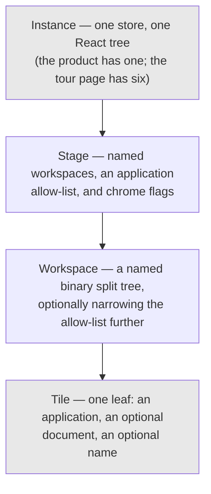
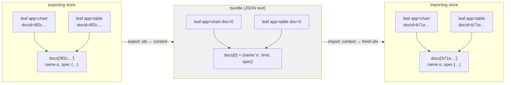
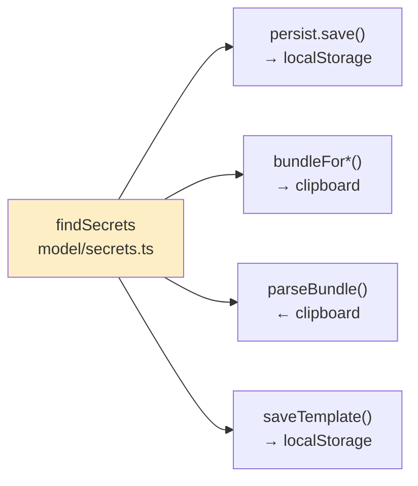

# PROJECT REPORT - go-go-datadrop v0.9 - Portable Layouts, and the Defects That Only a Browser Finds

This report covers DATADROP-8, a seven-phase cycle in the browser workbench of `go-go-datadrop`. The cycle made the arrangement of tiles on screen into a portable object: a tile, a workspace, or a whole set of workspaces can now be copied to the clipboard as a small JSON document, pasted into another browser or another account, stored under a name, and loaded back. Along the way it introduced a layer the interface had been missing, migrated every existing user's stored layout to a new shape, and gave three long-declared object types the menus they had never had.

Ninety-eight files changed and roughly 8 300 lines were added. The automated test suite went from 233 tests in 20 files to 362 tests in 26. All of that is ordinary.

What is worth recording is a pattern in the failures. Eight defects were found during the cycle, and not one of them was reachable by any test that ran without a browser. Every one passed type checking, passed the linter, and passed the full suite. Three of them made a feature completely non-functional rather than merely wrong. In each case the individual pieces were correct and the composition was not — which is a class of defect that a unit test cannot see by construction, because a unit test observes one piece at a time.

> [!summary]
> - A bundle carries documents by content and refers to them by array index. No identifier from the exporting store appears in the exported text. The alternative that compiles and looks right — copying the node object — produces two nodes with one identifier the moment anyone pastes a tile back into the workspace it came from.
> - The same credential-detection function now guards three separate exits: local storage, an outgoing bundle, and an incoming one. Consolidating it was necessary because a second copy of the pattern would drift, and a bundle is designed to be shared, which makes it a more dangerous carrier than local storage ever was.
> - Firefox's `navigator.clipboard.readText()` neither resolves nor rejects for ordinary web content. Code that guards against rejection does nothing about a promise with no outcome. The import dialog never opened at all, on a browser where a focused text field is the only import mechanism available.
> - Three correct CSS decisions in three different files composed to a contrast ratio of 1.00:1 — white text on a white background — in a control that type checking, linting and 343 tests all passed.

## The starting position

`go-go-datadrop` is a self-hostable append-only event store. Producers append events over HTTP, the server keeps them in a single SQLite file, and the same binary serves a browser workbench for looking at the result. The workbench is a tiling window manager: a page is divided into a binary tree of rectangles, each rectangle holds one of twenty-five small applications, and the applications share a single in-memory model of the user's documents.

Before this cycle, that arrangement existed only inside one browser's local storage, under one key, in a shape nothing outside the persistence module could read. There was no way to send a colleague the layout you had built, no way to keep two variants of it, and no way to move it between accounts.

The workbench also had two structural oddities that had been visible for months. Two of its twelve workspaces were defined in code rather than by the user — one holding the sign-in form, one holding the account settings — and they sat in the same flat strip as the user's own, marked with a symbol and explained by a tooltip. And the application had to force the current-workspace pointer to one of those two from two different places, which is an application reaching into the window manager because there was nowhere else for the decision to live.

## Stages: the layer that was missing

The first change introduces a layer above workspaces. A *stage* is a named set of workspaces, together with the list of applications those workspaces may contain and the parts of the surrounding interface that should be shown. There are four, defined in code: `sign in`, `welcome`, `account`, and `work`.



The evidence that this layer was always needed is the code it deleted. The signed-out gate had been written as `dispatch(setCurrentSpace(WELCOME_SPACE_ID))` and the first-sign-in redirect as `dispatch(setCurrentSpace(ACCOUNT_SPACE_ID))`. Both are now `setCurrentStage`, and the shell's chrome flags — whether to draw the masthead, the workspace strip, the stage switcher — moved from props passed down by the application to fields read from the current stage.

Two details in the state shape were deliberate and are easy to get wrong.

**Workspaces stay in one flat array with a foreign key.** Nesting them inside their stage looks tidier and is worse: the persistence validator walks the workspace array, and four reducers index into it, so nesting would add a stage lookup to every one of them for no behavioural gain. It would also turn "move this workspace to another stage" from a one-field write into a splice between two arrays.

**The current-workspace pointer exists in two places, and one of them is a cache.** Each stage remembers the workspace it was last on, so that leaving `work` on one arrangement and returning from `account` puts you back where you were. But twenty-odd existing read sites take `state.layout.currentSpaceId`, and rewriting them all to walk the stage list would be a large change for no behavioural gain. The layout keeps its pointer as a mirror of the current stage's.

A mirrored field is a correctness hazard that grows with every reducer added to the slice, so the mirror is written in exactly one private helper, and a test enumerates every action creator in the slice and asserts the two agree:

```ts
test("every reducer leaves the space pointer consistent", () => {
  for (const [name, actionCreator] of Object.entries(layoutSlice.actions)) {
    const after = layout(twoStages(), actionCreator(PAYLOADS[name]));
    const stage = after.stages.find((s) => s.id === after.currentStageId);
    if (after.currentSpaceId !== stage.currentSpaceId) {
      failures.push(`${name} desynchronised the pointer: …`);
    }
  }
});
```

Above it sits a second test asserting that every action creator has an entry in the payload table. Without that, the invariant test passes trivially for any reducer someone adds and forgets to exercise — and both tests fired for real during phase 2, when two new reducers appeared and only the coverage test noticed.

## Migrating a stored layout without discarding it

The persisted payload carries a version number, and the previous code returned `null` for anything that did not match, which means the caller falls back to defaults. Bumping the version would therefore have thrown away every existing user's workspaces at upgrade, silently, with a console warning as the only evidence.

The migration is thirty lines. Every user workspace joins the `work` stage; the two workspaces that version 1 hardwired are dropped, because the merge step re-creates both as *stages* from code and carrying them forward would produce a duplicate of each under the wrong parent.

```ts
export function migrate(raw: unknown): unknown | null {
  const data = raw as { version?: number };
  if (data.version === VERSION) return raw;      // idempotent on a v2 payload
  if (data.version !== 1) return null;

  const spaces = v1.layout.spaces
    .filter((space) => !PINNED_V1_IDS.has(space.id))
    .map((space) => ({ ...space, stageId: WORK_STAGE_ID }));

  return { version: VERSION, world: v1.world, layout: { stages: [], … } };
}
```

Two properties matter more than the body. The first line makes it idempotent: without it, a second load re-wraps everything into a second `work` stage, which is the standard way a migration that appeared to work corrupts on the next reload. And `validate` calls `migrate` first and then validates the *result*, so a migration cannot produce a shape that skips the validator. A migration that returns unvalidated state is a second trust boundary.

The test fixture is worth a note of its own. Rather than typing a plausible version-1 payload by hand, the version-1 sources were checked out of the last commit before the cycle into a scratch directory inside the frontend package — so that the package manager could resolve its dependencies — and the real `defaultSpaces()` was executed to produce the file. One workspace was renamed so the fixture is not merely the defaults. Ten stored workspaces go in; eight come out under `work`. A fixture built by calling code that no longer exists is the only kind that still means anything in a year.

## The portable format, and why identifiers are stripped

A bundle is one JSON envelope with three possible payloads — a tile, a workspace, or a stage — and a magic string checked before anything else.

```ts
export interface Bundle<K extends BundleKind = BundleKind> {
  format: "datadrop.layout";
  version: number;
  kind: K;
  exportedAt: string;
  name: string;
  payload: PayloadFor<K>;
}
```

The magic string is not decoration. Users paste the wrong thing: a permalink, a CSV row, a log line, half a bundle truncated by a chat client. Checking a format field before attempting to interpret anything means the failure message can be *"that is not a DATALAB layout"* rather than *"unexpected token < in JSON at position 0"*, and the difference between those two sentences is whether the reader knows what to do next.

The central decision in the format is that no identifier from the exporting store appears in the exported text. In the running application a tile is

```ts
{ id: "e66131c1-…", type: "leaf", app: "chart", docId: "8f2c0f9e-…" }
```

and three of those four fields are meaningless elsewhere. `id` is unique to the exporting tree; importing it into the tree it came from — which is exactly what copy-and-paste-a-tile does — produces two nodes with one identifier, and since the tree is searched by identifier, dragging one then moves the other. `docId` names an entry in the exporting store's document map, which the receiving store has never seen.

So the portable node is a different type from the state node, and documents are carried by content in an array that leaves refer to by index:

```ts
export type PortableNode =
  | { leaf: { app: string; label?: string; doc?: number } }
  | { split: { dir: "row" | "col"; ratio: number; a: PortableNode; b: PortableNode } };
```

The index rather than an inline copy is the part that is easy to get wrong, because inlining compiles, runs, and produces a bundle that looks correct. It silently destroys the property the whole application is built on. Two tiles pointed at one document stay in step because they read one object rather than two copies; a workspace with a chart and a table on document α, exported with the document inlined at each leaf, comes back as two tiles on two independent copies of α. Changing a filter in the pipeline then stops moving the chart. Nothing throws, and no test fails unless somebody wrote the identity assertion.



The assertion that catches the mistake compares two identifiers for *identity* after a round trip, not the documents they name for equality:

```ts
const imported = applyWorkspaceBundle(bundle, "stage-1", ids(idsNeeded(bundle)));
expect(a.docId).toBe(b.docId as string);
expect(Object.keys(imported.docs)).toHaveLength(1);
```

Removing the index and appending a document per leaf makes three tests fail with `Expected length: 1 / Received length: 2`. Writing the leaf's `id` into the portable node makes four fail, one of them printing the offending identifier inside the exported text.

### Refusals are the specification

The parser is a sibling of the existing local-storage validator, with one difference in shape. The storage validator returns `null`, because its caller falls back to defaults and writes a console warning nobody reads. The bundle parser returns a *reason*, because its caller is a dialog with a person in front of it, and "that bundle names 91 tiles; the limit is 64" is a sentence that ends the interaction where "import failed" is not.

There are nine refusals and each is a constant with a test asserting the exact string. There are also five caps — 512 kB of text, 64 tiles, 64 documents, 24 levels of nesting, 32 workspaces per stage — and a bundle that exceeds any of them is refused rather than truncated. The depth check lives *inside* the structural walker rather than in a pass after it, because it has to bound the recursion that would otherwise exhaust the stack on a hand-made document. A validator that crashes on hostile input is not a validator.

One entry in the table is a warning rather than a refusal. A bundle from a build that has an application yours does not — a colleague on a development branch, you on a release — imports anyway, with those tiles naming the missing application. The tile component already renders exactly that state, and the reasoning is about honesty: a reader who receives a four-tile layout with one tile they cannot fill has been told the truth, where a reader who receives a three-tile layout has been told something false about what their colleague sent.

## Keeping credentials out of a document designed to be shared

The project has a standing rule that the bearer token lives in session storage and never in local storage, never in the state tree, never in a presentation value, and never in the trace. There is a function, `findSecrets`, that walks a value and reports any key matching a credential-shaped pattern, and it guarded the local-storage write.

A bundle needs the same audit in both directions, and the export direction is the more important one: a bundle is *designed* to be shared, which makes it a more dangerous carrier than local storage. But the bundle format lives in the pure model layer, which the enforced import graph forbids from importing anything in the store layer. The obvious response — copy the pattern — is worse than having no second check at all, because two copies of a regular expression drift.

So the function moved down into the model layer, and the persistence module now re-exports it, which keeps the import site documenting what guards durable storage. It has three callers:



Whether a bundle can carry a secret was established four ways, in increasing order of strength. Structurally, the exporter writes exactly `{name, limit, spec}` per document, and a chart specification is a source reference, a list of pipeline steps, a geometry, a five-channel mapping and a scale — there is no field a credential could occupy, and no path from the token reference type, which has no secret field at all, into any of them. A positive test stringifies a real export and asserts none of the six spellings appears as a key. The export guard throws, tested by poisoning a specification and asserting all three export functions refuse. The import guard returns a refusal, tested against all nine forbidden spellings planted in nested positions.

Each guard was then verified by removing it. Deleting the call in the parser makes two tests fail, one of which loops over every spelling.

The export side also raises a question the format cannot avoid. A bundle contains no rows, but it does name drops, streams and datasets, and it carries the filter values the user typed. An internal drop name may itself be sensitive and a filter value may be worse. This is the same reasoning that made an earlier cycle put a chart permalink in the URL fragment rather than a query parameter — fragments are never sent to a server, so a shared link cannot deposit a filter value into an access log. The clipboard has the same property and a stronger one: nothing transmits it anywhere unless the user pastes it somewhere. The export confirmation therefore states both halves, once, at the moment the user is about to paste:

```
Copied to the clipboard
A workspace “explore”: 3 tiles, 1 document, reading sensors / readings. 2 kB.
It names the sources these tiles read and the filters you set on them.
It contains no rows and no credentials.
```

## Widening the verb seam

The workbench's interaction model is that anything on screen which is an object of some type is wrapped in a marker component; right-clicking it opens a menu; the menu's contents come from a descriptor, one small pure file per type, whose `actions(value, environment)` returns serialisable *verbs*. A verb is data — `{ kind: "addFilter", docId: "…", field: "temp_c", op: ">", value: "20" }` — and exactly one module maps verbs onto state changes.

Three of the sixteen declared object types had no descriptor: `tile`, `workspace`, and a new `stage`. The tile component had been wrapping its title in a real marker since the protocol was introduced, and the workspace strip had been wrapping each chip, so right-clicking either produced the empty menu the protocol renders when a type has no descriptor:

```
┌─────────────────────────────────┐
│ <tile> chart · α                │
│   no verbs for this object yet  │
└─────────────────────────────────┘
```

The workspace strip had also been ending its help text with "R for duplicate / delete" for twenty months, describing a feature that did not exist. Both are now true, and the interface work was three files in the descriptor directory plus three lines in a map. No buttons were added to the tile title bar, which was the constraint the design set: that bar is 22 pixels tall in a tile that may be 200 pixels wide, and it already holds a drag handle, a title, an application picker and three buttons.

Two mechanical changes were needed to support this.

**The verb dispatcher takes the whole state and may return a thunk.** Its signature had been world-only, and every verb in this cycle targets the layout, while four of them — export, import, save, load — are not state changes at all but operations with a promise in the middle. The function stays pure: it *returns* a thunk, it never runs one. That claim is checkable rather than asserted, and the test that checks it is a single line:

```ts
const [effect] = actionsForVerb({ kind: "exportTile", nodeId }, store.getState(), env);
expect(clipboard.written).toEqual([]);          // nothing has happened yet
await store.dispatch(effect);
expect(JSON.parse(clipboard.written[0]).payload.app).toBe("chart");
```

**The clipboard is injected on the store's thunk extra argument.** The store factory already passes a fixture map that way, and the reasons transfer exactly: the channel is per store, no call site above the thunk knows it exists, and — the reason that matters here — the entire export path becomes testable with no DOM. The test above builds a store with a recording fake. Nothing mocks `navigator`; there is no `navigator` in the test environment at all.

A third change was less expected. A descriptor is a pure function of its value and a deliberately narrow environment, and the tile descriptor needs facts that environment does not carry: which application this leaf holds, whether that application may be duplicated, whether this is the last tile in its workspace. Widening the shared environment would have grown every existing descriptor's test fixture and given, say, the field descriptor the ability to see the tile tree. Instead the presentation *value* changed from a bare identifier to a small record, minted by the component that already computes every field for its own rendering. The rule that establishes — a presentation value carries what its menu needs to decide, resolved by the component that already knows it — was implicit before, and this cycle is what made it worth stating.

## Eight defects that no test could reach

Every defect below was found by opening the application in a browser after type checking, linting and the full suite were green. They fall into three groups.

### Colour that is correct in three places and wrong in composition

The stage switcher is a native `<select>` placed in the masthead, which is the one inverted surface in the interface. It rendered as a blank white box. Reading it out of the DOM:

```js
getComputedStyle(document.querySelector('select[aria-label="stage"]'))
// → { color: "rgb(255, 255, 255)", background: "rgb(255, 255, 255)" }
```

Three decisions compose to that, and each is correct on its own. The select atom sets `color: inherit`, which is right for a control on an ordinary surface. The inverted surface re-points the ink token to paper for every descendant, which is right for text on a dark bar and is documented as such — the comment above it records that the first version set `color` alone and produced ink-on-ink at 1.00:1, found by looking at a story. And the framed variant paints a pane background behind itself, which is right because that is what a framed control is.

The fix is a token that the inverted rule deliberately does not re-point, used by every variant that paints its own pale background. The general form of the problem is that a design system with cascading tokens has *compositions* that no single file can be reviewed for.

Fixing one atom did not fix the class. A contrast sweep written two phases later found the same composition at 1.13:1 on the menu button beside the same select. That sweep is now a script: it walks every `select`, `input`, `textarea` and `button` on the page, computes the nearest opaque background rather than the element's own, and reports anything below 3:1.

### Two handlers competing for one click

The design called for double-clicking a tile title to rename it, matching the workspace strip. Implemented that way it does nothing at all.

The cause is in the marker component and is documented there, in a comment written for a different purpose:

```ts
// No default verb: the left button opens the menu too. Otherwise chips
// without an obvious primary action are dead to the left hand, and users
// never discover the right button.
open(event.clientX, event.clientY);
```

A workspace chip has a default verb — switch to it — so its left button does not open a menu and a double-click reaches the handler. A tile title had none, so the first click opened the object menu, the menu installed a window-level listener to close itself on the next click away, the second click hit that listener, and the double-click event arrived at a component that had re-rendered twice. Confirmed by inspection rather than inferred:

```js
{ menu: true, rename: false }
```

The fix makes rename the tile title's *default verb* rather than a double-click handler, which resolves three things at once: the gesture works, the status line announces `L: rename it   R: menu` before the user commits, and pressing Enter on the focused element renames — a keyboard route the workspace strip's equivalent still does not have, and which its own suppression comment admits to.

The same ordering caused a second defect. The menu button in the stage bar opened its menu and closed it again within one event, whenever any other menu was already open, because the React root handler runs before the window listener the open menu installed. The marker component has always called `stopPropagation` with a comment about nested markers; the real reason is broader, and the button now does the same.

A third, smaller one: the inline rename field never focused itself. Invisible while the only way in was a double-click on a chip, and immediate once a single click opens it — the field appears where a name was and does nothing until clicked again. Worse, because blurring cancels the edit, an unfocused field cannot be dismissed by clicking away either.

### A promise that never settles

The design was explicit that the import flow must not depend on reading the clipboard, because Firefox does not implement `navigator.clipboard.readText()` for ordinary web content. There is no permission to request and no flag to pass. The dialog is therefore a text area that opens empty and focused, and reading the clipboard to pre-fill it is an optimisation allowed to fail.

The implementation guarded that failure with `try`/`catch`. In Firefox, the import dialog never opened at all.

```
step: rendered
step: clipboard probe   readText never settled
step: right-clicked
TimeoutError: waitForSelector: Timeout 10000ms exceeded.
  - waiting for locator('[role="dialog"]') to be visible
```

`readText()` there does not reject. It does not resolve. It produces a promise with no outcome, and `await` on such a promise never returns, so the action that opens the dialog was never dispatched and the menu entry behaved as a dead control. A `catch` block handles a rejection and has nothing to say about a non-outcome.

```ts
return await Promise.race([
  navigator.clipboard.readText(),
  new Promise<null>((resolve) => setTimeout(() => resolve(null), READ_TIMEOUT)),
]);
```

Seven hundred milliseconds is longer than a real read takes anywhere it works — an already-granted permission in Chromium answers in single-digit milliseconds — and short enough that the wait before the dialog opens is not felt.

The same hazard caught the *check* first: the initial Firefox script awaited `readText()` directly to find out what it did, and had to be killed after two minutes.

With that fixed the dialog opened, and the browser check immediately found a second problem in the same area:

```json
"opened": { "prefill": "", "focused": false, "confirmDisabled": true }
```

The dialog focused the first focusable element in its panel, which is the close button in its header. On Chromium this is invisible, because the field arrives pre-filled and nobody needs to type. On Firefox a focused field is not a convenience — it is the entire import mechanism. The dialog now focuses the first focusable element in its *body*, with a `display: contents` wrapper so that naming the region costs no layout.

The last defect in this group is a design error rather than a coding one. Selecting `sign in` from the stage switcher stranded the reader on a stage whose chrome includes neither a switcher nor a workspace strip, with no route back short of clearing storage. The stage's own definition already said so — `chrome: { masthead: true, workspaces: false, stageBar: false }` — but that field was being read as a statement about appearance rather than about reachability. A stage that hides the switcher is no longer offered *by* the switcher.

## What the guard tests can and cannot do

The project has a convention that a structural test is not real until it has been broken once. Eleven were broken during this cycle, each restored afterwards, and the exact failure output recorded. The value of the exercise is not that the tests pass; it is that the failure message names the file and the fix. Two examples:

```
"apps/TableApp/TableApp.tsx: table.duplicable is false but docBound is true
 — change it, or add table to EXCEPTIONS with a sentence saying why"
```

```
"setCurrentSpace desynchronised the pointer: layout s2-b, stage s2-a"
```

The first belongs to a test that deserves a note. Two new fields were added to all twenty-six application descriptors: whether the object menu offers *duplicate*, and whether a workspace may hold at most one. They are separate booleans rather than one enumeration because one application answers them differently — the empty tile may exist many times, since every split creates one, but duplicating an empty tile produces a second empty tile, which is what the split button already does. For the other twenty-five, both fields follow an existing field exactly. Rather than trusting a hand-kept list of twenty-six, the test asserts the derivation and permits exceptions only with a written sentence:

```ts
const EXCEPTIONS: Record<string, string> = {
  launcher:
    "the empty tile: every split creates one, so a workspace may hold many and " +
    "it is not a singleton — but duplicating an empty tile produces a second " +
    "empty tile, which is exactly what the split button already does",
};
```

An escape hatch that costs a sentence is one people use honestly.

Two guards fired during the work rather than during the verification phase, which is the point of having them. Registering the twenty-sixth application failed the test that asserts the reference documentation and the registry hold the same set. Creating a new component directory failed the test that asserts every component has a Storybook entry. Neither is an obstacle: they are the only mechanisms that stop an application shipping with nobody having a model of it, and a component shipping that nobody has looked at.

But the story test has a deliberate limit. It parses story files with a regular expression and never imports them, because importing one pulls in React, the CSS modules and the whole component tree beneath it — which turns a 30-millisecond test into a bundling exercise. The gap that leaves is that a story can exist, carry the correct title, and throw the moment it renders. A script now closes it in the one place where the bundling cost is already paid: it walks all 328 stories in a built Storybook, waits for each to reach a rendered or errored state, and reports any that failed or logged an error. Two minutes, and it is the reason this cycle can claim that everything new has been looked at.

Five such scripts were kept in the ticket directory rather than discarded, each with a header stating what it proves and what it found. The set is a Firefox import check, a Chromium round trip through the real system clipboard, the contrast sweep, a template save-reload-load cycle, and the story sweep. They need a running dev server and two browser downloads, which is why none of them is in continuous integration yet.

## Templates, briefly

The last phase added a named library of stored bundles in local storage. Two decisions in it are worth recording.

It is **one key holding an array**, not a key per template plus an index. The alternative survives a partial quota failure better, and that is its only advantage. Against it: local storage has no transactions, so an index claiming a template exists beside a missing item key is reachable through a half-completed write, a cleared origin, or two tabs writing at once. Reconciling an index against reality is more code than the failure it prevents, and that failure — one oversized template making the library unreadable — is better handled by refusing the oversized template at the door.

A template holds a **bundle verbatim, not a workspace**. Storing the workspace directly is tempting: it is already serialisable and already validated. But a template stored today must load into a build shipped in six months, and a bundle has a version and a validator built for hostile input where a raw workspace has neither. A raw workspace also references document identifiers that will not exist when it is loaded, which is the same failure the bundle format exists to prevent, one storage medium over. And one format means one validator, one description function, one set of caps and one set of tests — which is why loading a template goes through the ordinary import dialog, and why offering "copy this template to the clipboard" on every row cost nothing.

Only template deletion asks for confirmation. A deleted tile, workspace or stage is a layout the user can rebuild or recover by reloading; a deleted template may be the only copy of something a colleague sent last month. Confirming everything trains people to dismiss confirmations.

## A note on running two agents on one branch

This cycle ran in parallel with a second, unrelated cycle in the Go half of the same repository, with disjoint file sets and a shared branch. The project's guidance said to stage explicit paths and never `git add -A`. Both agents followed it, and commits still leaked across tickets in both directions: a `git rm --cached` staged a deletion that the other agent's next commit swept up, and the other agent's staged deletions were swept into a commit about the bundle format.

The rule was incomplete rather than wrong. `git commit` commits the *index*, and the index is shared, so staging explicit paths is necessary and not sufficient. The correct form is a path-limited commit — `git commit -- <paths>` — and `git rm` should be a plain `rm` followed by naming the path in your own `git add`. Nothing was lost either time, since a commit records a state and both agents' later commits build on the result, but the attribution is wrong in two commits and a `git diff` of either is not reviewable. The guidance file has since been corrected.

## Working rules from this cycle

- When a data structure will cross a process boundary, decide explicitly which of its fields are *identities* and strip them. The version that keeps them compiles, runs, and produces a plausible artefact; the failure appears only when the artefact is imported back into its source.
- Preserve sharing across a serialisation boundary by reference, not by copy. Two references to one object must survive as two references to one object, and the assertion that checks it must compare identity rather than value.
- A guard against a rejected promise is not a guard against a promise. Where a platform API may simply not answer, race it against a timer.
- A design system whose tokens cascade has compositions no single file can be reviewed for. Check the composed result on the rendered page, and prefer a script over a memory, because fixing the instance you saw does not fix the class.
- Anything that opens a transient overlay from a DOM handler must stop propagation, because the overlay's own dismissal listener runs after the framework's handler and will consume the same event.
- Where a validator's caller is a person, return a reason rather than null, and treat the set of reasons as the specification: one constant per refusal, one test per constant asserting the exact string.
- Verify a structural test by breaking the thing it guards and reading the message. A test whose failure does not name the file and the fix is a test that will be deleted by whoever hits it next.

## Related notes

- [[PROJECT REPORT - go-go-datadrop v0.8 - Nineteen Verbs, and the Four Silences of Framework Adoption]]
- [[PROJECT REPORT - go-go-datadrop v0.7 - What Makes a Defect Findable]]
- [[PROJECT REPORT - go-go-datadrop v0.6 - Six Workbenches on One Page, and a Tutorial That Cannot Rot]]
- [[Research/Software Architecture Garden/go-go-datadrop/README|Architecture Garden — go-go-datadrop]]
- [[Research/Software Architecture Garden/go-go-datadrop/02 - The Presentation Protocol]]
- [[Research/Software Architecture Garden/go-go-datadrop/03 - The Store as an Instance Boundary]]
- [[Research/Software Architecture Garden/go-go-datadrop/05 - Structural Guard Tests as a Genre]]
- [[Research/Software Architecture Garden/go-go-datadrop/08 - Architecture Debt and Patterns Not to Repeat]]
