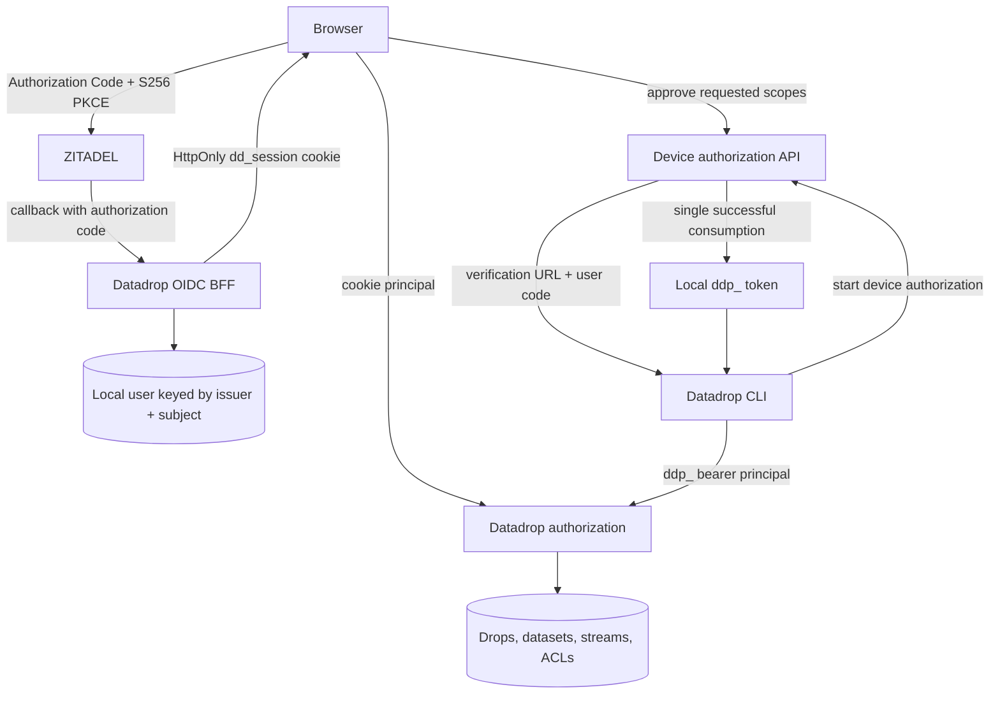
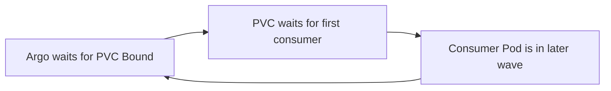
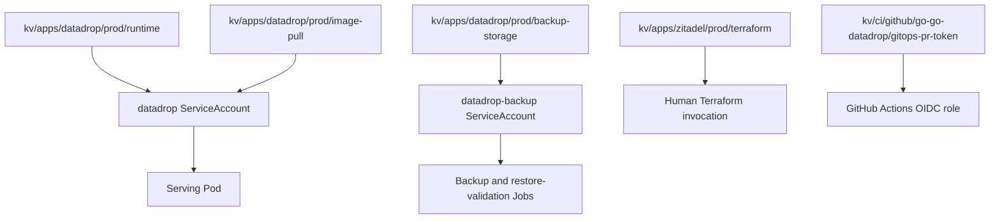
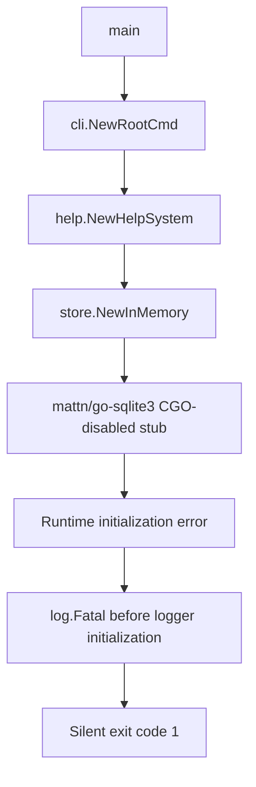

# Datadrop Production Authentication and k3s Deployment — Deep Technical Analysis

Datadrop moved from a development-oriented static root token to a production authentication and deployment model built around browser OIDC sessions, browser-approved device credentials, immutable container images, Vault-backed secrets, Argo CD, and persistent single-writer storage. This report explains the complete system: the security boundaries, the device authorization protocol, the SQLite persistence model, the k3s deployment contract, the release pipeline, and the production failure that exposed an invalid assumption about CGO-disabled builds.

> [!summary]
> - Browser users authenticate through ZITADEL and receive only an HttpOnly Datadrop session; command-line clients receive local `ddp_` credentials only after explicit browser approval.
> - Production remains a single-replica SQLite system. A local-path PVC stores both metadata and immutable blob data, while scheduled archives are written to off-node object storage.
> - Vault separates runtime, image-pull, backup, Terraform-administration, and GitOps-writer authority. Git contains paths and policies, never secret values.
> - The first production image failed because Glazed used `mattn/go-sqlite3` during CLI help initialization while Datadrop built with `CGO_ENABLED=0`. Migrating Glazed to `modernc.org/sqlite` restored a truly static image and retained FTS5.

## 1. The original security problem

The initial Datadrop server accepted a static root token. That model was convenient during early development because one credential could authorize every operation. It was not suitable for a production service with browser users, local agents, durable datasets, and explicit ownership.

A root token collapses several distinct questions into one comparison:

1. Who is the browser user?
2. Which local account owns a drop or dataset?
3. Which command-line client is acting?
4. What operations may that client perform?
5. How is a credential revoked without rotating every client?

The production design answers these questions through separate identities and credential types. ZITADEL establishes browser identity. Datadrop maps the external `(issuer, subject)` pair to a local user. Browser sessions remain in secure cookies. Device authorization creates local API tokens with bounded scopes and lifetimes. Data endpoints accept Datadrop credentials, not arbitrary ZITADEL bearer tokens.

This distinction is central. ZITADEL proves an interactive user's identity. Datadrop remains responsible for its own authorization model, token lifecycle, resource ownership, and audit surface.

## 2. Authentication architecture

The system has two authentication paths that converge on the same local authorization model.



The browser never receives a long-lived Datadrop bearer token as part of ordinary sign-in. The CLI never receives the browser's ZITADEL access token. Each boundary exposes only the credential needed by its caller.

### 2.1 Browser OIDC and BFF sessions

Datadrop is registered as a public OIDC client using Authorization Code flow and S256 PKCE. It has no client secret. The callback is fixed to:

```text
https://datadrop.yolo.scapegoat.dev/v1/auth/callback
```

The server validates the issuer, client ID, state, PKCE exchange, token signature, expiry, and verified-email requirement. It then persists or refreshes the local user identified by:

```text
(issuer, subject)
```

Email remains profile data. It is not a durable identity key because it can change and may be reassigned.

The browser receives an HttpOnly session cookie. This keeps API credentials out of browser JavaScript and preserves the BFF boundary: the server owns the OIDC exchange and session state, while the browser uses same-origin requests.

### 2.2 Local API tokens

Agent credentials use a Datadrop-specific format beginning with `ddp_`. The presented secret is not stored directly. Datadrop stores the identifying portion needed for lookup and a derived verifier for authentication. Revocation operates on a single local token record rather than on the external identity provider.

A local token carries explicit scopes. The authorization layer evaluates those scopes together with ownership and ACL rules. Removing the old root mode required deleting bypasses from the resolver and access-control paths, not merely removing one command-line flag. A hidden root bypass would have preserved the original security failure under a different name.

## 3. Browser-approved device authorization

The device flow allows a command-line client to request a local credential without opening a callback listener and without asking the user to paste a secret into a terminal.

The protocol has four phases:

```text
start -> display -> approve -> consume
```

### 3.1 Starting a pairing

The CLI requests a device authorization with a scope set and requested token lifetime. The server creates a durable pairing record and returns:

- a verification URI;
- a short user code;
- a device code used only by the polling client;
- a polling interval;
- a pairing expiry;
- the requested token lifetime.

The user code is designed for transcription and browser confirmation. The device code is a high-entropy secret. Neither should be stored as plaintext in the database.

Conceptually, creation performs:

```pseudo
validate(requested_scopes)
validate(requested_token_lifetime)

user_code = generate_human_code()
device_code = random_secret()

store({
    user_code_hash: hash(user_code),
    device_code_mac: HMAC(device_code, server_pepper),
    scopes: canonical_scopes,
    token_lifetime: requested_token_lifetime,
    pairing_expires_at: now + pairing_lifetime,
    status: pending,
    next_poll_at: now + interval
})
```

The HMAC uses a server-side pepper delivered through Vault. A database copy alone is therefore insufficient to validate guessed device codes.

### 3.2 Browser approval

The browser user follows the verification URI, signs in through the existing OIDC session if necessary, inspects the requested scopes and lifetime, and approves or denies the request.

Approval records the local user identity. It does not issue a token to the browser. The polling client remains the only party capable of consuming the approved record because it holds the device code.

### 3.3 Polling and pacing

The CLI polls the token endpoint. Several outcomes are distinct:

| Outcome | Meaning | CLI behavior |
|---|---|---|
| Pending | The browser has not decided | Wait for the interval and retry |
| Rate limited | The client polled too quickly | Respect numeric `Retry-After` and retry |
| Approved | The pairing may be consumed | Receive and store the local token |
| Denied | The user rejected the request | Stop |
| Expired | The pairing lifetime ended | Stop and begin a new flow |
| Invalid | The code does not identify a valid pairing | Stop |

Durable `next_poll_at` state enforces protocol correctness across requests. An additional process-local limiter reduces abuse by client address. That limiter is bounded to 4096 entries and sweeps expired keys, preventing unbounded memory growth from attacker-controlled addresses.

Forwarded client addresses are accepted only when the direct peer is in an explicitly configured trusted-proxy CIDR. On k3s, Traefik's PodCIDR is trusted. An arbitrary Internet client cannot supply its own `X-Forwarded-For` identity and bypass per-client limits.

### 3.4 Atomic consumption and mint-time expiry

Pairing expiry and API-token expiry are separate values. The pairing may last ten minutes, while the requested API token may last hours or days. The absolute API-token expiry must therefore be calculated when the approved record is consumed, not when pairing begins.

The consumption transaction is logically:

```pseudo
BEGIN IMMEDIATE

record = lookup_by_device_code_mac(mac(device_code))
require record.status == approved
require now < record.pairing_expires_at
require now >= record.next_poll_at

absolute_token_expiry = now + record.requested_token_lifetime
token = mint_local_ddp_token(record.user_id, record.scopes, absolute_token_expiry)
mark record consumed

COMMIT
return token_once
```

The transaction prevents two concurrent polls from minting two credentials. The token value is returned once. Subsequent polling observes a consumed record rather than reproducing the secret.

## 4. Persistence and migration discipline

SQLite stores users, sessions, local tokens, device authorizations, drops, datasets, and ACL state. Device authorization evolved through explicit migrations rather than runtime schema mutation:

- `0004_device_authorizations.sql` introduced durable pairing state;
- `0005_device_authorization_token_expiry.sql` separated token expiry data;
- `0006_device_authorization_token_lifetime.sql` stored requested lifetime so absolute expiry could be calculated at consumption.

This progression records the semantic correction directly in the schema history. Existing databases migrate deterministically at startup.

Datadrop also stores dataset bytes in a content-addressed filesystem hierarchy. SQLite metadata refers to immutable blob digests. Both the database and blob directory must therefore be treated as one recovery unit.

## 5. Production storage on k3s

The production deployment is deliberately single-writer:

```yaml
spec:
  replicas: 1
  strategy:
    type: Recreate
```

One `local-path` ReadWriteOnce PVC is mounted at `/data` and contains:

```text
/data/datadrop.db
/data/blobs/
```

SQLite does not become multi-writer because blob storage later moves to S3. Metadata serialization remains a separate architectural constraint.

### 5.1 The local-path sync-wave invariant

The k3s `local-path` storage class uses `WaitForFirstConsumer`. The PVC cannot bind until Kubernetes schedules a Pod that consumes it. Argo CD waits for resources in a sync wave to become healthy before advancing.

Therefore, the PVC and its consuming Deployment must share the same wave:

```text
wave 1: PersistentVolumeClaim/datadrop-data
wave 1: Deployment/datadrop
```

Putting the PVC in wave 0 and the Deployment in wave 1 creates a deterministic deadlock:



The repository's `scripts/validate_gitops.sh` renders every Kustomize package and checks this invariant. The Datadrop package passed validation before deployment.

### 5.2 Sync ordering

The package follows this order:

| Wave | Resources |
|---:|---|
| -3 | Namespace |
| -2 | Runtime and backup ServiceAccounts |
| -1 | VaultConnection, VaultAuth, VaultStaticSecret, image-pull secret |
| 1 | PVC and Deployment |
| 2 | Service and Ingress |

A separate bootstrap issue occurred during the first rollout: the Git version of the `prod-apps` AppProject allowed the `datadrop` namespace, but the live AppProject was stale. Argo reported `InvalidSpecError` until `gitops/projects/prod-apps.yaml` was applied. This was not a sync-wave failure. It was drift in the bootstrap-owned AppProject resource.

## 6. Vault authority boundaries

Production secret handling uses separate Vault records and policies for each operational capability.



The serving Pod can read its public OIDC client ID, device-code pepper, and GHCR pull record. It cannot read backup object-store credentials. Backup jobs can read off-node storage credentials but cannot read the runtime pepper or GitOps writer credential.

The ZITADEL administrative PAT was migrated from the chart-retained Kubernetes Secret `zitadel/iam-admin-pat` into:

```text
kv/apps/zitadel/prod/terraform
```

Terraform reads it only for the command lifetime:

```bash
TF_VAR_zitadel_access_token="$(
  vault kv get -field=access_token kv/apps/zitadel/prod/terraform
)" terraform plan
```

`TF_VAR_zitadel_access_token` is an input boundary, not a storage location. Vault remains the durable source of truth.

The GHCR pull record was copied inside Vault from an already approved deployment credential. This preserves per-application Vault and Kubernetes access boundaries, although the underlying GitHub credential is shared and must be rotated across every copied path.

## 7. Terraform-owned ZITADEL client

The Terraform root creates four resources:

1. a Datadrop organization;
2. a Datadrop project;
3. a public OIDC application;
4. an organization login policy.

The application uses:

```text
response type: Authorization Code
grant type: Authorization Code
authentication method: none
PKCE: S256
redirect URI: https://datadrop.yolo.scapegoat.dev/v1/auth/callback
logout return: https://datadrop.yolo.scapegoat.dev/
```

The ZITADEL provider marks the OIDC block as sensitive, including its public client ID. Terraform initially refused the output because a root output referred to a sensitive value. The correction was narrow:

```hcl
output "oidc_client_id" {
  description = "Nonsecret public PKCE client ID."
  value = nonsensitive(
    zitadel_application_v2.datadrop_web.oidc[0].client_id
  )
}
```

Only the public client ID is declassified. No client secret exists. After apply, Terraform immediately converged to a zero-change plan, and the client ID was written to Datadrop's runtime Vault record with a newly generated device-code pepper.

## 8. Immutable image publication and GitOps promotion

The source repository delegates image publication to the shared `infra-tooling` workflow. A trusted push to `main` performs:

```text
test source
  -> build linux/amd64 image
  -> publish sha-<short-commit> to GHCR
  -> authenticate to Vault with GitHub OIDC
  -> read GitOps writer credential
  -> open a one-file image-pin PR
```

The GitOps PR changes only:

```yaml
image: ghcr.io/go-go-golems/go-go-datadrop:sha-<commit>
```

Argo CD deploys only after that PR is reviewed and merged. `main` and `latest` are convenience tags, not production references.

A manual `workflow_dispatch` run failed Vault authentication because the role was intentionally bound to `event_name=push`. Rerunning the original trusted main-push execution succeeded. This demonstrated that the claim restriction was functioning rather than obstructing a valid production event.

## 9. The silent production image failure

The first immutable production image pulled successfully, mounted its secrets, bound its PVC, and then entered `CrashLoopBackOff`. Kubernetes logs were empty. The executable exited with status 1 even when invoked as:

```bash
datadrop --help
```

That behavior excluded OIDC discovery, SQLite database permissions, blob paths, probes, ingress, and runtime secrets. The failure occurred while constructing the command tree.

### 9.1 Reproducing outside Kubernetes

The investigation extracted the binary from the published image and executed it directly. It still exited silently. Rebuilding with the same Docker toolchain produced a byte-for-byte identical binary with the same behavior.

Temporary instrumentation narrowed startup to this sequence:

```text
entered main
NewRootCmd: direct commands
NewRootCmd: operator commands
NewRootCmd: command registrars
NewRootCmd: create help system
process exits
```

A minimal program calling the Glazed help store returned the hidden error:

```text
Binary was compiled with 'CGO_ENABLED=0', go-sqlite3 requires cgo to work.
```

### 9.2 Why the error was silent

Datadrop initialized logging through Cobra's persistent pre-run hook. The failure happened earlier, during root-command construction. Glazed's `NewHelpSystem` called `log.Fatal` when its in-memory SQLite store failed. At that point the configured logger had not been installed, so the process terminated without the diagnostic reaching container logs.

The exact path was:



This was not a Go 1.26.5 compiler defect. The toolchain produced exactly the binary requested: a CGO-disabled program containing a dependency whose runtime implementation required CGO.

## 10. Replacing the CGO dependency while retaining FTS5

Glazed used SQLite for two related capabilities:

- the embedded help store;
- validation of published SQLite help databases.

The initial recovery option enabled CGO, switched the builder to Debian, and used a glibc-bearing distroless image. That image worked locally, but it weakened Datadrop's established static-build contract and treated the dependency consequence rather than the dependency choice.

The preferred fix migrated Glazed from:

```go
import _ "github.com/mattn/go-sqlite3"

db, err := sql.Open("sqlite3", dsn)
```

to:

```go
import _ "modernc.org/sqlite"

db, err := sql.Open("sqlite", dsn)
```

`modernc.org/sqlite` is a Go translation of SQLite and supports FTS5 without CGO. Glazed's optional `sqlite_fts5` path continued to create virtual tables, triggers, and `MATCH` queries successfully.

Validation covered both code paths:

```bash
CGO_ENABLED=0 GOWORK=off go test ./pkg/help/... ./cmd/docsctl -count=1
CGO_ENABLED=0 GOWORK=off go test -tags sqlite_fts5 ./pkg/help/store ./pkg/help -count=1
CGO_ENABLED=0 GOWORK=off go build ./...
```

Glazed `v1.4.1` released this migration. Datadrop then upgraded from Glazed `v1.4.0` to `v1.4.1`, retained `CGO_ENABLED=0`, retained `distroless/static-debian12:nonroot`, and rebuilt successfully.

## 11. Turning the incident into a build invariant

A successful `go build` did not prove that command initialization worked. The production Dockerfile now executes the built artifact before copying it into the final image:

```dockerfile
RUN CGO_ENABLED=0 GOWORK=off go build -trimpath -ldflags="-s -w" \
    -o /out/datadrop ./cmd/datadrop \
    && /out/datadrop --help >/dev/null
```

This test is intentionally small. It exercises:

- process startup;
- package initialization;
- root-command construction;
- embedded help database initialization;
- embedded documentation loading;
- logging flag registration.

The local final-image test additionally proved:

```text
UID/GID: 65532/65532
SQLite migrations: successful
OIDC discovery: successful
HTTP bind: successful
GET /healthz: {"status":"ok", ...}
process state: running
```

The important release rule is direct: execute the artifact in the environment class in which it will run. Compilation, unit tests, image construction, and registry publication are separate gates.

## 12. Backup and restore-validation design

The scheduled backup job uses SQLite's online backup command rather than copying a live database file directly. It then archives the snapshot together with the immutable blob tree and uploads the archive to S3-compatible object storage under the `datadrop/` prefix.

```pseudo
work = temporary_directory()
sqlite_backup("/data/datadrop.db", work + "/datadrop.db")
tar_gzip(
    database = work + "/datadrop.db",
    blobs = "/data/blobs"
)
upload("s3://bucket/datadrop/datadrop-<timestamp>.tar.gz")
```

The weekly restore validator downloads the newest archive into scratch storage and performs two checks:

1. `PRAGMA integrity_check` must return `ok`.
2. Every digest in `dataset_files` must resolve to the expected content-addressed path in the restored blob tree.

This validates archive consistency. It does not yet prove a complete production cutover. A full recovery drill must restore into a replacement PVC or namespace, start Datadrop against that state, and validate its public behavior.

## 13. Future S3 blob storage boundary

The blob package now exposes a storage seam so immutable dataset bytes can later move from the PVC filesystem to S3-compatible storage. The boundary must preserve content-addressed semantics:

```go
type Store interface {
    Put(ctx context.Context, digest string, src io.Reader) error
    Open(ctx context.Context, digest string) (io.ReadCloser, error)
    Exists(ctx context.Context, digest string) (bool, error)
    Delete(ctx context.Context, digest string) error
}
```

Migration tooling should copy and verify blobs by digest before changing the active backend. SQLite metadata remains authoritative for dataset structure and ownership. Moving blobs does not authorize multiple Datadrop replicas against one SQLite database.

A safe migration sequence is:

```pseudo
for each digest referenced by SQLite:
    if destination does not contain digest:
        stream source blob to destination
    verify destination size and digest

report missing, corrupt, and unreferenced objects
switch configured backend only after complete verification
retain source until rollback window closes
```

## 14. Security properties of the completed design

The resulting system establishes several explicit properties:

- Raw ZITADEL OAuth access tokens are not accepted on Datadrop data endpoints.
- Browser OIDC sessions and CLI API credentials are different credential classes.
- Device credentials require explicit approval by an authenticated local user.
- Pairing codes are stored as derived values, not plaintext.
- Concurrent token consumption produces at most one credential.
- Token expiry begins when the token is minted.
- Rate limiting trusts forwarded addresses only from configured proxies.
- The serving Pod cannot read backup or GitOps credentials.
- The backup identity cannot read runtime authentication material.
- Production images use immutable commit-derived tags.
- The workload remains non-root with a read-only root filesystem and dropped capabilities.
- PVC and workload synchronization respects `WaitForFirstConsumer`.
- Static image construction now executes the final CLI initialization path.

## 15. Remaining work

The immediate deployment sequence after the Datadrop image-fix PR merges is:

1. Let the trusted main-push workflow publish the replacement immutable image.
2. Review the generated one-file GitOps image-pin PR.
3. Merge the pin and force an Argo refresh if necessary.
4. Require `Application/datadrop` to reach `Synced Healthy`.
5. Verify `/healthz` through the public TLS endpoint.
6. Complete browser OIDC sign-in and callback acceptance.
7. Complete CLI device pairing, approval, token storage, and a scoped data operation.
8. Trigger a manual backup and inspect nonsecret success evidence.
9. Trigger restore validation against the produced archive.
10. Perform a later full scratch-PVC recovery drill.

The broader follow-up is to complete the S3 blob backend and digest-preserving migration tooling. Teams, invitations, plans, billing, and entitlement systems remain intentionally outside this work.

## 16. Working rules preserved by this project

The durable engineering rules are:

- External identity establishes who the user is; application-local authorization determines what the user may do.
- Browser sessions and agent credentials require separate issuance and revocation paths.
- A pairing lifetime and a credential lifetime are different values and must be represented separately.
- Correctness-critical protocol state belongs in durable storage; process-local limiters provide bounded abuse resistance only.
- SQLite metadata and referenced blobs form one recovery unit.
- A `local-path` PVC and its first consumer must share an Argo sync wave.
- Vault paths should correspond to operational capabilities, not merely to applications.
- Terraform environment variables are process inputs, not secret stores.
- Production promotion should change one immutable image reference in Git.
- A build is incomplete until the produced artifact executes a representative startup path.

## Related repositories and artifacts

- Datadrop source: `/home/manuel/code/wesen/go-go-golems/go-go-datadrop`
- Workspace Datadrop checkout: `/home/manuel/workspaces/2026-07-27/datadrop-zitadel/go-go-datadrop`
- Glazed source: `/home/manuel/code/wesen/go-go-golems/glazed`
- Workspace Glazed checkout: `/home/manuel/workspaces/2026-07-27/datadrop-zitadel/glazed`
- k3s GitOps repository: `/home/manuel/code/wesen/2026-03-27--hetzner-k3s`
- Terraform repository: `/home/manuel/code/wesen/terraform`
- Datadrop implementation ticket: `DATADROP-12`
- Glazed pure-Go SQLite PR: `go-go-golems/glazed#615`
- Datadrop corrected image PR: `go-go-golems/go-go-datadrop#4`
