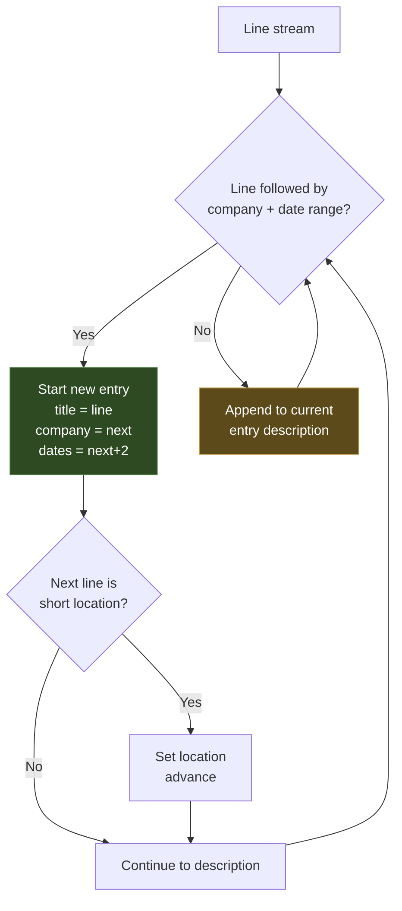

# Deep Dive: Generating a Print-Ready Resume From a LinkedIn Profile

This note documents the construction of a pipeline that turns a LinkedIn profile URL into a self-contained, print-ready HTML resume. The pipeline has two stages. The first stage is a browser-side verb, `surf-go linkedin profile`, that drives a logged-in Chromium session to extract structured profile data. The second stage is a Python generator that transforms that structured data into a styled HTML document suitable for PDF export.

The technical interest is not in the resume itself. It is in the extraction problem that the first stage has to solve. LinkedIn renders profile pages with a React Server Components and Server-Driven UI stack. The visible text a human reads is not present in the static HTML that the server returns, and it is not reliably present in the live DOM until hydration completes. The Experience and About sections live on different routes than the main profile page, and each route returns a different shape of markup. Building a correct extractor requires understanding what each route actually returns and choosing a different parsing strategy for each.

> [!summary]
> The pipeline extracts a profile in three layers: top-card fields from the live DOM, Experience entries from the static HTML of a `/details/experience/` route, and the About blurb from the static HTML of the main profile page. Each layer uses a different parsing technique because LinkedIn serves a different representation at each URL. The resume generator is a deterministic transform from the extracted JSON to a styled HTML document, with no rewriting of the source text.

## Why this note exists

The work that produced the resume is a concrete instance of a recurring problem in browser automation: a page that looks rendered to a human but is not rendered in the bytes the server sends. The standard tools for reading a page — `document.querySelector`, `DOMParser`, `innerText` — each behave differently depending on whether you are reading the live DOM after hydration or the static HTML returned by `fetch`. This note records which technique works for which LinkedIn surface, why the obvious approaches fail, and how the failure modes compound when a single verb has to combine three surfaces into one output.

The note is written for an engineer who needs to build or maintain a similar extraction pipeline against a site that uses server-side rendering with client hydration. The specific selectors and regexes will change as LinkedIn changes its markup. The decision framework for choosing between live-DOM reads, static-HTML fetches, and regex extraction is the durable part.

## The two-stage pipeline

The resume is produced by two programs that communicate through a JSON file.

```mermaid
flowchart LR
    URL["Profile URL"] --> VERB["surf-go linkedin profile"]
    VERB -->|"drives Chromium"| BROWSER["Logged-in session"]
    BROWSER -->|"live DOM + fetch"| EXTRACT["Extraction script"]
    EXTRACT --> JSON["profile.json"]
    JSON --> GEN["generate-resume.py"]
    GEN --> HTML["resume.html"]
    HTML --> PDF["Print to PDF"]

    style VERB fill:#1a3a5c,stroke:#3a7cbd,color:#fff
    style GEN fill:#2d4a22,stroke:#4a7c3f,color:#fff
    style JSON fill:#5c4a1a,stroke:#bd923a,color:#fff
```



The first program, `surf-go linkedin profile`, is a Go command that sends an embedded JavaScript probe into a Chromium tab managed by the Surf browser extension. The probe runs in the page's own origin, so it has access to the session cookies and can issue authenticated `fetch` requests to LinkedIn routes. It returns a JSON object.

The second program, `scripts/generate-resume.py`, is a standalone Python script that reads that JSON object and emits an HTML file with inline CSS. It performs no network access and no text rewriting. Its only job is to map the extracted fields onto a styled template and escape the content safely.

The separation is deliberate. Extraction is non-deterministic: it depends on the live state of a browser session, on LinkedIn's markup, and on whether the user is logged in. Generation is deterministic: the same JSON always produces the same HTML. Keeping them in separate programs means the resume can be regenerated from a captured JSON without re-running the browser, and the extraction logic can be tested without the generator.

## The extraction problem

### What the profile page actually returns

A LinkedIn profile page at `https://www.linkedin.com/in/{slug}/` is served as a React Server Components document. The server returns an HTML shell plus a stream of serialized component data. The component data is consumed by client-side JavaScript that hydrates the page into its final rendered form.

The consequence for extraction is that the static HTML returned by a plain `fetch` of the profile URL does not contain the rendered text. It contains the shell, the serialized RSC payload, and a large amount of obfuscated markup. A human loading the page in a browser sees the hydrated result. A script reading `document.querySelector('main').innerText` after hydration also sees the hydrated result. A script reading the response body of `fetch('/in/{slug}/')` sees neither.

This is the central constraint. The three pieces of data the resume needs — the top-card fields, the Experience entries, and the About blurb — are each available through a different combination of route and read technique.

| Data | Route | Read technique | Why |
|------|-------|-----------------|-----|
| Name, headline, location, followers | `/in/{slug}/` (live) | Live DOM `innerText` after readiness wait | Hydrated into `main` once the page is ready |
| Experience entries | `/in/{slug}/details/experience/` | Static HTML `fetch` + regex on `<p>`/`<li>` | Route returns static HTML with the text in paragraph tags |
| About blurb | `/in/{slug}/` (static) | Static HTML `fetch` + regex on `<p>` | Main page static HTML contains the About text in paragraph tags |
| Skills | `/in/{slug}/details/skills/` | Not extractable via static HTML | Route is fully client-rendered; static HTML has no skill text |

The table is the most important artifact in this note. Each row represents a decision that was forced by what the route actually returns, not by what would be convenient.

### Why DOMParser fails on LinkedIn's static HTML

The obvious approach to parsing the static HTML returned by `fetch` is to construct a `DOMParser` and query it. This fails for LinkedIn's markup.

LinkedIn's static HTML is not structured as a normal document tree. The component data is embedded in elements with generated class names, and the nesting does not correspond to the visual structure of the page. A `DOMParser` will build a tree, but querying that tree for semantic elements — the Experience heading, the job titles, the date ranges — returns nothing useful because the semantic structure is not encoded in the HTML structure. It is encoded in the RSC payload and reconstructed by the client.

The workaround is to not parse the HTML as a tree at all. Instead, the extractor strips `<script>` and `<style>` blocks, then pulls the text content of every `<p>` and `<li>` element using a regular expression. This works because LinkedIn does place the rendered text inside `<p>` and `<li>` tags in the static HTML, even though the surrounding structure is obfuscated. The text is there; the structure is not.

```javascript
function extractParagraphText(html) {
  const cleaned = html
    .replace(/<script[\s\S]*?<\/script>/gi, '')
    .replace(/<style[\s\S]*?<\/style>/gi, '');
  const matches = cleaned.match(/<(?:p|li)[^>]*>([\s\S]*?)<\/(?:p|li)>/gi) || [];
  const lines = matches.map((m) =>
    m
      .replace(/^<(?:p|li)[^>]*>/i, '')
      .replace(/<\/(?:p|li)>$/i, '')
      .replace(/<[^>]+>/g, '')
      .replace(/&amp;/g, '&')
      .replace(/&lt;/g, '<')
      .replace(/&gt;/g, '>')
      .replace(/&quot;/g, '"')
      .replace(/&#39;/g, "'")
      .replace(/&nbsp;/g, ' ')
      .replace(/\s+/g, ' ')
      .trim(),
  ).filter(Boolean);
  return lines.join('\n');
}
```

The function returns a newline-joined string of paragraph and list-item text in document order. This is the raw input to the section-specific parsers. It is deliberately lossy: it discards all structural information except the sequence of text blocks. The section parsers then impose structure on that sequence using heuristics about what each section's text looks like.

This is a tradeoff. A regex-based text extractor is fragile against markup changes, but it is the only approach that works against markup that has no usable structure. The alternative — parsing the RSC payload directly — would couple the extractor to LinkedIn's internal serialization format, which changes more frequently than the presence of `<p>` tags.

## The three extraction layers

### Layer 1: Top-card fields from the live DOM

The top-card fields are the name, headline, location, and followers count. These are read from the live DOM after the page has hydrated.

The readiness check is the first non-trivial decision. The page's `readyState` is not a signal, because LinkedIn reports `complete` before the RSC payload has hydrated into visible text. The check that works is a combination of two conditions: the `<main>` element has non-empty `innerText` of at least 50 characters, and that text contains either a followers count or a connection-degree marker.

```javascript
const ready = await waitForCondition(() => {
  if (isChallenge()) return null;
  const main = document.querySelector('main');
  const text = (main?.innerText || '').trim();
  if (text.length < 50) return null;
  if (!/\d+\s+followers|·\s*\d+(st|nd|rd|th)?\s+connection/i.test(text)) return null;
  return { ok: true };
}, 30000);
```

The 50-character threshold and the followers-or-connection regex together form a signal that the profile has actually rendered, not just that the document has loaded. If this condition is not met within 30 seconds, the verb throws rather than returning partial data.

Once the page is ready, the top-card fields are extracted by position from the lines of `main.innerText`. The name comes from `document.title` split on `|`. The headline is the line immediately after the name. The location is the line after that. The followers count is extracted with a regex.

The positional extraction is fragile by design. LinkedIn does not expose stable selectors for these fields, and the RSC markup does not contain semantic anchors. The line order in `innerText` is stable across sessions for a given profile shape, so positional extraction against `innerText` is more reliable than selector-based extraction against the obfuscated DOM.

### Layer 2: Experience entries from the details route

The Experience section is not on the main profile page. It lives on a separate route: `/in/{slug}/details/experience/`. This route returns static HTML that contains the experience entries as text in `<p>` tags.

The fetch is authenticated. LinkedIn requires a `csrf-token` header on `POST` requests, and the convention extends to detail-route `GET` requests in the page context. The token is read from the `JSESSIONID` cookie.

```javascript
function getCsrf() {
  const m = document.cookie.match(/(?:^|;\s*)JSESSIONID="?([^";]+)"?/);
  return m ? m[1] : '';
}
```

The fetch is issued with `credentials: 'include'` so that the session cookies are sent. The response is the static HTML, which is passed through `extractParagraphText` to produce a newline-joined string of paragraph text.

The parser then walks that string line by line to reconstruct structured entries. An entry is a sequence of lines that matches a specific pattern: a title line, followed by a company line, followed by a date range containing a four-digit year. The company line may be either `Company · Type` (with a middle dot separator) or `Company` alone.



The location heuristic is the part that required the most iteration. The first implementation accepted any line containing a comma as a location. This was too greedy: it matched the first sentence of multi-sentence job descriptions, which often contain a comma. The result was that the description text was stuffed into the location field, and the description was truncated.

The fix tightens the heuristic on two axes. First, a location line must be short — at most 50 characters. Second, it must match one of two patterns: a remote-work keyword (`Remote`, `Hybrid`, `On-site`), or a `City, ST` pattern where the state is two or more uppercase letters.

```javascript
if (cand && cand.length <= 50
    && !/^•/.test(cand)
    && !/^\d{4}/.test(cand)
    && !/·/.test(cand)
    && !/^enhance/i.test(cand)
    && !/^experience$/i.test(cand)
    && (/^(remote|hybrid|on-site)$/i.test(cand)
        || /^[A-Z][A-Za-z .\-]+,\s*[A-Z]{2,}/.test(cand))) {
  current.location = cand;
  i += 1;
}
```

The negative conditions are as important as the positive ones. A line starting with `•` is a bullet, not a location. A line starting with a four-digit year is a date range that leaked past the entry boundary. A line containing `·` is a company-type line. Each negative condition corresponds to a specific failure observed during probing.

Entries are separated by "Enhance with AI" buttons that LinkedIn inserts between them. The parser skips these lines. The final output is an array of entry objects, each with `title`, `company`, `employmentType`, `dates`, `location`, and `description` fields.

### Layer 3: The About blurb from the main page

The About section presented a different problem. The main profile page's live DOM does not reliably expose the About text through `innerText`, because the About card is rendered as part of the RSC hydration and its text is not always in the `main` element's text content. A dedicated `/details/about/` route returns 404.

The solution is to fetch the main profile page's static HTML and extract the About text from the `<p>` tags. The About blurb is present in the static HTML as paragraph text, even though it is not reliably in the live `main.innerText`.

The `parseAbout` function finds the "About" heading in the paragraph text stream and collects subsequent lines until it hits a section boundary. The boundaries are other section headings (Experience, Activity, Skills, Education) and date ranges that indicate experience entries have leaked into the stream.

```javascript
function parseAbout(text) {
  const lines = text.split('\n').map(normalizeText).filter(Boolean);
  const aboutIdx = lines.findIndex((l) => /^about$/i.test(l));
  if (aboutIdx < 0) return null;
  const stopPattern = /^(experience|activity|skills|education|recommendations|interests|honors|profile language|about accessibility|select language|page language)$/i;
  const collected = [];
  for (let i = aboutIdx + 1; i < lines.length; i++) {
    const line = lines[i];
    if (stopPattern.test(line)) break;
    if (/\d{4}\s*[-–·]\s*(?:Present|\d{4})/.test(line)) break;
    if (line.length < 40 && !/[.!?]$/.test(line)) continue;
    collected.push(line);
  }
  if (collected.length === 0) return null;
  return collected.join('\n\n');
}
```

The short-line filter (`line.length < 40 && !/[.!?]$/.test(line)`) removes UI labels like "Contact info" and "500+ connections" that appear between the About heading and the blurb text. These labels are short and do not end with sentence punctuation, while the About blurb consists of full sentences. The filter is a heuristic, but it is a heuristic grounded in the structural difference between labels and prose.

### Graceful degradation

All three layers are wrapped in a single `try` block. If any fetch fails, or if the CSRF token is absent, the verb does not throw. It returns the top-card fields with empty arrays for Experience and Skills and `null` for About.

```javascript
let experience = [];
let skills = [];
let about = null;
try {
  const csrf = getCsrf();
  if (csrf) {
    // ... fetch and parse each section ...
  }
} catch (_) {
  // Degrade gracefully: top-card fields remain valid.
}
```

This is a deliberate choice. The top-card fields are the most reliable extraction and the minimum viable output. A resume with a name, headline, and location but no Experience is still useful as a starting point. A verb that throws when the Experience route is unavailable produces nothing. The degradation path means the verb always returns a valid JSON object, and the generator can produce a partial resume that the user can complete manually.

## The resume generator

The generator is a single Python file, `scripts/generate-resume.py`. It reads a JSON object and writes an HTML file. It has no dependencies beyond the standard library.

### The verbatim contract

The generator does not rewrite any text. The Experience descriptions, the About blurb, and the job titles are inserted into the HTML exactly as they appear in the JSON. The only transformations are HTML escaping and structural formatting: splitting concatenated bullets onto separate lines, and splitting the About blurb into paragraphs on double newlines.

This contract matters because the source is a person's professional profile. Rewriting the text — tightening prose, normalizing punctuation, reformatting dates — would produce a resume that does not match the profile it was generated from. The generator's job is presentation, not authorship.

### Bullet splitting

LinkedIn concatenates bullet points in job descriptions. A description that a human reads as three separate bullets arrives in the JSON as a single string with `•` characters embedded: `•First point•Second point•Third point`.

The `render_description` function splits on the bullet marker and renders each segment as a list item. The first segment, if it is not a bullet, is rendered as an introductory paragraph.

```python
def render_description(desc):
    if not desc:
        return ""
    parts = desc.split("•")
    intro = parts[0].strip() if parts else ""
    bullets = [p.strip() for p in parts[1:] if p.strip()]
    out = ""
    if intro:
        out += f"<p>{esc(intro)}</p>"
    if bullets:
        out += '<ul class="bullets">' + \
               "".join(f'<li class="bullet">{esc(b)}</li>' for b in bullets) + \
               "</ul>"
    return out
```

The extraction script performs a similar split on the raw text before it reaches the JSON, so the bullet markers are normalized to a leading `• ` on each line. The generator's split is a second normalization that handles any residual concatenation. The two-stage split is redundant by design: the extraction script cannot guarantee that LinkedIn's markup will not change how bullets are concatenated, so the generator defends against the case where the extraction split fails.

### The Resources section

The Resources section is the one part of the resume that is not extracted from LinkedIn. It is a static list of links curated in the generator: a Substack, two conference talks, two GitHub accounts, an agent project vault, and a Claude experiments gallery.

The descriptions for these resources are written in the first person, in the voice of the profile owner. This is a deliberate choice. The rest of the resume is verbatim extracted text. The Resources section is the one place where the document speaks directly to the reader, and a third-person, passive-voiced description would read as if a different author had written it. First-person descriptions make the section consistent with a self-authored resume.

The resources are hardcoded in the generator rather than extracted because LinkedIn does not provide a structured surface for external links of this kind. The profile's "Featured" section exists but is inconsistent across profiles and does not reliably contain the specific links the resume needs.

### Print readiness

The HTML is structured for print export. The CSS uses a `@media print` block that removes the page shadow, the margin, and the max-width constraint, and sets the padding to `0.5in` to match standard printer margins.

```css
@media print {
  body { background: #fff; }
  .page { box-shadow: none; margin: 0; max-width: none; padding: 0.5in; }
}
```

The on-screen layout uses a centered page with a max-width of 800 pixels and a subtle shadow, which approximates the printed page. The print layout removes these screen-only properties so that the browser's print dialog controls the page size and margins directly.

The content uses `overflow-wrap: anywhere` on entry text and `word-break: break-all` on links to prevent long URLs from overflowing the page width. Without these properties, a long URL in the Resources section would extend past the right margin and be clipped in the printed PDF.

## Failure modes

### The location-shadowing trap

JavaScript page scripts that declare a local variable named `location` or `document` shadow the global `location` and `document` objects. This produces a temporal dead zone error: the local variable is in scope from the start of the function, but it is uninitialized until the declaration line, so any reference to `location` or `document` before that line throws `ReferenceError: Cannot access 'location' before initialization`.

This is not a LinkedIn-specific problem, but it recurs in embedded scripts because the script author does not control the surrounding page's variable names. The defense is to never name a local variable `location` or `document` in embedded JavaScript. The extraction script uses `locationLine` and `location_e` instead.

### The cached-file trap

When iterating on the generator, a local HTTP server may serve a cached copy of the HTML file. The file on disk is updated, but the browser displays the old version. This produces a confusing debugging loop: the HTML source contains the new content, but the rendered page does not.

The cause is that `python3 -m http.server` sets caching headers that allow the browser to reuse a cached response. The fix is to force a hard reload, or to serve the file from a different path, or to use a server that sends `Cache-Control: no-cache`. During development, copying the updated file to the server's working directory and reloading is the simplest workaround.

### The skills extraction blocker

The Skills section is the one part of the goal that the pipeline does not complete. The `/details/skills/` route returns a page that is fully client-rendered. The static HTML contains no skill text — only the page shell and the RSC payload. The `extractParagraphText` function returns navigation chrome, not skills.

The two approaches that would work are: navigate the browser tab to the skills route and read the live DOM after hydration, or find a Voyager API endpoint that returns skills as JSON. The first approach changes the verb's tab-ownership flow, because the verb currently reads the main page and then issues fetches without navigating away. The second approach requires identifying the correct Voyager endpoint, which is not documented and must be discovered by inspecting network traffic.

Neither approach was implemented because the Experience section provides the core resume content, and the Skills section was removed from the final resume at the user's request. The blocker is recorded here so that a future implementer does not repeat the static-HTML approach and expect it to work.

## The data contract

The verb returns a JSON object with this shape. The generator depends on these field names and types.

```json
{
  "slug": "manuel-odendahl-a2369122",
  "href": "https://www.linkedin.com/in/manuel-odendahl-a2369122/",
  "name": "Manuel Odendahl",
  "headline": "Staff Software Engineer | ...",
  "location": "Providence, Rhode Island, United States",
  "connectionDegree": null,
  "followers": "361011",
  "about": "I am a staff-level software engineer ...",
  "experience": [
    {
      "title": "Principal Software Engineer",
      "company": "Mento",
      "employmentType": "Full-time",
      "dates": "May 2024 - Jan 2026 · 1 yr 9 mos",
      "location": null,
      "description": "Joined a two-person engineering team ...\n• Built ...\n• Designed ..."
    }
  ],
  "skills": [],
  "loggedIn": true,
  "observedAt": "2026-07-27T16:40:00.000Z",
  "waitedMs": 3200
}
```

The `experience` array is the core content. Each entry has a `description` field that may contain embedded `•` bullet markers. The `about` field is a string with paragraphs separated by `\n\n`. The `skills` array is empty in the current implementation. The `loggedIn` field is a boolean that the generator does not use but that is useful for diagnostics.

## Key points

- The pipeline separates extraction (non-deterministic, browser-dependent) from generation (deterministic, pure transform). A captured JSON can regenerate the resume without re-running the browser.
- LinkedIn's profile page is an RSC document. The static HTML does not contain the rendered text. The live DOM does, but only after hydration. Different data is available through different combinations of route and read technique.
- `DOMParser` cannot build a usable tree from LinkedIn's obfuscated static HTML. Regex extraction of `<p>` and `<li>` text content is the working approach, because the text is present in those tags even when the structure is not.
- The Experience entries live on a `/details/experience/` route that returns static HTML with the text in paragraph tags. The About blurb is in the main page's static HTML. Skills are on a route that is fully client-rendered and cannot be extracted via static HTML.
- The location heuristic in the Experience parser must be tight. A greedy heuristic that accepts any comma-containing line will stuff description text into the location field. The working heuristic requires a short line matching a remote-work keyword or a `City, ST` pattern.
- All extraction layers degrade gracefully. A failed fetch or a missing CSRF token produces empty arrays, not an exception. The verb always returns a valid JSON object.
- The generator does not rewrite text. The only transformations are HTML escaping, bullet splitting, and paragraph splitting. The resume matches the profile verbatim.
- The Resources section is static and first-person. It is the one part of the resume that is authored rather than extracted, and its voice is consistent with a self-authored document.

## Related notes

- [[ARTICLE - surf-go Browser Verbs - Using JS Probes to Build Reliable Web Automation]] — the parent playbook for the probe-first verb workflow that this pipeline follows
- [[PROJ - surf-go Upwork Verbs - Browser-Side Extraction Behind Cloudflare and Login]] — a sibling extraction project against a different authenticated site
- [[PROJECT REPORT - surf-go ChatGPT File Downloader - Driving the Backend API Through the Page Context]] — another instance of using in-page fetch with session cookies to reach authenticated endpoints
