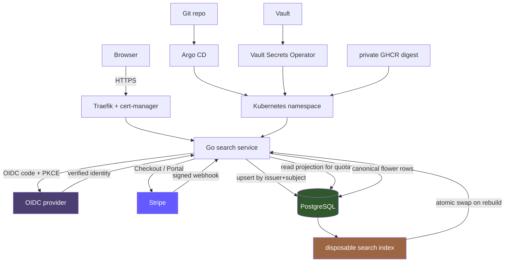

# Playbook: Subscription Search Product Architecture

This is a practical architecture playbook for building a website where customers sign up, pay a monthly subscription, and search a curated database — the specific motivating example is a flower information database, but the pattern applies to any "pay a monthly fee to search our content" product. The playbook distills guidelines from the [[Research/Software Architecture Garden/README|Software Architecture Garden]] and the go-go-golems knowledge base, where nearly every component has already been built, acceptance-tested, and deployed in the `zitadel-go-test` application and its sibling projects.

The target audience is an engineer who is about to greenfield this kind of product and wants to reuse proven structure instead of rediscovering the same constraints. Every guideline below carries an evidence source and a maturity label, so you know how much to trust it.

> [!summary]
> - The `zitadel-go-test` application is a near-complete reference: OIDC signup → `(issuer, subject)` identity → Stripe hosted Checkout → signed-webhook inbox → PostgreSQL subscription projection → SQL-enforced quota → K3s delivery. Swap "TODO quota" for "search quota" and the shape is your product.
> - Search adds a derived, disposable full-text index over a canonical store (SQLite or PostgreSQL), built once and read cheaply at request time, with an atomic swap for hot reloads.
> - The only genuinely new engineering work is **metered search quota** — counting searches-per-billing-period instead of stored objects. Everything else is Established or Candidate-ecosystem reuse.

## Why this note exists

A "subscribe to search our database" product combines three independently hard problems: delegated customer identity, correct subscription billing under concurrency and failure, and a search layer over curated content. The Architecture Garden already studied each of these in real, deployed, acceptance-tested applications. This note exists so that a new project does not re-derive the structures from scratch — it can start from the combined blueprint and focus its novel effort on the domain (the flower data) and the one new pattern (metered search).

The note is written as a playbook, not as a postmortem. It states the chosen architecture, the rules that make it safe, and the debts to avoid on day one.

## When to use this architecture

Use this architecture when you are building a product that is:

- a website customers sign up to with an email address;
- funded by a recurring monthly subscription (Stripe Billing);
- gated by an entitlement that controls how much a customer can search; and
- backed by a curated, slowly-changing database that customers search.

Do not use this architecture when:

- the product is free / has no billing boundary — drop the entire billing section and keep only identity + search;
- search traffic is anonymous and rate-limited rather than per-customer-metered — the metered-quota pattern (§3.4) is the only piece that assumes per-user accounting;
- the content changes constantly and at high volume — the two-phase load/snapshot pattern in §3.2 still applies, but the index rebuild cadence and the disposable-index assumption need re-examination;
- you need real-time collaborative editing of the database — none of the source projects cover that, and you should look elsewhere.

## Chosen architecture

A single server-rendered Go binary on `net/http`, backed by PostgreSQL, with OIDC authentication, Stripe Billing for subscriptions, and a disposable full-text search index (Bleve for an MVP, PostgreSQL FTS or a hybrid BM25+vector retriever at scale). The binary is delivered as an immutable, digest-pinned, distroless container image promoted through GitOps, with secret values supplied at runtime by a host-mediated secret delivery mechanism (Vault Secrets Operator on K3s, or a simpler equivalent at MVP scale).



The diagram splits deliberately into a runtime path (top) and a delivery path (bottom), mirroring the Architecture Garden convention: a correct handler running with the wrong secret, image, or database role is not a correct deployed system.

## Identity and signup

### Key users by `(issuer, subject)`, never by email  `[Established]`

The application delegates authentication to an OIDC provider and creates a local user row. The critical decision is which external fact identifies that row. Email is convenient but fails as a durable key for three reasons: a person may change address, an address may be recycled to another person, and two providers may assert the same text under different trust policies. The local row uses a compound external key:

```sql
UNIQUE (issuer, subject)
```

The projection is idempotent — a repeated login finds the same row; a changed email updates mutable profile state without moving ownership of existing search history or subscription state.

*Source: `Research/Software Architecture Garden/zitadel-go-test/02 - External Identity and Local Projection.md`*

### Delegate authentication; validate tokens locally  `[Established]`

The app never stores password hashes, verification codes, recovery links, or MFA factors. It accepts a cryptographically validated subject and creates the row it needs. Token validation uses cached JWKS keys, not an introspection endpoint on every request, so a provider outage does not kill existing sessions — new logins fail, but authenticated sessions survive.

*Source: `Research/KB/Tribal/application-native-authorization.md`*

### Keep "who" and "what may they do" separate  `[Established]`

The OIDC token proves *who* the human is. The database proves *what plan they are on and what they may search*. Three independent go-go-golems projects arrived at this same separation. The most common mistake is treating a valid token as sufficient authorization for everything; a valid token proves identity, not entitlement. Product roles and plan limits live in application storage, queryable without consulting the identity provider.

*Source: `Research/KB/Tribal/application-native-authorization.md`*

### Treat email verification as five independent boundaries  `[Established]`

"Email verification" is not one feature. It is five state transitions owned by different components:

| Boundary | Owner | Success does not prove |
| --- | --- | --- |
| Verification policy | Identity provider policy | that a challenge was created |
| Challenge initiation | Provider user API | that an SMTP channel exists |
| Message delivery | Notification worker + SMTP | that the user redeemed |
| Redemption | Provider user state | that the application accepted the claim |
| Application authorization | Your `email_verified` gate | that future recovery works |

Never trust a UI "code sent" banner — the production acceptance caught a real defect where the UI reported success while the worker logged `Errors.SMTPConfig.NotFound`. Accept verification only when a controlled external mailbox receives the message, and preserve an application-level `email_verified=true` gate on protected routes.

*Source: `Projects/2026/07/26/PROJECT REPORT - ZITADEL SES SMTP - Vault Backed Verification and Recovery.md`*

## Subscription billing

### Browser redirect is not billing truth  `[Established]`

A Checkout return proves only that a browser visited a URL. It does not prove the subscription is active, paid, uncanceled, or associated with the expected customer. The authoritative path is:

```text
signed webhook
  -> retrieve current Stripe state
  -> exact configured Price + allowed status
  -> transactional projection into your database
```

The event indicates that reconciliation should occur. The retrieved object establishes current state. The configured Price establishes catalog membership. The local projection makes authorization fast and auditable. Never grant entitlement from a redirect.

*Source: `Projects/2026/07/26/PROJECT REPORT - Stripe Billing - End to End Subscription Infrastructure and Acceptance.md` §7, §10*

### Terraform owns the stable catalog; it does not own transactional objects  `[Established]`

Terraform manages the Pro Product, the recurring monthly Price, currency, amount, tax code, tax behavior, lookup key, and environment metadata, with **separate sandbox and live state roots, state keys, and credentials**. Customers, Checkout Sessions, subscriptions, invoices, payment methods, and webhook events are runtime objects — they must not live in Terraform state, because their lifecycles depend on transactional user activity. Import any matching existing catalog objects before the first apply; do not create duplicates.

*Source: `PROJECT REPORT - Stripe Billing` §3, §4*

### Put webhook endpoints outside Terraform  `[Established]`

Creating a Stripe webhook endpoint returns its signing secret once. Terraform state is not an approved secret store, and marking an output `sensitive` hides routine display without removing the value from state. The selected policy: an operational bootstrap script creates the endpoint and streams the one-time signing secret directly into the secret authority. If the secret authority persistence fails, the script deletes the endpoint — it never leaves an enabled endpoint whose signing secret was lost.

*Source: `PROJECT REPORT - Stripe Billing` §6*

### Entitlement fails closed  `[Established]`

Pro requires two simultaneous conditions: the subscription contains exactly the configured Terraform Price, and its status belongs to an allowed set (`trialing`, `active`, `past_due`). Everything else — incomplete, paused, unpaid, canceled, unknown — maps to Free. **Metadata is diagnostic, never authorization**, because it can be edited independently of the subscription. Multiple subscription items, an unknown Price, or ambiguous catalog state fail closed to Free and produce an operationally visible condition rather than a silent grant.

*Source: `PROJECT REPORT - Stripe Billing` §11*

### Webhook idempotency inbox with claim leases  `[Established]`

The Stripe event ID is a stable idempotency key. A dedicated table records events before projection and tracks processing state. Because uniqueness alone does not stop two workers from processing the same received row concurrently, the design adds claim leases and tokens:

```sql
UPDATE stripe_events
   SET processing_state = 'processing',
       claim_token = :new_token,
       lease_expires_at = now() + :lease
 WHERE stripe_event_id = :event_id
   AND (processing_state IN ('received','retryable_error')
        OR lease_expires_at < now())
RETURNING claim_token;
```

Exactly one transaction receives the claim token. After claiming, the worker retrieves *current* Stripe subscription state rather than trusting event-payload chronology, then writes the billing projection and marks the event processed in one transaction — if projection fails, event completion does not commit. This prevents an old event from regressing an entitlement that a later event already advanced.

*Source: `Research/Software Architecture Garden/zitadel-go-test/04 - PostgreSQL State and Webhook Projection.md`; `PROJECT REPORT - Stripe Billing` §10*

### Enforce quota in SQL near the mutation, atomically  `[Established]`

Quota enforcement belongs close to the mutation. The application cannot safely perform "count, compare, act" as independent statements under concurrency — two requests can both observe under-limit and both succeed. The correct implementation makes the limit decision and the action one user-scoped critical section:

```text
BEGIN
acquire pg_advisory_xact_lock(user_id)
current = count metered usage for user this billing period
limit = free_limit if Free else pro_limit
if current >= limit:
    ROLLBACK with quota error
else:
    record usage / perform action
    COMMIT
```

The advisory lock makes count-and-act atomic per user while allowing unrelated users to proceed concurrently.

*Source: `PROJECT REPORT - Stripe Billing` §19*

### Downgrade never deletes user data  `[Established]`

A quota controls new work; it does not silently delete, hide, or mutate existing data. A Pro customer who downgrades keeps reading their saved searches and existing results; only new metered search work is gated until usage falls below the new limit. Storage ownership and entitlement are separate concerns.

*Source: `PROJECT REPORT - Stripe Billing` §12*

### Rotate signing secrets with a bounded overlap window  `[Established]`

Accept `current,previous` in an ordered configuration. Verify against the ordered list and take the first match; never select a secret based on payload content. After confirming the new secret processes signed events with no backlog, disable and remove the old endpoint and store only the new secret. The overlap is bounded — retaining old secrets indefinitely widens endpoint-impersonation risk.

*Source: `PROJECT REPORT - Stripe Billing` §17*

## Search

### Canonical store owns the data; the search index is disposable and rebuildable  `[Established]`

The relational database (PostgreSQL at scale, SQLite for a single-tenant MVP) is the source of truth for flower rows. The full-text index is a derived artifact that can be deleted and rebuilt from canonical rows at any time. Keep **one search backend only** — maintaining FTS5 and Bleve in parallel creates a split future where ranking and lifecycle drift apart. The disposable-index assumption is what makes hot reloads and schema changes safe.

*Source: `Projects/2026/05/22/ARTICLE - Readwise Viewer Bleve Search Port.md`; `Research/KB/Tribal/sqlite-as-application-database.md`*

### Two-phase execution: build at load, read cheaply at request  `[Candidate ecosystem]`

Front-load expensive parsing and indexing so request handlers do only cheap reads against an in-memory snapshot. For reloads when the flower data changes, follow the build-then-atomically-swap discipline: construct the new index fully, swap it into place under a lock, and clean up the old snapshot only after the swap. This never exposes a half-built index to request handlers.

```text
snapshot_new = buildIndex(canonicalRows)      # full build off-request-path
lock
  snapshot_old = current
  current = snapshot_new
unlock
# delayed cleanup of snapshot_old once no reader can hold it
```

Any future feature that does expensive work per request is a design smell — the work belongs at load time or in a background rebuild.

*Source: `Research/Software Architecture Garden/publish-vault/01 - Project Architecture Overview.md`*

### Start BM25-only; add vectors only if you need semantic search  `[Emergent]`

Lexical BM25 search handles "rose", "shade perennial", "zone 5" well, and is cheap to build and operate. Hybrid BM25-plus-vector retrieval with reciprocal-rank fusion helps fuzzy or intent-driven queries ("drought-tolerant pink flowers for shade"). The honest finding from the corpus: **retrieval quality is bounded by corpus coverage, not by the algorithm** — invest in the flower data (field coverage, consistent terminology, complete descriptions) before investing in a fancier retriever. Add vectors as a second stage, not a replacement for the lexical baseline.

*Source: `Projects/2026/05/28/ARTICLE - RAG Evaluation System - Search Retrieval Foundation Deep Dive.md`*

### Adapt the quota pattern for metered search actions  `[NEW — to validate]`

The proven quota pattern counts *stored objects* (active rows) under an advisory lock. A subscription-search product meters *actions* — searches performed per billing period. Apply the same atomic count-then-act discipline, but count from a `search_usage` table keyed by `(user_id, billing_period)`:

```sql
INSERT INTO search_usage (user_id, period, performed_at)
SELECT :uid, :period, now()
WHERE (
  SELECT count(*) FROM search_usage
  WHERE user_id = :uid AND period = :period
) < :limit_for_plan;
-- if 0 rows inserted, the quota was exceeded; fail closed
```

This is the one genuinely new pattern in this playbook. It has not yet been built and acceptance-tested in the corpus; once it is, it should be contributed back to the Architecture Garden as a new candidate ecosystem guideline alongside the stored-object quota pattern.

## Application shape

### Standard-library `net/http`; no web framework  `[Established]`

Go's method-aware `http.ServeMux`, typed closure middleware, and small middleware functions are sufficient for a compact service. Middleware enriches the handler contract inward: an `authenticated(next)` wrapper passes a verified local user to inner handlers, so a search handler never re-derives identity. (This is also a pinned project convention: `net/http` with `*http.ServeMux` only — never chi, gin, or echo.)

*Source: `Research/Software Architecture Garden/zitadel-go-test/03 - Standard Library HTTP Composition.md`*

### Authorization in the SQL, not in app code  `[Established]`

Selection and authorization are one operation. Saved searches, billing rows, and any per-user data are constrained by both object ID and user ID in the query, so a missed condition produces zero affected rows rather than exposing another customer's object:

```sql
DELETE FROM saved_searches WHERE id = $1 AND user_id = $2
```

*Source: `Research/Software Architecture Garden/zitadel-go-test/04 - PostgreSQL State and Webhook Projection.md`*

### Separate keys for separate concerns  `[Established]`

CSRF uses an independent key, not the OIDC/session encryption key. A change in one protocol must not silently affect another, and the keys must rotate independently. Security headers wrap the whole router at the outer boundary; CSRF wraps only mutations, *after* authentication. Webhooks are exempt from CSRF — their trust proof is a cryptographic signature over the raw body, and applying browser middleware would make legitimate delivery impossible.

*Source: `Research/Software Architecture Garden/zitadel-go-test/03 - Standard Library HTTP Composition.md`*

### Finite server timeouts and signal-aware shutdown  `[Established]`

Server lifecycle is code, not a property inferred from the container runtime. Configure finite header, read, write, and idle timeouts. Shut down from a signal-aware context with its own deadline. Embed templates and static assets in the binary so that one versioned artifact carries handlers, layouts, CSS, and code.

*Source: `Research/Software Architecture Garden/zitadel-go-test/03 - Standard Library HTTP Composition.md`*

## Secrets and delivery

### Host-mediated secret delivery  `[Candidate ecosystem]`

Secrets are never copied to the consumer. The authority (Vault) stores values; a host/mediator (Vault Secrets Operator on Kubernetes, or an equivalent reconciler) fetches values at runtime and delivers bounded, policy-gated, native-format secrets. The application receives a Kubernetes Secret, not a Vault token. Secret *intent* (paths, role names, refresh intervals) lives in Git; secret *values* live in Vault. Rotation happens at the authority, and the next delivery picks up the new value.

For a smaller MVP you can use platform-native secrets with the same discipline (intent in Git, values out of Git, one delivery point), but do not let secrets drift across `.envrc`, CI variables, and container env fields — that is the failure mode host-mediated delivery was designed to eliminate.

*Source: `Research/KB/Tribal/host-mediated-secret-delivery.md`*

### Immutable digest-pinned images; native Go healthchecks  `[Candidate ecosystem]`

A source commit becomes a private immutable image digest, then a reviewed GitOps revision. The runtime image is distroless and non-root, with capabilities dropped, privilege escalation forbidden, and a read-only root filesystem where the workload permits. Native Go `/healthz` and `/readyz` handlers avoid shipping a shell or `curl` in the image, keeping it smaller and removing debugging utilities from the production attack surface.

*Source: `Research/Software Architecture Garden/zitadel-go-test/06 - Vault GitOps and Immutable Delivery.md`*

### Separate privileged bootstrap from runtime identity  `[Candidate ecosystem]`

A short-lived bootstrap job may create a database role and schema; the long-running application receives only that role. The application never holds PostgreSQL administration credentials. On Kubernetes, distinct service accounts and Vault roles reinforce the separation.

*Source: `Research/Software Architecture Garden/zitadel-go-test/06 - Vault GitOps and Immutable Delivery.md`*

### Sandbox first, then live; never conflate the two  `[Established]`

The reference application intentionally ran sandbox Stripe credentials on a public, production-shaped hostname to validate the complete OIDC/Checkout/Portal/webhook topology before any live-money acceptance. Live mode is a separate, operator-approved gate with its own catalog import, tax registration, restricted key, and acceptance run. Do not mark live production complete from sandbox evidence.

*Source: `PROJECT REPORT - Stripe Billing` §16, §22*

## Day-one fixes — debts not to repeat

| Debt observed in the corpus | Take the fix instead |
| --- | --- |
| Full OIDC context in an encrypted cookie exceeds browser limits once real tokens arrive | Use PostgreSQL-backed sessions from the first commit |
| Compatibility bridges left executable after a migration, with no retirement criteria | Delete old implementations on cutover; no "temporary" shims |
| Duplicate catalogs repeating facts without generating runtime code | One source of truth that generates the runtime artifacts |
| Raw `map[string]any` escape hatches bypassing the typed contract | No untyped maps in the hot path; typed specs own lowering |
| Hand-rolled CLI output layer where verbs silently ignore `--output` | Use Glazed from day one, or skip a CLI entirely for a web product |
| Two `findRepoRoot` implementations looking for different sentinels | One repo-root discovery function |

*Sources: `Research/Software Architecture Garden/zitadel-go-test/10 - PostgreSQL Backed OIDC Session Follow-up.md`; `rag-evaluation-system/08 - Architecture Debt and Patterns Not to Repeat.md`; `go-go-datadrop/08 - Architecture Debt and Patterns Not to Repeat.md`*

## Validation discipline

### Cumulative validation matrix; no layer substitutes for another  `[Established]`

Passing unit signature tests does not prove ingress delivery. A green Terraform plan does not prove Checkout uses the output. Browser payment does not prove retry convergence. Build a matrix and require every row:

| Layer | Evidence |
| --- | --- |
| Go correctness | formatting, race tests, unit/integration tests, vet |
| Database | ownership isolation, quota locking, billing claim/projection |
| Webhook | real Stripe CLI signature transport and invalid-signature tests |
| Catalog | sandbox Terraform apply and repeated zero-drift plan |
| Tax | active test-mode tax, valid origin, exact tax code and behavior |
| Billing lifecycle | Test Clock renewal, failure, dunning, recovery, cancellation |
| Hosted UX | real Checkout and Customer Portal browser acceptance |
| Container | distroless non-root, native health/readiness |
| Secrets | tracked-file and all-git-history scanner |
| GitOps | Argo Synced/Healthy, trusted TLS, runtime secret projection |

*Source: `PROJECT REPORT - Stripe Billing` §21*

### Test negative policy enforcement, not just positive  `[Established]`

It is easy to test that a valid token can read the right secret. The test that matters is that an invalid token, a wrong policy, or a mismatched tenant *cannot*. Authorization decisions are SQL queries with `WHERE` clauses binding to `user_id` and plan; a missing clause becomes a silent authorization bypass. Write integration tests that directly verify the SQL enforces the security model.

*Source: `Research/KB/Tribal/application-native-authorization.md`; `PROJECT REPORT - Stripe Billing` §18*

### Structural guard tests once you have a layering rule  `[Candidate — strongest]`

Once you define an architectural invariant (for example, "handlers never import the billing SDK directly", or "the search package never imports the OIDC package"), encode it as a test that walks the source tree, asserts the invariant, and carries an allow-list in which every exemption states its reason in a sentence. This catches architecture drift in CI rather than in review, and the allow-list makes exemptions visible and auditable.

*Source: `Research/Software Architecture Garden/go-go-datadrop/05 - Structural Guard Tests as a Genre.md`*

## Recommended implementation sequence

1. **Stand up the identity and HTTP skeleton.** OIDC code+PKCE flow, `(issuer, subject)` upsert, `email_verified` gate, standard-library handlers, CSRF on mutations, finite timeouts, embedded templates. Use PostgreSQL-backed sessions from the start.
2. **Add the search layer over a canonical store.** PostgreSQL flower rows, a disposable Bleve (or PostgreSQL FTS) index built at startup, two-phase read path, atomic-swap rebuild. Start BM25-only.
3. **Add Stripe Billing.** Terraform sandbox catalog, hosted Checkout and Portal, signed-webhook inbox with claim leases, entitlement projection that fails closed, SQL-enforced quota. Run the full Test Clock lifecycle in sandbox.
4. **Add metered search quota.** Adapt the advisory-lock pattern to count searches-per-billing-period. This is the novel step — write the negative tests first.
5. **Deliver.** Immutable digest image, GitOps promotion, host-mediated secrets, native healthchecks, trusted TLS. Run the sandbox-on-public-hostname acceptance first, then gate live mode behind explicit operator approval.

## Working rules

- Key users by `(issuer, subject)`; email is mutable profile data.
- Delegate authentication; the app owns authorization and quota.
- Treat email verification as five independent boundaries; never trust a UI banner.
- Browser redirect is advisory; signed webhook plus current-state retrieval is authoritative.
- Terraform owns the catalog; it does not own transactional billing objects or webhook endpoints.
- Entitlement fails closed on unknown Price or status; metadata is diagnostic only.
- Claim webhook events atomically; commit projection with event completion in one transaction.
- Enforce quota in SQL with an advisory lock; never count-then-act across separate statements.
- Downgrade gates new work; it never deletes user data.
- Canonical store owns the data; the search index is disposable and rebuildable.
- Build the index at load, read cheaply at request, swap atomically on rebuild.
- Start BM25-only; invest in corpus coverage before a fancier retriever.
- Standard-library `net/http`; authorization in the SQL; separate keys for separate concerns.
- Secret intent in Git, secret values in a mediated authority, one delivery point to the consumer.
- Sandbox first, then live; never mark live complete from sandbox evidence.
- Build a cumulative validation matrix; test negative policy enforcement; add structural guard tests for any layering rule.

## Open questions

- How should the metered search quota handle a billing-period rollover (timezone, proration on mid-period upgrade)? The stored-object quota pattern does not address this; the metered variant will need an explicit period-boundary rule.
- Should saved searches and search history count against quota, or only live query execution? This is a product decision that shapes the metering schema.
- At what customer scale does SQLite-as-canonical stop being acceptable, and what is the cutover signal? The corpus gives a clear rule of thumb (PostgreSQL for multi-user concurrent writers) but not a numeric threshold.
- Should the search index move to PostgreSQL FTS for operational simplicity at MVP, or commit to a separate Bleve index from the start to ease a later hybrid-vector upgrade?

## Related notes

- [[Research/Software Architecture Garden/README|Software Architecture Garden]]
- [[Research/Software Architecture Garden/zitadel-go-test/README|Architecture Garden — zitadel-go-test]]
- [[Research/Software Architecture Garden/publish-vault/README|Architecture Garden — publish-vault]]
- [[Research/Software Architecture Garden/rag-evaluation-system/README|Architecture Garden — rag-evaluation-system]]
- [[Research/KB/Tribal/application-native-authorization]]
- [[Research/KB/Tribal/host-mediated-secret-delivery]]
- [[Research/KB/Tribal/sqlite-as-application-database]]
- [[Research/KB/On-Ramp/go-cli-with-embedded-spa]]
- [[PROJECT REPORT - Stripe Billing - End to End Subscription Infrastructure and Acceptance]]
- [[PROJECT REPORT - ZITADEL SES SMTP - Vault Backed Verification and Recovery]]
- [[Projects/2026/05/22/ARTICLE - Readwise Viewer Bleve Search Port|Readwise Viewer Bleve Search Port]]
- [[Projects/2026/05/28/ARTICLE - RAG Evaluation System - Search Retrieval Foundation Deep Dive|RAG Evaluation System - Search Retrieval Foundation Deep Dive]]
