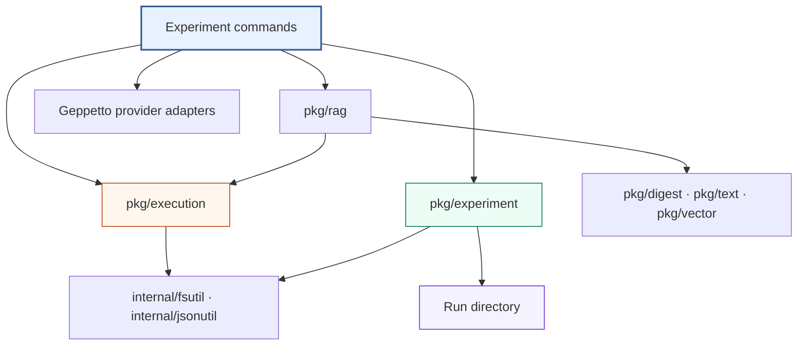

# rag-ttc: Refactoring Explicit Experiments and Reusable Mechanisms

This article describes the completed `rag-ttc` refactor as an architecture,
not as a sequence of tickets. The central result is a dependency rule:
experiments retain scientific policy in visible Go control flow, while focused
packages provide reusable mechanisms with narrower contracts. The repository
does not encode experiments as graphs, registries, or a workflow language.

The implementation history is preserved in
[[PROJECT REPORT - rag-ttc - Simplifying a Recoverable and Measurable RAG Experiment System]].
The live system built on this architecture is evaluated in
[[ARTICLE - rag-ttc - Reproducible TTC RAG Evaluation with Blinded LLM Judges]].
Both are indexed by [[rag-ttc]].

> [!summary]
> - `pkg/execution` contains generic typed parallelism, rates, budgets, caches,
>   and resource plans. It imports no RAG domain types.
> - `pkg/rag` contains documents, chunks, evidence, retrieval, embedding,
>   reranking, generation, and evaluation semantics.
> - `pkg/experiment` owns run directories, immutable inputs, observations,
>   append-only results, and terminal state.
> - Experiment commands own hypotheses, arms, matrices, provider-role
>   requirements, prompts, and report policy.
> - Cache lookup precedes worker, rate, and budget admission; successful misses
>   are stored independently, so late failure does not discard earlier work.
> - The refactor removed redundant artifacts and decomposed large runners
>   without adding a generic pipeline abstraction.

## 1. The architectural question

A research codebase accumulates repeated code quickly. Some repetition is a
stable mechanism waiting to be extracted. Some is the visible expression of
different experimental policy. Treating both kinds as abstraction
opportunities produces a framework whose extension points must anticipate
future experiments.

`rag-ttc` uses two placement questions:

1. Can this contract be described without documents, chunks, embeddings,
   retrieval, generation, or evaluation?
2. Does more than one concrete consumer need the mechanism?

If both answers are yes, the code may belong in a generic package. If the
contract refers to evidence, model requests, ranking, or judgments, it belongs
in a RAG package. If it selects arms, defines a factor matrix, chooses a
prompt, or decides which artifacts are authoritative, it belongs in the
experiment command.

This is a dependency rule, not a source-size rule. A long explicit runner can
be appropriate when it expresses one experiment. A short helper can be
misplaced when it hides a policy decision behind a generic name.

## 2. Final dependency structure



The arrows point from policy toward mechanisms. The generic packages do not
import command packages. `pkg/execution` does not import `pkg/rag`.
`pkg/experiment` does not decide how a retrieval arm works. Provider adapters
implement RAG interfaces but do not choose which provider roles an experiment
requires.

## 3. Generic execution without workflow semantics

`pkg/execution` operates on functions and typed values. Its components are:

| Mechanism | Responsibility |
|---|---|
| `Map` | Execute item work with bounded workers and stable result ordering |
| `CachedMap` | Resolve per-item cache hits before resource admission |
| `CachedBatchMap` | Batch only the misses and persist successful items |
| `CachedGroupMap` | Execute variable-size semantic groups recoverably |
| `Budget` | Reject work beyond a finite admitted-unit ceiling |
| `Rate` | Bound resource acquisition over time |
| `Chain` | Compose several resource limiters |
| `ResourcePlan` | Declare and observe worker, rate, and budget composition |
| `Cache` | Store atomic content-addressed JSON entries |

None of these types knows what an embedding is. A generic call has the
following shape:

```go
results, report, err := execution.CachedMap(
    ctx,
    items,
    cache,
    keyForItem,
    resources,
    workers,
    func(ctx context.Context, item Item) (Result, error) {
        return expensiveWork(ctx, item)
    },
)
```

The implementation order is semantically significant:

```text
for each item:
    derive versioned key
    if cache hit:
        return cached result
    deduplicate concurrent identical misses
    acquire worker slot
    acquire rate permit
    charge finite budget
    perform work
    atomically store successful result
    return result
```

Cache hits consume no current-run provider authority. Failed admitted attempts
remain charged, because the external request may already have occurred.
Successful items are stored before the complete collection is returned. If
item 1,999 of 2,000 fails, the next run can recover the first 1,998 entries.

This package intentionally omits:

- stage registries;
- DAG construction;
- dynamic operator lookup;
- generic workflow resume;
- domain-specific retry policy;
- experiment lifecycle state.

Those features would change a reusable execution mechanism into a workflow
runtime.

## 4. RAG packages own semantic adapters

Generic caching cannot determine which fields affect an embedding or generated
answer. RAG decorators define versioned semantic keys and then delegate
mechanics to `pkg/execution`.

For generation, the key includes:

```text
model identity
generation kind
query digest
ordered evidence identities
prompt digest
schema digest
adapter version
context policy
```

The ordered evidence projection contains chunk ID and content digest. It
excludes floating-point retrieval scores. This rule was validated in the live
pilot: sub-ULP BM25 score drift had changed old cache keys even though selected
content was identical.

The RAG tree is organized by capability:

- `pkg/rag/chunking` preserves source ranges and stable chunk identity;
- `pkg/rag/embedding` provides direct, cached, and observed embedding;
- `pkg/rag/lexical` provides in-memory and persistent lexical retrieval;
- `pkg/rag/vector` provides exact vector retrieval;
- `pkg/rag/retrieval` handles collapse, fusion, and hydration;
- `pkg/rag/reranking` and `pkg/rag/generation` provide semantic decorators;
- `pkg/rag/evaluation` defines targets and retrieval metrics;
- `pkg/rag/report` constructs reusable retrieval reports;
- `pkg/rag/providers/geppetto` adapts profile-resolved engines.

The packages expose operations. They do not provide an end-to-end “run RAG”
function.

## 5. Domain-neutral utilities

The second extraction pass identified utilities whose names and contracts did
not require a RAG vocabulary:

| Package | Contract |
|---|---|
| `pkg/digest` | Canonical JSON and value digests |
| `pkg/text` | Unicode-aware term processing |
| `pkg/vector` | Vector normalization and similarity mathematics |
| `internal/fsutil` | Private atomic filesystem operations |
| `internal/jsonutil` | Private strict JSON decoding |

The distinction between `pkg` and `internal` is deliberate. Digest, text, and
vector operations form public reusable contracts. Atomic file replacement and
strict decode helpers support this repository’s implementation but are not
promised as an external API.

Moving these packages did more than improve naming. It made dependency
violations mechanically visible. A future non-RAG experiment can use budgets,
caching, digests, or vector math without importing documents or evidence.

## 6. Experiment custody as a separate concern

`pkg/experiment` manages durable run state:

```text
create run
  -> write manifest and normalized config
  -> copy immutable inputs and record digests
  -> append observations and completed results
  -> write aggregates
  -> mark complete or failed
```

The package distinguishes custody from computation. It does not know what an
MRR value means or how a prompt is constructed. It ensures that configuration,
inputs, observations, canonical result streams, and terminal status have
stable filesystem ownership.

The canonical-first artifact rule is:

```text
write completed per-item or per-variant record
sync durable stream
derive summaries from canonical records
```

The refactor removed backend hit and metric files that duplicated canonical
variant records, and removed large vector dumps already represented by
persistent indexes. An artifact is retained only if it supports reproduction,
recovery, inspection, comparison, review, or index custody.

## 7. Commands retain scientific policy

The three experiment families remain distinct Glazed commands:

- `experiments backend-bakeoff`;
- `experiments answer-quality`;
- `experiments summary-perf`.

Their runners share mechanisms but retain different policy. Backend bakeoff
chooses persistent search implementations. Answer quality defines retrieval
arms, grounded generation, review blinding, and paired measures. Summary
performance defines packing, batching, concurrency, and multi-turn factors.

Provider construction is role-selective. An arm declares what it needs:

```text
bm25          -> lexical index + generator
vector        -> embedder + vector index + generator
rrf           -> lexical index + embedder + vector index + generator
rrf-rerank    -> all above + reranker
```

A BM25-only experiment must not resolve an embedder, build a vector index, or
reserve embedding and reranking budgets. This improves both simplicity and
authority: unused credentials and external capabilities are never constructed.

## 8. Runner decomposition

Large commands were decomposed along observable responsibilities, not generic
stage interfaces. The answer-quality runner now has explicit phases for:

```text
validate and create run
prepare immutable corpus and representations
build only required indexes
execute selected retrieval arms
evaluate retrieval
pack evidence
generate and validate answers
build blinded review artifacts
import annotations
aggregate paired results
render terminal summaries
```

Each phase has typed inputs and outputs, but the sequence remains Go code.
Changing the experiment means editing readable control flow. There is no
configuration language that must be lowered into these calls.

The backend runner similarly separates preparation, backend execution,
evaluation, canonical completed-result writes, and rendering. Summary
performance separates matrix construction, request export, execution, and CSV
export. These boundaries allow focused tests without inventing a universal
stage type.

## 9. Validation strategy

The refactor preserved behavior through several evidence layers:

- byte-identical Glazed schemas for four leaf commands;
- golden cache, digest, chunk, representation, vector, and CSV identities;
- all six progressive examples;
- full tests, race tests, build, generation, golangci-lint, and glazed-lint;
- sample backend initial and zero-budget replay runs;
- real TTC backend recovery after a deliberate 1,000-item budget stop;
- live OpenAI summary and embedding recovery;
- live grounded-answer zero-budget replay;
- the later 30-query judged pilot described in the companion article.

The real TTC recovery test is the most concrete expression of the cache
contract. A first run stopped after 1,000 embeddings. The next run reported
1,000 hits, computed the remaining 982 corpus representations and ten query
embeddings, and completed both backends. A third run with budget zero
reproduced the metrics with 1,982 corpus and ten query hits.

Validation also preserved failure semantics. Zero-budget execution is expected
to fail on a missing entry. That failure proves the system did not silently
expand authority.

## 10. What was deliberately not generalized

The completed deletion ledger is as important as the extraction map. The
refactor rejected:

- a generic experiment pipeline;
- moving whole experiments into `pkg`;
- a compatibility layer for old internal APIs;
- extraction of every duplicate at first sight;
- a generic structured-generation framework;
- one universal result schema.

These omissions keep the system adaptable. A new experiment can reuse
recoverable execution and run custody while expressing a different hypothesis
directly. Reuse does not require translating the experiment into a framework’s
ontology.

## 11. Design rules for future work

Future changes should satisfy these rules:

- Extract mechanisms only after multiple real consumers establish the
  contract.
- Keep hypotheses, arms, matrices, prompts, and reporting decisions in command
  packages.
- Make cache identity complete, versioned, and semantic.
- Resolve cache hits before acquiring rate or budget authority.
- Store each successful expensive result immediately.
- Preserve canonical completed-result streams before aggregates.
- Construct only provider roles required by selected arms.
- Prefer deletion to aliases when an internal contract changes.
- Validate source compatibility, scientific identity, and live recovery as
  separate concerns.

The architecture is small because it assigns fewer responsibilities to each
layer, not because the experiment is trivial. The result is a repository in
which retrieval and LLM research can change quickly while provider work,
recovery, and evidence custody remain controlled.

## 12. Source map

The primary implementation paths are:

- `pkg/execution`
- `pkg/experiment`
- `pkg/rag`
- `pkg/digest`
- `pkg/text`
- `pkg/vector`
- `internal/fsutil`
- `internal/jsonutil`
- `cmd/rag-ttc/cmds/experiments`
- `ttmp/2026/07/26/RAG-TTC-SIMPLIFY-001--simplify-and-refactor-the-ttc-rag-experiment-codebase`

## Related notes

- [[rag-ttc]]
- [[PROJECT REPORT - rag-ttc - Clean-Slate RAG Experiments in Plain Go]]
- [[PROJECT REPORT - rag-ttc - Simplifying a Recoverable and Measurable RAG Experiment System]]
- [[ARTICLE - rag-ttc - Architecture of a Reproducible Go RAG Evaluation System]]
- [[ARTICLE - rag-ttc - Reproducible TTC RAG Evaluation with Blinded LLM Judges]]
- [[Research/Software Architecture Garden/rag-ttc/README|Architecture Garden — rag-ttc]]
