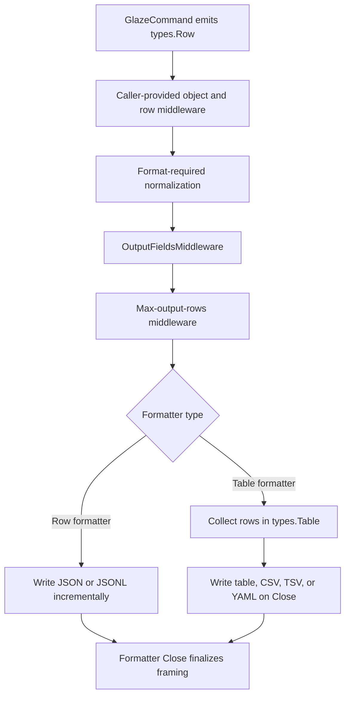
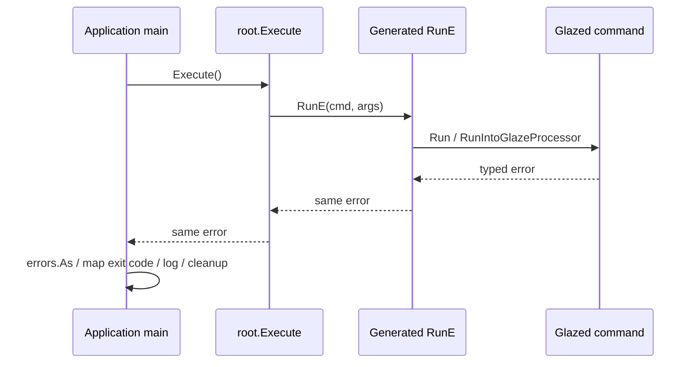
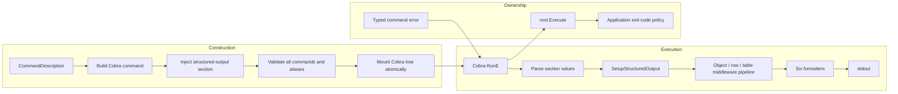

# Glazed: Structured Output and Cobra Runtime Cleanup

Glazed used to attach 44 output, transformation, rendering, pagination, and file-routing flags to every `GlazeCommand`. This project replaced that global surface with three output controls, retained the middleware architecture beneath them, removed features that no longer belonged in the universal command contract, and corrected Cobra execution so errors return to the embedding application.

The result is smaller than the system it replaced, but the important work was not only deletion. The implementation had to preserve six serialization formats, distinguish streaming from buffered output, define projection and row-cap semantics, prevent partial command registration, retain programmatic middleware composition, update every first-party integration, and prove that application-owned exit codes survive the Glazed command builder.

> [!summary]
> - Every `GlazeCommand` now receives only `--format`, `--output-fields`, and `--max-output-rows` as universal output flags.
> - JSON and JSONL serialize rows incrementally; table, CSV, TSV, and YAML retain buffered table semantics.
> - The object, row, and table middleware interfaces remain available for application-specific composition even though the old generic CLI middleware flags were removed.
> - Generated Cobra commands now use `RunE`, allowing typed errors to reach `Execute()` for application-owned logging and exit-code mapping.

## 1. The original contract was too broad

A framework-owned flag is part of every command's public namespace. That cost is easy to underestimate when the flags are implemented in one settings package, because the implementation looks centralized while the user-facing consequences are distributed across every executable that embeds the framework.

Before this cleanup, the aggregate Glazed section reserved names for formatting, output files, Excel sheets, SQL output, jq programs, templates, sorting, renaming, replacement, row selection, regular-expression field filters, deduplication, skip/limit behavior, and table styling. A command that needed an ordinary business field named `output`, `fields`, `filter`, `template`, `select`, or `stream` could collide with framework behavior before its own execution began.

The concrete failure was visible during Cobra command construction:

```text
BuildCobraCommandFromCommand error: Flag 'output' (usage: Business output destination - <string>) already exists
```

This was not merely a help-page problem. Cobra requires flag names to be unique within a command. The old aggregate therefore constrained domain vocabulary for every application, including applications that never used Excel, jq, templates, SQL output, or multi-file rendering.

The representative `glaze json --help` surface contained 64 long flags before the change. After the cleanup it contains 22 total long flags, only three of which belong to structured output. The reduction is significant because each removed name returns ownership to application commands.

## 2. Defining the minimal output contract

The replacement contract separates serialization concerns from source-operation concerns:

```text
--format table|json|jsonl|csv|tsv|yaml
--output-fields field1,field2,...
--max-output-rows N
```

These flags answer three output-layer questions:

1. Which byte representation should be written?
2. Which fields from each emitted row should reach that representation?
3. How many emitted rows may reach it?

They do not define what a command fetches, how a database query is ordered, which remote objects are requested, or how an API performs pagination. Those operations belong to the command because they can change cost, correctness, and side effects.

The distinction is explicit in the row-cap semantics. `--max-output-rows 100` prevents the formatter from serializing more than 100 rows, but it does not promise to stop a database query or cancel an HTTP request after the hundredth result. A command that can reduce upstream work should expose a domain-specific limit and apply it at the source.

### 2.1 Format semantics

The six retained formats have deliberately different execution models:

| Format | Wire framing | Processing model |
|---|---|---|
| `table` | Deterministic ASCII table | Buffered table |
| `json` | One JSON array | Incremental row output with array finalization |
| `jsonl` | One compact JSON object per line | Incremental row output |
| `csv` | Header plus comma-separated records | Buffered table |
| `tsv` | Header plus tab-separated records | Buffered table |
| `yaml` | One YAML sequence | Buffered table |

`table` remains the default because interactive terminal use is still a primary Glazed use case. JSONL is the explicit streaming format. The previous combination of stream switches and object-framing switches was removed; the format now determines framing directly.

The format constructors make this distinction visible in code:

```go
switch format {
case OutputTable:
    return tableformatter.NewOutputFormatter("ascii"), false, nil
case OutputJSON:
    return jsonformatter.NewArrayOutputFormatter(), true, nil
case OutputJSONL:
    return jsonformatter.NewLinesOutputFormatter(), true, nil
case OutputCSV:
    return csv.NewCSVOutputFormatter(), false, nil
case OutputTSV:
    return csv.NewTSVOutputFormatter(), false, nil
case OutputYAML:
    return yamlformatter.NewOutputFormatter(), false, nil
}
```

The Boolean result identifies row-output formatters. JSON and JSONL install a row middleware that writes as rows arrive. The other formats install a table middleware and write during processor closure.

### 2.2 Exact output projection

`--output-fields` intentionally implements less behavior than the deleted generic field-filter subsystem. It accepts exact names, trims whitespace, removes duplicate requests while preserving the first occurrence, and creates a new row in requested order.

Conceptually, the middleware performs this operation:

```text
project(row, requestedFields):
    if requestedFields is empty:
        return row

    output = empty ordered row
    for name in requestedFields:
        if row contains name:
            output[name] = row[name]
    return output
```

Missing fields are omitted. Empty projection means all fields. CSV, TSV, and table output preserve requested column order. JSON object key order is not treated as a wire-level contract because rows are converted through map-shaped data during encoding.

This narrow API excludes regular expressions, negative selections, null removal, implicit `all` markers, and deduplication. Commands can model source-level projection as business fields, while caller-side tools can transform already serialized JSONL.

### 2.3 Output caps

`--max-output-rows` accepts a non-negative integer. Zero means unlimited. Negative values fail during settings decoding:

```text
max-output-rows must be greater than or equal to zero
```

The cap reuses row middleware behavior rather than introducing a second processor. It is inserted before serialization, so row formatters and table formatters observe the same maximum.

## 3. The middleware architecture was preserved

The project removed legacy middleware implementations and their automatic CLI configuration. It did not remove the middleware model.

`TableProcessor` still exposes three independent stages:

- Object middleware may turn one input row into zero, one, or several rows.
- Row middleware may transform or suppress rows after object expansion.
- Table middleware operates on the accumulated table during closure.

The processor still accepts `TableProcessorOption` values and retains methods for adding, prepending, and indexing middleware. Programmatic callers can inject application-specific behavior without reserving any CLI names globally.

```go
processor, formatter, err := settings.SetupStructuredOutput(
    sectionValues,
    writer,
    middlewares.WithRowMiddleware(customMiddleware),
)
```

`SetupStructuredProcessor` is the lower-level variant. It applies output projection and row caps without attaching a serializer. Lua uses this path with a null table middleware so it can receive a `types.Table` rather than bytes.

### 3.1 Processor assembly

The effective execution path is:



Format-required normalization can affect projection. CSV and TSV flatten nested data before `--output-fields` runs, which allows callers to request the flattened column names. This ordering is part of the API even though it is not represented by another CLI switch.

### 3.2 Streaming behavior

Row serialization avoids table accumulation. `TableProcessor.AddRow` collects rows only when table middleware is present:

```go
if len(p.TableMiddlewares) > 0 {
    p.Table.AddRows(rows...)
}
```

JSONL writes one compact object followed by a newline for every accepted row. JSON writes the opening array when the first row arrives, inserts separators between rows, and writes the closing bracket during `Close`. An empty JSON stream closes as `[]`.

This distinction matters for memory behavior. JSON and JSONL can serialize an unbounded sequence with memory determined primarily by the current row and middleware state. Buffered formats retain all accepted rows until closure. The cleanup did not claim that every format streams; it made the streaming contract explicit instead.

## 4. Command construction became transactional

The old `AddCommandsToRootCommand` path could mutate the Cobra root while commands were still being built. If a later command failed because of a schema error or flag collision, earlier commands and parent nodes could remain mounted. The caller received an error and a partially modified command tree.

The new path builds commands and aliases into a pending list first:

```text
build all commands
    -> build all aliases
        -> if every build succeeds, mount the pending tree
```

A build error now leaves the root unchanged. Errors also include the command's full path and source, which makes a collision actionable in applications that register many command families.

This is a small architectural rule with broad consequences: validation happens before mutation. The test for a structured-output collision creates one valid command and one invalid command that defines its own `format` field. The build must return an error and `root.Commands()` must remain empty.

## 5. Cobra errors now belong to the application

GitHub issue [#611](https://github.com/go-go-golems/glazed/issues/611) exposed a separate problem in the generated command runtime. Glazed assigned Cobra's `Run` callback and handled failures with `cobra.CheckErr`. `CheckErr` prints the error and terminates the process with status 1. The application's `Execute()` never receives the error.

That behavior destroys typed exit-code contracts. An application may define distinct codes for authentication, validation, missing resources, and generic failures. If a Glazed-generated command terminates inside the library, all of those errors collapse to status 1 and bypass application-level logging, telemetry, and cleanup.

The fix assigns `RunE` and returns every setup or execution error:

```go
cmd.RunE = func(cmd *cobra.Command, args []string) error {
    parsedValues, err := parser.Parse(cmd, args)
    if err != nil {
        _ = cmd.Help()
        return err
    }

    // Decode settings and select execution mode.
    // Every failure returns rather than calling cobra.CheckErr.

    err = runFunc(ctx, parsedValues)
    var earlyExit *cmds.ExitWithoutGlazeError
    if errors.As(err, &earlyExit) {
        return nil
    }
    return err
}
```

Generated aliases also wrap `RunE` and return the original error. Without that second change, direct commands would propagate errors while aliases would retain terminating behavior.

The resulting ownership boundary is precise:



Tests cover bare commands, `GlazeCommand`, explicit `BuildCobraCommandFromCommandAndFunc` callbacks, and aliases. They assert that `Run` is unset, `RunE` is present, and the original typed error reaches `Execute()` through `errors.As` or `errors.Is`.

`ExitWithoutGlazeError` remains a successful early return. Context cancellation retains its earlier non-error treatment. Processor-close errors now propagate instead of terminating internally.

## 6. First-party integrations had to adopt the same vocabulary

A framework contract is not complete until its own tools use it consistently. The migration covered automatic command construction, raw Cobra commands, help export, Lua execution, programmatic runners, examples, generated help, CLI lint rules, and documentation.

### 6.1 Help export resolved a real `--format` ambiguity

The help exporter previously used `--format glazed|files|sqlite` to select an export operation, while the new universal `--format` selects row serialization. Keeping both meanings would recreate the namespace collision in a first-party command.

The business selector became:

```text
--export-mode glazed|files|sqlite
```

Structured serialization keeps:

```text
--format table|json|jsonl|csv|tsv|yaml
```

The external help loader now requests machine-readable rows with:

```text
<binary> help export --with-content=true --format json
```

This naming decision states a broader API rule: `format` is reserved for serialization, while operation-specific choices receive domain-specific names.

### 6.2 Static analysis changed with the public API

The Glazed CLI analyzer previously recognized old construction helpers. Its fixtures and guidance now reference `NewStructuredOutputSection`. This matters because a cleanup that changes runtime APIs but leaves lint diagnostics behind creates a second, contradictory API in developer tooling.

### 6.3 Documentation deletion was part of the implementation

Pages dedicated only to removed flags were deleted rather than rewritten as migration machinery. The deletion covered jq examples, rename and replacement examples, regular-expression filtering, generic selection, skip/limit, sorting, template flags, SQL output flags, multi-file output, table styling, and the old VHS demonstration.

Current documentation was revised to teach the smaller contract. The canonical user-facing page is:

```text
pkg/doc/topics/32-structured-output.md
```

It explains all six formats, exact field projection, output caps, composition with caller-side `jq`, programmatic APIs, and expected failure cases.

## 7. Deletion reduced both code and dependency obligations

The final commit changes 120 files, adds 2,586 lines, and removes 4,801 lines. Much of the added material is testing, durable help, and the investigation record. The production settings layer became substantially smaller.

Deleted production areas include:

```text
pkg/settings/glazed_section.go
pkg/settings/settings_output.go
pkg/settings/settings_fields-filters.go
pkg/settings/settings_jq.go
pkg/settings/settings_rename.go
pkg/settings/settings_replace.go
pkg/settings/settings_select.go
pkg/settings/settings_skip_limit.go
pkg/settings/settings_sort.go
pkg/settings/settings_template.go
pkg/settings/flags/
pkg/formatters/excel/
pkg/middlewares/jq.go
```

Excel output and embedded jq also carried dependency trees. Removing them eliminated direct requirements on `github.com/xuri/excelize/v2` and `github.com/itchyny/gojq`, together with format-specific transitive modules.

The project did not delete every reusable formatter or middleware package. SQL, template, simple formatting, and explicit row transformation libraries remain available to Go callers. The decision was to stop installing them automatically on every CLI command, not to prevent specialized applications from importing them.

## 8. Security validation found two additional dependency defects

After the structural cleanup, `make govulncheck` reported two reachable vulnerabilities:

| Advisory | Module found | Fixed version | Reachable path |
|---|---|---|---|
| GO-2026-5970 | `golang.org/x/text` v0.38.0 | v0.39.0 | Unicode normalization through help publishing dependencies |
| GO-2026-5158 | `go.opentelemetry.io/otel` v1.41.0 | v1.42.0 | Baggage parsing through OIDC publishing dependencies |

The OpenTelemetry API, metric, and trace modules were upgraded together to v1.42.0. `golang.org/x/text` moved to v0.39.0. The final scan reports zero reachable vulnerabilities.

The scan still reports informational vulnerabilities in dependency packages or modules whose vulnerable symbols are not called. The build target succeeds because the executable code has no reachable finding under the scanner's call analysis.

## 9. Failures that clarified the final contract

Several implementation failures exposed assumptions that needed to become explicit.

### 9.1 Rows are ordered structures, not map helpers

The first output-field tests called a nonexistent `Row.GetValue`. The actual row API uses `Row.Get`. Correcting the tests reinforced that `types.Row` owns field ordering and should remain the projection substrate until JSON conversion.

### 9.2 JSON key order is not output-field order

An early JSONL assertion expected keys to appear in the same order as `--output-fields`. JSON encoding converts rows through a map, so that expectation was not a valid wire contract. The test was corrected to compare decoded values, while CSV tests retain explicit column-order assertions.

The final rule is format-sensitive:

- Tabular formats guarantee requested column order.
- JSON formats guarantee field inclusion, not object key order.

### 9.3 Partial defaults can overwrite schema defaults

The help command supplied a partially populated `StructuredOutputSettings` value through `schema.WithDefaults`. Its zero-value `Format` replaced the section's default `table` value and caused startup failure. The fix supplies only `output-fields` through a defaults map.

This failure demonstrates a general rule for schema-backed configuration: a partially populated struct contains real zero values. It does not express "leave unspecified fields unchanged" unless the defaults layer has explicit presence semantics.

### 9.4 Help examples are executable contracts

Changing the canonical help DSL example from an old output flag to `flag:--format` broke an example test. Updating the expected output was necessary because generated examples are tested API, not unvalidated prose.

### 9.5 The enclosing workspace used an older Go version

The surrounding `go.work` declared Go 1.25 while this module requires Go 1.26.1. Validation therefore used `GOWORK=off`, allowing the module's toolchain directive to select the required compiler. This is an environment constraint rather than a source defect, but omitting it makes the validation commands fail before compilation begins.

## 10. Validation strategy

The project used several layers of evidence because no single test suite covers CLI namespace design, streaming semantics, error ownership, documentation, and dependency security.

### Unit and integration tests

```bash
GOWORK=off go test ./... -count=1
GOWORK=off go build ./...
GOWORK=off go vet ./...
GOWORK=off make glazed-lint
GOWORK=off make govulncheck
```

Focused tests cover:

- default settings and normalization;
- negative row caps;
- exact projection and missing fields;
- compact JSONL and empty streams;
- all six output formats;
- framework flag presence and legacy flag absence;
- application reuse of former generic flag names;
- collisions on the retained `format` name;
- atomic root registration;
- typed error propagation through every command-builder path.

### Runtime checks

Representative commands exercised the built binary rather than only package APIs:

```bash
GOWORK=off go run ./cmd/glaze json misc/test-data/2.json \
  --format jsonl --output-fields b,a --max-output-rows 1

GOWORK=off go run ./cmd/glaze json misc/test-data/2.json \
  --format csv --output-fields b,a --max-output-rows 1
```

The expected CSV output proves both projection and order:

```text
b,a
20,10
```

Help export was tested in both structured-row mode and file-export mode. The structured invocation produced one projected JSONL row under a row cap. File mode produced 59 Markdown files in a temporary directory.

### Namespace and deletion audits

Search-based audits verified that removed constructors, slugs, setup helpers, and representative legacy flags no longer appear outside historical ticket material. Inbound references to deleted documentation were checked separately. `git diff --check` verified patch hygiene.

## 11. The resulting architecture

The final architecture has a smaller public contract and retains internal extension points:



Three boundaries now define the system:

1. **The framework owns universal serialization.** It reserves exactly three names and six formats.
2. **Commands own source behavior.** Filtering, pagination, sorting, and domain projection remain command-specific when they affect work.
3. **Applications own process behavior.** Glazed returns errors; the executable decides rendering, telemetry, cleanup, and exit status.

## 12. Review map and durable lessons

A reviewer can understand the implementation in this order:

1. `pkg/settings/structured_output.go` defines the public contract and assembles processors.
2. `pkg/middlewares/row/output-fields.go` defines exact projection semantics.
3. `pkg/formatters/json/json.go` defines JSON array and JSONL streaming.
4. `pkg/cli/cobra.go` performs section injection, atomic registration, and `RunE` propagation.
5. `pkg/cli/structured_output_test.go` locks the namespace contract.
6. `pkg/cli/cobra_error_test.go` locks application-owned error handling.
7. `pkg/help/cmd/export.go` demonstrates domain-specific naming beside universal serialization.
8. `pkg/doc/topics/32-structured-output.md` is the user-facing reference.
9. `go.mod` and `go.sum` show dependency deletion and vulnerability remediation.

The durable engineering conclusions are direct:

- Universal CLI flags require stronger justification than optional library APIs because every command pays their namespace cost.
- Streaming is a formatter execution property and should be represented by explicit format semantics rather than independent Boolean combinations.
- Output caps and source limits are different contracts and should not share a misleading name.
- Removing automatic middleware does not require removing middleware interfaces.
- Command trees should be validated completely before mutation.
- Libraries embedded in Cobra applications should return errors through `RunE`; they should not print errors or choose process exit codes.
- Documentation and analyzer fixtures are part of an API change and must be migrated with runtime code.
- Dependency deletion should be followed by `go mod tidy` and reachable-vulnerability analysis.

## Project artifacts

- Repository: `/home/manuel/workspaces/2026-07-27/glazed-cleanup/glazed`
- Branch: `task/glazed-cleanup`
- Commit: `cdb5537206627c8573f4a7882159b40513022798`
- Ticket: `GLZ-OUTPUT-FLAGS-CLEANUP`
- Design: `ttmp/2026/07/27/GLZ-OUTPUT-FLAGS-CLEANUP--simplify-legacy-glazed-output-flags-and-reduce-reserved-names/design-doc/01-legacy-output-flag-cleanup-analysis-design-and-implementation-guide.md`
- Investigation diary: `ttmp/2026/07/27/GLZ-OUTPUT-FLAGS-CLEANUP--simplify-legacy-glazed-output-flags-and-reduce-reserved-names/reference/01-investigation-diary.md`
- Canonical help topic: `pkg/doc/topics/32-structured-output.md`
- GitHub issue: [#611 — BuildCobraCommand discards exit codes](https://github.com/go-go-golems/glazed/issues/611)
