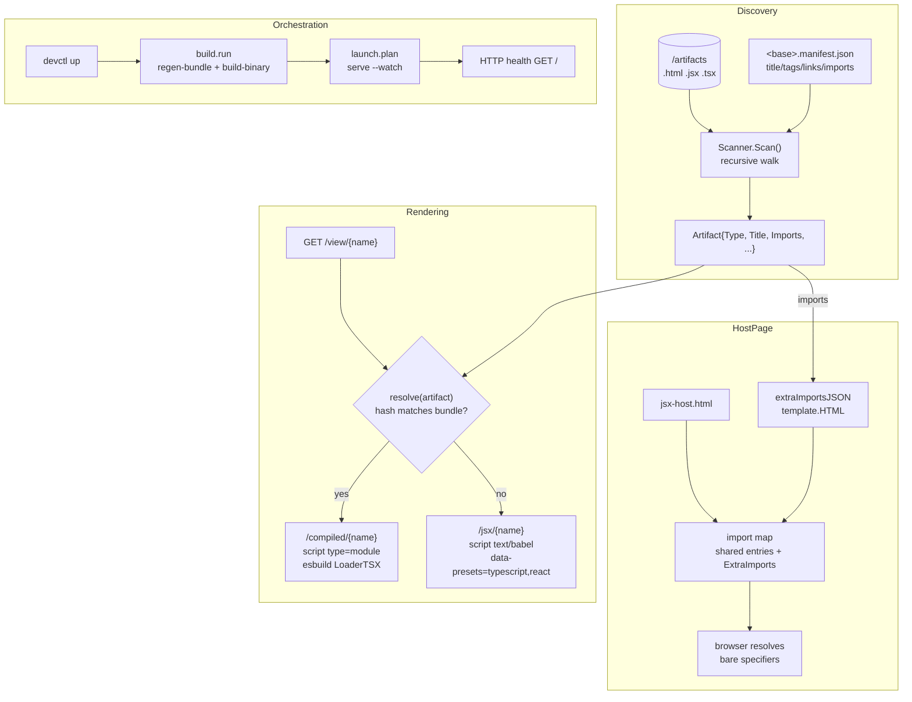

# serve-artifacts — TSX, Per-Artifact Import Maps, and devctl Orchestration

`serve-artifacts` is a standalone Go server that serves Claude.ai artifacts (HTML, JSX, and now TSX) from a directory on disk. The previous project note, [[PROJ - serve-artifacts - Write API, Production Deployment, and the JSON Contract]], documented the write API, the production k3s deployment, and the JSON error contract. This note covers three additions built in a single working session: TypeScript/TSX artifact support, a per-artifact import-map mechanism that lets a single artifact pull in a third-party dependency without editing the shared host template, and a devctl plugin that turns the build-and-serve loop into one supervised command. Each addition is small in isolation, but together they change what the server can render and how a developer drives it.

The reference repository is `/home/manuel/code/wesen/2026-03-29--serve-claude-experiments`. The work spans six commits, from `ee2e5ec` (TSX Phase 1) through `0729db7` (manifest imports).

> [!summary]
> The session delivered three load-bearing changes:
> 1. **TSX support** — the scanner, esbuild bundle, Babel fallback, and push API all accept `.tsx`; TypeScript types are stripped, not type-checked;
> 2. **per-artifact import maps** — a manifest `imports` field merged into the JSX/TSX host page for that artifact only, so an artifact can resolve a bare specifier like `@duckdb/duckdb-wasm` without bloating the shared template; and
> 3. **devctl orchestration** — a Python NDJSON-stdio plugin that builds the binary, regenerates the embedded bundle, and supervises the server with an HTTP health check.

## Why this project exists

The corpus contains artifacts authored in TypeScript. A file like `pbui-gog-duckdb.tsx` is a React component that uses type annotations, interfaces, and generic type arguments. Before this session, the server silently ignored `.tsx` files: the scanner's extension switch had cases for `.html` and `.jsx` only, and everything else fell through to a `default` that returned `nil`. The file was invisible to `list`, to the index, and to the view route.

A second, subtler problem appeared once TSX was served. The DuckDB artifact does a dynamic bare-specifier import — `await import("@duckdb/duckdb-wasm")` — and the host page's import map did not contain that specifier. The browser threw `TypeError: Failed to resolve module specifier`, the artifact caught the failure, and it degraded to a "JavaScript fallback" badge that ran a small in-JavaScript evaluator instead of the real DuckDB-Wasm query engine. The artifact rendered, but it did not do what it was built to do.

The third problem is operational. Starting the server for development required remembering three steps: regenerate the embedded JSX/TSX bundle, build the Go binary, then run it with the right flags. There was no health check, no log capture, and no single command that a new contributor could run to get a working server. The devctl plugin turns that sequence into `devctl up`.

## Architecture

The server is a single `net/http` process using Go 1.22's pattern-matching `ServeMux`. Three subsystems are relevant to this report: the scanner that discovers artifacts, the hybrid JSX/TSX rendering path that chooses between a precompiled embedded bundle and a runtime Babel fallback, and the host page template that provides React and the import map. The devctl plugin sits outside the server process and orchestrates build and launch.



The diagram separates the four concerns. Discovery turns files into typed `Artifact` values. Rendering chooses a script path per artifact. The host page assembles an import map that may include artifact-specific entries. Orchestration is external to the server and owns the process lifecycle.

## Implementation details

### The scanner and type detection

The scanner walks the artifacts directory recursively and assigns each discovered file a type based on its extension. The extension switch lives in `pkg/artifacts/scanner.go`:

```go
switch filepath.Ext(d.Name()) {
case ".html", ".htm":
    typ = "html"
case ".jsx":
    typ = "jsx"
case ".tsx":
    typ = "tsx"
default:
    return nil
}
```

A `.tsx` file becomes `Type: "tsx"`. This is a deliberate choice over reusing the `"jsx"` type and inferring TypeScript-ness from the extension later. A distinct type makes the loader and preset choice explicit in one place, lets `list --type tsx` filter naturally, and keeps the question "what compiler does this artifact need" answered by the type rather than re-derived from the filename in four different handlers.

Title extraction is keyed on the same type. The function `extractTitle` dispatches to `extractJSXComponentName` for both `"jsx"` and `"tsx"`. That function uses regexes that match `export default function App(` and stop at the opening parenthesis. This matters for TypeScript because a return-type annotation like `export default function App(): JSX.Element {` is handled correctly: the regex captures `App` and stops before the `: JSX.Element`, which the downstream compiler strips.

### The hybrid rendering path

When a browser requests `/view/{name}`, the handler switches on `artifact.Type`. The `"jsx"` and `"tsx"` cases are handled together because they share the same host page and the same precompiled-versus-fallback decision. The decision is made by `precompiled.resolve(artifact)`, which returns a bundle entry only if the on-disk file's SHA-256 matches the hash stored in the embedded bundle manifest:

```go
case "jsx", "tsx":
    scriptSrc := "/jsx/" + artifact.Name
    scriptType := "text/babel"
    loadBabel := true
    presets := ""
    if artifact.Type == "tsx" {
        presets = "typescript,react"
    }
    if entry, err := s.precompiled.resolve(artifact); err == nil && entry != nil {
        scriptSrc = "/compiled/" + artifact.Name
        scriptType = "module"
        loadBabel = false
        presets = ""
    }
```

Two paths emerge. The precompiled path serves JavaScript that esbuild produced at build time and the binary embedded via `go:embed`; the script tag is `type="module"` and no Babel is loaded. The fallback path serves the raw JSX/TSX source to the browser and loads Babel standalone, which compiles it client-side; the script tag is `type="text/babel"` with `data-type="module"` and, for TSX, `data-presets="typescript,react"`.

The fallback path exists because the embedded bundle is a build-time artifact. A newly added or freshly edited `.tsx` file is not in the bundle, and its hash will not match any bundle entry. Rather than require a rebuild for every edit, the server falls back to client-side compilation. The tradeoff is a slower first load (Babel must download and transform the source) in exchange for zero-friction editing.

### esbuild and the TSX loader

The embedded bundle is generated by `go generate ./pkg/server`, which runs `cmd/precompile-jsx-bundle`. That command calls `jsx.GenerateBundle`, which iterates the source directory and compiles each file with esbuild. The change for TSX is a single loader selection:

```go
func CompileModule(moduleSource, sourcefile string, isTSX bool) (string, error) {
    loader := api.LoaderJSX
    if isTSX {
        loader = api.LoaderTSX
    }
    result := api.Transform(moduleSource, api.TransformOptions{
        Loader:      loader,
        Format:      api.FormatESModule,
        Target:      api.ES2020,
        JSX:         api.JSXTransform,
        JSXFactory:  "React.createElement",
        JSXFragment: "React.Fragment",
        Sourcefile:  sourcefile,
    })
    ...
}
```

`api.LoaderTSX` tells esbuild to strip TypeScript types and transform JSX in one pass. esbuild does not type-check; it erases types. This is the correct behavior for an artifact viewer. An artifact should render even if `tsc` would report errors, because the viewer's job is to display the artifact, not to enforce a type contract. The test suite asserts this contract directly: `TestGenerateBundleCompilesTSX` includes a deliberate type violation (`const bad: number = "not a number"`) and asserts the file still compiles and that TypeScript-only syntax (`interface`, `: number`, `JSX.Element`) is absent from the output.

### The module wrapper

Before compilation, each JSX/TSX source file passes through `jsx.BuildModuleSource`, which rewrites the default export into a named binding and appends mount code. The rewrite uses regexes that transform `export default function App()` into `function App()` followed by `const __artifactDefault = App;`. The appended mount code creates a React root and renders the default export:

```go
b.WriteString(`
import { createRoot as __artifactCreateRoot } from "react-dom/client";
import * as __artifactReactNS from "react";
const __artifactRoot = __artifactCreateRoot(document.getElementById("root"));
__artifactRoot.render(__artifactReactNS.createElement(__artifactDefault));
`)
```

This code is plain JavaScript with no type annotations, so it is TypeScript-safe: the Babel TypeScript preset and esbuild's TSX loader both pass through it unchanged. The regexes that capture the component name stop at the opening parenthesis, before any return-type annotation, so they work on TSX without modification. No change to `pkg/jsx/module.go` was required for TSX support.

### Per-artifact import maps

The DuckDB artifact's failure to load exposed a structural limitation. The host page's import map is static text in `pkg/server/templates/jsx-host.html`, covering React and a fixed set of common libraries. An artifact that imports a module not in that map fails at runtime. Adding every possible dependency to the shared template would bloat every host page with entries most artifacts never use.

The solution is a new `imports` field on the manifest sidecar. An artifact declares the bare specifiers it needs and the URLs that resolve them:

```json
{
  "title": "PBUI · DuckDB Workbench",
  "imports": {
    "@duckdb/duckdb-wasm": "https://esm.sh/@duckdb/duckdb-wasm@1.29.0?bundle"
  }
}
```

The server merges these entries into the import map for that artifact's host page only. The merge happens in `handleView`, which calls `extraImportsJSON` to build a JSON fragment from the manifest's imports map and passes it to the template:

```go
func extraImportsJSON(imports map[string]string) string {
    if len(imports) == 0 {
        return ""
    }
    var b strings.Builder
    first := true
    for spec, target := range imports {
        if !first {
            b.WriteString(",\n      ")
        }
        first = false
        kb, _ := json.Marshal(spec)
        vb, _ := json.Marshal(target)
        b.Write(kb)
        b.WriteString(": ")
        b.Write(vb)
    }
    return b.String()
}
```

The template splices the fragment after the shared entries, with a leading comma only when the fragment is non-empty:

```html
"date-fns": "https://esm.sh/date-fns@3"{{if .ExtraImports}},
      {{.ExtraImports}}{{end}}
```

Each key and value is produced by `json.Marshal`, which escapes quotes and backslashes correctly for JSON. The fragment is passed as `template.HTML` rather than a plain string. This is the one non-obvious detail, and it deserves attention.

#### The HTML-escaping failure mode

Go's `html/template` package auto-escapes interpolated string values. Inside a `<script type="importmap">` block, the template engine does not know the content is JSON, so it applies HTML escaping to any `{{.Field}}` it interpolates. A value of `"@duckdb/duckdb-wasm"` becomes `&#34;@duckdb/duckdb-wasm&#34;`. The browser's import-map parser reads this as invalid JSON and silently fails to register the map, which means every bare-specifier import in the artifact fails — not just the new one.

The first verification pass caught this. The host page contained the entry, but with escaped quotes:

```
"date-fns": "https://esm.sh/date-fns@3",
&#34;@duckdb/duckdb-wasm&#34;: &#34;https://esm.sh/@duckdb/duckdb-wasm@1.29.0?bundle&#34;
```

The fix is to wrap the fragment in `template.HTML`:

```go
"ExtraImports": template.HTML(extraImportsJSON(artifact.Imports)),
```

`template.HTML` is a type that signals to `html/template` that the value is already safe and should not be re-escaped. This is safe here because the fragment is built entirely from `json.Marshal`'d pairs. A json.Marshal'd string cannot contain unescaped `<`, `>`, or `&` unless the specifier or URL itself contains them, and the manifest validation rejects specifiers containing `:` (which would indicate an absolute URL used as a key). The result is clean JSON in the import map:

```
"date-fns": "https://esm.sh/date-fns@3",
"@duckdb/duckdb-wasm": "https://esm.sh/@duckdb/duckdb-wasm@1.29.0?bundle"
```

#### Validation rules

The manifest validator enforces three rules on the `imports` field:

- Keys must be bare module specifiers. A key containing `:` is rejected because it looks like an absolute URL, not a bare specifier the import map can resolve.
- Values must be absolute `http`/`https` URLs or relative paths. A value with an absolute scheme other than http or https (such as `file://`) is rejected.
- Neither key nor value may be blank.

Relative-path values are allowed for self-hosted dependencies, though serving those paths is out of scope for this change — the server would need a route to vend them.

### The DuckDB worker subtlety

DuckDB-Wasm spawns a Web Worker to run the database off the main thread. The artifact bootstraps this worker with a Blob URL:

```js
const workerURL = URL.createObjectURL(new Blob([
  `importScripts(${JSON.stringify(bundle.mainWorker)});`,
], { type: "text/javascript" }));
```

Blob-URL workers do not inherit the page's import map. This is a property of the browser's module resolution model, not a bug in the artifact. The artifact already handles it correctly: `duckdb.getJsDelivrBundles()` returns absolute jsDelivr URLs for the worker and main module, and the worker is bootstrapped with `importScripts(<absolute URL>)`, which does not require an import map. The consequence is that only the main module's `import("@duckdb/duckdb-wasm")` needs the import-map entry; the worker side is self-sufficient. Adding the manifest entry is sufficient to make the whole stack load.

### devctl orchestration

The devctl plugin is a Python program that speaks the NDJSON stdio protocol v2. It is wired into the repository by `.devctl.yaml`:

```yaml
plugins:
  - id: serve-artifacts
    path: python3
    args:
      - ./plugins/serve-artifacts-dev.py
    priority: 10
```

The plugin implements five operations. `config.mutate` publishes committed dev defaults — port 8080, directory `./imports`, watch mode on — as a config patch. `validate.run` checks that `go` and `python3` are on `PATH` and that the artifacts directory exists. `build.run` runs two named steps: `regen-bundle` (`go generate ./pkg/server`) and `build-binary` (`go build -o serve-artifacts ./cmd/serve-artifacts`). `launch.plan` returns one service that runs the built binary with `--watch` through a `bash --noprofile --norc -lc` wrapper, with an HTTP health check on the index page. `command.run` exposes a `devctl regen-bundle` dynamic command.

The protocol has two non-negotiable rules. The first line on stdout must be a JSON handshake, and after that every line on stdout must be a JSON frame. All human-readable output goes to stderr. The plugin enforces this by routing all subprocess output to stderr and emitting exactly one JSON response per request:

```python
def run_streaming(argv, cwd, dry_run, timeout_s):
    proc = subprocess.Popen(argv, cwd=cwd, stdout=subprocess.PIPE,
                            stderr=subprocess.STDOUT, text=True, bufsize=1)
    for line in proc.stdout:
        sys.stderr.write(line)
        sys.stderr.flush()
    return proc.wait(timeout=timeout_s)
```

The launch plan uses a shell wrapper rather than invoking the binary directly. This lets the user's environment variables (such as `SERVE_ARTIFACTS_WRITE_TOKEN`) flow through to the server, and it produces a clear error if the binary is missing rather than a silent supervisor failure. The health check is an HTTP GET on `http://127.0.0.1:{port}/`; devctl treats any 2xx–4xx response as healthy.

## Common failure modes

### The silent fallback badge

The DuckDB artifact catches its own import failure and switches to a JavaScript evaluator. This produces no console error — the failure is swallowed by a `.catch` handler that sets `this.status = "fallback"`. The symptom is a badge that reads "JavaScript fallback" instead of "DuckDB". The diagnosis is to evaluate the failing import directly in the browser console: `import('@duckdb/duckdb-wasm')` throws `TypeError: Failed to resolve module specifier` if the import map is missing the entry. The fix is the manifest `imports` field, not a code change to the artifact.

### HTML-escaped import-map JSON

If the `ExtraImports` template value is passed as a plain string rather than `template.HTML`, `html/template` escapes the quotes and the import map becomes invalid JSON. The symptom is that every bare-specifier import in the artifact fails, not just the new one, because the browser rejects the whole map. The diagnosis is to inspect the raw host-page HTML and look for `&#34;` where `"` should appear.

### Stale binary after a code change

The embedded bundle and the Go binary are build artifacts. After editing the scanner, the bundle generator, or the host template, both must be regenerated. Running `devctl up` handles this because `build.run` runs `regen-bundle` then `build-binary` before launch. Running `./serve-artifacts serve` directly against a stale binary will serve old behavior. The `serve-artifacts` binary at the repo root is gitignored for this reason.

### Backgrounding the server from a script

Starting the server with `&` or `nohup` from a non-interactive shell can fail silently: the process dies when the shell session ends, and the log file is never created. The reliable path is `devctl up`, which supervises the process in a process group and captures logs under `.devctl/runs/<run-id>/`. Using `timeout devctl up` is wrong because the timeout kills the supervisor, which tears down the service.

## Working rules

- TypeScript types are stripped, never type-checked. An artifact renders even if `tsc` would reject it. This is a viewer, not a compiler.
- A distinct `tsx` artifact type is preferable to reusing `jsx` and inferring TypeScript-ness from the extension. The type answers the loader/preset question in one place.
- Per-artifact import-map entries belong in the manifest, not in the shared template. Only artifacts that declare a dependency pay for it.
- Import-map fragments interpolated into `html/template` must be wrapped in `template.HTML`, or the quotes are escaped and the JSON breaks.
- The devctl plugin owns build and launch; the server owns serving. The plugin computes facts (config, validation, a plan); devctl owns the process lifecycle.

## Current user-facing commands

```bash
# Build + serve + health-check in one command
devctl up
devctl status
devctl logs serve-artifacts --follow
devctl regen-bundle
devctl down

# Direct (requires a built binary)
./serve-artifacts serve --dir ./imports --port 8080 --watch
./serve-artifacts list --dir ./imports --type tsx --output json

# Push a TSX artifact over the API
serve-artifacts artifact push --file ./Widget.tsx --name demos/widget \
  --title "My Widget" --tag react
```

## Important project docs

Repo-local design docs and diaries:

- `/home/manuel/code/wesen/2026-03-29--serve-claude-experiments/ttmp/2026/07/27/TSX-SUPPORT--add-typescript-tsx-artifact-support-to-serve-artifacts/` — TSX design doc and implementation diary
- `/home/manuel/code/wesen/2026-03-29--serve-claude-experiments/ttmp/2026/07/27/MANIFEST-IMPORTS--per-artifact-import-map-entries-via-manifest-imports-field/` — manifest imports design doc and diary
- `/home/manuel/code/wesen/2026-03-29--serve-claude-experiments/cmd/serve-artifacts/doc/adding-artifacts.md` — user-facing tutorial (now covers TSX and the `imports` field)
- `/home/manuel/code/wesen/2026-03-29--serve-claude-experiments/DOCKER.md` — container deployment
- `/home/manuel/code/wesen/2026-03-29--serve-claude-experiments/.devctl.yaml` — devctl plugin wiring

## Open questions

- Should `.ts` (TypeScript without JSX) be supported via `api.LoaderTS`? The mechanism is identical; the question is whether any real artifact needs it.
- Should relative-path import-map values be served by the server from a vendored directory? Currently only absolute URLs are exercised.
- Should the devctl plugin gain a `docker-compose` launch variant for containerized development, or is the direct-binary path sufficient?
- Should the bundle manifest store the original extension so tooling can distinguish JS-origin from TSX-origin entries?

## Near-term next steps

- Import the remaining `~/Downloads/pbui-*.tsx` DuckDB variants once their manifests are written.
- Add a `serve-no-watch` devctl profile for environments where file watching is unwanted.
- Consider a `devctl doctor`-style validation that checks the import-map entries resolve (a HEAD request to each URL) before launch.

## Related notes

- [[PROJ - serve-artifacts - From Static Viewer to Searchable, Visual Gallery]] — the original read-only gallery
- [[PROJ - serve-artifacts - Write API, Production Deployment, and the JSON Contract]] — the write API and k3s deployment
