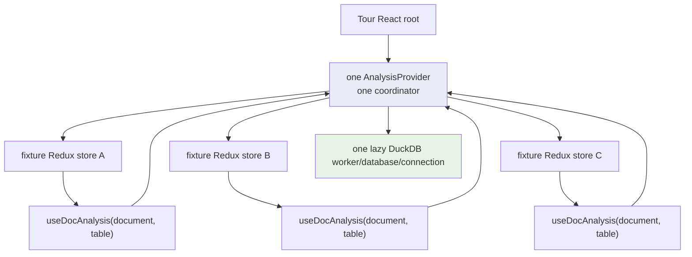

# PROJECT REPORT - go-go-datadrop v0.10 - From JavaScript Pipelines to DuckDB-Wasm

This report covers DATADROP-2, the replacement of `go-go-datadrop`'s JavaScript visualization evaluator with a canonical grammar-of-graphics document model and a browser-resident DuckDB-Wasm execution runtime. The work changed the persisted analytical contract, the editor model, the query compiler, the application result path, the browser lifecycle, and the release asset set. It also removed the previous `ChartSpec`, ordered `Step[]`, and `evaluate()` implementation instead of retaining them as a compatibility layer.

The central result is a single execution path. Redux persists declarative `GraphicDocument` values. A semantic compiler validates them and produces `LogicalGraphic`. A physical compiler lowers the requested logical relation to parameterized DuckDB SQL. One lazy provider-scoped DuckDB-Wasm runtime loads one bounded typed table through NDJSON, executes one query, normalizes scalar results into ordinary JavaScript values, and publishes only the latest generation. Charts receive those precomputed rows through `buildPlotFromResult`.

> [!summary]
> - `GraphicDocument` is now the only editable and persisted visualization contract. `LogicalGraphic` is the only validated semantic input to physical execution. The former `ChartSpec`, `Step[]`, JavaScript evaluator, and conversion wrappers were deleted.
> - DuckDB-Wasm is a disposable browser execution subsystem. It receives one authorized, server-projected, explicitly bounded `Table`; it does not own authorization, storage, schemas, pagination cursors, or durable analytical state.
> - The runtime is lazy, sequential, provider-scoped, generation-aware, and principal-aware. It records startup, ingestion, compilation, execution, normalization, byte, truncation, and available memory observations for every request.
> - Real Chromium measurements showed cold totals of 836–1,205 ms and warm totals of 12–44 ms across 2,000, 10,000, and 50,000 input rows. Browser inspection also exposed an unexpected remote JSON-extension fetch, which led to vendoring both signed extension variants.

## 1. The starting architecture

Before DATADROP-2, the browser's analytical state was represented by `ChartSpec`. A chart specification combined source identity, an ordered array of transformation steps, visual mappings, geometry, and scale options. The JavaScript evaluator walked `Step[]` and produced rows. The plot engine then accepted the source table and specification and could initiate the analytical path again.

That arrangement had three structural problems.

First, editing, semantics, and execution shared one representation. A positional step array was convenient for a list editor, but it did not give relations, fields, parameters, and views stable identities. Field references depended heavily on names. Reordering a step meant changing array position rather than reconnecting explicit relation dependencies.

Second, more than one consumer could evaluate the same specification. The table application, chart application, PBUI field inspection, and render-time schema logic did not all need the same information, yet the old contract made row evaluation an easy default. Earlier work had already found a 50,000-row pipeline being evaluated thirteen times from a table header because render-time field resolution needed only the output schema.

Third, the analytical contract could not cleanly support a second physical executor. Adding DuckDB behind `Step[]` would have preserved the old semantics and created an adapter whose long-term purpose was to keep the obsolete model alive. The accepted design instead made the semantic break explicit: the new persisted format would be canonical, old formats would be rejected, and DuckDB would not ship beside a JavaScript fallback.

The server boundaries did not need replacement. `pkg/tabular.Table` already projected streams and dataset files into one typed JSON-compatible table. It carried source identity, field types, provenance, row count, selection strategy, and truncation. Authorization already happened before this projection. The MVP therefore retained that contract and changed only what happened after the authorized table reached the browser.

```mermaid
flowchart LR
  S["Go handlers and authorization"] --> T["pkg/tabular.Table<br/>typed bounded projection"]
  T --> R["RTK Query cache<br/>exact endpoint arguments"]
  R --> D["GraphicDocument<br/>persisted editable intent"]
  D --> L["LogicalGraphic<br/>validated semantics"]
  L --> C["DuckDB SQL compiler<br/>SQL plus bound parameters"]
  R --> W["NDJSON registration<br/>typed DuckDB relation"]
  C --> W
  W --> Q["one bounded result query"]
  Q --> N["JSON-compatible result<br/>rows, fields, coverage"]
  N --> P["PBUI, table, buildPlotFromResult"]
  style D fill:#e8edf7
  style L fill:#e8edf7
  style W fill:#e9f4e9
  style N fill:#f4efe3
```



## 2. Separating authoring state from logical semantics

The new model begins with a distinction between what users edit and what an executor may trust.

`GraphicDocument` is authoring state. It is JSON-compatible, stable enough to persist, and intentionally capable of representing incomplete editor states. Sources, transforms, views, fields, parameters, and documents have identifiers. A transform does not occupy an authoritative array position; it points to its input relation. A view points to the relation it renders.

```ts
export interface GraphicDocument {
  format: "datadrop.gog.document";
  version: 1;
  id: DocumentId;
  name: string;
  sources: Record<SourceNodeId, AuthoringSource>;
  transforms: Record<TransformId, AuthoringTransform>;
  views: Record<ViewId, AuthoringView>;
  rootView: ViewId;
  parameters: Record<ParameterId, JsonValue>;
  metadata?: Record<string, JsonValue>;
}
```

`LogicalGraphic` is compiled semantic state. Its field references are resolved to stable `FieldId` values. Its expressions carry value types. Its operations are dependency ordered. Its relation map records output fields and coverage. Draft, cyclic, missing, ambiguous, or type-invalid authoring structures produce diagnostics rather than executable relations.

This split gives each layer a precise responsibility:

| Layer | May contain | Must not contain |
|---|---|---|
| `GraphicDocument` | Stable IDs, source scopes, draft transforms, views, JSON parameters | SQL, workers, Arrow values, functions, database handles |
| `LogicalGraphic` | Resolved operations, typed expressions, relation schemas, coverage, diagnostics | Editor-only ambiguity, transport cursors, runtime state |
| Physical compilation | SQL text, target-owned aliases, ordered parameters | Persisted raw SQL, display-name identity, source rows |
| Runtime | Worker, database, connection, registered file/table, metrics | Authoritative state, authorization decisions, persisted analytical intent |

The authoring UI still presents transforms as an ordered list because that is the useful editing surface. `graphicAuthoring.ts` derives the order by following relation edges. Appending, removing, or moving a transform rewires those edges. The persisted representation remains a graph even when the editor renders a list.

```text
source:root
    ↓
transform:filter-1
    ↓
transform:extend-2
    ↓
transform:aggregate-3
    ↓
view:root
```

Removing `extend-2` does not splice an array and hope later references remain meaningful. The helper reconnects `aggregate-3.input` to `filter-1.input`'s output relation. Broken chains and cycles are rejected rather than repaired by inference.

### Stable field identity

Display names are not physical identity. Two operations can preserve a name while changing its type or provenance; an aggregate can create a field whose display name collides with an existing field. The semantic compiler therefore resolves every field to `FieldId`. The DuckDB compiler derives a deterministic physical alias from that ID and restores display names only in the final projection.

This matters for hostile and ordinary names alike. A field named `select`, a dotted source path such as `data.temp_c`, and a name containing a quote all pass through identifier quoting. A document value such as a filter string never becomes SQL text; it enters the parameter array.

## 3. The narrow physical compiler

The physical compiler in `ui/src/analysis/compile.ts` accepts only `LogicalGraphic`, the requested relation ID, and the runtime-owned names of registered source relations. It is pure: it has no browser APIs, no DuckDB connection, no Redux state, and no source rows.

The compiler does not lower the entire graph automatically. It walks backward from the requested relation, marks the required dependency chain, and emits common table expressions only for that subgraph. This permits a logical document to contain unrelated relations without querying them.

```ts
const operationsByOutput = new Map(
  logical.operations.map((operation) => [operation.output, operation]),
);
const required = new Set<ValueId>();

const requireValue = (value: ValueId): void => {
  if (required.has(value)) return;
  required.add(value);
  const operation = operationsByOutput.get(value);
  if (operation?.input) requireValue(operation.input);
};

requireValue(relation);
```

The supported physical subset is deliberately narrow: scan, filter, extend, project, aggregate, sort, and limit, with a reviewed set of scalar expressions, arithmetic operations, casts, and aggregate functions. Unsupported logical operations fail with diagnostics. They do not fall back to JavaScript.

Every document-supplied scalar becomes a positional parameter. Limits are parameters too:

```ts
case "core:limit":
  state.params.push(operation.count);
  return `SELECT * FROM ${from} LIMIT ?`;
```

The compiler also makes semantics explicit where JavaScript and SQL differ. Sorts specify null placement. Division and invalid mathematical domains produce null according to the accepted rules. Casts distinguish strict and tolerant behavior. Grouping happens on physical aliases, not display names. Duplicate final display names are rejected before execution.

The output of compilation is not just SQL. It includes the ordered parameter list, output symbols, target-semantics version, and operation-to-CTE metadata. That makes the boundary inspectable without logging document values or source rows.

## 4. Typed NDJSON ingestion

The server returns ordinary rows rather than Arrow batches. DATADROP-2 chose NDJSON as the first browser loader because it is inspectable, simple to produce, and replaceable behind one runtime boundary. The decision was conditional on measurement; Arrow-native ingestion remains a DATADROP-13 concern.

The runtime serializes each row as one JSON object and measures the UTF-8 bytes. It creates the destination table explicitly from canonical source-field types, registers the NDJSON text as a DuckDB virtual file, and loads it with `COPY`:

```ts
await db.registerFileText(fileName, serialized.text);
await connection.query(createEmptyRelationSQL(relationName, fields));
await connection.query(
  `COPY ${quoteIdentifier(relationName)} ` +
  `FROM ${quoteStringLiteral(fileName)} (FORMAT JSON)`,
);
```

Explicit DDL is important. JSON inference would recreate a second schema authority in the browser and could coerce identifiers such as `001` into numbers. The source table has already established semantic and physical expectations. Quantitative values become `DOUBLE`, temporal values become UTC timestamps, observed booleans become `BOOLEAN`, safe nominal numeric integers may become `BIGINT`, and other nominal values become `VARCHAR`.

An empty source cannot communicate a schema through NDJSON, so the runtime creates an empty typed relation directly. A registration failure after DDL must remove both resources: the partial table and the registered file. Source replacement similarly drops the previous relation and file before registering the next one.

### The browser-only ingestion failure

The first implementation used DuckDB-Wasm's `insertJSONFromPath`. Port-level tests passed because the fake connection accepted the declared options. Real browser execution did not. The helper's JSON type vocabulary was not interchangeable with DuckDB SQL type names, and its expected JSON framing did not match the NDJSON path.

The correction removed the helper from the runtime port entirely. Typed DDL plus `COPY ... (FORMAT JSON)` uses DuckDB's SQL-facing type system and worked in the real worker. This failure established a useful test boundary: an adapter test can prove orchestration, but only real DuckDB-Wasm can prove package API and extension behavior.

## 5. Runtime ownership and scheduling

`AnalysisRuntime` owns one worker, one database, one connection, and at most one registered source. Construction is lazy. Rendering the workbench does not load DuckDB. The first valid analytical request dynamically imports the browser adapter and runtime, selects a local bundle, starts the worker, instantiates the database, and opens the connection.

Requests execute sequentially because one connection is shared. The runtime keeps the current source registration when the RTK-owned `Table` object is unchanged. The coordinator derives source identity from a `WeakMap<Table, number>` rather than hashing authorized rows:

```ts
sourceKey(table: object, sourceId: string): string {
  let identity = this.sourceIds.get(table);
  if (identity === undefined) {
    identity = ++this.nextSourceId;
    this.sourceIds.set(table, identity);
  }
  return `${sourceId}@${identity}`;
}
```

This choice preserves privacy and cost properties. Cache identity does not require serializing, logging, or comparing row values. RTK Query already replaces the table object when the exact query result changes.

### Latest generation wins

Sequential execution does not make stale results impossible. A user can edit document generation 2 while generation 1 is still executing. The coordinator increments a generation per document namespace. A completed result is publishable only when its generation still matches the namespace's latest generation.

Principal changes require another dimension. If sign-out purges generations and a later request becomes generation 1 again, a pre-purge generation 1 must not become current. The coordinator therefore captures an epoch as well:

```ts
const current =
  !disposed &&
  epoch === this.epoch &&
  this.generations.get(request.namespace) === generation;

return { status: current ? "current" : "stale", execution };
```

Purge increments the epoch, clears generation and source-identity maps, drops registered authorized data, closes the connection, and terminates the worker. A later request may lazily create a fresh runtime. Disposal performs the same shutdown but permanently refuses later work.

### One runtime across the tour

The landing page contains several independent Redux stores. An early browser fix placed an `AnalysisProvider` inside every `WorkbenchInstance`, which made each instance function correctly but contradicted the one-runtime-per-page design. The final audit found the mismatch. The provider moved above the complete tour in `main.tsx`; all fixture stores now pass explicit tables into one shared coordinator.

This works because analysis ownership does not depend on an ambient Redux store. A structural test now verifies that the tour root contains the provider and `WorkbenchInstance` does not.



## 6. Bounding results and preserving coverage

DuckDB does not make a bounded source complete. A 2,000-row `latest` stream window remains a 2,000-row window even if the query performs a correct aggregate over every registered row. Coverage therefore travels from the source relation through logical relations into the result.

Source and result limits are independent:

- source requests default to 2,000 rows;
- the UI offers 500, 2,000, 10,000, and 50,000 rows;
- the server caps table input at 50,000 rows;
- the browser result cap is 10,000 rows.

The runtime proves result truncation by requesting one extra row. It wraps the compiled query, appends a prepared limit parameter of `max + 1`, and normalizes only the first `max` rows:

```ts
const cappedSQL =
  `SELECT * FROM (${compiled.sql}) AS "bounded_result" LIMIT ?`;

const arrow = await statement.query(
  ...compiled.params,
  request.maxResultRows + 1,
);
```

A result can therefore report source incompleteness, result truncation, both, or neither. PBUI and chart/table output receive that information as ordinary JSON-compatible fields. No Arrow object or runtime handle enters Redux.

## 7. Scalar normalization

DuckDB-Wasm returns Arrow-backed values. The application boundary remains ordinary JavaScript rows because PBUI, CSV export, table rendering, tests, and persistence guards already operate on JSON-compatible values.

Normalization accepts:

- `null`;
- booleans;
- strings;
- finite numbers;
- dates converted to canonical strings;
- safe `BIGINT` values as numbers;
- unsafe integer values under the documented string-preserving policy.

Non-finite numbers and unsupported nested or opaque values produce structured normalization errors. This is a strict boundary rather than a recursive best-effort serializer. DATADROP-2 supports scalar analytical tables; nested structures and Arrow-native UI objects are outside the MVP.

## 8. Metrics as part of correctness

The migration was not justified by an assumption that DuckDB would be faster than JavaScript for small tables. The old evaluator was already fast at the server's row cap. The new runtime therefore records enough phase data to distinguish startup cost, data movement, SQL execution, and output conversion.

Each execution records:

- worker/database startup;
- NDJSON serialization;
- relation registration;
- SQL compilation;
- prepared query execution;
- scalar normalization;
- total latency;
- source and result row counts;
- measured or estimated byte counts;
- result truncation;
- engine and semantics versions;
- worker generation;
- available memory observations with source and limitations.

Memory data is intentionally conservative. Chromium exposes JS heap observations, but it does not consistently expose worker and Wasm resident memory. The metric records the observation source and states that limitation instead of reporting an invented total.

### Browser measurements

A Playwright-controlled Chromium 138 run generated typed four-column tables and executed canonical documents through a fresh runtime for each size. “Warm” means the second execution with the same table identity and registered source.

| Input rows | NDJSON bytes | Cold total | Startup | Serialize | Register | Execute | Normalize | Warm total | Output |
|---:|---:|---:|---:|---:|---:|---:|---:|---:|---:|
| 2,000 | 168,372 | 836.0 ms | 693.6 ms | 1.5 ms | 69.3 ms | 62.4 ms | 8.9 ms | 12.2 ms | 2,000 |
| 10,000 | 841,899 | 1,029.9 ms | 873.3 ms | 8.3 ms | 87.6 ms | 14.2 ms | 46.2 ms | 43.9 ms | 10,000 |
| 50,000 | 4,209,562 | 1,205.4 ms | 987.6 ms | 38.8 ms | 126.7 ms | 12.0 ms | 39.9 ms | 36.4 ms | 10,000, truncated |

The measurements establish four facts.

1. Cold latency is dominated by worker and Wasm initialization.
2. Reusing one provider-scoped runtime removes startup, serialization, and registration from repeated requests over the same table.
3. NDJSON ingestion grows with source size and remains visible in the phase metrics.
4. The 50,000-row run exercised the real cap-plus-one path and reported truncation rather than returning an apparently complete result.

These results support the lazy singleton design. They do not establish that NDJSON is the final high-performance transport. DATADROP-13 retains the Arrow-native investigation because the measurement now identifies the phase it would replace.

## 9. Self-hosting includes DuckDB extensions

The package was pinned exactly at `@duckdb/duckdb-wasm@1.32.0`. Vite emitted local MVP and exception-handling worker/Wasm variants. Initial network inspection still found a third-party request:

```text
https://extensions.duckdb.org/v1.4.3/wasm_eh/json.duckdb_extension.wasm
```

`COPY ... (FORMAT JSON)` caused DuckDB to autoload the JSON extension. The core worker and Wasm were self-hosted, but the execution path was not.

The fix vendors both signed JSON extension variants under the same repository layout DuckDB expects:

```text
public/duckdb-extensions/v1.4.3/
├── wasm_eh/json.duckdb_extension.wasm
└── wasm_mvp/json.duckdb_extension.wasm
```

On connection, the browser adapter sets `custom_extension_repository` to the same-origin Vite base URL. Tests pin the npm version, verify both extension SHA-256 digests, verify the adapter configuration, and reject the upstream host string in production source. A fresh browser run then fetched the extension from localhost. The production Go-embedded asset tree contains the worker, core Wasm, and both JSON extension variants.

This incident changes the practical definition of self-hosted DuckDB-Wasm: audit network traffic after executing every feature that may trigger extension autoload. Inspecting the initial JavaScript and Wasm bundle URLs is insufficient.

## 10. Clean persistence cutover

The migration deliberately rejects old analytical state. Local persistence moved to version 3. Portable bundles moved to version 2. Permalinks decode only canonical `datadrop.gog.document` version 1 values. Tests pass an actual former `ChartSpec`-shaped permalink and require `null`.

There is no converter from `ChartSpec` to `GraphicDocument`, no dual reader, and no JavaScript parity evaluator. This raises the upgrade cost once and prevents every future editor, compiler, and runtime change from carrying two semantic systems.

The clean break also keeps runtime objects out of persistence. Workers, database handles, Arrow tables, metrics, prepared statements, and source rows are not fields in Redux documents. The durable contract remains declarative JSON.

## 11. Preserving reviewed mainline work

While DATADROP-2 was in progress, `origin/main` gained security, strict import, upload resume, radar, backdrop, and reference-line changes. The merge produced a meaningful modify/delete conflict: mainline had added reference lines to `ChartSpec`, while DATADROP-2 had deleted `chart.ts`.

The resolution did not restore the old model and did not discard the reviewed feature. `ReferenceLine[]` moved into canonical `AuthoringView`. Geometry was ported to `buildPlotFromResult`. Eight tests were rewritten to construct canonical views and result objects rather than calling the deleted `buildPlot(Table, ChartSpec, ...)` API.

This preserved the clean execution contract while retaining exact-coordinate tests for midpoint placement, vertical x rules, drawing order, domain extension, undrawable-axis notices, resize stability, and facet replication.

## 12. Failures that changed the implementation

The diary records many ordinary type and assertion failures. The following failures changed architectural understanding.

### The convenience JSON API was not the SQL ingestion contract

Fake ports accepted `insertJSONFromPath`; real DuckDB-Wasm rejected the SQL type vocabulary and framing. The runtime removed the convenience API and made typed DDL plus `COPY` explicit.

### Embedded workbenches initially had no provider

The first browser story failed because `WorkbenchInstance` had an isolated Redux root but no analysis provider. Adding one per instance fixed rendering and created a subtler violation: the tour could create six workers. The final design moved one provider above all fixture stores.

### Extension autoload violated the deployment claim

The build contained local worker and core Wasm files, yet a real query fetched JSON support remotely. Only network inspection during execution exposed it. Vendoring the signed extensions made the self-hosting claim accurate.

### A generated-file check failed after the mainline merge

The final CI-parity run failed because merged packages lacked generated `logcopter.go` files. `make logcopter-generate` produced them, and the repeated generation check and Go suite passed. This was unrelated to DuckDB semantics but part of completing the merged branch rather than validating only the feature subset.

### A timing assertion failed under concurrent validation load

One full frontend run measured a render-path schema benchmark at 12.3 ms against a 5 ms threshold. The isolated test immediately passed at 3 ms, and the later sequential full suite passed. It was recorded as load-sensitive timing evidence rather than treated as a functional DuckDB failure.

## 13. Validation and final state

The final merged tree passed:

- 411 frontend tests with 7,791 expectations;
- TypeScript project checking;
- Biome over 534 files;
- all Go package tests;
- `make logcopter-check` and `go generate ./...`;
- the production frontend build and Go-embedded asset build;
- the Storybook production build over 784 modules;
- layer, render-path, fixture, PBUI, persistence, security, source-selector, compiler, runtime, lifecycle, asset, and reference-line tests;
- real Chromium execution and rendered chart/table inspection;
- the 2k/10k/50k cold/warm load matrix;
- `docmgr` validation for DATADROP-2.

All eight DATADROP-2 tasks are checked. The completion audit is stored in the repository at:

```text
ttmp/2026/07/27/
  DATADROP-2--duckdb-wasm-frontend-data-manipulation-for-go-go-datadrop/
    evidence/03-completion-audit.md
```

The principal implementation files are:

```text
ui/src/model/graphic.ts
ui/src/model/graphicAuthoring.ts
ui/src/model/transformEditor.ts
ui/src/analysis/compile.ts
ui/src/analysis/runtime.ts
ui/src/analysis/browser.ts
ui/src/appkit/analysisCoordinator.ts
ui/src/appkit/AnalysisProvider.tsx
ui/src/apps/useTable.ts
ui/src/model/plot.ts
```

## 14. What DATADROP-2 does not do

The browser runtime is not an analytical storage system. It does not read arbitrary whole files, persist result tables, schedule backend jobs, own pagination cursors, maintain weighted caches, execute scheduled sessions, or spill reliably beyond browser memory. It does not introduce Arrow-native Redux state or Arrow-backed PBUI components.

Those exclusions are part of the design rather than missing implementation. DATADROP-13 owns:

- Arrow-native ingestion and transport;
- whole-file and Parquet execution;
- larger-than-browser-memory placement;
- streaming and incremental relations;
- backend execution;
- sessions and scheduled work;
- weighted caches and materialization.

DATADROP-2 establishes the contracts those features can extend: canonical semantic input, a replaceable physical compiler, an explicit runtime boundary, measured ingestion, and result coverage that does not claim more than the source provided.

## 15. Working rules established by the project

The implementation leaves a small set of rules that should remain stable:

- Persist analytical intent, not physical execution state.
- Resolve editor references to stable field and relation identities before physical compilation.
- Bind document values as parameters and quote every physical identifier.
- Treat source coverage and result truncation as independent facts.
- Keep one lazy runtime at the page boundary and pass authorized tables explicitly.
- Reject stale generations after execution rather than relying on request completion order.
- Purge worker state when principal identity changes.
- Audit extension network requests, not only initial worker and Wasm URLs.
- Measure startup, ingestion, execution, normalization, bytes, and memory limitations separately.
- Reject obsolete analytical formats when the release decision is a clean semantic break.

## Related reports

- [[PROJECT REPORT - go-go-datadrop v0.3 - One Typed Table, and Four Defects Only a Browser Could Find]]
- [[PROJECT REPORT - go-go-datadrop v0.6 - Six Workbenches on One Page, and a Tutorial That Cannot Rot]]
- [[PROJECT REPORT - go-go-datadrop v0.7 - What Makes a Defect Findable]]
- [[PROJECT REPORT - go-go-datadrop v0.9 - Portable Layouts, and the Defects That Only a Browser Finds]]
