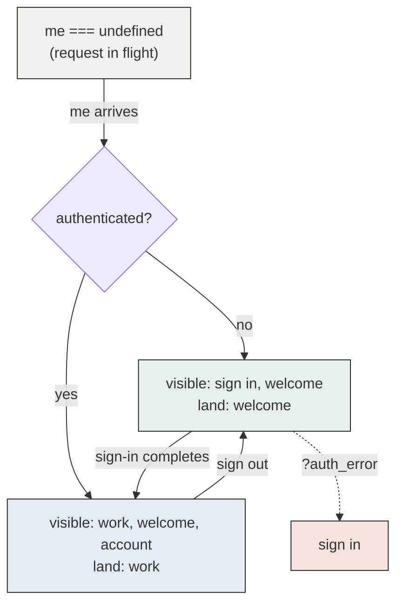
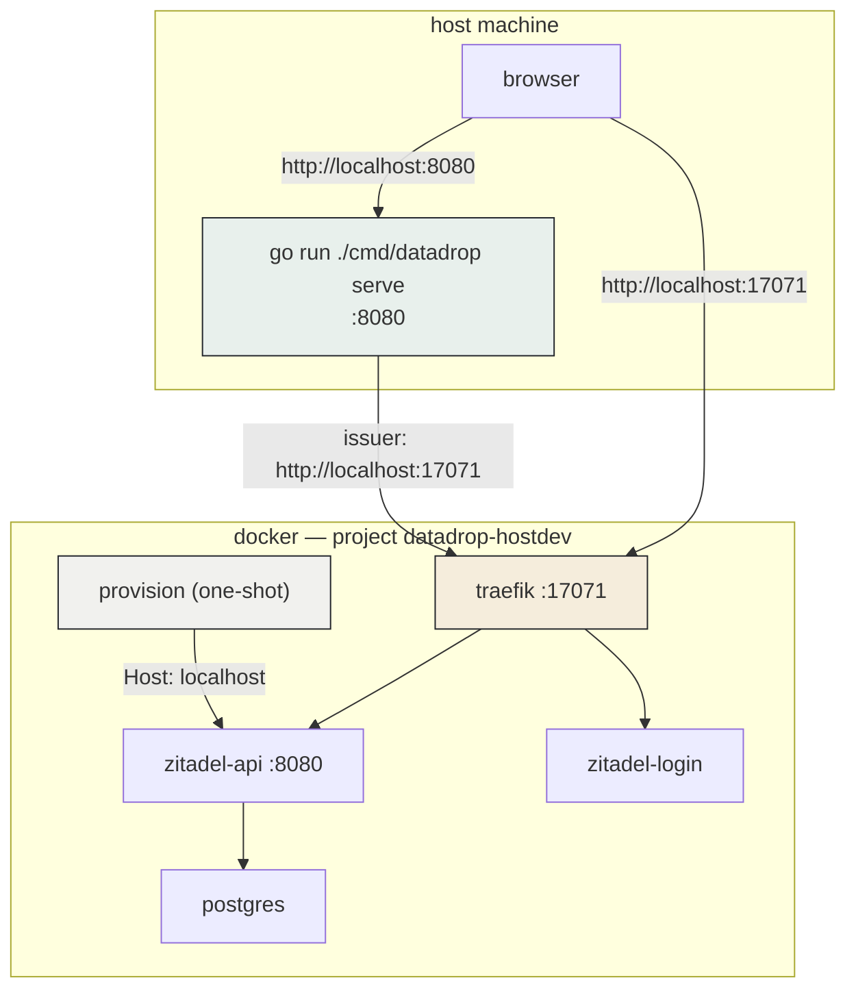

# PROJECT REPORT - go-go-datadrop v0.11 - The Product Front Door and the Unchecked Claim

This report covers DATADROP-14, which gave `go-go-datadrop` a front door: a marketing page at `/`, a brand system, an anonymous session model in which a signed-out visitor lands in a working workbench rather than a sign-in wall, a server-seeded public dataset, a sign-up application, and a tile picker that hides unavailable entries instead of greying them. It also added a development stack that runs Zitadel in Docker while `datadrop serve` runs on the host, and a suite of tests that exercise a real identity provider.

The technical result is 19 commits over 90 files. The more useful result is a repeated failure mode that appeared four times in one project, in four different artifacts, and was caught four different ways. Each instance was a claim that had been reasoned to rather than checked. Sections 11 through 15 treat that pattern as the primary subject, because it generalizes further than any individual feature does.

> [!summary]
> 1. A signed-out visitor now arrives in a working workbench with real data, which required an authentication-aware stage layer and a server-seeded `public_read` drop.
> 2. Running the identity provider in Docker while the application runs on the host removes the `/etc/hosts` requirement entirely, because the OIDC issuer identity constraint disappears when the browser and the application are the same machine.
> 3. Four separate claims in this project were false when checked: marketing copy describing a runtime nobody built, a code comment explaining a mechanism that did nothing, a design-document note asserting behaviour contradicted by a screenshot in the same repository, and a screenshot I interpreted as a feature.

## 1. The starting architecture

Before this work, `go-go-datadrop` was a capable analytical workbench with no entry path. Three facts describe the situation completely.

`pkg/webui/webui.go` served the single-page application at `/ui/` and redirected `/` to it. The mount point was deliberate: a catch-all fallback at the root returns `index.html` for any unmatched path, including a mistyped `/v1/drop`, which converts an API 404 into an HTML page. Mounting under `/ui/` preserved the API's error semantics.

`ui/src/components/pages/Workbench/Workbench.tsx` computed a single boolean and acted on it:

```tsx
const lockedOut = me?.auth_mode === "oidc" && !me.authenticated;

useEffect(() => {
  if (lockedOut) dispatch(layoutActions.setCurrentStage(SIGNIN_STAGE_ID));
}, [dispatch, lockedOut]);
```

Every anonymous visitor was moved to a stage offering two applications, `signin` and `about`, with the stage switcher and the workspace strip both suppressed. The suppression was correct given the mechanism available at the time: without a way to express which stages an unauthenticated caller may see, the only way to prevent a visitor from navigating into a workspace whose every tile would return 401 was to remove the navigation.

A five-section interactive tutorial existed at `/ui/tour`, built on `WorkbenchInstance`, rendering the real product against committed fixtures. Nothing linked to it from any location a stranger would encounter.

The consequence was that the product's first impression was a two-tile authentication screen, and its best demonstration was unreachable.

## 2. Stage visibility as a data property

The change that everything else depends on is one optional field on `Stage`:

```ts
audience?: "any" | "anonymous" | "authenticated";
```

Both non-default values are exclusive rather than minimum requirements. The `sign in` stage is meaningless once a session exists; the `work` stage is twelve tiles of 401 before one does. This is not a permission level and must not become one — the server denies data regardless of what the client renders, and the field exists so that a visitor is never offered a route to a stage that would show them nothing.

The field is optional and its absence means `any`. `Workbench.tsx` had previously argued against introducing a field that every future stage must have an opinion about, and that argument holds for required fields. An optional field with a permissive default costs a user-created stage nothing.

Two pure functions consume it:

```ts
export function stageIsVisible(stage: Stage, authed: boolean): boolean {
  switch (stage.audience) {
    case "anonymous":     return !authed;
    case "authenticated": return authed;
    default:              return true;
  }
}

export function landingStageFor(authed: boolean): StageId {
  return authed ? WORK_STAGE_ID : WELCOME_STAGE_ID;
}
```

Both the gate in `Workbench` and the switcher in `StageBar` call `stageIsVisible`. Two independent copies of "which stages exist for whom" produce a switcher that offers a stage the gate immediately moves the user off, which flickers once per load and reads as a defect in the switcher.

`landingStageFor` returns `welcome` rather than `sign in` for an unauthenticated caller, and that choice is load-bearing in both directions. A visitor who has just arrived has not declined to sign in; they have not been asked. A user who has just signed out has explicitly chosen to leave, and moving them to a sign-in screen at that moment is the product contradicting the action they just took.

## 3. An invariant, not an arrival rule

The gate was rewritten as a statement that must remain true rather than an action taken on load:

```tsx
useEffect(() => {
  if (!me) return;                                        // 1
  const current = stages.find((s) => s.id === currentStageId);
  if (current && stageIsVisible(current, authed)) return;  // 2
  dispatch(layoutActions.setCurrentStage(landingStageFor(authed)));
}, [me, authed, stages, currentStageId, dispatch]);
```

Each of the three lines corresponds to a defect that would otherwise ship.

The first guard exists because `me` is `undefined` while `GET /v1/me` is in flight, which makes `authed` false. Without it, every page load renders the anonymous layout before correcting itself, and a signed-in user watches their workspace appear, disappear, and reappear.

The second guard exists because `stages` receives a new array identity on any layout change. An unconditional dispatch would fire far more often than the state changes, and because `setCurrentStage` writes to the layout, it would feed itself.

The third property is the reason for the framing. "The current stage must be one this caller may see" is also true when a session ends. When `authenticated` transitions from true to false, the current stage may be `work`, which is no longer visible, and the same effect relocates the user with no additional code. Written as an arrival rule — "on first load, choose a stage" — the sign-out case would have required separate handling, and would have been discovered later.



The `auth_error` override exists because a visitor returning from a failed provider interaction is unambiguously attempting to sign in, and "land somewhere legal" would otherwise place them on `welcome`, where the error message is not rendered.

## 4. The stock dataset is a real drop, not a fixture

An anonymous visitor landing in a workbench with no data is a worse outcome than the sign-in wall it replaced. Two mechanisms in the repository could supply data, and the choice between them determines whether the product acquires a second data path permanently.

The tour intercepts at the RTK Query base query. A fixture map travels on the Redux store's thunk extra argument, so its scope is exactly one workbench instance and no call site changes. It exists so the tutorial renders with the API absent, returning 500, or demanding an account.

Reusing it for the product was the obvious move and the wrong one, for two reasons. Mechanically, the product's store is constructed in `main.tsx` before `GET /v1/me` resolves, so an anonymous-only fixture map requires either a loading gate ahead of store construction or a store rebuild when the response arrives. Substantively, it gives the product a demo mode: a code path in which the application reports data it did not fetch. Once that exists, every report of an incorrect chart begins with determining which data path produced it.

A `public_read` drop requires no frontend mechanism at all. Anonymous `VisibleDrops` is already `WHERE public_read = 1`, public reads are already tested, and writes are still refused. The signed-out experience therefore exercises the same read path as the signed-in one and cannot diverge from it silently.

`SeedWelcome` is idempotent by existence check rather than by upsert:

```go
func SeedWelcome(ctx context.Context, st *store.Store, blobs *blob.Store) error {
    if _, err := st.GetDrop(ctx, WelcomeDrop); err == nil {
        return nil  // present: leave alone, whatever is in it
    } else if !errors.Is(err, store.ErrNotFound) {
        return errors.Wrap(err, "seed: probing for the welcome drop")
    }
    // absent: create public_read, then open → add file → commit
}
```

An upsert is the reflexive choice and is wrong here. An operator who edits the welcome dataset to place their own data on the front door is doing something reasonable, and an upsert reverts it on the next restart — or, worse, republishes a drop they had deliberately made private. `TestSeedWelcomeLeavesAnEditedDropAlone` creates a private `welcome` drop by hand and asserts the seeder does not touch it.

The dataset is generated from `ui/src/fixtures/census.json`, the table the tutorial teaches with, so the front door and the tutorial present the same numbers. Its schema is not decorative:

```json
{ "properties": { "station_id": { "type": "string" }, "population": { "type": "integer" } } }
```

Without the string declaration, `station_id` is inferred as numeric and `"001"` becomes `1`. The sources browser then displays a value the file does not contain. `TestSeedWelcomeTableIsReadableAnonymously` asserts the zero padding survives a round trip.

## 5. Hiding rather than greying, and the ratio argument

The tile application picker previously rendered unavailable entries as `<option disabled>` with an appended reason. Three files argued for that policy in comments, each citing the others: hiding an unavailable option hides the rule that makes it unavailable, so a user who never sees `trace` in the list concludes the application is missing rather than learning it is a singleton.

The argument is correct and scales with the ratio of unavailable entries rather than with the principle. A verb menu on a field chip offers four to eight entries with one greyed, and the greyed entry is the lesson. The application picker offers twenty-six entries, of which the sign-in stage offers three. Twenty-two greyed rows do not teach a rule; they bury the three that work.

Measured in a browser against the running server, on the welcome stage:

| | Before | After |
|---|---|---|
| Options offered | 26 | 17 |
| Rendered disabled | 9 | 0 |

The implementation change is small. `map` becomes `flatMap`, and `reasonFor(id): string | undefined` becomes `unavailable(id): boolean`, because nothing renders the reason strings and a function returning values nothing displays is worse than no function.

```ts
return listed.flatMap((app) => {
  if (app.id === ownApp) return [{ value: app.id, label: app.title }];
  if (app.singleton && elsewhere.has(app.id)) return [];
  if (unavailable?.(app.id)) return [];
  return [{ value: app.id, label: app.title }];
});
```

The first rule survives unchanged and is the only rule in the function that is a browser fact rather than a policy. A `<select>` whose `value` matches no option renders blank and silently reassigns on the next change, so a seeded layout naming an out-of-scope application would lose that tile the first time anyone touched the dropdown.

With nothing rendered disabled, the three scope levels — instance, stage, workspace — behave identically, so `useAppScope()` returning `{ apps, reasonFor }` collapsed into `useAvailableApps()` returning one narrowed list. `Workbench.tsx` had carried a hand-written exception applying exactly this treatment to the sign-in stage, described in its own comment as an exception; generalizing the rule made the special case redundant and it was deleted.

The accepted cost is discoverability of stage-gated applications. Two mitigations were promised and both are now built: the stage bar names the current stage and its alternatives, and the launcher reports the boundary numerically — "The welcome stage offers 17 of 26 applications. The other 9 are on other stages." The launcher states a count rather than a list, because enumerating the excluded applications would reconstruct the greyed list one tile over.

## 6. Brand colours as aliases

The supplied brand sheet specifies four phase colours: IMPORT, UNDERSTAND, VISUALIZE, EXPORT. An initial draft read four hex values off the sheet. The final implementation contains no colour values at all:

```css
--brand-import:     var(--pbui-tone-source);
--brand-understand: var(--pbui-tone-step);
--brand-visualize:  var(--pbui-tone-chart);
--brand-export:     var(--pbui-tone-doc);
```

The mapping is semantic rather than approximate. Data enters from a *source*, is understood as pipeline *steps*, is visualized as a *chart*, and leaves as a *document*. Four of the workbench's existing presentation tones already denote exactly those four concepts.

The consequence is that the four-bar rule beneath the wordmark and the four-pixel tone edge on a chip resolve to the same values. A reader who learns that purple denotes a pipeline step on the marketing page has learned it for the product.

Two properties follow. No new contrast obligation is created, because the tones are graphic colours already governed at the 3:1 threshold by `ui/test/tokens.test.ts`. And retuning a tone retunes the brand, which is the intended coupling and is stated at both declaration sites.

`ui/test/brand-tokens.test.ts` enforces the rule with six cases: no hex literal, no `rgb()`/`hsl()` literal, each phase aliasing its designated tone, every referenced `--pbui-*` token existing in `tokens.css`, and the four declared in order. The test was verified by injecting both failure classes and observing them fail, because a guard that has never failed is a guard nobody has tested.

The wordmark is drawn rather than typeset. Five glyphs — D, A, T, L, B — on a 100×140 grid with 22-unit chamfers, one path each with `fill-rule: evenodd` so counters are subpaths of the same shape. The bundle is embedded in a Go binary and served offline, so a webfont request would either fail or reach a third party; a graphic appearing at three fixed sizes and never as body text is correctly an SVG.

## 7. The front door without a catch-all

Serving a marketing page at `/` conflicts with the reason the SPA was mounted under `/ui/`. Go's exact-match pattern resolves it:

```go
mux.Handle("GET /{$}", index(fsys))            // the root, and nothing else
mux.Handle("GET "+MountPath+"{path...}", shell(fsys))
mux.Handle("GET "+AssetPath+"{path...}", static(fsys))
```

`{$}` matches the empty path only. The API's 404 semantics are preserved by construction rather than by careful route ordering, which is the difference between a property that holds and a property that holds until someone reorders two lines. Verified directly:

```
$ curl -o /dev/null -w '%{http_code} %{content_type}\n' localhost:8080/
200 text/html; charset=utf-8
$ curl -o /dev/null -w '%{http_code} %{content_type}\n' localhost:8080/v1/nonsense
404 text/plain; charset=utf-8
```

The client-side switch became a tested pure function. The previous chain of `startsWith` calls had three cases and no test; four cases with order dependence produce a failure mode in which a page becomes unreachable without throwing — it renders a different page instead.

The tutorial became a band of the marketing page rather than a second page sharing components. Two pages would mean two mastheads, two navigations, two locations to update a headline, and a realistic chance that a visitor arriving at the tutorial never sees the marketing page. `/ui/tour` renders the same document scrolled to `#tutorial`.

## 8. Developing against a real identity provider

`pkg/server/auth_flow_test.go` covers every failure path of the OIDC callback against a fifteen-line fake: replayed state, mismatched nonce, refused exchange, unverified email. Those are security properties, and none is reachable in a test requiring a real provider.

A fake cannot report whether the understanding of the real provider is correct. The five tests in `pkg/auth/oidc_live_test.go` each guard something a fake passes by construction:

| Test | Failure it detects |
|---|---|
| `TestLiveDiscovery` | the issuer does not round-trip — the most common misconfiguration here |
| `TestLiveAuthCodeURLIsAccepted` | the client id, redirect URI, scopes or PKCE method are not registered as assumed |
| `TestLiveSignupPromptIsAccepted` | `prompt=create` is not honoured, so "create an account" silently shows a login form |
| `TestLiveUnregisteredRedirectURIIsRejected` | the provider is not enforcing its redirect allow-list, which is an open redirect on the login endpoint |
| `TestLiveEndSessionIsAdvertised` | global sign-out has degraded to local sign-out with no error |

The fourth test exists so that the others passing means something. A suite asserting only successful cases would pass against a provider accepting any `redirect_uri`. It also produced a finding: Zitadel rejects an unregistered redirect URI with a hard 400 from the authorization endpoint rather than redirecting back with an error, which is the stricter of the two behaviours RFC 6749 permits. The first version of the test asserted that a redirect occurred and therefore failed while the provider behaved better than required.

The tests are gated by an environment variable rather than a build tag. A build tag hides the file from the compiler and from `go vet` on every ordinary run, so it rots; an environment variable keeps the file compiled, so a signature change to `auth.Provider` breaks the build immediately.

## 9. The issuer identity constraint, and where it disappears

An OIDC issuer is an identity rather than an address. The URL the application uses to reach the provider must be character-for-character the URL the browser is redirected to, or `go-oidc` refuses the discovery document with `oidc: issuer did not match the issuer returned by provider`.

The full Docker Compose stack satisfies this with a `zitadel.test` hostname pinned to the proxy inside the network and to `127.0.0.1` in `/etc/hosts`. The manual step is required because the application is a container there, and `localhost` inside a container denotes that container. RFC 6761 reserves `localhost` and every subdomain of it for loopback, and resolvers honour that before consulting `/etc/hosts`, so no network alias or `extra_hosts` entry can redirect it.

When the application runs on the host, the constraint evaporates. The browser and the application are the same machine, so `localhost` already satisfies the identity requirement, and no `/etc/hosts` entry is needed. This is not merely a convenience: the entry is unavailable without root, which is the situation this stack was built in.

One component still pays. `provision` runs inside the network and must call the management API, and `localhost` there denotes the provisioning container. It dials the API service directly on the Docker network and names the instance in a `Host` header:

```yaml
ZITADEL_API: http://zitadel-api:8080
ZITADEL_HOST_HEADER: localhost
```

Zitadel resolves the instance from the request host, matching on the domain with the port stripped. Both variables are defaulted in `provision.sh`, so the full stack is unaffected.



The stack is additionally isolated from the full one in every namespace they could share, for a reason discovered during the work rather than anticipated. `docker-compose.yml` declares `name: datadrop` at the top level, which means two checkouts of the repository running `make compose-up` drive the same containers. The stack answering on port 17070 during this project belonged to a different working tree. The diagnostic is:

```
$ docker inspect datadrop-zitadel-api-1 \
    --format '{{index .Config.Labels "com.docker.compose.project.working_dir"}}'
/home/manuel/workspaces/2026-07-24/datadrop-mcp/go-go-datadrop/deploy/compose
```

`make compose-nuke` from either checkout destroys the other's database.

## 10. The verified authentication loop

The complete round trip was exercised in a browser against the running stack, using the administrator account the first-instance configuration creates:

| Step | Observed |
|---|---|
| `GET /v1/auth/login?return=/ui/` | 302 to `/oauth/v2/authorize` with `code_challenge`, `nonce`, `state`; `dd_flow` cookie set |
| Provider login | Zitadel Login v2 accepted the credentials |
| Callback | landed at `/ui/?first=1` — code exchange, session cookie, JIT user provisioning |
| Arrival | `account` stage; URL stripped to `/ui/`; profile shows the JIT-created user |
| Stage switcher | `welcome, account, work` — `sign in` absent |
| Sign out | `authenticated: false`, landed on `stage-welcome`, switcher back to `sign in, welcome` |

The final row is the sign-out transition described in section 3, confirmed to require no dedicated code path.

## 11. Failures that changed the implementation

Five failures altered the design. Four of them share a structure treated separately in section 15.

### The compose file passed a flag the binary no longer has

`deploy/compose/docker-compose.yml` still passed `--auth=oidc`, removed when static root authentication was deleted. The running container predated the removal, so nothing had failed; the stack would have broken on its next rebuild. Found by running the same arguments on the host and receiving `datadrop: unknown flag: --auth`.

### The proxy's pinned address lost a race

The proxy pins itself to `.2` so that `extra_hosts` entries can name a literal address. Docker allocates dynamic addresses from the bottom of the subnet, and `postgres` starts first as `zitadel-api`'s dependency, so a cold bring-up could assign `.2` to `postgres` and kill the proxy with `Error response from daemon: Address already in use` — a message naming neither the address nor the holder, and not reproducing once containers retain their addresses.

### A CSS module class that was never defined

`TutorialBand.tsx` referenced `styles.band` against a stylesheet renamed from `LandingPage.module.css` in which the class was never added. CSS module lookups are plain property accesses on an untyped object, so the key resolved to `undefined`, `className={undefined}` rendered no class, and the tutorial sections ran the full width of the window. No error at build, at typecheck, or at runtime. The defect shipped and was reported by the user.

### The reference copy described a different program

The marketing copy was taken from a prototype landing page. Two passages described that prototype rather than `go-go-datadrop`, and are covered in section 12.

### The welcome chart was empty on arrival

The seeded dataset was reachable and the sources browser selected it correctly, and the chart beside it was blank. Covered in section 13.

## 12. Marketing copy as an unverified assertion

The reference page's four runtime cards described its own implementation accurately. Three were false of `go-go-datadrop`. The decisive check took three seconds:

```
$ grep -rln "LRU\|CACHE_LIMIT\|lttb\|LTTB\|decimat" ui/src
ui/src/components/pages/MarketingPage/copy.ts
```

The only file in the repository containing those terms was the copy asserting them.

| Claim | Status |
|---|---|
| "DuckDB-Wasm in a worker" | true — `AnalysisProvider` lazily imports `AnalysisRuntime` and `BrowserDuckDBFactory` |
| "the small JavaScript evaluator renders the first frame" | false — no JavaScript evaluator exists; `useTableFor` is documented as a synchronous lookup of the latest DuckDB result |
| "a second LRU stores built plot geometry" | false — no LRU exists in `ui/src` |
| "line and area series use LTTB decimation" | false — no decimation exists in `ui/src` |

A fifth defect sat in the same file. The hero's single instruction read "right-click a point, keep one species". No fixture in the repository has a species column; the hero seeds an event stream from four weather stations. The one sentence on the page telling a visitor what to do directed them to something not present on screen.

The cards were rewritten to describe the actual runtime, with each claim traceable to a file: a lazily created executor, a latest-generation rule that keeps the previous result on screen rather than racing it, one runtime per workbench root purged when the principal changes, and bounded results that report their own coverage. The rule is now written above the section: a claim here must name something a reader could go and find.

This departs from the instruction to keep the reference page's copy. The instruction cannot reasonably have meant retaining assertions that are false about the product, and both departures are annotated at their declarations with what was checked. Confirmation from the requester remains outstanding.

The structural observation is that `copy.ts` is prose in a TypeScript file. Every other claim in the codebase is anchored by a test, a type, or a comment adjacent to the code it describes. Marketing copy has none of those, which makes it the location where an assertion can remain false indefinitely without producing a signal.

## 13. A comment that explained a mechanism that did not exist

The proxy address race in section 11 was fixed twice. The first fix declared an explicit gateway:

```yaml
ipam:
  config:
    - subnet: ${DATADROP_SUBNET}
      gateway: ${PROXY_GATEWAY:-10.77.0.1}
```

accompanied by a twenty-line comment explaining that declaring `.1` as the gateway causes Docker to allocate dynamic addresses from `.3` upward, leaving the pinned address free. `docker compose config` validated and rendered the expected output.

A cold bring-up disproved it:

```
gateway=10.78.0.1 subnet=10.78.0.0/24
datadrop-hostdev-postgres-1  10.78.0.2/24
datadrop-hostdev-proxy-1     10.78.0.3/24
```

`.1` was already the implicit gateway. Declaring it changed nothing.

The correct mechanism is `ip_range`, which bounds the dynamic pool rather than the subnet:

```yaml
      ip_range: ${PROXY_POOL:-10.77.0.128/25}
```

```
subnet=10.78.0.0/24 range=10.78.0.128/25
datadrop-hostdev-proxy-1       10.78.0.2/24     <- the pin, honoured
datadrop-hostdev-postgres-1    10.78.0.129/24
datadrop-hostdev-zitadel-api-1 10.78.0.130/24
```

Two observations follow. Configuration validating is not the same as configuration achieving anything: both versions produced valid, plausible output, and only one worked. And the comment would have been the more damaging artifact — the next engineer encountering the race would read a confident explanation of why it cannot occur and search elsewhere.

The fix is proven rather than argued. The host-dev override had dropped the proxy's pinned address to work around the collision; restoring it means `make zitadel-nuke && make zitadel-up` reproduces the exact failing condition on every cold boot, and a regression presents as a failed bring-up.

## 14. A design document that contradicted a screenshot in the same repository

The seeded dataset was reachable, `/v1/me` advertised it, the sources browser selected `welcome (public)` and `census` and rendered a source chip. The chart and table beside it both read "no source — load one from the sources tile".

The cause is that selecting a drop in the sources *browser* does not point the chart *document* at anything. `makeStore` creates the active document with an empty source, and only clicking the chip re-points it. The promise the ticket exists to deliver — that a stranger sees the product working before being asked for anything — shipped as an empty chart beside a populated file picker.

The failure had three separate opportunities to be caught, and passed all three.

The implementation diary contains a screenshot showing exactly this state, described in that step as the intended interaction. The design document carried an "as built" note asserting that the planned `SourceApp` change was unnecessary because "the right thing already happens", and drawing a lesson about not writing speculative code. The screenshot disproving the note appears two steps earlier in the same document set.

An automated reviewer on the pull request identified it precisely.

The fix points the active document at the advertised dataset once, on arrival. The guards are narrow, and each corresponds to a specific way of behaving badly:

- **Anonymous only.** A signed-in user has their own drops, and demo data is worse than an empty document.
- **Only when the document has no source.** `drop === ""` is the empty state `newDoc(null)` produces; restored work must never be overwritten.
- **Once per mount**, via a ref. Otherwise pressing the new-document control fills it with demo data a frame later, which is difficult to attribute to any particular code.
- **In `Workbench`, not `SourceApp`.** This is a session concern, and in `SourceApp` it would run once per embedded tutorial panel.

`/v1/me` now reports the resolved latest committed version, because a dataset source reference is incomplete without one and this path does not traverse the source browser. It is reported only when a committed version exists, so a partially seeded drop cannot direct the client to a 404. `seed_test.go` asserts the reference is complete enough to point a document at, because a missing version disables the arrival rule silently and restores the empty chart — a failure with no error message.

## 15. The pattern: reasoning is not verification

Four failures in this project share a structure. Each was a claim reached by valid reasoning from true premises, and each was false.

| Artifact | Claim | Cost of checking |
|---|---|---|
| Marketing copy | the runtime uses a JS fallback, an LRU, and LTTB decimation | one `grep`, three seconds |
| Compose comment | declaring a gateway moves dynamic allocation to `.3` | one cold boot, ninety seconds |
| Design document | `SourceApp` needs no change, the right thing already happens | one screenshot, already taken |
| Screenshot reading | an empty chart beside a source chip is the intended interaction | one sentence written in advance |

The third and fourth are the same failure at different removes. The reasoning was: the fallback selects the first visible drop; the welcome drop is the only visible one; therefore it works. Every step is true and the conclusion is false, because the object being selected — a drop, in a browser — is not the object that needed to change — a document's source.

What was missing in each case was a statement of the observable outcome written *before* looking. "The chart shows data without the visitor doing anything" resolves the screenshot in one second. Without it, a correctly populated file picker reads as success. The same applies to the compose fix: "postgres is allocated an address above `.2`" is checkable in one command, and "declaring a gateway shifts allocation" is not checkable at all as stated, because it describes a mechanism rather than an outcome.

The generalizable rule is that a comment asserting a mechanism is a claim with the same status as a test assertion and none of the enforcement. Both of the mechanism-claims in this project would have actively misled the next reader, which is worse than their absence.

## 16. Validation and final state

Automated:

- `go build ./...`, `go test ./...` — all packages pass, including 6 new seed tests and the smoke suite.
- `golangci-lint run -v` — 0 issues.
- `bun run --cwd=ui typecheck` — clean.
- `bun test --cwd ui` — 438 pass, 0 fail, across 39 files.
- `DATADROP_LIVE_OIDC=1 go test ./pkg/auth/ -run Live` — 5 pass against a real Zitadel.
- `docmgr doctor --ticket DATADROP-14 --stale-after 30` — clean.

One known exception: `bun run --cwd=ui lint` reports two pre-existing formatting failures in `ui/src/api/device.ts` and `DeviceApprovalPage.tsx`. Both belong to the device-authentication work, are outside this ticket's file set, and were deliberately left alone.

Manual, against the running stack:

- Anonymous first visit with cleared storage: `welcome` stage, "start here" workspace, populated chart and table, no interaction required.
- Stage switcher, anonymous: `sign in`, `welcome`. Authenticated: `welcome`, `account`, `work`.
- Tile picker: 17 entries, none disabled.
- Full sign-in round trip, JIT provisioning, `?first=1` handling, sign-out relocation.
- `/` serves HTML; `/v1/nonsense` remains a 404.
- Cold compose bring-up with the pinned address restored.

Bundle: 613,856 → 627,996 bytes, an increase of 13.8 kB or 2.3 percent across all six phases. The named escape hatch — a lazy `import()` of `tour/` — is not warranted at that size.

Scale: 19 commits, 90 files, 9,918 insertions, 799 deletions.

## 17. What DATADROP-14 does not do

It does not write a login or registration form. The identity provider owns passwords, MFA, email verification, and the registration form; the sign-up tile explains the offer, sets expectations, and owns the return state. `prompt=create` remains the entire server-side difference between signing in and signing up.

It does not select the display typefaces. The brand sheet names two; choosing them requires a licence rather than a decision. The wordmark ships as SVG and `--brand-font-display` resolves to the monospace stack until that changes.

It does not restyle the workbench. The density of `tokens.css` is load-bearing for tile count, and the brand layer applies to marketing and identity surfaces only.

It does not decide whether an anonymous visitor's work should migrate into an account they subsequently create. The layout survives in localStorage and the documents built over the public dataset survive with it; whether they should be adopted by the new account is a product question and is recorded as open.

It does not fix the base compose stack's shared project name. Two checkouts still drive the same containers under `make compose-up`; the host-dev stack sidesteps it with `-p` rather than resolving it.

## 18. Working rules established by the project

- A claim in marketing copy must name something a reader could go and find. If a card cannot be traced to a file, delete the card.
- A comment asserting a mechanism is a claim. Check it against observed behaviour or do not write it.
- Before examining evidence, state the observable outcome that would constitute success. A screenshot answers a question only if the question was asked first.
- Rendering constraints on a client are not security boundaries. `Stage.audience` narrows what is offered; the server denies data independently.
- Prefer an invariant to an arrival rule when the property should continue to hold, and an arrival rule with an explicit guard when it should not. Stage visibility is the former; pointing a first-time visitor at demo data is the latter.
- Idempotency by existence check, not by upsert, when a human may have edited the thing being seeded.
- Hide unavailable options where the ratio is high and grey them where it is low. The question is how many entries are unavailable at once.
- Colour tokens for a brand should alias the application's existing tokens rather than duplicate them, unless the two systems are genuinely independent.
- Configuration that validates has not thereby been shown to do anything.

## Important project docs

The full ticket workspace lives at `/home/manuel/workspaces/2026-07-27/datadrop-signup-landing-page/go-go-datadrop/ttmp/2026/07/27/DATADROP-14--the-product-front-door-*/`:

- `design-doc/01-the-product-front-door-analysis-design-and-implementation-guide.md` — the analysis, nine decision records DR-90 through DR-98, seven implementation phases, API reference, test matrix.
- `reference/02-data-lab-brand-guide-tokens-lockup-icon-set-and-usage-rules.md` — brand tokens, component contracts, geometry, usage rules.
- `reference/01-investigation-diary.md` — thirteen chronological steps, including every failure recorded with its exact error text.

In-repository documentation: `datadrop help dev-stack-zitadel` is the development playbook for the host-dev stack, including its failure modes.

## Open questions

- Whether the marketing copy should be name-swapped from the reference, as implemented, or rewritten in the brand's voice.
- Whether `--seed-welcome` should default to true, given that every fresh deployment then publishes a dataset to anonymous callers.
- Whether `census` is the right front-door dataset, or whether a domain-relevant one would present better.
- Whether an anonymous visitor's documents should migrate into an account created afterwards.

## Near-term next steps

- Resolve the copy question and, if the answer is a rewrite, redo the marketing prose in the brand's voice.
- Fix the base compose stack's shared project name so two checkouts cannot drive one set of containers.
- Select the display typefaces and switch `--brand-font-display`.

## Related reports

- [[PROJECT REPORT - go-go-datadrop v0.10 - From JavaScript Pipelines to DuckDB-Wasm]]
- [[PROJECT REPORT - go-go-datadrop v0.9 - Root Authority Removal and Browser-Approved Agent Credentials]]
- [[ARTICLE - Datadrop Production Authentication and k3s Deployment - Deep Technical Analysis]]
