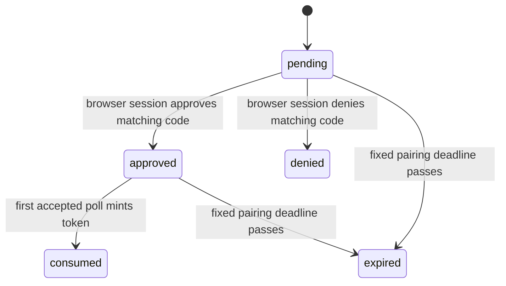

# PROJECT REPORT - go-go-datadrop v0.9 - Root Authority Removal and Browser-Approved Agent Credentials

This report covers the implemented security half of DATADROP-12: removing Datadrop's static server-root credential and replacing the missing non-browser authentication path with browser-approved, scoped, expiring, revocable local `ddp_` credentials. The work is in `/home/manuel/workspaces/2026-07-27/datadrop-zitadel/go-go-datadrop` on `task/datadrop-zitadel`. It was developed after the OIDC/session work described in [[PROJECT REPORT - go-go-datadrop v0.4 - Two Credentials, One Principal, and an Issuer That Is Not an Address|v0.4]], and it deliberately preserves that boundary rather than introducing a second identity system.

The result is not an OAuth device issuer and it does not make ZITADEL access tokens valid Datadrop credentials. ZITADEL remains the browser identity provider. Datadrop remains the authority that turns an authenticated person into a local session or a local API token, evaluates token scope, evaluates direct-drop membership, and checks token revocation. A coding agent can receive a token only after a signed-in browser user sees and approves the request.

> [!summary]
> - The static `serve --token` authority, its environment variable, resolver bypasses, ACL bypasses, documentation, Compose configuration, and test fixtures have been removed rather than retained as a compatibility path.
> - Device pairing creates a short-lived authorization record containing hashes, never raw codes or recoverable API-token secrets. The first successful approved poll mints one ordinary `ddp_` token inside the transaction that consumes the request.
> - The agent command and browser approval route are now implemented and validated. PVC-first GitOps, off-node backup/restore validation, and the S3 blob seam remain separate unfinished DATADROP-12 work.

## The problem was authority, not token syntax

Before this work, a Datadrop server could be started with one static root token. Possession of that string gave an undifferentiated principal the ability to use data-plane endpoints without a local user, session, API-token record, scope set, expiry, or revocation state. The string was operationally simple, but it combined server bootstrap, machine access, and authorization into one long-lived secret. It also meant audit records could not attribute an action to a person or a deliberately issued credential.

The v0.4 authentication layer had already established the correct split. A browser follows Authorization Code with PKCE against ZITADEL. Datadrop validates the callback server-side, projects a local user keyed by issuer and subject, and creates an opaque `dd_session` cookie. Browser uploads continue to use that cookie. A user can also mint a local `ddp_` API token whose database row carries a hash, public identifier, scopes, expiry, and revocation timestamp. The missing case was an agent that has no browser but is operated by a person who does.

Accepting a raw ZITADEL OAuth bearer token would have appeared to solve that case, but it would have changed the data-plane contract. Datadrop would need to accept foreign credential formats, decide how and when to validate them, couple request authorization to provider availability or token lifetime, and lose the existing local token-revocation and scope model. The implementation therefore keeps provider credentials at the browser sign-in boundary only.

| Credential | Created by | Presented to Datadrop | Authority evaluated by Datadrop |
|---|---|---|---|
| ZITADEL authorization response | ZITADEL | Only at `/v1/auth/callback` | OIDC signature, issuer, PKCE, nonce, local-user projection |
| `dd_session` cookie | Datadrop | Same-origin browser requests | Local session lifetime, disabled user state, CSRF Origin check |
| `ddp_…` API token | Datadrop | CLI, CI, coding agent, optional browser bearer | Token hash, revocation, expiry, local user state, scope, drop ACL |
| Former root token | Static server configuration | Any data-plane request | Removed |

The important point is that a local token is not a substitute for user authorization. It is a narrower durable representation of a decision that was made by a local user and can later be revoked locally.

## The hard cutover

The cutover was committed as `f3ad9e8 feat: remove Datadrop static root authentication`. It did not leave a silent fallback for old operators or tests. The removed surface included `KindRoot`, static server token configuration, `DATADROP_ROOT_TOKEN`, `serve --token`, open/token server modes, and their resolver and authorization bypasses. Docker Compose no longer supplies a root credential. The ordinary client `DATADROP_TOKEN` input remains, but it is now explicitly for a user-owned local `ddp_` token and never configures a server.

This distinction is visible in the server startup contract. `pkg/cli/serve.go` now resolves an OIDC-only server configuration and requires the files it needs for OIDC and device-code protection. `pkg/server/server.go` rejects unsupported server authentication modes. `pkg/server/middleware.go` resolves either a valid local bearer token or a valid local session; it has no branch that constructs an administrator from a string stored in process configuration.

The tests had to change with the runtime. Server and subprocess smoke tests now seed ordinary local users, sessions, drop memberships, and ordinary local API tokens. The subprocess suite also starts a small fake OIDC discovery server and supplies a test-only device-code pepper file. This matters because tests that preserve a root-token setup after production removes it can make a removed privilege path appear to remain supported.

## Device pairing is a local authorization protocol

The device flow borrows the useful interaction shape of RFC 8628: an agent starts a request, receives a high-entropy device code plus a human-comparable user code, and polls at an advertised interval. The protocol is local to Datadrop. It has no OAuth issuer metadata, no provider token response, and no endpoint that turns a user code into a credential by itself.

```mermaid
sequenceDiagram
    participant A as Coding agent
    participant D as Datadrop API and SQLite
    participant B as Browser
    participant Z as ZITADEL

    A->>D: POST /v1/device/authorizations
    D->>D: hash device code; HMAC user code; persist pending row
    D-->>A: device code, user code, approval URL, 5s interval
    A->>D: POST /v1/device/tokens (after interval)
    D-->>A: AuthorizationPending
    B->>D: GET /ui/device?authorization_id=…&user_code=…
    B->>Z: normal browser sign-in when dd_session is absent
    Z-->>D: OIDC callback; Datadrop creates local session
    B->>D: GET pending request with session plus user code
    D-->>B: requested name, scopes, pairing deadline, token deadline
    B->>D: POST approve with session plus user code
    D->>D: atomically set approved state
    A->>D: POST /v1/device/tokens
    D->>D: mint local ddp token; mark request consumed; audit both
    D-->>A: raw token exactly once
```

The two codes have different jobs and different security properties.

- The **device code** is the agent credential before consumption. It is generated by the existing high-entropy flow-value generator and the database stores only its SHA-256 hash.
- The **user code** is a value a person can compare with the terminal. `pkg/auth/device.go` uses a restricted Base32 alphabet and renders eight characters as `ABCD-EFGH`. The code is normalized by removing the hyphen and uppercasing before validation.
- The user-code database value is `HMAC-SHA-256(normalizedCode, DEVICE_CODE_PEPPER)`. A database reader cannot cheaply enumerate the deliberately human-sized code space without the separately held pepper.
- The approval URL carries the nonsecret authorization ID and the user code. The ID selects the record; the code proves that the browser user is approving the request displayed by the agent.

The local record is not a token cache. The raw device code is discarded after the start response. The raw user code is discarded after the start response. The raw API token is not generated at start or approval time, so it cannot be stored for later retrieval. Only its ordinary API-token hash and public ID persist after consumption.

## Persistence makes the state machine enforceable

Migration `0004_device_authorizations.sql` adds the durable authorization state. The table stores the two hashes, requested token label and scopes, polling cadence, lifecycle timestamps, approving user, and resulting public token ID. It stores no raw secret.

```sql
CREATE TABLE device_authorizations (
    id               TEXT PRIMARY KEY,
    device_hash      TEXT NOT NULL UNIQUE,
    user_code_hmac   TEXT NOT NULL UNIQUE,
    requested_name   TEXT NOT NULL,
    requested_scopes TEXT NOT NULL,
    expires_at       TEXT NOT NULL,
    poll_interval_s  INTEGER NOT NULL,
    next_poll_at     TEXT NOT NULL,
    state            TEXT NOT NULL,
    approved_by      TEXT REFERENCES users(id),
    approved_at      TEXT,
    denied_at        TEXT,
    consumed_at      TEXT,
    token_id         TEXT REFERENCES api_tokens(id),
    created_at       TEXT NOT NULL
);
```

The allowed lifecycle is intentionally small.



The later `0005_device_authorization_token_expiry.sql` migration adds `token_expires_at`. This was not cosmetic. The first implementation used the requested `expires_in` value both for the pairing request and for the eventual credential. A request for a legitimate 24-hour token would therefore make the human-approval code live for 24 hours. The correction keeps the pairing record at `DeviceAuthorizationLifetime`, currently ten minutes, and stores the user-selected token deadline separately. Existing pre-release rows retain their old deadline as a token deadline during migration.

This is the relevant algorithm in `pkg/server/handlers_device.go`:

```text
parse requested token expiry
reject no expiry, expired expiry, or expiry longer than 30 days
pairingExpiresAt = now + 10 minutes
create high-entropy device code and displayed user code
store SHA-256(device code), HMAC(user code), pairingExpiresAt, tokenExpiresAt
return raw codes once and an initial 5-second poll interval
```

A device token cannot carry `admin`. `auth.ValidateDeviceScopes` permits ordinary operational data scopes but rejects the broad administrative scope. The approval process grants only the requested scope subset; direct-drop access is still checked for every actual request, so approval does not manufacture membership in a drop.

## The first successful poll is the credential issuance point

The most consequential implementation detail is where a raw API token is generated. Approval records a user decision but does not create the token. Polling a pending request returns `AuthorizationPending` and updates the next allowed poll time. Polling too early returns `SlowDown` and increases the durable cadence. Polling after denial, expiry, or prior consumption returns `InvalidGrant` or `ExpiredToken` without revealing state beyond what the agent must know.

Only an approved, timely poll can mint a credential. `pkg/store/device_authorizations.go` opens an immediate SQLite transaction, validates the state, verifies the approving user is not disabled, inserts a normal API-token row using the transaction-capable token helper, records the device authorization as consumed with that token's public ID, writes audit records, and commits. The returned raw token exists only after that commit succeeds.

```text
BEGIN IMMEDIATE
record = SELECT device authorization by device_hash
require record.state == approved
require now < record.pairing_expires_at
require approving user is enabled
created = createAPIToken(tx, approvingUser, requestedName, requestedScopes, tokenExpiresAt)
UPDATE device_authorizations
  SET state = consumed, consumed_at = now, token_id = created.id
  WHERE id = record.id AND state = approved
write token-create and device-consume audit records
COMMIT
return created.rawToken
```

The update predicate and transaction boundary matter together. A second concurrent poll cannot both observe `approved`, insert another credential, and mark the same record consumed. The server test `TestDeviceAuthorizationConsumesOnlyOnceUnderConcurrentPolls` starts two consumers and asserts one success and exactly one token row. A subsequent poll returns `InvalidGrant`.

This use of a transaction is not an optimization. It defines the point at which authorization becomes a durable credential and eliminates a class of duplicate-token failure that would otherwise appear only under retries or concurrent agent processes.

## The browser and agent have deliberately different output contracts

`datadrop auth device` is a Glazed bare command in `pkg/cli/authcmd/device.go`. A table formatter would be inappropriate because the command's useful result is a secret and table output can introduce surrounding text, formatting controls, or accidental handling by generic output paths. The command therefore has a narrow process contract:

```bash
export DATADROP_TOKEN="$(datadrop auth device \
  --name 'local coding agent' \
  --scopes drops:read,drops:write \
  --expires-in 24h)"
```

The verification URL, pairing code, and waiting status go to stderr. The raw `ddp_` token, once issued, is the only stdout line. `--credential-file` is explicit and writes a mode-`0600` file rather than silently establishing a long-lived local configuration file. The command starts the request anonymously, waits at the server-advertised interval, handles `AuthorizationPending`, lengthens its wait after `SlowDown`, and stops on expiry or a nonrecoverable grant error.

The browser route `/ui/device` is separate from the workbench. It reads the authorization ID and code from the verification URL, uses same-origin cookie requests without the workbench's optional sessionStorage bearer-token header, and requires a real `dd_session` before it can preview, approve, or deny a request. This avoids an important identity confusion: a browser tab may contain a user-owned API token for normal workbench data calls, but approving an agent must be a browser-session action attributable to the signed-in human.

The page exposes the requested label, scopes, the pairing expiry, and the eventual token expiry before rendering approve and deny controls. A user who is not signed in receives a same-origin sign-in link that returns to the exact approval URL. The page does not put pairing codes, authorization state, or returned secrets into Redux or localStorage.

## Operational controls are present, but they are scoped

The implementation adds two process-local rate limiters in `pkg/server/device_rate_limit.go`: ten anonymous starts per minute per direct client address and 120 polls per minute per direct client address. It does not trust forwarded client-IP headers supplied by an arbitrary request. The durable per-record polling cadence remains the correctness control across requests; the process-local limiter prevents simple flood and guessing pressure before it reaches SQLite.

The limits need operational review before a multi-replica deployment. They are appropriate for the current one-replica SQLite design because the authorization row itself serializes the value-bearing transition. A future horizontal deployment would need a shared abuse-control mechanism in addition to the existing database state. It would not require changing the one-time issuance transaction.

The new server startup configuration requires `--device-code-pepper-file`. Docker Compose's provisioning script creates a 32-byte random base64 value once in its bootstrap volume, changes ownership to the distroless nonroot UID, and passes the file path into Datadrop. A cluster deployment should instead materialize the same value from Vault. The pepper is not an API credential and is never returned by the HTTP API.

## Evidence and integration history

The implementation was developed in three focused commits, then merged with current upstream review work.

| Commit | Change |
|---|---|
| `f3ad9e8` | Removed static root authentication and migrated test/configuration/documentation surfaces. |
| `2755702` | Added durable device authorization, hashed codes, transactional one-time issuance, polling controls, and Compose pepper delivery. |
| `2066ed8` | Merged `origin/main`, including reviewed import, scope, pagination, and UI work, without conflicts. |
| `f05a819` | Added the device CLI, browser approval page, authorization preview, and distinct pairing/token expiry migration. |

The completed validation set after the merge and device UI work was:

```text
GOWORK=off go test ./... -count=1             PASS
GOWORK=off go build ./...                     PASS
bun run --cwd=ui typecheck                    PASS
bun test --cwd=ui                             PASS (396 tests)
bun run --cwd=ui build                        PASS
cd deploy/compose && docker compose --env-file .env.example config --quiet  PASS
```

The CLI has a subprocess test that controls a fake device server through one pending response and one successful response. It verifies that stdout is exactly `ddp_id_secret\n`, that the terminal instructions remain on stderr, and that the command polls again after `AuthorizationPending`. Server tests cover wrong user codes, forbidden `admin`, required browser-session approval, token resolution, one-time consumption, concurrent polling, and the separation between a ten-minute pairing deadline and a requested 24-hour token deadline.

One UI failure occurred during integration and was corrected rather than ignored. The first new Storybook story used the title `pages/DeviceApprovalPage`. The repository's story test requires its page-level entries to live under an existing `Applications/` sidebar category. The failing test identified both the prefix and unknown group. The final title, `Applications/Workbench/DeviceApprovalPage`, makes the route visible in the expected documentation hierarchy and restores the complete UI suite.

## What the work does not yet claim

DATADROP-12 deliberately contains three independently difficult areas. This report covers the completed credential cutover and device pairing work. It does **not** claim that the remaining infrastructure work is finished.

The unfinished items are:

1. **S3-capable blob seam and migration tooling.** `pkg/blob.Store` remains a filesystem implementation. Its content-addressed, atomic local-rename semantics are still correct for the current deployment, but a future object backend must introduce an honest capability boundary rather than pretend an S3 object is an `*os.File`.
2. **PVC-first k3s GitOps package.** The intended package belongs in `/home/manuel/code/wesen/2026-03-27--hetzner-k3s`, with one local-path ReadWriteOnce PVC mounted at `/data`, one replica, and `Recreate` rollout strategy. Its PVC and Deployment must share an Argo sync wave because `local-path` uses `WaitForFirstConsumer`.
3. **Off-node backup and restore evidence.** A backup CronJob must create a SQLite `.backup` snapshot rather than copying a live database, archive that snapshot with `/data/blobs`, upload to separately authorized object storage, and prove a restore into a scratch volume. A successful backup upload is not a restore test.

The project report [[PROJECT REPORT - ZITADEL Go Webapp MVP - From Identity Design to Deterministic Local Deployment]] and the infrastructure playbooks establish the production ownership model for that next phase: Git holds Kubernetes intent, Vault holds secret values, Terraform holds stable ZITADEL project/application configuration, ZITADEL holds user lifecycle, and the image registry holds immutable application artifacts. The current cluster repository has no published Datadrop image or Datadrop-specific production hostname, Terraform OIDC client, or Vault path yet. Those must be modeled from the established TODO-demo ZITADEL deployment rather than guessed.

## Working rules retained by this implementation

- Never reintroduce a static server-root credential as a test convenience or emergency HTTP path.
- Do not accept raw ZITADEL bearer tokens on data endpoints. Browser OIDC establishes `dd_session`; machines present local `ddp_` tokens.
- Never persist a recoverable raw device code, user code, or API-token secret.
- Generate the API token only in the winning approved poll transaction and return it exactly once.
- Keep pairing expiry independent from token expiry. A longer-lived agent token does not justify a longer-lived human approval code.
- Keep direct-drop authorization separate from device approval. A token authorizes only operations its local scope and its issuing user's existing drop access permit.
- Treat the k3s image, hostname, ZITADEL client, Vault paths, backup credentials, and restore drill as a dependency-ordered deployment change, not values to invent in a manifest.

## Source trail

- DATADROP-12 implementation guide: `/home/manuel/workspaces/2026-07-27/datadrop-zitadel/go-go-datadrop/ttmp/2026/07/27/DATADROP-12--root-token-removal-device-authentication-and-k3s-storage-deployment/design-doc/01-datadrop-root-token-removal-device-authentication-and-k3s-storage-implementation-guide.md`
- DATADROP-12 diary: `/home/manuel/workspaces/2026-07-27/datadrop-zitadel/go-go-datadrop/ttmp/2026/07/27/DATADROP-12--root-token-removal-device-authentication-and-k3s-storage-deployment/reference/01-diary.md`
- Root/server identity boundary: `pkg/server/server.go`, `pkg/server/middleware.go`, and `pkg/cli/serve.go`
- Device domain and crypto helpers: `pkg/datadrop/device.go` and `pkg/auth/device.go`
- Device persistence/issuance transaction: `pkg/store/device_authorizations.go`, `pkg/store/tokens.go`, and migrations `0004`/`0005`
- Device API and browser page: `pkg/server/handlers_device.go`, `pkg/cli/authcmd/device.go`, and `ui/src/components/pages/DeviceApprovalPage/DeviceApprovalPage.tsx`
- Production identity/deployment pattern: [[Research/playbooks/infra/PLAYBOOK - Production ZITADEL for a Single Go Web Application on k3s]]
- PVC wave invariant: [[Research/playbooks/infra/PLAYBOOK - Argo CD Application with a local-path PVC on k3s]]
- Platform release ownership: [[infrastructure-and-release]]
