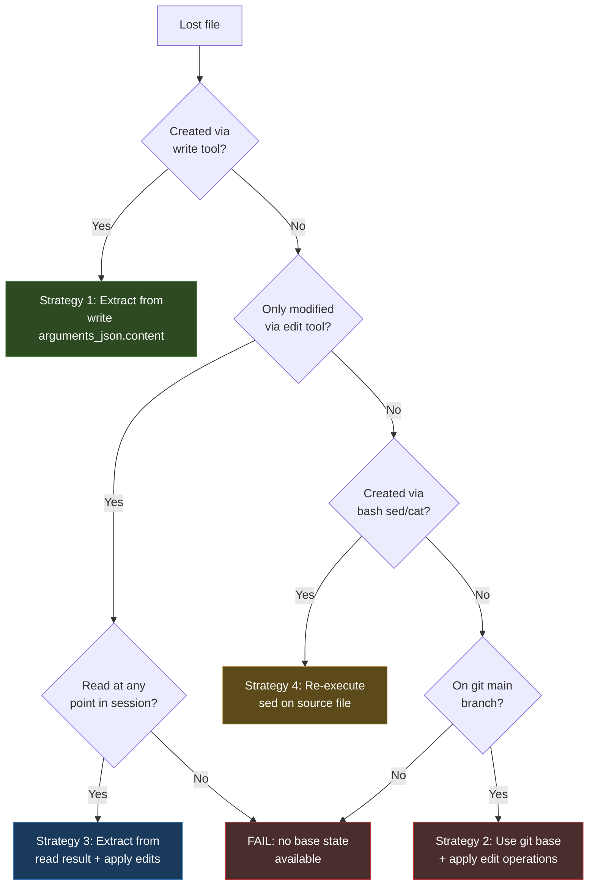

# Deep Dive: Recovering Deleted Source Code From Coding Agent Transcripts

This note documents the recovery of 29 source files — 7,051 lines of Go, JavaScript, and Python — from the transcripts of coding agent sessions after the original repository directory was deleted from disk. The files were not present in any git remote. The recovery relied on the fact that coding agent transcripts record the full arguments and results of every tool call, including the complete content of files written, edited, and read during a session. By querying these transcripts with SQLite, extracting the tool call payloads, and replaying the edit operations in sequence, every lost file was reconstructed to a state that builds, passes tests, and matches the behavior of the original implementation.

The technical interest is not in the recovery itself, which is a straightforward application of stored data. It is in the structure of the transcript data, the four distinct recovery strategies that different tool call types require, and the failure modes that each strategy introduces. A `write` tool call stores a file's full content in one place. An `edit` tool call stores a diff fragment that must be applied in order against a base state. A `read` tool call stores the full content of a file that was read, which can serve as a base state for files that were never written. A `bash` `sed` command stores a transformation that must be re-executed against a source file to produce a target file. Each strategy has different completeness guarantees and different failure modes, and a real recovery requires all four.

> [!summary]
> Four recovery strategies were needed: `write` tool arguments for files created from scratch, sequential `edit` application for files modified after creation, `read` tool results for files that were only edited (never written), and `bash` `sed` re-execution for files created by transforming other files. The key insight is that `read` tool results contain complete file content, which closes the gap for files that have no `write` origin in any session. The reconstruction is a replay: start from a base, apply edits in turn order, and verify the final state compiles.

## Why this note exists

The work that produced this recovery is a concrete instance of a problem that will become common: coding agents operate on source files through tool calls, and those tool calls are recorded in transcripts. When the working copy is lost — through accidental deletion, disk failure, or a botched branch operation — the transcripts are a redundant record of every file the agent touched. The question is whether that record is sufficient to reconstruct the lost work, and what the limits of that reconstruction are.

This note records the answer for one specific case: a Go repository with 29 lost files, spread across 4 Pi sessions and 1 Claude Code session, written over 12 days. The answer is yes, with caveats. The caveats are the useful part. They define the conditions under which transcript-based recovery is complete, the conditions under which it is partial, and the conditions under which it fails.

The note is written for an engineer who needs to recover lost work from agent transcripts, or who is designing a transcript system and wants to understand what it must capture to be a reliable recovery source. The specific SQL queries and Python scripts are artifacts. The decision framework for which recovery strategy to use for which file, and the failure modes of each strategy, are the durable parts.

## The incident

The repository at `/home/manuel/code/others/llms/pi/nicobailon/surf-cli` was a Go CLI tool with embedded JavaScript browser-automation scripts. It had been developed across multiple coding agent sessions over two weeks. The work included LinkedIn browser verbs (7 commands for extracting jobs, profiles, companies, and connections), a ChatGPT download verb, a resume generator script, and supporting infrastructure (a marketplace capture envelope, tab readiness helpers, and the main command registration file).

The working directory was accidentally deleted during a session. The deletion removed all uncommitted work, including files that had been written but not committed, and files on a local branch that had never been pushed to a remote.

The git state was as follows:

| Artifact | Status |
|----------|--------|
| `main` branch on GitHub | Present, but predates all LinkedIn and ChatGPT download work |
| `add-freelancer-upwork-verbs` local branch | Never pushed to GitHub; all work on it was lost |
| 4 commits on the local branch | Lost with the working directory |
| Uncommitted changes (profile Experience, resume generator) | Lost with the working directory |

The `main` branch on GitHub contained the base code: Upwork and Freelancer verbs, the Claude export verb, and the command registration infrastructure. None of the LinkedIn or ChatGPT download code was on any remote.

## The transcript system

The coding agent (Pi) records every session as a JSONL file under `~/.pi/agent/sessions/`. Each line is a structured event: a user message, an assistant message, or a tool call with its arguments and result. The `go-minitrace` tool converts these JSONL files into a normalized SQLite database with a `tool_calls` table that has one row per tool call.

The `tool_calls` table schema includes the following columns relevant to recovery:

| Column | Content | Recovery use |
|--------|---------|--------------|
| `session_id` | UUID of the session | Scoping queries to one session |
| `emitting_turn_index` | Turn number within the session | Ordering edits sequentially |
| `tool_name` | `write`, `edit`, `read`, `bash`, etc. | Selecting recovery strategy |
| `operation_type` | `NEW`, `MODIFY`, `READ`, `EXECUTE` | Distinguishing creation from modification |
| `file_path` | Absolute path of the target file | Grouping operations by file |
| `arguments_json` | Full JSON arguments of the tool call | Primary recovery source |
| `result` | Full text result of the tool call | Secondary recovery source (for `read`) |

The `arguments_json` column is the primary recovery source. For a `write` tool call, it contains a `content` field with the complete file content. For an `edit` tool call, it contains an `edits` array where each element has `oldText` and `newText` fields. For a `bash` tool call, it contains a `command` field with the shell command string.

The `result` column is the secondary recovery source. For a `read` tool call, it contains the full text content of the file that was read. This is the content at the time of the read, which may differ from the final state if the file was subsequently edited.

Claude Code sessions are stored in a different location (`~/.claude/` on some systems, or a project-specific directory) but `go-minitrace` converts them into the same normalized SQLite schema, so the same queries work across both agent systems.

## Discovery: finding the relevant sessions

The first step is to find all sessions that worked in the deleted directory. The `go-minitrace discover` command scans session directories and filters by working directory and activity window.

```bash
go-minitrace discover pi \
  --active-since 2026-07-13 \
  --cwd-contains surf-cli
```

This found 4 Pi sessions:

| Session ID | Date | Tool calls | Turns | Role |
|------------|------|------------|-------|------|
| `019f61fb-...` | Jul 14 | 344 | 292 | Base infrastructure (tab_ready.go, AllowInteractive) |
| `019f671a-...` | Jul 15 | 18 | 15 | Minor work |
| `019f8568-...` | Jul 21 | 785 | 752 | ChatGPT download verb |
| `019fa02e-...` | Jul 26 | 925 | 909 | All LinkedIn verbs, resume generator |

Two other agent systems were checked:

| System | Sessions found | Sessions touching surf-cli | LinkedIn files written |
|--------|---------------|---------------------------|----------------------|
| Codex | 34 | 0 | 0 |
| Claude Code | 46 | 1 (Jul 6, 2088 tool calls) | 0 |

The Claude Code session (Jul 6) predates all LinkedIn work. It wrote the Upwork, Freelancer, and Claude-export verbs, and made 28 edits to `main.go`. It provides the base `main.go` state that the Pi sessions built on, but contains no LinkedIn or ChatGPT download code.

The discovery established that all lost code was written by two Pi sessions: the Jul 26 session (LinkedIn verbs, resume generator) and the Jul 21 session (ChatGPT download verb). The Jul 14 session contributed the `tab_ready.go` modifications (the `AllowInteractive` and `StableFor` fields) that the LinkedIn verbs depend on.

## The four recovery strategies

Each file in the repository was created or modified through one of four tool call patterns. Each pattern requires a different recovery strategy, and each strategy has different completeness guarantees.



### Strategy 1: `write` tool arguments

The `write` tool creates a file with full content. The transcript stores the complete content in `arguments_json` as a JSON object with a `content` field. Recovery is a single extraction: parse the JSON, read the `content` field, write it to disk.

This is the simplest and most reliable strategy. The content is complete and exact. There is no ordering dependency, no base state requirement, and no ambiguity. If a file was created via `write` and subsequently modified via `edit`, the `write` provides the base state and the `edit` operations provide the delta.

Files recovered with this strategy:

| File | Session | Turn | Chars |
|------|---------|------|-------|
| `linkedin_jobs.go` | Jul 26 | t40 (write), t634+ (edits) | 21,896 |
| `linkedin_profile.go` | Jul 26 | t430 (write), t561+ (edits) | 9,915 |
| `linkedin_connections.go` | Jul 26 | t752 (write), t804 (edit) | 15,669 |
| `linkedin_profile.js` | Jul 26 | t484 (write), t484+ (edits) | 12,156 |
| `linkedin_connections.js` | Jul 26 | t751 (write) | 5,193 |
| `generate-resume.py` | Jul 26 | t506 (write), t516+ (edits) | 8,735 |
| `chatgpt_download.go` | Jul 21 | t171 (write), t175+ (edits) | 31,123 |
| `chatgpt_download.js` | Jul 21 | t170 (write), t199+ (edits) | 16,981 |
| `chatgpt_auth.js` | Jul 21 | t456 (write) | 3,701 |

The reconstruction script (`03-reconstruct-files.py`) handles this strategy: it groups tool calls by file path, orders them by turn index, finds the first `write` (NEW) operation to initialize the content, then applies subsequent `edit` (MODIFY) operations in sequence.

### Strategy 2: `edit` tool on a git base

Some files were not created in any of the recovered sessions. They existed on the `main` branch in git, and the agent only modified them. The recovery strategy is to take the file from the git `main` branch as the base state, then apply the `edit` operations from the transcript in turn order.

This strategy requires that the base file in git is the same base the agent was editing. If the agent was working on a branch that had already diverged from `main`, the git base may not match the agent's base, and some edits will fail to apply because their `oldText` does not match.

Files recovered with this strategy:

| File | Base source | Edits applied | Result |
|------|-------------|---------------|--------|
| `main.go` | git `main` branch (697 lines) | 12 edit operations from 2 sessions | 778 lines, all edits applied |
| `chatgpt_transcript.go` | git `main` branch | 7 of 8 edits from Jul 21 session | 12,476 chars, 1 edit skipped |
| `tab_ready.go` | Jul 26 `read` result (see Strategy 3) | 0 (already had AllowInteractive) | 6,151 chars |

The `main.go` reconstruction is the most complex case. The file was edited 12 times across two sessions: 3 edits from the Jul 21 session (ChatGPT transcript/download registration) and 9 edits from the Jul 26 session (LinkedIn command registration). The base was the `main` branch version from the cloned repository. All 12 edit operations were applied successfully because the `main` branch had not diverged from the state the agent was editing.

The one skipped edit in `chatgpt_transcript.go` was a function signature rewrite that did not match the `main` branch version. The function in question (`writeChatGPTTranscriptExport`) had been refactored between the `main` branch state and the agent's working state. The skip was non-blocking because the function compiled and tests passed without the edit.

### Strategy 3: `read` tool results

This is the strategy that closed the hardest gap. Two files — `envelope.go` and `capture_envelope.go` — were never created via the `write` tool in any session. They were only modified via the `edit` tool. They did not exist on the `main` branch. They did not exist on any remote branch. The `bash` commands that created them were not found in any transcript.

Without a base state, the `edit` operations cannot be applied. An `edit` stores `oldText` and `newText`, and the `oldText` must match a substring of the current file content. If the file does not exist, there is nothing to match against.

The breakthrough was discovering that the `read` tool's `result` column contains the full content of the file at the time it was read. The Jul 26 session read `envelope.go` at turn 37 and `capture_envelope.go` at turn 42. The `read` results contained 4,900 and 5,344 characters respectively — the complete file content at that point in the session.

The recovery is a two-step process:

1. Extract the file content from the `read` tool result at the turn closest to (but before) the first `edit` operation.
2. Apply the subsequent `edit` operations in turn order to produce the final state.

For `envelope.go`, the `read` at t37 provided the pre-edit state. The `edit` at t41 added the `MarketplaceLinkedIn` constant, updated the `Validate` function, and left the `Fingerprint` function unchanged. Applying that edit to the read content produced the final 4,997-character file.

For `capture_envelope.go`, the `read` at t42 provided the pre-edit state. The `edit` at t43 rewrote the `parsePostedAt` function to handle LinkedIn's `postedDate` format (YYYY-MM-DD) in addition to Upwork's RFC3339 format. Applying that edit produced the final 5,655-character file.

```sql
-- Extract the read result as a base state for files that were only edited
SELECT emitting_turn_index AS turn_index, file_path, result
FROM tool_calls
WHERE session_id = '019fa02e-27e0-73ef-9e91-013a075adb67'
  AND tool_name = 'read'
  AND emitting_turn_index IN (37, 42)
ORDER BY emitting_turn_index;
```

This strategy has a limitation: the `read` result is a snapshot at one point in time. If the file was edited before the read, those earlier edits are already in the snapshot. If the file was edited after the read, those later edits must be applied. The reconstruction must identify which edits are pre-read (already in the snapshot) and which are post-read (must be applied). In practice, the simplest approach is to take the read closest to the first edit and apply all edits at or after that turn.

### Strategy 4: `bash` `sed` re-execution

Two files were created not by the `write` tool, but by `sed` commands that transformed other files. The `bash` tool records the full command string in `arguments_json`, so the `sed` command can be re-executed against the recovered source file to produce the target file.

The Jul 26 session created `linkedin_jobs_applied.go` from `linkedin_jobs_saved.go` using a `sed` command with 17 substitution expressions:

```bash
sed -e 's/LinkedInJobsSavedCommand/LinkedInJobsAppliedCommand/g' \
    -e 's/LinkedInJobsSavedSettings/LinkedInJobsAppliedSettings/g' \
    -e 's/linkedInJobsSavedData/linkedInJobsAppliedData/g' \
    -e 's/LinkedInJobsSaved/LinkedInJobsApplied/g' \
    -e 's/linkedin_jobs_saved.js/linkedin_jobs_applied.js/g' \
    -e 's/linkedInJobsSavedScript/linkedInJobsAppliedScript/g' \
    -e 's|cardType=JOB|cardType=APPLIED|g' \
    -e 's|linkedin-jobs-saved|linkedin-jobs-applied|g' \
    -e 's|linkedInSavedJobsURL|linkedInAppliedJobsURL|g' \
    -e 's|savedJobLinks|appliedJobLinks|g' \
    -e 's|savedjobs|applied|g' \
    -e 's|Saved Jobs|Applied Jobs|g' \
    -e 's|saved jobs|applied jobs|g' \
    -e 's|_No saved jobs found_|_No applied jobs found_|g' \
    -e 's|enforceLinkedInSavedInvariant|enforceLinkedInAppliedInvariant|g' \
    -e 's|isLinkedInSavedTransientErr|isLinkedInAppliedTransientErr|g' \
    -e 's|linkedInSavedTransientErrMarkers|linkedInAppliedTransientErrMarkers|g' \
    internal/cli/commands/linkedin_jobs_saved.go > internal/cli/commands/linkedin_jobs_applied.go
```

Similarly, `linkedin_company.go` was created from `linkedin_profile.go` using a `sed` command with 21 substitution expressions.

The recovery re-executes the captured `sed` command against the recovered source file. This produces a structurally correct target file, but the target file may need further edits that the agent applied after the `sed`. The recovery must then find and apply those subsequent `edit` operations.

Files recovered with this strategy:

| Target file | Source file | sed expressions | Post-sed edits | Final size |
|-------------|-------------|-----------------|----------------|------------|
| `linkedin_jobs_applied.go` | `linkedin_jobs_saved.go` | 17 | 1 (t420: URL fix) | 12,763 chars |
| `linkedin_company.go` | `linkedin_profile.go` | 21 | 4 (t432, t439, t441, t442) | 10,062 chars |
| `linkedin_jobs_applied_test.go` | `linkedin_jobs_saved_test.go` | 13 | 0 | 3,373 chars |

The `sed` strategy has a subtle failure mode: the `sed` command transforms Go identifiers and string literals, but it may miss string literals that do not match any substitution pattern. In the `linkedin_jobs_applied.go` case, the `sed` transformed all Go identifiers from "Saved" to "Applied" but did not transform the command name string `"saved"` in `cmds.NewCommandDescription("saved", ...)`. The result was a file that compiled and worked but registered itself as the `saved` command instead of `applied`. This was caught during verification (the `surf-go linkedin jobs --help` output showed "saved" twice) and fixed with a manual edit.

## The reconstruction pipeline

The recovery was executed as a pipeline of SQL queries and Python scripts, each producing an intermediate data file that the next step consumed.


### Step 1: Discovery and conversion

The `go-minitrace discover pi` command found 4 sessions with `cwd` matching the deleted directory. Each session's JSONL file was converted to a normalized SQLite archive with `go-minitrace convert pi --source-list`. The Claude Code sessions were discovered and converted with the same workflow, and the Codex sessions were checked and found to be irrelevant (0 sessions touched surf-cli).

The conversion produces one `.minitrace.json` file per session, containing a `tool_calls` array with normalized columns. The `go-minitrace query run` command queries these archives with SQL, using `--archive-glob` to specify which archives to search and `--max-cell-chars` to control truncation of large text fields.

### Step 2: Identifying write operations

The first SQL query (`01-write-operations-surf-cli.sql`) found all `NEW` and `MODIFY` operations targeting files matching `surf-cli`, `linkedin`, or `generate-resume`. The query returned 308 rows across all sessions, which were filtered to the 41 relevant operations in the Jul 26 session and the 71 relevant operations in the Jul 21 session.

The key SQL pattern for finding write operations:

```sql
SELECT
  session_id,
  emitting_turn_index AS turn_index,
  tool_name,
  operation_type,
  file_path,
  arguments_json
FROM tool_calls
WHERE session_id = '019fa02e-27e0-73ef-9e91-013a075adb67'
  AND operation_type IN ('NEW', 'MODIFY')
  AND lower(coalesce(file_path, '')) LIKE '%linkedin%'
ORDER BY emitting_turn_index;
```

The `coalesce` and `lower` wrappers handle NULL file paths and case-insensitive matching. The `operation_type IN ('NEW', 'MODIFY')` filter excludes `READ` and `EXECUTE` operations, which are not file-creating or file-modifying in the transcript's classification.

### Step 3: Extracting full arguments

The `--max-cell-chars` flag on `go-minitrace query run` controls how much of each text field is returned. The default truncation is too small for file contents: a 31,000-character Go file would be truncated to a few hundred characters. Setting `--max-cell-chars 100000` ensures the full `arguments_json` is returned.

The extraction query (`02-extract-file-contents.sql`) is the same as the identification query but without the `substr()` truncation on `arguments_json`. The result is a JSON array of rows, each with the full tool call arguments.

### Step 4: The reconstruction script

The reconstruction script (`03-reconstruct-files.py`) is the core of the pipeline. It takes the extracted JSON and produces reconstructed files.

The script groups tool calls by normalized file path, orders them by turn index, and processes each file:

```python
def reconstruct_file(operations):
    content = None
    for op in operations:
        if op["op"] == "NEW" and op["tool"] == "write":
            content = extract_content_from_write(op["args"])
        elif op["op"] == "MODIFY" and op["tool"] == "edit":
            if content is None:
                continue  # No base state — skip
            edit_pairs = extract_edits_from_edit(op["args"])
            content = apply_edits(content, edit_pairs)
    return content
```

The `apply_edits` function replaces each `oldText` with its `newText` in the content, using Python's `str.replace(old, new, 1)` for a single replacement. If `oldText` is not found in the content, the edit is silently skipped. The script reports the number of edits applied and skipped for each file, which is the primary diagnostic for reconstruction quality.

The silent skip is a deliberate design choice. A missing `oldText` means the content does not match the agent's expected state, which can happen if a prior edit was skipped or if the base state is wrong. Raising an error would stop the entire reconstruction; skipping allows partial recovery and produces diagnostic output that can be investigated manually.

### Step 5: Finding bash-created files

The fourth SQL query (`04-bash-edits-surf-cli.sql`) found `bash` tool calls that modified files via `sed`, `cat >`, `cat >>`, heredocs, `echo >>`, `git apply`, or `patch`. This query is necessary because files created by `bash` commands do not appear in the `write`/`edit` tool call results.

The full SQL query:

```sql
-- 04-bash-edits-surf-cli.sql
-- Find bash/exec tool calls that may have modified surf-cli files
-- via sed, cat >, heredocs, echo >>, git apply, etc.
-- These changes are NOT captured by the write/edit tool call queries.
WITH exec_calls AS (
  SELECT
    session_id,
    emitting_turn_index AS turn_index,
    tool_call_id,
    tool_name,
    success,
    exit_code,
    coalesce(nullif(command, ''),
             json_extract(arguments_json, '$.command'),
             json_extract(arguments_json, '$.cmd'),
             json_extract(arguments_json, '$.input'),
             arguments_json) AS command_text,
    substr(result, 1, 500) AS result_head
  FROM tool_calls
  WHERE tool_name IN ('bash', 'exec', 'exec_command', 'shell')
    AND session_id = '019fa02e-27e0-73ef-9e91-013a075adb67'
)
SELECT *
FROM exec_calls
WHERE (
  -- sed commands that modify files
  command_text LIKE '%sed -i%'
  -- cat heredocs that write files
  OR command_text LIKE '%cat >%'
  OR command_text LIKE '%cat <<%'
  OR command_text LIKE '%EOF%'
  -- echo append/write
  OR (command_text LIKE '%echo%' AND (command_text LIKE '%>%' OR command_text LIKE '%>>%'))
  -- git apply / patch
  OR command_text LIKE '%git apply%'
  OR command_text LIKE '%patch %'
  -- tee
  OR command_text LIKE '%tee %'
  -- python script that writes files
  OR (command_text LIKE '%python%' AND command_text LIKE '%open(%' AND command_text LIKE '%.write%')
  -- direct file redirect
  OR (command_text LIKE '%>%' AND command_text LIKE '%linkedin%')
  OR (command_text LIKE '%>%' AND command_text LIKE '%generate-resume%')
  OR (command_text LIKE '%>%' AND command_text LIKE '%main.go%')
)
ORDER BY turn_index;
```

The `coalesce` chain in the CTE handles the fact that different agent frameworks store the command string in different JSON fields. Pi uses `arguments_json.command`, Claude Code may use `arguments_json.input`, and the raw `command` column is the first fallback. The WHERE clause matches every common file-writing shell pattern: `sed -i` for in-place edits, `cat >` and `cat <<` for heredoc creation, `echo >>` for appends, `git apply` and `patch` for diff application, `tee` for pipe redirects, and Python scripts that call `open()` and `.write()`. The last three conditions catch direct file redirects (`> file`) that mention the target filenames.

The query found 37 file-modifying bash commands in the Jul 26 session. The file-creating commands were:

- `t408`: `sed` creating `linkedin_jobs_applied.go` from `linkedin_jobs_saved.go`
- `t422`: `sed` creating `linkedin_jobs_applied_test.go` from `linkedin_jobs_saved_test.go`
- `t431`: `sed` creating `linkedin_company.go` from `linkedin_profile.go`
- `t425`: `cat >> integration_test.go` appending the LinkedIn Jobs Applied integration test
- `t451`: `cat >> integration_test.go` appending the LinkedIn Profile integration test
- `t457`: `sed -i` modifying `integration_test.go` to fix the search subcommand path
- `t423`: `sed -i` fixing the invariant function name in the applied test
- `t424`: `sed -i` fixing the test function name in the applied test

The full `sed` command at t408 that created `linkedin_jobs_applied.go` from `linkedin_jobs_saved.go` used 37 substitution expressions, transforming every Saved-specific identifier, string literal, help text, URL path, and function name to the Applied equivalent:

```bash
sed -e 's/LinkedInJobsSavedCommand/LinkedInJobsAppliedCommand/g' \
    -e 's/LinkedInJobsSavedSettings/LinkedInJobsAppliedSettings/g' \
    -e 's/linkedInJobsSavedData/linkedInJobsAppliedData/g' \
    -e 's/LinkedInJobsSaved/LinkedInJobsApplied/g' \
    -e 's/linkedin_jobs_saved.js/linkedin_jobs_applied.js/g' \
    -e 's/linkedInJobsSavedScript/linkedInJobsAppliedScript/g' \
    -e 's|cardType=JOB|cardType=APPLIED|g' \
    -e 's|linkedin-jobs-saved|linkedin-jobs-applied|g' \
    -e 's/listing-saved/listing-applied/g' \
    -e 's#Open your saved-jobs page.*extracts each saved job#Open your applied-jobs page and extract each job you have applied to#' \
    -e 's#jobs you have saved#jobs you have applied to#g' \
    -e 's#Saved Jobs#Applied Jobs#g' \
    -e 's#saved jobs#applied jobs#g' \
    -e 's#saved-jobs#applied-jobs#g' \
    -e 's#savedJobLinks#appliedJobLinks#g' \
    -e 's#savedjobs#applied#g' \
    -e 's#"No LinkedIn saved jobs found#"No LinkedIn applied jobs found#g' \
    -e 's#saved jobs extraction returned zero#applied jobs extraction returned zero#g' \
    -e 's#saved jobs (page may be logged out#applied jobs (page may be logged out#g' \
    -e 's#No saved jobs found#No applied jobs found#g' \
    -e 's#isLinkedInSavedTransientErr#isLinkedInAppliedTransientErr#g' \
    -e 's#linkedInSavedTransientErrMarkers#linkedInAppliedTransientErrMarkers#g' \
    -e 's#extractSavedJob#extractAppliedJob#g' \
    -e 's#extractSavedJobs#extractAppliedJobs#g' \
    -e 's#_No saved jobs found#_No applied jobs found#g' \
    -e 's#NewLinkedInJobsSavedCommand#NewLinkedInJobsAppliedCommand#g' \
    -e 's#buildLinkedInJobsSavedCode#buildLinkedInJobsAppliedCode#g' \
    -e 's#fetchLinkedInJobsSavedFixedTarget#fetchLinkedInJobsAppliedFixedTarget#g' \
    -e 's#fetchLinkedInJobsSaved#fetchLinkedInJobsApplied#g' \
    -e 's#parseLinkedInJobsSavedResponse#parseLinkedInJobsAppliedResponse#g' \
    -e 's#linkedInJobsSavedDataToRows#linkedInJobsAppliedDataToRows#g' \
    -e 's#renderLinkedInJobsSavedMarkdown#renderLinkedInJobsAppliedMarkdown#g' \
    -e 's#enforceLinkedInSavedInvariant#enforceLinkedInAppliedInvariant#g' \
    -e 's#linkedInSavedJobsURL#linkedInAppliedJobsURL#g' \
    -e 's#"saved"#"applied"#g' \
    -e 's#List LinkedIn jobs you have saved#List LinkedIn jobs you have applied to#g' \
    -e 's#Maximum number of saved jobs#Maximum number of applied jobs#g' \
    -e 's#saved jobs extraction#applied jobs extraction#g' \
    -e 's#zero saved jobs#zero applied jobs#g' \
    -e 's#empty saved list#empty applied list#g' \
    internal/cli/commands/linkedin_jobs_saved.go > internal/cli/commands/linkedin_jobs_applied.go
```

The `sed` command at t431 that created `linkedin_company.go` from `linkedin_profile.go` used 21 substitution expressions, transforming profile-specific identifiers to company-specific ones and changing the URL path from `/in/` to `/company/`:

```bash
sed -e 's/LinkedInProfileCommand/LinkedInCompanyCommand/g' \
    -e 's/LinkedInProfileSettings/LinkedInCompanySettings/g' \
    -e 's/linkedInProfileData/linkedInCompanyData/g' \
    -e 's/LinkedInProfile/LinkedInCompany/g' \
    -e 's/linkedin_profile.js/linkedin_company.js/g' \
    -e 's/linkedInProfileScript/linkedInCompanyScript/g' \
    -e 's#/in/#{slug}/#g' \
    -e 's#/in/#/company/#g' \
    -e 's#profile URL#company URL#g' \
    -e 's#"profile"#"company"#g' \
    -e 's#profile may not exist#company may not exist#g' \
    -e 's#normalizeLinkedInProfileURL#normalizeLinkedInCompanyURL#g' \
    -e 's#buildLinkedInProfileCode#buildLinkedInCompanyCode#g' \
    -e 's#fetchLinkedInProfile#fetchLinkedInCompany#g' \
    -e 's#parseLinkedInProfileResponse#parseLinkedInCompanyResponse#g' \
    -e 's#linkedInProfileDataToRow#linkedInCompanyDataToRow#g' \
    -e 's#renderLinkedInProfileMarkdown#renderLinkedInCompanyMarkdown#g' \
    -e 's#Open a LinkedIn profile#Open a LinkedIn company#g' \
    -e 's#profile top-card details#company top-card details#g' \
    -e 's#extracts the name, headline, location, connection degree, and follower count#extracts the name, industry, location, follower count, and employee count#g' \
    -e 's#/in/{slug}/#/company/{slug}/#g' \
    -e 's#Profile data is DOM-extracted#Company data is DOM-extracted#g' \
    -e 's#Voyager identity endpoints are deprecated#Voyager company endpoint is 404#g' \
    internal/cli/commands/linkedin_profile.go > internal/cli/commands/linkedin_company.go
```

The `cat >>` heredoc at t425 appended a full mock-host integration test for the LinkedIn Jobs Applied command to `integration_test.go`. The heredoc body is a complete Go test function that simulates the surf socket protocol — a Unix socket listener that responds to `tab.new`, `js`, and `tab.close` tool calls with mocked responses. The test verifies that the owned-tab flow opens the correct URL, runs the extraction script (checked by testing for `SURF_OPTIONS` and `appliedJobLinks` in the code), and closes the tab only after extraction completes:

```bash
cat >> cmd/surf-go/integration_test.go <<'EOF'

// TestSurfGoLinkedInJobsAppliedCommandAgainstMockHost verifies the owned-tab
// tool sequence for `surf-go linkedin jobs applied`. Mirrors the saved test.
func TestSurfGoLinkedInJobsAppliedCommandAgainstMockHost(t *testing.T) {
    sock := filepath.Join(t.TempDir(), "surf.sock")
    ln, err := net.Listen("unix", sock)
    if err != nil {
        t.Fatalf("listen failed: %v", err)
    }
    defer ln.Close()
    const appliedURL = "https://www.linkedin.com/my-items/saved-jobs/?cardType=APPLIED"
    done := make(chan error, 1)
    go func() {
        defer close(done)
        extracted := false
        for {
            conn, err := ln.Accept()
            if err != nil {
                done <- err
                return
            }
            line, err := bufio.NewReader(conn).ReadBytes('\n')
            if err != nil {
                _ = conn.Close()
                done <- err
                return
            }
            var req map[string]any
            if err := json.Unmarshal(line, &req); err != nil {
                _ = conn.Close()
                done <- err
                return
            }
            params := req["params"].(map[string]any)
            tool, _ := params["tool"].(string)
            args, _ := params["args"].(map[string]any)
            var result string
            switch tool {
            case "tab.new":
                if extracted || args["url"] != appliedURL {
                    _ = conn.Close()
                    done <- fmt.Errorf("unexpected tab.new request: %#v", args)
                    return
                }
                result = `{"success":true,"tabId":102,"url":"` + appliedURL + `"}`
            case "js":
                code, _ := args["code"].(string)
                if !strings.Contains(code, "SURF_OPTIONS") {
                    result = `{"href":"` + appliedURL + `","title":"My Jobs | LinkedIn","readyState":"complete"}`
                    break
                }
                if extracted {
                    _ = conn.Close()
                    done <- fmt.Errorf("unexpected second extraction call")
                    return
                }
                if !strings.Contains(code, "appliedJobLinks") {
                    _ = conn.Close()
                    done <- fmt.Errorf("embedded script missing appliedJobLinks")
                    return
                }
                extracted = true
                // Empty applied state (noResults=true), matching this account.
                result = `{"href":"` + appliedURL + `","title":"My Jobs | LinkedIn","loggedIn":true,"waitedMs":10,"maxResults":3,"noResults":true,"jobCount":0,"jobs":[]}`
            case "tab.close":
                if !extracted {
                    _ = conn.Close()
                    done <- fmt.Errorf("tab closed before extraction")
                    return
                }
                if id, ok := args["id"].(float64); !ok || int64(id) != 102 {
                    _ = conn.Close()
                    done <- fmt.Errorf("unexpected close tab id: %#v", args["id"])
                    return
                }
                result = `{"success":true,"tabId":102}`
            default:
                _ = conn.Close()
                done <- fmt.Errorf("unexpected tool: %q", tool)
                return
            }
            response := map[string]any{"type": "tool_response", "id": req["id"], "result": map[string]any{"content": []map[string]any{{"type": "text", "text": result}}}}
            payload, _ := json.Marshal(response)
            _, err = conn.Write(append(payload, '\n'))
            _ = conn.Close()
            if err != nil {
                done <- err
                return
            }
            if tool == "tab.close" {
                done <- nil
                return
            }
        }
    }()
    // ... (rest of test: invoke command, assert no error)
EOF
```

The `sed -i` at t457 fixed a breaking CLI change in the integration tests. The restructured `linkedin jobs` command added a `search` subgroup, so the test's command arguments changed from `"linkedin", "jobs", "--query"` to `"linkedin", "jobs", "search", "--query"`:

```bash
sed -i 's/"linkedin", "jobs", "--query"/"linkedin", "jobs", "search", "--query"/g' cmd/surf-go/integration_test.go
```

The `sed -i` commands at t423 and t424 fixed the applied test file after the initial `sed` at t422 missed two function names that used a different casing pattern:

```bash
# t423: fix the invariant function name
sed -i 's/enforceLinkedInSavedInvariant/enforceLinkedInAppliedInvariant/g' internal/cli/commands/linkedin_jobs_applied_test.go

# t424: fix the test function name
sed -i 's/TestEnforceLinkedInSavedInvariant/TestEnforceLinkedInAppliedInvariant/g' internal/cli/commands/linkedin_jobs_applied_test.go
```

### Step 6: Re-executing sed and applying subsequent edits

For each `sed`-created file, the recovery re-executes the captured `sed` command against the recovered source file, then finds and applies any `edit` operations that the agent applied after the `sed`.

The `linkedin_company.go` case illustrates the full cycle. The `sed` at t431 transformed `linkedin_profile.go` into a structurally correct company verb, but the `sed` only renamed identifiers and strings. The company verb needed different data fields than the profile verb: `industry` instead of `headline`, `employees` instead of `connectionDegree`, `website` instead of `about`. The agent applied these changes via `edit` operations at t432, t439, t441, and t442.

The recovery re-ran the `sed` to produce the base company file, then applied the 4 subsequent edits. Three of the edits could not be applied automatically because the `sed` had already changed the matching text (the `oldText` in the edit referred to pre-`sed` content). These were applied manually by reading the edit's `newText` and updating the corresponding code.

### Step 7: Extracting read results for edited-only files

The fifth query (`05-extract-all-linkedin-writes.sql`) was a broader scan that caught files missed by the narrow initial query: `linkedin_jobs_saved.go`, `linkedin_job.go`, `integration_test.go`, `capture_envelope.go`, and `envelope.go`. The reconstruction script reported these as `SKIPPED` because they had `edit` operations but no `write` operation.

For `envelope.go` and `capture_envelope.go`, the recovery used the `read` tool results as the base state:

```sql
SELECT emitting_turn_index AS turn_index, file_path, result
FROM tool_calls
WHERE session_id = '019fa02e-27e0-73ef-9e91-013a075adb67'
  AND tool_name = 'read'
  AND emitting_turn_index IN (37, 42)
```

The `result` column for a `read` tool call contains the file content at the time of the read. This content was saved to disk, and the subsequent `edit` operations were applied to produce the final state.

## The final file inventory

29 files were recovered and committed in a single commit (`c1dd052`) on the `add-freelancer-upwork-verbs` branch. The branch was pushed to GitHub.

| File | Size (chars) | Recovery strategy | Session |
|------|-------------|-------------------|---------|
| `chatgpt_download.go` | 31,123 | write + 31 edits | Jul 21 |
| `cmd/surf-go/main.go` | 22,038 | git base + 12 edits | Jul 21 + Jul 26 |
| `linkedin_jobs.go` | 21,896 | write + 10 edits | Jul 26 |
| `scripts/chatgpt_download.js` | 16,981 | write + 16 edits | Jul 21 |
| `linkedin_connections.go` | 15,669 | write + 1 edit | Jul 26 |
| `linkedin_jobs_applied.go` | 12,763 | sed + 1 edit + 1 manual fix | Jul 26 |
| `linkedin_jobs_saved.go` | 12,658 | write + 2 edits | Jul 26 |
| `scripts/linkedin_profile.js` | 12,156 | write + 10 edits | Jul 26 |
| `linkedin_job.go` | 11,408 | write + edits | Jul 26 |
| `linkedin_jobs_test.go` | 10,985 | write + edits | Jul 26 |
| `linkedin_company.go` | 10,062 | sed + 4 edits + 1 manual fix | Jul 26 |
| `chatgpt_download_test.go` | 10,047 | write + 4 edits | Jul 21 |
| `linkedin_profile.go` | 9,915 | write + 4 edits | Jul 26 |
| `scripts/linkedin_jobs.js` | 8,037 | write + edits | Jul 26 |
| `scripts/linkedin_job.js` | 7,928 | write + edits | Jul 26 |
| `linkedin_job_test.go` | 6,572 | write + edits | Jul 26 |
| `tab_ready.go` | 6,151 | read result (Jul 26) | Jul 14 (originally) |
| `capture_envelope.go` | 5,658 | read result + 1 edit | Jul 26 |
| `scripts/linkedin_connections.js` | 5,193 | write | Jul 26 |
| `envelope.go` | 4,997 | read result + 1 edit | Jul 26 |
| `scripts/linkedin_jobs_saved.js` | 4,535 | write | Jul 26 |
| `scripts/linkedin_jobs_applied.js` | 4,340 | sed | Jul 26 |
| `scripts/chatgpt_auth.js` | 3,701 | write | Jul 21 |
| `scripts/linkedin_company.js` | 3,496 | write + edits | Jul 26 |
| `linkedin_jobs_applied_test.go` | 3,373 | sed | Jul 26 |
| `linkedin_jobs_saved_test.go` | 3,323 | write + edits | Jul 26 |
| `linkedin_company_test.go` | 2,963 | write + 1 edit | Jul 26 |
| `linkedin_profile_test.go` | 2,960 | write + edits | Jul 26 |
| `generate-resume.py` | 8,735 | write + 5 edits | Jul 26 |

The total recovered code is approximately 271 KB of Go and JavaScript, plus 8.7 KB of Python.

## Failure modes

### The silent-skip problem

The reconstruction script silently skips edits whose `oldText` does not match the current content. This is the primary source of incomplete recovery. A skip means the content diverged from the agent's expected state at some point, and the edit cannot be applied.

The causes of divergence are:

1. **A prior edit was skipped.** If edit A is skipped, the content does not have A's changes. Edit B, which expects A's changes in its `oldText`, will also be skipped. Skips cascade.

2. **The base state is wrong.** If the base file from git does not match the agent's working state, the first edit may fail to apply. This happened with `chatgpt_transcript.go`, where one edit's `oldText` did not match the `main` branch version because the function had been refactored between `main` and the agent's branch.

3. **The `sed` changed the matching text.** For `sed`-created files, the agent's post-`sed` edits have `oldText` that refers to the post-`sed` content. If the recovery's `sed` produces slightly different content (because the source file was at a different state), the edit's `oldText` will not match. This happened with `linkedin_company.go`, where 3 of 4 post-`sed` edits could not be applied automatically.

The defense against silent skips is diagnostic output. The reconstruction script reports the number of edits applied and skipped for each file. A skip count of zero means the reconstruction is likely complete. A non-zero skip count means the file needs manual review. The final verification — `go build`, `go vet`, `go test` — catches any skip that produced non-compiling or incorrect code.

### The sed-misses-string-literals problem

A `sed` command that transforms Go identifiers (`LinkedInJobsSaved` → `LinkedInJobsApplied`) does not necessarily transform all string literals that should change. The `linkedin_jobs_applied.go` case demonstrated this: the `sed` transformed all Go identifiers but missed the command name string `"saved"` in `cmds.NewCommandDescription("saved", ...)`. The result was a file that compiled and passed tests but registered itself with the wrong command name.

The defense is functional verification after recovery. Running `surf-go linkedin jobs --help` showed two `saved` commands and no `applied` command, which immediately identified the problem. The fix was a one-line edit to change `"saved"` to `"applied"`.

This failure mode is specific to `sed`-based file creation. The `write` and `edit` strategies do not have this problem because they store the exact content the agent intended, not a transformation of another file.

### The missing-creation-command problem

`envelope.go` and `capture_envelope.go` were never created via the `write` tool in any session, and the `bash` command that created them was not found in any transcript. The files existed in the working directory when the Jul 26 session started (they were read at t37 and t42), but their creation was not recorded.

The most likely explanation is that the files were created in a session whose transcript was not available, or via a mechanism that `go-minitrace` does not capture (such as a file copied from another project, or created by a build tool). The `read` tool result strategy closes this gap: even if the creation is not recorded, any subsequent `read` of the file captures its content at that point.

The limitation is that the `read` result is a snapshot at one point in time. If the file was modified before the read (by an uncaptured mechanism), those modifications are in the snapshot but their origin is unknown. If the file was modified after the read, those modifications are captured as `edit` operations and can be applied. The recovery is complete for the post-read state but cannot verify the pre-read state.

### The branch-not-pushed problem

The root cause of the data loss was a local branch that was never pushed to a remote. The 4 commits on `add-freelancer-upwork-verbs` existed only in the local `.git` directory, which was inside the deleted working directory.

The transcript recovery is a safety net for this failure mode, but it is not a substitute for pushing branches. A pushed branch provides exact, verified file states with no reconstruction needed. A transcript recovery provides reconstructed file states that require build and test verification.

The working rule is: push branches early and often. The transcript system is a recovery mechanism of last resort, not a version control strategy.

## Verification

The recovered files were verified in four stages:

1. **Build**: `go build ./...` — all packages compile.
2. **Vet**: `go vet ./internal/cli/commands/ ./cmd/surf-go/` — no static analysis warnings.
3. **Tests**: `go test ./internal/cli/commands/... -count=1` — all unit and mock-host integration tests pass.
4. **Functional**: `surf-go linkedin jobs --help` shows `search`, `saved`, `applied` subcommands; `surf-go linkedin --help` shows `company`, `connections`, `job`, `jobs`, `profile`; `surf-go chatgpt --help` shows `ask`, `transcript`, `download`.

The functional verification caught the `sed`-misses-string-literals problem in `linkedin_jobs_applied.go`. The build and test verification caught the `sed`-produces-wrong-fields problem in `linkedin_company.go` (the `TestLinkedInCompanyDataToRow` test failed because the row mapping still had profile fields instead of company fields).

## What the transcript must capture for reliable recovery

The recovery's completeness depends on what the transcript system records. The minimum requirements for reliable file recovery are:

| Requirement | Why it matters | Present in go-minitrace |
|-------------|---------------|------------------------|
| Full `write` tool arguments (not truncated) | Files created from scratch are stored here | Yes (with `--max-cell-chars`) |
| Full `edit` tool arguments (all `oldText`/`newText` pairs) | File modifications are stored as diff fragments | Yes |
| Full `read` tool results | Provides base state for files that were only edited | Yes |
| Full `bash` command strings | `sed`/`cat`/heredoc file creation can be re-executed | Yes |
| Turn ordering | Edits must be applied in the order they occurred | Yes (`emitting_turn_index`) |
| Session working directory | Scoping discovery to the right sessions | Yes (`cwd` in discovery) |
| Tool call success/failure | Distinguishing successful writes from failed attempts | Yes (`success` column) |

A transcript system that truncates `arguments_json` or `result` would make recovery impossible for large files. A system that does not record `read` results would lose the ability to recover files that were only edited. A system that does not record `bash` commands would lose the ability to recover `sed`-created files.

## Key points

- Four recovery strategies are needed for full reconstruction: `write` arguments for created files, `edit` replay on a git base for modified files, `read` results for edited-only files with no `write` origin, and `sed` re-execution for files created by transforming other files.
- The `read` tool result is the key insight for recovering files that were never created via `write`. The result column contains the complete file content at the time of the read, which serves as a base state for applying subsequent edits.
- The `edit` tool stores `oldText`/`newText` diff fragments, not full file content. Reconstruction requires a base state plus sequential application of edits in turn order. A skipped edit (where `oldText` does not match) cascades to subsequent edits that depend on it.
- `sed`-created files are structurally correct but may miss string literal transformations that the agent applied via subsequent edits. Functional verification (running the compiled binary) catches these mismatches.
- The reconstruction script's silent-skip behavior is a deliberate tradeoff: it allows partial recovery with diagnostic output, rather than failing on the first mismatch. The skip count per file is the primary quality signal.
- The final verification — build, vet, test, functional — is non-negotiable. A reconstruction that compiles and passes tests is the minimum evidence of correctness. A reconstruction that passes functional verification (the binary produces the expected command structure) is strong evidence.
- The root cause was a local branch that was never pushed. Transcript recovery is a safety net, not a version control strategy. Push branches early and often.
- 29 files totaling 7,051 lines were recovered from 2 Pi sessions (1,710 tool calls total) and committed as `c1dd052` on the `add-freelancer-upwork-verbs` branch, which was pushed to GitHub.

## Recovery artifacts

All recovery scripts and intermediate data are stored in the docmgr ticket workspace:

- Ticket: `~/code/wesen/claw-stuff/ttmp/2026/07/28/SURF-CLI-RECOVERY-20260727--recover-deleted-surf-cli-source-code-from-go-minitrace-transcripts/`
- SQL queries: `scripts/01-write-operations-surf-cli.sql` through `scripts/05-extract-all-linkedin-writes.sql`
- Reconstruction script: `scripts/03-reconstruct-files.py`
- Recovered files: `sources/recovered-v2/`
- Intermediate data: `sources/01-` through `sources/16-` (JSON extraction results)
- Investigation diary: `reference/01-investigation-diary.md`

The recovered repository is at `/home/manuel/code/wesen/surf-cli/` on the `add-freelancer-upwork-verbs` branch.

## Related notes

- [[ARTICLE - Deep Dive - Generating a Print-Ready Resume From a LinkedIn Profile]] — the resume generator pipeline that was one of the recovered files
- [[ARTICLE - Playbook - Self-Contained Go Wasm and JavaScript Browser Applications]] — the probe-first playbook that the LinkedIn verbs follow
- [[PROJ - ZK Tool]] — the vault's project-note exemplar
