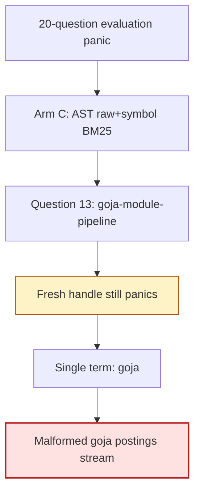

# Zapx: Defensive Varint Decoding for Corrupt Bleve Postings

This report explains a deterministic process crash discovered while evaluating a Bleve index over 44,738 Go source representations. The crash originated in Zapx's in-memory unsigned-varint decoder. One persisted postings stream ended with a continuation byte but no following byte. Zapx indexed past the end of the input slice and panicked instead of reporting truncated data.

The work produced a narrow defensive fix in Zapx, a retained corpus-level reproducer, and a healthy rebuilt index. It did not establish why the original Bleve segment became malformed. That distinction is central to the result: the decoder crash is fixed; the original artifact corruption is isolated and recoverable; the event that created the corrupt bytes remains unproven.

This report extends the rag-ttc architecture and evaluation work indexed by [[rag-ttc]]. The broader system is described in [[ARTICLE - rag-ttc - Architecture of a Reproducible Go RAG Evaluation System]] and [[ARTICLE - rag-ttc - Refactoring Explicit Experiments and Reusable Mechanisms]].

> [!summary]
> - A single lexical term, `goja`, deterministically crashed Bleve while decoding a Zapx postings stream from one immutable index artifact.
> - Rebuilding the lexical index from identical persisted chunks and representations made all 20 evaluation questions pass, proving that the logical source data was intact and that the corruption was specific to the original index artifact.
> - Zapx `v17.1.2` checked for empty input only before entering its varint loop. A continuation byte at the end of a slice caused the next iteration to index beyond the slice boundary.
> - Commit `807a92c` adds an in-loop bounds check and returns `io.ErrUnexpectedEOF`. The original corrupt posting now fails as a normal search error instead of terminating the process.
> - The root cause of the malformed segment remains unknown. The evidence supports defensive decoding and recoverable index rebuilding, not a claim that the writer defect has been identified.

## 1. The failure occurred inside a real retrieval experiment

The failure was discovered in the Go-workspace RAG MVP, not in a synthetic decoder test. The experiment indexed committed Go source from seven repositories:

- `go-go-goja`;
- `goja`;
- `glazed`;
- `researchctl`;
- `geppetto`;
- `scraper`;
- `rag-ttc`.

The structural corpus contained 2,022 admitted files and 22,369 Go declaration chunks. Each declaration produced a raw representation and a deterministic symbol-oriented representation, yielding 44,738 lexical and vector records. OpenAI `text-embedding-3-small` supplied vectors; Bleve supplied BM25; SQLite exact-vector search supplied the semantic channel.

The five-arm evaluation compared:

| Arm | Chunking | Representations | Retrieval |
|---|---|---|---|
| A | Fixed-size | Raw | BM25 |
| B | Go AST | Raw | BM25 |
| C | Go AST | Raw and symbol | BM25 |
| D | Go AST | Raw and symbol | Exact vector |
| E | Go AST | Raw and symbol | Equal-weight RRF |

The first evaluation attempt exposed an independent manifest invariant error and was fixed. The next attempt reached arm C and terminated with:

```text
panic: runtime error: index out of range [4] with length 4

github.com/blevesearch/zapx/v17.(*memUvarintReader).ReadUvarint
    zapx/memuvarint.go:53
github.com/blevesearch/zapx/v17.(*chunkedIntDecoder).readUvarint
    zapx/intDecoder.go:124
github.com/blevesearch/zapx/v17.(*PostingsIterator).readFreqNormHasLocs
    zapx/posting.go:419
```

This stack establishes where the process failed. It does not establish why the decoder received truncated input. The investigation therefore separated four questions:

1. Is every query broken, or only one?
2. Does the failure depend on reusing an index handle?
3. Is one analyzed term responsible?
4. Does rebuilding from identical logical records reproduce the malformed posting?

## 2. Local upstream source was required

The released module sources were initially read from the Go module cache:

```text
github.com/blevesearch/bleve/v2 v2.6.0
github.com/blevesearch/zapx/v17 v17.1.2
```

For source-level debugging, both repositories were cloned into the same multi-repository workspace:

```text
/home/manuel/workspaces/2026-06-30/benchmark-cpu-inference/
├── bleve/    # d8f2ab9, tag v2.6.0
├── zapx/     # 5688d89, tag v17.1.2
└── rag-ttc/
```

The top-level `go.work` added:

```go
use (
    ./bleve
    ./rag-ttc
    ./zapx
    // existing workspace repositories omitted
)
```

This changed module resolution without changing the rag-ttc module's released dependency requirements. Stack traces then pointed into editable local source:

```text
/home/manuel/workspaces/2026-06-30/benchmark-cpu-inference/zapx/memuvarint.go
```

The repositories were checked out at the exact commits used by the failed run before any patch was applied. This preserved the ability to distinguish a released defect from behavior introduced during debugging.

## 3. The reproducer narrowed the failure to one term

The retained reproducer lives at:

```text
rag-ttc/ttmp/2026/07/27/
  RAG-WORKSPACE-001--rag-strategies-for-a-multi-repository-engineering-workspace/
  sources/bleve-repro/bleve_repro_test.go
```

It reads the actual 20-question evaluation set and opens the persisted symbol index. The first test uses one index handle for every question:

```go
index, err := bleveindex.Open(bundlePath, "bm25")
require.NoError(t, err)
defer index.Close()

for _, question := range questions {
    t.Run(question.ID, func(t *testing.T) {
        hits, err := index.Search(
            t.Context(),
            rag.Query{ID: question.ID, Text: question.Question},
            20,
        )
        require.NoError(t, err)
        require.NotEmpty(t, hits)
    })
}
```

Questions 1 through 12 passed. Question 13 failed:

```text
goja-module-pipeline
How are go-go-goja module selection middlewares composed?
```

A second test opened and closed a new Bleve handle for each question. The same question still panicked. This excluded accumulated reader state and handle lifecycle as necessary conditions.

The question was then split into individual search terms:

```text
how
are
go
goja
module
selection
middlewares
composed
```

`how`, `are`, and `go` completed. `goja` alone reproduced the panic. The remaining terms were irrelevant once the exact failing posting had been identified.

The narrowing sequence was:



This was the minimum useful reproducer. It avoided sending source to a provider, avoided rebuilding embeddings, and retained the exact failed artifact.

## 4. The decoder's missing invariant

Unsigned varints encode seven data bits per byte. The high bit indicates whether another byte follows. A valid decoder must handle three terminal states:

- a byte with its high bit clear completes the value;
- too many continuation bytes produce an overflow error;
- input ending while continuation is required produces an unexpected-end error.

Zapx `v17.1.2` handled the first two cases but not the third inside the loop:

```go
func (r *memUvarintReader) ReadUvarint() (uint64, error) {
    if r.C >= len(r.S) {
        return 0, nil
    }

    var x uint64
    var s uint
    C := r.C
    S := r.S

    for {
        b := S[C] // panics if the preceding byte required continuation
        C++

        if b < 0x80 {
            r.C = C
            if s >= 63 && (s > 63 || b > 1) {
                return 0, fmt.Errorf("memUvarintReader overflow")
            }
            return x | uint64(b)<<s, nil
        }

        x |= uint64(b&0x7f) << s
        s += 7
    }
}
```

The initial check only handles a call made when no bytes remain. It does not handle this input:

```text
offset 0: 1000 0000
          ^
          continuation bit is set

offset 1: no byte exists
```

After reading byte zero, `C == len(S)`. The next iteration evaluates `S[C]` and triggers a runtime bounds panic.

The required invariant is:

```text
Before every slice access:
    0 <= C < len(S)
```

Checking the invariant only before entering the loop is insufficient because the loop advances `C`.

## 5. The patch converts corruption into an ordinary error

Commit `807a92c08f87f393172770424ea075f8284305d0` adds an in-loop check:

```go
for {
    if C >= len(S) {
        r.C = C
        return 0, io.ErrUnexpectedEOF
    }

    b := S[C]
    C++
    // existing terminal and overflow logic
}
```

Returning `io.ErrUnexpectedEOF` is appropriate because:

- the decoder has consumed a prefix of an encoded value;
- at least one preceding byte declared that more bytes were required;
- the missing byte is a truncation condition, not a valid zero value;
- callers already propagate decoder errors through `chunkedIntDecoder`, `PostingsIterator`, Bleve, and the rag-ttc lexical adapter.

The decoder advances `r.C` to the end of the available input before returning. This matches the fact that the truncated bytes were consumed and prevents a caller from repeatedly attempting to decode the same invalid prefix.

The resulting propagation is:

```mermaid
flowchart LR
    BYTES[Truncated posting bytes]
    UVARINT[ReadUvarint]
    INT[chunkedIntDecoder]
    POST[PostingsIterator]
    BLEVE[Bleve search]
    APP[rag-ttc error]

    BYTES --> UVARINT
    UVARINT -->|io.ErrUnexpectedEOF| INT
    INT -->|wrapped error| POST
    POST -->|search error| BLEVE
    BLEVE -->|returned error| APP

    style BYTES fill:#fee2e2,stroke:#b91c1c
    style APP fill:#dcfce7,stroke:#15803d,stroke-width:2px
```



The patch does not silently recover a posting or invent a value. Search fails for the corrupt term, but the process remains alive and can report the damaged artifact.

## 6. Regression tests cover bytes and the real artifact

The upstream-level unit test exercises multiple truncated encodings:

```go
func TestMemUvarintReaderReturnsUnexpectedEOFForTruncatedValue(t *testing.T) {
    for _, input := range [][]byte{
        {0x80},
        {0x80, 0x80},
        {0xff, 0xff, 0xff},
    } {
        reader := newMemUvarintReader(input)
        _, err := reader.ReadUvarint()

        if !errors.Is(err, io.ErrUnexpectedEOF) {
            t.Fatalf("error = %v, want %v", err, io.ErrUnexpectedEOF)
        }
        if reader.C != len(input) {
            t.Fatalf("consumed %d bytes, want %d", reader.C, len(input))
        }
    }
}
```

This test proves the decoder contract without depending on Bleve.

The artifact-level regression test opens the original corrupt index:

```go
func TestCorruptGojaPostingReturnsErrorInsteadOfPanicking(t *testing.T) {
    index, err := bleveindex.Open(corruptBundlePath, "bm25")
    require.NoError(t, err)

    _, searchErr := index.Search(
        t.Context(),
        rag.Query{ID: "goja", Text: "goja"},
        20,
    )

    require.NoError(t, index.Close())
    require.ErrorContains(t, searchErr, "unexpected EOF")
}
```

The two levels serve different purposes:

| Test | What it proves |
|---|---|
| Zapx unit test | Every tested truncated varint returns the specified error and consumes available bytes. |
| Original-artifact test | The real postings corruption no longer crashes the retrieval process. |
| Rebuilt-index test | The same logical chunks and representations can produce a healthy lexical index. |
| Twenty-question tests | The replacement bundle works with both one handle and repeated open/close. |

The full Zapx test suite passed after the patch:

```text
ok  github.com/blevesearch/zapx/v17
?   github.com/blevesearch/zapx/v17/cmd/zap
?   github.com/blevesearch/zapx/v17/cmd/zap/cmd
```

## 7. Rebuilding proved that source custody was intact

The original bundle retained:

- `chunks.json`;
- `representations.json`;
- the Bleve directory;
- the SQLite exact-vector index;
- the bundle manifest.

The reproducer loaded the persisted chunks and representations, reconstructed minimal document records, and built a new Bleve directory with the same 500-record batch size. The `goja` term passed.

The production replacement repeated the complete rag-ttc index command into a new immutable experiment directory. It recovered all 44,738 embeddings from cache:

| Field | Value |
|---|---:|
| Cache hits | 44,738 |
| Cache misses | 0 |
| Provider work calls | 0 |
| Duration | 74.1 seconds |
| Bundle ID | `ttc-347f1465c890a34af8164e7fa0ca3997` |

The logical bundle ID remained the same because the source corpus, representations, chunker identity, and backend identities were unchanged. The physical experiment directory changed:

```text
Original corrupt experiment:
20260728T092344.309532807Z-go-workspace-rag-index-ab14ca76eab0

Healthy replacement experiment:
20260728T094918.349769046Z-go-workspace-rag-index-a48caea53498
```

This result demonstrates why RAG systems should keep provider outputs separate from rebuildable local indexes. The expensive vectors did not need to be requested again. The derived lexical artifact could be regenerated from retained logical records.

## 8. What was fixed and what remains unknown

The completed fixes are:

- Zapx no longer panics on a truncated multi-byte unsigned varint.
- The original corrupt index is retained as a regression fixture.
- The healthy index was rebuilt with zero provider work.
- All 20 evaluation questions pass against the rebuilt index.
- rag-ttc's structural bundle validator now permits admitted documents that produce no declaration chunks.

The following claim is not supported:

> The Zapx writer was fixed so it can no longer create corrupt postings.

No deterministic writer failure was reproduced. Identical logical inputs produced a healthy rebuild. Possible causes include an isolated write, storage, or publication failure, but the available evidence does not select one.

The correct conclusion is:

```text
proven:
    original artifact contains a truncated posting
    released decoder panics on that truncation
    patched decoder returns an error
    identical logical data rebuilds successfully

not proven:
    which event truncated the original posting
```

## 9. Recommended follow-up

The local Zapx branch is suitable for an upstream pull request. The PR should remain narrow:

- describe the missing in-loop bounds check;
- link the deterministic byte-level regression;
- include the real Bleve artifact behavior without uploading proprietary corpus data;
- avoid claiming that the patch repairs corrupt indexes;
- state that the change converts a process panic into `io.ErrUnexpectedEOF`.

The rag-ttc side should add local-index integrity handling:

1. Treat lexical and vector indexes as derived artifacts.
2. Preserve chunks, representations, embeddings, and backend identities independently.
3. When a backend returns a corruption error, mark the experiment artifact invalid.
4. Rebuild the affected backend into a new immutable experiment directory.
5. Never mutate the failed directory in place; retain it for diagnosis.

A later hardening pass can investigate whether Bleve exposes a practical full-index consistency check suitable for publication. Such a check must iterate postings, not merely compare counts and manifests, because the corrupt bundle passed count and identity validation.

## 10. Working rules

- Bounds checks belong immediately before every slice access whose index changes inside a loop.
- Truncated encoded data must return a decode error; it must not be treated as zero and must not panic.
- A manifest proves declared identity and counts. It does not prove that every compressed posting is decodable.
- Provider caches and local search indexes have different recovery semantics. Preserve the provider cache so local indexes can be rebuilt without external work.
- Retain corrupt artifacts when storage permits. A deterministic real-data reproducer is more valuable than a stack trace without inputs.
- Separate proven decoder defects from unproven writer or storage causes.
- Test a fix at the smallest byte-level contract and at the real system boundary.

## Related notes

- [[rag-ttc]]
- [[ARTICLE - rag-ttc - Architecture of a Reproducible Go RAG Evaluation System]]
- [[ARTICLE - rag-ttc - Refactoring Explicit Experiments and Reusable Mechanisms]]
- [[ARTICLE - rag-ttc - Reproducible TTC RAG Evaluation with Blinded LLM Judges]]
- [[ARTICLE - Readwise Viewer Bleve Search Port]]
- [[ARTICLE - Goja Bleve - Native Search Bindings for JavaScript RAG Pipelines]]
