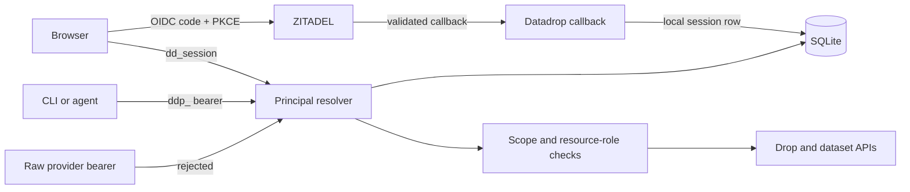
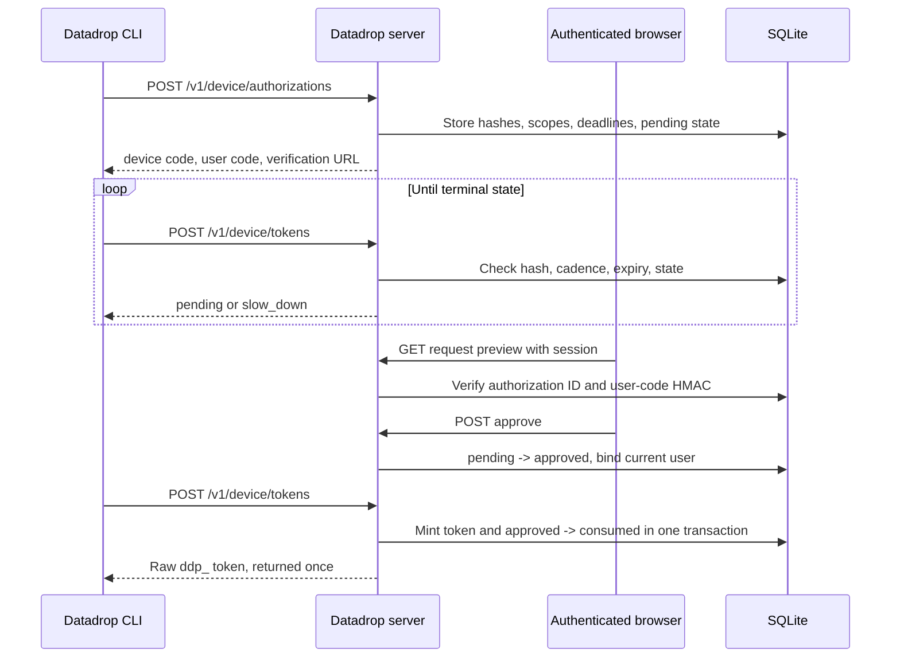

# PROJECT REPORT - go-go-datadrop - User-Owned Authorization and Production Acceptance

`go-go-datadrop` replaced its static root bearer credential with user-owned authorization, browser-approved device pairing, and a production deployment built around one persistent SQLite-and-blob volume. The change removed a server-wide privilege path rather than hiding it behind new configuration. Browser users now authenticate through ZITADEL and receive a local session; programs receive separately scoped `ddp_` credentials only after an authenticated user approves a short-lived pairing request.

The implementation was followed by a live production acceptance run against the immutable image `ghcr.io/go-go-golems/go-go-datadrop:sha-5c89eb4`. That run covered TLS, OIDC, self-registration, session security, device approval and denial, token scope enforcement, event and dataset writes, browser visibility, pod replacement, PVC persistence, backup upload, restore consistency, and credential cleanup. It also found a product boundary that the backend tests could not reveal: users can create drops through the API and CLI, but the visible browser interface does not expose drop creation.

> [!summary]
> 1. Datadrop no longer has a static root credential or an open-authentication compatibility path. Authorization is attached to users, sessions, memberships, and scoped local API tokens.
> 2. Device pairing is a local Datadrop protocol. ZITADEL authenticates the approving browser, but its access tokens are never accepted as Datadrop API credentials.
> 3. The first successful poll atomically mints exactly one local token and consumes the approval. Raw token material is returned once and is never stored for later retrieval.
> 4. Production runs one replica against a 50 GiB RWO PVC. SQLite and immutable blobs survived pod replacement, and a populated backup passed database and blob-integrity validation.

## 1. The security problem

The former static root token had global authority. It did not express a user, a resource membership, a limited scope, or an expiration tied to a particular client. Any process that possessed the value could act across the service. Rotation changed the secret but did not change the authority model.

The replacement had to satisfy stronger invariants:

- Every accepted request resolves to a current principal.
- Browser identity comes from a local session established through OIDC.
- Programmatic identity comes from a local, revocable, scoped API token.
- A provider access token is not a Datadrop data-plane credential.
- A token cannot mint another token.
- Device approval requires a signed-in browser session.
- A pairing request can produce at most one raw credential.
- Disabled users and revoked tokens stop authorizing requests.
- No root or open mode remains available as a fallback.

The last point determines the shape of the migration. This was a hard cutover. Keeping an old root-token resolver beside the new system would preserve the original bypass and make the new ownership checks optional in practice.

## 2. The resulting identity boundary

Datadrop uses ZITADEL for authentication and keeps application authorization local. This division is visible in the two accepted credential forms:

| Caller | Credential accepted by Datadrop | Principal kind | Authority source |
|---|---|---|---|
| Browser | `dd_session` cookie | session | Current user plus local resource role |
| CLI or automation | `ddp_` bearer token | token | Token scopes plus current user and resource role |
| Raw ZITADEL bearer | rejected | none | Not a Datadrop credential |
| Anonymous caller | no credential | anonymous | Public discovery and explicitly public resources only |

The browser follows Authorization Code with S256 PKCE. The callback validates the provider response, provisions or updates the local user, and establishes an HTTP-only local session. Subsequent application requests do not carry the provider token. The local cookie observed in production was `Secure`, `HttpOnly`, and `SameSite=Lax`.

The middleware resolves a session cookie or hashes a local bearer token, then loads current server-side state. The principal is therefore not a durable claim copied into a credential. Revocation, expiration, user disablement, and resource membership changes remain enforceable at request time.



This boundary also explains the production Terraform correction made during acceptance. ZITADEL originally required a project grant or role grant before it would complete OIDC. That rule contradicted the product requirement that every verified self-registered user can sign in. The production project now disables both `project_role_check` and `has_project_check`. ZITADEL still establishes verified identity; Datadrop still decides which drops, datasets, memberships, and local tokens the user may access.

## 3. Device pairing is a local credential issuance protocol

A distributed CLI cannot keep an OAuth client secret, and this application does not accept provider access tokens at its API boundary. Device pairing therefore connects two existing Datadrop identities:

1. an unauthenticated terminal process that needs a local token;
2. an authenticated browser session that can approve the request.

The terminal starts a request with a name, scopes, and requested credential lifetime. The server returns a high-entropy device code, a human-readable user code, and a verification URL. The terminal polls with the device code. The browser presents the request, its scopes, and its lifetime, then explicitly approves or denies it.



The device code is stored as a hash. The displayed user code is stored as an HMAC using a server-side pepper. These values serve different purposes. The device code authenticates the polling process during the short pairing window. The user code lets the browser confirm that the visible request corresponds to the terminal interaction. A public authorization ID alone cannot inspect or approve the request.

The server validates requested scopes before persistence. Device clients may request ordinary agent capabilities, but not administrative scope. Pairing expiration is fixed and short; token lifetime is a separate value. This prevents a requested one-hour or thirty-day credential lifetime from extending the period during which a leaked pairing code remains useful.

The state model is explicit:

```text
pending  -> approved -> consumed
   |           |
   +-> denied  +-> expired
   |
   +-> expired
```

Terminal states do not return different detail to an unauthenticated poller when that detail would reveal authorization state unnecessarily. Denied, consumed, and invalid requests collapse to `InvalidGrant`. Pending, slow polling, and expiration remain typed because the CLI needs different behavior for each.

## 4. Exactly-once token delivery

The critical implementation is `Store.ConsumeDeviceAuthorization`. Approval does not mint the credential. The first successful poll after approval opens an immediate SQLite transaction, checks the record and current user, creates the API-token row, changes the authorization to `consumed`, records the public token ID, writes the audit event, and commits.

The essential structure is:

```go
tx, err := s.beginImmediate(ctx)
// Load the request by device-code hash.
// Enforce expiry, polling cadence, and approved state.
// Confirm the approving user is still enabled.

created, err := s.createAPIToken(
    ctx, tx, record.ApprovedBy,
    record.RequestedName,
    record.RequestedScopes,
    &tokenExpiresAt,
)

result, err := tx.ExecContext(ctx, `
    UPDATE device_authorizations
       SET state = ?, consumed_at = ?, token_id = ?, token_expires_at = ?
     WHERE id = ? AND state = ?`,
    datadrop.DeviceAuthorizationConsumed,
    FormatTime(now),
    created.ID,
    FormatTime(tokenExpiresAt),
    record.ID,
    datadrop.DeviceAuthorizationApproved,
)
```

The conditional update and immediate transaction are both necessary. Two pollers may arrive concurrently. Only one transaction can observe and change the approved row as the winner. A later poll sees `consumed` and cannot retrieve the raw token or create another.

Three alternatives were rejected:

| Alternative | Rejection reason |
|---|---|
| Mint during browser approval | The raw token would need to survive until a later poll. |
| Store the raw token | This would add recoverable bearer credentials at rest. |
| Encrypt the raw token for retrieval | This would add key management and a new secret-retention lifecycle. |

Minting during the winning poll preserves the existing one-response secret invariant. The database stores only token metadata and a verifier. If an approved request is never polled, no API token is created.

## 5. Polling, abuse limits, and operational bounds

The protocol has two independent rate-control layers. Per-request polling cadence is stored in SQLite, so it remains correct across process restart and concurrent server requests. Process-local start and poll limiters bound aggregate abuse before database work becomes excessive.

The client handles the machine-readable states:

- `AuthorizationPending` waits for the configured interval.
- `SlowDown` increases the interval.
- HTTP 429 `RateLimited` honors `Retry-After`.
- `ExpiredToken` stops and requires a new pairing.
- `InvalidGrant` stops without creating a credential file.

The rate-limit key respects configured trusted proxies instead of accepting arbitrary forwarded addresses. The limiter state is bounded and old entries are evicted. Device authorization rows are also swept: expired coordination records are removed promptly, terminal records receive a short retention period, and durable audit events remain.

These details matter because the anonymous start and poll endpoints intentionally exist before user authentication. Their safety depends on entropy, hashing, short deadlines, pacing, bounded in-memory state, and stable failure semantics rather than on a browser session.

## 6. The CLI contract

`datadrop auth device` is responsible for the complete terminal side:

1. validate the server address and requested credential path;
2. start the authorization;
3. print the verification URL and user code;
4. poll according to server timing;
5. stop on denial or expiry;
6. write the returned credential with mode `0600`.

The command does not print the raw token after success. During production acceptance, approval produced a non-empty file with the `ddp_` prefix and mode `0600`. A separate denial request exited nonzero and created no file.

The acceptance run also exposed a runbook-level scope defect. The original command requested `drops:read,drops:write`, then later attempted a dataset upload. The server correctly returned HTTP 403 because dataset publication requires the distinct `datasets:write` scope. The handoff now requests all three capabilities. This is evidence that the scope boundary is active, not merely documented.

## 7. Resource authorization after authentication

Authentication identifies the caller. Authorization combines that identity with token scopes and resource roles. A browser-created drop receives the current user as owner, and the owner resolves to the effective `admin` role for that resource. A local token does not become globally privileged because its scope includes writes; it still acts as its user and remains subject to resource membership.

The production run exercised both positive and negative paths:

| Operation | Credential | Result |
|---|---|---|
| Create owned drop | Browser session | HTTP 201 |
| Create owned drop | Read/write local token | Success |
| Append event | Read/write local token | Exact row persisted |
| Query event | Read-only local token | Success |
| Append event | Read-only local token | HTTP 403 |
| Upload dataset | Drop-only writer | HTTP 403 |
| Upload dataset | Token with `datasets:write` | Success |
| List and render dataset | Browser session | Two rows visible |

A token cannot mint another token. Token creation and revocation require a browser session. This rule limits credential amplification: possession of one leaked API token cannot create a replacement that survives revocation of the original.

## 8. Production storage and deployment

The first production design deliberately matches the existing code. SQLite metadata and content-addressed dataset blobs are filesystem-backed. Both live under `/data` on one 50 GiB `local-path` RWO PVC. The Deployment runs one replica with replacement semantics.

```mermaid
flowchart TD
    Ingress[Trusted TLS ingress] --> Pod[Datadrop pod]
    Pod --> DB[/data/datadrop.db]
    Pod --> Blobs[/data/blobs/sha256/...]
    DB --> PVC[(50 GiB RWO PVC)]
    Blobs --> PVC
    Vault[VSO-managed runtime secret] --> Pod
    PVC --> Backup[Read-only backup Job]
    Backup --> S3[(Off-node S3 backup)]
    S3 --> Restore[Restore-validation Job]
    Restore --> Integrity[SQLite integrity + every blob digest]
```

The live pod runs as UID and GID 65532 with `runAsNonRoot`, `RuntimeDefault` seccomp, all Linux capabilities dropped, privilege escalation disabled, and a read-only root filesystem. Runtime identity configuration and the device-code pepper arrive through Vault-backed Kubernetes secret delivery. Backup credentials use a separate service account, Vault role, and secret path; the serving pod does not need permission to control its backups.

The PVC and Deployment must share the same Argo CD sync wave. The `local-path` StorageClass uses `WaitForFirstConsumer`: the claim cannot bind until a consuming pod is scheduled. If Argo waits for a PVC in an earlier wave to become healthy before creating the Deployment, reconciliation cannot progress.

S3 was not introduced as the live blob backend in this phase. Moving immutable blobs to object storage requires a proper storage interface, range reads, verified multipart upload, migration checkpoints, and a separate decision for SQLite metadata. S3 blobs alone would not make the current single-writer metadata layer horizontally scalable.

## 9. Backup correctness

Copying a live SQLite file is not a valid backup procedure. The backup Job uses SQLite's backup operation to create a consistent snapshot, archives that snapshot with immutable blobs, and uploads the result off-node.

Restore validation checks both directions of the durable relationship that matters:

1. SQLite passes `PRAGMA integrity_check`.
2. Every digest referenced by `dataset_files` has a corresponding blob.
3. Every referenced blob's SHA-256 matches its digest.

The live acceptance archive was created after representative event and dataset data existed. The restore-validation Job downloaded that exact archive and reported internal consistency. This proves more than archive creation or extraction. It verifies that restored metadata can resolve its content-addressed files.

It is not a complete disaster-recovery rehearsal. That would require restoring into an isolated PVC or namespace, starting Datadrop against the restored state, authenticating, and reading representative resources through the service.

## 10. Failures that changed the result

The acceptance run was designed to preserve failures because they identified real contracts:

| Failure | Root cause | Resolution or finding |
|---|---|---|
| Verified user reached `Errors.User.ProjectRequired` | ZITADEL project required a grant or role | Disabled both project checks; verified signups now complete OIDC |
| First acceptance drop returned HTTP 400 | Fixture used uppercase `T` and `Z`, outside the lowercase name regex | Handoff now generates lowercase `t` and `z` |
| Dataset upload returned HTTP 403 | Device token lacked `datasets:write` | Handoff requests the distinct dataset scope |
| Main checkout CLI did not match production behavior | Main worktree used Glazed v1.4.0; image used deployed commit `5c89eb4` and v1.4.1 | Ran acceptance CLI from an isolated worktree at the deployed commit |
| HTTP 200 appeared after token revocation | `/v1/me` intentionally returns anonymous discovery with HTTP 200 | Use a protected endpoint or inspect `authenticated`; authoritative token rows showed revocation |
| Browser user could not create a first drop visibly | Frontend has no POST `/v1/drops` client or create-drop component | Recorded as a product gap; backend and CLI creation both pass |

The final row is the most important usability result. Backend authorization is complete enough for an authenticated user to create and own a drop. The account UI can list drops, mint tokens, and upload datasets into an existing drop, but a new user cannot bootstrap the first drop without the CLI, direct API use, or developer tools.

## 11. Production acceptance result

The deployed image passed the following checks:

- Argo CD reported `Synced Healthy`.
- The image was immutable and the pod had zero unexplained restarts.
- The PVC was bound to `pvc-cf3358c0-c310-47e7-be90-cf40f5fd9914`.
- Trusted TLS covered `datadrop.yolo.scapegoat.dev`.
- Anonymous identity discovery reported OIDC mode without authenticating the caller.
- An OAuth-shaped arbitrary bearer was rejected as a Datadrop credential.
- OIDC used Authorization Code with S256 PKCE and returned to the configured callback.
- A verified self-registered user completed login without an administrator-added grant.
- Logout ended the local session and re-login restored it at an allowlisted Datadrop URL.
- Device approval issued one local credential; denial issued none.
- Event data round-tripped under a user-owned drop.
- A read-only token queried but could not write.
- A deterministic 87-byte CSV uploaded, downloaded with the same SHA-256, and rendered as two browser rows.
- Pod replacement preserved the event and exact dataset digest on the same PVC.
- Populated backup and restore-validation Jobs succeeded.
- Acceptance tokens were revoked, one-off Jobs were removed, and temporary credential files were deleted.

The image is operationally viable for the tested single-node, single-replica deployment model. The result does not claim high availability, multi-node storage resilience, or a complete restored-service drill.

## 12. Code and document reading order

The shortest route through the implementation is:

1. `pkg/server/middleware.go` for principal resolution and session/token boundaries.
2. `pkg/server/handlers_device.go` for the HTTP protocol and browser-session requirement.
3. `pkg/store/device_authorizations.go` for the state machine and atomic consumption.
4. `pkg/cli/authcmd/device.go` for polling and credential-file behavior.
5. `pkg/server/authz_test.go` and `pkg/server/handlers_device_test.go` for authorization and concurrency invariants.
6. `ui/src/components/pages/DeviceApprovalPage/DeviceApprovalPage.tsx` for consent presentation.
7. `ttmp/2026/07/27/DATADROP-12--root-token-removal-device-authentication-and-k3s-storage-deployment/design-doc/01-datadrop-root-token-removal-device-authentication-and-k3s-storage-implementation-guide.md` for the design.
8. `ttmp/2026/07/27/DATADROP-12--root-token-removal-device-authentication-and-k3s-storage-deployment/reference/01-diary.md` for implementation and production evidence.
9. `ttmp/2026/07/27/DATADROP-12--root-token-removal-device-authentication-and-k3s-storage-deployment/reference/02-production-acceptance-testing-handoff.md` for the repeatable operator sequence.

## 13. Open work

The next work follows directly from the accepted system:

1. Add a visible create-drop workflow. It should validate the lowercase name contract, call POST `/v1/drops`, and immediately select the new resource in upload and source workflows.
2. Add a protected post-revocation smoke check to the handoff. `/v1/me` is a discovery endpoint and cannot prove bearer invalidation from status alone.
3. Run a full isolated restore rehearsal that boots the service from restored data.
4. Monitor PVC usage, node disk pressure, backup age, and restore-validation failure.
5. Preserve the local identity boundary if blobs move to S3. Object storage must not broaden API authorization or turn provider tokens into data-plane credentials.
6. Revisit metadata storage and replica topology as a separate design before claiming horizontal availability.

## 14. Working rules

> [!important]
> Provider identity and application authorization remain separate. ZITADEL authenticates verified users; Datadrop resolves current local sessions, token scopes, ownership, and memberships for every protected request.

> [!important]
> Device approval never stores a retrievable raw token. Token creation and approval consumption remain one transaction in the first successful poll.

> [!important]
> A healthy PVC is not sufficient durability evidence. Representative data must survive pod replacement, leave the node through a consistent backup, and pass database-to-blob restore validation.

## Related project reports

- [[PROJECT REPORT - go-go-datadrop v0.8 - Nineteen Verbs, and the Four Silences of Framework Adoption]]
- [[PROJECT REPORT - go-go-datadrop v0.9 - Portable Layouts, and the Defects That Only a Browser Finds]]
- [[PROJECT REPORT - go-go-host OAuth Device Flow CLI - A Technical Deep Dive]]

