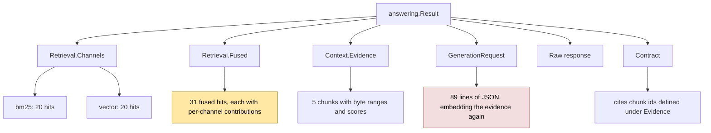
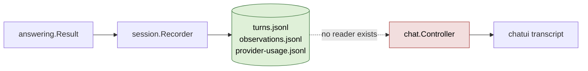

# rag-ttc: Legibility, Navigability, and the Write-Only Session Recorder

The previous report,
[[PROJECT REPORT - rag-ttc - Rebuilding the Chat TUI Presentation Layer]],
described replacing a hand-written ASCII layout engine with a computed layout,
viewports, a resolved theme, and a tagged key map. That work fixed rendering.
This report analyses what became visible once rendering was correct, and it
reaches an uncomfortable conclusion: the remaining problems are not rendering
problems, and one of the fixes made a different problem measurably worse.

Three findings. The inspector was truncating structured content at the box
edge, which in a diagnostic tool is data loss rather than formatting. Wrapping
that content restored the data and multiplied the scroll depth of a single tab
by 3.1. And the session recorder, which writes an exhaustive durable record of
every turn, has no reader at all — twelve sessions and 552 KB of provenance sit
on disk that the program cannot load.

This report extends the rag-ttc series indexed by [[rag-ttc]].

> [!summary]
> - The Prompt tab renders 89 lines of JSON for one turn. Wrapped to the
>   inspector width at an 80×25 terminal it becomes 278 lines, displayed through
>   a 10-row window: 28 screens of scrolling for one tab of one turn.
> - Truncation and scroll depth are the same quantity of information traded
>   against each other. Neither is a rendering defect; both are symptoms of
>   presenting a tree-shaped artifact through a flat scrolling window.
> - `pkg/session` exposes `Create` and four `Append*` methods and no reader.
>   Grepping the module for `turns.jsonl` outside tests returns only the writer.
>   The system was designed for durability and never grew the inverse operation.
> - The interface currently has one mode doing two jobs: composing questions and
>   examining results. The evidence suggests those want different layouts, not a
>   better single layout.

## 1. What changed since the presentation rebuild

One commit, `6e2b1ff`. The inspector previously clipped every line to the box
content width. For prose that is merely annoying. For the structured content
the inspector actually displays it is destructive, because the informative part
of a line is usually at its end:

```
  "document_id": "sha256:6e7ab90d34017a10e66acc20b426fea76592ff809f65
        ^ label, always the same          ^ the value you opened the tab to read
```

Clipping preserves the label and discards the value. The Evidence tab clipped
chunk identifiers, the Prompt tab clipped the tail of every nested field, and
the transcript clipped the citation chip row — which is to say it hid precisely
which chunks the model claimed to have used.

The replacement re-flows long lines and hangs continuations under the original
line's indentation:

```go
func wrapBlock(block string, width int) string {
	if width <= 2 {
		return block
	}
	out := make([]string, 0)
	for _, line := range strings.Split(block, "\n") {
		if lipgloss.Width(line) <= width {
			out = append(out, line)
			continue
		}
		indent := leadingSpaces(line)
		if len(indent)+minimumWrapWidth > width {
			indent = ""
		}
		wrapped := lipgloss.NewStyle().
			Width(width - len(indent)).
			Render(strings.TrimLeft(line, " "))
		for _, part := range strings.Split(wrapped, "\n") {
			out = append(out, strings.TrimRight(indent+part, " "))
		}
	}
	return strings.Join(out, "\n")
}
```

Three details carry the behaviour. Preserving `leadingSpaces` keeps JSON nesting
readable across the wrap, so a wrapped value still reads as belonging to its
key. The `minimumWrapWidth` guard drops back to the left margin when the
indentation would leave too little room to be useful, which matters at depth in
a narrow terminal. And measurement uses `lipgloss.Width` throughout, because the
input may already be styled and rune counting over ANSI escape sequences is the
defect described at length in the previous report.

The result in a live terminal:

```
│   "prompt": "Answer the user's question using only the supplied TTC             │
│   evidence.\n\nReturn exactly one JSON object with:\n- \"answer\": a concise    │
│   answer;\n- \"citation_chunk_ids\": the evidence chunk IDs supporting the      │
│   answer;\n- \"abstained\": true when the evidence is                           │
│   insufficient.\n\nRequirements:\n- Do not use facts that are absent from the   │
```

## 2. What the fix cost

Wrapping does not reduce the quantity of information. It converts horizontal
loss into vertical extent. Measured against a real recorded turn — a
four-sentence answer over five evidence chunks, from session
`20260728T233330`:

| Inspector content width | Prompt tab lines | Screens at 10 rows | Screens at 26 rows |
| --- | --- | --- | --- |
| unwrapped | 89 | 8.9 | 3.4 |
| 52 (80×25 terminal) | 278 | 27.8 | — |
| 76 (120×36 terminal) | 208 | — | 8.0 |
| 100 (wide terminal) | 165 | — | 6.3 |

At the supported floor the Prompt tab for a single turn is 278 lines seen
through a 10-row window. Reaching the evidence array at the bottom requires
roughly 28 page-downs. The information is no longer destroyed; it is merely
unreachable in practice, which for an operator trying to answer "why did
retrieval pick that chunk" is a distinction without much difference.

The general shape is worth stating precisely, because it is not specific to this
program:

- Truncation discards information and bounds navigation cost at zero.
- Wrapping preserves information and makes navigation cost proportional to
  volume.
- Neither is a rendering choice. Both are consequences of presenting a
  tree-shaped artifact through a flat, linear, scrolling window.

The `answering.Result` is a tree. It has channels, each with ranked hits; fused
hits, each with per-channel contributions; evidence, each with a chunk, a byte
range, and scores; a generation request containing all of that again as
serialised payload; a raw response; and a contract verdict referencing chunk
identifiers from three levels up. Flattening it to text and scrolling is
adequate for a two-turn session and inadequate for a real one. One turn of this
session carried 31 fused hits across two channels; the session carried 24
observations across two turns.



The red node is the Prompt tab. It is large because it duplicates content that
already has its own tab, serialised. The amber node is the Hits tab, whose
value is entirely in comparing contributions vertically — a comparison that
scrolling destroys, because you cannot see rank 3 and rank 27 simultaneously.

## 3. The durability asymmetry

The second finding emerged from a question about reloading earlier questions.
The answer is that it cannot be done, and the reason is structural.

`pkg/session` is the durability layer. Its public surface:

```go
func Create(ctx context.Context, options Options) (*Recorder, error)

func (r *Recorder) Dir() string
func (r *Recorder) SessionID() string
func (r *Recorder) OperationalLogPath() string
func (r *Recorder) AppendObservation(...) error
func (r *Recorder) AppendUsage(...) error
func (r *Recorder) AppendFailure(...) error
func (r *Recorder) AppendTurn(...) (TurnRecord, error)
func (r *Recorder) Complete(ctx context.Context) error
func (r *Recorder) Fail(ctx context.Context, cause error) error
```

There is no `Open`, no `Load`, no `Read`. Grepping the module for the filenames
it writes confirms it:

```
$ rg -n "turns.jsonl|observations.jsonl" --type go
pkg/session/recorder.go:121:  return r.append(ctx, "observations.jsonl", …)
pkg/session/recorder.go:202:  if err := r.appendJSONLLocked(ctx, "turns.jsonl", data); …
pkg/session/recorder_test.go:130: … assert file contents
pkg/chat/controller_test.go:138: … assert file contents
```

Every hit outside the writer is a test asserting that the writer wrote. Nothing
reads a session back.

The consequence is a system that records with high fidelity and cannot consult
its own records. Twelve sessions exist on disk totalling 552 KB. A single
two-turn session is 84 KB of `turns.jsonl`, and each record carries
`comparison_id`, `recorded_at`, `request`, `result`, `schema_version`,
`session_id`, `status`, and `turn_id` — the complete `answering.Request` with
its `RetrievalConfig`, and the complete `answering.Result`. Everything needed to
reconstruct a session is present. Nothing can read it.

This is worth naming as a class, because the shape recurs. An append-only
recorder is built to establish provenance. Provenance is written for an
imagined future auditor, and the imagined auditor is a human with a JSON
processor rather than the program itself. The reader is therefore never
specified, never built, and its absence is invisible because the writer's tests
all pass. The asymmetry only surfaces when someone asks the program to do
something with its own history.



### 3.1 Why a JSON processor is not a substitute

The records can be queried today:

```bash
jq -r '.request.query.text' .cache/rag-ttc/chat-sessions/*/turns.jsonl
```

That recovers the question text, and it is genuinely useful. It does not
recover what the interface is for. A question is not the unit of interest; a
turn is, and a turn's value is in the relationship between its configuration,
its retrieval, and its answer. Reading a question back as a string discards the
`RetrievalConfig` it ran under, which means the natural next action — clone this
turn, change one setting, run it again, compare — is unavailable. The comparison
lineage carried by `comparison_id` exists in the file and has no path into the
program that would use it.

The correct operation is not "extract questions" but "hydrate a session": read
the durable records back into the same in-memory shape the live path produces,
so that every existing affordance — selection, replay, comparison, the inspector
tabs — works on historical turns without knowing they are historical.

## 4. One mode doing two jobs

The third finding is a design observation supported by the first two. The
current interface presents a single layout: transcript on the left, inspector on
the right, two input fields below, controls beside them. That layout serves
composing a question. It serves examining a result badly, and the measurements
in section 2 show why: the inspector is allocated between 45 % and 55 % of the
width and a fraction of the height, and it is asked to display an artifact that
needs 165 to 278 lines.

The two activities have different requirements:

- **Composing** needs the input fields, the retrieval controls, and enough
  transcript to see what was already asked. The inspector is peripheral.
- **Examining** needs width and height for one artifact, navigation between
  levels of the result tree, and no input fields at all. The transcript is
  peripheral, useful only as a means of selecting which turn to examine.

Allocating both simultaneously guarantees neither gets enough. This is the
argument for a mode switch and a collapsible transcript rather than a better
compromise ratio: the constraint is not that the panes are badly proportioned,
it is that the union of both activities does not fit in one screen at any
proportion.

The `State` enum introduced in the previous report already distinguishes
`StateUserInput` from `StateMovingAround`, and those two states correspond
closely to composing and examining. What does not yet follow from the state is
the layout. `Compute(width, height)` produces the same regions regardless of
state.

## 5. What the inspector is missing beyond space

Space is necessary and not sufficient. Three deficiencies are independent of
how many rows are available.

**The result tree is presented as eight flat tabs.** Moving from a fused hit to
the evidence chunk it produced to the citation referencing it requires switching
tabs and finding the identifier by eye. The relationships are in the data and
absent from the presentation. A chunk identifier such as
`chunk-32da39c15ce094b1` appears in Hits, Evidence, Prompt, and Contract, and
nothing connects the four occurrences.

**Six tabs retain their original formatting.** Only Trace and Usage were
rewritten with glyphs, colour, and alignment. Hits, Evidence, Prompt, Contract,
Compare, and Log still emit unaligned `key=value` text. The Hits tab is the most
costly omission, because comparing per-channel fusion contributions is the
reason it exists and unaligned text makes vertical comparison impossible.

**The Prompt tab shows the wrong thing by default.** Its 89 lines are dominated
by the evidence array, serialised a second time. What an operator usually wants
from it is the prompt template and the parameters — perhaps fifteen lines. The
full request matters for reproducibility and belongs behind an explicit
expansion rather than in front of everything else.

## 6. Immediate direction

The next ticket covers session reloading and a session browser. Two properties
should hold, and both are consequences of the analysis above rather than
preferences.

**Hydration must produce the live shape.** A session read from disk should
populate the same `chat.Snapshot` the controller produces, so the interface
cannot distinguish a historical turn from a live one and every affordance works
on both. Any divergence between the two paths becomes a class of bug that only
manifests on old data, which is the hardest kind to notice.

**Loading a session is a mode, not a flag.** A browsing mode that lists sessions
with enough summary to choose between them — turn count, timestamp, strategy,
failure count — and then opens one for examination. This is where the
composing/examining split becomes concrete, because a session being examined has
no input fields to make room for.

Both depend on a reader that does not exist yet. `session.Open(dir)` returning
the recorded turns and observations is the foundation, and it is small: the
records are JSONL with a `schema_version` field and complete type coverage.

## 7. Working rules extracted

- In a diagnostic interface, eliding is data loss. Wrap, or provide an explicit
  expansion, but do not silently discard.
- Wrapping converts horizontal loss into vertical extent. Measure the extent
  before assuming the problem is solved.
- A flat scrolling window is adequate for linear content and inadequate for a
  tree. Presenting a tree through it trades truncation against scroll depth with
  no setting that avoids both.
- An append-only recorder should grow its reader at the same time as its writer,
  or the reader will not be built. Tests that assert the writer wrote do not
  reveal the gap.
- Hydration should produce the same in-memory shape as the live path, so that
  historical and live records are indistinguishable to everything downstream.
- When two activities cannot both fit on one screen at any proportion, the
  answer is a mode, not a better ratio.

## Open questions

1. Should a loaded session be read-only, or should replaying a historical turn
   append to the current session with a lineage reference?
2. Does the session browser belong in the chat binary, or is it a separate
   command that hands a directory to the chat TUI?
3. Should the Prompt tab default to a summary with the full request behind an
   expansion, given that the evidence array duplicates its own tab?

## Important project docs

- Ticket workspace:
  `rag-ttc/ttmp/2026/07/28/RAG-TTC-TUI-POLISH-001--visual-and-interaction-redesign-of-the-developer-rag-chat-tui/`
- Investigation diary: `reference/01-investigation-and-design-diary.md`
- Session records: `rag-ttc/.cache/rag-ttc/chat-sessions/`
- Recorder implementation: `rag-ttc/pkg/session/recorder.go`

## Related notes

- [[rag-ttc]]
- [[PROJECT REPORT - rag-ttc - Rebuilding the Chat TUI Presentation Layer]]
- [[ARTICLE - rag-ttc - Architecture of a Reproducible Go RAG Evaluation System]]
- [[ARTICLE - rag-ttc - Refactoring Explicit Experiments and Reusable Mechanisms]]
