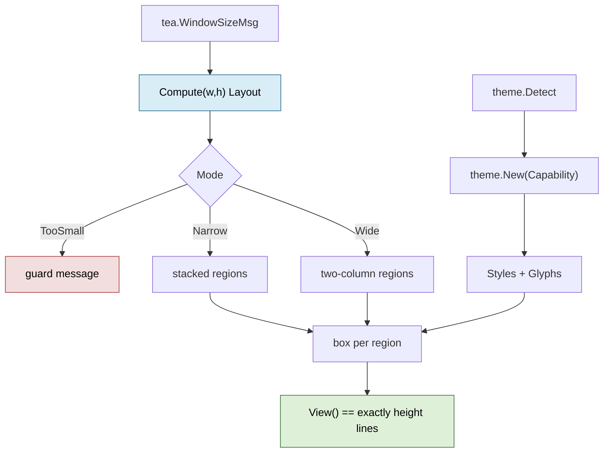
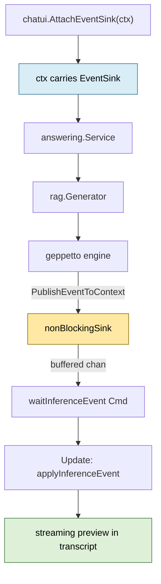

# rag-ttc: Rebuilding the Chat TUI Presentation Layer

This report analyses the redesign of the presentation layer of the `rag-ttc`
developer chat interface. The interface was built under ticket
`RAG-TTC-TUI-001` and worked correctly: it recorded every retrieval channel,
fusion contribution, evidence chunk, generation request, raw response, answer
contract, and provider budget in a durable session directory. Its rendering
layer did not work correctly, and the ways in which it failed were structural
rather than cosmetic.

The redesign replaced a hand-written ASCII layout engine with a computed layout,
two viewports, a resolved theme, and a tagged key map, and added live token
streaming without modifying any interface in the domain layer. Three defects
that had been recorded as visual complaints turned out to be functional bugs.
One new defect was introduced during the work, was invisible to the test suite
by construction, and was found only by looking at the running program.

This report extends the rag-ttc series indexed by [[rag-ttc]]. The system it
renders is described in
[[ARTICLE - rag-ttc - Architecture of a Reproducible Go RAG Evaluation System]].

> [!summary]
> - `View()` never read the terminal height. It returned 22 lines regardless of
>   whether the terminal was 28 or 60 rows tall, so the header and inputs
>   scrolled off screen exactly when a session became interesting.
> - The inspector's paging helper computed its window end as `offset+size-1`, so
>   the final line of every tab was unreachable at any scroll position.
> - Live token streaming required **no change to any domain interface**. Geppetto
>   publishes inference events to sinks carried on the `context`, and the RAG
>   generator already forwards its context unchanged, so attaching a sink at the
>   UI boundary was sufficient. `git diff --stat` over `pkg/rag` and
>   `pkg/session` is empty across the whole branch.
> - A title-stamping helper sliced `[]rune` at an offset derived from
>   `lipgloss.Width`, cutting ANSI escape sequences in half. Golden tests render
>   with a monochrome ASCII theme where no escapes exist, so the test tier that
>   keeps goldens reviewable is structurally blind to this entire class of bug.

## 1. What the interface is for, and why that determines what "looks good" means

`rag-ttc chat` is not a chat product. It is an instrument for diagnosing
retrieval-augmented generation, and its purpose is to make the difference
between what was retrieved, what was supplied as evidence, what the model
produced, and what survived contract validation visible at every step. Each
submitted question produces a durable `session.TurnRecord` containing the
retrieval query, per-channel hits, fusion contributions, hydrated evidence,
context truncation, the exact generation request, the raw provider response,
the normalised answer, usage, cache outcomes, and timing.

That purpose determines the design criteria. An interface that renders
attractively while eliding a fusion contribution or truncating an error message
is worse than an ugly one that shows everything. The criteria used throughout
the redesign were:

- The answer must be readable. Answers were previously collapsed to a single
  line with all whitespace runs removed, then truncated to fit a column.
- Structure must be visible without reading. Which pane has focus, which turn
  is selected, which stage failed, and whether a turn is running should be
  answerable from colour and position rather than by parsing text.
- Nothing may be silently lost. Truncation with an ellipsis is data loss
  presented as formatting.
- The interface must degrade. The same binary runs in a truecolour terminal, a
  256-colour tmux session, an SSH session, and a `go test` process where `TERM`
  may be unset.

The last criterion has a consequence that shaped the test strategy and, later,
concealed a bug. It is covered in section 7.

## 2. The starting condition

The presentation layer was three files. `pkg/chatui/view.go` was 669 lines, of
which the layout engine was five unexported helpers:

```go
func border(width int) string { return strings.Repeat("-", max(1, width)) }

func fit(value string, width int) string {
    if width <= 0 || utf8.RuneCountInString(value) <= width { return value }
    runes := []rune(value)
    if width <= 3 { return string(runes[:width]) }
    return string(runes[:width-3]) + "..."
}

func pad(value string, width int) string { /* append spaces to width */ }
func sideBySide(left, right string, leftWidth, rightWidth int) string { /* … */ }
func windowText(value string, offset, size int) string { /* … */ }
```

That is the entire engine: repeat a dash, count runes, pad with spaces, join
with `" | "`. There was no colour, no word wrapping, no height management, and
no ANSI awareness. The module already depended on `lipgloss` — indirectly, at
`go.mod:67` — and did not import it.

The checked-in golden file was an accurate record of the result:

```
------------------------------------------------------------------------------
rag-ttc chat | session session-fixture | strategy rrf | turn 2/2
------------------------------------------------------------------------------
CHAT                                                       | INSPECT / TRACE
  turn-0001 [complete]                                     | ok  #01 vector      completed 12ms
  You: What tree?                                          | ok  #02 generation  completed 320ms
  Assistant: Oak.                                          |
> turn-0002 [complete]                                     |
…
Config: rrf retrieve=20 evidence=5 context=12000 rrf=60... |
ctrl+s submit | tab focus | inspector: 1-4 +/- { } < > ... |
```

Two truncations are visible in that file. The `Config:` line loses
`candidates=20`, one of the settings the operator is actively tuning. The key
help loses the end of its own list. Both had been checked into version control
as expected output. A golden file is normally read as a specification, not as a
screenshot of a defect, which is why nobody had noticed.

## 3. Three defects that were not cosmetic

### 3.1 The frame ignored the terminal height

`View()` read `m.width` on its first line and never read `m.height`. Only
`inspectorPageSize()` consulted the height, and only to bound the inspector.
The consequences compound:

- `renderChat` rendered every turn unconditionally. Fifteen turns produced
  roughly sixty lines.
- `sideBySide` padded to `max(len(leftLines), len(rightLines))`, so the taller
  pane dictated total height with no cap.
- The composed frame then exceeded the alternate screen, and the header,
  inputs, and footer scrolled out of view.
- There was no conversation scrollback at all. `j` and `k` moved a selection
  index, but rendering always started at turn zero.

The first test written for the redesign asserted the missing invariant
directly:

```go
view := model.View()
lines := strings.Split(view, "\n")
require.Len(t, lines, size.height)
```

It failed at every size, and failed informatively: 22 lines at 90×28, 22 lines
at 120×36, and 22 lines at 200×60. The frame did not merely mis-size itself; it
was entirely independent of the terminal.

### 3.2 The last line of the inspector was unreachable

`windowText` implemented paging by slicing:

```go
maximumOffset := max(0, len(lines)-size)
offset = min(max(0, offset), maximumOffset)
end := min(len(lines), offset+size-1)
window := append([]string(nil), lines[offset:end]...)
```

At maximum scroll, `offset == len(lines)-size`, so `end == len(lines)-1`, and
`lines[offset:end]` excludes `lines[len(lines)-1]`. No scroll position could
reveal it. In the Prompt tab — whose stated purpose is to show the exact
generation request — the unreachable line was the closing brace of the JSON
document.

This defect was found by reading arithmetic rather than by running the program,
which is why the implementation began by proving it. That proof required a
second attempt, described in section 6.

### 3.3 Truncation was systemic

`fit()` was applied to every line of both panes inside `sideBySide`. Combined
with `oneLine()`, which collapsed all whitespace runs, a multi-paragraph
grounded answer became one long line and was then cut to a column width. The
element the program exists to produce was the least readable thing on screen.

## 4. The architecture that replaced it

Four inversions, each of which turns a previously implicit property into a
checkable one.



### 4.1 Layout as a total function

`Compute(width, height) Layout` allocates every region explicitly and returns a
value that can be checked:

```go
const (
    MinWidth      = 80
    MinHeight     = 25
    WideWidth     = 100
    MinWideHeight = 30
)

type Layout struct {
    Mode         LayoutMode
    Screen       Rect
    Header       Rect
    Conversation Rect
    Inspector    Rect
    Question     Rect
    Retrieval    Rect
    Controls     Rect
    Footer       Rect
}
```

The allocation rule that matters is ordering: fixed rows are subtracted before
the remainder is divided. Splitting first and subtracting afterwards is how the
original frame overflowed, and the error is easy to reproduce. At 80×25, taking
40 % of the body for the conversation before removing the header, input, and
footer rows yields 26 allocated rows in a 25-row terminal. The implementation
subtracts first:

```
fixed    = header(1) + question(3) + controlsLine(1) + footer(1) = 6
panes    = 25 - 6 = 19
conv     = max(5, panes*40/100) = 7
insp     = 19 - 7 = 12
total    = 1 + 7 + 12 + 3 + 1 + 1 = 25
```

`Layout.Validate()` proves the property rather than asserting it in prose. It
builds a map of covered cells and reports gaps, overlaps, and off-screen
extents:

```go
func (l Layout) Validate() error {
    covered := make(map[[2]int]bool, l.Screen.Width*l.Screen.Height)
    for _, region := range l.Regions() {
        for y := region.Y; y < region.Y+region.Height; y++ {
            for x := region.X; x < region.X+region.Width; x++ {
                if covered[[2]int{x, y}] { return errOverlap }
                covered[[2]int{x, y}] = true
            }
        }
    }
    if len(covered) != l.Screen.Width*l.Screen.Height { return errGap }
    return nil
}
```

The test runs this across a 7×7 matrix of sizes in 0.19 seconds. A brute-force
cell map is the wrong data structure for a hot path and the right one for a
property test: it catches three distinct failure modes with one piece of code.

The 80×25 floor is derived, not chosen for tradition. At that size the
inspector receives twelve rows, of which ten are content after the tab strip
and its rule. Ten lines is enough to display a fused hit with its per-channel
contributions; nine is not. Below the floor the interface renders a single
guard line rather than compressing further.

### 4.2 Scrolling belongs to viewports

Both panes became `viewport.Model` values. This deleted `windowText` and the
defect in section 3.2 by deleting the code that contained it, and supplied
`TotalLineCount` for a position badge and mouse-wheel handling for free.

The rendering discipline is worth stating precisely. `View()` must be pure, and
the viewport carries mutable scroll state, so the view renders through a
**copy**:

```go
viewportModel := m.inspector
viewportModel.Width = content.Width
viewportModel.Height = max(1, content.Height-1)
offset := viewportModel.YOffset
viewportModel.SetContent(m.inspectorContent())
viewportModel.SetYOffset(offset)
return viewportModel.View()
```

`viewport.Model` is a value type, so the copy costs nothing. The benefit is
that a missed synchronisation call cannot produce stale content: the view
always renders what the model currently describes. Scroll position lives in the
model and survives because it is read out and restored explicitly.

### 4.3 Theme as data

Terminal capability is resolved once, at startup, into a value:

```go
type Capability struct {
    Profile termenv.Profile
    Unicode bool
    Dark    bool
}

var ASCII = Capability{Profile: termenv.Ascii, Unicode: false, Dark: true}

func New(capability Capability) Theme
func Detect() Capability
```

No render function branches on `TERM`. Every renderer receives a `Theme` and
asks it for a semantic role — `OK`, `Warn`, `Error`, `Muted`, `Accent`, `Text` —
or for a glyph. The palette uses `lipgloss.CompleteAdaptiveColor`, which carries
truecolour, 256-colour, and 16-colour variants for both light and dark
backgrounds.

Two constraints on the glyph set are enforced by test. Every glyph must be
display width one, because a two-cell glyph shifts every following column and
produces a defect that is very hard to diagnose from a screenshot. And every
meaning encoded in colour is also encoded in a glyph or a word, so the interface
survives monochrome rendering:

| Meaning | Unicode | ASCII | Colour role |
| --- | --- | --- | --- |
| Stage completed | `✔` | `ok` | OK |
| Stage failed | `✖` | `ER` | Error |
| Stage running | spinner frame | `\|/-\` | Accent |
| Selection | `▌` | `>` | Accent |
| Citation | `⟦id⟧` | `[id]` | Muted |

`theme.New(theme.ASCII)` produces styles whose `Render` is the identity
function. This is what keeps golden files free of escape sequences and
reviewable in a diff. It is also, as section 7 explains, what allowed a
significant bug to reach a running terminal.

### 4.4 A named state machine and a tagged key map

The original model tracked interaction mode as `focus int`, cycled modulo three
by the `tab` key, where `0` and `1` were text fields and `2` meant "the
inspector". The replacement names the states, and the names are load-bearing:

```go
type State string

const (
    StateUserInput        State = "user-input"
    StateMovingAround     State = "moving-around"
    StateStreamCompletion State = "stream-completion"
    StateError            State = "error"
)
```

Those exact strings appear again as struct tags on the key map:

```go
type KeyMap struct {
    Help   key.Binding `keymap-mode:"*"`
    Submit key.Binding `keymap-mode:"user-input"`

    NextTurn   key.Binding `keymap-mode:"moving-around"`
    Replay     key.Binding `keymap-mode:"moving-around"`
    Strategy1  key.Binding `keymap-mode:"moving-around"`
    PageDown   key.Binding `keymap-mode:"moving-around,stream-completion"`

    Cancel key.Binding `keymap-mode:"*"`
}
```

`mode_keymap.EnableMode` from `bobatea` walks the struct by reflection and
flips `SetEnabled` on each binding according to the tags. A single call in the
state transition is the entire mechanism:

```go
func (m *Model) setState(state State) {
    m.state = state
    mode_keymap.EnableMode(&m.keys, string(m.state))
}
```

Two properties follow without further code. First, `key.Matches` returns false
for a disabled binding, so single-character retrieval controls cannot fire while
a question is being typed. Second, `help.Model` skips disabled bindings, so the
footer advertises exactly the keys that currently work. The two hand-written
help strings that had drifted from the switch statement were deleted.

The failure mode this introduces is new and worth naming: a binding that "does
nothing" now has two possible causes rather than one. It may lack a handler, or
it may carry the wrong tag. That is not hypothetical; see section 6.

## 5. Streaming without touching the domain

The interface previously displayed the word `running` for the entire duration of
a generation call. A twenty-second provider call was indistinguishable from a
hung process. The obvious way to fix this is to add streaming to the generator
interface, and the obvious way is wrong.

`rag.Generator` is deliberately provider-neutral:

```go
type Generator interface {
    Generate(context.Context, GenerationRequest) (GenerationResult, error)
}
```

Adding a `StreamingGenerator` variant would touch that interface, every
implementation, the caching decorator, the answering service, and the batch
experiment paths — a large blast radius for a presentation feature.

The mechanism that avoids all of it already existed. Geppetto attaches event
sinks to the **context**, not to engine configuration:

```go
// geppetto/pkg/events/context.go
func WithEventSinks(ctx context.Context, sinks ...EventSink) context.Context
func PublishEventToContext(ctx context.Context, event Event)

// geppetto/pkg/events/sink.go
type EventSink interface { PublishEvent(event Event) error }
```

Every provider engine calls `PublishEventToContext`, and the RAG generator
already forwards its context unchanged:

```go
// rag-ttc/pkg/rag/providers/geppetto/generation.go:43
output, inference, err := geppettoengine.RunInferenceWithResult(ctx, g.engine, turn)
```

Attaching a sink at the UI boundary is therefore sufficient. The entire
domain-side cost of live streaming is three lines in the command:

```go
var inference chatui.InferenceEvents
if !settings.NoStream {
    ctx, inference = chatui.AttachEventSink(ctx, 256)
}
```



The claim that no domain interface changed is verified rather than asserted:
`git diff --stat 526e5a1..HEAD -- pkg/rag pkg/session pkg/chat/controller.go`
produces no output across the entire branch.

### 5.1 The sink must not block

The sink runs on the inference goroutine. If it blocks, a slow interface stalls
generation:

```go
func (s nonBlockingSink) PublishEvent(event events.Event) error {
    select {
    case s.channel <- event:
    default:
        // Deliberately dropped.
    }
    return nil
}
```

Dropping is safe because of a property of the event type rather than a property
of the sink. `EventTextDelta` carries both `Delta` and `Text`, and `Text` is the
**accumulated** string. Applying a patch therefore replaces rather than appends,
which makes updates idempotent and makes any subsequence containing the final
event produce the correct result. The property is proved directly:

```go
all       := render(func(int) bool { return true })
everyOther := render(func(i int) bool { return i%2 == 0 })
lastOnly  := render(func(int) bool { return false })

require.Equal(t, "Oak leaves are lobed.", all)
require.Equal(t, all, everyOther)
require.Equal(t, all, lastOnly)
```

### 5.2 The streamed text is not the answer

This is the most important constraint in the streaming path, and it is a
correctness constraint rather than a presentation one. What arrives over the
sink is the model's raw response — for this pipeline, JSON matching the
grounded-answer schema. At the moment it is displayed:

- the answer contract has not run;
- citation chunk IDs have not been checked against the supplied evidence;
- the JSON may still be incomplete or malformed.

The validated `answering.GroundedAnswer` only exists after generation
completes. Rendering the raw stream as though it were the answer would be
actively misleading in a program whose purpose is to distinguish what the model
said from what survived validation. The preview therefore renders in `Muted`
under an explicit `streaming` label, and is discarded on `turnDoneMsg`, at
which point the validated answer from the snapshot replaces it.

Three further hazards are handled explicitly. Events arriving after
cancellation are ignored, because otherwise a cancelled turn's late tokens
resurrect a preview that has no turn. Cache hits produce no events at all, since
no provider call occurs; that case is distinguishable and is useful information
rather than a gap. And the conversation auto-tails so a stream stays visible,
but scrolling up pauses tailing and the box badge reads `paused`, because a
stream that yanks the viewport away from whatever the reader is examining is
worse than no stream.

## 6. Failures encountered during implementation

Four are worth recording. The first three are ordinary; the fourth is the
interesting one and has its own section.

**The first test passed and should not have.** The test proving the
unreachable-last-line defect asserted
`require.Contains(renderInspector(), lastLine)`. It passed. The last line of
`json.MarshalIndent` output is `}`, which also occurs many times inside the
document, so `Contains` matched a different `}` while the final line remained
unreachable. Rewriting the assertion positionally — split the window, drop the
scroll footer, compare the last remaining line — produced the expected failure.
The general rule: substring assertions on structured text are usually wrong,
because any short syntactically common token (`}`, `]`, `0`, `-`) will match for
the wrong reason.

**`lipgloss.Style.Width` includes padding.** Renderers were given
`Rect.Inner().Width`, but each box carries `Padding(0, 1)`, so the true content
area is two cells narrower. Every line wrapped. The symptom — a status word
appearing on its own line beneath the turn identifier — resembles a layout bug
rather than an off-by-two. The distinction now has a name and a documented
method, `Rect.Content()`.

**`lipgloss.Style.Height` pads but does not truncate.** With an over-tall body,
`Height(n)` left it over-tall, and applying `MaxHeight` to the *bordered* block
then removed the last row, which was the bottom border. The Conversation box
rendered with no bottom edge, running directly into the next box's top edge. The
body is now clipped before the border is applied.

**A binding contradicted its own comment.** `Cancel` was tagged
`keymap-mode:"stream-completion"` while its handler comment stated that it
applies in every state. Since disabled bindings never match, `ctrl+c` silently
became a literal character in the question field whenever no turn was running.
An existing test caught it. This is the new failure mode predicted in section
4.4, arriving immediately.

## 7. The ANSI defect, and why the tests could not see it

The first implementation of the box helper drew a lipgloss border and then
edited the rendered string to insert the title:

```go
func stampBorder(border, label string, offset int) string {
    labelWidth := lipgloss.Width(label)
    runes := []rune(border)
    return string(runes[:offset]) + label + string(runes[offset+labelWidth:])
}
```

`offset` is a count of display cells, produced by `lipgloss.Width`. `runes`
indexes a string that, once styled, contains ANSI escape sequences. The two
coordinate systems are unrelated. Slicing one by an offset computed in the other
cuts a colour sequence in half.

In tmux the result was unambiguous:

```
 rag-ttc chat · 20260728T164601.40025782 · rrf                       turn 0/0
Conversation m╭────────────────────────────────────────────────╮Inspect 6;113m╭───
│ no turns yet — type a question and press ctrl+s    │              │ Trace  Hits
```

The fragments `m` and `6;113m` are the tails of severed SGR sequences.

The fix removes the operation rather than correcting it. `labelledBorder`
assembles each border row from segments, computing every width from plain text
*before* anything is styled:

```go
return borderStyle.Render(left+strings.Repeat(fill, before)) +
    " " + labelStyle.Render(label) + " " +
    borderStyle.Render(strings.Repeat(fill, after)+right)
```

The invariant is stated in the function's documentation because it is not
visible from the shape of the code: **no styled string is ever an input to a
width calculation.** The same rule governs `bodyLines`, which pads by appending
plain spaces after measuring once, rather than by applying a padding style that
would re-measure styled output.

Two observations make this defect worth a section rather than a line.

The first is that the design document written two days earlier described this
exact trap:

> the hand-rolled versions are **not ANSI-aware**: the moment any styled string
> enters `fit()` or `pad()`, rune counting includes escape sequences and the
> layout breaks. That is the trap waiting for anyone who tries to "just add some
> colour" to the current code.

Having documented the failure mode did not prevent implementing it. The guard
that would have worked is mechanical — a lint rule prohibiting `[]rune(` in the
package — not cognitive.

The second observation is structural, and it generalises beyond this codebase.
Golden files render with `theme.ASCII`, where every style is the identity
function. Under that theme there are no escape sequences, so there is nothing to
slice, so the corrupted code path produces correct output. **The goldens were
correct and the program was broken.** The test tier that exists to keep golden
files reviewable in a diff is precisely the tier that cannot observe
escape-sequence corruption.

This is a general property of tests that neutralise a variable in order to
stabilise their output. Neutralising colour makes the goldens diffable and makes
them blind to colour bugs. The correct response is not to abandon the ASCII
goldens — they remain the right tool for layout — but to add a second tier that
renders with a truecolour theme and asserts on semantics:

```go
th := theme.New(theme.Capability{Profile: termenv.TrueColor, Unicode: true, Dark: true})
out := render.Trace(th, 60, failedObservations())
require.Contains(t, out, th.S.Error.Render(th.Glyphs.Failed))
```

That tier is specified in the design and is still unwritten. It is the highest
value outstanding item in the test suite, precisely because the bug it would
catch has already occurred once.

## 8. Result

Verified in tmux at 130×42, 80×25, and 70×20 against the real TTC index bundle.
A submitted turn runs the pipeline and, at the default zero budgets, fails on
the vector stage:

```
╭─ Conversation ────────────────────────────╮╭─ Inspect ──────────────────────────────╮
│ ▌ turn-0001                        failed ││ Trace  Hits  Evidence  Prompt  Contract│
│ ▌  › why are oak leaves lobed?            ││ ✔  02 lexical          18ms  count=20  │
│ ▌    execute vector search: embed vector  ││ ✖  04 vector            1ms            │
│ ▌    query: item 0: wait for resources:   ││      embed vector query: item 0: wait  │
│ ▌    limiter 0: resource budget exceeded: ││      for resources: limiter 0: resource│
│ ▌    requested 1, remaining 0, limit 0    ││      budget exceeded                   │
```

The error occupies four wrapped lines where the previous interface truncated it
to one. The trace distinguishes success from failure by glyph and colour. The
selected turn carries a gutter bar along its full height rather than a single
marker on its first line.

| Property | Before | After |
| --- | --- | --- |
| Frame height | 22 lines at any terminal size | exactly `height`, verified 80×25 upward |
| Inspector scrolling | final line unreachable | `viewport`; helper deleted |
| Conversation | no scrollback, answers collapsed | viewport, auto-tail, wrapped answers |
| Key bindings | 130-line switch, two hand-written help strings | tagged map, generated help |
| Interaction mode | `focus int` modulo 3 | named `State` enum |
| Generation feedback | the word `running` | live tokens, spinner, elapsed timer |
| Budget exhaustion | identical to a healthy budget | `exhausted` / `low` / `disabled`, coloured |

Eight commits on `task/rag-ttc-tui-polish`, 2,429 insertions against 426
deletions across 21 files. `go test ./...` and `golangci-lint run
./pkg/chatui/...` are clean.

## 9. What is not done

The report would be misleading without this section.

- **Live token streaming against a real provider is unverified.** Every layer
  beneath it is tested — the sink, the drop-safety property, the event folding,
  the preview rendering — and the zero-budget path is verified end to end in
  tmux. No real provider has streamed into this interface, because that spends
  money and requires authorisation.
- **There is no truecolour rendering test.** This is the exact gap that allowed
  the ANSI defect through.
- **Six inspector tabs retain their original formatting.** Hits, Evidence,
  Prompt, Contract, Compare, and Log were not rewritten. Hits is the largest
  remaining readability item, because comparing per-channel fusion
  contributions vertically is the reason that tab exists.
- **Narrow mode drops the retrieval-query input from the frame.** Focusing it
  should swap it into the question slot; that is unimplemented, so the field is
  unreachable below 100 columns.

## 10. A deliberate divergence from the approved design

The design specified adopting `bobatea/pkg/timeline` for the conversation pane:
an append-only, push-driven, entity-rendered transcript with per-entity
interactivity. It was not adopted, and recording why matters more than
recording that.

The two capabilities actually required were scrolling with auto-tail, and a
place for streamed tokens to land. A `viewport` and one string field supply
both in approximately thirty lines. Adopting the timeline additionally requires
a hydration path reconciling its push model with the pull-based
`chat.Snapshot`, a forwarder, three `EntityModel` implementations, and an
invariant test proving that hydrated and streamed turns produce identical
properties — several hundred lines whose benefit is capability this pipeline
does not currently use.

The timeline's remaining value is per-entity interactivity and multiple
concurrent streamed sub-entities. This pipeline produces one text stream per
turn. **The revisit trigger is therefore specific:** when a turn needs more than
one concurrent streamed entity — tool calls, a separate reasoning trace, or
per-stage expandable panels — the flat `streamText` field stops being
sufficient and the timeline becomes correct. `bobatea` is already a direct
dependency through `mode-keymap`, so that migration costs nothing in dependency
terms.

## 11. Working rules extracted

- Compute layout as a total function and prove the tiling property; do not let
  frame size emerge from string concatenation.
- Subtract fixed rows before dividing the remainder.
- Never let a styled string be an input to a width calculation. Measure plain
  text, decide boundaries, then style each segment.
- Encode every meaning as glyph or word in addition to colour, and constrain
  glyphs to display width one.
- Resolve terminal capability once into a value; never branch on `TERM` inside
  a renderer.
- Prefer deleting a defective helper over correcting it when a tested library
  supplies the same capability.
- Treat a test that neutralises a variable as blind to that variable, and add a
  second tier that exercises it.
- Prefer positional assertions over substring assertions on structured text.
- Verify a running terminal interface in a terminal. Golden files verify layout;
  they do not verify rendering.

## Important project docs

- Ticket workspace:
  `rag-ttc/ttmp/2026/07/28/RAG-TTC-TUI-POLISH-001--visual-and-interaction-redesign-of-the-developer-rag-chat-tui/`
- Design document: `design-doc/01-making-the-rag-chat-tui-look-good-…md`
- API reference: `reference/02-style-token-and-component-api-reference.md`
- Investigation diary: `reference/01-investigation-and-design-diary.md`
- tmux captures: `sources/tmux-captures/`
- Predecessor architecture: `rag-ttc/ttmp/2026/07/27/RAG-TTC-TUI-001--…/`

## Related notes

- [[rag-ttc]]
- [[ARTICLE - rag-ttc - Architecture of a Reproducible Go RAG Evaluation System]]
- [[ARTICLE - rag-ttc - Refactoring Explicit Experiments and Reusable Mechanisms]]
- [[PROJECT REPORT - rag-ttc - Simplifying a Recoverable and Measurable RAG Experiment System]]
- [[PROJECT REPORT - Zapx - Defensive Varint Decoding for Corrupt Bleve Postings]]
