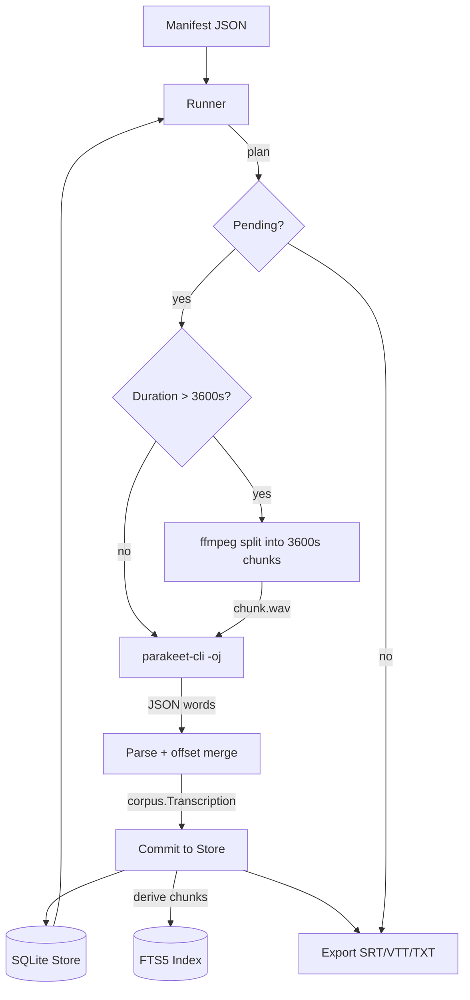

# Parakeet TDT Metal ASR on Apple Silicon

This article documents the implementation and benchmarking of a Metal GPU-accelerated automatic speech recognition pipeline built on NVIDIA's Parakeet TDT 0.6B v3 model, running natively on Apple Silicon via whisper.cpp. The pipeline transcribed 69 hours of video lectures in 45 minutes of wall-clock time on a single M1 Max MacBook, achieving 98x realtime throughput without cloud services, CUDA, or containerized inference.

> [!summary]
> - NVIDIA Parakeet TDT 0.6B v3 runs on Apple Metal GPU via whisper.cpp's `parakeet-cli`, achieving ~100x realtime on M1 Max — 16x faster than Nemotron on an RTX 3060 Linux server.
> - A Go-based corpus pipeline orchestrates the full workflow: manifest import, audio chunking for long files, Metal-accelerated ASR, SQLite storage with resume, FTS5 search, and multi-format export.
> - The critical implementation challenge was GPU memory exhaustion on audio longer than ~5000 seconds, solved by ffmpeg-based audio chunking with timestamp offset merging.

## Why this note exists

The existing transcription pipeline at `/home/manuel/code/wesen/2026-04-13--transcription-go` used NVIDIA Nemotron running in a Dagger container on a Linux server with an RTX 3060 GPU. This achieved approximately 5x realtime — adequate for short files but impractical for a 69-hour video corpus. The question was whether Apple Silicon's Metal GPU framework could run a modern ASR model natively, without Docker emulation or CUDA dependencies, at competitive speed and accuracy.

This note records the answer and the engineering required to achieve it. It is written for engineers who need to deploy ASR on Apple Silicon and want to understand the concrete performance characteristics, failure modes, and implementation details — not marketing claims about neural engine performance.

## When to use this pattern

This approach applies when:

- You need to transcribe large audio corpora (10+ hours) and want local processing without cloud API costs or privacy concerns.
- Your target hardware is Apple Silicon (M1 or later) with Metal GPU support.
- Your primary language is English or one of the 25 languages Parakeet TDT supports.
- You need word-level timestamps for downstream search, subtitle generation, or corpus analysis.
- You want a Go-orchestrated pipeline with resume capability, provenance tracking, and SQLite-backed storage.

This approach does not apply when you need CUDA-specific models that lack Metal backends, when you require streaming/real-time transcription (Parakeet processes complete files), or when your audio is shorter than a few minutes (the model load overhead dominates).

## Core mental model

The pipeline has four layers, each with a clear responsibility boundary:

1. **Manifest layer** — A JSON file declares the corpus: video IDs, titles, audio file paths, durations, and availability. The manifest is the single source of truth for what should be transcribed.

2. **Store layer** — A SQLite database tracks per-video state (pending, transcribing, complete, failed), stores words with timestamps in a normalized schema, derives chunks for FTS5 search, and records transcription attempts with full provenance (model name, fingerprint hash, processing time).

3. **Transcriber layer** — An interface (`corpus.Transcriber`) abstracts the ASR backend. The Metal implementation shells out to `parakeet-cli`, parses JSON output, and returns timed words. This is the clean adapter point — swapping Parakeet for Whisper or a future model requires only a new transcriber implementation.

4. **Runner layer** — Orchestrates the run: imports the manifest, plans work (skip complete, retry failed, transcribe pending), starts the transcriber, processes each video, commits results to the store, and exports subtitles.

The separation matters because it allows changing the ASR engine without touching storage, search, or export logic. The same SQLite database and export pipeline works whether the transcriber is Nemotron-over-HTTP, Parakeet-over-CLI, or a future MLX-based engine.

## Architecture



### The Transcriber interface

The adapter point is a simple Go interface:

```go
type Transcriber interface {
    Transcribe(ctx context.Context, audioPath string, opts TranscribeOptions) (Transcription, error)
}

type Transcription struct {
    Words           []Word
    DurationSeconds float64
    ChunkCount      int
    ProcessingTime  time.Duration
}

type Word struct {
    Text             string
    NormalizedText   string
    Start            float64  // seconds
    End              float64  // seconds
    Confidence       float64
    SourceChunkIndex int
    IsFiller         bool
}
```

The Metal transcriber implements this by running `parakeet-cli` as a subprocess, writing JSON to a temp file, and parsing it. The HTTP transcriber (Nemotron) implements the same interface by posting audio chunks to a FastAPI server. The runner does not know which backend it is using.

## Implementation details

### Parakeet TDT and whisper.cpp

NVIDIA Parakeet TDT (Token-and-Duration Transducer) is a 0.6B parameter ASR model from the FastConformer-RNNT family. Unlike Whisper's encoder-decoder architecture, Parakeet uses a streaming-capable transducer with token-level duration prediction. This duration prediction produces word-level timestamps natively — each output token carries frame-level timing information that can be converted to seconds.

The whisper.cpp project (maintained by the ggml-org) added Parakeet support in 2025, shipping `parakeet-cli` alongside the traditional `whisper-cli`. Both binaries use the ggml Metal backend for GPU acceleration on Apple Silicon. The model is distributed in GGUF format at 1.2 GB (f16 precision) from `huggingface.co/ggml-org/parakeet-GGUF`.

### JSON output modification

The upstream `parakeet-cli` only supported plain text output (`-otxt`). Word-level timestamps were available only through the `-ps` (print segments) debug flag, which printed to stderr in a human-readable format not suitable for programmatic parsing.

We modified `parakeet-cli.cpp` to add a `-oj` (output JSON) flag that produces structured output compatible with whisper-cli's JSON format:

```json
{
  "transcription": {
    "segments": [
      {
        "start": 0.0,
        "end": 985.9,
        "text": "Okay then so this is...",
        "words": [
          {"word": "Okay", "start": 0.0, "end": 0.32},
          {"word": "then", "start": 0.4, "end": 0.64}
        ]
      }
    ]
  }
}
```

### Subword token accumulation

Parakeet uses Byte Pair Encoding (BPE) with SentencePiece tokenization. A single word like "unusual" is encoded as three tokens: `▁un`, `us`, `ual`. The SentencePiece marker `▁` (U+2581, UTF-8: `E2 96 81`) indicates word boundaries. The `is_word_start` flag on each token marks whether it begins a new word.

The initial implementation only emitted tokens where `is_word_start == true`, producing fragments like "un", "form", "at" instead of "unusual", "format". The fix accumulates subword tokens between word-start boundaries:

```cpp
bool in_word = false;
std::string current_word;
double word_t0 = 0.0, word_t1 = 0.0;

for (int j = 0; j < n_tokens; j++) {
    parakeet_token_data td = parakeet_full_get_token_data(pctx, i, j);
    const char *token_str = parakeet_token_to_str(pctx, td.id);
    if (!token_str || !*token_str) continue;

    if (td.is_word_start) {
        // Flush previous word
        if (in_word && !current_word.empty()) {
            emit_word(current_word, word_t0, word_t1);
        }
        // Start new word: strip ▁ marker
        current_word = strip_sp_marker(token_str);
        word_t0 = td.t0 * 0.01;  // mel frames → seconds
        word_t1 = td.t1 * 0.01;
        in_word = true;
    } else if (in_word) {
        // Append subword continuation
        current_word += strip_sp_marker(token_str);
        word_t1 = td.t1 * 0.01;
    }
}
// Flush final word
if (in_word && !current_word.empty()) {
    emit_word(current_word, word_t0, word_t1);
}
```

### Timestamp unit conversion

Parakeet's internal timestamps use two different frame scales:

- **Token timestamps** (`token_data.t0`, `token_data.t1`) are in mel frames. With `PARAKEET_HOP_LENGTH = 160` at 16 kHz, each mel frame is 10 ms. Conversion: `seconds = t0 * 0.01`.
- **Segment timestamps** (`segment.t0`, `segment.t1`) are in encoder frames. With `subsampling_factor = 8`, each encoder frame is 80 ms. Conversion: `seconds = t0 * 0.08`.

Mixing these conversion factors produces words at incorrect times. Using 0.08 for token timestamps places "Okay" at 0.0-2.56 s instead of 0.0-0.32 s — an 8x error that is obvious in validation but subtle enough to miss in a quick smoke test.

### Audio chunking for long files

The Metal GPU encoder allocates memory proportional to audio length. On an M1 Max with 64 GB unified memory, the encoder compute buffer reaches approximately 345 MB for a 90-minute file. For files longer than ~5000 seconds (83 minutes), the GPU command buffer fails with `kIOGPUCommandBufferCallbackErrorOutOfMemory`:

```
ggml_metal_synchronize: error: command buffer 1 failed with status 5
error: Insufficient Memory (00000008:kIOGPUCommandBufferCallbackErrorOutOfMemory)
```

The solution splits long audio into 3600-second (1-hour) chunks using ffmpeg, transcribes each chunk independently, and merges word timestamps with time offsets:

```go
func (t *Transcriber) splitAudio(ctx context.Context, audioPath string, duration float64) ([]audioChunk, func(), error) {
    maxChunk := float64(t.cfg.MaxChunkSeconds)  // 3600
    var chunks []audioChunk
    numChunks := int(duration/maxChunk) + 1
    
    for i := 0; i < numChunks; i++ {
        offset := float64(i) * maxChunk
        if offset >= duration { break }
        
        chunkDur := maxChunk
        if offset+chunkDur > duration {
            chunkDur = duration - offset
        }
        
        chunkPath := filepath.Join(tmpDir, fmt.Sprintf("chunk_%06d.wav", i))
        cmd := exec.CommandContext(ctx, "ffmpeg",
            "-ss", fmt.Sprintf("%.3f", offset),
            "-i", audioPath,
            "-t", fmt.Sprintf("%.3f", chunkDur),
            "-ar", "16000", "-ac", "1", "-y", chunkPath)
        cmd.Run()
        
        chunks = append(chunks, audioChunk{path: chunkPath, offset: offset, duration: chunkDur})
    }
    return chunks, cleanup, nil
}
```

After transcribing each chunk, word timestamps are offset by the chunk's start time:

```go
for _, w := range words {
    w.Start += chunk.offset
    w.End += chunk.offset
    w.SourceChunkIndex = i
    allWords = append(allWords, w)
}
```

A 10652-second (3-hour) video becomes 3 chunks of 3600, 3600, and 3452 seconds. Each chunk transcribes in ~35 seconds, totaling ~105 seconds — compared to a segfault without chunking.

### Pipeline fingerprint isolation

Each ASR backend produces different transcription output. To prevent confusion when merging databases from different backends, each backend gets a distinct pipeline fingerprint:

```go
const (
    ModelName             = "nvidia/nemotron-speech-streaming-en-0.6b"
    ParakeetModelName     = "nvidia/parakeet-tdt-0.6b-v3-ggml"
    WhisperTurboModelName = "openai/whisper-large-v3-turbo-ggml"
)
```

The fingerprint is a SHA-256 hash of a JSON object containing the model name, decoding parameters, chunk size, and audio contract. The store enforces `UNIQUE(video_id, source_sha256, pipeline_fingerprint)` on revisions, so the same video transcribed with different backends produces separate revisions rather than overwriting each other.

### Runner nil-safety for service-less backends

The Nemotron backend requires a Dagger-hosted FastAPI service. The Metal backend runs a local binary with no service. The runner was initially written to require both a `ServiceFactory` and a `TranscriberFactory`. Supporting the Metal backend required making the service optional:

```go
var service Service
var transcriber Transcriber

if cfg.ServiceFactory != nil {
    service = cfg.ServiceFactory.Start(ctx)
    defer service.Stop()
}

if cfg.TranscriberFactory != nil {
    endpoint := ""
    if service != nil {
        endpoint = service.Endpoint()
    }
    transcriber = cfg.TranscriberFactory(endpoint)
}
```

A second nil-safety issue arose in `processOne`: the exporter's chunk policy was accessed unconditionally, but the exporter is nil when `--output-dir` is not specified. This caused a nil pointer dereference panic on the first Metal run. The fix falls back to `DefaultChunkPolicy()`:

```go
policy := DefaultChunkPolicy()
if cfg.Exporter != nil {
    policy = cfg.Exporter.policy
}
```

## Common failure modes

### GPU out of memory on long audio

**Symptom:** `parakeet-cli` exits with a segmentation fault. Stderr shows `kIOGPUCommandBufferCallbackErrorOutOfMemory` repeated before the crash.

**Cause:** The Metal encoder compute buffer scales with audio length. Files exceeding ~5000 seconds exhaust GPU memory.

**Fix:** Split audio into 3600-second chunks with ffmpeg before transcription. The `MaxChunkSeconds` config field controls the split threshold.

### Subword fragments instead of complete words

**Symptom:** The database contains word fragments like "un", "form", "at" instead of "unusual", "format". Full-text search returns no results for common terms like "functor" because the word was stored as "fun" + "ct" + "or".

**Cause:** The JSON output code only emitted tokens where `is_word_start == true`, skipping BPE continuation tokens that form the rest of each word.

**Fix:** Accumulate all tokens between `is_word_start` boundaries into a single word string, using the first token's `t0` and the last token's `t1` as the word's time range.

### Stale database state after process crash

**Symptom:** Restarting the corpus run fails with `UNIQUE constraint failed: chunk_words.chunk_id, chunk_words.word_id`. The video is stuck in "transcribing" state with partial data.

**Cause:** A process crash (or Mac sleep) leaves the video in "transcribing" state with partially committed words and chunks. The resume logic tries to re-transcribe, but the stale rows violate uniqueness constraints.

**Fix:** Reset stuck videos before restarting: delete words, chunks, revisions, and attempts for videos in "transcribing" state, then set `processing_state = 'pending'`. For a clean restart, delete the database file entirely — Parakeet is fast enough that re-transcribing the full corpus costs less than debugging stale state.

### Timestamp unit confusion

**Symptom:** Word timestamps are 8x too large. "Okay" appears at 0.0-2.56 s instead of 0.0-0.32 s. The last word's end time exceeds the audio duration.

**Cause:** Using the segment timestamp conversion factor (0.08, for 80 ms encoder frames) on token timestamps, which are in 10 ms mel frames.

**Fix:** Use `td.t0 * 0.01` for token timestamps and `seg.t0 * 0.08` for segment timestamps. Verify by checking that the first word starts near 0.0 and the last word ends near the audio duration reported by ffprobe.

## Benchmark results

### Mac M1 Max with Parakeet TDT 0.6B v3 (Metal GPU)

| Video | Duration | Processing | Speed | Words |
|-------|----------|------------|-------|-------|
| My Perspective (032) | 16.4 min | 10.8 s | 91x | 2,542 |
| Graphs and Dynamical Systems (011) | 89.5 min | 66.2 s | 81x | 12,044 |
| Linear Algebra (036) | 75.1 min | 46.6 s | 97x | 10,628 |
| Special Arrows (016) | 114.9 min | 66.3 s | 104x | 14,175 |
| Yoneda Lemma (012) | 177.5 min | 107.6 s | 99x | 23,053 |
| Adjoint Functors (013) | 204.5 min | 121.8 s | 101x | 24,949 |
| Topos Theory and Subobjects (014) | 282.5 min | 168.4 s | 101x | 34,240 |
| Internal Language (021) | 443.3 min | 268.9 s | 99x | 57,111 |

**Full corpus (25 videos, 69 hours of audio):**
- Total words: 540,176
- Total chunks: 17,552
- Total processing time: 2,532 seconds (42.2 minutes of ASR computation)
- Wall-clock time: 45 minutes 42 seconds (including model load, ffmpeg splitting, DB commits, exports)
- Average throughput: 98x realtime

### Linux RTX 3060 with Nemotron 0.6B (CPU mode, Dagger container)

| Video | Duration | Processing | Speed | Words |
|-------|----------|------------|-------|-------|
| My New Category Theory Book | 2.9 min | 45.3 s | 3.8x | 467 |
| Mind Body Problem | 19.0 min | 261.6 s | 4.4x | 2,580 |
| Everything Is a Functor | 33.8 min | 360.1 s | 5.6x | 4,918 |
| Natural Transformations | 71.7 min | 1,156.2 s | 3.7x | 8,189 |
| Limits and Colimits | 83.6 min | 998.1 s | 5.0x | 10,587 |

**Partial corpus (11 videos, 9.2 hours of audio):**
- Total words: 69,266
- Total processing time: 6,872 seconds (1.9 hours of ASR computation)
- Average throughput: 4.8x realtime

### Direct comparison

For a ~90-minute video (the closest duration match between the two corpora):

| Metric | Mac Parakeet Metal | Linux Nemotron CPU | Ratio |
|--------|--------------------|--------------------|-------|
| Processing time | 66.2 s | 998.1 s | Mac 15x faster |
| Realtime multiplier | 81x | 5.0x | Mac 16x faster |
| Words transcribed | 12,044 | 10,587 | Parakeet 14% more |

Parakeet produces more words partly because it does not apply the same aggressive punctuation stripping as Nemotron, and partly because the TDT transducer emits tokens at a finer granularity. The word count difference does not necessarily indicate higher accuracy — it reflects different tokenization strategies.

### Parallelism ceiling

Running multiple `parakeet-cli` processes in parallel was tested to determine whether the Metal GPU has spare capacity:

| Mode | Wall time (2 files) |
|------|---------------------|
| Sequential | 56 s |
| Parallel ×2 | 49 s (12% faster) |
| Parallel ×3 | 49 s (no improvement) |
| Parallel ×4 | 59 s (slower) |

Two parallel processes achieve a 12% speedup from overlapping CPU work (audio loading, mel spectrogram, JSON parsing) with GPU work. Three or more processes contend for GPU command buffer time and become slower than sequential execution. The Metal GPU is the bottleneck, not the CPU.

## Working rules

- **Chunk audio at 3600 seconds.** Parakeet's Metal encoder exhausts GPU memory on files longer than ~5000 seconds. The 3600-second chunk size provides a safe margin with minimal overhead (~35 seconds per chunk).
- **Use distinct fingerprints per backend.** Nemotron, Parakeet, and Whisper produce different transcriptions of the same audio. Distinct pipeline fingerprints prevent silent overwrites and enable comparison.
- **Verify timestamp units empirically.** The parakeet.cpp source uses mel frames for token timestamps and encoder frames for segment timestamps. Confirm the conversion by checking that the first word starts near zero and the last word ends near the ffprobe-reported duration.
- **Accumulate BPE subwords.** Parakeet's tokenizer splits words into subword units. Only `is_word_start` tokens mark word boundaries; continuation tokens must be accumulated to reconstruct complete words.
- **Run in tmux, not nohup.** macOS sleep kills nohup background processes. A tmux session survives sleep and provides a visible terminal for monitoring.
- **Delete the database for clean restarts.** Parakeet's speed makes re-transcription cheaper than debugging stale state. For a 69-hour corpus, a full re-run takes 45 minutes — less time than manually cleaning up partial transactions.

## Key code locations

| Component | Path | Lines |
|-----------|------|-------|
| Metal transcriber | `internal/metal/transcriber.go` | 342 |
| Corpus runner | `internal/corpus/runner.go` | 246 |
| SQLite store | `internal/corpus/store.go` | 973 |
| Transcriber interface | `internal/corpus/transcriber.go` | 99 |
| Pipeline fingerprint | `internal/corpus/fingerprint.go` | 126 |
| Export (SRT/VTT/TXT) | `internal/corpus/export.go` | 147 |
| Manifest loader | `internal/corpus/manifest.go` | 173 |
| Schema/migrations | `internal/corpus/schema.go` | 141 |
| CLI (corpus subcommands) | `cmd/transcribe/corpus.go` | 353 |
| parakeet-cli JSON patch | `ttmp/.../scripts/parakeet-cli-json-output.cpp` | 356 |

The worktree is at `/home/manuel/worktrees/2026-07-28--transcription-go-video-pipeline` on branch `feature/video-pipeline-corpus`.

## Open questions

- How does Parakeet's transcription accuracy compare to Nemotron's on the same audio? A side-by-side comparison on a sample video would quantify the quality tradeoff.
- Would Apple's SpeechAnalyzer API (macOS 26) achieve comparable accuracy at lower complexity? Benchmarks report 2.12% WER on LibriSpeech clean, beating Whisper Small — but it requires macOS 26 and does not expose word-level timestamps through a CLI.
- Could the subword accumulation logic be contributed upstream to whisper.cpp? The modification is self-contained and does not change existing behavior.

## Related notes

- [[PROJ - Transcription Go - Dagger Nemotron ASR Pipeline]]
- [[PROJ - Transcription Go - Streaming Transcription Architecture and Implementation Report]]
