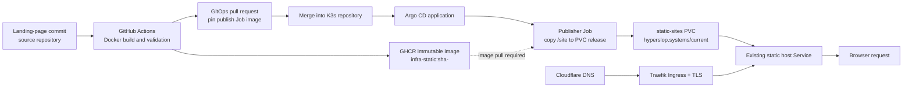

# Static Site Delivery Through GHCR, GitOps, Argo CD, and Cloudflare

This article documents the complete delivery path built for the Hyperslop Systems landing page. It is written as a reusable deployment procedure for a static site whose source is in one repository, whose Kubernetes configuration lives in another, and whose public DNS is managed by Terraform. It also records the activation boundary discovered during the work: publishing an image to GitHub Container Registry is not sufficient for a Kubernetes cluster to pull it. Package visibility or an image-pull credential is a separate, required part of the system.

> [!summary]
> - The site repository builds a deliberately small static artifact containing only the public HTML and Berkeley Mono web fonts, then publishes an immutable GHCR image tagged with the source SHA.
> - A reusable release workflow opens a GitOps pull request that replaces the publisher Job image reference. Argo CD runs that Job, which copies the artifact into the shared static-sites PVC; the existing static host serves the selected release.
> - Cloudflare DNS routes the apex and `www` names to the cluster. The Kubernetes ingress owns HTTPS and redirects `www` to the apex.
> - The production image remains private. A dedicated Vault path and a VSO-rendered `kubernetes.io/dockerconfigjson` Secret give only the Hyperslop publisher Job the read access it needs. The site is live on the SHA-`e28f786` release.

## Why this note exists

Static HTML needs less application runtime than a server-rendered or API-backed service, but it still needs a reliable release model. A direct copy from a workstation obscures which revision is running, bypasses review, and creates a second source of truth. A static delivery system should preserve the same properties expected of other production workloads: an immutable artifact, a reviewed deployment change, a declarative desired state, observable execution, and a precise way to recover.

The Hyperslop Systems work joins four existing capabilities rather than introducing a second hosting stack:

- GitHub Actions builds and publishes an OCI image.
- The `go-go-golems/infra-tooling` reusable workflow writes an image-pinning change to the K3s GitOps repository.
- Argo CD reconciles the K3s configuration and executes a short-lived publisher Job.
- The cluster's existing `static-sites` host serves files from a persistent volume, while Traefik and cert-manager provide routing and TLS.

The design separates artifact production from serving. The published image is not a web server. It is a read-only release bundle. The Job extracts its `/site` directory into a versioned directory on the static-sites persistent volume and atomically repoints `current`. This makes the active site revision visible in Kubernetes configuration and makes rollback an image-reference change rather than an ad-hoc file operation.

## System boundaries and repositories

Three repositories own distinct responsibilities. Keeping these responsibilities separate is important because each has a different review and credential boundary.

| Repository | Responsibility | Relevant paths |
| --- | --- | --- |
| `/home/manuel/code/wesen/hyperslop-systems/infra` | Landing-page source, artifact definition, and release workflow. | `site/index.html`, `site/index-rows.html`, `Dockerfile.static`, `.github/workflows/publish-static.yaml`, `deploy/gitops-targets.json` |
| `/home/manuel/code/wesen/2026-03-27--hetzner-k3s` | Cluster-side GitOps declarations, Vault policy/role, and Argo Application. | `gitops/kustomize/hyperslop-systems/`, `gitops/applications/hyperslop-systems.yaml`, `vault/` |
| `/home/manuel/code/wesen/terraform` | Authoritative Cloudflare zone and DNS declarations. | `dns/zones/hyperslop-systems/envs/prod/main.tf` |

The key commits produced during the initial implementation were:

| Repository | Commit | Purpose |
| --- | --- | --- |
| Hyperslop Systems infra | `f895193`, `bee27e8`, `164aa22` | Added and promoted the responsive rows landing page. |
| Hyperslop Systems infra | `0a2b5dc`, `7f49243`, `5cac770` | Added static publishing, excluded private trial fonts from the artifact, and added a package-visibility attempt. |
| K3s GitOps | `0ca779d` | Added the Hyperslop Systems publisher Job, ingress, redirect middleware, Argo application, and GitHub Actions Vault access. |
| Terraform | `3266e81` | Added the apex A record and `www` CNAME for the landing page. |

## The release model

The complete path from an HTML edit to a user request is shown below. A successful production deployment requires every arrow to be operational.



There are two different immutable references in this path. The GHCR image tag identifies what the publisher must copy. The PVC release directory identifies what the static host currently serves. The publisher creates a fresh release directory and changes the `current` symlink only after the copy completes. The short period in which the release directory is named `*.tmp` is never selected by the web server.

The release workflow does not mutate a Kubernetes manifest in the source repository. Its `deploy/gitops-targets.json` names a target in the infrastructure repository and identifies the `publish` container in `publish-job.yaml`. The reusable workflow updates the SHA in the Job name, release label, command, and image reference. This produces a GitOps pull request that should be inspected and merged like any other production configuration change.

## 1. Build a minimal, public artifact

The deployment image must contain only files that are allowed to leave the source repository. This became a concrete requirement because the local project included trial fonts under `site/fonts/ops-trial`. An initial broad `COPY site /site` would have published those files. The corrected `Dockerfile.static` explicitly names the four public files:

```dockerfile
FROM alpine:3.20

WORKDIR /
COPY site/index.html /site/index.html
COPY site/index-rows.html /site/index-rows.html
COPY site/fonts/BerkeleyMono-Regular.woff2 /site/fonts/BerkeleyMono-Regular.woff2
COPY site/fonts/BerkeleyMono-Bold.woff2 /site/fonts/BerkeleyMono-Bold.woff2

RUN find /site -type f | sort > /site-manifest.txt \
    && test -f /site/index.html \
    && test -f /site/fonts/BerkeleyMono-Regular.woff2
```

The important design choice is positive selection. `.dockerignore` is useful for reducing context and avoiding accidental build inputs, but it is not the primary access-control boundary. A Dockerfile that copies exactly the intended public files remains safe when another asset directory is added later. The manifest is also useful when diagnosing an unexpected deployed file set.

Build and inspect the artifact locally before enabling cluster reconciliation:

```bash
cd /home/manuel/code/wesen/hyperslop-systems/infra
docker build -f Dockerfile.static -t hyperslop-static:verify .
docker run --rm --entrypoint sh hyperslop-static:verify -c 'find /site -type f | sort'
```

Expected output is limited to `index.html`, `index-rows.html`, and the two Berkeley Mono `.woff2` files. The artifact must not include `site/fonts/ops-trial` or any other local design asset that lacks deployment rights.

The site itself now makes `site/index.html` the responsive product-rows page. `index-rows.html` remains in the artifact as a directly inspectable variant, but the public root document is `index.html`. The design loads Berkeley Mono only and uses only the regular and bold weights that are actually packaged.

## 2. Publish and create the GitOps image pin

The source workflow is `.github/workflows/publish-static.yaml`. It runs on changes that affect the source, the static Dockerfile, the workflow, or its target configuration. The release job delegates build, registry publication, and GitOps pull-request creation to `go-go-golems/infra-tooling/.github/workflows/publish-ghcr-image.yml@main`.

The relevant inputs are:

```yaml
image_name: ghcr.io/hyperslop-systems/infra-static
gitops_target_config: deploy/gitops-targets.json
push_image: ${{ github.event_name != 'pull_request' }}
open_gitops_pr: ${{ github.event_name != 'pull_request' && github.ref == 'refs/heads/main' }}
gitops_pr_token_source: vault
vault_role: hyperslop-systems-infra-gitops-pr
vault_secret_path: kv/data/ci/github/hyperslop-systems-infra/gitops-pr-token
```

`deploy/gitops-targets.json` directs the reusable workflow to `wesen/2026-03-27--hetzner-k3s`, branch `main`, and `gitops/kustomize/hyperslop-systems/publish-job.yaml`. The strategy is `static-publisher-job`, which knows that the Job has a content-bearing SHA in several fields rather than only in the `image:` line.

The GitHub Actions identity needs two separate authorities. It needs the ability to write the source package, and it needs a credential capable of opening a pull request in the GitOps repository. The latter is deliberately fetched through Vault; it is not stored as a long-lived plain GitHub secret in the source repository.

### Configuring Vault access for GitOps pull requests

The K3s repository includes these declarative source files:

```text
vault/policies/github-actions/hyperslop-systems-infra-gitops-pr.hcl
vault/roles/github-actions/hyperslop-systems-infra-gitops-pr.json
```

The policy grants read access only to:

```text
kv/data/ci/github/hyperslop-systems-infra/gitops-pr-token
```

Apply the policy and role using the cluster's established Vault administration procedure. The role must constrain the GitHub Actions OIDC subject to the correct repository and branch/workflow policy used by the rest of the infrastructure. Store a GitHub token that can create branches and pull requests in the K3s repository at the policy path. Do not put the token in this article, the workflow YAML, a Kubernetes manifest, or the Git repository.

After publishing, inspect the workflow run and the generated GitOps pull request. There can be more than one open pinning PR after successive source commits. Merge only the newest valid PR. Older pins are not harmless if their artifacts predate a security or packaging correction; close them instead of allowing them to land later.

## 3. Declare the cluster-side publisher and routing

The K3s configuration lives at `gitops/kustomize/hyperslop-systems/`. The Kustomization groups four resources:

- A publisher `Job` that puts a release on the shared PVC.
- A Traefik `Middleware` that redirects `www.hyperslop.systems` to the apex.
- An `Ingress` that requests TLS for both names and routes both to the existing static host service.
- Labels and annotations that identify the application as a static-site workload.

The publisher's essential logic is:

```sh
set -eu
host="hyperslop.systems"
release="sha-<commit>"
base="/srv/sites/${host}"
target="${base}/releases/${release}"
tmp="${target}.tmp"

rm -rf "${tmp}" "${target}"
mkdir -p "${tmp}"
cp -a /site/. "${tmp}/"
mv "${tmp}" "${target}"
ln -sfn "releases/${release}" "${base}/current"
```

The Job mounts the existing `static-sites-content` PVC at `/srv/sites`. The static host already understands the host-specific layout:

```text
/srv/sites/hyperslop.systems/
  current -> releases/sha-<commit>
  releases/
    sha-<commit>/
      index.html
      fonts/
```

`cp -a` preserves file metadata within the volume. The `mv` transitions the fully copied directory into its versioned release location. `ln -sfn` is the one operation that selects the newly written release. A reader should note that this is an atomic replacement at the symlink level, not a lock-free transaction for every possible static host implementation. It is appropriate here because the host resolves `current` at request time and the directory is complete before `current` changes.

The ingress has TLS hosts for both `hyperslop.systems` and `www.hyperslop.systems`, uses `letsencrypt-prod`, and routes to `static-sites-host` on its `http` port. The Traefik middleware is attached through `traefik.ingress.kubernetes.io/router.middlewares` and permanently rewrites `www` requests to the apex. The redirect must be attached to the ingress, not merely declared, otherwise both host names serve independently.

The standalone Argo declaration is `gitops/applications/hyperslop-systems.yaml`. It points to the K3s repository path and applies into `static-sites` with automated self-healing. It is intentionally a separate activation step: committing an Argo Application to Git does not create it in a cluster that does not have an app-of-apps controller watching that directory.

## 4. Configure DNS through Terraform

DNS is declared in `/home/manuel/code/wesen/terraform/dns/zones/hyperslop-systems/envs/prod/main.tf`. The release adds two records:

| Record | Type | Content | Purpose |
| --- | --- | --- | --- |
| `@` | A | `91.98.46.169` | Directs the apex to the K3s ingress IPv4 address. |
| `www` | CNAME | `hyperslop.systems` | Directs the conventional alias to the apex, where Traefik issues the canonical redirect. |

Both are DNS-only (`proxied = false`) and use TTL 3600. DNS-only operation is intentional in this initial configuration: the ingress must directly receive the ACME challenge and client traffic. If Cloudflare proxying is enabled later, reassess TLS mode, client-IP handling, cache behavior, and the Cloudflare provider's TTL requirement (`ttl = 1` for proxied records).

Before creating a Terraform resource for an already-registered Cloudflare zone, import the zone into state. The zone registration is deliberately not declared because the currently used Cloudflare provider cannot import that registrar resource safely. Only the DNS zone and its records are Terraform-managed.

```bash
cd /home/manuel/code/wesen/terraform/dns/zones/hyperslop-systems/envs/prod
terraform init
terraform plan
terraform apply
```

On the initial landing-page change, the expected plan was two additions and no changes or deletions. Treat any other plan as a reason to stop and inspect state. DNS has a slow and externally observable failure mode; an accidental replacement can interrupt unrelated records.

## 5. Activation sequence

This order prevents the most expensive class of failure: an Argo-scheduled publisher that cannot pull its image.

1. Commit and push the site artifact definition and workflow.
2. Wait for the source release workflow to publish `ghcr.io/hyperslop-systems/infra-static:sha-<commit>`.
3. Verify the exact immutable image can be pulled without the credentials that will not exist in the cluster, or prepare a dedicated `imagePullSecret` and reference it in the Job.
4. Review and merge the newest GitOps pinning PR. Close stale pinning PRs.
5. Apply the Argo Application only after the pin refers to a pullable artifact.
6. Wait for the Job to complete, then verify the ingress, Certificate, HTTP behavior, and page contents.

The anonymous image-pull test is deliberately simple:

```bash
docker pull ghcr.io/hyperslop-systems/infra-static:sha-<commit>
```

If the command reports `unauthorized`, the image is private from the cluster's perspective. There are two valid remediation paths:

| Choice | When to use it | Required configuration |
| --- | --- | --- |
| Public package | The artifact consists entirely of public web assets. | Change the GHCR package visibility to public using an organization owner or a token that has package-administration authority. Re-run the anonymous pull test. |
| Private package with pull secret | The artifact or organizational policy requires package privacy. | Create a scoped GitHub PAT with `read:packages`, place it in the established secret/Vault path, create or synchronize a `dockerconfigjson` pull secret in `static-sites`, and add `imagePullSecrets` to the Job's pod spec. |

The workflow's attempted call to `PATCH /orgs/hyperslop-systems/packages/container/infra-static` using the default `GITHUB_TOKEN` returned HTTP 404. That token can publish the package, but it does not have the organization package-administration authority needed to change visibility. This is a credential-authority problem, not an image-build failure. Do not conceal it by assuming a successful push made the package public.

Once the image is demonstrably pullable, apply the Argo Application from the K3s working tree:

```bash
kubectl \
  --kubeconfig /home/manuel/code/wesen/2026-03-27--hetzner-k3s/.cache/kubeconfig-tailnet.yaml \
  apply -f /home/manuel/code/wesen/2026-03-27--hetzner-k3s/gitops/applications/hyperslop-systems.yaml
```

The command creates production cluster state and should be run only after the GitOps pin is merged and the image-access test succeeds. Then inspect reconciliation and the publisher execution:

```bash
kubectl --kubeconfig /home/manuel/code/wesen/2026-03-27--hetzner-k3s/.cache/kubeconfig-tailnet.yaml \
  -n argocd get application hyperslop-systems

kubectl --kubeconfig /home/manuel/code/wesen/2026-03-27--hetzner-k3s/.cache/kubeconfig-tailnet.yaml \
  -n static-sites get jobs,pods,ingress -l app.kubernetes.io/name=hyperslop-systems

kubectl --kubeconfig /home/manuel/code/wesen/2026-03-27--hetzner-k3s/.cache/kubeconfig-tailnet.yaml \
  -n static-sites logs job/<publisher-job-name>
```

The Job output should list files from the release directory. `ImagePullBackOff` means the registry-access gate was missed; it is not fixed by repeatedly syncing Argo CD.

## 6. Verify the externally visible service

Verification proceeds from declaration to behavior. Checking only the page in a browser does not establish that the intended revision or redirect policy is active.

| Check | Command or observation | Expected result |
| --- | --- | --- |
| DNS apex | `dig +short hyperslop.systems A` | `91.98.46.169` after propagation. |
| DNS alias | `dig +short www.hyperslop.systems CNAME` | `hyperslop.systems.` |
| Argo state | `kubectl -n argocd get application hyperslop-systems` | `Synced` and `Healthy`. |
| Publish Job | `kubectl -n static-sites get jobs` | Latest SHA-named Job completes successfully. |
| Certificate | `kubectl -n static-sites get certificate,challenge,order` | Certificate becomes Ready; no pending failed challenge. |
| Apex HTTPS | `curl -sSIL https://hyperslop.systems` | Valid public certificate and `200`. |
| WWW canonicalization | `curl -sSIL https://www.hyperslop.systems` | `301` or `308` to `https://hyperslop.systems/...`. |
| Deployed content | `curl -sS https://hyperslop.systems/ | rg 'HYPERSLOP SYSTEMS'` | The expected HTML is served. |

During the initial verification before activating the application, the cluster returned `NotFound` for the Argo application and no Hyperslop resources existed in `static-sites`. HTTPS on the DNS target presented a self-signed certificate. Those observations are expected before the application, ingress, and cert-manager resource exist; they are not evidence of a completed launch. The desired final result is a public certificate issued after the ingress is reconciled.

## Common failure modes and their diagnosis

### A published image cannot be pulled

Symptom: `docker pull ghcr.io/hyperslop-systems/infra-static:sha-<commit>` returns `unauthorized`, or the publisher pod enters `ImagePullBackOff`.

Cause: registry publication and registry read access are independent. GHCR packages can be written by the workflow token while remaining private. The cluster does not inherit the GitHub Actions identity.

Resolution: make the package public with an authorized organization-level credential, or add a dedicated read-only image-pull secret to the workload. Test the same access model before applying the Argo application.

### A broad Docker copy exposes non-public assets

Symptom: `find /site -type f` contains trial fonts, source assets, or internal files.

Cause: `COPY site /site` makes every current and future file in `site/` part of the release artifact.

Resolution: explicitly copy the public release allowlist. Rebuild and inspect the image. Because images are immutable, publish a new SHA and merge a new GitOps pin; do not activate an older unsafe image.

### More than one GitOps image-pinning PR is open

Symptom: older and newer image SHA updates are both available for merge.

Cause: each source push can generate a deployment PR independently.

Resolution: inspect the artifact contents and source commit for every candidate. Merge the newest valid pin and close stale pins. The release Job name includes the SHA, so Argo can distinguish the desired Job from earlier completed Jobs.

### HTTPS is self-signed or absent

Symptom: `curl` rejects the certificate, browser TLS warning appears, or cert-manager has no ready certificate.

Cause: DNS may have propagated before the ingress and Certificate resources exist; alternatively, ACME routing or ingress-class configuration is wrong.

Resolution: first ensure the Argo application is present and healthy. Then inspect `Ingress`, `Certificate`, `Order`, and `Challenge` resources in `static-sites`. Confirm the DNS records reach the cluster ingress and that the ingress requests `letsencrypt-prod` for both host names. Do not use `curl -k` as a launch acceptance check; it suppresses exactly the failure that must be corrected.

### `www` does not redirect

Symptom: both names return content, or `www` returns a default backend.

Cause: a Traefik middleware exists but is not attached to the ingress, DNS does not resolve to the same ingress, or its regular expression does not match the request URL.

Resolution: confirm the ingress annotation names `static-sites-hyperslop-systems-redirect-www-to-apex@kubernetescrd`, the namespace/name prefix is correct, and the middleware regex covers HTTP and HTTPS. Validate with `curl -I` rather than following redirects automatically.

## 7. Review findings: immutable Jobs, sync waves, and secret bootstrap

The first live deployment worked because the Argo Application did not yet exist. Argo created the publisher Job with its private image-pull configuration in a single operation. A later review correctly focused on a different transition: what happens when a completed SHA-named Job already exists and a GitOps change changes the object around it.

The review produced three findings. They should be evaluated separately because they concern different Kubernetes invariants.

| Finding | Resolution | Technical result |
| --- | --- | --- |
| A publisher Job's pod template is immutable. | The release process changes every SHA-bearing field, including `metadata.name`; the follow-up release created `publish-hyperslop-systems-sha-e28f786` instead of editing the completed `sha-5cac770` Job. | Kubernetes created and completed a new Job. The old completed Job remains as historical evidence. |
| The ServiceAccount must precede Vault authentication resources. | The ServiceAccount remains at sync wave `-2`; `VaultConnection`, `VaultAuth`, and `VaultStaticSecret` are at `-1`; the publisher Job is at `1`. | VSO authenticates only after the Kubernetes identity exists, and the Job is scheduled only after the pull Secret can be rendered. |
| A fresh environment needs a reproducible credential-seeding procedure. | `scripts/bootstrap-hyperslop-systems-secrets.sh` accepts runtime GHCR credentials and writes `kv/apps/hyperslop-systems/prod/image-pull`. | No token is committed. The repository documents the exact key contract used by the VSO transformation. |

### Why `Replace=true` was not sufficient by itself

The review proposed `argocd.argoproj.io/sync-options: Replace=true` as one possible immutable-Job remedy. The annotation was added as a defensive option, but the observed Argo operation demonstrated its limit. Argo used a Kubernetes replacement request against the existing `publish-hyperslop-systems-sha-5cac770` Job. Kubernetes Jobs have server-generated selectors that are immutable. The desired manifest did not declare that selector, so the replacement request effectively supplied a null selector while retaining the same Job name. The API rejected the request with `spec.selector: field is immutable` and a corresponding pod-template immutability error.

This distinction matters. `Replace=true` changes the apply method; it does not necessarily delete the existing object before the API validates immutable fields. `Force=true` can delete and recreate an object, but deletion is not the preferred normal release path for this publisher. A static release already has an immutable identifier: its source SHA. Changing the SHA changes the Job name, which gives Kubernetes a new object and avoids mutation entirely.

The recovery followed that intended model. Source commit `e28f786` removed the obsolete package-visibility step from the release workflow. It produced a new GHCR tag and GitOps PR #250, which rewrote the Job name, image, release label, and shell `release` variable together to `sha-e28f786`. Argo then created `publish-hyperslop-systems-sha-e28f786`, which completed in five seconds. The Application converged at revision `e1063f061f61fd460d662573cb234a3c93710473` with `Synced` and `Healthy` status.

### The bootstrap script contract

The new helper is deliberately narrow:

```bash
VAULT_ADDR=... VAULT_TOKEN=... \
HYPERSLOP_SYSTEMS_GHCR_USERNAME=... \
HYPERSLOP_SYSTEMS_GHCR_TOKEN=... \
scripts/bootstrap-hyperslop-systems-secrets.sh
```

It writes four keys and no runtime application values:

```text
server   = ghcr.io
username = <GHCR deployment identity>
password = <read:packages token>
auth     = base64("<username>:<token>")
```

`VaultStaticSecret` transforms those values into the single `.dockerconfigjson` key that Kubernetes requires for `kubernetes.io/dockerconfigjson`. The validation rule is to inspect only Secret type and key presence. Do not decode its contents into logs, terminal history, tickets, or Git.

## Live status and release criteria

The source site, static image definition, GitOps configuration, Vault policy/role, and Terraform DNS records have been committed and pushed. The Terraform change added the apex A record and the `www` CNAME without modifying other records. The landing page's production document is `site/index.html` and uses Berkeley Mono only.

The site is **live** as of 2026-07-29. The production package intentionally remains private: an approved existing GHCR reader was first tested against `ghcr.io/hyperslop-systems/infra-static:sha-5cac770`, then copied without printing values into `kv/apps/hyperslop-systems/prod/image-pull`. The K3s package now has a site-specific ServiceAccount, VaultConnection, VaultAuth, VaultStaticSecret, Vault policy, Kubernetes auth role, and reproducible bootstrap helper. The VSO resource reported `Synced=True`, `Healthy=True`, and `Ready=True`; the rendered Secret had type `kubernetes.io/dockerconfigjson` with a present `.dockerconfigjson` key.

GitOps PR #247 merged the first safe image pin (`sha-5cac770`). GitOps PR #248 added the private-pull wiring. The publisher Job `publish-hyperslop-systems-sha-5cac770` completed successfully and its file manifest contained only `index.html`, `index-rows.html`, and the two Berkeley Mono font files. PR #249 corrected an over-escaped Traefik regular expression; after Argo CD reconciled revision `fd869da`, `www.hyperslop.systems` returned `308 Location: https://hyperslop.systems/`. PR #251 incorporated the review hardening, and PR #250 advanced the release safely to `sha-e28f786`.

Final acceptance established all required conditions:

- The `hyperslop-systems` Argo CD Application is `Synced` and `Healthy` at revision `e1063f061f61fd460d662573cb234a3c93710473`.
- cert-manager issued a Ready `hyperslop-systems-tls` certificate for both apex and `www`.
- `https://hyperslop.systems` returns HTTPS `200` from the static host.
- `https://www.hyperslop.systems` returns permanent HTTPS `308` to the apex.
- Playwright Chromium screenshots at 1440×1000 and 390×844 showed the deployed Berkeley Mono page, including the responsive folded product layout.

The earlier visibility job has been removed from the source workflow. Its default `GITHUB_TOKEN` could publish the package but not administer organization package visibility, so it made otherwise successful releases appear failed. Future releases retain the private image and use the tested Vault/VSO pull path. The normal release procedure is now mechanical: change the site, validate the explicit artifact contents, merge the source change, review the generated image-pinning PR, and repeat the verification table. The only mutable serving pointer is the PVC's `current` symlink, and its selected release remains represented by the GitOps image SHA.

## Related source material

- `/home/manuel/code/wesen/hyperslop-systems/infra/Dockerfile.static`
- `/home/manuel/code/wesen/hyperslop-systems/infra/.github/workflows/publish-static.yaml`
- `/home/manuel/code/wesen/hyperslop-systems/infra/deploy/gitops-targets.json`
- `/home/manuel/code/wesen/2026-03-27--hetzner-k3s/gitops/kustomize/hyperslop-systems/`
- `/home/manuel/code/wesen/2026-03-27--hetzner-k3s/gitops/applications/hyperslop-systems.yaml`
- `/home/manuel/code/wesen/terraform/dns/zones/hyperslop-systems/envs/prod/main.tf`
