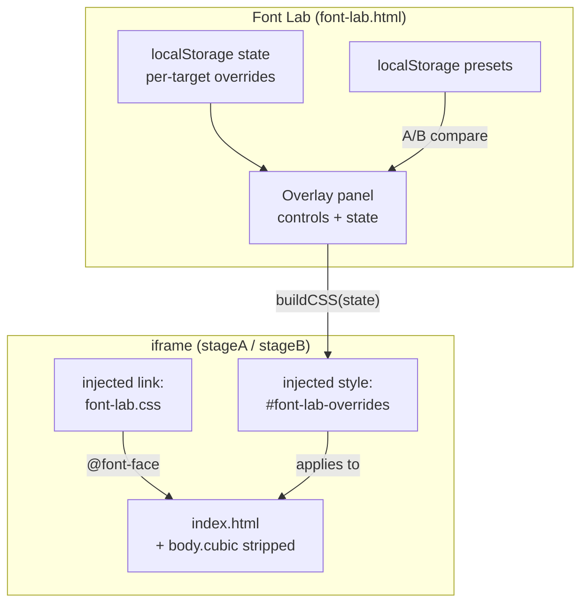

# Hyperslop Systems Infrastructure

This project is the web presence and infrastructure repository for Hyperslop Systems, a small independent software company. It contains a static landing page that presents four product areas — Datalab, Agentlogic, Powersite, and Hyperlang — and a font lab overlay tool for live typeface experimentation. The landing page ships with a cubic/Berkeley Mono typeface toggle, and the font lab allows a designer to compare sixteen typefaces across weight, italic, caps, size, spacing, alignment, and color before exporting the resulting CSS into the production page.

> [!summary]
> The repository has two important identities:
> 1. a production static landing page with a runtime typeface toggle and grey-text-on-hover product cards
> 2. a font lab overlay (`font-lab.html`) that injects `@font-face` declarations and live CSS overrides into an iframe copy of the landing page, with preset save/load and A/B side-by-side comparison

## Why this project exists

The landing page needed to present Hyperslop Systems' product areas with a strong typographic identity. The initial design used Berkeley Mono, a licensed monospace typeface, but the design was not final — multiple typefaces needed to be evaluated against the same layout before committing. Evaluating typefaces by hand-editing CSS for each candidate is slow and error-prone. The font lab exists to make that evaluation interactive: a designer opens the lab, selects a target element, picks a font, adjusts weight and spacing, and sees the result immediately. When the design is satisfactory, the lab exports the CSS.

The cubic/Berkeley toggle on the production page exists because OPS Cubic Trial was chosen as the default typeface but Berkeley Mono remains the fallback and the original identity. The toggle lets a visitor switch between them without reloading the page, and the choice persists in `localStorage`.

## Current project status

The repository is in active development with 13 commits across one day. The landing page is functional with the cubic mode as default. The font lab supports sixteen typefaces, per-target overrides, presets, A/B comparison, and CSS export. All font files — 20 Berkeley Mono static WOFF2 instances and 35 OPS Type trial OTF files — are committed to the repository for local development.

## Project shape

```
infra/
  README.md
  .gitignore
  scripts/
    install-ops-trial-fonts.sh
  site/
    index.html              — production landing page
    font-lab.html           — font lab overlay UI
    font-lab.js             — font lab logic (state, injection, presets, A/B)
    font-lab.css            — @font-face declarations for all 16 typefaces
    fonts/
      BerkeleyMono-*.woff2  — 20 static instances (Thin→Black, each + Oblique)
      BerkeleyMonoVariable-Regular.woff2
      BerkeleyMono-README.txt
      ops-trial/
        OPS*Cubic*.otf      — 35 OPS Type trial OTF files
        OPS Type EULA Test License.pdf
    landing-page.png        — original design reference
    landing-page.svg
```

The repository is private and hosted at `github.com/hyperslop-systems/infra`.

## Architecture

The system has two runtime contexts that share the same `index.html`:

1. **Production page** (`site/index.html`): a self-contained HTML file with inline CSS and a small inline script for the cubic/Berkeley toggle. It loads Berkeley Mono WOFF2 files via `@font-face` and applies the `body.cubic` class by default.

2. **Font lab** (`site/font-lab.html` + `font-lab.js` + `font-lab.css`): an overlay panel that renders the production page inside one or two `<iframe>` elements and injects CSS overrides into the iframe's document. The lab never mutates `index.html`; it appends a `<style id="font-lab-overrides">` element to the iframe's `<head>`.



### Font loading strategy

The font lab CSS (`font-lab.css`) declares 57 `@font-face` rules across two font collections:

- **Berkeley Mono** (20 static WOFF2): loaded via `url()` from committed files in `site/fonts/`. These are licensed under the LT-02 Developer Font License from U.S. Graphics and are safe to serve publicly.

- **OPS Type trials** (35 OTF across 14 families): loaded via `local()` first, with a `url()` fallback to `site/fonts/ops-trial/`. The `local()` call resolves against fonts installed by `scripts/install-ops-trial-fonts.sh`; the `url()` fallback ensures the fonts load even without a system install. The trial license prohibits public serving, but the repository is private and the fonts are committed for local development.

Each OPS Type `@font-face` rule follows this pattern:

```css
@font-face {
  font-family: "OPS Cubic Trial";
  src: local("OPS Cubic Trial Regular"),
       url(fonts/ops-trial/OPSCubicTrial-Regular.otf) format("opentype");
  font-weight: 400;
  font-style: normal;
  font-display: swap;
}
```

The `font-display: swap` property ensures text remains visible during font load, preventing a flash of invisible text.

### Iframe injection and the cubic class problem

The font lab renders `index.html` inside an iframe. When the iframe loads, the lab does three things:

1. **Strips the `body.cubic` class.** The production page applies `body.cubic` by default, which activates cubic-specific CSS rules like `body.cubic .product p { font-family: "OPS Cubic Trial", monospace; }`. These rules have CSS specificity `(0, 2, 1)`, which is higher than the lab's injected `.product p { font-family: ... }` at `(0, 1, 1)`. Without stripping the class, the lab's font switching would be silently overridden by the page's own cubic rules. This was a real bug: font switching appeared broken because the page's `body.cubic` selectors won the cascade.

2. **Injects `font-lab.css` as a `<link>`.** This makes the 57 `@font-face` declarations available inside the iframe's document context. Without this step, the iframe would only have the Berkeley Mono `@font-face` rules from `index.html` and would not be able to render OPS Type fonts.

3. **Injects `#font-lab-overrides` as a `<style>`.** This contains the generated CSS from the lab's current state. The lab regenerates and rewrites this element on every state change.

### State model

The lab maintains a per-target override state, persisted to `localStorage` under the key `hyperslop-font-lab`. The state is a dictionary keyed by CSS selector:

```javascript
{
  "all":             { fontFamily, weight, italic, caps, fontSize, letterSpacing, lineHeight, color, align, marginTop, marginBottom, marginLeft, marginRight },
  ".mark":           { ... },
  ".company":        { ... },
  ".tagline":        { ... },
  ".product h2":     { ... },
  ".product p":      { ... },
  ".product .status":{ ... },
  ".product .icon":  { ... },
  "footer":          { ... }
}
```

Each target has the same set of properties. Empty or zero values mean "inherit." The `"all"` target is special: when generating CSS, it expands to a selector list covering every text-bearing element on the page. Per-target rules are emitted after the `"all"` rule, so they override it via source order.

### CSS generation

The `buildCSS(state)` function iterates over all targets and emits a CSS rule for each target that has at least one non-default property. The generated CSS is a flat list of rules, not nested. This is deliberate: the lab injects the CSS into an iframe document that already has its own `<style>` block, and flat rules with sufficient specificity are the simplest way to override them.

```javascript
function buildCSS(s) {
  const rules = [];
  for (const t of TARGETS) {
    const ts = s[t.selector];
    if (all defaults) continue;
    const sel = t.selector === 'all'
      ? 'body, .mark, .company, .tagline, .product h2, .product p, .product .status, .product .icon, footer'
      : t.selector;
    const props = [];
    if (ts.fontFamily) props.push(`font-family: "${ts.fontFamily}", monospace`);
    if (ts.weight) props.push(`font-weight: ${ts.weight}`);
    if (ts.italic) props.push(`font-style: ${ts.italic}`);
    if (ts.caps) props.push(`text-transform: ${ts.caps}`);
    if (ts.fontSize > 0) props.push(`font-size: ${ts.fontSize}px`);
    // ... letterSpacing, lineHeight, color, align, margins
    rules.push(`${sel} { ${props.join('; ')}; }`);
  }
  if (layout === 'rows') rules.push(buildRowLayoutCSS());
  if (!gridLinesOn) rules.push(buildGridLinesCSS());
  rules.push(buildSpectrumCSS());
  return rules.join('\n');
}
```

### Inherited font weight resolution

When a target's font family is set to "inherit," the weight dropdown needs to show the weights of the font that the target will actually inherit. The `effectiveFontName()` function resolves this by checking three levels:

1. The current target's own `fontFamily` (if set).
2. The `"all"` target's `fontFamily` (if set).
3. The page default: `"Berkeley Mono"`.

The weight dropdown then populates with the resolved font's available weights and labels the inherit option accordingly: `— inherit (OPS And Ever Trial) —`. This tells the designer which font's weights they are choosing from without requiring them to trace the inheritance chain manually.

### Absolute font size

The font size control uses absolute pixels (`font-size: 48px`), not a relative scale. An earlier implementation used `font-size: calc(1em * scale)`, but this failed because the production page uses `clamp()` for its base font sizes. The `em` unit resolves relative to the element's computed font size, which is already the result of a `clamp()` expression. Multiplying that by a scale factor produces unpredictable results because `clamp()` is not a simple multiplier — it involves a minimum, a preferred value, and a maximum. Absolute pixels bypass this entirely: `48px` is `48px` regardless of the page's responsive font size logic.

### Presets and A/B comparison

Presets are stored in `localStorage` under the key `hyperslop-font-lab-presets`. A preset is a named snapshot of the entire per-target state object. The lab supports loading a preset back into the editor, deleting a preset, and using presets in A/B comparison mode.

A/B mode splits the viewport into two iframe panes. Each pane can be assigned a preset (or "Current" for the live editing state). The lab injects the corresponding state's CSS into each iframe independently, allowing side-by-side comparison of two typeface configurations. The pane labels (`A · Cubic Default`, `B · And Ever Bold`) indicate which preset is rendered on each side.

### Spectrum controls

The color spectrum bars (four colored bars under the company name) have three lab controls:

- **Width slider** (0–800px): sets `.spectrum { width: Npx }`. A value of 0 means "inherit default."
- **Thickness slider** (1–30px): sets `.spectrum span { height: Npx }`.
- **Match tagline width toggle**: sets `.spectrum { width: 100%; max-width: fit-content; margin: auto }`, which makes the bars match the width of the tagline text below them.

### Row layout

The lab can switch the product grid from a 4-column layout to a row layout where each product is a horizontal row. The row layout uses CSS grid with three columns: icon (72px), name+status (flexible), and description copy (2fr). The grid template places the icon in the first column spanning two rows, the product name in the second column first row, the status label in the second column second row, and the description in the third column spanning both rows.

```css
.product {
  display: grid;
  grid-template-columns: 72px minmax(150px, 1fr) 2fr;
  grid-template-rows: auto auto;
  align-items: center;
  column-gap: 24px;
  row-gap: 4px;
  text-align: left;
}
.product .icon { grid-column: 1; grid-row: 1 / 3; }
.product h2 { grid-column: 2; grid-row: 1; }
.product .status { grid-column: 2; grid-row: 2; }
.product p { grid-column: 3; grid-row: 1 / 3; }
```

## Implementation details

### The cubic/Berkeley toggle

The production page (`index.html`) has a `<body class="cubic">` by default. A toggle button in the top-left corner switches between cubic and Berkeley Mono modes by toggling the `cubic` class on `<body>`. The choice persists in `localStorage` under the key `hyperslop-font-mode`.

The CSS structure separates base styles (Berkeley Mono) from cubic overrides. The base styles define every element with Berkeley Mono font families, standard margins, and the original color scheme. The `body.cubic` rules override specific properties:

| Element | Base (Berkeley) | Cubic override |
|---------|-----------------|----------------|
| `.mark` | `clamp(8rem, 30vw, 400px)`, weight 700, Berkeley Mono | `200px`, weight 700, OPS Cubic Trial, `letter-spacing: -.015em` |
| `.company` | `letter-spacing: .34em` | `letter-spacing: -.025em` |
| `.tagline` | `clamp(1rem, 2vw, 1.45rem)`, muted color | `18px`, `letter-spacing: .055em`, white, adjusted margins |
| `.product h2` | Berkeley Mono | Berkeley Mono Variable |
| `.product p` | Berkeley Mono, `1.03rem`, dark grey | OPS Cubic Trial, `21px`, `line-height: 1.25`, dark grey |

The toggle script is minimal:

```javascript
(function() {
  var body = document.body;
  var btn = document.getElementById('fontToggle');
  try {
    if (localStorage.getItem('hyperslop-font-mode') === 'berkeley') {
      body.classList.remove('cubic');
      btn.textContent = 'Berkeley';
    }
  } catch(e) {}
  btn.addEventListener('click', function() {
    var isCubic = body.classList.toggle('cubic');
    btn.textContent = isCubic ? 'Cubic' : 'Berkeley';
    try { localStorage.setItem('hyperslop-font-mode', isCubic ? 'cubic' : 'berkeley'); } catch(e) {}
  });
})();
```

### Grey product text with hover reveal

Product descriptions and status labels are dark grey (`#3a3d42`) by default, making them nearly invisible against the `#050607` background. On hover, they transition to white (`#ffffff`). Product names remain visible at all times. This creates an interactive reveal effect: the product name draws the eye, and hovering the card reveals the description.

The hover rules exist in both the base and cubic-specific forms to handle CSS specificity:

```css
.product p { color: #3a3d42; transition: color 150ms ease; }
.product .status { color: #3a3d42; transition: color 150ms ease; }

@media (hover: hover) {
  .product:hover p { color: #ffffff; }
  .product:hover .status { color: #ffffff; }
  body.cubic .product:hover p { color: #ffffff; }
  body.cubic .product:hover .status { color: #ffffff; }
}
```

The `body.cubic` hover rules are necessary because `body.cubic .product p` has specificity `(0, 2, 1)`, which would override `.product:hover p` at `(0, 2, 0)` without the cubic-specific hover rule at `(0, 3, 1)`.

### Hyperlang SVG icon fix

The Hyperlang product icon is an abstract syntax tree rendered as inline SVG. It consists of white connector lines (drawn first) and red-outlined square nodes (drawn second). The original SVG used `fill="none"` on the square nodes, which meant the white connector lines were visible inside the squares — they showed through the transparent interior.

The fix was to fill the squares with the page background color (`#050607`):

```svg
<g stroke="currentColor" stroke-width="5" fill="#050607">
  <rect x="56" y="5" width="20" height="20" rx="1" />
  ...
</g>
```

This causes the squares to occlude the white lines behind them. The lines are only visible in the gaps between nodes, which is the intended visual.

### Color palette with addable presets

The font lab's color section provides a dropdown of white and gray presets (Bone, Warm white, Pure white, Light grey, Muted grey, Dim grey, Dark grey). Custom colors can be added via a color picker and optional name. The palette persists in `localStorage` under the key `hyperslop-font-lab-palette`. The default palette is hardcoded; user-added colors are appended and survive page reloads.

## Common failure modes

### Stale localStorage overriding font switching

**Symptom:** Selecting a different font family in the lab has no visible effect on certain elements.

**Cause:** The lab persists per-target overrides to `localStorage`. If a previous session set `.product h2` to `Berkeley Mono Variable`, that override persists across page reloads. When the user changes the `"all"` target's font family, the `.product h2` override still wins because it is emitted after the `"all"` rule in the generated CSS.

**Fix:** Click Reset in the lab to clear all per-target overrides to their default (inherit) state.

### body.cubic specificity overriding lab injections

**Symptom:** Font switching does not work at all, even after Reset.

**Cause:** The production page's `body.cubic .product p` selector has specificity `(0, 2, 1)`. The lab's injected `.product p` selector has specificity `(0, 1, 1)`. The page's rule wins the cascade, so the lab's font family declaration is ignored.

**Fix:** The lab strips the `body.cubic` class from the iframe on load, removing the cubic-specific rules from the cascade. This was implemented in commit `7539aec`.

### Relative font size not working with clamp()

**Symptom:** The size scale slider has no effect on text size.

**Cause:** The production page uses `clamp(8rem, 30vw, 400px)` for the `.mark` element. The lab's `font-size: calc(1em * 1.5)` resolves `1em` relative to the element's computed font size, which is already the result of the `clamp()`. The multiplication does not produce a predictable scale because `clamp()` is not a linear function.

**Fix:** Use absolute pixels (`font-size: 48px`) instead of a relative scale. Absolute values override the `clamp()` entirely.

## Important project docs

- Repository: `/home/manuel/code/wesen/hyperslop-systems/infra`
- Production page: `/home/manuel/code/wesen/hyperslop-systems/infra/site/index.html`
- Font lab UI: `/home/manuel/code/wesen/hyperslop-systems/infra/site/font-lab.html`
- Font lab logic: `/home/manuel/code/wesen/hyperslop-systems/infra/site/font-lab.js`
- Font declarations: `/home/manuel/code/wesen/hyperslop-systems/infra/site/font-lab.css`
- Font installer: `/home/manuel/code/wesen/hyperslop-systems/infra/scripts/install-ops-trial-fonts.sh`
- GitHub: `https://github.com/hyperslop-systems/infra` (private)

## Open questions

- Should the font lab support padding controls in addition to margins?
- Should the color palette support deleting custom colors?
- Should the row layout be persisted as part of presets?
- Should the spectrum "match tagline width" toggle use a JavaScript measurement rather than `fit-content` for more precise matching?

## Near-term next steps

- Add padding controls (top/bottom/left/right) to the Spacing section.
- Add a delete button for custom palette colors.
- Consider adding a "Copy HTML" export that bundles the CSS into `index.html` directly.
- Clean up `.playwright-mcp` screenshot artifacts from the repo root.

## Project working rule

When modifying the font lab, always test font switching after changes to `index.html`. Any new CSS rule in `index.html` that uses a `body.cubic` prefix has the potential to override the lab's injected styles. If font switching breaks, check whether a new `body.cubic` rule has higher specificity than the lab's injected selector.
