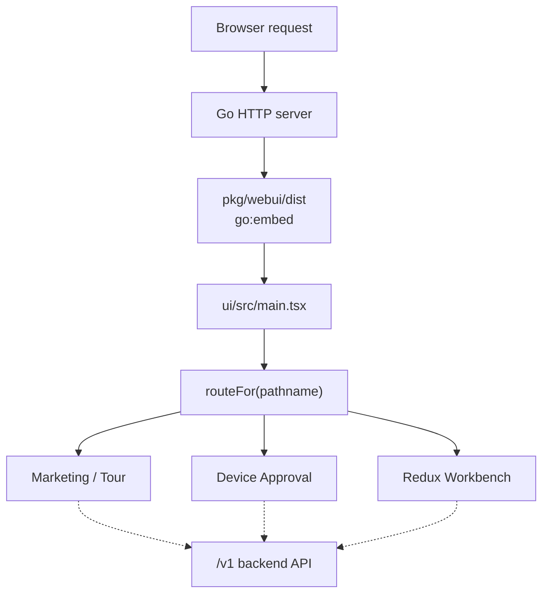
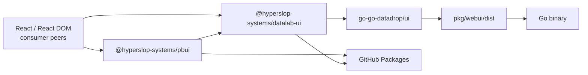
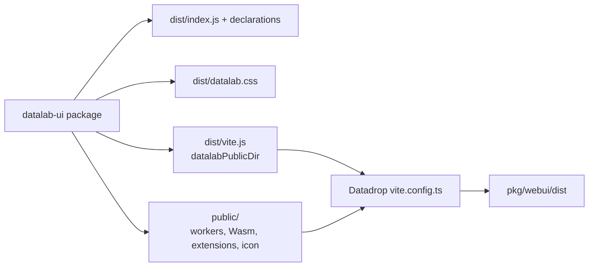

# PBUI and Datalab UI: The Completed Frontend Package Refactor

The DATADROP-17 refactor converted a React application embedded inside a Go repository into two independently built and published packages. `@hyperslop-systems/pbui` now owns generic presentation mechanics and domain-neutral components. `@hyperslop-systems/datalab-ui` owns the complete Datalab frontend. `go-go-datadrop` retains the backend, the executable browser shell, and the `go:embed` output.

This report explains the completed architecture and the work required to reach it. It focuses on the boundaries that make the result maintainable: how generic PBUI differs from a product UI, why descriptors remain product-owned, how components were classified, how a browser-heavy application became a side-effect-free library, and how the published artifacts are consumed by a Go binary.

> [!summary]
> - The extraction produced two immutable GitHub npm packages: `@hyperslop-systems/pbui@0.1.0` and `@hyperslop-systems/datalab-ui@0.1.0`.
> - PBUI owns mechanisms: typed presentation references, descriptor registry behavior, interaction state, and reusable visual components. Datalab UI owns vocabulary and policy: fields, documents, stages, verbs, Redux, RTK Query, DuckDB, applications, and pages.
> - The original frontend was not copied wholesale into a package. It was separated in dependency order, with tests and Storybook stories moving beside each implementation.
> - The Go repository now consumes the exact published Datalab version through an eight-file Vite shell and embeds the resulting `/static/` assets.

## 1. The starting system

Before the refactor, `go-go-datadrop/ui` was simultaneously an application, a component system, a product-domain implementation, and a build step in the Go binary. Its browser entry classified the current URL, created the product Redux store, restored persisted workbench state, selected one of four route families, and mounted React into `#root`. Vite emitted directly into `pkg/webui/dist`, where Go embedded the generated files.

The source was already internally structured. It had a pure table and graphic model, a DuckDB-Wasm analysis runtime, an RTK Query API layer, Redux state and effects, a presentation protocol, application containers, six component layers, pages, tests, and Storybook. This mattered because the extraction could preserve an existing dependency graph instead of inventing a package boundary based on directory names.

At the reanalysis baseline, the frontend contained approximately 41,827 lines of TypeScript, TSX, and CSS, 104 public component directories, 106 Storybook story files, and more than four hundred tests. The eventual Datadrop shell commit removed 52,411 lines from the Go repository because the maintained implementation, tests, stories, and assets moved to the PBUI repository.



The first design decision was therefore not “which files should move?” It was “which concepts should become compatibility contracts?” Publishing a package turns internal imports, CSS entry points, peer dependency ranges, public types, build assets, and side effects into obligations for consumers.

## 2. The target ownership model

The completed system uses three ownership boundaries.

| Owner | Responsibility | Explicitly does not own |
|---|---|---|
| `@hyperslop-systems/pbui` | Generic presentation protocol, foundation, layout, neutral atoms, neutral molecules, reusable organisms, visualization algorithms | Datalab models, routes, descriptors, Redux, RTK Query, DuckDB, product copy |
| `@hyperslop-systems/datalab-ui` | Complete Datalab product, branded components, descriptors, state, API, analysis, applications, pages, fixtures, public assets | DOM mounting, Go embed destination, host development proxy |
| `go-go-datadrop/ui` | Executable mounting, Vite host policy, exact package dependency, `/static/` build output, `/v1` development proxy | Maintained product source, product tests, component stories |



The one-way edge from PBUI to Datalab is the central invariant. Datalab may compose PBUI. PBUI must not import the Datalab model or encode its nouns. This rule is stronger than avoiding one circular dependency: it keeps the generic package useful to a consumer that has no documents, fields, uploads, stages, or workspaces.

The frontend brand changed from Datadrop to Datalab at this boundary. The package and React product are Datalab. The Go repository, backend API, Go module, and historical ticket names remain Datadrop. The refactor did not introduce a compatibility alias because none was requested.

## 3. PBUI is a typed presentation protocol

PBUI's most important reusable subsystem is not a collection of buttons. It is a protocol connecting domain values, visual presentations, user interactions, and host-owned effects.

A `PresentationValues` map defines the closed vocabulary for one consumer. PBUI derives a discriminated reference from that map:

```ts
export type PresentationReference<
  Values extends object,
  Type extends Extract<keyof Values, string> = Extract<keyof Values, string>,
> = {
  [Key in Type]: {
    type: Key;
    value: Values[Key];
  };
}[Type];
```

If a product declares that `person` maps to `Person` and `project` maps to `Project`, a `person` reference cannot carry a project value. This relationship remains intact through labels, descriptions, actions, accept requests, conversions, menus, and JSX.

An earlier constraint used `Record<string, unknown>`. That was incorrect because its index signature widened `keyof Values` to arbitrary strings and collapsed descriptor values to `unknown`. Constraining the map to `object` preserves its actual keys.

The registry maps each presentation type to a descriptor:

```ts
const registry = createPresentationRegistry<Values, Environment, Verb>({
  person: {
    label: (person) => person.name,
    describe: (person) => person,
    actions: (person) => [
      { id: "select", label: "Select", verb: { type: "select", id: person.id } },
    ],
    tone: "accent",
  },
});
```

The descriptor does not execute Redux actions or issue network requests. It returns a serializable verb. The host performs that verb through the provider's `onPerform` callback. This separates product decision logic from execution infrastructure and makes descriptor behavior testable with literal values and environments.

`createPbui` closes over a registry and creates an isolated React context. It returns the provider, hook, presentation wrapper, and object menu for that vocabulary. Multiple workbenches can coexist without sharing pending accept state, menus, mouse documentation, or environment.

```text
createPbui(registry, defaults)
    -> Provider
    -> usePbui
    -> Presentation
    -> ObjectMenu

Presentation click
    if an accept request matches:
        resolve accept(reference)
    else if activation exists:
        activate()
    else:
        open object menu(reference, coordinates)

Object-menu action
    -> provider.perform(serializableVerb)
    -> Datalab host dispatches reducer action, thunk, or effect
```

The runtime preserves production interaction semantics: HTML and SVG wrappers, left-click activation, right-click menus, keyboard menu access, accept operations, conversions, disabled reasons, focus navigation, viewport clamping, click-away dismissal, Escape dismissal, and mouse documentation. The first generic scaffold intentionally grew to match the existing product before the old runtime was deleted.

## 4. Why `datalab-ui/pbui/descriptors/*` remains product code

The directory name `pbui/descriptors` can suggest that the files belong in the generic PBUI package. They do not. The descriptors use the generic PBUI protocol, but they define the Datalab presentation vocabulary.

The Datalab `PresentationValues` interface maps types such as:

- `field` to `FieldRef`;
- `source` to `SourceRef`;
- `doc` to a document identifier;
- `datum` and `cat` to document-bound table values;
- `tile`, `workspace`, and `stage` to layout references;
- `user`, `token`, and `member` to access-management references;
- `upload` to an upload-state reference;
- `traceEntry` to a stable trace sequence identifier.

These values are not generic UI primitives. They encode Datalab state and rules. A `TokenRef`, for example, deliberately contains token identity, scopes, expiration, and revocation but never contains a secret. Presentation values can flow into inspectors, traces, watchlists, and persisted browser state. Excluding the secret structurally prevents those flows from leaking it.

Descriptors also depend on a narrowly defined `PbuiEnvironment`:

```ts
export interface PbuiEnvironment {
  fieldsFor(docId: string | null): Field[];
  tableFor(docId: string | null): Table | null;
  activeDocId: string | null;
  nameOf(docId: string | null): string;
}
```

The split between `fieldsFor` and `tableFor` protects rendering performance. `fieldsFor` derives post-pipeline schema without processing rows and is safe in component render paths. `tableFor` evaluates the full table and is reserved for menu-time descriptions and actions. A test rejects component code that calls the expensive path.

Each file under `packages/datalab-ui/src/pbui/descriptors/` defines one unit of product policy. `field.ts` decides how a field is labeled, inspected, and acted upon. `tile.ts` determines whether a tile can be renamed, duplicated, or closed. `workspace.ts` and `stage.ts` enforce pinned and last-item rules. `token.ts` and `member.ts` encode security and ownership restrictions. These are pure functions, but purity does not make them generic.

The product registry adapts those descriptors to the generic registry:

```ts
function bindProductDescriptor<Value>(
  descriptor: ProductDescriptor<Value>,
): GenericDescriptor<Value, PbuiEnvironment, Action["verb"]> {
  return {
    label: descriptor.label,
    describe: descriptor.describe,
    tone: descriptor.tone,
    actions: (value, environment) =>
      descriptor.actions(value, environment).map((action, index) => ({
        id: `${descriptor.ptype}:${index}:${action.label}`,
        label: action.label,
        verb: action.verb,
        disabled: action.disabledBecause !== undefined,
        disabledReason: action.disabledBecause,
      })),
  };
}
```

This adapter is not a backwards-compatibility layer. It is the intentional boundary between a product descriptor contract and the reusable PBUI registry contract. The generic package knows how to register and invoke descriptors; Datalab knows what the descriptors mean.

## 5. Component classification

The refactor classified components by dependency and vocabulary, not by Atomic Design names alone. An atom can be product-specific, and an organism can be reusable.

PBUI now owns the complete neutral foundation and layout layers:

- Foundation: `Text`, `SectionLabel`, `CodeText`, `Divider`, `Kbd`, and `VisuallyHidden`.
- Layout: `AppBody`, `Stack`, `Surface`, and `Toolbar`.

Its generic atoms include ordinary controls and neutral displays: `Button`, `CheckboxRow`, `Chip`, `CodeLine`, `IconButton`, `LinkAction`, `Meter`, `SelectInput`, `Sparkline`, `Swatch`, `TextArea`, and `TextInput`.

Generic molecules include `Callout`, `DiffHunk`, `EmptyState`, `FileDropZone`, `InlineRename`, `KindLegend`, `Legend`, `MoreBar`, `ResultLog`, and `SegmentedBar`. These components accept data and callbacks that make sense outside Datalab. Their names and props do not mention documents, fields, uploads, workspaces, or product verbs.

PBUI also owns three reusable organisms:

- `TransportBar` composes transport controls and status without assuming a specific API client.
- `BackdropPanel` renders a supplied collection and renderer rather than reading the Datalab store.
- `RadarPanel` consumes generic radar inputs and uses the package's pure geometry engine.

The radar engine moved with algorithm tests. It owns coordinate calculation and refusal invariants independently of React. Keeping geometry beside the reusable visualization prevents the product package from becoming a hidden algorithm dependency.

Datalab retains atoms such as `FieldChip`, `DocChip`, `SourceChip`, `TokenChip`, `TypeBadge`, and `ProvenanceBadge`. Their rendering may use PBUI's generic `Chip`, but their props and semantics are Datalab concepts.

Datalab-specific molecules include `DocBar`, `DraftResumeList`, `MemberRow`, `ModuleCard`, `ScopeChecklist`, `SpecDiff`, `StepEditor`, `TokenRow`, and `UploadQueueList`. They encode product workflows or model types even when visually compact.

Datalab-specific organisms include `ChartPanel`, `EncodingPanel`, `PipelinePanel`, `SourcePanel`, `TablePanel`, `TracePanel`, `UploadPanel`, `WorkspaceStrip`, account panels, tutorial compositions, and the tiled workbench. These components coordinate product state, applications, API behavior, or descriptors. Moving them into PBUI would make the generic package depend on the product.

The classification question for each component was:

1. Does its public API use only React, DOM, primitive data, or neutral view models?
2. Does its implementation import Datalab model, state, API, analysis, descriptors, or brand?
3. Does its story require Datalab fixtures or product providers?
4. Would its name and behavior remain coherent in a different product?

A component moved only when the answers supported generic ownership. When a reusable implementation had a product-coupled story, the story was rewritten to use neutral data before moving.

## 6. Storybook moved with ownership

Storybook was treated as part of the package contract. Every moved stateful component retained an adjacent story or an explicit exemption. This prevented the extraction from leaving visual documentation in the old repository, where it would compile against local paths and conceal incomplete package exports.

The generic PBUI Storybook uses non-Datalab examples. Its presentation story uses people and projects to prove that the registry and provider have no product dependency. Component stories cover default state, disabled and error states, theme overrides, unstyled rendering, custom renderers, and isolated providers where relevant.

The Datalab Storybook moved with the complete product package. It continues to exercise descriptor-backed atoms, application containers, workbench composition, pages, tutorials, and product fixtures. Both static Storybook builds are release gates.

One subtle failure demonstrated why directory-level coverage matters. After component files were removed from Datadrop, empty directories remained on disk. Architecture tests failed even though Git no longer tracked implementations. Removing the empty directories completed the ownership transfer.

## 7. Styling as an explicit package API

PBUI does not install global styling merely because JavaScript was imported. It publishes opt-in CSS:

```json
{
  "exports": {
    ".": "./dist/index.js",
    "./styles.css": "./dist/pbui.css",
    "./components.css": "./dist/components.css"
  },
  "sideEffects": ["**/*.css"]
}
```

Stable `data-pbui` and `data-part` attributes provide cross-package styling hooks. Semantic `--pbui-*` variables allow a host theme to customize behavior without depending on generated CSS-module class names. Defaults are expressed at use sites as `var(--token, fallback)` so parent-provided values continue to inherit.

Datalab publishes its complete product stylesheet at `@hyperslop-systems/datalab-ui/styles.css`. It imports and composes the package layers in a deterministic order, then applies DATA LAB brand tokens. The executable shell imports this single product CSS entry.

## 8. Turning the complete application into a library

A library entry cannot behave like an executable entry. Importing Datalab UI must not query the DOM, mount React, construct a store, read browser storage, or select a route as an uncontrolled side effect.

The public `DatalabApp` component accepts an optional pathname and strict-mode setting:

```ts
export function DatalabApp({ pathname, strict = true }: DatalabAppProps) {
  const resolvedPathname =
    pathname ?? (typeof window === "undefined" ? "/" : window.location.pathname);
  const route = routeFor(resolvedPathname);

  const body =
    route.kind === "device" ? <DeviceApprovalPage /> :
    route.kind === "marketing" || route.kind === "tour" ?
      <AnalysisProvider principalKey="embedded-fixtures">
        <MarketingPage />
      </AnalysisProvider> :
      <Product />;

  return strict ? <StrictMode>{body}</StrictMode> : body;
}
```

The product store is created lazily inside the workbench route. Marketing, tour, and device routes do not restore or mutate workbench persistence. This makes package import safe for tests, server rendering, Storybook, and hosts that render only selected product surfaces.

The public API remains intentionally small:

- `DatalabApp` and `DatalabAppProps`;
- `WorkbenchInstance` and `InstanceConfig`;
- `routeFor` and `Route`;
- the product stylesheet;
- a Node-side Vite helper.

Internal stores, slices, descriptors, applications, and hundreds of components are packaged but are not all public compatibility contracts.

## 9. DuckDB and the two-environment build

Datalab UI uses `@duckdb/duckdb-wasm` in the browser. The final package must support two distinct consumers:

1. JavaScript consumers import the library and its declarations.
2. Vite configuration running under Node needs the path to package-owned static assets.

The browser library build externalizes React, Redux, PBUI, and DuckDB package imports. It emits ESM, declarations, source maps, and deterministic CSS. Public DuckDB workers, Wasm bundles, JSON extensions, and the Datalab icon remain package assets.

The package's `./vite` export is built separately for Node and exposes `datalabPublicDir`. The Go-owned Vite shell uses that value as `publicDir`, so Vite copies the workers and Wasm files into the embedded output without hard-coding a path inside `node_modules`.



This is why the package build uses browser and Node configurations rather than forcing one Vite bundle to represent both runtime environments.

## 10. Redux Toolkit, Immer, and declaration emission

Immer is a runtime dependency used by Redux Toolkit's reducer machinery. It permits reducer code written with mutable syntax while producing immutable state updates. Removing Immer was never the goal.

The packaging problem appeared in TypeScript declarations. Exported slice objects had inferred types that referenced Redux Toolkit's internal Immer-related types. Declaration emission then made implementation details part of the package's public type surface. The correct response was to narrow public exports and annotate stable boundaries, not to replace Redux Toolkit or Immer.

The rule is:

```text
internal slice implementation
    may use createSlice, Draft, current, isDraft

public package entry
    exports stable product components and explicit types
    does not export inferred slice implementation types
```

This distinction is important in any TypeScript library. A runtime can work correctly while declaration generation fails because the compiler must name every type reachable from an exported symbol. Package builds therefore need declaration emission as a first-class gate, not only application typechecking.

## 11. Release engineering

Both packages are published to `https://npm.pkg.github.com` with restricted access. React and React DOM are peers, which ensures the embedding application supplies one React runtime. Datalab UI depends on PBUI inside the workspace and resolves it as a normal package version in the published manifest.

Every release gate validates more than source compilation:

- frozen pnpm installation;
- TypeScript typechecking;
- unit and architecture tests;
- library and declaration builds;
- static Storybook build;
- package creation;
- installation of the produced tarball in a clean temporary consumer;
- consumer TypeScript and Vite builds;
- explicit confirmation before publishing the `latest` tag.

The clean-consumer test detects errors hidden by a monorepo: undeclared dependencies, workspace hoisting, missing declarations, incorrect exports, missing CSS, and public assets that were never packed.

The first standalone Datalab release failed because it typechecked Datalab before building its workspace dependency. PBUI's exports correctly pointed to generated `dist` files, but those files did not exist on a clean runner. Combined CI had concealed the ordering constraint because it built PBUI earlier. Adding an explicit root PBUI build to the Datalab release workflow made dependency order part of the release contract.

The release sequence was immutable:

1. Validate the complete workspace.
2. Publish `@hyperslop-systems/pbui@0.1.0`.
3. Verify the publisher acknowledgement.
4. Build Datalab against PBUI.
5. Publish `@hyperslop-systems/datalab-ui@0.1.0`.
6. Generate the Datadrop lockfile from the registry.
7. Cut the Go repository to the exact Datalab version.

The resulting artifacts are:

| Package | Compressed | Unpacked | Files | SHA-1 |
|---|---:|---:|---:|---|
| `@hyperslop-systems/pbui@0.1.0` | 104.4 kB | 356.0 kB | 183 | `e598a50677a38b397fb34a068897c277dd291e23` |
| `@hyperslop-systems/datalab-ui@0.1.0` | 883.2 kB | 3.9 MB | 552 | `33493ac48c02097dee3f9e3b50ec2ffc9526148d` |

## 12. Package authentication and token handling

GitHub Actions publishes with its short-lived `GITHUB_TOKEN` and `packages: write`. Consumers in Actions should use a per-run `GITHUB_TOKEN` with `packages: read` after repository access is granted to both packages.

Local GitHub npm clients require a classic PAT with `read:packages`. The Datadrop shell commits only registry routing:

```ini
@hyperslop-systems:registry=https://npm.pkg.github.com
//npm.pkg.github.com/:_authToken=${NODE_AUTH_TOKEN}
always-auth=true
```

The token is stored in Vault at:

```text
kv/ci/github/go-go-datadrop/packages-read-token
field: token
```

Make targets prefer an existing `NODE_AUTH_TOKEN` and otherwise read the Vault field into the process environment. They do not print or commit it.

Vault can version, distribute, and revoke access to the stored PAT, but it cannot ask GitHub to create a replacement classic PAT automatically. Local token creation and rotation therefore remain manual GitHub operations followed by a new Vault KV version. Expiration monitoring and reminders can be automated. CI avoids this lifecycle by using short-lived `GITHUB_TOKEN` credentials.

A misleading 403 during the refactor came from running `npm view` at the repository root. npm ignored `ui/.npmrc` and reused a stale user-level token. Direct API checks proved the new token had exactly `read:packages`; running from `ui/` with `NODE_AUTH_TOKEN` used the intended configuration.

## 13. The final Datadrop shell

The maintained `go-go-datadrop/ui` tree now contains only:

```text
ui/
├── .gitignore
├── .npmrc
├── index.html
├── package.json
├── pnpm-lock.yaml
├── src/main.tsx
├── tsconfig.json
└── vite.config.ts
```

Its entire React entry is:

```tsx
import { createRoot } from "react-dom/client";
import { DatalabApp } from "@hyperslop-systems/datalab-ui";
import "@hyperslop-systems/datalab-ui/styles.css";

const container = document.getElementById("root");
if (!container) throw new Error("#root is missing from the page shell");

createRoot(container).render(<DatalabApp />);
```

The manifest pins `@hyperslop-systems/datalab-ui` to exact version `0.1.0`. Exact pinning makes the embedded binary reproducible. A later package release cannot silently change a Go build until the consumer lockfile and package version are deliberately updated.

The host Vite configuration preserves Datadrop deployment policy:

- development base `/`;
- production base `/static/`;
- output directory `../pkg/webui/dist`;
- Datalab's package-owned public directory;
- `/v1` development proxy to the Go server on port 8080.

The final build emits hashed application JavaScript, Datalab CSS, DuckDB browser workers, both Wasm bundles, extension JSON, the Datalab icon, and `index.html`. Go embeds these files exactly as before. The backend deployment contract did not change; source ownership did.

One backend-owned fixture had been stored under the former frontend test tree. The shell deletion exposed this violation when `pkg/tabular` tests failed. The fixture moved to `pkg/tabular/testdata/envelope-projection.json` and was regenerated from Go. This illustrates a useful extraction test: when removing a directory breaks another subsystem, the dependency reveals which owner was previously hidden.

## 14. Validation and observed failures

The final state passed:

- PBUI typecheck, 26 tests, build, Storybook, pack, and clean-consumer smoke;
- Datalab typecheck, 436 tests, lint, build, Storybook, pack, and clean-consumer smoke;
- a complete workspace GitHub Actions matrix;
- a clean frozen install of both published packages;
- the thin shell typecheck and Vite build;
- `make ui` and `make ui-test`;
- the complete Go test suite with `GOWORK=off`;
- final `pkg/webui` embed tests.

Several failures carried architectural information:

- A stale parent `go.work` declared Go 1.25 while the module required 1.26.1. Release validation uses `GOWORK=off`.
- The sandbox's Go cache was read-only. Moving `GOCACHE` to `/tmp` separated environment failure from source failure.
- Local test sockets were denied by the sandbox. Running the same suite with socket permission exposed the real missing-fixture ownership problem.
- Root pnpm filters did not select the root publishable package as assumed. `pnpm --workspace-root run <script>` is the validated form.
- Root Vitest initially discovered Datalab tests under the wrong configuration. An explicit root `include` boundary separated package test suites.
- A Datalab release typecheck could not resolve PBUI because the dependency had not been built. The workflow now encodes build order.
- A transient npm peer-resolution run reported `react@undefined` despite compatible declared ranges. A clean rerun installed and built successfully; no peer range was weakened.
- A CI artifact upload warns that `.artifacts/*.tgz` is absent. Pack and release steps pass, and publication does not consume that optional CI artifact. The warning is non-blocking but should be cleaned up.

## 15. How to modify the system safely

A future contributor should begin by choosing the owner of a change.

For generic PBUI:

1. Confirm the props and vocabulary are product-neutral.
2. Add implementation, tests, and adjacent stories in `pbui/src`.
3. Export only the intended public symbol.
4. Validate both styled and unstyled behavior where applicable.
5. Build and test a packed clean consumer.
6. Update Datalab to consume the package symbol directly; do not add a local compatibility barrel.

For Datalab product behavior:

1. Work under `packages/datalab-ui/src`.
2. Keep descriptors pure and keep components out of descriptor files.
3. Return serializable verbs from descriptor actions.
4. Use `fieldsFor` in render paths and reserve `tableFor` for explicit interactions.
5. Preserve Storybook coverage and package declaration emission.
6. Validate the package through its public entry, not only workspace-relative imports.

For the Go consumer:

1. Publish immutable package versions first.
2. Update the exact Datalab dependency and registry-generated lockfile.
3. Run a clean frozen install using a package-reader credential.
4. Rebuild `pkg/webui/dist`.
5. Run the complete Go suite with the repository's isolated workspace setting.
6. Commit the manifest, lockfile, shell, and regenerated embed together.

## 16. Current status and next work

The refactor itself is complete. Both packages are published, the Datadrop consumer uses the registry version, the full validation matrix passes, the ticket is closed, and the final documentation bundle is on reMarkable.

The near-term work is operational rather than architectural:

- Open and review the Datadrop `task/split-datadrop` pull request.
- Decide whether package access should remain restricted or be broadened.
- Grant consuming GitHub repositories explicit package read access and use their short-lived `GITHUB_TOKEN`.
- Remove the non-blocking `.artifacts/*.tgz` CI warning.
- Add browser-level interaction coverage for object-menu focus, right-click, Escape, and click-away behavior if those interactions become release-critical.
- Establish a release/versioning policy before publishing 0.2.0.

Widget DSL and IR rendering remain deliberately outside this refactor. They should be designed against the now-stable package boundaries rather than folded retroactively into PBUI 0.1.0.

## 17. Source map

The primary implementation locations are:

- Generic package manifest: `/home/manuel/workspaces/2026-07-28/split-datadrop/pbui/package.json`
- Generic protocol: `/home/manuel/workspaces/2026-07-28/split-datadrop/pbui/src/presentation`
- Generic component system: `/home/manuel/workspaces/2026-07-28/split-datadrop/pbui/src/components`
- Datalab package manifest: `/home/manuel/workspaces/2026-07-28/split-datadrop/pbui/packages/datalab-ui/package.json`
- Datalab public entry: `/home/manuel/workspaces/2026-07-28/split-datadrop/pbui/packages/datalab-ui/src/index.ts`
- Datalab application entry: `/home/manuel/workspaces/2026-07-28/split-datadrop/pbui/packages/datalab-ui/src/DatalabApp.tsx`
- Datalab descriptors: `/home/manuel/workspaces/2026-07-28/split-datadrop/pbui/packages/datalab-ui/src/pbui/descriptors`
- Datalab model, analysis, API, and store: `/home/manuel/workspaces/2026-07-28/split-datadrop/pbui/packages/datalab-ui/src`
- Package release workflows: `/home/manuel/workspaces/2026-07-28/split-datadrop/pbui/.github/workflows`
- Datadrop shell: `/home/manuel/workspaces/2026-07-28/split-datadrop/go-go-datadrop/ui`
- Embedded output: `/home/manuel/workspaces/2026-07-28/split-datadrop/go-go-datadrop/pkg/webui/dist`
- Design guide: `/home/manuel/workspaces/2026-07-28/split-datadrop/go-go-datadrop/ttmp/2026/07/28/DATADROP-17--extract-the-react-frontend-into-reusable-pbui-packages/design-doc/01-pbui-package-extraction-analysis-design-and-implementation-guide.md`
- Complete implementation diary: `/home/manuel/workspaces/2026-07-28/split-datadrop/go-go-datadrop/ttmp/2026/07/28/DATADROP-17--extract-the-react-frontend-into-reusable-pbui-packages/reference/01-diary.md`

## 18. Project record

The generic package history ends at PBUI commit `fecb3e1`, after fixing the standalone Datalab release order. The Datadrop extraction branch ends at `f24b605`, after the package-consumer cutover and final ticket handoff. The earlier vault note [[PROJ - PBUI and Datalab UI - Extracting a React Product from a Go Repository]] records the project while declaration emission and package publication were still unresolved. This report records the completed system.
