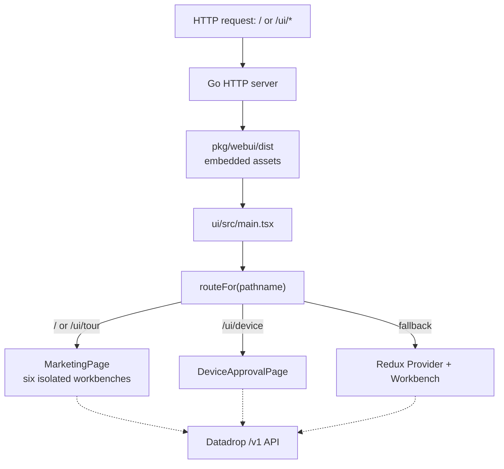
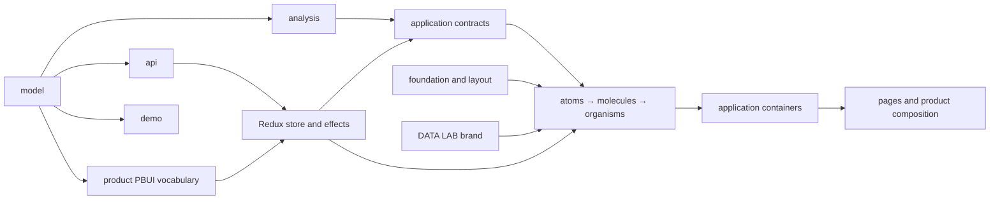
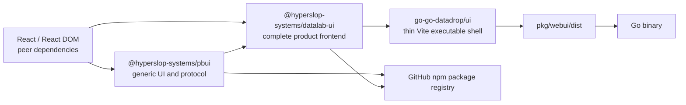

# PBUI and Datalab UI: Extracting a React Product from a Go Repository

This project separates a large React frontend from `go-go-datadrop` without weakening its existing architecture or misclassifying product code as a generic component library. The target has three explicit ownership boundaries: `@hyperslop-systems/pbui` owns reusable presentation mechanics and domain-neutral components, `@hyperslop-systems/datalab-ui` owns the complete branded frontend, and `go-go-datadrop` retains the Go server plus the browser executable and embed shell.

The work is active. Generic PBUI has been extracted, validated, and committed. The complete Datalab package has been copied into the PBUI repository and its tests pass, but that package is not yet a valid release artifact. TypeScript declaration emission currently exposes an inferred Immer type through internal Redux Toolkit slice exports, and the library build still needs a clean DuckDB, CSS, and Node-side Vite-helper contract. The Go repository has therefore not yet been cut over.

> [!summary]
> - Generic PBUI is a typed presentation runtime plus reusable visual components. It does not know Datalab documents, fields, layouts, APIs, Redux state, or DuckDB.
> - Datalab UI is the reusable product package. It owns the DATA LAB identity, domain model, descriptors, Redux store, RTK Query transport, analysis runtime, applications, pages, tutorials, and fixtures.
> - The Go repository will retain only host policy: DOM mounting, URL input, `/v1` and `/static/` integration, Vite application output, and `go:embed`.
> - The current blocker is a package declaration problem, not a Redux runtime problem and not evidence that Immer should be removed.

## 1. Why this project exists

`go-go-datadrop` began with an embedded browser application. Vite compiled the frontend directly into `pkg/webui/dist`; the Go server embedded that directory and served the generated assets below `/static/`. This arrangement produced a single deployable Go binary, but it also made the Go repository the source owner of every frontend concern.

The frontend became a substantial product in its own right. At the reanalysis baseline it contained 41,827 lines of TypeScript, TSX, and CSS; 104 public component directories; 106 Storybook story files; a browser-local DuckDB runtime; an RTK Query client; a Redux application state model; a typed presentation protocol; four route kinds; six simultaneous workbench instances on the marketing page; and product, embedded-instance, and tile-level error boundaries. Publishing this code required more than adding an npm name to the existing `ui/package.json`.

The extraction has two distinct goals:

1. Make the complete frontend consumable as a package under the frontend product name Datalab.
2. Establish a smaller generic PBUI package whose API remains useful outside Datalab.

These goals cannot be satisfied by moving the current `ui/src/pbui` directory unchanged. That directory originally combined reusable interaction mechanics with a closed vocabulary of Datalab objects and actions. A package boundary has to separate the mechanism from the vocabulary.

## 2. The system before extraction

The original frontend is an application build, not a library build. Its browser entry reads `window.location.pathname`, selects a route, creates a Redux store for the product route, restores workbench state from browser storage, wraps pages in providers, and mounts React into `#root`.



The route classifier is deliberately small:

```ts
export type Route =
  | { kind: "marketing" }
  | { kind: "tour" }
  | { kind: "device" }
  | { kind: "product" };

export function routeFor(pathname: string): Route {
  if (pathname === "" || pathname === "/") return { kind: "marketing" };
  if (pathname.startsWith("/ui/device")) return { kind: "device" };
  if (pathname.startsWith("/ui/tour")) return { kind: "tour" };
  return { kind: "product" };
}
```

This function is product policy. It belongs with Datalab UI, while the act of reading `window.location.pathname` belongs to the executable host. Generic PBUI has no reason to know either URL.

### 2.1 The source layer graph

The frontend already enforces a dependency graph in `ui/test/layers.test.ts`. This matters because repository extraction must preserve the direction of dependencies rather than replacing an internal architecture with unrestricted package imports.



The principal invariants are concrete:

- `model` remains independent of React, Redux, transport, and the DOM.
- `analysis` may use model types but does not depend on UI composition.
- descriptors do not import rendering components.
- the store consumes presentation verbs; the presentation runtime does not consume the store.
- organisms do not import complete product applications.
- pages form the final composition layer.
- stateful components require a Storybook story or a reasoned exemption.

## 3. The target ownership model

The target architecture uses two npm packages in the PBUI repository and one small consumer application in the Go repository.



The direction between the two packages is load-bearing: Datalab UI depends on PBUI, and PBUI never depends on Datalab UI.

### 3.1 `@hyperslop-systems/pbui`

PBUI owns reusable presentation behavior and domain-neutral visual components. Its committed public package exports:

- the generic presentation types;
- `createPresentationRegistry`;
- `createPbui`;
- reusable foundation, layout, atom, molecule, and organism exports;
- generic visualization logic such as radar geometry;
- opt-in `styles.css` and `components.css`.

PBUI declares React and React DOM as peer dependencies. The consuming application supplies the React runtime, which prevents a package install from placing two React instances in one tree.

PBUI does not depend on:

- Redux or RTK Query;
- DuckDB-Wasm;
- Datalab API DTOs;
- Datalab documents, fields, stages, workspaces, accounts, or uploads;
- Datalab routes, pages, tutorials, or marketing copy.

### 3.2 `@hyperslop-systems/datalab-ui`

Datalab UI owns the complete frontend product:

- the pure table and graphic model;
- DuckDB-Wasm analysis;
- RTK Query endpoints and request metadata;
- Redux state, reducers, effects, persistence, and layout operations;
- product presentation values, descriptors, and verbs;
- the tiled application registry;
- product-specific atoms, molecules, organisms, applications, and pages;
- DATA LAB identity and theme aliases;
- tutorials, authored welcome documents, fixtures, and export functions;
- route classification and side-effect-free React composition.

The current public entry is intentionally small:

```ts
export { DatalabApp } from "./DatalabApp";
export type { DatalabAppProps } from "./DatalabApp";
export { WorkbenchInstance } from "./components/pages/WorkbenchInstance";
export type { InstanceConfig } from "./components/pages/WorkbenchInstance";
export { routeFor } from "./routes";
export type { Route } from "./routes";
```

The package name changes the frontend identity from Datadrop to Datalab. It does not implicitly rename the Go module, repository, backend routes, or historical ticket identifiers.

### 3.3 The Go-owned executable shell

The final `go-go-datadrop/ui` directory should contain only the files required to build and mount a browser application:

```text
go-go-datadrop/ui/
├── index.html
├── package.json
├── pnpm-lock.yaml
├── tsconfig.json
├── vite.config.ts
└── src/
    └── main.tsx
```

Its responsibilities are:

- obtain the root DOM element;
- read the current pathname;
- mount `DatalabApp`;
- import Datalab CSS;
- configure Vite development and production bases;
- emit production files into `pkg/webui/dist`;
- preserve same-origin `/v1` API behavior and `/static/` asset behavior.

This shell is not a backward-compatibility adapter. It is the host boundary between a published React library and a Go executable.

## 4. PBUI as a typed presentation protocol

PBUI represents typed product values as interactive presentations. A presentation is not only rendered content. It carries a discriminated reference that supports labels, descriptions, menus, acceptance requests, mouse documentation, and typed actions.

The generic value map defines the vocabulary:

```ts
type Values = {
  pathname: { path: string };
  command: { name: string };
};

type Reference =
  | { type: "pathname"; value: { path: string } }
  | { type: "command"; value: { name: string } };
```

The real generic type derives this union from the map:

```ts
export type PresentationReference<
  Values extends object,
  Type extends Extract<keyof Values, string> = Extract<keyof Values, string>,
> = {
  [Key in Type]: {
    type: Key;
    value: Values[Key];
  };
}[Type];
```

This encoding maintains the relationship between a presentation type and its value. A `"pathname"` reference cannot accidentally contain a command value, and a descriptor for `"command"` receives the command value type.

### 4.1 Descriptors

A descriptor defines the non-visual semantics of one presentation type:

```ts
export interface PresentationDescriptor<Value, Environment, Verb> {
  label(value: Value, environment: Environment): ReactNode;
  describe?(value: Value, environment: Environment): unknown;
  actions?(
    value: Value,
    environment: Environment,
  ): readonly PresentationAction<Verb>[];
  tone?: PresentationTone;
}
```

The separation between descriptor and component is deliberate:

- The descriptor computes meaning: label, inspection value, available actions, and tone.
- The component computes pixels and interaction surfaces.
- The environment provides the current read model required to resolve meaning.
- A verb describes the requested product action without dispatching Redux directly.

Descriptor functions remain pure. A descriptor test can pass a literal value and environment, then assert the resulting actions without constructing a store or rendering React.

### 4.2 Registry instances

`createPresentationRegistry` receives a typed descriptor map and returns lookup operations:

```ts
const registry = createPresentationRegistry<Values, Environment, Verb>({
  pathname: pathnameDescriptor,
  command: commandDescriptor,
});
```

The registry provides:

- `descriptorFor(type)`;
- `labelFor(reference, environment)`;
- `describeFor(reference, environment)`;
- `actionsFor(reference, environment)`;
- `toneFor(reference)`;
- `has(type)`.

Missing descriptors receive safe defaults instead of crashing. The instance is constructed explicitly and supplied to `createPbui`; no module-global mutable registration table remains. Two provider trees can therefore use different vocabularies without leaking registrations into one another.

### 4.3 Provider-scoped interaction

`createPbui` closes over a registry and returns a typed provider, hook, presentation surface, object menu, acceptance banner, and mouse-documentation line.

```ts
const pbui = createPbui({
  registry,
  defaultEnvironment,
  conversions,
});
```

The provider owns transient interaction state:

- the active acceptance request;
- the pending promise resolver;
- the open object menu and screen coordinates;
- the current mouse-documentation text;
- the environment for this provider tree;
- the host callback that performs typed verbs.

Acceptance uses an explicit state transition:

```text
accept(request):
    if another request is pending:
        resolve the new request with null
        return

    store the new resolver
    set accepting = request
    close the object menu

satisfy(reference):
    if no request is active:
        return

    accepted = reference if its type matches
    otherwise try configured conversions
    reject if request.filter fails

    if accepted:
        clear pending state
        notify host
        resolve original promise
```

This state belongs to the provider instance. Multiple Datalab workbenches in the same document must not share acceptance, menu, or mouse-documentation state.

## 5. Why `datalab-ui/src/pbui/descriptors/*` remains product-owned

The descriptor mechanism is generic. The concrete descriptor vocabulary is not.

Datalab currently defines presentation values for:

- fields, sources, documents, pipeline steps, geometries, and channels;
- data rows and categorical values;
- charts, tiles, workspaces, and stages;
- users, tokens, members, and uploads;
- trace entries.

These values name Datalab model and layout types. Their actions produce Datalab verbs. Their environment exposes Datalab documents and table resolution. Moving them into generic PBUI would force PBUI to import the product domain it was created to avoid.

The product registry binds fifteen concrete descriptors:

```ts
export const datadropRegistry = createPresentationRegistry<
  PresentationValues,
  PbuiEnvironment,
  Action["verb"]
>({
  field: bindProductDescriptor(fieldDescriptor),
  source: bindProductDescriptor(sourceDescriptor),
  doc: bindProductDescriptor(docDescriptor),
  cat: bindProductDescriptor(catDescriptor),
  datum: bindProductDescriptor(datumDescriptor),
  geom: bindProductDescriptor(geomDescriptor),
  step: bindProductDescriptor(stepDescriptor),
  user: bindProductDescriptor(userDescriptor),
  token: bindProductDescriptor(tokenDescriptor),
  member: bindProductDescriptor(memberDescriptor),
  upload: bindProductDescriptor(uploadDescriptor),
  tile: bindProductDescriptor(tileDescriptor),
  workspace: bindProductDescriptor(workspaceDescriptor),
  stage: bindProductDescriptor(stageDescriptor),
  traceEntry: bindProductDescriptor(traceEntryDescriptor),
});
```

`bindProductDescriptor` is a compile-time and data-shape boundary. It translates the existing Datalab action structure into PBUI's generic `PresentationAction<Verb>` structure. It does not preserve an obsolete API for outside consumers.

### 5.1 Descriptor design rules

Several rules emerged from the product descriptors:

- A presentation value carries the information its menu requires. `TileRef`, for example, carries resolved title, application identity, document identity, duplication capability, and close capability.
- The environment remains narrow. A field descriptor may resolve a field against a document, but it does not receive the entire Redux store or layout tree.
- Expensive computation belongs on deliberate interaction paths. `fieldsFor` derives schema cheaply for render-time field chips; `tableFor` may evaluate a full pipeline for a menu description or action.
- Sensitive values are excluded structurally. `TokenRef` contains token identity and metadata, never the token secret, because presentation values can flow into inspectors, traces, watchlists, and persistence.
- Layout descriptors operate on product layout semantics. The purity of a layout helper does not make its stage, workspace, tile, application, and document vocabulary generic.

## 6. Generic components and Datalab-specific composition

Atomic Design directory names do not determine package ownership. Imports, prop types, behavior, and product meaning determine ownership.

### 6.1 What moved to generic PBUI

The completed extraction moved reusable pieces in dependency order:

1. visual primitives and opt-in styling;
2. foundation and layout components;
3. twelve generic atoms;
4. nine generic molecules;
5. generic organisms such as `TransportBar`, `RadarPanel`, `ResultLog`, and `BackdropPanel`;
6. the radar geometry engine;
7. the generic presentation registry and provider runtime.

Examples of valid generic components include controls, empty states, metadata rows, dialogs, JSON inspection, transport status, and descriptor-neutral result displays. Their public props describe UI concepts rather than Datalab documents, stores, endpoints, or verbs.

### 6.2 Datalab-specific atoms and molecules

An atom can remain product-owned. `FieldChip` represents a Datalab field and participates in Datalab presentation actions. Its small rendering size does not remove the product contract.

Datalab-specific molecules combine product nouns or state:

- document, source, field, and pipeline summaries;
- chart encodings and graphic controls;
- account, token, membership, and upload controls;
- stage, workspace, tile, and trace controls;
- components that consume Datalab selectors, RTK Query hooks, or app-scope context.

These components can use generic PBUI controls internally. They remain in Datalab UI because their public props and behavior require the Datalab domain.

### 6.3 Datalab-specific organisms

Product organisms coordinate larger workflows. Typical retained responsibilities include:

- source browsing and document installation;
- pipeline editing and analysis execution;
- chart authoring and visual output;
- account and access-list management;
- upload queues and transport state;
- tiled workbench, stage, and workspace control;
- watchlists and trace inspection;
- marketing and tutorial compositions that mount complete embedded workbenches.

`WatchlistPanel` illustrates the boundary. Its outer presentation may reuse a generic descriptor-neutral panel, but its rows and actions are derived from the Datalab registry and product state. The generic shell moved; the product adapter remained.

The resulting rule is precise:

```text
Move a component to PBUI only when:
    its props use domain-neutral concepts
    AND its production imports avoid Datalab model/API/store/appkit
    AND its behavior makes sense without Datalab vocabulary
    AND its Storybook coverage moves with it

Otherwise:
    keep it in Datalab UI
    compose generic PBUI pieces inside it where useful
```

## 7. Multi-instance isolation

The marketing page mounts six workbench instances in one React tree: one primary demonstration and five tutorial instances. This converts instance isolation from a theoretical library property into an existing product requirement.

Each workbench instance needs its own:

- Redux store;
- PBUI provider state;
- application scope;
- analysis coordinator and DuckDB resources;
- persistence choice and key;
- failure boundary.

A store created at module import time would be shared. A bare `makeStore()` inside a render body would be recreated on render and can be exposed by Strict Mode's development behavior. The product uses a ref to construct the store once per mounted component:

```tsx
function Product() {
  const storeRef = useRef<AppStore | null>(null);

  if (!storeRef.current) {
    const restored = load(WORKBENCH_KEY);
    storeRef.current = makeStore({
      preloaded: restored
        ? { world: restored.world, layout: restored.layout }
        : undefined,
    });
  }

  return (
    <Provider store={storeRef.current}>
      <Workbench persistKey={WORKBENCH_KEY} />
    </Provider>
  );
}
```

The standalone product route opts into persistence. Embedded tutorial instances default to no persistence. This asymmetry prevents an embed from writing browser state merely because the caller omitted a configuration value.

The release-level consumer smoke must render at least two package instances and prove distinct stores and provider state. The product Storybook and test suite retain the six-instance composition.

## 8. CSS and brand ownership

PBUI exports generic tone variables and reusable component styling. Datalab UI owns the DATA LAB identity:

- wordmark and lockup components;
- phase names, order, icons, and copy;
- marketing layout and sign-up language;
- `brand.css` aliases from product roles to PBUI tones.

The stylesheet order is part of the package contract:

```ts
import "./styles/reset.css";
import "./styles/tokens.css";
import "@hyperslop-systems/pbui/styles.css";
import "@hyperslop-systems/pbui/components.css";
import "./styles/brand.css";
import "./styles/scrollbars.css";
```

`brand.css` references PBUI custom properties. It must load after those variables are declared. The build must emit a deterministic CSS filename that matches the package export map, and the packed consumer must import that public CSS path rather than an internal source file.

The DATA LAB brand is product-specific even though its implementation is cleanly isolated. Dependency purity and semantic generality are different properties.

## 9. Build and publication contracts

Both packages will publish to the GitHub npm package registry under the `@hyperslop-systems` scope. The packages use:

```json
{
  "publishConfig": {
    "registry": "https://npm.pkg.github.com",
    "access": "restricted"
  }
}
```

A successful workspace build is not sufficient release evidence. The release gate must validate the artifact that consumers install:

```text
install with the frozen pnpm lockfile
typecheck
run tests
build ESM and declarations
build Storybook
pack the package
inspect the tarball allowlist
install the tarball in a clean React consumer
compile public imports
import public CSS
render multiple isolated instances
verify one React runtime
publish an immutable version through the guarded workflow
```

Generic PBUI already has this discipline. Its clean consumer passed strict TypeScript, a Vite build, both CSS exports, two isolated provider instances, and a single React 19.2.8 resolution. The manual GitHub Packages workflow does not overwrite existing versions.

### 9.1 Why DuckDB must remain external to the library bundle

The first Datalab library build transformed the application but produced an approximately 100 MB browser chunk because DuckDB-Wasm was bundled into the library output. That is not the intended dependency contract.

Datalab UI should declare DuckDB-Wasm as a runtime dependency and preserve its Vite-resolvable worker and Wasm asset imports. The final application consumer performs asset emission. The package build must verify this through an installed-tarball Vite consumer, because source-workspace resolution can hide missing exports and asset assumptions.

### 9.2 Why the Vite helper needs a separate build path

The package exposes a Node-side helper for locating public assets. Including that helper as a browser library entry caused Vite to externalize `node:url` and report that the referenced public directory was absent from the browser build.

Browser React code and Node build-tool code require separate outputs:

- the browser library build emits React ESM and CSS;
- the Node helper build emits the `./vite` subpath and its declaration;
- the package artifact includes the public assets expected by the helper.

Combining both environments in one Vite browser entry obscures the runtime boundary.

## 10. Redux Toolkit, Immer, and declaration emission

Redux Toolkit uses Immer for reducer authoring. A `createSlice` reducer can mutate its draft parameter while Immer produces an immutable next state. In this project, Immer is not an optional unrelated subsystem; it is part of the type and runtime behavior behind Redux Toolkit slice reducers.

The current failure occurs during TypeScript declaration emission:

```text
TS4023: Exported variable 'worldSlice' has or is using name
'WritableNonArrayDraft' from external module 'immer' but cannot be named.

TS4023: Exported variable 'worldActions' has or is using name
'WritableNonArrayDraft' from external module 'immer' but cannot be named.
```

The application typecheck passes, and all 436 migrated Vitest tests pass. The error arises because TypeScript is trying to describe exported internal slice values in generated `.d.ts` files. Their inferred types include Immer's internal `WritableNonArrayDraft` type, which cannot be named in the emitted declaration context.

`--noCheck` did not solve the problem. Declaration nameability is still required even when full semantic checking is disabled.

The architectural question is not whether to remove Immer. It is which declarations belong in the package's public surface.

A correct solution should satisfy these properties:

- The root package declaration describes only supported public imports.
- Internal Redux slice implementation types do not become accidental public API.
- Public component props have stable named types.
- A clean consumer typechecks the packed artifact.
- Any manually curated or bundled root declaration is checked against the implementation so it cannot drift.

Two defensible implementation directions remain:

1. Give internal slice and action exports explicit, nameable Redux Toolkit types, allowing declarations for the full imported module graph.
2. Emit a curated top-level declaration surface for the bundled library and avoid publishing declarations for internal modules that consumers cannot import.

The second direction aligns with the narrow export map, but it requires an explicit type-equivalence check between the public declaration contract and the implementation. The decision remains open at the time of this report.

## 11. Implementation history

The work proceeded through focused commits rather than one repository-scale move.

| Milestone | PBUI commit | Datadrop commit | Result |
|---|---:|---:|---|
| Generic protocol package scaffold | `2849ed0` | — | Typed registry/provider package established |
| Production interaction parity | `3ccd21c` | `ca38c29` | Product descriptors bound to generic runtime |
| Remove duplicate runtime | `12d89df` | `97f50e2` | Datadrop consumes package implementation |
| Visual primitives | `3321b1e` | `9eedfbd` | Dialog, JSON block, inspector panel moved |
| Foundation and layout | `57dd7cc` | `304b8f3` | Reusable structural component layers moved |
| Generic atoms | `0f78845` | `4c77448` | Twelve atoms moved; product atoms retained |
| Generic molecules | `a2957b8` | `8f31bda` | Nine molecules moved with tests and stories |
| Generic organisms | `e9ceccf` | `81184cf` | Transport, radar, and geometry moved |
| Descriptor-neutral displays | `09f31e8` | `311087c` | Global descriptor facade removed |
| Package release gates | `5a4726c` | — | Tarball smoke and guarded publishing added |

This order differs from the original design, which proposed lifting the complete product before genericizing PBUI. The committed result is still coherent: the generic package has a clean dependency boundary and the product consumes it. The remaining work is to complete the whole-product ownership move without duplicating source.

## 12. Current status

### Completed and committed

- `@hyperslop-systems/pbui` is a real publishable package.
- The generic presentation runtime is instance-scoped and typed.
- Reusable components retain adjacent Storybook coverage.
- Datalab-specific descriptors use the generic registry.
- The obsolete global descriptor facade is gone.
- PBUI passed typecheck, 26 tests, library build, a 295-module Storybook build, package inspection, and clean-consumer validation.
- The Go repository's current full frontend passed typecheck, 436 tests, lint across 420 files, a 467-module production build, and a 667-module Storybook build at the last committed checkpoint.

### Implemented locally but not committed

- `pbui/packages/datalab-ui` contains the complete copied product source, tests, stories, fixtures, scripts, and public assets.
- The package has the Datalab name and GitHub Packages metadata.
- `DatalabApp` separates reusable product composition from DOM mounting.
- The test suite was migrated from Bun test imports to Vitest.
- TypeScript typecheck passes.
- All 436 tests across 39 files pass.

### Not complete

- Declaration emission fails on inferred Immer draft types.
- DuckDB-Wasm must be externalized from the library output.
- CSS output and export names must be made deterministic.
- The Node-side Vite helper needs a separate build path.
- Datalab Storybook, packed artifact inspection, and clean-consumer validation have not yet passed in the new package.
- The Datalab package has not been committed or published.
- `go-go-datadrop/ui` still contains the complete frontend source.
- The Go shell has not been reduced to a package consumer.
- Duplicate product source has not been deleted.

## 13. The remaining refactoring sequence

The rest of the project should proceed in this order.

### Step 1: Define the public type boundary

Decide how the package emits declarations without publishing internal Redux implementation types. Make `DatalabAppProps`, `InstanceConfig`, route types, and any other supported public types explicit and stable. Prove the contract in a clean TypeScript consumer.

### Step 2: Correct the library build

- Build browser code separately from the Node-side Vite helper.
- Externalize React, React DOM, PBUI, Redux dependencies as appropriate, and DuckDB-Wasm.
- Emit deterministic ESM and CSS paths matching `package.json`.
- Include required public assets in the tarball.
- Verify importing the root module has no DOM, storage, store-construction, or mounting side effects.

### Step 3: Re-run the complete package matrix

```text
pnpm --filter @hyperslop-systems/datalab-ui typecheck
pnpm --filter @hyperslop-systems/datalab-ui test
pnpm --filter @hyperslop-systems/datalab-ui lint
pnpm --filter @hyperslop-systems/datalab-ui build
pnpm --filter @hyperslop-systems/datalab-ui build-storybook
pnpm --filter @hyperslop-systems/datalab-ui pack:check
clean installed-tarball consumer smoke
```

The acceptance checks include four route kinds, six marketing-page instances, three failure-containment levels, six authored welcome documents, brand token ordering, and a multiple-instance packed consumer.

### Step 4: Commit the Datalab package in PBUI

Review the workspace diff, exclude unrelated `pbui/ttmp`, and commit the coherent product-package milestone. Record the commit in the DATADROP-17 diary, task list, changelog, and file relations.

### Step 5: Publish an immutable GitHub Packages version

Run the guarded release workflow for `@hyperslop-systems/datalab-ui`. Do not use a local source fallback as the final Go dependency and do not overwrite an existing version.

### Step 6: Cut over the Go executable shell

Replace the current full `go-go-datadrop/ui` application with the thin pnpm/Vite consumer. Import the exact published Datalab version and public CSS export. Preserve:

- development base `/`;
- production base `/static/`;
- output directory `pkg/webui/dist`;
- API base `/v1`;
- root marketing page;
- `/ui/`, `/ui/tour`, and `/ui/device`;
- Go `go:embed` serving.

### Step 7: Delete duplicate product source

After the package consumer builds and the Go server serves the application, remove the old copied model, store, components, applications, tests, stories, fixtures, and scripts from `go-go-datadrop/ui`. No compatibility mirror remains.

### Step 8: Run the cross-repository completion audit

Validate:

- both npm packages;
- both Storybooks;
- both tarballs and clean consumers;
- the thin frontend shell;
- Go module tests;
- embedded routes and static assets;
- absence of internal deep imports and duplicate product source;
- current documentation, diary, tasks, changelog, and release instructions.

## 14. Files to read

The main project workspace is:

```text
/home/manuel/workspaces/2026-07-28/split-datadrop
```

Start with these files:

| File | Purpose |
|---|---|
| `go-go-datadrop/ttmp/2026/07/28/DATADROP-17--extract-the-react-frontend-into-reusable-pbui-packages/design-doc/01-pbui-package-extraction-analysis-design-and-implementation-guide.md` | Full original analysis, decisions, and intern runbook |
| `go-go-datadrop/ttmp/2026/07/28/DATADROP-17--extract-the-react-frontend-into-reusable-pbui-packages/reference/01-diary.md` | Exact chronological implementation record and failures |
| `go-go-datadrop/ui/test/layers.test.ts` | Executable product source architecture |
| `go-go-datadrop/ui/src/main.tsx` | Current browser executable boundary |
| `pbui/src/presentation/types.ts` | Generic presentation type relationships |
| `pbui/src/presentation/registry.ts` | Generic descriptor registry |
| `pbui/src/presentation/createPbui.tsx` | Provider-scoped interaction runtime |
| `pbui/src/components/` | Committed generic component layers and stories |
| `pbui/packages/datalab-ui/src/DatalabApp.tsx` | New side-effect-free product entry |
| `pbui/packages/datalab-ui/src/pbui/types.ts` | Datalab presentation vocabulary |
| `pbui/packages/datalab-ui/src/pbui/registry.ts` | Product descriptors bound to generic PBUI |
| `pbui/packages/datalab-ui/src/store/world.ts` | Current declaration-emission failure site |
| `pbui/packages/datalab-ui/package.json` | Intended product package and export contract |

## 15. Working rules

The project has several rules that should remain true through completion:

- Preserve behavior before redesigning it.
- Do not place Datalab vocabulary in generic PBUI.
- Do not expose package internals through undeclared deep imports.
- Do not create module-global stores, registries, coordinators, or persistence defaults.
- Do not bundle React into either package.
- Do not treat a passing workspace build as evidence that a tarball works.
- Do not retain a compatibility copy of moved frontend source.
- Do not rename Go/backend identifiers merely because the frontend brand is Datalab.
- Do not address deferred widget DSL or IR rendering as part of this extraction.
- Record failures, commands, decisions, and commits in the DATADROP-17 diary as they occur.

## 16. Closing state

The generic boundary is already proven. PBUI has a concrete typed API, domain-neutral components, Storybook coverage, and installed-package validation. The product boundary is structurally defined and partly implemented: Datalab UI now exists locally as a package with a side-effect-free entry and a passing test suite.

Completion depends on making the package artifact honest. Its declarations must expose supported public types rather than inferred internal Immer machinery; its browser bundle must preserve DuckDB's asset contract; its CSS and Node helper exports must resolve exactly as declared; and a clean consumer must prove those decisions. Only then can the Go repository become the intended thin executable shell and remove its duplicate frontend source.
