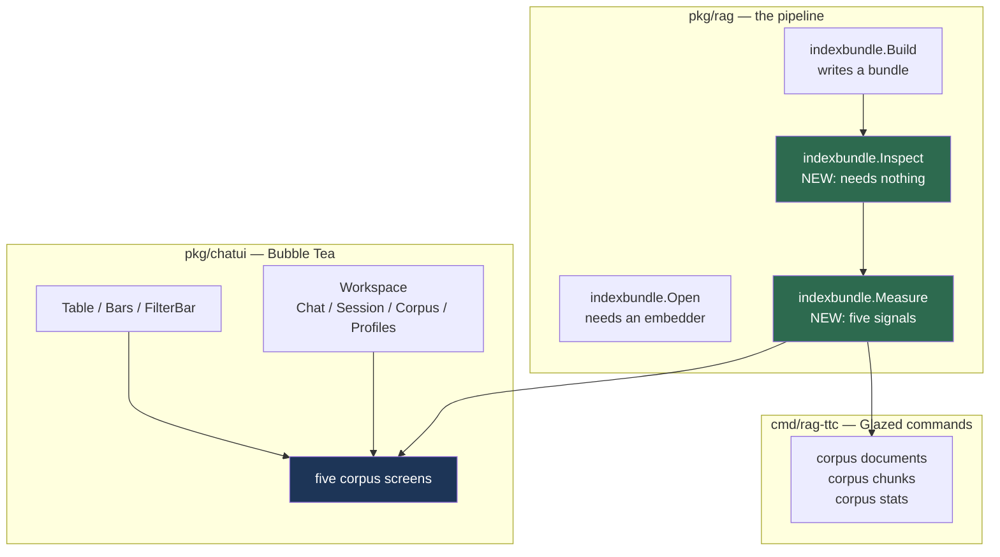
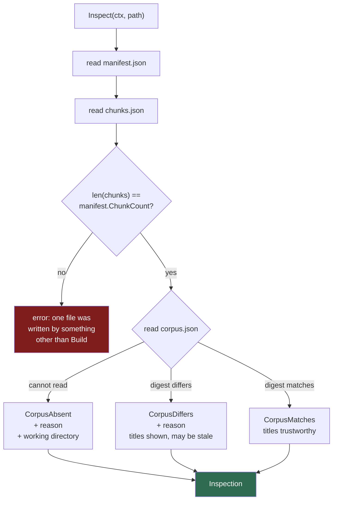
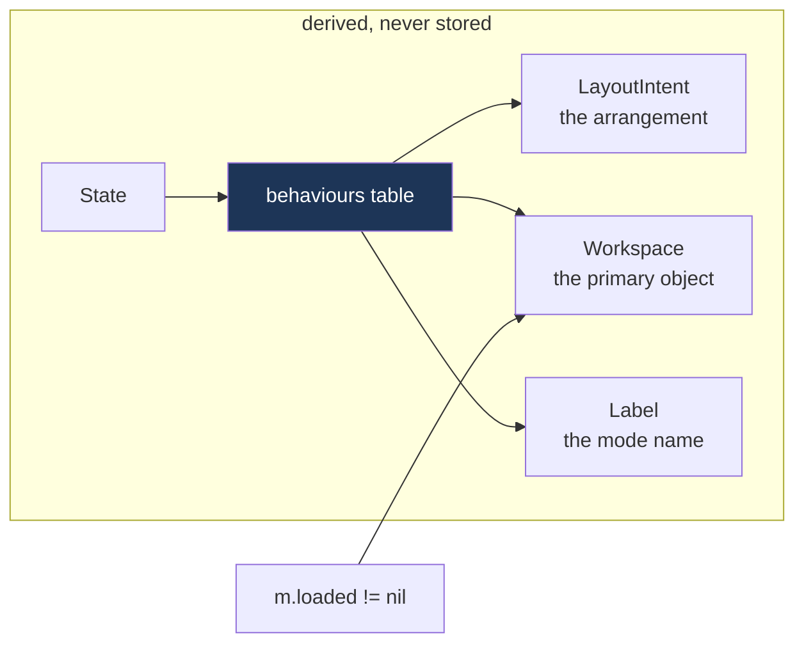

# RAG TTC Corpus Workspace

`rag-ttc` is a developer tool for a retrieval-augmented generation pipeline over a
nursery product corpus. It has a headless answering pipeline, a session recorder,
and a Bubble Tea terminal interface that inspects what the pipeline did. This note
records the work of 2026-07-28 and 2026-07-29: two tickets that made the interface
navigable, and then gave it a second primary object to inspect.

The second object is the index itself. Before this work the interface could show
that an answer was bad. It could not show why the corpus made the answer bad.

> [!summary]
> Three things are worth taking from this project:
> 1. The interface now inspects the **index bundle**, not only the recorded
>    session. Five screens read the documents, the chunk sizes, and the exact byte
>    where each cut falls.
> 2. The cut-boundary screen located the pipeline defect that the tooling was
>    built to find. Nobody had to look it up.
> 3. Four defect classes recurred often enough to name. Each one is a case of the
>    interface stating something that is not true, and each one passed every test
>    that existed at the time.

## Why this project exists

A RAG pipeline has five or six stages between a question and an answer. Lexical
search, vector search, fusion, admission to a context budget, generation, and a
citation contract. Each stage discards candidates. When the answer is wrong, the
stage that discarded the right chunk is the thing you need to know, and no single
number tells you which stage it was.

The `rag-ttc` session recorder writes every stage of every turn to an append-only
archive. The terminal interface reads that archive. Before this work it could
answer questions about one turn: which chunks were retrieved, which were admitted,
which were cited, what the model said.

It could not answer the next question. A recorded turn retrieved a chunk of 110
runes and put it into a generation prompt. The chunk was on the correct topic and
was too small to support an answer. The interface showed the chunk. It could not
show that the chunk was 110 runes because the chunker cut at a markdown heading
and applied no size floor, nor that the document held two more chunks with the
same fault.

That is a question about the **index**, not about the turn. The index is a
different artefact, built by a different command, and the interface had no way to
read it.

## Current project status

Both tickets are complete. Every phase task and every validation task is checked,
`go test ./...` passes, and `golangci-lint run` reports no issues on the three
affected packages.

| Ticket | Phases | State |
| --- | --- | --- |
| `RAG-TTC-INSPECTOR-UX-001` | 11 | built; nine follow-ups recorded |
| `RAG-TTC-CORPUS-WORKSPACE-001` | 7 | built; ten follow-ups recorded |

What exists now:

- `indexbundle.Inspect`, a reader that opens an index bundle without opening any
  index
- `indexbundle.Measure`, five chunk-quality signals with exact counts
- `rag-ttc corpus documents|chunks|stats`, three Glazed commands
- Four workspaces in the terminal interface, and five screens inside the Corpus
  workspace
- 232 passing tests and 26 golden files

Volume, for scale:

```text
pkg/rag/indexbundle/inspect.go      293 lines
pkg/rag/indexbundle/stats.go        600
cmd/rag-ttc/cmds/corpus/command.go  504
pkg/chatui/workspace.go             168
pkg/chatui/components.go            280
pkg/chatui/corpus.go                266
pkg/chatui/corpusdocs.go            384
pkg/chatui/corpuschunks.go          420
pkg/chatui/corpusreach.go           441
```

## Project shape

The repository has three layers, and the work touched all three without changing
the pipeline.



The guard on the whole arc was one command:
`git diff --stat pkg/rag/answering pkg/rag/retrieval`. It stayed empty. The
inspector had to be able to say the pipeline was wrong without changing what the
pipeline did.

## Architecture

### The reader that opens nothing

`indexbundle.Open` was the only way to read a bundle. It requires an embedding
provider, opens a bleve directory, and opens a 16 MB sqlite vector store. That is
correct for a program that runs queries. It is wrong for a program that wants
chunk text.

`Inspect` reads two files and nothing else.

```text
.cache/rag-ttc/indexes/<bundle-id>/
    manifest.json           901 B    <- Inspect reads this
    chunks.json             3.0 MB   <- and this
    representations.json    2.7 MB
    vectors.sqlite         16.4 MB
    bleve/                  directory
```

This repeats a split that `pkg/session` already had: a `Recorder` writes and an
`Open` reads, and neither knows about the other. A reader that opens no index
cannot corrupt one, and it cannot fail for want of a provider it will never call.

The guard test proves the claim by construction. It leaves all three forbidden
artefacts in place with mode `0000` and asserts that `Inspect` succeeds:

```go
require.NoError(t, os.WriteFile(vectorPath, []byte("not a database"), 0o000))
require.NoError(t, os.Chmod(blevePath, 0o000))
require.NoError(t, os.WriteFile(representationsPath, []byte("["), 0o000))

inspection, err := Inspect(t.Context(), directory)
require.NoError(t, err)
```

A test that deleted those files would only show that the reader does not
*require* them. It would say nothing about a reader that opens them when they are
present.

### Document titles come from outside the bundle

A chunk carries a `DocumentID`, which is a SHA-256 digest. Every screen must show
`Arkansas Trees For Sale`, not `sha256:323ad5259e80e…`. The bundle stores no
titles. They are in `datasets/ttc/corpus.json`, a file outside the bundle that can
move, change, or disappear.

The decision was to make that a value on the result rather than an error.



Three of the four outcomes return no error. The chunks, their byte ranges, and
their text are all inside the bundle. Only the names come from outside it, and a
screen that shows digests is still a useful screen.

One detail turned out to matter more than expected. The manifest stores the corpus
path relative to the repository root, and `Inspect` resolves it against the
working directory. A program started from a subdirectory reports a missing corpus
for a file that exists. The reason string therefore names the directory:

```json
"detail": "cannot read datasets/ttc/corpus.json: open datasets/ttc/corpus.json:
           no such file or directory (resolved against /tmp/claude-1000/…)",
"kind": "corpus",
"name": "absent"
```

I added that speculatively in phase one. In phase three it turned out to be the
line that makes the degraded output diagnosable.

### Five signals, four of them exact

`Measure` is a pure function over `[]rag.Chunk` and the chunker identity.

| Signal | Rule | Exact? |
| --- | --- | --- |
| `at-limit` | `runes >= maximum - 10` | yes |
| `short` | `runes < 300` | yes |
| `no-overlap` | has a predecessor **and** `previous.ByteEnd <= ByteStart` | yes |
| `heading-cut` | `short` **and** `no-overlap` | yes |
| `furniture` | a named pattern reaches its match threshold | no |

`no-overlap` is the useful one, and it needs no threshold. The chunker applies
overlap on a size cut and does not apply it on a structure cut. Comparing two byte
ranges detects that exactly.

The measured counts on the production bundle, all asserted as equalities so a
rebuild that changes them fails the test:

```text
chunks     1982        documents  200
at-limit   1779 chunks in 161 documents
short        45 chunks in  42 documents
no-overlap    4 chunks in   1 document
heading-cut   3 chunks in   1 document
furniture   113 chunks in  77 documents

histogram  4 / 18 / 47 / 40 / 40 / 36 / 18 / 1779, none uncounted
p25 = p50 = p75 = p95 = 1200
```

Every percentile is the maximum. A distribution whose 25th and 95th percentiles
are the same number has one value in it. That is the headline fact about this
chunker: it is named `markdown` and structure decides fewer than one cut in ten.

### Workspaces above layout intents

The interface had one mode set. This work added a second body of screens with a
different primary object. The `Workspace` type sits above the existing
`LayoutIntent`.



Nothing stores the current workspace. Storing it would give two sources of truth
for one fact, and the stored one would eventually disagree with the state that
decides which keys are live. The state decides, and everything else is derived
from it.

The `m.loaded` edge is the one case that needs a second input. Loading a recorded
session leaves the state at `moving-around`, so the state alone cannot separate a
live transcript from a recorded one.

## Implementation details

### The screen that shows a cause

Every screen before the cut-boundary screen reports a symptom: a chunk is too
small, a document holds a fault, a signal counts three chunks. The cut-boundary
screen draws the byte where each cut falls and the bytes it shares with the chunk
before it.

```text
╭─ Arkansas Trees For Sale · 19 chunks · 16,785 bytes ──────────────────────────╮
│ http://www.thetreecenter.com/?page_id=4407                                   │
│ ▌   0  0-1206            1200 runes                                          │
│        ─ first chunk of the document                                         │
│        ┃ Arkansas Trees For Sale                                             │
│        ┃ The Arkansas pine belt stretches from the southern Arkansas Delta…  │
│        ⚠ 1200 runes, at the 1200-rune limit                                  │
│     1  1084-1306          220 runes                                          │
│        ▒ 122 bytes overlap                                                   │
│        ┃ and growing zones are located in the following sections, but if…    │
│        ⚠ 220 runes, below the 300-rune floor                                 │
│     2  1306-1387           81 runes                                          │
│        ⚠ no overlap with the chunk before it                                 │
│        ┃ #1.                                                                 │
│        ┃ Rainbow Eucalyptus Tree                                             │
│        ⚠ 81 runes, below the 300-rune floor                                  │
│        ⚠ begins at byte 1306, exactly where the chunk before it ended        │
│        ⚠ cut at the markdown heading "#1."                                   │
╰──────────────────────────────────────────────────────────────────────────────╯
```

Three cases use three glyphs, and that is the whole design of the screen:

| Case | Glyph | Text |
| --- | --- | --- |
| No predecessor | rule | "first chunk of the document" |
| Shares bytes | overlap block | "122 bytes overlap" |
| Shares none | warning | "no overlap with the chunk before it" |

A reader sees the difference between ordinal 1 and ordinal 2 before reading either
sentence. The absence of the overlap block is the fault signal.

The first version used the overlap block for the first chunk as well, which made
one mark mean both "122 bytes shared" and "nothing to share". On a screen where
the glyph is the primary signal, that defeats the screen.

### Flags state evidence, not labels

The design document asked for flag lines that state the evidence and not only a
label. This is the difference in practice:

```text
label:     short
           no-overlap

evidence:  81 runes, below the 300-rune floor
           begins at byte 1306, exactly where the chunk before it ended
           cut at the markdown heading "#1."
```

Every sentence names a number that appears elsewhere on the same screen. A reader
can check the flag against the row above it. A label cannot be checked, so it must
be believed, and a heuristic that must be believed cannot be overruled.

The same rule governs the furniture screen, which reports a heuristic and
therefore shows its rule and an example of every match:

```text
│   pattern             chunks    runes   docs  example                        │
│ ▌ address directory        9      10k      1  1 Box 199A 870-342-5839 Arkade │
│   contact form             1       70      1  Support Ticket [wpforms id="52 │
│   navigation               1        5      1  Login                          │
│   product data           102      82k     74  stock: 0; stock_status: outofs │
│                                                                              │
│ what each pattern matches                                                    │
│   address directory   \d{3}[-.\s]\d{3}[-.\s]\d{4}, 3 or more times           │
│   contact form        \[wpforms id=                                          │
│   navigation          (?i)\A\s*login\s*\z                                    │
│   product data        stock_status:\s*\w                                     │
```

The example needed one fix that is worth recording. The first version showed the
first non-empty line of the matched chunk. A chunk cut from the middle of a page
starts mid-sentence, so the real examples were `ge.` and `: CA`. Neither lets a
person judge the match, which is the only reason the column exists. The example is
now the text around the pattern's first match:

```go
found := pattern.Expression.FindStringIndex(text)
runes := []rune(text)
start := len([]rune(text[:found[0]]))
low := max(0, start-width/3)
if low < wordSnapRunes {
    low = 0                       // a match near the start takes the text whole
} else {
    for low < start && runes[low] != ' ' {
        low++                     // otherwise snap forward to a word boundary
    }
    low = min(low+1, start)
}
high := min(len(runes), low+width+width/3)
```

`FindStringIndex` returns a byte offset and the window indexes runes. A byte
offset applied to a window boundary can split a multi-byte character and put a
replacement glyph in the middle of the evidence.

### Furniture needed a threshold, not a pattern

The design document proposed "address directory" as a named text pattern and
marked its count with a question mark. A presence matcher cannot find it, because
an address reads as prose.

A telephone number does not. Scanning for `\d{3}[-.\s]\d{3}[-.\s]\d{4}` finds nine
chunks in the whole corpus with three or more, and all nine are consecutive
ordinals 10 to 18 of one document. Ordinal 17 holds 59 telephone numbers in 1200
runes.

The signal is density, not presence. `FurniturePattern` therefore carries a
`MinimumMatches` threshold, and the flag carries the count that made it fire, so a
screen writes "59 telephone numbers" rather than "furniture".

### Chunk reach across the archive

The reach screen is the only one that reads both the bundle and the session
archive. It classifies every chunk in the index by what became of it, in four
exclusive bands.

```text
╭─ Chunk reach · across 47 recorded sessions ──────────────────────────────────╮
│   retrieved and cited       █                                 5    0.3%      │
│   admitted, not cited       █                                 5    0.3%      │
│   retrieved, not admitted   █                                59    3.0%      │
│   never retrieved           ████████████████████████████   1913   96.5%      │
│                                                                              │
│   ⚠ No recorded query has touched 96% of the index.                          │
│   ⚠ 47 sessions is a small sample. This says which chunks the recorded       │
│   queries reached. It does not say which chunks are useless.                 │
╰──────────────────────────────────────────────────────────────────────────────╯
```

5 + 5 + 59 + 1913 = 1982, which is the chunk count. The screen adds the bands and
prints an error line if they do not sum. A share computed from a wrong denominator
is wrong by an amount nobody can see.

The second warning is not a footnote. A reach number from a small sample answers a
different question from the one it appears to answer, and the screen has to say
which. The bands say which chunks the recorded queries reached. They do not say
which chunks are useless.

The pruning list below the bands excludes any chunk that a model tried to cite
with a malformed identifier. Such a chunk reads as never cited because the
contract rejected the identifier, and removing it would remove a chunk the model
actually wanted. That case is a citation-format fault, not a corpus fault.

## The defect the tooling was built to find

This is the result that justifies the two tickets.

The motivating case was recorded a day earlier. A turn showed `abstained` in the
interface. The model had in fact answered with three citations and
`abstained: false`. One citation read `chunk-1ae79bb4cc57038`, and the chunk in
the index is `chunk-1ae79bb4cc57038e`. The model dropped one character. The
citation contract rejected the whole answer, and the service then set
`Abstained`. The interface showed the last state and none of the cause.

A separate turn in the same session retrieved a 110-rune chunk. Nobody knew why it
was 110 runes.

On 2026-07-29, with the cut-boundary screen running against the production bundle,
ordinal 4 of that document reads:

```text
▌   4  1493-1603          110 runes
       ⚠ no overlap with the chunk before it
       ┃ #3.
       ┃ American Red Maple
       ⚠ 110 runes, below the 300-rune floor
       ⚠ begins at byte 1493, exactly where the chunk before it ended
       ⚠ cut at the markdown heading "#3."
       ◷ turn-0002 of session 20260728T23333 retrieved, not admitted at fused #13
```

The design document states the same facts in prose, established by hand over
several hours: 110 runes, `turn-0002`, fused rank 13. The tool now states them
without anybody looking anything up. Three chunks in 1982, one document in 200,
found with one key.

That ratio is the point. A tool that finds three chunks in two thousand justifies
itself. A tool that reports "90% of chunks end at the size limit" is also true and
tells you nothing you can act on.

## Four defect classes that recurred

Each of these appeared more than once. Each is a case of the interface stating
something untrue. None of them failed a test at the time it was introduced.

### 1. An advertised key that does nothing

The key map uses struct tags to name the states in which each binding applies, and
`bubbles/help` skips disabled bindings. The footer is therefore generated and
should be honest by construction.

It was not, four times:

- `ExitNav` was tagged for `moving-around` only, so `i` was dead in the examining
  state and the question field was two unadvertised presses away.
- `CorpusDocuments` was tagged for the screen that it opens, so `d` was advertised
  on the screen where pressing it does nothing.
- The design asked for `ctrl+1` to `ctrl+4`. Those are not keys a terminal has.
- `switchWorkspace` guarded against a state whose bindings are disabled, so the
  guard could never be reached.

The `ctrl+digit` case is the sharpest. I wrote the bindings from the design
document, then probed them with a small Bubble Tea program under tmux before
trusting them. Four keys sent, one arrived:

```text
sent:     C-1  C-2  C-3  C-4
received:      ctrl+@
```

`ctrl+2` is NUL, which is also `ctrl+@`, so it arrives under the wrong name.
`ctrl+1`, `ctrl+3` and `ctrl+4` are outside the ASCII control range and produce no
bytes at all. Three of the four primary navigation keys of the new shell would
have been listed in the help overlay and silent forever. Nothing in Go would have
failed. `alt+1` to `alt+4` all arrive and were used instead.

**The rule:** measure a binding before designing navigation around it.

### 2. A visual signal that marks the wrong thing

Both text input boxes passed `m.focus == N` to the box renderer, with no state
test. `m.focus` keeps its value while a person navigates, so the Question box drew
its focus border in every state, including the states where `applyFocus` had
already blurred the field.

`applyFocus` had been correct the whole time. The model knew where keys went and
the view never asked. Two sources of truth for one fact, and the one on screen was
the wrong one.

Nobody reported it, because a border that is always on reads as decoration rather
than as a claim.

The same class produced the overlap glyph that meant two things, and the verdict
mark borrowed for a warning: printing `✖`, which everywhere else in this interface
means "the contract rejected this answer", beside a sentence about chunk sizes.

**The rule:** a marker is a claim. Every claim needs the state that makes it true
in its own condition.

### 3. Silent elision

Four times, a renderer cut text with no marker.

```text
the strategy name at 80 columns:
  " rag-ttc chat - session-fixture -  uncached <= embed 1 gen 1 rerank 0 "
                                   ^ the strategy separator with nothing after it

the documents summary at 80 columns:
  "1 document makes exactly 1 chunk. The largest makes 2 (Arkansas Trees For Sa"

the reach caveat at 130 columns:
  "16 sessions is a small sample. … It does not say which chunks are usele"
```

The third is the worst. `fit` kept the claim and dropped the caveat. A truncated
warning is worse than no warning, because the reader keeps the number and loses
the limit.

The fix differs by content. Prose wraps. Identity drops whole segments in priority
order rather than clipping. A list states how many rows it hid.

**The rule:** show a count or a question mark. Never show a fragment that reads
like a whole.

### 4. Parallel switches over one enum

`Intent`, `Label` and `Model.workspace` were three separate switches over `State`.
A new state had to reach all three.

It reached two, twice. `StateDocuments` and then `StateDocument` each landed on
the workspace bar as the Chat workspace while a corpus screen was drawn.

The `exhaustive` linter covers `Intent` and `Label`, because both are total
switches. It cannot cover `workspace`, which falls through on purpose.

I recorded the consolidation as a follow-up after the first occurrence. It happened
again in the next step. So the third fix was structural rather than local:

```go
type behaviour struct {
    intent            LayoutIntent
    label             string
    workspace         Workspace
    sharedWithSession bool
}

var behaviours = map[State]behaviour{ /* one entry per state */ }

func (s State) Intent() LayoutIntent { return behaviours[s].intent }
```

`TestEveryStateHasABehaviour` asserts the table holds exactly the states that
`AllStates` lists. A table cannot be half updated.

**The rule:** a mistake that repeats is a design fault, not a discipline fault.
Recording a follow-up does not protect the next change. Only removing the
possibility does.

## What tests can and cannot see

Two blind spots cost real time on this project, and both are properties of the test
suite rather than of any single test.

### A golden file proves output did not change

It does not prove the output was ever right. The 80-column golden had recorded a
clipped strategy name as correct for as long as the file existed. Making the header
drop whole segments revealed it.

### A shape assertion passes through the defect it was written to catch

The clearest case was in the first ticket. `View` built its own `LayoutOptions` and
never learned about `FooterRows`, so the frame allocated a one-row footer while the
viewports sized against eight. The help overlay rendered into one row and vanished.

Every test passed. `TestTheFrameStaysExactHeightWithTheHelpOpen` asserted 42 lines
and got 42 lines, because a footer truncated to one row still leaves the frame the
right height. Not one test asserted that the help was on screen.

Line count is a shape. "The help is visible" is the content, and it was one
`require.Contains` away.

The corpus workspace produced the same pattern. The corpus pane could not be
scrolled at all: `syncInspector` filled the scroll viewport with the turn
inspector's content, so `ScrollDown` clamped against a line count that was not on
screen. The frame was the right size, the scroll badge showed the right total, and
the footer advertised `j scroll`. The key did nothing.

The test that catches it asserts the offset moves and the first drawn line changes.
I confirmed it is not vacuous by deleting the fix and watching it fail.

### The ASCII theme is blind to colour

Every golden renders with `theme.ASCII`, where `termenv.Ascii` strips every
colour. A test that compares two rendered boxes to check a focus border therefore
proves nothing: the focused and unfocused versions are byte-identical.

My first focus-border test failed for exactly that reason, which was the correct
outcome. The fixed version renders with a colour-capable theme:

```go
model = model.SetTheme(theme.New(theme.Capability{
    Profile: termenv.TrueColor, Unicode: true, Dark: true,
}))
```

The goldens have this blindness by design, and they are still worth having. A test
about colour must not inherit it.

### When a test and a binary disagree

The binary is what people run. In the footer case my probe test reported
`footerRows=8` and eight lines of content while the program showed a blank row. I
rebuilt twice suspecting a stale binary before printing to stderr from inside
`footerRows` and finding that it was never called.

Every defect in the list above was found by running the program under tmux, not by
reading code and not by a failing test.

## Current user-facing commands

```bash
# Three Glazed commands over the reader. No provider, no index opened.
rag-ttc corpus stats     --bundle <dir> [--furniture]
rag-ttc corpus documents --bundle <dir> [--sort chunks|runes|title|bundle]
rag-ttc corpus chunks    --bundle <dir> [--document <id-or-title>] [--signal <name>]

# Glazed supplies --format and --output-fields. Not --output and --fields.
rag-ttc corpus chunks --bundle $B --signal heading-cut \
  --output-fields chunk_id,title,ordinal,runes,overlap_bytes
```

The chat interface needs a budget for every uncached call. Every budget defaults to
zero, which refuses everything; five recorded sessions failed for that reason
before anybody noticed.

```bash
rag-ttc chat \
  --index-bundle .cache/rag-ttc/indexes/ttc-866972d249d18e770631e563346a4774 \
  --profile ttc-live-openai \
  --profile-registries ~/.config/pinocchio/profiles.yaml,./profiles.yaml \
  --embedding-budget 10 --generation-budget 10 --allow-unpriced-provider
```

Inside the interface:

| Key | Effect |
| --- | --- |
| `alt+1`..`alt+4` | Chat, Session, Corpus, Profiles. `f1`..`f4` alias them |
| `ctrl+w` | cycle the built workspaces; Profiles is skipped |
| `i` | reach the question field from any reading state |
| `enter` | send while composing; examine while navigating |
| `d` `f` `r` | documents, furniture, reach, from the bundle overview |
| `enter` | cut boundaries, from a document row |
| `esc` | up one level; clears an active filter first |
| `tab` | move navigation between the two reading panes |

## Important project docs

Both tickets keep a `docmgr` workspace under `ttmp/2026/07/`. The two
implementation diaries are the primary record; together they run to 2,880
lines and are organised as steps with verbatim prompts, what worked, what did not,
and code-review instructions.

- `ttmp/2026/07/29/RAG-TTC-CORPUS-WORKSPACE-001--…/design-doc/01-corpus-workspace-design-….md`
- `ttmp/2026/07/29/RAG-TTC-CORPUS-WORKSPACE-001--…/reference/01-implementation-diary.md`
- `ttmp/2026/07/29/RAG-TTC-INSPECTOR-UX-001--…/reference/01-implementation-diary.md`

The design document had four numeric claims that measurement contradicted. All four
were mine, and all four are corrected in place with the correction stated rather
than silently overwritten:

| Claim | Written | Measured |
| --- | --- | --- |
| `no-overlap` documents | 2 | 1 |
| Address directory | ordinals 11-18, 8 chunks, 9,600 runes | ordinals 10-18, 9 chunks, 10,419 runes |
| "The four shortest chunks" | 5, 70, 91, 145 runes | the list omitted three chunks shorter than its fourth entry |
| Furniture total | "10 confirmed" | 113 chunks in 77 documents |

Writing a number in prose and asserting it in a test are different activities. The
second one found four errors in the first.

## Open questions

**Is a reach number from 47 sessions more misleading than useful?** The screen
states its sample size and states what the sample cannot say. That is the most the
screen can do. Whether anybody reads the caveat before acting on the 96% is
unknown.

**Should furniture detection default on?** It is off. The patterns are heuristics
and `product data` alone flags 102 chunks in 74 documents. The consequence is that
the flags column in the documents table is empty for most rows, and three of the
four confirmed patterns are invisible outside the furniture screen. The interface
has no toggle.

**What corpus size must the reader support?** `chunks.json` is 3.0 MB for 1982
chunks. The recorded threshold for building streaming reads is 50 MB, which is a
corpus roughly sixteen times larger. Nothing streams today.

## Near-term next steps

In priority order.

1. **Fix the pipeline defect.** A model dropped one character from a citation
   identifier and lost a whole answer. The interface now shows this clearly,
   including the nearest identifier within two edits. The pipeline still discards
   the answer. Both tickets deliberately did not touch it. It is now the most
   valuable single change in the repository.
2. **Make the archive fold asynchronous.** `ensureReach` reads 47 session archives
   synchronously on first entry to three of the five corpus screens, and takes
   several seconds. It is the largest blocking read in the interface.
3. **Write the Profiles ticket.** The workspace is on the bar and reports that it
   is not built. Five screens were designed in conversation only and have no
   ticket.
4. **Finish the shared components.** The session browser keeps its own column
   arithmetic and its own `esc` behaviour, so it is the fourth list in the
   interface and it still has the filter trap that the documents table lost.
5. **Remove nine literal separators.** They predate this work, live in five files,
   and defeat the ASCII capability the same way a literal box-drawing character
   would.

## Project working rule

Three rules earned their place on this project.

**Verify in the binary.** Every defect recorded above was found by running the
program under tmux. Tests found none of them at the time they were introduced, and
in two cases tests actively asserted that the broken behaviour was correct.

**Assert content, not shape.** A frame of the right height with the help missing
passes a height assertion. A scroll badge with the right total passes while the
scroll key does nothing. The assertion has to name the thing a person would look
for.

**A repeated mistake is a design fault.** Recording a follow-up did not stop the
same three-switch omission from happening a second time. Only the table stopped it.

## Related notes

- [[PROJ - reMarkable Cleanup - Tablet Root Reorganization]]
- [[ARTICLE - Playbook - Self-Contained Go Wasm and JavaScript Browser Applications]]
