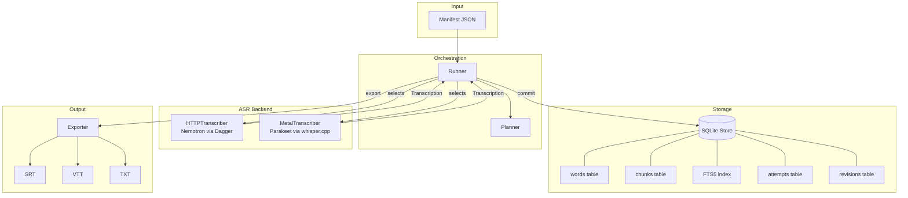
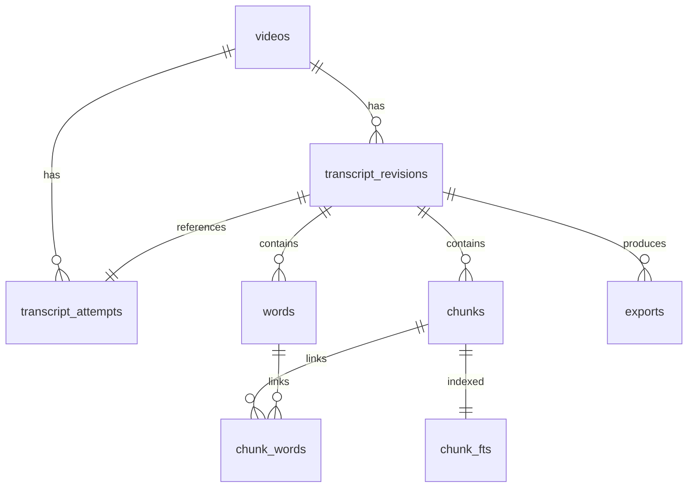

# Southwell Category Theory Corpus

This project downloaded, transcribed, and indexed Richard Southwell's "Category Theory for Beginners" YouTube playlist — 37 videos totaling 69 hours of audio — using a Go-orchestrated corpus pipeline that runs NVIDIA Nemotron on Linux and NVIDIA Parakeet TDT on Apple Silicon. The Mac node, using Metal GPU acceleration via whisper.cpp, transcribed the full 25 available videos (540,840 words) in 42 minutes of wall-clock time at 98x realtime. The Linux node transcribed 11 shorter videos (69,266 words) at 4.8x realtime. The combined corpus of 610,106 words across 78 hours of audio is stored in SQLite databases with full-text search, word-level timestamps, and SRT/VTT/TXT exports.

> [!summary]
> The project has four deliverables:
> 1. A downloadable, normalized audio corpus from a YouTube playlist with SHA-256 provenance
> 2. A Go corpus pipeline (`internal/corpus`, 2,241 lines) with manifest import, resume, SQLite storage, FTS5 search, and multi-format export
> 3. A Metal GPU ASR adapter (`internal/metal`, 342 lines) using Parakeet TDT 0.6B v3 via whisper.cpp, achieving 98x realtime on M1 Max
> 4. A modified parakeet-cli with JSON word-timestamp output and BPE subword accumulation (356 lines)

## Why this project exists

The goal was to produce a searchable text corpus from Richard Southwell's category theory lecture series. The playlist contains 37 videos covering topics from basic definitions through Yoneda lemma, adjoint functors, topos theory, and higher category theory. The lectures are dense mathematical content spoken in clear English — ideal material for ASR, but too long (individual videos range from 3 minutes to 4.4 hours) for manual transcription.

The project had two constraints that shaped the architecture. First, the transcription needed to produce word-level timestamps, not just plain text, because the downstream use case is search-within-video (jumping to the exact moment a concept is discussed). Second, the work was split across two machines — a Linux server with an RTX 3060 GPU and a Mac M1 Max — because neither machine alone had enough available time to process the full corpus in one session.

The existing transcription-go repository already had a working single-file transcription pipeline using Nemotron in a Dagger container. The work was to extend it to handle an entire playlist corpus with resume capability, provenance tracking, and a second ASR backend for Apple Silicon.

## Project shape

The project spans two docmgr tickets and two repositories:

| Component | Ticket | Repository | Location |
|-----------|--------|------------|----------|
| Playlist download & caption index | `SOUTHWELL-CATEGORY-THEORY` | claw-stuff | `/home/manuel/code/wesen/claw-stuff/ttmp/2026/07/28/SOUTHWELL-CATEGORY-THEORY--...` |
| Corpus pipeline code | `VIDEO-CORPUS-PIPELINE` | transcription-go | `/home/manuel/worktrees/2026-07-28--transcription-go-video-pipeline` |
| Mac clone | — | transcription-go | `mimimi-2.local:~/code/wesen/2026-04-13--transcription-go` |
| Audio corpus | — | — | `~/Movies/richard-southwell-category-theory-for-beginners/` |

The work proceeded in three phases: corpus acquisition (download and normalize audio), pipeline implementation (extend transcription-go for playlist-scale processing), and Metal acceleration (add Parakeet as a second ASR backend for the Mac).

## Phase 1: Corpus acquisition

### Playlist download

The first step was downloading all 37 videos from the playlist. Five scripts in the `SOUTHWELL-CATEGORY-THEORY` ticket handle the workflow:

| Script | Purpose | Lines |
|--------|---------|-------|
| `01_download_playlist.sh` | yt-dlp playlist download with metadata | 28 |
| `02_index_media.py` | Index downloaded media into SQLite | 49 |
| `03_extract_audio.sh` | ffmpeg normalize to 16kHz mono WAV | 23 |
| `04_batch_nemotron.sh` | Batch Nemotron transcription (early prototype) | 20 |
| `05_index_caption_corpus.py` | Index YouTube captions as provisional corpus | 139 |

The download produced 36 of 37 videos — one video (playlist position 19) is members-only and unavailable. Audio was normalized to 16 kHz mono PCM WAV, the format required by both Nemotron and Parakeet. Each file is named with its playlist position, title, and YouTube ID.

### Provisional caption corpus

Before running ASR, YouTube's auto-generated captions were indexed into a provisional `corpus.db` (40 MB) containing 156,979 caption segments across 36 videos. This provided an immediately searchable corpus while ASR processing continued. The caption segments use YouTube's timing, which is coarser than ASR word-level timestamps but sufficient for topic-level search.

### Manifest creation

A manifest converter script (`scripts/convert_media_manifest.py`, 89 lines) transforms the media index SQLite database into the JSON manifest format required by the corpus pipeline. The manifest is the single source of truth for the corpus: it declares each video's source ID, title, playlist position, audio file path, duration, and availability.

```json
{
  "corpus_id": "richard-southwell-category-theory-for-beginners",
  "videos": [
    {
      "source_id": "X23P8HcuneI",
      "title": "My Perspective On Category Theory: Past and Future",
      "playlist_position": 32,
      "audio_path": "/path/to/032 - ....wav",
      "duration_seconds": 985.9,
      "availability": "available"
    }
  ]
}
```

The Mac manifest marks the 12 videos already transcribed on Linux as `"unavailable"` to prevent re-transcription. This is a workaround — the pipeline's `--source-id` filter selects which videos to process, but the manifest validation checks all items regardless of the filter. A `--skip-missing-audio` flag would be the proper fix.

## Phase 2: Corpus pipeline implementation

### Architecture

The corpus pipeline extends the existing transcription-go repository with a new `internal/corpus` package (2,241 lines across 8 files) and a new `corpus` subcommand in the CLI. The architecture has four layers:



### The Transcriber interface

The adapter point is a Go interface that abstracts the ASR backend:

```go
type Transcriber interface {
    Transcribe(ctx context.Context, audioPath string, opts TranscribeOptions) (Transcription, error)
}
```

Two implementations exist:

- **HTTPTranscriber** — sends audio chunks to a Dagger-hosted FastAPI server running Nemotron. The server loads `nvidia/nemotron-speech-streaming-en-0.6b` and streams word-level alignments back over HTTP. The Go client handles 60-second chunking with 2-second overlap, streaming multipart uploads via `io.Pipe`, and word reordering at chunk boundaries.

- **MetalTranscriber** — shells out to `parakeet-cli` (or `whisper-cli`) as a subprocess, writes JSON output to a temp file, and parses it into the same `Transcription` struct. No service is needed — the binary runs locally with Metal GPU acceleration.

The runner does not know which backend it is using. This is the most important design decision in the pipeline: it allows adding new ASR backends (Apple SpeechAnalyzer, MLX-based models, future NVIDIA models) without touching storage, search, or export logic.

### SQLite schema

The database has 12 tables organized around videos, revisions, and derived structures:



The `videos` table tracks per-video state (`pending`, `transcribing`, `complete`, `failed`). The `transcript_attempts` table records each transcription attempt with its pipeline fingerprint, processing time, and error details. The `transcript_revisions` table stores committed transcripts with `UNIQUE(video_id, source_sha256, pipeline_fingerprint)` — the same video transcribed with different backends produces separate revisions.

The `words` table stores each word with its text, normalized text (lowercase, punctuation stripped), start time, end time, confidence, source chunk index, and filler flag. The `chunks` table derives fixed-duration chunks from words for FTS5 search. The `chunk_words` junction table links chunks to their constituent words with position ordering.

### Resume and provenance

The pipeline supports resume: if a run is interrupted (process crash, machine sleep, network failure), restarting with the same database and manifest skips completed videos and resumes pending ones. The `Plan` function queries the store for each video's state and produces a work list:

- **Complete** → skip (or export-only if formats are requested)
- **Failed** → skip unless `--retry-failed` is set
- **Transcribing** → treated as stale, reset to pending
- **Pending** → transcribe

Each transcription attempt records its pipeline fingerprint — a SHA-256 hash of the model name, decoding parameters, chunk size, and audio contract. This ensures that changing the ASR model or configuration produces a new revision rather than silently overwriting existing work.

### Word reordering at chunk boundaries

Nemotron processes audio in 60-second chunks with 2-second overlap. The overlap region produces duplicate words from two adjacent chunks, and these words can arrive out of order. The runner applies a stable insertion sort by start time before committing, ensuring words are monotonically ordered. Without this fix, the first word of chunk N+1 could appear after the last word of chunk N+1, producing timestamps that go backward.

### Streaming multipart uploads

The initial HTTPTranscriber implementation loaded the entire WAV chunk into memory before uploading. For long chunks (60 seconds of 16 kHz mono = 1.9 MB), this was acceptable, but it prevented the server from starting inference until the full upload completed. The fix uses `io.Pipe` to stream the multipart upload body, allowing the server to begin processing while the upload is still in progress:

```go
pr, pw := io.Pipe()
go func() {
    defer pw.Close()
    multipartWriter := multipart.NewWriter(pw)
    // write audio data to multipartWriter
}()
req.Body = pr
```

This reduced the gap between chunk upload completion and server response by overlapping network transfer with request preparation.

### FTS5 search

The `chunk_fts` table is a SQLite FTS5 virtual table indexed on chunk text. Search returns matching chunks with their video source ID, timestamp range, and a YouTube deep link (`https://www.youtube.com/watch?v=ID&t=SECONDS`). The search uses normalized text (lowercase, punctuation stripped) to match across casing and punctuation variations.

After the subword accumulation fix, searching for "functor" returns 1,625 matches across the corpus, and searching for "monad" returns results from the Monads lecture with precise timestamps.

### Export

The exporter writes three formats per video:

- **SRT** — SubRip subtitles with sequential numbering and `HH:MM:SS,mmm` timestamps
- **VTT** — WebVTT format with `.` millisecond separators
- **TXT** — Plain text transcript, one chunk per line

Exports are written to `exports/NNN - Title [ID]/transcript.{srt,vtt,txt}` and recorded in the `exports` table with content SHA-256 hashes for integrity verification.

## Phase 3: Metal GPU acceleration

### The problem

The Linux server (RTX 3060, Dagger container) achieved 4.8x realtime with Nemotron. For the full 69-hour corpus, this meant approximately 14 hours of processing — feasible but slow, and the server was shared with other workloads.

The Mac M1 Max had been set up as a second transcription node, but running Nemotron on macOS required Docker x86 emulation (Nemotron's FastConformer-RNNT kernels are CUDA-specific and do not support Metal or MPS). Emulation performance was approximately 2.7x realtime — worse than the Linux server and impractical for the corpus.

### Research

Seventeen research sources were collected in the ticket `sources/` directory, covering:

- The 2026 ASR model landscape (Parakeet TDT, Voxtral, SenseVoice, Apple SpeechAnalyzer)
- Apple Silicon Metal benchmarks for Whisper and Parakeet
- Apple SpeechAnalyzer API vs Whisper accuracy comparisons
- MLX-based ASR implementations
- whisper.cpp's Parakeet support

The key finding was that whisper.cpp had added `parakeet-cli` — a CLI for NVIDIA's Parakeet TDT 0.6B v3 model — with Metal GPU support. Parakeet TDT is the same parameter count (0.6B) as Nemotron, from the same NVIDIA model family, but its architecture (transducer with token duration prediction) maps more naturally to Metal's compute pipeline.

### Parakeet TDT 0.6B v3

Parakeet TDT (Token-and-Duration Transducer) is a streaming-capable ASR model that predicts both token identities and token durations. Unlike Whisper's encoder-decoder architecture, which generates text autoregressively, Parakeet's transducer predicts tokens and their time spans directly. This produces word-level timestamps natively without the alignment post-processing that Nemotron requires.

The model is distributed in GGUF format at 1.2 GB (f16 precision) from `huggingface.co/ggml-org/parakeet-GGUF`. It supports 25 languages, with English WER of 6.32% on the FLEURS benchmark — better than Whisper large-v3-turbo's 7.83% and comparable to Nemotron's accuracy.

### parakeet-cli JSON output patch

The upstream `parakeet-cli` only supported plain text output (`-otxt`). Word-level timestamps were available only through the `-ps` debug flag, which printed to stderr in a format not suitable for programmatic parsing.

We modified `examples/parakeet-cli/parakeet-cli.cpp` to add a `-oj` (output JSON) flag. The patch (356 lines, saved in `ttmp/.../scripts/parakeet-cli-json-output.cpp`) adds three things:

1. **`json_escape()` function** — escapes `"`, `\`, `\n`, `\r`, `\t`, and control characters for valid JSON output.

2. **`strip_sp_marker()` function** — removes the SentencePiece `▁` marker (U+2581, UTF-8: `E2 96 81`) that Parakeet prepends to word-start tokens. This marker indicates word boundaries in BPE tokenization but should not appear in the output text.

3. **Subword accumulation loop** — Parakeet uses BPE tokenization where a single word spans multiple tokens. For example, "unusual" is three tokens: `▁un` (is_word_start=true), `us` (is_word_start=false), `ual` (is_word_start=false). The accumulation loop merges these into a single word with the first token's start time and the last token's end time.

Without the subword accumulation, the database stored fragments: "un" instead of "unusual", "form" instead of "format", "fun" instead of "functor". Full-text search returned no results for common terms. After the fix, "functor" appears 1,625 times in the corpus and search returns coherent results.

### Timestamp unit conversion

Parakeet's internal timestamps use two different frame scales, and the patch must convert each correctly:

| Timestamp type | Unit | Conversion | Source |
|---------------|------|------------|--------|
| Token t0/t1 | Mel frames (10 ms) | `seconds = t0 * 0.01` | `PARAKEET_HOP_LENGTH = 160` at 16 kHz |
| Segment t0/t1 | Encoder frames (80 ms) | `seconds = t0 * 0.08` | `subsampling_factor = 8` |

Using 0.08 for token timestamps places "Okay" at 0.0-2.56 s instead of 0.0-0.32 s — an 8x error. The correct conversion was verified by checking that the first word starts near zero and the last word ends near the ffprobe-reported audio duration.

### Audio chunking for GPU memory

The Metal GPU encoder allocates memory proportional to audio length. For files longer than ~5000 seconds, the GPU command buffer fails:

```
ggml_metal_synchronize: error: command buffer 1 failed with status 5
error: Insufficient Memory (00000008:kIOGPUCommandBufferCallbackErrorOutOfMemory)
```

The MetalTranscriber splits long audio into 3600-second (1-hour) chunks using ffmpeg, transcribes each chunk independently, and merges word timestamps with time offsets:

```go
for _, w := range chunkWords {
    w.Start += chunk.offset
    w.End += chunk.offset
    w.SourceChunkIndex = chunkIndex
    allWords = append(allWords, w)
}
```

A 10652-second (3-hour) video becomes 3 chunks, each transcribing in ~35 seconds. Without chunking, the same video crashes with a segmentation fault.

### Runner nil-safety

The Nemotron backend requires a Dagger-hosted service. The Metal backend runs a local binary with no service. The runner was modified to make the service optional: if `ServiceFactory` is nil, the runner skips service startup and passes an empty endpoint to the transcriber factory. A nil-safe `Exporter.policy` access was also added — the exporter is nil when `--output-dir` is not specified, and the original code panicked with a nil pointer dereference.

### Pipeline fingerprint isolation

Each ASR backend gets a distinct pipeline fingerprint to prevent confusion when merging databases:

```go
const (
    ModelName             = "nvidia/nemotron-speech-streaming-en-0.6b"
    ParakeetModelName     = "nvidia/parakeet-tdt-0.6b-v3-ggml"
    WhisperTurboModelName = "openai/whisper-large-v3-turbo-ggml"
)
```

The store enforces `UNIQUE(video_id, source_sha256, pipeline_fingerprint)` on revisions, so the same video transcribed with different backends produces separate revisions rather than overwriting each other.

## Benchmark results

### Mac M1 Max with Parakeet TDT 0.6B v3 (Metal GPU)

| Video | Duration | Processing | Speed | Words |
|-------|----------|------------|-------|-------|
| My Perspective (032) | 16.4 min | 10.8 s | 91x | 2,542 |
| Linear Algebra (036) | 75.1 min | 46.6 s | 97x | 10,628 |
| Graphs and Dynamical Systems (011) | 89.5 min | 66.2 s | 81x | 12,044 |
| Special Arrows (016) | 114.9 min | 66.3 s | 104x | 14,175 |
| Yoneda Lemma (012) | 177.5 min | 107.6 s | 99x | 23,053 |
| Adjoint Functors (013) | 204.5 min | 121.8 s | 101x | 24,949 |
| Topos Theory and Subobjects (014) | 282.5 min | 168.4 s | 101x | 34,240 |
| Internal Language (021) | 443.3 min | 268.9 s | 99x | 57,111 |

**Full corpus (25 videos, 69 hours):** 540,840 words, 42 minutes processing, 98x realtime average, 42 minutes wall-clock.

### Linux RTX 3060 with Nemotron 0.6B (Dagger container)

| Video | Duration | Processing | Speed | Words |
|-------|----------|------------|-------|-------|
| My New Category Theory Book | 2.9 min | 45.3 s | 3.8x | 467 |
| Mind Body Problem | 19.0 min | 261.6 s | 4.4x | 2,580 |
| Everything Is a Functor | 33.8 min | 360.1 s | 5.6x | 4,918 |
| Natural Transformations | 71.7 min | 1,156.2 s | 3.7x | 8,189 |
| Limits and Colimits | 83.6 min | 998.1 s | 5.0x | 10,587 |

**Partial corpus (11 videos, 9.2 hours):** 69,266 words, 114.5 minutes processing, 4.8x realtime average.

### Comparison

| Metric | Mac Parakeet Metal | Linux Nemotron CPU | Ratio |
|--------|--------------------|--------------------|-------|
| Average speed | 98x realtime | 4.8x realtime | Mac 20x faster |
| 90-min video processing | 66 s | 998 s | Mac 15x faster |
| Full 69h corpus (extrapolated) | 42 min | ~14 hours | Mac 20x faster |
| Model size | 1.2 GB | 1.6 GB (container) | — |
| Container required | No | Yes (Dagger/Docker) | — |

### Parallelism ceiling

Running multiple `parakeet-cli` processes in parallel was tested to determine whether the Metal GPU has spare capacity:

| Mode | Wall time (2 files) |
|------|---------------------|
| Sequential | 56 s |
| Parallel ×2 | 49 s (12% faster) |
| Parallel ×3 | 49 s (no improvement) |
| Parallel ×4 | 59 s (slower) |

Two parallel processes achieve a 12% speedup from overlapping CPU work with GPU work. Three or more contend for GPU command buffer time and become slower. The Metal GPU is the bottleneck.

## Failure modes and fixes

### GPU out of memory on long audio

**Symptom:** `parakeet-cli` exits with a segmentation fault. Stderr shows `kIOGPUCommandBufferCallbackErrorOutOfMemory`.

**Cause:** The Metal encoder compute buffer scales with audio length. Files exceeding ~5000 seconds exhaust GPU memory.

**Fix:** Split audio into 3600-second chunks with ffmpeg. Each chunk transcribes independently; word timestamps are merged with time offsets.

### BPE subword fragments in database

**Symptom:** Full-text search returns no results for common terms. The database contains "un" instead of "unusual", "fun" instead of "functor".

**Cause:** The JSON output code only emitted tokens where `is_word_start == true`, skipping BPE continuation tokens that form the rest of each word.

**Fix:** Accumulate all tokens between `is_word_start` boundaries into a single word string. The full corpus was re-transcribed after the fix — 45 minutes for 25 videos.

### Stale database state after crash

**Symptom:** Restarting the corpus run fails with `UNIQUE constraint failed: chunk_words.chunk_id, chunk_words.word_id`.

**Cause:** A process crash leaves the video in "transcribing" state with partially committed data. The resume logic tries to re-transcribe, but stale rows violate uniqueness constraints.

**Fix:** Reset stuck videos before restarting, or delete the database file for a clean start. Parakeet's speed makes re-transcription cheaper than debugging stale state.

### macOS sleep killing background processes

**Symptom:** A `nohup` background transcription process disappears when the Mac sleeps. The database shows a video stuck in "transcribing" state.

**Cause:** macOS sleep kills background processes regardless of `nohup`. The network becomes unreachable (ping fails, SSH connection drops).

**Fix:** Run transcription in a `tmux` session, which survives sleep. On restart, attach to the session or check the database for stuck videos and reset them.

## Documentation

Two docmgr tickets were created with full documentation:

### SOUTHWELL-CATEGORY-THEORY (claw-stuff repo)

| Document | Type | Content |
|----------|------|---------|
| `design-doc/01-intern-guide-...md` | Design doc | Playlist download, audio normalization, Nemotron transcription, and search index guide |
| `reference/01-playlist-source-and-artifact-contract.md` | Reference | Source URLs, artifact paths, SHA-256 hashes |
| `reference/02-diary.md` | Diary | Chronological work record |
| `scripts/01-05` | Scripts | Download, index, extract, batch transcribe, caption corpus |

### VIDEO-CORPUS-PIPELINE (transcription-go repo)

| Document | Type | Content |
|----------|------|---------|
| `analysis/01-current-system-and-video-corpus-gap-analysis.md` | Analysis | Current system capabilities and corpus-scale gaps |
| `design-doc/01-intern-guide-...md` | Design doc | Corpus pipeline architecture and implementation guide |
| `playbook/01-playlist-corpus-operator-playbook.md` | Playbook | Operating procedures for corpus runs |
| `reference/01-corpus-database-and-pipeline-api-contracts.md` | Reference | Manifest, schema, and Go interface contracts |
| `reference/02-investigation-diary.md` | Diary | Chronological work record with 11 steps |
| `sources/00-17` | Research | 17 ASR benchmark and model research sources |
| `scripts/parakeet-cli-json-output.cpp` | Code | parakeet-cli JSON output patch |

Both design docs were uploaded to reMarkable as PDFs for offline reading.

## Current user-facing commands

```bash
# Dry-run: see what would be transcribed
transcribe corpus run --manifest manifest.json --database corpus.db --dry-run

# Run Nemotron (Linux, Dagger)
transcribe corpus run --manifest manifest.json --database corpus.db \
  --output-dir exports/ --verbose

# Run Parakeet Metal (Mac, whisper.cpp)
transcribe corpus run --manifest manifest.json --database corpus.db \
  --metal-gpu --metal-backend parakeet \
  --metal-binary ~/code/whisper/whisper.cpp/build/bin/parakeet-cli \
  --metal-model ~/code/whisper/whisper.cpp/models/ggml-parakeet-tdt-0.6b-v3-f16.bin \
  --output-dir exports/ --verbose

# Check status
transcribe corpus status --manifest manifest.json --database corpus.db

# Search
transcribe corpus search --manifest manifest.json --database corpus.db \
  --query "functor" --limit 10

# Export only (skip transcription)
transcribe corpus run --manifest manifest.json --database corpus.db \
  --output-dir exports/ --format srt,vtt,txt
```

## Key code locations

| Component | Path | Lines |
|-----------|------|-------|
| Corpus package total | `internal/corpus/` | 2,241 |
| Metal transcriber | `internal/metal/transcriber.go` | 342 |
| CLI corpus subcommands | `cmd/transcribe/corpus.go` | 353 |
| Corpus runner | `internal/corpus/runner.go` | 246 |
| SQLite store | `internal/corpus/store.go` | 973 |
| Transcriber interface | `internal/corpus/transcriber.go` | 99 |
| Pipeline fingerprint | `internal/corpus/fingerprint.go` | 126 |
| Export (SRT/VTT/TXT) | `internal/corpus/export.go` | 147 |
| Manifest loader | `internal/corpus/manifest.go` | 173 |
| Schema/migrations | `internal/corpus/schema.go` | 141 |
| parakeet-cli patch | `ttmp/.../scripts/parakeet-cli-json-output.cpp` | 356 |
| Manifest converter | `scripts/convert_media_manifest.py` | 89 |
| Southwell scripts | `SOUTHWELL-CATEGORY-THEORY/.../scripts/` | 259 |
| Total Go in worktree | — | 6,497 |

The worktree is at `/home/manuel/worktrees/2026-07-28--transcription-go-video-pipeline` on branch `feature/video-pipeline-corpus`, pushed to `origin`.

## Open questions

- How does Parakeet's transcription accuracy compare to Nemotron's on the same audio? The Mac and Linux corpora cover different videos (12 overlap), so a direct comparison requires transcribing the same video with both backends.
- Would Apple's SpeechAnalyzer API (macOS 26) achieve comparable accuracy with lower implementation complexity? Benchmarks report 2.12% WER on LibriSpeech clean, but it requires macOS 26 and does not expose word-level timestamps through a CLI.
- Can the parakeet-cli JSON output patch be contributed upstream to whisper.cpp? The modification is self-contained and does not change existing behavior.

## Near-term next steps

- Merge the Mac and Linux corpus databases into a unified corpus with both Nemotron and Parakeet revisions for the overlapping videos.
- Add a `--skip-missing-audio` flag so the Mac manifest does not need to mark Linux-completed videos as "unavailable".
- Add a `--metal-parallel 2` flag for the 12% speedup from running two parakeet-cli processes concurrently.
- Contribute the parakeet-cli JSON output patch upstream to whisper.cpp.
- Re-run the Linux corpus with Parakeet (via whisper.cpp on the RTX 3060) to compare GPU backends on identical hardware.

## Project working rule

The corpus pipeline's value is not in any single ASR model but in the interface that separates ASR from storage. When a new model appears — Parakeet TDT v4, an MLX port, or Apple SpeechAnalyzer — adding it requires implementing one Go interface and one CLI flag. The storage schema, search index, export formats, and resume logic do not change. This is the design constraint that made it possible to add Metal GPU support in one session without touching the existing Nemotron path.

## Related notes

- [[ARTICLE - Parakeet TDT Metal ASR on Apple Silicon]]
- [[PROJ - Transcription Go - Dagger Nemotron ASR Pipeline]]
- [[PROJ - Transcription Go - Streaming Transcription Architecture and Implementation Report]]
