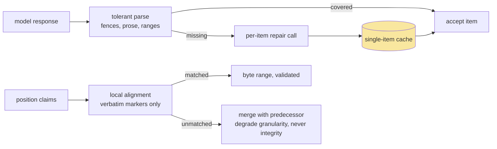

# Measurement Discipline and LLM I/O: Throughput, Batching, and Structured Output

This article records two bodies of practice that determine whether large-scale LLM-backed computation is fast and trustworthy: the measurement discipline for characterizing a serving backend (aggregate token throughput, concurrency caps, hidden token streams, and the benchmarking errors that obscure all three), and the input/output contracts that let a pipeline consume model output safely at scale (JSON array contracts with repair paths, and boundary markers in place of numeric claims). Every number cited was measured against the LunaRoute gateway serving GLM-5.2-Vision during the work recorded in [[PROJ - RAG-TTC Chunk Lab - Chunking and Representation Experiments on a Free LLM Gateway]].

> [!summary]
> 1. A serving backend under concurrency is characterized by aggregate token throughput, not per-request latency; past a small concurrency, added requests add waiting, not work.
> 2. Two benchmarking errors dominated a real incident: self-contention (probing a capped resource while being its main consumer) and invisible token spend (~80% of completion tokens were a discarded reasoning stream). The correction was worth a measured ~16× in effective throughput.
> 3. Batching amortizes fixed per-request cost: when latency is throughput-bound, one call carrying twelve items costs approximately one item's overhead.
> 4. Model output enters a pipeline only through narrow contracts: parseable structure with per-item repair, and verbatim text markers in place of offsets — every failure mode detectable, every fallback cheaper than trusting an unverifiable claim.

## Why this note exists

The incident that produced this note proceeded as follows. A generation workload measured ~75 seconds per call, was modeled as queue-dominated, and was scheduled for a 13–15 hour run. A user questioned the number. A bare request with no competing traffic answered in 1.2 seconds. The original measurements had all been taken while the workload's own 16 workers saturated the backend's concurrency cap — the probes had measured their own queue — and the true per-call cost was dominated by a chain-of-thought stream the pipeline discarded unread. Restructuring around the corrected model (reasoning disabled, twelve items per call) multiplied effective throughput approximately sixteenfold and turned an overnight run into a sub-hour one. Every element of that incident generalizes.

## Core mental model

### Throughput, not latency

A saturated serving backend delivers a roughly constant aggregate token rate $T$ (measured: ~170 output tokens/second across all concurrent streams on the gateway in question). With $n$ concurrent requests each awaiting $t$ output tokens, per-request time approaches $n \cdot t / T$: concurrency divides the constant, it does not add capacity. Three measurable parameters characterize such a backend:

1. **Solo latency** of a realistic request (measured: 12–17.5 s for ~400 prompt tokens producing 687–952 completion tokens — about 55 tokens/s single-stream).
2. **Aggregate throughput** under saturation (measured: ~170 tokens/s — roughly three streams' worth; concurrency beyond 3–4 added queueing only).
3. **The concurrency cap** and its failure mode (measured: hard 429 `CONCURRENT_REQUEST_LIMIT_EXCEEDED` at an organization-level limit near 16; a 32-request probe returned 22 rejections).

The two benchmarking errors that concealed this structure:

**Self-contention.** This is a relative of *coordinated omission* (Tene) — the classical benchmarking error in which the measuring process's own scheduling hides the latencies it set out to record. Every early probe ran while the workload itself held the concurrency cap; probes therefore measured the workload's queue, and a "control" probe with different parameters (reasoning disabled, 34 output tokens, still ~60 s) appeared to confirm a queue-dominated model — the confirmation was the contention, not the backend. The rule: never benchmark a capped shared resource while being its principal consumer; quiesce first, then measure. The companion incident: the probe itself spilled a 429 into the running workload and killed it (absorbed thereafter by the retry layer of [[ARTICLE - Reproducibility Engineering - Digests, Caches, Budgets, and Provenance]]) — do not probe a capped resource *at all* while production traffic holds it.

**Invisible token spend.** The deployment defaulted to chain-of-thought: a 350-character summary cost 687–952 completion tokens, of which ~80% was a `reasoning` field the pipeline never read. Cost per useful token was inflated fivefold, invisibly, because the reasoning stream appears only in the raw response and the token accounting. Disabling it (`reasoning_effort: "none"`, passed through to the provider verbatim; the provider honored it despite its own compatibility metadata claiming otherwise — empiricism outranks metadata) collapsed completion counts from ~623 to ~34 on the probe request. The rule: **a latency number is unexplained until the token accounting reconciles with it** — solo latency × concurrency × token counts must multiply out to observed batch throughput, and any residual is a hidden stream, a hidden queue, or a hidden cap.

### Batching economics

Serving systems exploit the same economics from the inside — continuous batching and paged KV-cache management are the core of modern LLM servers (Kwon et al. 2023, vLLM) — and a client can exploit them from the outside. With per-request fixed overhead $f$ (connection, queue admission, prompt prefill, and any per-request reasoning preamble) and marginal per-item cost $m$, batching $b$ items per request costs $f + b\,m$ against $b(f+m)$ unbatched — the classical amortization, decisive when $f \gg m$. Measured on the motivating workload: single-item calls with reasoning proceeded at 10.5/min at the concurrency cap; twelve-item calls without reasoning proceeded at 39/min — an effective item throughput improvement of ~16× from the two changes jointly, shrinking a 9,910-call program to ~1,030 calls.

Batching over model calls has failure modes that pure-RPC batching lacks, and the contract must absorb them (next section). It also interacts with caching granularity: a batched call is one cache entry, so batched and unbatched populations are disjoint cache regions, and — because a different prompt is a different experimental configuration — batched arms are *named* differently and measured against their unbatched counterparts rather than assumed equivalent.

### Structured output contracts

Model output enters the pipeline only through narrow, repairable parsers. Two contracts from the implementation generalize.

**The JSON-array contract with per-item repair** (`pkg/rag/representations/batched.go`). A batched request presents numbered items and demands `[{"chunk": <n>, "text": "..."}]`. The parser tolerates the fenced-and-chatty reality of model output (slice from first `[` to last `]`; drop entries with out-of-range indices, duplicates, or empty text) and then — the essential move — treats *absence* as the unit of failure:

```
parsed  = parse(response)                      # tolerant, per-group
missing = items not covered by parsed
repairs = one single-item request per missing item,
          using the single-item canonical prompt
          -> cache hits when a single-item run already generated them
```

Failure is thereby bounded (one malformed group costs its repairs, never the run), quantified (repair counts are recorded per arm), and cheap (repairs reuse the single-item cache population). The alternative postures — failing the batch on any malformation, or silently accepting partial coverage — are respectively fragile and dishonest.

**Markers, not offsets** (`cmd/rag-ttc/cmds/experiments/chunkcompare/llmchunk.go`). When a task needs positions in a source text (here: chunk boundaries proposed by a model reading a whole document), numeric offsets from a model are plausible and wrong, and model-copied text drifts in case and truncation. The contract requests only the verbatim opening words of each proposed segment, and alignment happens locally: lowercase word-sequence search, forward-only, final word matched as a prefix; an unmatched marker is dropped, merging its segment into the predecessor. The model contributes judgment (where to cut); the pipeline retains custody of every fact (what the bytes are). The design generalizes to any task where a model annotates positions, spans, or references into ground-truth material: **models propose, local alignment disposes**, and every unverifiable claim has a fallback cheaper than trusting it.



## Common failure modes

- **Benchmarking under self-contention** — the probe measures its own queue; quiesce, then measure.
- **Modeling latency without token accounting** — hidden reasoning streams, hidden caps, and hidden queues all hide in the residual.
- **Trusting provider metadata over measurement** — capability flags and model listings both disagreed with observed behavior (a parameter that "wasn't supported" worked; a listed model returned 404). Measure.
- **Raising worker counts against an aggregate-throughput bottleneck** — added concurrency past saturation converts to queueing and, at the cap, to 429s.
- **All-or-nothing batch parsing** — one malformed group should cost repairs, not the run.
- **Accepting model-produced offsets, IDs, or verbatim "quotes" without local verification** — plausibility is not provenance.
- **Treating batched and unbatched generation as the same configuration** — the prompt changed; the population changed; name and measure them separately.

## Working rules

- Characterize a backend by the triple (solo latency, aggregate throughput, concurrency cap) before scheduling work against it; re-derive expected batch throughput from the triple and investigate any mismatch.
- Reconcile token accounting for every latency figure; hunt the residual.
- Disable output streams the pipeline does not consume; verify by token counts, not by configuration acceptance.
- Batch to amortize fixed cost; size batches to keep responses far inside output limits; repair per item.
- Admit model output only through tolerant parsers with quantified, bounded failure; convert position claims to verbatim markers aligned locally.
- Record every degradation (repair counts, dropped markers) in the run's provenance; silence is the only unacceptable failure mode.

## Sources and further reading

- Kwon, W. et al. (2023). *Efficient Memory Management for LLM Serving with PagedAttention (vLLM).* [arXiv:2309.06180](https://arxiv.org/abs/2309.06180) · [[RES - Kwon et al 2023 - vLLM PagedAttention LLM Serving (arXiv)]] — why serving throughput is an aggregate-token phenomenon, from the server's side.
- Tene, G. *How NOT to Measure Latency.* [slides](https://www.slideshare.net/slideshow/how-not-to-measure-latency-london-oct-2013/27088981); ScyllaDB, *On Coordinated Omission.* [scylladb.com](https://www.scylladb.com/2021/04/22/on-coordinated-omission/) · [[RES - ScyllaDB - On Coordinated Omission]] — the canonical treatments of measurement processes corrupting their own measurements.
- Brooker, M. (2015). *Exponential Backoff and Jitter.* [[RES - AWS Architecture Blog - Exponential Backoff and Jitter]] — companion discipline for the failure side of the same pipelines.
- Implementation discussed: `pkg/rag/representations/batched.go` (JSON contract, repair pass), `cmd/rag-ttc/cmds/experiments/chunkcompare/llmchunk.go` (marker alignment), `pkg/rag/generation/retry.go`.

## Related notes

- [[PROJ - RAG-TTC Chunk Lab - Chunking and Representation Experiments on a Free LLM Gateway]]
- [[ARTICLE - Reproducibility Engineering - Digests, Caches, Budgets, and Provenance]]
- [[ARTICLE - Chunking Theory - Cut Strategies and the Exact-Slice Invariant]]
