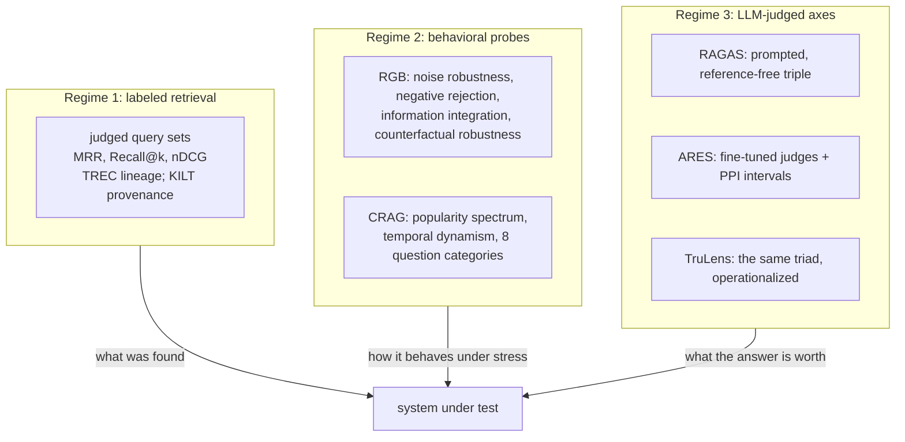

# RAG Evaluation and LLM Judges: Behavioral Benchmarks, Judged Metrics, and Judge Reliability

This article consolidates what the RAG evaluation literature actually establishes, traced from the benchmark section of the Zhao et al. 2026 survey ([[ARTICLE - Study - RAG for AIGC Survey Zhao et al 2026 - Digest and Experiment Candidates]]) into its primary sources: the RGB behavioral benchmark, the RAGAS/ARES/TruLens judged-metric family, the CRAG difficulty taxonomy, and the judge-reliability line of work (MT-Bench, G-Eval, the self-preference result). Each primary source was read directly; extracted copies live in this vault's `resources/` folder. The closing section turns the findings into design rules for the judged-evaluation work in `rag-ttc` (ticket RAG-TTC-SYSLAB-001, experiments E15/E20/E21).

> [!summary]
> 1. RAG evaluation has three distinct regimes — labeled-retrieval metrics, behavioral probes, and LLM-judged quality axes — and they answer different questions; a complete evaluation stack uses all three.
> 2. The judged-metric standard is the reference-free triple (faithfulness, answer relevance, context relevance). RAGAS computes it by prompting alone; ARES shows that fine-tuned lightweight judges plus a ~150-example human validation set beat prompting by wide margins (59.3 pp on context relevance) and yield confidence intervals.
> 3. LLM judges approximate human preference well (GPT-4: >80% agreement on MT-Bench, matching human–human agreement) but carry measured biases — position, verbosity, self-enhancement — and self-preference has a demonstrated causal link to self-*recognition*.
> 4. The behavioral findings are stark: models tolerate some retrieval noise but "struggle significantly" at refusing unanswerable questions and detecting false retrieved content (RGB); even state-of-the-art industry RAG answers only 63% of CRAG questions without hallucination.

## Why this note exists

A RAG system is easy to evaluate badly. End-to-end answer accuracy hides which stage failed; retrieval metrics alone say nothing about what the generator did with the evidence; and an LLM judge bolted on without reliability controls replaces one unmeasured quantity with another. The literature since 2023 has produced a workable doctrine — but it is scattered across benchmark papers, framework papers, and bias studies that rarely cite each other's caveats. This note assembles the doctrine with its numbers, because the numbers (agreement rates, bias magnitudes, accuracy deltas between judging approaches) are what turn "use an LLM judge" from a slogan into an engineering decision.

## The three regimes

**Regime 1** measures retrieval against human relevance labels. It is the oldest, most trustworthy regime (see [[ARTICLE - Retrieval Evaluation - Judged Sets, Ranking Metrics, and Per-Query Analysis]]) and the only one with no model in the measurement loop. Its limitation is scope: it stops at the ranking.

**Regime 2** measures the *system's behavior under constructed stress*, with deterministic scoring against constructed ground truth. **RGB** (Chen et al., 2023) builds four testbeds, one per required ability: extract the answer from noisy retrieved documents; refuse when the retrieved content cannot answer ("negative rejection"); integrate facts across multiple retrieved pieces; detect planted falsehoods ("counterfactual robustness"). Its finding, verbatim in spirit: models "exhibit a certain degree of noise robustness, but struggle significantly in terms of negative rejection, information integration, and dealing with false information." **CRAG** (Yang et al., 2024; 4,409 QA pairs, five domains, eight question categories, mock web/KG search APIs) adds two difficulty axes real corpora have: entity popularity (head to long-tail) and temporal dynamism (facts stable for years down to seconds). Its headline numbers calibrate expectations for the whole field: advanced LLMs alone ≤34% accuracy; straightforward RAG lifts that only to 44%; state-of-the-art industry pipelines answer 63% without hallucination — and accuracy drops further exactly where popularity falls, dynamism rises, or complexity grows.

**Regime 3** scores answer quality with a model in the loop, because reference answers do not exist for a live system. This regime is where the engineering care concentrates, and the next two sections treat it in detail.

## The judged triple, and two ways to compute it

RAGAS, ARES, and TruLens agree on *what* to measure — three reference-free axes:

- **Faithfulness** — every claim in the answer is inferable from the retrieved context.
- **Answer relevance** — the answer addresses the question, without omissions or padding.
- **Context relevance** — the retrieved context contains what is needed and little else.

They disagree on *how*, and the disagreement is instructive.

### RAGAS: prompting with structural decomposition

RAGAS (Es et al., 2023) computes each axis by prompting a general LLM, but never as a bare "rate this 1–10". Each metric has a *structure* that converts a vague judgment into countable sub-judgments:

- **Faithfulness**: an LLM first decomposes the answer into atomic statements; a second prompt verdicts each statement against the context; the score is the supported fraction $F = |V|/|S|$. The decomposition is the load-bearing step — verifying short assertions is a far more tractable task than verifying a paragraph.
- **Answer relevance**: the LLM generates $n$ questions *from the answer*; the score is the mean embedding similarity between those questions and the original question. An answer that addresses the question generates the question back.
- **Context relevance**: the LLM extracts the context sentences crucial to answering; the score is the extracted fraction of the context. Padding lowers it.

RAGAS's own validation (WikiEval, agreement with paired human annotators) is candid: faithfulness agrees at 0.95, answer relevance at 0.78, **context relevance at only 0.70** — the retrieval-side judgment is the hardest to prompt reliably, plausibly because "crucial to the answer" is exactly the kind of holistic judgment decomposition helps least.

### ARES: fine-tuned judges with statistical guarantees

ARES (Saad-Falcon et al., 2023) treats the same triple as three *classification tasks* and attacks RAGAS's weak points directly. Its pipeline: (1) generate synthetic query–answer pairs from the target corpus (few-shot prompted, filtered by whether the query retrieves its source passage); (2) fine-tune lightweight judge models per axis on contrastive positives/negatives; (3) score RAG systems with the judges, then apply **prediction-powered inference (PPI)** against a small human validation set (~150 annotated examples) to produce *confidence intervals* rather than point scores. Reported results: +59.3 pp over RAGAS on context-relevance evaluation accuracy and +14.4 pp on answer relevance (averaged across KILT/SuperGLUE tasks), hallucination-rate prediction within 2.5 pp of ground truth on AIS, robustness across domain shift, and 78% fewer annotations than annotation-based scoring at equal accuracy.

The general lessons, independent of adopting ARES itself: **a judged metric improves when the judgment is decomposed** (RAGAS's statements) **or specialized** (ARES's per-axis judges), and **a small human-labeled set is not optional if you want calibrated scores** — PPI is precisely the machinery that converts ~150 human labels plus many model labels into an interval you can defend.

## Judge reliability: what is actually measured

The judge-reliability literature answers the question the frameworks skip: how good is the judge?

**Agreement can be excellent.** MT-Bench (Zheng et al., 2023) measured GPT-4-as-judge against thousands of expert and crowdsourced human preference votes: **over 80% agreement — the same level as human–human agreement**. This is the load-bearing result for the whole regime: a strong judge is not a degraded human; on preference tasks it sits inside the human noise floor.

**But the biases are real, named, and measured** (same paper): **position bias** (the first-presented answer wins more often than order-blind scoring allows), **verbosity bias** (longer answers score higher at equal content), **self-enhancement bias** (a judge favors outputs of its own model family), and **limited reasoning-grading ability** (judges mis-score math/logic they cannot themselves solve — grading is bounded by competence). G-Eval (Liu et al., 2023) — chain-of-thought plus form-filling, with token-probability-weighted scores — pushed correlation with humans to then-state-of-the-art on summarization and *still* flagged "a bias towards the LLM-generated texts" in its own analysis.

**Self-preference has a mechanism.** Panickssery et al. (2024) showed LLMs have non-trivial accuracy at *recognizing their own outputs*, and — via fine-tuning — a **linear relationship between self-recognition capability and self-preference strength** that survives confounder controls. This upgrades "don't judge your own homework" from hygiene to a causal claim: the better a model knows its own style, the more it favors it.

**Mitigations with evidence behind them**: randomize or swap presentation order and average (position); score single answers against anchored rubrics rather than pairwise where possible (position, verbosity); decompose into verifiable sub-claims (competence, verbosity); use a judge from a different model family than the generator (self-preference); weight scores by token probabilities rather than taking the argmax score (G-Eval; reduces discretization noise); calibrate against a small human set (ARES/PPI). The broader LLM-as-judge survey (Gu et al., 2024) catalogues these and more.

## Synthesis: an evaluation stack, and the design rules for ours

The literature composes into a stack, cheapest and most trustworthy first:

1. **Labeled retrieval metrics** wherever labels exist. Nothing model-judged should replace them — note that ARES/RAGAS's weakest axis (context relevance) is precisely the one real relevance labels make unnecessary.
2. **Behavioral probes** built from those same labels: noise injection, withheld-evidence rejection tests, planted-falsehood tests. Deterministically scored, no judge involved, and — per RGB and CRAG — where systems actually fail.
3. **Judged quality axes** only for what neither of the above reaches: faithfulness and answer relevance of free-text answers. Structured (decomposed claims, anchored rubrics), reliability-controlled (cross-family judge, order randomization, recorded pairings), and calibrated when the stakes warrant it (a small human validation set + PPI).

Mapped onto `rag-ttc` (ticket RAG-TTC-SYSLAB-001):

- Regime 1 exists (148 queries, 243 judgments, the audited coverage of [[ARTICLE - Retrieval Evaluation - Judged Sets, Ranking Metrics, and Per-Query Analysis]]). Context relevance as a *judged* metric is therefore de-prioritized: our labels answer it better than a judge can (0.70 agreement is the ceiling RAGAS reports for prompting it).
- Regime 2 is experiment **E15**: noise injection (RGB dimension 1) and negative rejection (dimension 2), with an advantage the benchmarks lack — the grounded-answer contract makes abstention an explicit output field, so rejection is counted, not inferred. RGB's finding predicts E15b will find failures; every contract escape gets quoted.
- Regime 3 is experiment **E21**, and the literature fixes its design: decompose-then-verify for faithfulness (the RAGAS structure, not a bare score); answer relevance by rubric; skip judged context relevance; judge with a different model family than the generator and record the pairing in the run config (the Panickssery result makes silent same-family judging indefensible); randomize any ordered presentation; cache every verdict like any generation, prompt verbatim in config. A ~150-example human validation set with PPI is recorded as the calibration step if E21's numbers ever need to support a strong claim.
- CRAG's difficulty axes suggest a free enrichment: tag our per-query results by entity rarity (the species long-tail) — the per-query delta table already exists, and the popularity axis is where CRAG says degradation concentrates.

## Sources

Primary sources (extracted copies in `resources/`):

- Chen, J. et al. (2023). *Benchmarking Large Language Models in Retrieval-Augmented Generation (RGB).* [arXiv:2309.01431](https://arxiv.org/abs/2309.01431) · [[RES - Chen et al 2023 - RGB Benchmarking LLMs in RAG (arXiv)]]
- Es, S. et al. (2023). *RAGAS: Automated Evaluation of Retrieval Augmented Generation.* [arXiv:2309.15217](https://arxiv.org/abs/2309.15217) · [[RES - Es et al 2023 - RAGAS Automated Evaluation of RAG (arXiv full)]] — metric mechanics and the WikiEval agreement numbers.
- Saad-Falcon, J., Khattab, O. et al. (2023). *ARES: An Automated Evaluation Framework for RAG Systems.* [arXiv:2311.09476](https://arxiv.org/abs/2311.09476) · [[RES - Saad-Falcon et al 2023 - ARES Automated RAG Evaluation (arXiv full)]] — synthetic training, per-axis judges, PPI.
- Zheng, L. et al. (2023). *Judging LLM-as-a-Judge with MT-Bench and Chatbot Arena.* [arXiv:2306.05685](https://arxiv.org/abs/2306.05685) · [[RES - Zheng et al 2023 - Judging LLM-as-a-Judge MT-Bench (arXiv)]] — the >80% agreement result and the named biases.
- Liu, Y. et al. (2023). *G-Eval: NLG Evaluation using GPT-4 with Better Human Alignment.* [arXiv:2303.16634](https://arxiv.org/abs/2303.16634) · [[RES - Liu et al 2023 - G-Eval NLG Evaluation with GPT-4 (arXiv)]]
- Panickssery, A. et al. (2024). *LLM Evaluators Recognize and Favor Their Own Generations.* [arXiv:2404.13076](https://arxiv.org/abs/2404.13076) · [[RES - Panickssery et al 2024 - LLM Evaluators Favor Their Own Generations (arXiv)]]
- Yang, X. et al. (2024). *CRAG — Comprehensive RAG Benchmark.* [arXiv:2406.04744](https://arxiv.org/abs/2406.04744) · [[RES - Yang et al 2024 - CRAG Comprehensive RAG Benchmark (arXiv)]]
- Gu, J. et al. (2024). *A Survey on LLM-as-a-Judge.* [arXiv:2411.15594](https://arxiv.org/abs/2411.15594) · [[RES - Gu et al 2024 - A Survey on LLM-as-a-Judge (arXiv)]]
- Zhao, P. et al. (2026). *RAG for AIGC: A Survey*, §5–6 — the map this note descended from. [DOI](https://doi.org/10.1007/s41019-025-00335-5)

## Related notes

- [[ARTICLE - Study - RAG for AIGC Survey Zhao et al 2026 - Digest and Experiment Candidates]] — where E15/E20/E21 were derived
- [[ARTICLE - Retrieval Evaluation - Judged Sets, Ranking Metrics, and Per-Query Analysis]] — regime 1 in depth
- [[PROJ - RAG-TTC Chunk Lab - Chunking and Representation Experiments on a Free LLM Gateway]] — the system under evaluation
