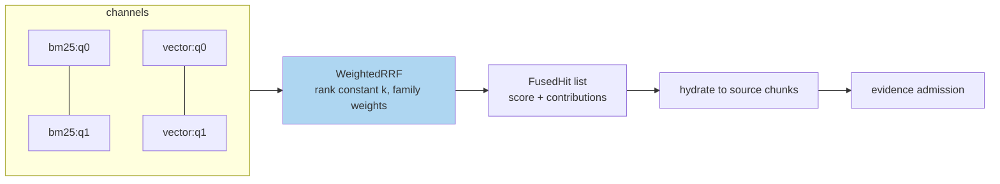

# Rank Fusion: Weighted Reciprocal Rank Fusion over Heterogeneous Channels

This article treats the problem of merging ranked candidate lists produced by retrieval systems whose scores are mutually incommensurable, develops reciprocal rank fusion (RRF) as the standard solution, and documents a production implementation — `WeightedRRF` in `pkg/rag/retrieval/retrieval.go` of the `rag-ttc` repository — whose design decisions (weight fallback by channel prefix, per-channel contribution records, deterministic tie-breaking) address the failure modes that a textbook presentation of the formula omits.

> [!summary]
> 1. Raw scores from different retrieval models occupy unrelated scales; any weighted sum of them encodes an arbitrary and dominant exchange rate. Fusing by *rank* removes the scales from the problem.
> 2. RRF rewards cross-channel agreement: a candidate moderately ranked by several channels typically outranks a candidate one channel loved and the others never saw.
> 3. Fusion destroys attribution unless the implementation preserves it: every fused hit should carry a record of which channel contributed, at what rank, with what weight.
> 4. Dynamic channel topologies (query-variant fan-out) require weight resolution by channel *family*, not by exact channel name.

## Why this note exists

Hybrid retrieval — lexical and vector channels over the same corpus — is now the default architecture, and every hybrid system contains a merge step. The merge step is small, easily written badly, and its defects are invisible: a mis-fused system still returns results, just worse-ordered ones, and nothing in the output says why. The implementation documented here was written for a system whose retrieval strategies multiply channels dynamically (a multi-query strategy produces `bm25:q0`, `vector:q0`, `bm25:q1`, … in one turn), which forced the design past the textbook formula into weight-resolution and attribution questions that generalize.

## Core mental model

### The incommensurability problem

A BM25 score is an unbounded sum of term contributions whose magnitude depends on corpus statistics, query length, and parameter choices. A cosine similarity is a bounded geometric quantity whose distribution depends on the embedding model. A linear combination $\alpha \cdot \text{bm25} + \beta \cdot \text{cosine}$ therefore encodes an exchange rate between quantities that share no unit; the choice of $\alpha/\beta$ silently decides most orderings, varies in effect across queries (BM25 score ranges swing with query length), and cannot be tuned once because it is not stable. Score normalization (min-max or z-scoring within each list) reduces but does not remove the problem: normalized scores remain distribution-dependent, and a channel that returns ten near-identical scores after normalization contributes noise.

Rank fusion dissolves the problem by keeping only each channel's *ordering*. Ranks are dimensionless, identically distributed across channels by construction ($1, 2, 3, \dots$), and robust to every monotone transformation of the underlying scores.

### The RRF formula and its properties

Candidate $d$'s fused score over channels $C$:

$$\text{RRF}(d) \;=\; \sum_{c \in C \,:\, d \in c} \frac{w_c}{k + r_c(d)}$$

where $r_c(d)$ is $d$'s rank in channel $c$, $w_c$ a per-channel weight (1 when unspecified), and $k$ a smoothing constant (60 in the classical formulation; configurable as `RankConstant` in the implementation). Channels that did not return $d$ contribute nothing — absence is a zero term, not a penalty term, which is the correct treatment when channels have bounded depth $k_{\text{retrieve}}$ and absence may mean "rank 21" rather than "irrelevant".

The constant $k$ governs how steeply the top ranks dominate. At $k = 0$, rank 1 is worth twice rank 2 and the fusion approximates a per-channel winner-take-all. At $k = 60$, rank 1 is worth $1/61$ against rank 10's $1/70$ — a ratio of only 1.15 — so agreement across channels outweighs supremacy within one. This yields RRF's characteristic behavior: a chunk ranked 4th by BM25 and 6th by the vector channel ($\frac{1}{64}+\frac{1}{66} \approx 0.0307$) outranks a chunk ranked 1st by BM25 alone ($\frac{1}{61} \approx 0.0164$). Agreement between channels with *uncorrelated error modes* — lexical retrieval failing on synonymy, vector retrieval failing on exact identifiers — is precisely the signal worth amplifying.

### The production implementation

The core loop (`pkg/rag/retrieval/retrieval.go`, abbreviated):

```go
func WeightedRRF(channels map[string][]rag.Hit, config RRFConfig) ([]rag.FusedHit, error) {
    // channel names sorted first: map iteration order must not
    // influence floating-point summation order
    byChunk := map[string]*rag.FusedHit{}
    for _, channel := range sortedChannelNames {
        weight := config.Weights[channel]
        if weight == 0 { weight = 1 }
        for _, hit := range channels[channel] {
            entry := byChunk[hit.ChunkID] // create on first sight
            value := weight / (config.RankConstant + float64(hit.Rank))
            entry.Score += value
            entry.Contributions = append(entry.Contributions, rag.Contribution{
                Channel: channel, Rank: hit.Rank, Weight: weight, Value: value,
            })
        }
    }
    // sort by score descending; ties break on ChunkID for determinism
}
```

Four decisions in this small function carry the engineering content.

**Deterministic iteration and tie-breaking.** Channel names are sorted before accumulation and score ties break on chunk identity. Both exist for the same reason: an experiment harness diffing two runs must never see ordering differences caused by map iteration order or floating-point summation order. Determinism is a precondition for the exact-reproduction exit tests described in [[ARTICLE - Retrieval Evaluation - Judged Sets, Ranking Metrics, and Per-Query Analysis]].

**Contribution records.** Every fused hit accumulates `(channel, rank, weight, value)` tuples. Fusion is a projection — it collapses a matrix of per-channel rankings into a vector — and without the records, the question "why did this chunk fall from rank 2 to rank 9" has no answer. The records feed the system's Hits inspection screen (`pkg/chatui/hits.go`), which displays fused-versus-evidence movement per chunk; they cost a few allocations and repay them the first time a demotion needs attribution.

**Weight fallback by channel family.** The multi-query strategy (below, and in [[ARTICLE - Query and Index Transformations - Closing the Vocabulary Gap from Both Sides]]) creates channels named `bm25:q0`, `bm25:q1`, `vector:q0`, … at runtime. Configuring weights per exact channel name would make configuration depend on how many variants the generator produced. The resolution in `fuseChannels` (`pkg/rag/answering/service.go`) strips the suffix and resolves the *family*:

```go
base := name
if index := strings.IndexByte(name, ':'); index >= 0 {
    base = name[:index]
}
if weight, ok := config.RRFWeights[base]; ok && weight > 0 {
    weights[name] = weight
}
```

Two configured knobs (`bm25`, `vector`) thereby govern arbitrarily many dynamic channels.

**Absence contributes nothing.** The formula's zero-for-absent convention interacts correctly with variant fan-out: a chunk found by three of eight variant channels competes on its three terms, and the fan-out itself becomes a soft voting mechanism across reformulations.

### Where fusion sits in the pipeline



Fusion operates on chunk identities and precedes hydration; representations of different kinds (raw text, summaries, synthetic questions) have already collapsed to their source chunks inside each channel, so fusion is agnostic to what text actually matched. This ordering means representation experiments and fusion configuration compose without interaction terms — a property worth preserving in any redesign.

## Common failure modes

- **Weighted score sums across models.** The exchange-rate problem above; presents as inexplicable per-query variance in hybrid quality.
- **Penalizing absence.** Treating "not in channel's top-k" as rank $\infty$ with a large penalty term punishes bounded channel depth rather than irrelevance.
- **Nondeterministic fusion.** Map-order iteration produces run-to-run ordering jitter that poisons regression testing; sort first.
- **Attribution-free fusion.** Without contribution records, every fusion bug report reduces to "the order looks wrong" with no further decomposition available.
- **Exact-name weight configuration under dynamic channels.** Weights silently stop applying the day a strategy adds a suffix; resolve by family.

## Working rules

- Fuse by rank; never linearly combine raw scores from different retrieval models.
- Keep $k$ configurable and default it high enough (≈60) that cross-channel agreement dominates single-channel supremacy.
- Record per-channel contributions on every fused hit; surface them in inspection tooling.
- Sort channels and break ties deterministically; fusion output must be a pure function of its inputs.
- Resolve weights by channel family when channel names are dynamic.

## Related notes

- [[PROJ - RAG-TTC Chunk Lab - Chunking and Representation Experiments on a Free LLM Gateway]]
- [[ARTICLE - Retrieval Models - Lexical, Vector, and Hybrid Retrieval in RAG Systems]]
- [[ARTICLE - Query and Index Transformations - Closing the Vocabulary Gap from Both Sides]]
- [[ARTICLE - Reranking - Cross-Encoder Second Stages and Their Diagnostics]]
