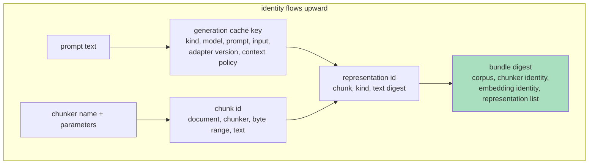

# Reproducibility Engineering: Digests, Caches, Budgets, and Provenance

This article presents the engineering substrate that makes an experimental program over expensive computations (LLM calls, embeddings, index builds) trustworthy and repeatable: content-addressed identity for every artifact, caching keyed on semantic identity, fail-closed budget gates, retry placed beneath the cache, and run-directory provenance. The reference implementation spans `pkg/execution/`, `pkg/rag/generation/cached.go`, `pkg/rag/indexbundle/`, and `pkg/experiment/` in the `rag-ttc` repository.

> [!summary]
> 1. Identity by digest: an artifact's name is a hash of everything that influences it. Reuse becomes automatic; collision becomes impossible; "did the configuration change?" becomes a computable question.
> 2. The cache is not an optimization — it is the lab notebook. Committed per item, keyed on semantic identity, shared across producers, it makes interrupted runs resumable, reruns free, and promotion of experimental winners costless.
> 3. Budgets are fail-closed and stated in advance: no provider work without an explicit ceiling that covers the worst case, refused with the arithmetic before the first call.
> 4. Transient-failure absorption belongs per item, beneath the cache; batch layers fail fast so partial progress is durable.

## Why this note exists

Experimental programs die two deaths: economic (an experiment is too expensive to rerun, so its result is quoted forever without re-verification) and epistemic (nobody can say precisely which configuration produced a number, so the number stops meaning anything). Both deaths are preventable by the same small set of mechanisms, and the mechanisms are cheap — a digest function, a filesystem cache, a preflight check, a run directory. The program that motivated this note survived two killed multi-hour runs, one gateway outage class, and a mid-flight restructuring of its entire generation strategy without losing a single paid computation, entirely on these mechanisms.

## Core mental model

### Content-addressed identity

Every artifact's identity is a digest over its complete causal inputs:



Concretely, in `rag-ttc`: a chunk's ID digests its document, chunker identity string, byte range, and text; a representation's ID digests its chunk, kind, and generated text; a generation cache key (`pkg/rag/generation/cached.go`, `GenerationCacheKeyInput`) digests kind, model, prompt, input text, adapter version, and context policy; an index bundle's ID digests the corpus, the chunker parameters, the embedding identity, and the representation list. The chunker's *name* embeds its parameters (`markdown-1200-120-snap200`) precisely so that a parameter change flows into every chunk ID and from there into every downstream digest.

Two properties follow mechanically. **Reuse is automatic**: building an already-built configuration returns the existing bundle by digest lookup. **Collision is impossible**: a changed prompt yields new representation IDs, a new representation list, a new bundle digest — no configuration can overwrite another's artifacts, and the question "are these two runs comparable?" reduces to digest equality.

The discipline's one recurring trap: an input that influences output but is omitted from the key. The motivating system encountered exactly this with model *reasoning settings* — the generation cache key includes model name but not the reasoning-effort parameter, so cached texts generated under different reasoning regimes are indistinguishable to the cache. The incident was handled by recording the mixture in the experiment's provenance; the durable rule is that every knob that changes output belongs in the key, and any knob deliberately excluded must be recorded as a known approximation.

### The cache as lab notebook

The execution layer (`pkg/execution/cached_map.go`, `MapCached`) maps a work function over items with bounded parallelism, loading cache hits before admitting misses to worker and budget controls, and committing each successful result to the filesystem cache immediately:

```
MapCached(items):
    for each item: compute key(item); load hits
    admit misses to (workers, limiter); on success, store immediately
    -> a later failure leaves earlier results recoverable by the next run
```

Per-item commitment converts the cache from a performance feature into the experimental program's persistence layer. Observed consequences in the motivating program: a run killed by a rate-limit error at call 97 lost nothing — the 97 results served the relaunch; a deliberate strategy pivot abandoned a run 959 calls in, and those 959 calls later priced the new strategy's repair path at zero; and because the experiment harness and the production bundle builder share prompt constants and cache identity (`pkg/rag/representations/prompts.go`), promoting a screening winner into a real bundle replays the screening generations rather than re-paying them. That last property — *cross-producer* cache reuse — is a design decision, not an accident: it requires the shared constants to be the single source of truth and any byte-level divergence in request assembly to be treated as a bug.

### Fail-closed budgets

Provider work is disabled until an explicit budget covers the worst case, and refusal states the arithmetic before the first call:

```
the selected arms need up to 3964 generation calls
(2 specs x 1982 chunks); raise --generation-budget to at least 3964
```

Three details make the gate honest. It prices the **worst case**, not the expectation — a batched strategy that might need per-item repairs budgets for all of them (`BatchedCallCeiling` = groups + one repair per item). It **excludes cache hits** — hits load before the limiter, so the ceiling binds on new spending only, and fully-cached reruns need no budget consumption. And it is **enforced twice**: the preflight refusal, plus a hard limiter (`pkg/execution/budget.go`) threaded into the map layer, so a miscounted preflight still cannot overspend.

### Retry beneath the cache; fail-fast above it

Long batch runs meet transient failures — HTTP 429 at a concurrency cap, dropped streams, resets. The layering that works:

- **Batch layer: fail fast.** The first hard error stops the run. Partial progress is already durable (per-item commitment), and continuing past an error of unknown class risks compounding it.
- **Item layer: absorb transients.** A retrying wrapper (`pkg/rag/generation/retry.go`, `WithRetry`) retries classified-transient failures with exponential backoff and full jitter — the strategy the AWS Architecture Blog's analysis showed minimizes both completion time and contention among competing clients — never retries context cancellation, and never retries provider verdicts (a model refusing a malformed request will refuse it identically six times). Classification is by substring against the flat error strings the provider layer emits — an admission that no typed error surface crosses that boundary, recorded as such.

Placement beneath the cache means a retried success stores once and every replay is free; placement of *classification* at the item layer means the batch layer needs no provider knowledge at all.

### Run-directory provenance

Every experiment invocation writes an immutable directory (`pkg/experiment/`): configuration with verbatim prompts, per-arm results, per-query observations, a terminal status (`Complete`/`Fail`), and a machine-readable results file that inspection tooling renders generically (numeric leaves flattened to dotted metric paths, so producers with new report shapes still browse). Around the directories, three social rules with technical teeth:

1. **Names are permanent.** An experiment arm's name is its identity across all history; a changed prompt or parameter is a *new* name. Renames orphan every recorded comparison.
2. **Prompts verbatim, in the config.** The cache key digests the prompt; the config file makes it readable. Both are needed — one for machines, one for reviewers.
3. **Claims cite run IDs.** Every number in a write-up names the run directory that produced it. The write-up is thereby re-derivable, and a harness change that breaks reproduction is detected by the exit-test discipline of [[ARTICLE - Retrieval Evaluation - Judged Sets, Ranking Metrics, and Per-Query Analysis]].

## Common failure modes

- **Cache keys missing a causal input.** Silent staleness; the worst variant is a key missing the *prompt*, which makes prompt iteration a no-op. Digest everything, or record the exclusion.
- **Batch-level retries.** Retrying a whole batch re-executes completed work (harmless with a cache, wasteful) and can loop on deterministic failures (harmful always).
- **Budgets on expected rather than worst case.** The overrun arrives precisely during the failure scenario the budget existed for.
- **Mutable run directories.** A "fixed-up" result file destroys the only evidence of what the run actually produced; corrections are new runs.
- **Version-control blind spots for generated infrastructure.** The motivating program lost a full commit's contents to an unanchored `.gitignore` pattern (`experiments/` matching a source directory of the same name); the commit message described files the commit did not contain. Anchor ignore patterns to the repository root, and read `--stat` output on commits that matter.
- **Quoting historical numbers across harness changes.** Without exact-reproduction gates, instrument drift is indistinguishable from effect.

## Working rules

- Name every artifact by a digest of its complete causal inputs; treat "not in the key" as a recorded approximation, never an oversight.
- Commit cache entries per item; design every long computation to be killed safely at any point.
- Share cache identity across every producer that assembles the same requests; centralize the constants.
- Refuse provider work without a worst-case budget, stated with its arithmetic; enforce with a hard limiter besides the preflight.
- Retry transients per item beneath the cache; fail batches fast.
- Write immutable run directories; permanent names; verbatim prompts; claims cite runs.

## Sources and further reading

- Brooker, M. (2015). *Exponential Backoff and Jitter.* AWS Architecture Blog. [aws.amazon.com](https://aws.amazon.com/blogs/architecture/exponential-backoff-and-jitter/) · [[RES - AWS Architecture Blog - Exponential Backoff and Jitter]] — the simulation-backed case for full jitter; the companion [retry-with-backoff pattern](https://docs.aws.amazon.com/prescriptive-guidance/latest/cloud-design-patterns/retry-backoff.html) catalogues the variants.
- *Git Internals — Git Objects.* [git-scm.com](https://git-scm.com/book/en/v2/Git-Internals-Git-Objects) — the most widely deployed content-addressed store; the digest-identity discipline in this article is the same idea applied to experiment artifacts.
- Implementation discussed: `pkg/execution/` (`MapCached`, budgets, `FileCache`), `pkg/rag/generation/cached.go` and `retry.go`, `pkg/rag/indexbundle/` (digested bundles), `pkg/experiment/` (run directories) in the rag-ttc repository.

## Related notes

- [[PROJ - RAG-TTC Chunk Lab - Chunking and Representation Experiments on a Free LLM Gateway]]
- [[ARTICLE - Retrieval Evaluation - Judged Sets, Ranking Metrics, and Per-Query Analysis]]
- [[ARTICLE - Measurement Discipline and LLM IO - Throughput, Batching, and Structured Output]]
