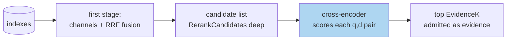

# Reranking: Cross-Encoder Second Stages and Their Diagnostics

This article explains why reranking exists as a separate architectural stage, what it can and cannot repair, how a reranking stage is wired responsibly (candidate budgets, caching, deterministic fallbacks), and what its diagnostics must show. It draws on the `rag-ttc` implementation — the `StrategyRRFReranked` path in `pkg/rag/answering/service.go`, the cached reranking layer in `pkg/rag/reranking/`, and the promoted/demoted audit in `pkg/chatui/hits.go` — including the case where the honest engineering outcome was recording that *no reranker was available*.

> [!summary]
> 1. First-stage retrievers score query and document independently, which is what makes them indexable; a cross-encoder scores the pair jointly, which is what makes it accurate and unindexable. Reranking is the architectural reconciliation.
> 2. Reranking reorders *within* the retrieved candidate set; it can never recover a first-stage miss. Candidate depth is therefore a quality parameter, not a performance detail.
> 3. Rerank diagnostics are movement accounting: which admitted chunks were promoted or demoted relative to the fused order, and where judged-relevant material moved.
> 4. An arm that cannot run must be recorded as absent with evidence. A silently missing comparison arm biases conclusions exactly as much as a wrong one.

## Why this note exists

Reranking occupies an awkward position in retrieval systems: universally recommended, frequently configured, rarely instrumented, and sometimes — as in the motivating environment — not actually runnable at all. The engineering questions that matter (how many candidates to feed it, how to cache it, what to show when it moves things, what to do when no reranking model exists) are questions about the *stage*, not about any particular cross-encoder, and they are answerable independently of model choice. This note fixes the stage-level design so that model choice becomes the smallest remaining decision.

## Core mental model

### Bi-encoders index; cross-encoders judge

A first-stage retriever must assign scores through independent computations on query and document: BM25 sums precomputed per-term statistics; vector search compares a query embedding against document embeddings computed at indexing time. Independence is precisely what permits an index — all document-side work happens once, before any query exists.

A cross-encoder consumes the concatenated pair $(q, d)$ and attends across the boundary: query terms condition the reading of the document and vice versa. This joint computation is strictly more expressive — it resolves anaphora, negation, and specificity distinctions that independent encodings blur — and it forecloses indexing entirely, because nothing document-side can be computed before the query arrives. The cost per pair is a full model forward pass.

The architecture follows from the cost structure: a cheap indexable stage reduces the corpus to a candidate list of tens, and the expensive accurate stage reorders that list.



### The ceiling and the depth parameter

Reranking permutes the candidate list; its output is a subset of its input. Consequently it cannot raise recall at candidate depth — a relevant chunk absent from the candidates stays absent — and its entire value concentrates on precision at the top of the final list. Two design consequences:

**Candidate depth is a quality knob.** The `rag-ttc` retrieval config separates `EvidenceK` (how much survives into the evidence context) from `RerankCandidates` (how deep a list the reranker sees):

```go
evidenceLimit := request.Config.EvidenceK
if request.Config.Strategy == StrategyRRFReranked {
    evidenceLimit = request.Config.RerankCandidates   // hydrate deeper
}
evidence, err := retrieval.Hydrate(result.Fused, s.Chunks, evidenceLimit)
```

The system hydrates *more* candidates than it intends to keep precisely so the reranker has recall headroom to work with; the reranker then returns `EvidenceK` results. Setting the two equal silently reduces the stage to a no-op with extra latency.

**Reranking runs on hydrated source chunks, never on representations.** The rerank request carries `Candidates: evidence` — full source text after hydration. A cross-encoder judging a one-sentence summary judges the summary, not the chunk; the representation layer's whole contract (see [[ARTICLE - Representation Theory for Retrieval - Indexing Descriptions Instead of Content]]) is that condensed surrogates end at retrieval.

### Wiring the stage responsibly

Three disciplines from the implementation generalize.

**Cache with a complete identity.** A rerank result is a pure function of (model, query, candidate identities and order, result count, adapter version). The cached layer (`pkg/rag/reranking/cached.go`) digests exactly that tuple; replayed turns and repeated experiments then cost nothing, and — as with generation caching — the cache key's adapter-version component means a change in how requests are assembled invalidates honestly rather than colliding silently.

**Budget-gate like any provider call.** In interactive use the system raises a bounded reranking budget only when the session's strategy actually reranks (`interactiveRerankingBudget` in `pkg/chat/runtime.go`); the stage inherits the same fail-closed posture as generation and embedding: no configured budget, no calls.

**A deterministic degenerate reranker exists.** `pkg/rag/reranking/overlap.go` implements `TermOverlap`, ranking candidates by distinct query-term overlap. It is not a good reranker; it is a *deterministic, free* one, which makes it the correct stand-in for pipeline tests and offline experiments where the stage's plumbing — depth handling, caching, diagnostics — must be exercised without a provider. Keeping a degenerate implementation of every provider-backed interface is a pattern worth applying generally.

### Diagnostics: movement accounting

Because reranking is a permutation, its natural diagnostic is the permutation itself. The `rag-ttc` Hits screen (`renderRerankSummary` in `pkg/chatui/hits.go`) compares each admitted chunk's *fused* rank with its *post-rerank evidence slot* and renders the promoted and demoted sets. Beside it, the judged-relevance audit (`renderAuditSummary`) reports where judged-relevant units ranked and — its most valuable sentence — which judged unit is *absent from the fused list entirely*, which is the line that distinguishes "the reranker demoted the answer" from "the first stage never found it". Together the two views implement the stage-attribution discipline of [[ARTICLE - Retrieval Models - Lexical, Vector, and Hybrid Retrieval in RAG Systems]]: every quality complaint about reranking decomposes into a first-stage recall question and a second-stage ordering question, and the screens answer each separately.

For offline evaluation, the same accounting aggregates: per query, the first-relevant rank before and after reranking; over queries, improved/unchanged/regressed counts — the identical methodology used for every other lever in [[ARTICLE - Retrieval Evaluation - Judged Sets, Ranking Metrics, and Per-Query Analysis]].

### The absent arm

The motivating environment currently has *no reranking provider*: the LLM gateway serves no rerank endpoint (verified: HTTP 404 on `/v1/rerank`; the model listing offers chat models only), and the one configured reranker profile (`mac-bge-reranker`, a llama.cpp cross-encoder behind a tunnel) was unreachable. The experiment program's response is the generalizable part: the prerequisite task was closed with the *evidence of the attempt* recorded in the ticket, and the strategy comparison proceeds explicitly five-armed instead of six-armed, with the absence stated in the comparison's write-up. The alternative — quietly dropping the arm — would leave every future reader of the comparison to assume reranking was tested and not worth reporting. An absent arm and a losing arm are different scientific results, and only explicit recording keeps them distinguishable.

## Common failure modes

- **Expecting recall from a precision stage.** Judged-relevant material missing from candidates is a first-stage problem; widen `RerankCandidates` or fix retrieval, do not tune the reranker.
- **Candidate depth equal to evidence depth.** The stage degenerates to latency with no reordering room.
- **Reranking representations.** Summaries and questions are retrieval surrogates; the cross-encoder must judge hydrated source text.
- **Uncached reranking in experiment loops.** Every evaluation rerun re-pays the full candidate × query product; the cache key is small and the savings compound.
- **Silent arm omission.** A comparison whose reranked arm could not run must say so with evidence, or its conclusions overreach.
- **No degenerate implementation.** Without a free deterministic reranker, the stage's plumbing is only testable against a live provider, which couples correctness testing to availability.

## Working rules

- Hydrate deeper than you admit: `RerankCandidates > EvidenceK`, always.
- Rerank source text only, after hydration.
- Cache on the full identity tuple (model, query, candidates, count, adapter version); budget-gate calls fail-closed.
- Ship the movement accounting (promoted/demoted versus fused order) in the same surface that shows retrieval hits.
- Keep a deterministic degenerate reranker wired for tests and offline arms.
- Record unrunnable arms as absent-with-evidence; never let an arm vanish from a comparison silently.

## Related notes

- [[PROJ - RAG-TTC Chunk Lab - Chunking and Representation Experiments on a Free LLM Gateway]]
- [[ARTICLE - Rank Fusion - Weighted Reciprocal Rank Fusion over Heterogeneous Channels]]
- [[ARTICLE - Retrieval Models - Lexical, Vector, and Hybrid Retrieval in RAG Systems]]
- [[ARTICLE - Retrieval Evaluation - Judged Sets, Ranking Metrics, and Per-Query Analysis]]
