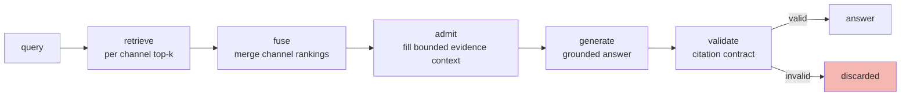

# Retrieval Models: Lexical, Vector, and Hybrid Retrieval in RAG Systems

This article presents the retrieval theory underlying retrieval-augmented generation: the staged pipeline that carries a question to a grounded answer, the scoring model of lexical retrieval, the geometry of vector retrieval, the fusion of heterogeneous rankings, and the transformations that close the vocabulary gap between queries and documents. The material was consolidated while building the chunk-and-representation laboratory in [[PROJ - RAG-TTC Chunk Lab - Chunking and Representation Experiments on a Free LLM Gateway]], but every statement here is general.

> [!summary]
> 1. A RAG system is a funnel of narrowing stages — retrieve, fuse, admit, generate, validate — and quality analysis must locate losses per stage, not per answer.
> 2. BM25's length normalization means the best-scoring representation of a text is often not the text itself; this single property explains why condensed representations can outrank full chunks.
> 3. Lexical and vector retrieval fail differently; reciprocal rank fusion merges them by rank because their scores are incommensurable.
> 4. The query-document vocabulary gap can be closed from the query side (expansion, HyDE) or the index side (synthetic questions); the index side is paid once and cached, the query side is paid per query.

## Why this note exists

Retrieval quality determines the ceiling of every downstream stage in a RAG system: a generator cannot cite evidence that retrieval never surfaced. Yet retrieval is frequently treated as a black box — an index is built with default settings and the interesting engineering is presumed to live in prompting. The laboratory work that motivated this note demonstrated the opposite: the largest quality movements came from changing *what text was indexed*, an intervention that is invisible unless the retrieval model's scoring mechanics are understood. This note records those mechanics precisely enough to predict such effects rather than merely observe them.

## Core mental model

### The staged funnel

A retrieval-augmented answer passes through five stages, each of which discards candidates:

The stages are instrumented separately because their failure modes are disjoint. A *retrieval miss* means the relevant text appeared in no channel's top-k; no downstream stage can recover it. A *fusion demotion* means one channel found it but the merged ranking buried it. An *admission cut* means it ranked well but the evidence budget filled before it. A *generation fault* means the evidence was present and the model misused it. A *validation rejection* means the model cited something that was not admitted, and the contract discarded the answer rather than presenting an unverifiable claim. Attribution of an error to a stage is the first act of any quality investigation; systems that report only end-to-end answer quality cannot be debugged.

### Lexical retrieval: the BM25 scoring model

BM25 scores a document $d$ for a query $q$ as a sum of per-term contributions:

$$\text{score}(d,q) = \sum_{t \in q} \text{IDF}(t)\; \cdot\; \frac{f(t,d)\,(k_1+1)}{f(t,d) + k_1\left(1-b+b\,\dfrac{|d|}{\text{avgdl}}\right)}$$

where $f(t,d)$ is the term's frequency in the document, $|d|$ the document length, $\text{avgdl}$ the mean document length in the index, and $k_1 \approx 1.2$, $b \approx 0.75$ the standard parameters. Three structural properties follow from the formula, and each has operational consequences.

**Term-frequency saturation.** The fraction $\frac{f(k_1+1)}{f+k_1(\cdot)}$ is concave in $f$: the first occurrence of a term contributes most, later occurrences contribute progressively less, and the contribution asymptotes at $(k_1+1)\cdot\text{IDF}$. Padding a document with repeated keywords therefore yields diminishing returns, and a single well-placed occurrence of a discriminative term nearly matches many occurrences.

**Inverse document frequency.** $\text{IDF}(t)$ grows as the term becomes rarer across the collection. In a domain corpus, proper nouns — species names, product names, cultivar designations — carry most of the scoring mass, while common vocabulary contributes little. A practical corollary: retrieval failures in such corpora concentrate on *synonymy of the rare terms* (a query naming a common name, a document naming the Latin binomial), because those are precisely the terms the model weights most and matches most literally.

**Length normalization.** The denominator's $b\,|d|/\text{avgdl}$ term penalizes documents longer than average: a match inside a long document is discounted relative to the same match inside a short one, on the rationale that long documents match more terms by chance. This is the property with the least intuitive and most exploitable consequence: *the best-scoring surrogate for a text is usually shorter than the text*. A one-sentence summary containing the discriminative terms outscores the full chunk containing the same terms plus five hundred words of elaboration. In the motivating laboratory, replacing raw chunk text with lead-sentence extractive summaries as the indexed representation raised MRR from 0.8366 to 0.8585 and improved ten queries while regressing two — a pure length-normalization effect, obtained at zero generation cost.

### Vector retrieval

An embedding model $E$ maps text to $\mathbb{R}^n$ such that semantic relatedness corresponds to angular proximity; retrieval ranks stored vectors by cosine similarity to $E(\text{query})$. Vector retrieval's characteristic strength is exactly lexical retrieval's characteristic weakness: it bridges vocabulary gaps, because "arborvitae" and "Thuja" embed near each other despite sharing no tokens. Its characteristic weaknesses are the mirror image: exact identifiers, numbers, and rare names — the tokens IDF rewards — are represented diffusely, and a query for a specific model number may retrieve texts about the product category.

Search over stored vectors is either exact (compare against every vector) or approximate (graph- or quantization-based indexes such as HNSW). The engineering discipline worth recording: *exact search is the correctness oracle and should remain permanently available*. An approximate index is a measured trade, acceptable only against an explicit threshold — in the motivating system, recall@20 ≥ 0.98 against exact results with p95 latency under 50 ms, evaluated by a dedicated bakeoff harness. "Exact search proved fast enough; no ANN index" is a legitimate outcome of that measurement, and at small corpus scales it is the common one.

### Fusion of heterogeneous rankings

BM25 scores and cosine similarities occupy unrelated scales, and any weighted sum of raw scores encodes an arbitrary exchange rate between them. Reciprocal rank fusion sidesteps the incommensurability by discarding scores entirely: candidate $d$'s fused score is

$$\text{RRF}(d) = \sum_{c \,\in\, \text{channels}} \frac{1}{k + r_c(d)}$$

where $r_c(d)$ is the candidate's rank in channel $c$ (absent candidates contribute nothing) and $k \approx 60$ dampens the top ranks' dominance. RRF rewards cross-channel agreement: a candidate ranked moderately by both channels typically outranks one ranked first by a single channel and unknown to the other. Fused results should carry per-channel contribution records — which channel found each candidate, at what rank — because fusion otherwise erases exactly the information needed to attribute a demotion.

### Closing the vocabulary gap from either side

Queries and documents are drawn from different linguistic distributions: users write short interrogatives, documents write declarative prose. Transformations can move either distribution toward the other.

**Query-side, paid per query.** *Multi-query expansion* generates several paraphrases of the question and retrieves with all of them, fusing per-variant channels; it hedges against a single unlucky phrasing. *HyDE* (hypothetical document embeddings) generates a plausible answer to the question and embeds that answer as the query vector, on the observation that an answer resembles relevant documents more than the question does.

**Index-side, paid once.** *Synthetic questions* generate, for each chunk, the questions the chunk answers, and index those questions as additional searchable representations. This is HyDE's mirror image: instead of transforming each query toward document space at query time, every document is transformed toward query space at indexing time, where the cost is incurred once, cached, and amortized over all future queries. When the evaluation queries are questions — the usual case — question representations are drawn from the same distribution as the queries themselves, which is the strongest distributional match available.

The symmetry gives a cost rule: prefer index-side transformations when the corpus is stable and query volume is high; prefer query-side transformations when the corpus churns faster than the query stream would amortize.

### Reranking as a second stage

First-stage retrievers must score query and document *independently* — that independence is what allows precomputation and indexing (a bi-encoder structure). A cross-encoder scores the concatenated query-document pair jointly, attending across both; it is substantially more accurate and completely unindexable, so it runs as a second stage over the first stage's small candidate list. The architectural consequence: reranking changes *order within* the retrieved set but can never recover a first-stage miss. Its diagnostics therefore belong beside fusion's — a promoted/demoted accounting relative to the fused order — and an evaluation harness that cannot run a reranker must record the arm as absent with evidence, because a silently missing arm biases comparisons exactly as a wrong one does.

## Common failure modes

- **Attributing retrieval misses to generation.** The generator is blamed for answers whose evidence was never retrieved. The funnel instrumentation exists to prevent this misattribution.
- **Summing incommensurable scores.** Weighted score fusion across lexical and vector channels encodes an arbitrary constant that silently dominates results; rank-based fusion removes the constant.
- **Treating the raw text as the optimal index key.** Length normalization guarantees this is false whenever the text contains scoring noise; see [[ARTICLE - Representation Theory for Retrieval - Indexing Descriptions Instead of Content]].
- **Adopting ANN without an oracle.** Approximate recall loss is invisible without exact search to measure against; keep the oracle wired permanently.
- **Evaluating expansion strategies without per-channel provenance.** Multi-query and HyDE add channels; without per-channel contribution records, their marginal value cannot be isolated.

## Working rules

- Instrument every stage of the funnel; report stage-local losses, not only end-to-end quality.
- Keep exact vector search available forever; admit approximate indexes only against explicit recall-versus-oracle thresholds.
- Fuse by rank, never by raw score, across heterogeneous channels.
- When retrieval fails on rare-term synonymy, reach for representation enrichment or vector channels before tuning BM25 parameters.
- Record channel contributions through fusion so demotions are attributable.

## Related notes

- [[PROJ - RAG-TTC Chunk Lab - Chunking and Representation Experiments on a Free LLM Gateway]] — the laboratory that motivated this consolidation
- [[ARTICLE - Rank Fusion - Weighted Reciprocal Rank Fusion over Heterogeneous Channels]] — the fusion stage in depth
- [[ARTICLE - Query and Index Transformations - Closing the Vocabulary Gap from Both Sides]] — multi-query, HyDE, and synthetic questions in depth
- [[ARTICLE - Reranking - Cross-Encoder Second Stages and Their Diagnostics]] — the second stage in depth
- [[ARTICLE - Retrieval Evaluation - Judged Sets, Ranking Metrics, and Per-Query Analysis]]
- [[ARTICLE - Representation Theory for Retrieval - Indexing Descriptions Instead of Content]]
- [[ARTICLE - Chunking Theory - Cut Strategies and the Exact-Slice Invariant]]
