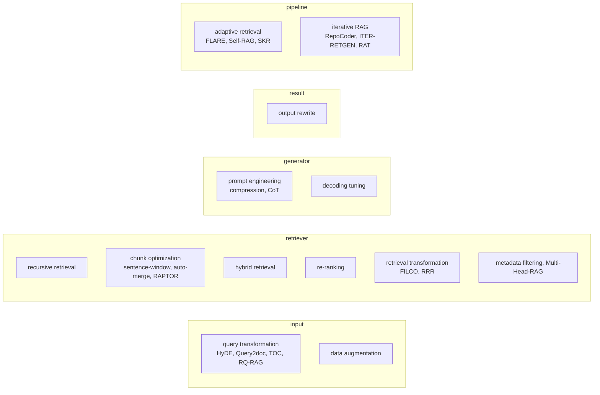

# Study: *Retrieval-Augmented Generation for AI-Generated Content: A Survey* (Zhao et al., 2026) — Digest and Experiment Candidates

This note is a working study of Penghao Zhao et al., "Retrieval-Augmented Generation for AI-Generated Content: A Survey", *Data Science and Engineering* 11:1–29, January 2026 (DOI [10.1007/s41019-025-00335-5](https://doi.org/10.1007/s41019-025-00335-5); companion repository [PKU-DAIR/RAG-Survey](https://github.com/PKU-DAIR/RAG-Survey)). The purpose is twofold: distill the survey's taxonomy precisely enough to position the [[PROJ - RAG-TTC Chunk Lab - Chunking and Representation Experiments on a Free LLM Gateway]] within it, and extract a concrete slate of new experiment candidates for the lab's next design round.

> [!summary]
> 1. The survey organizes RAG along two axes: four *foundations* (how retrieval reaches the generator: query-based, latent-representation, logit-based, speculative) and five *enhancement targets* (input, retriever, generator, result, whole pipeline).
> 2. Our lab occupies one cell deeply — query-based RAG, retriever enhancement via chunk optimization and index-side representation — and has not touched adaptive retrieval, iterative RAG, retrieval transformation, or the evaluation dimensions the RAG benchmarks (RGB, RAGAS) measure.
> 3. The survey's limitations section contains three directly testable claims for our system: retrieval noise sometimes *helps* generation; larger top-k improves attribution while harming fluency; lengthened context degrades both latency and mid-context recall.
> 4. Eight experiment candidates fall out, ordered by cost: an evidence-position audit and a noise/negative-rejection audit (nearly free, reuse existing instrumentation), RAPTOR-lite hierarchical summaries and atomic-statement decomposition (one generation pass each, largely cache-covered), query decomposition and one-round iterative retrieval (new chat strategies), FILCO-style evidence compression, and RAGAS-style faithfulness metrics for the answer-quality harness.

## Why this note exists

The chunk lab was designed bottom-up from one observed anomaly (a lossy representation outranking its source text). The survey provides the top-down complement: a map of everything the field considers a RAG intervention, with named systems for each cell. Reading the lab against the map does two things — it confirms that the lab's territory (index-side representation engineering) is comparatively under-studied in the survey's corpus of systems, and it exposes adjacent territories the lab has instrumentation for but has never measured. The candidates in §5 are chosen to maximize reuse of what already exists: the judged evaluation set, the funnel instrumentation, the generation cache, and the grounded-answer contract.

## The survey's map

### Foundations: four ways retrieval reaches a generator

The survey's first axis classifies *where* retrieved material enters generation:

1. **Query-based RAG** — retrieved content joins the input (prompt augmentation). REALM, RALM variants, REPLUG (LM as black box), In-Context RALM; the dominant paradigm for LLM generators, and the only one available to a system that calls models through an API.
2. **Latent-representation RAG** — retrieved objects enter as hidden representations inside the model. FiD (per-passage encoders, single decoder), RETRO (chunked cross-attention); requires model surgery and joint training.
3. **Logit-based RAG** — retrieval merges at the decoding distribution. kNN-LM and descendants (TRIME, NPM); the retriever supplies next-token probabilities from nearest-neighbor prefixes.
4. **Speculative RAG** — retrieval *replaces* generation steps where possible. REST (retrieval-based speculative decoding), GPTCache (semantic answer caching), COG (copy-and-paste generation).

Our system is purely query-based, necessarily so (black-box API generators), and the survey's observation that query-based RAG "offers modular flexibility, allowing swift integration of pre-trained components" describes the lab's architecture exactly. The other three foundations are out of reach without model access — with one exception: GPTCache-style *semantic answer caching* is a speculative-RAG idea implementable entirely outside the model, noted in §5 as a deferred candidate.

### Enhancements: five targets

The cells most relevant to the lab, with the survey's named exemplars:

- **Chunk optimization** (§3.2.2.2): sentence-window retrieval (retrieve small, return the surrounding window) and auto-merge retrieval (tree-arranged documents; fetch the parent after matching the child) are the survey's names for what the lab implements as *small-to-big* through the representation layer. **RAPTOR** goes further: recursive embed-cluster-summarize until a tree of multi-level summaries exists, all levels indexed. Raina et al. decompose chunks into *atomic statements* for higher recall; MoM trains a dedicated chunking model. The lab's `llm-chunk` arm is a zero-training relative of the latter.
- **Query transformation** (§3.2.1.1): Query2doc and HyDE (pseudo-documents as queries — the lab has HyDE); **TOC** decomposes ambiguous questions into clarification trees; **RQ-RAG** learns to split complex queries into sub-queries retrieved independently. The lab's multi-query strategy paraphrases but never *decomposes*.
- **Retrieval transformation** (§3.2.2.6): **FILCO** filters retrieved text down to the supporting content before the generator sees it; FiD-Light compresses to vectors; RRR restructures query-plus-top-k through a template each round. The lab's funnel has an *admission* stage but performs no content transformation inside it.
- **Metadata filtering and multi-head retrieval** (§3.2.2.7): filter candidates by structured attributes; project one chunk into several embedding spaces (Multi-Head-RAG). The corpus's `evaluation_unit_id`/category metadata is unexploited at retrieval time.
- **Adaptive retrieval** (§3.2.5.1): decide *whether* to retrieve. Rule-based: FLARE (retrieve when token probabilities dip), Mallen et al. (retrieve for low-frequency entities only). Model-based: Self-RAG's critique tokens, SKR's self-knowledge check, Rowen's cross-lingual consistency probe. The survey cites evidence that over-retrieval wastes resources and can *confuse* a model whose parametric knowledge sufficed.
- **Iterative RAG** (§3.2.5.2): cycle retrieval and generation. RepoCoder retrieves with previously *generated* code; ITER-RETGEN uses the generator's output to expose knowledge gaps and re-retrieve; RAT revises chain-of-thought steps against retrieved knowledge; SelfMemory selects from a growing memory pool.

### Benchmarks (§5)

Two families matter for the lab's evaluation design:

- **RGB** (Chen et al.) evaluates four *system-level* dimensions: noise robustness (extract signal from noisy retrieved documents), **negative rejection** (refuse when retrieved content is insufficient), information integration (combine multiple retrieved pieces), counterfactual robustness (detect errors in retrieved content).
- **RAGAS / ARES / TruLens** evaluate with a separate LLM judge along three axes: **faithfulness** (is the answer supported by the retrieved context), **answer relevance** (does it address the query), **context relevance** (is the retrieved context on-topic and concise). CRUD-RAG, MIRAGE (medical), CRAG (five domains, entity-popularity spectrum, temporal dynamism), MultiHop-RAG, LegalBench-RAG (minimal-span retrieval), and OmniEval (finance) specialize further.

Our evaluation measures *retrieval* quality precisely (see [[ARTICLE - Retrieval Evaluation - Judged Sets, Ranking Metrics, and Per-Query Analysis]]) and answer quality only through the grounded-answer contract's binary validity. The RAGAS triple is the obvious extension, and the lab now has an economical judge model to run it with.

### Limitations (§6.1) — three testable claims

1. **Retrieval noise is not monotonically harmful** [ref 356 in the survey]: recent work finds noisy retrieval results sometimes *improve* generation, possibly via prompt-construction effects; "the impact of retrieval noise remains unclear". This is a claim our judged corpus can test directly.
2. **Top-k trades attribution against fluency** [ref 360]: using top-k rather than a single retrieval "improves attribution but harms fluency" in query-based RAG. Our `EvidenceK` knob and citation instrumentation measure exactly these two quantities.
3. **Lengthy context costs twice** (§6.1.5): retrieval lengthens prompts, slowing generation and — per the "Lost in the Middle" line of work [ref 173] — degrading use of mid-context evidence. Our evidence-admission stage controls ordering and is fully instrumented for citation position.

The future-directions section (§6.2) flags flexible pipelines (recursive/adaptive/iterative), long-context models as complements rather than replacements for RAG, and agentic RAG (reasoning–planning–acting–iterating loops) as the field's current edges.

## Where the lab sits in the map

| Survey cell | Lab status |
| --- | --- |
| Query-based foundation | The system's architecture; grounded-answer contract on top |
| Chunk optimization | Deep coverage: size/overlap sweeps, sentence-snap, small-to-big, llm-chunk (E1–E5, `llm-chunk`) |
| Index-side representations | Deep coverage, beyond the survey's inventory: contextual, summaries, questions, entities as *first-class cached representations* (E6–E9) |
| Query transformation | Partial: multi-query, HyDE as chat strategies; no decomposition (TOC/RQ-RAG) |
| Hybrid retrieval + fusion | Implemented (BM25+vector, weighted RRF); measured in Track C |
| Re-ranking | Stage wired, no provider available; recorded absent-with-evidence |
| Retrieval transformation (FILCO) | Not implemented |
| Metadata filtering | Not implemented (metadata exists, unused at retrieval time) |
| Adaptive retrieval | Not implemented |
| Iterative RAG | Not implemented |
| Result enhancement | Contract validation discards; no rewrite |
| RGB/RAGAS-style system evaluation | Not implemented (retrieval metrics only) |

The asymmetry is informative in both directions. The survey's corpus of systems is thin exactly where the lab is deep — cached, digest-identified, promotable index-side representations measured on judged retrieval — and the lab is untouched exactly where the survey's pipeline-enhancement and benchmark sections are rich.

## Experiment candidates for the next design round

Ordered by marginal cost given what the lab already has. Numbering continues the lab's E-series.

**E14 `evidence-position` — the Lost-in-the-Middle audit.** Hypothesis: the probability that the generator cites the judged-relevant chunk depends on its position within the admitted evidence, with mid-context positions weakest. Method: for queries where the judged-relevant chunk is admitted, permute evidence order (first, middle, last) across answer-quality runs; measure citation rate and contract validity per position. Cost: generation only (judge-free), on cached retrieval; ~150 queries × 3 orders. Reuses: funnel instrumentation, citation resolution, answer-quality harness.

**E15 `noise-and-rejection` — the RGB-style robustness audit.** Two sub-experiments. (a) Noise robustness: inject k distractor chunks (random, then topically-near) into the admitted evidence alongside the judged-relevant chunk; measure answer validity, citation precision, and whether moderate noise *helps* (the survey's open question). (b) Negative rejection: run queries whose relevant units are withheld from the corpus; measure the abstention rate the grounded contract produces — the contract's `abstained` field makes this a free readout. Cost: generation only. This doubles as a validation of the contract's core promise.

**E16 `raptor-lite` — hierarchical summary representations.** Hypothesis: multi-level summaries (chunk-level, document-level) indexed together catch queries whose answer spans chunks. Method: reuse the ~2k cached chunk summaries; generate one document-level summary per document (200 calls); index both levels as representations hydrating to their sources (document-level hydrates to the document's top chunks or to a designated lead chunk — a design decision to record). This is RAPTOR truncated to two levels, no clustering. Cost: 200 generation calls plus embeddings on promotion; screening is BM25-free as always.

**E17 `atomic-statements` — decomposition indexing.** Hypothesis (Raina et al. via the survey): indexing per-fact atomic statements raises recall on specific-fact queries beyond summaries. Method: one generation per chunk ("list the atomic factual statements this text asserts, one per line"), each statement a representation, batched exactly like questions. Cost: one spec (~166 batched calls). Directly comparable to `questions-only` — statements are the declarative mirror of the question representations.

**E18 `query-decomposition` — a new chat strategy.** Hypothesis: multi-part questions ("spacing and watering for X") lose to single-shot retrieval; decomposition into sub-queries retrieved independently and fused recovers them. Method: new strategy beside multi-query/HyDE — generate sub-queries under a strict JSON contract, retrieve per sub-query with suffixed channels (`bm25:s0`…), fuse with existing family-weight resolution. The per-query delta table identifies multi-part queries to check the mechanism. Cost: strategy implementation plus per-turn generation; evaluation over the 148-query set via answer-quality.

**E19 `iter-retgen-1` — one round of iterative RAG.** Hypothesis: using the first answer as a retrieval query recovers evidence the question's phrasing missed. Method: generate an answer, re-retrieve with answer text as an additional channel, regenerate; compare single-round versus two-round on retrieval metrics of the second round's fused list and on final answer validity. Bounded to one iteration; the survey's overhead warnings (§6.1.2) argue against unbounded loops. Cost: 2× generation per query.

**E20 `evidence-k-tradeoff` — the attribution/fluency curve.** Hypothesis (survey ref 360): raising `EvidenceK` improves citation coverage of judged-relevant units while degrading answer quality. Method: answer-quality sweep over EvidenceK ∈ {1, 3, 5, 8, 12}; measure citation-of-relevant rate, contract validity, answer length, and a RAGAS-style faithfulness judgment (E21) per k. Cost: generation only.

**E21 `ragas-triple` — harness enhancement, not an arm.** Add LLM-judged faithfulness / answer-relevance / context-relevance scoring to the answer-quality harness, cached like every generation, with the judge prompt recorded verbatim. This upgrades every future answer-quality experiment from binary contract validity to graded quality, and makes E14/E15/E20 far more sensitive. Cost: one judge call per (query, arm) — cache-amortized.

**Deferred, recorded:** metadata-filtered retrieval (blocked on the category/split taxonomy backfill, an owner decision); Multi-Head-RAG-style multi-space embeddings (real embedding cost, thin expected signal at this corpus size); GPTCache-style semantic answer caching (an efficiency play, not a quality experiment); adaptive-retrieval gating (needs answerable-without-retrieval labels the evaluation set does not carry — a labeling task before an experiment).

## Reading notes and caveats

- The survey is breadth-first by design; its per-system descriptions are one to three sentences and occasionally generous. It is a map, not a meta-analysis — effect sizes are almost entirely absent, which is precisely why the lab's measure-everything posture stays necessary.
- The multimodal chapters (image, video, audio, 3D, science) and the code chapter are outside the lab's scope but useful as evidence that the four foundations generalize; nothing there changes the text-RAG design space.
- The survey's related-work section positions it against Gao et al.'s LLM-focused RAG survey and Li et al.'s text-generation survey; for the lab's purposes this survey's enhancement taxonomy (Fig. 4) is the single most reusable artifact, and §5's benchmark inventory the second.

## Sources

- Zhao, P., Zhang, H., Yu, Q. et al. (2026). *Retrieval-Augmented Generation for AI-Generated Content: A Survey.* Data Science and Engineering 11:1–29. [DOI](https://doi.org/10.1007/s41019-025-00335-5) · local copy: `~/Downloads/s41019-025-00335-5.pdf` · code/paper list: [PKU-DAIR/RAG-Survey](https://github.com/PKU-DAIR/RAG-Survey)
- Named systems cited above trace to the survey's references: RAPTOR [137], TOC [127], RQ-RAG [128], FILCO [162], FLARE [181], Self-RAG [85], SKR [186], ITER-RETGEN [190], RAT [192], RGB [345], RAGAS [346], Lost in the Middle [173], noise-helps finding [356], top-k attribution/fluency [360].

## Related notes

- [[PROJ - RAG-TTC Chunk Lab - Chunking and Representation Experiments on a Free LLM Gateway]] — the lab these candidates extend
- [[ARTICLE - Query and Index Transformations - Closing the Vocabulary Gap from Both Sides]] — E17/E18's theoretical frame
- [[ARTICLE - Retrieval Evaluation - Judged Sets, Ranking Metrics, and Per-Query Analysis]] — what E21 extends beyond retrieval metrics
- [[ARTICLE - Representation Theory for Retrieval - Indexing Descriptions Instead of Content]] — E16/E17 are new representation kinds under the same hydration invariant
