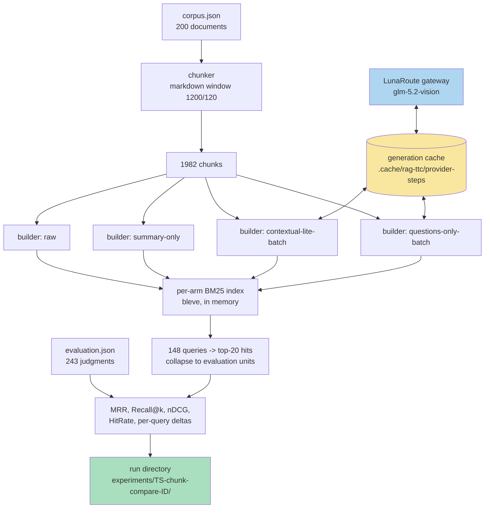
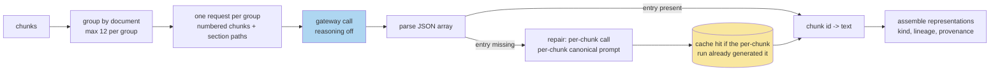

# RAG-TTC Chunk Lab: Chunking and Representation Experiments on a Free LLM Gateway

This project is a measurement program built on top of `rag-ttc`, a Go toolbox for reproducible retrieval-augmented-generation experiments over a plant-nursery document corpus. The lab answers one question with numbers instead of intuition: which combination of chunk cut, indexed representation, and retrieval strategy produces the best retrieval quality on a judged evaluation set. A temporarily free LLM gateway (LunaRoute, serving GLM-5.2-Vision) supplies the generation budget for the expensive experiments — LLM-written contextual blurbs, summaries, synthetic questions, entity expansions, and LLM-directed chunking — which would otherwise be priced out of a side project.

> [!summary]
> The project currently has three identities:
> 1. a screening bench — a registry of 38 comparison arms measured by BM25 retrieval quality against 148 judged queries, with per-query win/loss accounting
> 2. a set of completed free experiments (chunk size, overlap, breadcrumbs, sentence snapping, small-to-big retrieval) with recorded results
> 3. an in-flight set of LLM-generated representation experiments, restructured mid-run around a measured model of the gateway's throughput

## Why this project exists

The `rag-ttc` corpus is a 200-document subset of a 3,096-document plant-care extraction. Retrieval quality over it is measured by an evaluation set of 148 queries and 243 graded judgments, where each judgment names an evaluation unit that maps one-to-one to a corpus document. Earlier work established two facts that motivated a systematic lab. First, the choice of chunker algorithm (heading-aware versus fixed window) is a dead lever: roughly 90% of sections exceed the window size, so both chunkers emit nearly identical cuts and identical retrieval metrics. Second, the choice of indexed representation is a live lever: replacing raw chunk text with a one-sentence extractive summary as the indexed text raised MRR from 0.8366 to 0.8585 and Recall@10 from 0.7986 to 0.8079 at zero provider cost.

A result of that shape — a trivial deterministic transformation of the indexed text beating the raw text — implies that the representation axis is underexplored. The literature offers several candidates that all require generation: contextual retrieval (a situating paragraph prepended to each chunk before indexing), LLM-written summaries, synthetic questions (indexing the questions a chunk answers rather than its statements, which matches the query distribution since evaluation queries are questions), and domain-synonym expansion (the corpus exhibits botanical synonymy such as Thuja ↔ arborvitae, which BM25 cannot bridge). Each candidate costs roughly one generation call per chunk, and the corpus has 1,982 chunks. The free gateway window converts these from budget requests into engineering problems.

## Current project status

The project is executing ticket `RAG-TTC-CHUNKLAB-001` (in the repo under `ttmp/2026/07/30/`). Status by track:

- **Bench (Phase 1): complete.** The screening harness reproduces the previously recorded baseline table digit-for-digit, which is its exit test.
- **Track A, free experiments (E1–E5): complete, results recorded.** Chunk size is a live lever with a knee at 1,600–2,400 runes; overlap is dead for retrieval; heading-path breadcrumbs are a free improvement with zero regressed queries; sentence snapping is a marginal improvement; small-to-big retrieval reproduces the small-chunk metrics exactly, which validates the parent-mapping plumbing.
- **Track B, generated representations (E6–E9): generation in flight.** After a mid-run restructuring (documented below), all nine generated arms plus an LLM-directed chunking arm run as one batched invocation, approximately 1,030 gateway calls instead of the original 9,910.
- **Track C, confirmation under vector and fused retrieval (E10–E11): pending Track B winners.** The promotion path is already wired: the bundle builder accepts every generated representation kind and shares the generation cache with the screening bench, so promoting a winner costs no new generation.

## Project shape

The lab is three layers on top of the existing `rag-ttc` core:

- `pkg/rag/representations/` — representation builders: deterministic (extractive summaries, breadcrumbs, small-to-big parent mapping) and generated (contextual, summaries, questions, entities), in per-chunk and batched forms, plus the canonical prompt constants and the generation cache identity.
- `cmd/rag-ttc/cmds/experiments/chunkcompare/` — the screening bench: an arm registry, a budget-gated cached generation path, BM25 measurement per arm, and per-query delta accounting against a fixed baseline.
- `cmd/rag-ttc/cmds/indexes/` — the promotion path: `indexes build --representations raw,summary,contextual,question,entities` builds immutable index bundles whose generated representations come from the same cache the bench populated.

## Fundamentals

This section states the concepts the rest of the note depends on. Each subsection is self-contained; a reader who knows the material can skip to [[#Architecture]]. Full textbook treatments of each chapter exist as companion articles:

- [[ARTICLE - Retrieval Models - Lexical, Vector, and Hybrid Retrieval in RAG Systems]]
- [[ARTICLE - Rank Fusion - Weighted Reciprocal Rank Fusion over Heterogeneous Channels]]
- [[ARTICLE - Query and Index Transformations - Closing the Vocabulary Gap from Both Sides]]
- [[ARTICLE - Reranking - Cross-Encoder Second Stages and Their Diagnostics]]
- [[ARTICLE - Retrieval Evaluation - Judged Sets, Ranking Metrics, and Per-Query Analysis]]
- [[ARTICLE - Chunking Theory - Cut Strategies and the Exact-Slice Invariant]]
- [[ARTICLE - Representation Theory for Retrieval - Indexing Descriptions Instead of Content]]
- [[ARTICLE - Reproducibility Engineering - Digests, Caches, Budgets, and Provenance]]
- [[ARTICLE - Measurement Discipline and LLM IO - Throughput, Batching, and Structured Output]]

### Retrieval models

**The staged pipeline.** A retrieval-augmented generation system is a funnel of narrowing stages: *retrieve* candidate chunks from one or more indexes; *fuse* the per-index candidate lists into one ranking; *admit* the top of that ranking into a bounded evidence context; *generate* an answer from the admitted evidence; *validate* the answer against a contract before showing it. In `rag-ttc` the contract (`ttc-grounded-answer-v1`) requires every citation to name an admitted evidence chunk; an answer that fails validation is discarded rather than repaired. Each stage loses candidates, so quality analysis proceeds stage by stage: a wrong answer traces back to either a retrieval miss, a fusion demotion, an admission cut, or a generation fault, and the stages are instrumented separately so the loss can be located.

**BM25.** Lexical retrieval scores a chunk $d$ against a query $q$ as a sum over query terms:

$$\text{score}(d,q) = \sum_{t \in q} \text{IDF}(t) \cdot \frac{f(t,d)\,(k_1+1)}{f(t,d) + k_1\,(1-b+b\,\frac{|d|}{\text{avgdl}})}$$

Three properties of this formula drive the lab's results. First, term frequency saturates: the $k_1$ term means the second and third occurrences of a term add less than the first, so repeating text is not rewarded linearly. Second, IDF weights rare terms: species names and product names dominate scores in this corpus because they are rare across chunks. Third, document-length normalization (the $b\,|d|/\text{avgdl}$ term) penalizes long chunks: a term match inside a short chunk counts for more than the same match inside a long one. This third property is the mechanism behind the lab's founding observation — indexing a one-sentence extractive summary instead of the full chunk raised MRR from 0.8366 to 0.8585, because the summary concentrates the discriminative terms into a short document and discards the low-value remainder. A lossy representation outperforms the text it summarizes whenever the loss falls mostly on scoring noise.

**Vector retrieval.** An embedding model maps text to a fixed-dimension vector such that semantically related texts lie near each other under cosine similarity. Retrieval is nearest-neighbor search over the embedded representations. Exact search compares the query vector against every stored vector and is the correctness oracle; approximate indexes (HNSW and similar) trade recall for latency and are only justified when measured against the oracle — `rag-ttc` keeps exact search wired permanently and defines ANN acceptance as recall@20 ≥ 0.98 against exact results. Vector retrieval closes vocabulary gaps that BM25 cannot (a query about "arborvitae" can match a chunk that only says "Thuja"), at the price of real embedding cost per representation, which is why the lab screens with BM25 and confirms with vectors.

**Fusion.** When lexical and vector channels both return rankings, reciprocal rank fusion merges them by rank rather than score: each candidate receives $\sum_c 1/(k + r_c)$ over the channels $c$ that returned it, where $r_c$ is its rank in that channel and $k$ is a smoothing constant. Rank-based fusion avoids the incommensurability of raw scores (BM25 scores and cosine similarities have unrelated scales) and rewards candidates that multiple channels agree on.

**Query-side and index-side transformations.** The vocabulary gap between queries and documents can be closed from either side. Query-side: *multi-query expansion* generates several paraphrases of the user's question and retrieves with all of them; *HyDE* generates a hypothetical answer and embeds that instead of the question, on the theory that an answer resembles the documents better than a question does. Index-side: *synthetic questions* generate, for each chunk, the questions it answers, and index those questions — the mirror image of HyDE, moving the transformation to indexing time where it is paid once and cached rather than per query. The lab measures the index-side family; `rag-ttc` chat already implements the query-side family as strategies.

**Reranking.** First-stage retrievers score query and document independently (bi-encoder structure), which is what makes them indexable. A reranker scores the concatenated query-document pair (cross-encoder structure), which is more accurate and cannot be indexed; it therefore runs as a second stage over a small candidate list. Reranking appears in the lab's design as the `rrf-reranked` strategy, currently unrunnable in this environment because no reranking provider exists — a fact recorded with evidence rather than silently dropped, since an absent arm biases a comparison exactly as much as a wrong one.

### Evaluation methodology

**Judged sets and units.** The evaluation set contains 148 queries and 243 judgments; a judgment assigns a graded relevance to an *evaluation unit* for a query. Units map one-to-one to corpus documents through corpus metadata. Retrieval returns chunks, so scoring first collapses the chunk ranking to a unit ranking: each chunk maps to its document's unit, and a unit keeps only its best (first) position. Collapsing is what makes arms with different chunk counts comparable — an arm with 7,632 small chunks and an arm with 855 large ones both reduce to rankings over the same 200 units.

**Metrics.** For one query with judged-relevant unit set $R$ and a ranked unit list, with $r$ the rank of the first relevant unit:

- *Reciprocal rank* is $1/r$ (0 if no relevant unit appears); MRR is its mean over queries. MRR moves only when the *first* relevant result moves, which makes it the most sensitive single metric for user-facing quality of a top-heavy interface.
- *Recall@k* is $|R \cap \text{top-}k| / |R|$: the fraction of relevant units found in the top $k$. It rewards breadth and is insensitive to order within the cutoff.
- *HitRate@k* is 1 if any relevant unit appears in the top $k$, else 0: the probability a user who reads $k$ results sees at least one right one.
- *nDCG@k* discounts gain by position, $\sum_i (2^{g_i}-1)/\log_2(i+1)$, normalized by the ideal ordering's value; it is the only metric here that uses the *graded* judgments rather than binary relevance.

The metrics disagree by design. The size sweep produced arms where Recall@10 rose while MRR barely moved, which localizes the effect: larger chunks find more relevant units per ranking without changing which unit comes first.

**Per-query analysis.** A mean can improve while a third of queries regress. The bench therefore records, per arm against a fixed baseline, the count of queries whose first-relevant rank improved, stayed, or regressed, and writes the full per-query rank table into the run directory. The per-query view is what distinguishes `breadcrumb` (+4/−0, a strict improvement) from `size-300` (+6/−6, a redistribution) — two changes a mean-only report would describe similarly.

**Coverage auditing.** A metric silently lies in two ways: queries with no judgments (they are skipped and shrink the denominator) and queries whose relevant units are absent from the corpus subset (they can never score, depressing every arm equally and masking headroom). The lab audited both: 4 of 148 queries have no judgments, and zero queries have their relevant units outside the corpus. The audit converts "MRR is 0.8585" into "MRR is 0.8585 over a set with no hidden holes", which is a different strength of claim.

**Controlled comparison.** Three rules make arm numbers interpretable. *One variable per arm*: an arm that changes cut size and representation simultaneously produces a number nobody can attribute. *A fixed baseline in every invocation*: harness drift shows up immediately as a baseline shift, and deltas always have their reference measured under identical conditions. *Exact-reproduction exit tests*: the rebuilt bench had to reproduce the previously recorded table digit-for-digit before any new arm ran, which is the only evidence that a measurement change measures the same thing.

### Chunking theory

**Why chunking exists.** Documents exceed both embedding-model input limits and useful retrieval granularity. Chunking sets the trade between *precision* (small chunks match queries tightly and waste little evidence budget) and *context* (large chunks carry enough surrounding text to be understood and to answer multi-part questions). The evaluation-unit design partially decouples these: retrieval quality is scored at unit level, so chunk size affects how findable a unit is, not what counts as relevant.

**The strategy space.** Fixed windows with overlap are the baseline. Structure-aware cutting (at headings) preserves topical boundaries but is inert when sections exceed the window, which is this corpus's situation — the measured equality of `markdown` and `markdown-heading` is a property of the corpus, not of the algorithms. Sentence snapping retreats window boundaries to sentence ends, trading a few runes of window budget for cut cleanliness. Semantic-breakpoint chunking places cuts where embedding similarity between adjacent sentences drops. Small-to-big decouples the retrieval unit from the evidence unit: index small chunks for precise matching, but hydrate hits to a larger parent for generation — implemented here purely through the representation layer, with the small text indexed under the parent chunk's identity. LLM-directed chunking delegates cut placement to a model reading the whole document. Late chunking embeds the whole document with a long-context embedder and pools per-chunk vectors afterward, preserving cross-chunk context in each vector; it is design-gated here because the corpus exceeds the current embedder's input limit.

**The exact-slice invariant.** A chunk is a byte range into its source document, and validation asserts the chunk text equals the slice. The invariant guarantees that every piece of evidence shown to a generator or user is source text with provenance, never model output. It constrains LLM-directed chunking to a specific contract: the model may only *propose boundaries*, expressed as verbatim opening words, which are aligned to byte offsets locally; a marker that fails alignment is dropped, merging two proposed chunks — degrading granularity but never integrity.

### Representation theory

**The hydration invariant.** A representation is searchable text derived from a chunk; it carries the chunk's identity, and every hit over it is resolved back to the source chunk before downstream use. This single rule creates the lab's entire freedom: any text whatsoever — summaries, situating blurbs, synthetic questions, synonym expansions — can be indexed without any generated token ever reaching the evidence path. The retrieval index becomes a place for *search-optimized descriptions* of content, while the evidence path remains source-only.

**The taxonomy.** Ordered roughly by generation cost: *raw* (the chunk itself); *breadcrumb* (heading path prepended — deterministic, and the free half of contextual retrieval); *extractive summary* (lead sentence — deterministic); *abstractive summary* (model-written, in sentence or keyword form); *contextual* (a model-written paragraph situating the chunk within its document, prepended to the chunk — the hypothesis being that chunks fail retrieval because they lose their document context when cut); *synthetic questions* (several per chunk, each its own representation); *entity expansion* (an appended line of species names, common names, and synonyms, targeting vocabulary-gap misses). Kinds compose: an index can carry raw plus questions, and fusion sees them as one channel.

**Why lossy beats complete.** Under BM25's length normalization, the representation that scores best is the shortest text containing the discriminative terms. Under vector retrieval, the representation that scores best is the one whose embedding lies nearest the query distribution — which is why question representations, which literally belong to the query distribution, are a credible arm. In both cases the raw chunk is optimized for *being evidence*, not for *being found*; the representation layer separates the two roles so each text can be optimized for its own.

### Reproducibility engineering

**Content-addressed identity.** Every expensive artifact's identity is a digest of everything that influences it: a bundle digests its corpus, chunker parameters, embedding identity, and representation list; a representation digests its chunk, kind, and text; a generation cache key digests kind, model, prompt, input text, adapter version, and context policy. Two consequences follow. Reuse is automatic and safe — building the same configuration twice returns the existing bundle. Collision is impossible — a changed prompt flows into new representation identities, a new bundle digest, and a separate cache population, so no configuration can silently overwrite another's results.

**The cache is the lab notebook.** All generation flows through a filesystem cache keyed as above, populated incrementally and committed per item. Three properties turn it from an optimization into a methodological instrument: an interrupted run loses at most the in-flight calls (959 calls survived two killed runs and priced later repairs at zero); a rerun is free, so experiments are re-executable without re-spending; and the bench and the production bundle builder share prompts and cache identity, so *promotion* of a winning arm into a real bundle replays the screening run's generations instead of repeating them.

**Fail-closed budgets.** Provider work is disabled until an explicit budget covers the worst case, and the refusal states the arithmetic ("2 kinds × 1,982 chunks = 3,964 calls; raise --generation-budget to at least 3964") before the first call is made. The worst case, not the expected case: a batched run that might need per-chunk repairs budgets for all of them. Cache hits never consume budget, so the gate binds exactly on new spending.

**Retry beneath the cache.** Long batch runs meet transient failures — rate-limit rejections, dropped streams — and the batch layer fails fast on the first error by design (fail-fast keeps partial results recoverable). Absorption of transients therefore belongs per call, in a retrying wrapper with exponential backoff that distinguishes retryable transport failures from provider verdicts and never retries a canceled context. Placing retry beneath the cache means a retried success is stored once and a replay costs nothing.

**Provenance.** Every run writes an immutable directory: configuration with verbatim prompts, per-arm results, per-query observations, and a terminal status. Arm names are permanent; a changed prompt is a new name. The run directories are the citable record — every claim in the project's documents names the run that produced it.

### Measurement discipline and model I/O

**Throughput, not latency.** A serving backend under concurrency is characterized by aggregate token throughput, not per-request latency: with the gateway serving ~170 output tokens per second in total, per-request time is demand divided by that constant, and adding concurrent requests beyond a small number adds waiting, not work. Two error classes followed from ignoring this. *Self-contention*: every early latency probe ran while the project's own 16 workers saturated the gateway's concurrency cap, so probes measured the project's own queue — a bare request measured 75 s under contention and 1.2 s clean. *Invisible token spend*: the deployment defaults to chain-of-thought, and ~80% of completion tokens were a reasoning stream the pipeline discards; the effective cost of every call was five times its useful output. The correction — disable reasoning, and batch ~12 chunks per call to amortize fixed per-request cost — multiplied effective throughput about sixteenfold. The durable rule: a latency number is unexplained until the token accounting reconciles with it.

**Structured output contracts.** Model output enters the system only through narrow parsers. Batched generation demands a JSON array with numbered entries; parsing tolerates code fences and surrounding prose (slice from first `[` to last `]`), drops malformed entries, and *repairs* every missing chunk with an individual call rather than failing the group — graceful degradation with an exact accounting of what degraded. Boundary proposals for LLM chunking are verbatim text markers aligned locally, never offsets, because models produce plausible but wrong numbers far more readily than they misquote text. The general principle: design model contracts so that every failure mode is detectable and every fallback is cheaper than trusting an unverifiable claim.

## Architecture

The measurement pipeline is a pure function from (corpus, arm definition) to a metrics row. Every arm shares the corpus load, the evaluation set, and the scoring; arms differ only in the chunks and representations they submit for indexing.



Three architectural invariants carry the whole design:

1. **Representations are retrieval material, never evidence.** A hit over a summary, blurb, or question representation is hydrated back to its source chunk before it reaches a generator or an evaluator. The `Representation.ChunkID` field carries the lineage; `Hydrate` enforces the rule. This invariant is what makes it safe to index arbitrary generated text: retrieval quality can improve without the generator ever seeing model-written content as if it were source material.
2. **Chunks are exact byte slices.** Every chunk records a byte range into its document, and `ValidateChunk` verifies the text equals the slice. Generated processes may decide *where* to cut but never *what* the text is. This constraint shaped the LLM-chunking design below.
3. **Identity flows through digests.** Bundle identifiers digest the corpus, the chunker parameters, and the representation list; representation identifiers digest the chunk, the kind, and the generated text; generation cache keys digest the kind, model, prompt, and input text. A changed prompt therefore produces new representation identities, new cache entries, and a new bundle — configurations cannot silently collide.

## Implementation details

### The arm registry and the measurement loop

The bench command is `rag-ttc experiments chunk-compare run --arms <names>`. An arm is a named builder that produces `(chunks, representations)` from shared inputs:

```go
type Builder struct {
    Name      string                       // canonical, permanent
    Generated bool                         // needs a generation profile
    Kind      string                       // generation kind, for budget dedup
    Prompt    string                       // verbatim; recorded in run config
    Calls     func(in BuildInput) int      // worst-case call ceiling; nil = one per chunk
    Build     func(context.Context, BuildInput) (Arm, error)
}
```

The measurement loop builds one in-memory Bleve BM25 index per arm, retrieves the top 20 chunks for each of the 148 queries, collapses hits to evaluation units (one document contributes at most once per ranking), and scores against the judgments. The `markdown` baseline arm is forced into every invocation, for two reasons: harness drift becomes visible immediately, and the per-query delta accounting always has its reference. For each non-baseline arm the report carries `improved`, `unchanged`, and `regressed` counts, computed by comparing each query's first-relevant rank against the baseline's; the full per-query rank table lands in the run directory under `observations/per-query-ranks.json`. Aggregate metrics hide which queries moved; the deltas are frequently more informative than the means.

Method rules, enforced socially and by structure: one variable per arm; canonical arm names are permanent and a changed prompt is a new arm name; an arm that cannot run reports why in the run output rather than silently dropping (a typed `skipArmError` carries the reason into the results row); every generated arm's prompt is recorded verbatim in the run's `config.json`.

### Budget-gated, cached, retrying generation

Every generated representation flows through one path:

```
requests  = builder-specific prompt+input per chunk (or per group)
results   = GenerateCached(requests, cache, limiter, workers=16, retry)
            # cache key = digest(kind, model, prompt, input text,
            #                    adapter version, context policy)
```

Three properties matter:

- **Refusal before the first call.** The command computes the worst-case call count for the selected arms — distinct (kind, prompt) specifications multiplied by their per-spec ceilings — and refuses to start when `--generation-budget` does not cover it, stating the arithmetic. This mirrors the bundle builder's existing rule for the generator summarizer.
- **Retry under the cache.** The gateway enforces an organization-level concurrent-request cap and returns HTTP 429 past it. The batch mapper fails fast on the first error, so a single 429 killed an hours-long run before a retrying generator wrapper existed. `generation.WithRetry` retries rate-limit and transport failures with exponential backoff (six attempts, 2 s base, one-minute cap, jitter) and never retries context cancellation or provider verdicts. Because retries run beneath the cache, they cost nothing on replay.
- **Cross-producer cache reuse.** The prompts and the cache identity constants live in `pkg/rag/representations/prompts.go` and are shared by the bench and by `indexes build`. Promoting a winning arm into a real bundle therefore replays the bench's cached generations instead of paying the gateway a second time.

### Gateway characterization, including a measurement error worth preserving

The first performance model of the gateway was wrong, and the error is instructive. Initial measurements gave ~75 s per call and led to a queue-dominated interpretation, because a probe with reasoning disabled still took 60 s despite emitting only 34 tokens. All of those probes ran while the bench itself had 16 requests in flight. The gateway's concurrency cap sits at approximately the same 16, so every probe queued behind the project's own traffic. A clean measurement after stopping the bench falsified the model: a trivial request answers in 1.2 s, and a realistic 400-prompt-token call takes 12–17.5 s alone.

The corrected model: the deployment defaults to heavy chain-of-thought. A 350-character output blurb costs 687–952 completion tokens, of which roughly 80% is a `reasoning` field the pipeline discards. Under 16-way concurrency the backend serves approximately 170 output tokens per second in aggregate, so per-request latency is aggregate token throughput divided by concurrent demand — and most of that demand was invisible reasoning. Two consequences followed. First, `reasoning_effort: "none"` (passed through verbatim by the client library, and honored by the gateway even though the gateway's own compatibility metadata claims the parameter is unsupported) removes the reasoning stream entirely: 34 completion tokens instead of 623 on the same request. Second, per-call fixed cost makes batching profitable: one call carrying twelve chunks costs approximately the same overhead as one call carrying one.

The rule this incident produced: never benchmark a capped shared resource while being its principal consumer, and treat a latency number as unexplained until the token accounting reconciles with it.

### Batched generation with a repair path

The batched engine groups chunks by document (never mixing documents within a group, because the prompt states one document's title) into groups of at most twelve, renders one numbered input per group, and demands a strict JSON array in return:

```
[{"chunk": 1, "text": "..."}, {"chunk": 2, "text": "..."} ...]
```

Parsing tolerates code fences and surrounding prose by slicing from the first `[` to the last `]`. Entries with out-of-range indices, duplicates, or empty text are dropped. Every chunk missing from a group's parsed response is repaired with an individual call that uses the *per-chunk* canonical prompt and input rendering — deliberately byte-identical to the original per-chunk arms' requests, so repairs hit the 959 cached generations left over from the earlier per-chunk run. A batched prompt is a different prompt, so batched arms carry distinct names (`contextual-lite-batch` and so on) and populate a distinct cache region; the per-chunk and batched variants remain separately measurable, which permits a controlled quality comparison of batching itself.



Measured effect: group calls proceed at ~39 per minute with reasoning disabled, versus 10.5 single-chunk calls per minute with reasoning enabled — approximately a sixteenfold improvement in chunk coverage per unit time. The full Track B program shrank from ~9,910 calls (projected 13–15 hours) to ~1,030 calls (well under one hour of generation).

### LLM-directed chunking without trusting the model's text

The `llm-chunk` arm sends each whole document (the largest is ~34 k tokens, far inside the model's context window) and asks for semantic cut points. The model must not be trusted to produce byte offsets or faithful copies of the text, and the exact-slice invariant forbids using model output as chunk content. The contract therefore asks only for boundary markers — the verbatim first eight to twelve words of each proposed chunk — and the alignment happens locally:

```
words     = whitespace-tokenized document, each word with its byte offset
boundary0 = 0                       # first chunk always starts the document
for each marker after the first:
    match = first forward position where the document's word sequence
            equals the marker's words (case-insensitive; the final
            marker word may match as a prefix, since models truncate)
    if found: record the matched word's byte offset; advance the cursor
    else:     drop the marker        # its chunk merges into the previous one
ranges    = consecutive boundary pairs; final range ends at len(document)
chunks    = FromRanges(document, "llm-chunk", ranges)   # validates every slice
```

An unmatched marker degrades granularity (two proposed chunks merge) but can never corrupt a range, and a fully unparseable response degrades to a single whole-document chunk. Cost is one call per document: 200 calls for the corpus, which makes model-directed chunking one of the cheapest experiments in the program rather than one of the most expensive — the inversion is entirely due to per-call batching economics.

### Results recorded so far (Track A, all free)

All numbers are unit-level metrics over 144 evaluated queries (4 of the 148 have no judgments; an audit confirmed no query's judged-relevant units fall outside the corpus, so the metrics hide no coverage holes). Baseline is the production configuration: markdown window, 1,200 runes, 120 overlap.

| arm | MRR | Recall@10 | Hit@10 | improved / regressed |
| --- | ---: | ---: | ---: | ---: |
| markdown (baseline) | 0.8366 | 0.7986 | 0.9236 | — |
| summary-only (extractive) | 0.8585 | 0.8079 | 0.9306 | +10 / −2 |
| size-1600 | 0.8508 | 0.8160 | 0.9375 | +9 / −2 |
| size-2400 | 0.8486 | 0.8212 | 0.9514 | +8 / −2 |
| size-3000 | 0.8554 | 0.8142 | 0.9444 | +11 / −2 |
| overlap-0 | 0.8401 | 0.8056 | 0.9236 | +2 / −1 |
| breadcrumb | 0.8453 | 0.7951 | 0.9236 | +4 / −0 |
| sentence-snap | 0.8437 | 0.8021 | 0.9236 | +5 / −1 |
| size-300 = small-to-big | 0.8414 | 0.7569 | 0.9097 | +6 / −6 |

Interpretation. The size lever is real and its knee sits between 1,600 and 2,400 runes; recall and hit rate both rise well past the current 1,200. Overlap contributes nothing to retrieval and slightly hurts it, so overlap can drop to zero and shrink the index — its only remaining justification is generation context, which is a downstream concern. Breadcrumbs (prepending the document-title-to-heading path to the indexed text) are the free half of contextual retrieval and improve four queries while regressing none; the generated-blurb experiments must beat this floor to justify their tokens. Small-to-big's exact equality with size-300 is by construction — identical searchable text, unit-level collapse — and is the intended proof that a representation can index one text while hydrating to a different, larger parent chunk with zero special-case code.

## Important project docs

- Ticket: `ttmp/2026/07/30/RAG-TTC-CHUNKLAB-001--chunking-and-representation-experiment-lab-cuts-contexts-summaries-and-questions/` in the repo — intern-level design guide (`design-doc/01-...`), execution diary with seven detailed steps including both failure post-mortems (`reference/01-diary.md`), Track A results (`sources/01-track-a/`).
- The system-level guide to `rag-ttc` itself: ticket `RAG-TTC-ASSESS-001`, `design-doc/02-system-guide-...`.
- Bench code: `cmd/rag-ttc/cmds/experiments/chunkcompare/` (registry, batched builders, llm-chunk alignment); representation builders and prompts: `pkg/rag/representations/`.

## Open questions

- Does batching degrade blurb/summary quality relative to per-chunk generation? The 959 cached per-chunk generations make a controlled comparison of `contextual-lite` versus `contextual-lite-batch` nearly free; it has not run yet.
- Do the BM25 screening winners hold under vector and reciprocal-rank-fusion retrieval (Track C, E10)? The screening deliberately uses BM25 only, because embeddings cost real money per arm.
- Does contextual retrieval need the whole document (E6-full) or does the title-plus-lead variant capture the effect? The model's context window makes E6-full affordable; the decision waits on E6-lite's numbers.
- Does any of this survive the 15× larger full corpus? All screening runs use the 200-document subset; the full-corpus rerun is gated on a separate extraction pipeline (`RAG-TTC-SCALE-001`).

## Near-term next steps

- Score the in-flight batched run; write results beside Track A's; decide E6-full and the conditional E12 (embedding-similarity breakpoint chunking).
- Run the per-chunk-versus-batched quality comparison from cache.
- Promote the top two arms to real bundles (`indexes build`, embeddings ~$0.01–0.03 per bundle) and run the answer-quality confirmation under bm25/vector/rrf, plus multi-query and HyDE strategies (E11; the reranked arm is recorded as unavailable — no reranking provider exists in this environment).
- Feed the final recommendation (cut size, representation kinds, strategy) back into the ticket with run identifiers for every claim.

## Project working rule

Every arm name is permanent, every prompt is recorded verbatim, every generated call flows through the shared cache, and every claim in a writeup names the run directory that produced it. When a number looks strange — a latency, a throughput, a metric — the response is a controlled measurement, not a workaround; the project's largest efficiency win came from a user questioning a number the diary had already rationalized.
