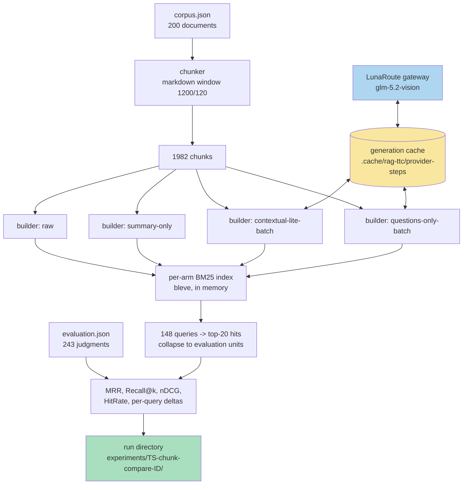
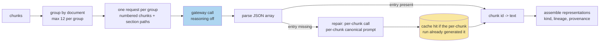

# RAG-TTC Chunk Lab: Chunking and Representation Experiments on a Free LLM Gateway

This project is a measurement program built on top of `rag-ttc`, a Go toolbox for reproducible retrieval-augmented-generation experiments over a plant-nursery document corpus. The lab answers one question with numbers instead of intuition: which combination of chunk cut, indexed representation, and retrieval strategy produces the best retrieval quality on a judged evaluation set. A temporarily free LLM gateway (LunaRoute, serving GLM-5.2-Vision) supplies the generation budget for the expensive experiments — LLM-written contextual blurbs, summaries, synthetic questions, entity expansions, and LLM-directed chunking — which would otherwise be priced out of a side project.

> [!summary]
> The project currently has three identities:
> 1. a screening bench — a registry of 38 comparison arms measured by BM25 retrieval quality against 148 judged queries, with per-query win/loss accounting
> 2. a set of completed free experiments (chunk size, overlap, breadcrumbs, sentence snapping, small-to-big retrieval) with recorded results
> 3. an in-flight set of LLM-generated representation experiments, restructured mid-run around a measured model of the gateway's throughput

## Why this project exists

The `rag-ttc` corpus is a 200-document subset of a 3,096-document plant-care extraction. Retrieval quality over it is measured by an evaluation set of 148 queries and 243 graded judgments, where each judgment names an evaluation unit that maps one-to-one to a corpus document. Earlier work established two facts that motivated a systematic lab. First, the choice of chunker algorithm (heading-aware versus fixed window) is a dead lever: roughly 90% of sections exceed the window size, so both chunkers emit nearly identical cuts and identical retrieval metrics. Second, the choice of indexed representation is a live lever: replacing raw chunk text with a one-sentence extractive summary as the indexed text raised MRR from 0.8366 to 0.8585 and Recall@10 from 0.7986 to 0.8079 at zero provider cost.

A result of that shape — a trivial deterministic transformation of the indexed text beating the raw text — implies that the representation axis is underexplored. The literature offers several candidates that all require generation: contextual retrieval (a situating paragraph prepended to each chunk before indexing), LLM-written summaries, synthetic questions (indexing the questions a chunk answers rather than its statements, which matches the query distribution since evaluation queries are questions), and domain-synonym expansion (the corpus exhibits botanical synonymy such as Thuja ↔ arborvitae, which BM25 cannot bridge). Each candidate costs roughly one generation call per chunk, and the corpus has 1,982 chunks. The free gateway window converts these from budget requests into engineering problems.

## Current project status

The project is executing ticket `RAG-TTC-CHUNKLAB-001` (in the repo under `ttmp/2026/07/30/`). Status by track:

- **Bench (Phase 1): complete.** The screening harness reproduces the previously recorded baseline table digit-for-digit, which is its exit test.
- **Track A, free experiments (E1–E5): complete, results recorded.** Chunk size is a live lever with a knee at 1,600–2,400 runes; overlap is dead for retrieval; heading-path breadcrumbs are a free improvement with zero regressed queries; sentence snapping is a marginal improvement; small-to-big retrieval reproduces the small-chunk metrics exactly, which validates the parent-mapping plumbing.
- **Track B, generated representations (E6–E9): generation in flight.** After a mid-run restructuring (documented below), all nine generated arms plus an LLM-directed chunking arm run as one batched invocation, approximately 1,030 gateway calls instead of the original 9,910.
- **Track C, confirmation under vector and fused retrieval (E10–E11): pending Track B winners.** The promotion path is already wired: the bundle builder accepts every generated representation kind and shares the generation cache with the screening bench, so promoting a winner costs no new generation.

## Project shape

The lab is three layers on top of the existing `rag-ttc` core:

- `pkg/rag/representations/` — representation builders: deterministic (extractive summaries, breadcrumbs, small-to-big parent mapping) and generated (contextual, summaries, questions, entities), in per-chunk and batched forms, plus the canonical prompt constants and the generation cache identity.
- `cmd/rag-ttc/cmds/experiments/chunkcompare/` — the screening bench: an arm registry, a budget-gated cached generation path, BM25 measurement per arm, and per-query delta accounting against a fixed baseline.
- `cmd/rag-ttc/cmds/indexes/` — the promotion path: `indexes build --representations raw,summary,contextual,question,entities` builds immutable index bundles whose generated representations come from the same cache the bench populated.

## Architecture

The measurement pipeline is a pure function from (corpus, arm definition) to a metrics row. Every arm shares the corpus load, the evaluation set, and the scoring; arms differ only in the chunks and representations they submit for indexing.



Three architectural invariants carry the whole design:

1. **Representations are retrieval material, never evidence.** A hit over a summary, blurb, or question representation is hydrated back to its source chunk before it reaches a generator or an evaluator. The `Representation.ChunkID` field carries the lineage; `Hydrate` enforces the rule. This invariant is what makes it safe to index arbitrary generated text: retrieval quality can improve without the generator ever seeing model-written content as if it were source material.
2. **Chunks are exact byte slices.** Every chunk records a byte range into its document, and `ValidateChunk` verifies the text equals the slice. Generated processes may decide *where* to cut but never *what* the text is. This constraint shaped the LLM-chunking design below.
3. **Identity flows through digests.** Bundle identifiers digest the corpus, the chunker parameters, and the representation list; representation identifiers digest the chunk, the kind, and the generated text; generation cache keys digest the kind, model, prompt, and input text. A changed prompt therefore produces new representation identities, new cache entries, and a new bundle — configurations cannot silently collide.

## Implementation details

### The arm registry and the measurement loop

The bench command is `rag-ttc experiments chunk-compare run --arms <names>`. An arm is a named builder that produces `(chunks, representations)` from shared inputs:

```go
type Builder struct {
    Name      string                       // canonical, permanent
    Generated bool                         // needs a generation profile
    Kind      string                       // generation kind, for budget dedup
    Prompt    string                       // verbatim; recorded in run config
    Calls     func(in BuildInput) int      // worst-case call ceiling; nil = one per chunk
    Build     func(context.Context, BuildInput) (Arm, error)
}
```

The measurement loop builds one in-memory Bleve BM25 index per arm, retrieves the top 20 chunks for each of the 148 queries, collapses hits to evaluation units (one document contributes at most once per ranking), and scores against the judgments. The `markdown` baseline arm is forced into every invocation, for two reasons: harness drift becomes visible immediately, and the per-query delta accounting always has its reference. For each non-baseline arm the report carries `improved`, `unchanged`, and `regressed` counts, computed by comparing each query's first-relevant rank against the baseline's; the full per-query rank table lands in the run directory under `observations/per-query-ranks.json`. Aggregate metrics hide which queries moved; the deltas are frequently more informative than the means.

Method rules, enforced socially and by structure: one variable per arm; canonical arm names are permanent and a changed prompt is a new arm name; an arm that cannot run reports why in the run output rather than silently dropping (a typed `skipArmError` carries the reason into the results row); every generated arm's prompt is recorded verbatim in the run's `config.json`.

### Budget-gated, cached, retrying generation

Every generated representation flows through one path:

```
requests  = builder-specific prompt+input per chunk (or per group)
results   = GenerateCached(requests, cache, limiter, workers=16, retry)
            # cache key = digest(kind, model, prompt, input text,
            #                    adapter version, context policy)
```

Three properties matter:

- **Refusal before the first call.** The command computes the worst-case call count for the selected arms — distinct (kind, prompt) specifications multiplied by their per-spec ceilings — and refuses to start when `--generation-budget` does not cover it, stating the arithmetic. This mirrors the bundle builder's existing rule for the generator summarizer.
- **Retry under the cache.** The gateway enforces an organization-level concurrent-request cap and returns HTTP 429 past it. The batch mapper fails fast on the first error, so a single 429 killed an hours-long run before a retrying generator wrapper existed. `generation.WithRetry` retries rate-limit and transport failures with exponential backoff (six attempts, 2 s base, one-minute cap, jitter) and never retries context cancellation or provider verdicts. Because retries run beneath the cache, they cost nothing on replay.
- **Cross-producer cache reuse.** The prompts and the cache identity constants live in `pkg/rag/representations/prompts.go` and are shared by the bench and by `indexes build`. Promoting a winning arm into a real bundle therefore replays the bench's cached generations instead of paying the gateway a second time.

### Gateway characterization, including a measurement error worth preserving

The first performance model of the gateway was wrong, and the error is instructive. Initial measurements gave ~75 s per call and led to a queue-dominated interpretation, because a probe with reasoning disabled still took 60 s despite emitting only 34 tokens. All of those probes ran while the bench itself had 16 requests in flight. The gateway's concurrency cap sits at approximately the same 16, so every probe queued behind the project's own traffic. A clean measurement after stopping the bench falsified the model: a trivial request answers in 1.2 s, and a realistic 400-prompt-token call takes 12–17.5 s alone.

The corrected model: the deployment defaults to heavy chain-of-thought. A 350-character output blurb costs 687–952 completion tokens, of which roughly 80% is a `reasoning` field the pipeline discards. Under 16-way concurrency the backend serves approximately 170 output tokens per second in aggregate, so per-request latency is aggregate token throughput divided by concurrent demand — and most of that demand was invisible reasoning. Two consequences followed. First, `reasoning_effort: "none"` (passed through verbatim by the client library, and honored by the gateway even though the gateway's own compatibility metadata claims the parameter is unsupported) removes the reasoning stream entirely: 34 completion tokens instead of 623 on the same request. Second, per-call fixed cost makes batching profitable: one call carrying twelve chunks costs approximately the same overhead as one call carrying one.

The rule this incident produced: never benchmark a capped shared resource while being its principal consumer, and treat a latency number as unexplained until the token accounting reconciles with it.

### Batched generation with a repair path

The batched engine groups chunks by document (never mixing documents within a group, because the prompt states one document's title) into groups of at most twelve, renders one numbered input per group, and demands a strict JSON array in return:

```
[{"chunk": 1, "text": "..."}, {"chunk": 2, "text": "..."} ...]
```

Parsing tolerates code fences and surrounding prose by slicing from the first `[` to the last `]`. Entries with out-of-range indices, duplicates, or empty text are dropped. Every chunk missing from a group's parsed response is repaired with an individual call that uses the *per-chunk* canonical prompt and input rendering — deliberately byte-identical to the original per-chunk arms' requests, so repairs hit the 959 cached generations left over from the earlier per-chunk run. A batched prompt is a different prompt, so batched arms carry distinct names (`contextual-lite-batch` and so on) and populate a distinct cache region; the per-chunk and batched variants remain separately measurable, which permits a controlled quality comparison of batching itself.



Measured effect: group calls proceed at ~39 per minute with reasoning disabled, versus 10.5 single-chunk calls per minute with reasoning enabled — approximately a sixteenfold improvement in chunk coverage per unit time. The full Track B program shrank from ~9,910 calls (projected 13–15 hours) to ~1,030 calls (well under one hour of generation).

### LLM-directed chunking without trusting the model's text

The `llm-chunk` arm sends each whole document (the largest is ~34 k tokens, far inside the model's context window) and asks for semantic cut points. The model must not be trusted to produce byte offsets or faithful copies of the text, and the exact-slice invariant forbids using model output as chunk content. The contract therefore asks only for boundary markers — the verbatim first eight to twelve words of each proposed chunk — and the alignment happens locally:

```
words     = whitespace-tokenized document, each word with its byte offset
boundary0 = 0                       # first chunk always starts the document
for each marker after the first:
    match = first forward position where the document's word sequence
            equals the marker's words (case-insensitive; the final
            marker word may match as a prefix, since models truncate)
    if found: record the matched word's byte offset; advance the cursor
    else:     drop the marker        # its chunk merges into the previous one
ranges    = consecutive boundary pairs; final range ends at len(document)
chunks    = FromRanges(document, "llm-chunk", ranges)   # validates every slice
```

An unmatched marker degrades granularity (two proposed chunks merge) but can never corrupt a range, and a fully unparseable response degrades to a single whole-document chunk. Cost is one call per document: 200 calls for the corpus, which makes model-directed chunking one of the cheapest experiments in the program rather than one of the most expensive — the inversion is entirely due to per-call batching economics.

### Results recorded so far (Track A, all free)

All numbers are unit-level metrics over 144 evaluated queries (4 of the 148 have no judgments; an audit confirmed no query's judged-relevant units fall outside the corpus, so the metrics hide no coverage holes). Baseline is the production configuration: markdown window, 1,200 runes, 120 overlap.

| arm | MRR | Recall@10 | Hit@10 | improved / regressed |
| --- | ---: | ---: | ---: | ---: |
| markdown (baseline) | 0.8366 | 0.7986 | 0.9236 | — |
| summary-only (extractive) | 0.8585 | 0.8079 | 0.9306 | +10 / −2 |
| size-1600 | 0.8508 | 0.8160 | 0.9375 | +9 / −2 |
| size-2400 | 0.8486 | 0.8212 | 0.9514 | +8 / −2 |
| size-3000 | 0.8554 | 0.8142 | 0.9444 | +11 / −2 |
| overlap-0 | 0.8401 | 0.8056 | 0.9236 | +2 / −1 |
| breadcrumb | 0.8453 | 0.7951 | 0.9236 | +4 / −0 |
| sentence-snap | 0.8437 | 0.8021 | 0.9236 | +5 / −1 |
| size-300 = small-to-big | 0.8414 | 0.7569 | 0.9097 | +6 / −6 |

Interpretation. The size lever is real and its knee sits between 1,600 and 2,400 runes; recall and hit rate both rise well past the current 1,200. Overlap contributes nothing to retrieval and slightly hurts it, so overlap can drop to zero and shrink the index — its only remaining justification is generation context, which is a downstream concern. Breadcrumbs (prepending the document-title-to-heading path to the indexed text) are the free half of contextual retrieval and improve four queries while regressing none; the generated-blurb experiments must beat this floor to justify their tokens. Small-to-big's exact equality with size-300 is by construction — identical searchable text, unit-level collapse — and is the intended proof that a representation can index one text while hydrating to a different, larger parent chunk with zero special-case code.

## Important project docs

- Ticket: `ttmp/2026/07/30/RAG-TTC-CHUNKLAB-001--chunking-and-representation-experiment-lab-cuts-contexts-summaries-and-questions/` in the repo — intern-level design guide (`design-doc/01-...`), execution diary with seven detailed steps including both failure post-mortems (`reference/01-diary.md`), Track A results (`sources/01-track-a/`).
- The system-level guide to `rag-ttc` itself: ticket `RAG-TTC-ASSESS-001`, `design-doc/02-system-guide-...`.
- Bench code: `cmd/rag-ttc/cmds/experiments/chunkcompare/` (registry, batched builders, llm-chunk alignment); representation builders and prompts: `pkg/rag/representations/`.

## Open questions

- Does batching degrade blurb/summary quality relative to per-chunk generation? The 959 cached per-chunk generations make a controlled comparison of `contextual-lite` versus `contextual-lite-batch` nearly free; it has not run yet.
- Do the BM25 screening winners hold under vector and reciprocal-rank-fusion retrieval (Track C, E10)? The screening deliberately uses BM25 only, because embeddings cost real money per arm.
- Does contextual retrieval need the whole document (E6-full) or does the title-plus-lead variant capture the effect? The model's context window makes E6-full affordable; the decision waits on E6-lite's numbers.
- Does any of this survive the 15× larger full corpus? All screening runs use the 200-document subset; the full-corpus rerun is gated on a separate extraction pipeline (`RAG-TTC-SCALE-001`).

## Near-term next steps

- Score the in-flight batched run; write results beside Track A's; decide E6-full and the conditional E12 (embedding-similarity breakpoint chunking).
- Run the per-chunk-versus-batched quality comparison from cache.
- Promote the top two arms to real bundles (`indexes build`, embeddings ~$0.01–0.03 per bundle) and run the answer-quality confirmation under bm25/vector/rrf, plus multi-query and HyDE strategies (E11; the reranked arm is recorded as unavailable — no reranking provider exists in this environment).
- Feed the final recommendation (cut size, representation kinds, strategy) back into the ticket with run identifiers for every claim.

## Project working rule

Every arm name is permanent, every prompt is recorded verbatim, every generated call flows through the shared cache, and every claim in a writeup names the run directory that produced it. When a number looks strange — a latency, a throughput, a metric — the response is a controlled measurement, not a workaround; the project's largest efficiency win came from a user questioning a number the diary had already rationalized.
