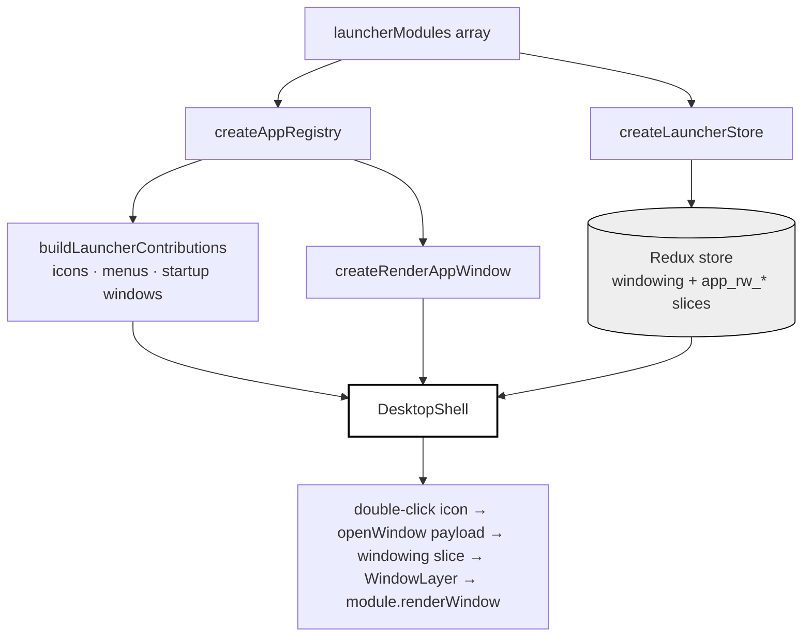
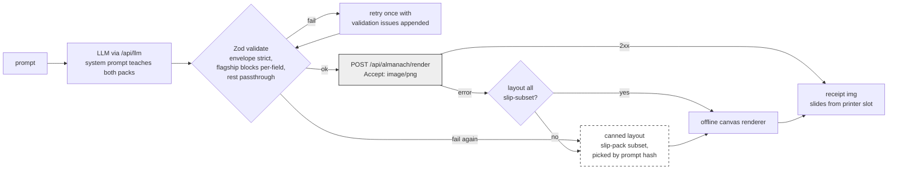

# Resume OS — A Macintosh System 1 Desktop as a Résumé

Resume OS is a résumé implemented as a working Macintosh System 1 desktop: a menu bar, draggable and resizable windows with the close box on the left, a 1-bit dithered background, and twenty-three applications that range from a career timeline to a thermal printer whose pages are composed by an LLM and rendered by a production service. It was built in one day across five planned phases, each with its own docmgr ticket, textbook-style implementation guide, and implementation diary. The repository is `/home/manuel/code/wesen/resume`; the design corpus lives in the job-search repo under `ttmp/2026/07/30/` (tickets PORTFOLIO-001 and RESUME-001 through RESUME-005). The deployment target is `resume.yolo.scapegoat.dev`; deployment is the one remaining phase.

> [!summary]
> - The desktop is **composition, not construction**: the window manager, theme, and widget kit are the published npm packages `@go-go-golems/os-core`, `os-shell`, and `os-widgets` (0.2.0). The repository contributes an app list, a Redux store, content, and roughly two dozen thin `LaunchableAppModule` files.
> - Three principles carried every phase: **offline first** (every network-consuming app ships a vendored snapshot or canned fallback), **honest exhibits** (real acceptance-suite numbers, no fake emulators, labeled synthetic data), and **zero console errors** as the merge bar.
> - The most instructive defects were a rehydration wrapper defeated by `combineReducers`' probe dispatches, and a proxy rewrite that stripped one path segment too many. Both are analyzed below.

## Why this project exists

A résumé PDF states claims; a running system demonstrates them. The subject of this résumé builds runtime infrastructure — LLM runtimes, desktop shells, firmware, search — so the portfolio's thesis is that the médium should be the evidence. The site presents the career *as* a desktop built from the candidate's own published platform, with applications that are live clients of services the candidate operates: a 525-artifact gallery, an Obsidian vault API, and a physical thermal printer on the candidate's desk.

The aesthetic is not retro decoration. The wesen-os launcher (`wesen-os.yolo.scapegoat.dev`) already established the System 1 look as the house style of the go-go-os platform, and the artifact corpus contains the literal ancestor — an artifact titled "Classic Mac System 1 interface recreation" — from which the platform was distilled. The résumé desktop is therefore a third-generation descendant of its own exhibit material, and one of its applications can display its own ancestor in a nested frame.

## Current project status

All five pre-deployment phases are implemented and verified in a real browser. The git history is nine commits, one per milestone:

| commit | content |
|---|---|
| `29d35d0` | scaffold: shell + Hello app (Phase 1a) |
| `5a002ba` | persistence, Read Me, About, Resume app, curated widgets (Phase 1b) |
| `1b6d5d7` | Artifacts Browser + Almanach Printer on the real backend (Phase 2) |
| `1f56f37` | Blog with dithered images, Write-Up Browser, Exhibits (Phase 3) |
| `628b720` | macOS1 consistency pass (token-bridge stylesheet) |
| `47ffa07` | Transcripts, Mail, Dithering Studio, Hardware Lab, Design Lab, Bake-Off, Assistant (Phase 4) |
| `9fcc5df` | Attention, Smalltalk lore, Print Head Lab, mobile fallback, final regression (Phase 5) |

The production build is 15 MB of `dist/`, dominated by a 310 KB (gzip) QuickJS module the shell ships for plugin cards this site never runs, and a 518 KB (gzip) main chunk. Remaining work: the deployment ticket (Go embed binary, Docker image, kustomize overlay in the `2026-03-27--hetzner-k3s` gitops repository) and a server-side rate limit before the physical-print endpoint is exposed publicly.

## Architecture

### The composition model

The load-bearing architectural fact is that the desktop is consumed from published packages, not built. `@go-go-golems/os-core` implements the window manager as a Redux slice plus React components (`DesktopShell`, `WindowLayer`, `DesktopMenuBar`, `DesktopIconLayer`) and ships the System 1 theme as a CSS side-effect import. `@go-go-golems/os-shell` supplies the composition layer: an app registry, a store factory, and functions that turn a list of modules into desktop icons, menus, and a window-content renderer. The application is one array:

```ts
// src/app/modules.ts — the entire application, structurally
export const launcherModules: LaunchableAppModule[] = [
  readmeModule, resumeModule, writeupsModule, blogModule,
  artifactsModule, almanachModule, transcriptsModule, assistantModule,
  mailModule, ditheringModule, bakeoffModule, order(macReplModule, 33),
  hardwareModule, designLabModule, exhibitsModule, richWidgetsLauncherModule,
  /* …desk accessories at orders 50+, hello canary at 90 */
];
```

Every feature in every phase entered the system through this array. The store factory reads the same array to install one reducer per stateful module, keyed by an `app_rw_*` naming convention that the persistence layer (below) exploits wholesale.

An application module is a small contract:

```ts
interface LaunchableAppModule {
  manifest: AppManifest;                      // id, name, icon, desktop.order
  state?: { stateKey: `app_${string}`; reducer: Reducer };
  buildLaunchWindow(ctx, reason): OpenWindowPayload;
  renderWindow(params): ReactNode;            // params.instanceId selects sub-windows
  createContributions?(ctx): DesktopContribution[];  // menus, commands, startup windows
}
```

Windows are state, not components. Opening a window dispatches a plain payload into the windowing slice; `WindowLayer` renders whatever the slice contains and calls back through the registry (`parseAppKey` → module → `renderWindow`) for `content.kind === 'app'` windows. This split is what makes windows draggable, persistable, and openable from anywhere — the Read Me window's buttons, the Mail message's pitch, and the desktop icons all open the Resume through the same door, a central table of payload builders (`src/app/windows.ts`) that also drives disabled-state rendering for apps that have not shipped yet.



### The network seam

Phase 1 has no network dependency at all. From Phase 2 on, every JSON API is reached through a same-origin path prefix that the Vite dev server proxies and a future Go server will serve identically, so application code never changes across environments:

| prefix | upstream | consumers |
|---|---|---|
| `/api/artifacts` | `artifacts.yolo.scapegoat.dev` | Artifacts Browser catalog |
| `/api/almanach` | `almanach.crib.scapegoat.dev` (rewritten to `/api/*`) | Almanach render + physical print |
| `/api/vault` | `parc.yolo.scapegoat.dev` | reserved for live vault search |
| `/api/llm` | `llm-proxy` (OpenAI-compatible) | Almanach prompt mode, Assistant |

Iframe embeds (`artifacts.yolo…/view/<slug>?embed=1`) bypass the proxy entirely because framing is not subject to CORS; only `fetch` traffic is bridged.

## Implementation details

### Persistence: one subscriber, every widget

The published widget kit ships twenty-one complete applications, none of which persist state — a search for `localStorage|persist|opfs|indexeddb` across all three packages returns nothing. Because every widget registers its slice under an `app_rw_*` key, a single store-level mechanism makes all of them durable at once, including applications written later.

The design splits storage by size class. Small slices go to `localStorage` under a versioned namespace (`resume.v1.<sliceKey>`); large blobs (the MacWrite document, node-editor graphs) go to the Origin Private File System as one JSON file per slice. A debounced subscriber diffs slices by reference equality — Redux guarantees unchanged slices keep identity — and writes only what changed. The version segment is the entire migration strategy: an incompatible shape change bumps `v1` to `v2` and abandons the old keys.

Rehydration is where the two instructive constraints live. First, restore must complete before `createRoot`, or widgets mount with seed content and visibly snap to restored content — so `main.tsx` is an async boot sequence. Second, `createLauncherStore` exposes no `preloadedState` option, so restoration wraps each module's reducer:

```ts
const rehydrating = (reducer, saved) => (state, action) =>
  reducer(state === undefined ? saved : state, action);
```

The first version of this wrapper used a one-shot `seeded` flag, on the theory that the seed should apply exactly once. It failed silently: the Read Me window kept auto-opening even though `resume.v1.app_rw_readme = {"dismissed":true}` was demonstrably in storage. The cause is that `combineReducers` probes every reducer with undefined state and synthetic action types *before* the real `@@INIT` dispatch, to assert that reducers return defaults. The probe consumed the flag; the genuine initialization then received the default state. The rule that generalizes: **a rehydrating reducer wrapper must be stateless**, because Redux is free to call any reducer with undefined state any number of times.

### The dither engine as shared infrastructure

Dithering is the site's visual identity, so it is implemented once (`src/app/dither.ts`) and consumed three ways: the `<DitheredImg>` component (every blog and About image), the Dithering Studio window, and the Poster Shop's 1-bit finishing pass. The engine runs Floyd–Steinberg error diffusion on a `Float32Array` luminance buffer — diffused error legitimately exceeds the [0,255] byte range between steps, and clamping mid-run visibly degrades the output — with ordered Bayer 4×4 and plain threshold as alternatives.

Two decisions matter more than the algorithm. Images are downscaled *before* dithering (display size, capped at 800 px), because error diffusion at source resolution followed by CSS downscaling averages the dot pattern into gray mush. And the component renders with `image-rendering: pixelated` so browser scaling never re-blurs the dots. The hover badge on every dithered image opens a threshold/algorithm popover — the seam through which the full Studio later plugged in without touching the component's consumers.

### The Almanach Printer on the real pipeline

The Almanach application began as a client-side canvas approximation of a receipt DSL and was rebuilt mid-project, at the user's direction, against the production almanach stack. The research pass (`almanach/internal/app/server.go`, `layout.go`, `web/src/almanach-studio.jsx`) established the real contract:

- `POST /api/render` accepts the studio layout JSON (or YAML; a top-level `data` key resolves `{{var}}` template expressions), renders it with headless Chrome running the actual studio renderer, and content-negotiates the response: `Accept: image/png` returns a PNG, `application/octet-stream` returns the packed 1-bit bitmap with `X-Width`/`X-Height` headers, default returns JSON metadata.
- `POST /api/render-and-print` performs the same render and forwards the bitmap to the ESP32 printer (`ALM_0F2320`, 384 px, 58 mm, 203 dpi) whose IP the service holds.
- The DSL (`almanach_studio_version: 1`) has two block packs: sixteen semantic daily blocks (`title`, `date`, `plan`, `news`, `weather`, `quote`, `word`, `history`, …) and twelve slip-pack layout primitives (`text`, `rule`, `row`, `kv`, `qr`, `table`, …), across ten named themes.

The generation pipeline treats the server as the authority and validation as a gate against model garbage, not as a reimplementation of the studio:



The offline story stays coherent because the canned layouts are deliberately constrained to the slip subset (`text`/`rule`/`row`) that the fallback canvas renderer can draw; a semantic-block layout that cannot reach the server degrades to a canned strip rather than a broken render. "Yesterday mode" composes a semantic page deterministically from GitHub's public events API (repos grouped from `PushEvent`s, counts floored at one because some events carry empty commit arrays) — verified end to end with the status line "composed by github · rendered by almanach.crib (real service)". The physical-print button is armed behind a `window.confirm`; the service's `/health` confirms a configured printer at the time of writing.

The one defect in this integration was a proxy rewrite: `/api/almanach/*` was initially rewritten to `/*`, but the crib's routes live under `/api/*`, so every render 404'd into the fallback path — which is itself the interesting observation, because the failure was *invisible* except for the honesty of the status bar. Fallback layers that work too quietly hide integration bugs; labeling the renderer in the UI is what surfaced this one.

### The Artifacts Browser: snapshot-first, live-refresh

The browser renders instantly from a vendored snapshot of all 525 artifact records (a build-time script performs the same paginated `/search` fetches from Node and commits the JSON) and replaces the catalog from the live API in the background, flipping a `source` tag the status bar reports. Facets (type, model, tag) are computed client-side in one counting pass per dimension — a decision vindicated by the live data, whose server-side facet payload contains parser artifacts as keys (`" + JSON.stringify(mod) + "` appears as a "library" facet) and whose records omit the `project` field entirely. Live artifact names are not unique — several are UUID-prefixed paths — so the loader deduplicates by name and list keys are index-qualified. Only the selected artifact is ever iframed; a grid of 525 live React applications is a tab-killer.

### Honest search and an honest scoreboard

Two exhibits exist specifically because a dishonest version was cheaper. The Write-Up Browser's corpus search is a hand-rolled inverted index with tf-idf scoring over the twenty-five vendored write-up documents — roughly eighty lines, deliberately *not* vendored "semantic" embeddings pretending to be more (the earlier catalog cut exactly that app for dishonesty). The Bake-Off displays results of actually running a held-out acceptance suite (`MDLC_REPO=<repo> python -m pytest test_acceptance.py`) against five independent model implementations of one frozen spec. Every model passed 26/26; the exhibit's finding is that on a well-specified task correctness is table stakes and the differentiator is economy — 301 lines (fable) to 699 lines (qwen3) for behaviorally identical programs, a 2.3× spread the window presents with a source-compare pane so a viewer can judge structure directly.

### Hardware simulations with real algorithms

The Hardware Lab entries port the actual algorithms from shipped firmware rather than imitating their output. The Orbiter renders a Lambert-shaded sphere and quantizes with the M5Dial firmware's exact trick — `tone = floor(shade/85)`, promoted by a Bayer threshold — because generic dithering produces visibly wrong banding on the four-tone display. Graffiti implements the Protractor recognizer in full: resample the stroke to 32 points, translate to the centroid, scale-normalize, then the closed-form best-rotation cosine similarity

```
similarity(a,b) = |Σ (aᵢ·bᵢ)| computed as hypot(Σ dot, Σ cross)
```

over the flattened point vector, with user-trained templates persisted through the standard slice mechanism. The Print Head Lab models thermal banding with a per-element heat accumulator — firing adds energy, idle rows cool multiplicatively, and the cooling term shrinks as feed rate rises — which reproduces both authentic failure modes (white banding when starved, black bleed when overdriven) from the banding research note. The LED Chain's status bar discloses the best joke in the codebase: the firmware it simulates was itself a simulator.

### Theming: the token bridge

The macOS1 theme styles nothing by element name; every styled node opts in via a `data-part` attribute (`[data-part="btn"]`, `[data-part="field-input"]`), driven by `--hc-*` custom properties. Application content written as plain HTML therefore rendered with browser-default controls — the source of a mid-project "inconsistent fonts and sizes" complaint that a screenshot audit confirmed. The fix is one scoped stylesheet (`src/app.css`) that maps raw elements inside `[data-part='windowing-window-body']` onto the same tokens the theme's own parts use — Geneva 11 px base, buttons on `--hc-btn-*` with zero radius, fields on `--hc-field-*`, the shell's 16 px black-bordered scrollbars extended to inner scroll containers — with `:not([data-part])` guards so library components are never touched. Computed-style verification then shows Geneva/11px/0-radius uniformly across every window. The generalizable rule: an attribute-opt-in design system needs exactly one bridge stylesheet for raw-element content, and that stylesheet must reference the system's tokens rather than restating values.

### Content pipelines

All exhibit content is vendored by re-runnable scripts, so the site builds and demos with the network down and the sources can drift without breaking it:

| script | source | output |
|---|---|---|
| `scripts/snapshot-artifacts.mjs` | live gallery `/search` | 525-record catalog snapshot (180 K) |
| `scripts/vendor_blog.py` | Substack JSON API (`/api/v1/posts/<slug>` exposes `body_html`) | 4 posts as frontmattered markdown + images (1.4 M), converted by a dependency-free `HTMLParser` subclass that skips subscription-widget nodes by class |
| `scripts/sync-writeups.mjs` | job-search `portfolio/*/` | 25 docs + manifest (472 K) |
| `scripts/sync-transcripts.mjs` | three go-minitrace archives | sessions with tool outputs truncated at 4 KB (480 K, lazily chunk-split by `import.meta.glob`) |
| `scripts/sync-keycaps.mjs` | 817-font bitmap catalog | 24 curated sheets + slicing metadata (220 K) — `cellW/cellH/columns/firstCodepoint` turn glyph blitting into `drawImage` source-rect arithmetic |
| `scripts/sync-bakeoff.mjs` | five mdlint build trees | sources + frozen spec + measured scoreboard (92 K) |
| `scripts/sync-golem-review.mjs` | vault Magazine Issue 002 | the Dithering Studio's in-world manual (100 K) |

### Verification methodology

Every phase ended with drills driven through Playwright against the dev server: navigate, act, then assert on the accessibility tree, computed styles, or canvas pixel data (the Orbiter and Print Head Lab are verified by scanning `getImageData` for ink). The recurring drill set: the persistence round-trip (type in MacWrite, hard reload, text survives via OPFS), the auto-open-once check (Read Me opens on a cleared profile, stays closed after), the offline sweep (every window works or degrades with a labeled notice), the duplicate-window check (every payload sets `dedupeKey`), and a zero-console-error sweep whose only tolerated entries are expected offline fetch probes and warnings originating inside embedded third-party artifacts.

## Failure catalog

The defects worth remembering, each with its mechanism:

- **Probe-eaten rehydration seed.** `combineReducers` calls reducers with undefined state before real initialization; any once-only logic in a reducer wrapper is consumed by the probe. Stateless wrappers only.
- **Renderer-host delegation.** The per-widget modules in `os-widgets` open windows whose app keys belong to a single `rich-widgets` host module; registering the widgets without the host renders "Unknown app module" in every widget window.
- **Non-serializable seed state.** The calendar widget stores `Date` objects in Redux; excluded from the curation because JSON rehydration would corrupt it and the dev-mode serializability check reports it on every dispatch.
- **Proxy rewrite depth.** `/api/almanach` → `/` strips the segment the upstream needs; upstream routes live under `/api/*`. Rewrites must target the upstream's real base path, and fallback layers must label themselves loudly enough that a silent 404 is visible.
- **Two-part visualization output.** pyvis pages reference a sibling `lib/` directory; vendoring the HTML without its asset tree produced the final regression's only console error.
- **Aliased artifact slugs.** Half the curated exhibit slugs 404'd; canonical names are UUID-prefixed paths discoverable only through the search API. Curation tables get HTTP-verified before commit.

## Important project docs

- Ticket corpus (job-search repo): `ttmp/2026/07/30/PORTFOLIO-001--*` (architecture, app catalogs v1–v3, scaffold handoff spec, intern guide) and `ttmp/2026/07/30/RESUME-00{1..5}--*` (per-phase textbook guides + implementation diaries; all guides also on reMarkable under `/ai/2026/07/30/`).
- Repository rules: `/home/manuel/code/wesen/resume/AGENT.md` — the widget-library mandate, retro-look rules, offline-first, zero-console-error bar.
- Related vault notes: [[go-go-os]], [[go-minitrace]], [[widget-dsl]] and the almanach lineage in the 2026/04–05 thermal-printer articles.

## Open questions

- Should the desk-accessory row (MacWrite, Calculator, and friends at icon orders 50+) remain on the desktop, or live only inside the Rich Widgets folder to preserve the 16-icon budget?
- Is LOC the fairest single economy metric for the Bake-Off, or should the compare pane be promoted to the primary view?
- The mobile gate (`max-width: 700px`, or coarse pointer ≤ 1000px) — where do tablets deserve to land?
- Can the 310 KB QuickJS chunk be excluded or lazy-loaded, given this site never runs plugin cards?

## Near-term next steps

- The deployment ticket: `go:embed` single binary (`net/http` + `ServeMux`), Dockerfile and kustomize overlay mirrored from wesen-os, ingress for `resume.yolo.scapegoat.dev`, and the three reverse-proxy prefixes moved server-side — plus a rate limit before `render-and-print` is publicly reachable.
- Blog posts from `the.scapegoat.dev` once markdown is supplied (the site 403s scripted fetches; the frontmatter `source: scapegoat` slot is ready).
- VT100, if a wasm toolchain appears; the lore card carries its story until then.

## Project working rule

Every exhibit must be real or say that it is not: live services get vendored fallbacks that announce themselves, synthetic corpora are labeled synthetic, benchmark numbers come from executed suites, and anything that cannot run honestly (the Smalltalk-80 VM, the VT100) appears as its true story rather than a prop.
