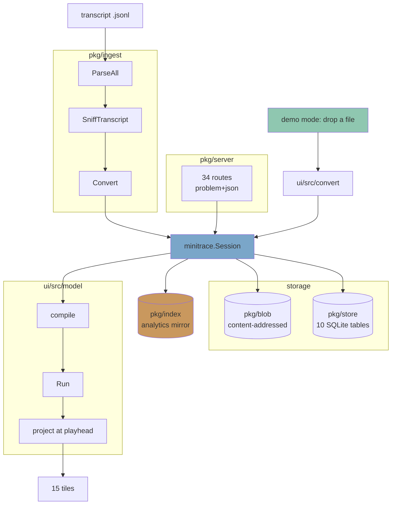

# PROJECT REPORT - Agentlogic - A Transcript Analysis Workbench Built on PBUI

Agentlogic ingests the JSONL transcripts that coding agents write, normalizes
each one into a `minitrace.Session`, and projects it into a PBUI tile
workbench. It is a single Go binary that holds an HTTP API, a SQLite store, a
content-addressed blob store, a conversion pipeline, a credential scanner, an
analytics mirror, and the embedded React frontend. There is also a fully
client-side demonstration path: a transcript dropped on the page is converted
in the tab and no byte is uploaded.

This report explains the architecture, the derivation model that every tile
reads, and the defects the build produced. The defects are the more valuable
half. Agentlogic is the second application built on PBUI after `datalab-ui`,
and most of what went wrong went wrong because the second application repeated
work the first had already done, or diverged from it without noticing. That
record is the input to a PBUI application playbook.

The implementation is on branch `task/transcript-agent`, 33 commits. It is
10,017 lines of Go across ten packages, 8,167 lines of TypeScript, 88 frontend
tests, and nine tested Go packages.

> [!summary]
> - A transcript is finite, so it maps onto the dataset model of `go-go-datadrop` — versioned, immutable, content-addressed, staged upload — and not onto its stream model.
> - Three derivations separate cleanly: `Session` is storage, `compile()` produces a `Run` once, and `project(run, position)` folds the run at the playhead on every frame. Every tile reads the projection and never the session.
> - PBUI ships components that read 61 design tokens and defines none of them. Agentlogic defined zero for weeks. Nothing failed, every component rendered without borders or padding, and the defect silently caused the application to avoid the component library and the presentation protocol entirely.
> - Of roughly twenty-four defects, two were found by unit tests. Eight needed a running browser, eight needed real transcripts, and three needed another person using the product.
> - The presentation protocol — the reason PBUI exists — was specified in the design document and never implemented. Retrofitting it across fourteen finished tiles is two weeks; building it per tile would have been nearly free.

## 1. A transcript is a dataset, not a stream

The first design decision determined the rest. `go-go-datadrop` supports two
models: a stream, which is unbounded and appended to, and a dataset, which is
finite, versioned, immutable, and content-addressed. A coding agent transcript
is a file that stops. It maps onto the dataset model.

The consequence is that the upload protocol is a staged draft-then-commit
sequence rather than an append. A client opens a version, sends the bytes,
and commits. Nothing is visible to a reader until the commit succeeds, and the
commit is the point at which conversion, sniffing, and credential scanning
happen. A failed conversion still stores the raw bytes and still shows the row,
because the operator needs to see that a file was rejected and why.

This also means the canonical object is a normalized archive rather than a
sequence of events. `minitrace.Session` is that archive: it is the storage
format, the wire format, and the input to every derivation. There is exactly
one representation of a transcript in the system after ingest.

## 2. System shape



The ten Go packages divide by responsibility rather than by layer. `pkg/ingest`
converts and touches no disk. `pkg/blob` stores bytes by digest. `pkg/store`
owns ten tables and forward-only migrations. `pkg/secrets` scans a converted
session before it is committed. `pkg/index` materializes the analytics mirror.
`pkg/server` is the whole HTTP surface. `pkg/webui` embeds the frontend.
`pkg/schemagen` generates the TypeScript types from the Go structs.

Each ingest stage is a pure function:

```
ReadHead + ParseJSONL   bytes    -> []map[string]any
SniffTranscript         records  -> Sniff
Convert                 records  -> *minitrace.Session
```

No stage starts a process. The `go-minitrace` adapters expose a pure
`ConvertRecords` entry point for each source format, so the server calls a
function rather than a subprocess. Six source formats are supported: Claude
Code, Codex, Pi, Copilot CLI, ChatGPT exports, and claude.ai exports.

## 3. The three-stage derivation

The frontend never reads a `Session` directly. Three stages separate, and the
separation is what keeps fifteen tiles agreeing about what happened at step 47.

```
Session (JSON)  --compile()-->  Run  --project(playhead)-->  Projection  -->  tiles
~50 MB on the wire             once, memoized                every frame       pure
```

`compile()` walks every turn and tool call, reconstructs the workspace,
computes every diff, and accumulates the context model. It is expensive and it
runs one time per session, memoized on `session.id`. On a 4,807-turn session it
produces 3,516 steps in under a second.

`project(run, position)` is a fold over `steps[0..position]`. It runs on every
playhead change and must stay cheap. It returns files, context, tasks,
conversation lines, and tool calls as they stood at that step.

A step is the unit of the run. Eleven kinds exist: think, tool, edit, create,
taskAdd, taskDone, mem, memRead, compact, respond, user. The kind grammar
comes from the reference artifact and drives the colour vocabulary throughout
the workbench.

The rule that this structure enforces: a tile that keeps its own derived state
breaks the property that makes the workbench work. Two tiles must never
disagree about the state at a given step. Every tile reads the shared
projection.

## 4. The context model is the differentiated part

Every transcript viewer shows a conversation. The context window tile answers a
question none of them answer: the run exhausted its context, so what was in it?

Making that answer honest required three mechanisms, and each of them produced
a defect.

### 4.1 The measured-overhead back-fit

A transcript records measured token usage for each assistant message, but the
visible items account for only part of it. The difference is the system prompt,
the tool schemas, and cache bookkeeping, and a session file never records those
verbatim. Without a correction the context curve reads far too low and a
compaction looks pointless.

The correction is segment-wise, and the segments are the parts between
compactions:

```
segment 0        compaction      segment 1        compaction      segment 2
[----------------]              [----------------]               [----------]
      ^ anchor                        ^ anchor                       ^ anchor
overhead_0 = measure - contextAfter(anchor)
```

For each segment the compiler finds the first measured usage inside it, takes
the difference against the accumulated visible items at that step, and injects
one explicit item carrying that difference. The item's label states the
measurement, so a reader can see that the number is measured rather than
estimated.

A global correction instead of a segment-wise one would carry a stale overhead
across the compaction and draw a curve that never comes down.

### 4.2 The fold-once invariant

Every compaction record names every earlier step. A naive implementation lets a
later compaction claim items an earlier one already folded, so the same tokens
are freed two and three times over. A real 2,012-step session with three
compactions reported 1.53M tokens used against a 1.00M window, negative
529,802 tokens free, and one compaction that freed negative 356,672 tokens.
None of those numbers is possible.

The fix is one filter:

```ts
// A compaction folds what is STILL LIVE, and an item is folded once.
const targetIds = everyItem
  .filter((item) => targets.includes(`s${item.stepIndex + 1}`))
  .filter((item) => compactedBy[item.id] === undefined)
  .map((item) => item.id);
```

The test that guards it is more interesting than the fix. The first four tests
written for this defect **passed with the defect present**. The back-fit
injects one overhead item per segment after compile, and that single item
satisfied any assertion of the form "this compaction claimed something". The
tests that work state the invariant instead: an item is folded by the first
compaction that follows it, and by no other.

### 4.3 What a compaction does not remove

A compaction replaces the conversation. It does not replace the system prompt
or the tool schemas, because those are re-sent on every request. That is why
the window does not drop to zero after a compaction.

Writing the invariant down exposed a modelling error. The back-fit item carried
`kind: "system"` and the label "system prompt and tool schemas", and a
compaction folds it. Together those two facts asserted that the system prompt
gets compacted away. Each fact was correct alone. The item now has its own
`overhead` kind, and `system` regains its meaning: an item a compaction never
touches.

The same item caused a second defect. `recomputeFreed` summed everything a
compaction step carried and called it the summary the compaction added. The
back-fit attaches the next segment's correction to that step, because that is
where the next segment begins. On one real session the sum included a
464,934-token correction against 217,538 tokens removed, and the tile reported
that the compaction freed negative 247,560 tokens.

## 5. The analytics mirror scopes with temporary views

`pkg/index` materializes each archive into ten normalized SQLite tables and
answers nine built-in questions: session list, framework summary, tool
operation breakdown, tool failures, timing analysis, read-ratio distribution,
file operations, file timeline, and annotations.

The presets are raw SQL written for a laptop, where every archive belongs to
the person running the query. They name `sessions` and `turns` without a
project filter. A hosted service that ran that SQL unchanged would answer a
question about every tenant.

The scoping uses a SQLite name-resolution rule: an unqualified table name
resolves against the TEMP schema first and only then against `main`. For each
query the server creates a temporary view for each mirror table, restricted to
the calling project's sessions, and runs the preset against those. The preset
needs no change, and **a new preset cannot forget the filter, because the
filter is not in the preset.**

Two things defeat it and both are rejected before execution:

- `main.sessions`, which names the real table and skips the view
- `ATTACH`, which brings a second database into scope

Two implementation constraints surfaced while building this. A view may not
hold a bound parameter, so the project name goes into a temporary table first
and the views join against that table. A temporary object lives on its
connection, so the query takes a dedicated connection for the length of the
call; a view left behind on a pooled connection would silently scope a later
query to the wrong project.

The endpoint takes a preset name and never SQL. Accepting SQL would mean
accepting an arbitrary read across every tenant unless each query were rewritten
and verified, and that is a project rather than a feature.

## 6. The demonstration path and the no-network invariant

A visitor can drop a transcript on the page without an account. The file is
converted in the tab and nothing is uploaded. The page states this in bold.

A claim like that needs an enforcement mechanism, not a policy. Every network
call in the frontend lives in `ui/src/api/client.ts` and nothing else calls
`fetch`. A test asserts that the demonstration modules import nothing from that
file. One file is what makes the check simple and reliable.

The constraint has a cost. No WASM build of `go-minitrace` exists, so the
browser path needs its own TypeScript converter producing the same `Session`
schema. Two converters drift. The drift is contained by a golden corpus and by
generating the shared types from one source, but it is not removed. Demo mode
currently supports Claude Code alone and the interface says so rather than
failing.

The same invariant governed the webfont work. A font fetched from a
third-party host reveals a visitor's address and the fact that they opened the
page. It leaks no transcript, and it still weakens a claim the page makes in
bold, so the server serves fonts from its own origin by default and the
content-delivery-network option is not the default.

## 7. One schema, generated

The server owns the domain types in Go and the browser needs the same types.
Two hand-written copies drift, and the drift is silent because both sides
compile.

`cmd/schemagen` reflects over the `minitrace.Session` structs and writes
`ui/src/model/session.generated.ts`. `make schema-check` runs it in check mode
and fails when the file is stale, and `ci-check` depends on it.

This must happen before the frontend has types. Retrofitting it means
reconciling two vocabularies that have already diverged.

## 8. Defect taxonomy: what found what

Twenty-four defects were found. The distribution by discovery mechanism is the
most useful output of this project.

| Found by | Count | Examples |
|---|---|---|
| A unit test | 2 | SQLite names the violated index's columns, not the index; the credential scanner skipped `framework_metadata` |
| A running browser or screenshot | 8 | Every tile collapsed to its content; a file body lost every newline; the tool-call tile held 10,770 DOM nodes |
| Real transcripts | 8 | Every session named `t-<16 hex>`; a compaction freed negative 247,560 tokens; a continuation marker reported as a compaction |
| Another person using it | 3 | The tone was a hairline and not a filled bar; the title-bar buttons were invisible; Storybook showed one font for every option |
| Reading the other application's code | 1 | 43 design tokens read and none defined |
| Writing a new caller | 2 | `ParseAll(reader, 0)` read nothing while `parseLines(reader, 0)` reads everything |

Two conclusions follow.

**The test suite was green through every silent defect.** Nine of the first
twelve produced no failure anywhere. A suite that passes is evidence that the
assertions hold, and nothing more.

**Real input finds a different class of defect than synthetic input finds.** A
synthetic corpus satisfies the invariants its author thought of. The real
directory contained a project path long enough to overflow a 64-character slug,
three compactions in one session, a turn that answered without calling a tool,
a resumed session whose first record is a continuation marker, and nine sessions
holding no agent work at all. None of those shapes was in the corpus.

## 9. The token defect changed the architecture

This is the most consequential defect and the least visible.

PBUI ships components that read design tokens. PBUI does not define them. The
values live in `datalab-ui/src/styles/tokens.css`, 61 of them, and that package
does not export the file. Agentlogic imported PBUI's stylesheets and defined
none.

Measured on the shipped bundle:

```
tokens that PBUI components read:  43
tokens defined at :root:            0
```

An undefined custom property makes the declaration invalid at computed-value
time, so `border: var(--pbui-border-hair)` resolves to no border and
`padding: 0 var(--pbui-space-3)` resolves to no padding. There is no build
error and no console warning. Every PBUI component rendered without borders,
padding, or type scale.

The secondary effect is the important one. With the components rendering
bare, reaching for `IconButton` or `Toolbar` produced a worse result than a
hand-styled `<button>`. While the defect was live the application used
six of PBUI's thirty-two components and none of the presentation protocol, and
it grew 828 lines of stylesheet with 31 hardcoded colour values to compensate. **A defect
in a stylesheet produced a component-adoption decision that shaped the whole
frontend.**

Two further consequences appeared only after the tokens were defined and the
window chrome was moved toward datadrop's. The title-bar controls had been raw
`<button>` elements with transparent backgrounds, which became invisible once
the application tone filled the bar behind them. And two tile tones that were
acceptable as a three-pixel stripe stopped working as a full-width background:
one was the ink colour, which would have drawn its title in ink on ink, and one
was near-paper, which read as no bar at all. A test now parses the palette,
resolves each registered tone through its variable chain, and requires 3:1
contrast against the ink.

The general rule: **verify that a design system's tokens are defined before
concluding anything about its components.**

## 10. Verification against real transcripts

The response to the taxonomy in section 8 was an opt-in smoke run with two
halves.

```bash
AGENTLOGIC_SMOKE_DIR=~/.claude/projects \
AGENTLOGIC_SMOKE_EXPORT=/tmp/smoke \
  go test ./pkg/ingest/ -run Smoke -count=1

AGENTLOGIC_SMOKE_ARCHIVES=/tmp/smoke pnpm test
```

The Go half walks a directory, sniffs, converts, and asserts what must hold for
any session: a readable derived name, no name collision, unique turn indexes, a
tool-call link that resolves in both directions, and time that does not run
backwards. It exports each archive as the wire format. The frontend half
compiles those exports and asserts the context invariants.

One walk feeds both halves, and the frontend reads the format a browser
actually receives rather than a fixture written by hand.

Results against 552 files: 294 converted, 258 skipped as files no adapter
claims, 1,823 frontend assertions. The first run reported 24 frontend failures
in three classes, all real.

Four rules the smoke run established:

- **Assert invariants, never counts.** "Every converted session has at least one
  turn" holds for any directory. "The largest session has 2,939 turns" holds for
  one machine.
- **Never commit real data.** Transcripts hold file paths, source code, and
  sometimes credentials. `pkg/secrets` exists because of the last one.
- **A file that no adapter claims is a legitimate outcome.** 258 of 552 files
  were subagent metadata sidecars. The decision uses the sniffer rather than the
  text of an error message, because wording changes and a string match does not.
- **A test that mirrors the implementation asserts nothing.** The first version
  of one check reused the compiler's own noise filter to decide whether a
  session held work. That test passes whatever the filter says.

Three of the invariants asserted in the first version were themselves wrong,
and real data proved it. A red assertion on real data is not automatically a
defect in the code.

## 11. What is not built

- **The presentation protocol.** The workbench has zero presentation types, zero
  object menus, no accept loop, and fifteen click handlers across fifteen
  tiles. Four tiles have no interaction at all. Sections 3.3 and 10.1 of the
  design document specify it. This is a gap between the design and the code, not
  a gap in the design.
- **Cross-session tiles.** `pkg/index` and `POST /v1/projects/{project}/query`
  are complete and tested. Nothing in the browser calls either. Every tile that
  ships reads one session.
- **OIDC and the CLI device flow.** The `auth_flows` table exists and nothing
  drives it. A token must be minted by an operator today.
- **Demo mode beyond Claude Code.** Either three more TypeScript converters, or
  a WASM build that removes the need for them.

## 12. Working rules for the next application

These are the rules worth carrying to a third application built on PBUI.

- Define the design tokens on day one and add a check that fails when a
  `var(--pbui-*)` has no definition. Section 9 explains what happens otherwise.
- Adopt the presentation protocol beside each tile, not after all of them.
  PBUI's protocol is generic over three type parameters and the product supplies
  a binding layer of five files. `datalab-ui/src/pbui/runtime.tsx` is 58 lines.
- Return verbs as serialisable data rather than closures. `actions(value, env)`
  then becomes a pure function, and a test can assert the exact verb a menu
  entry produces with no store, no provider, and no document.
- Keep every network call in one module so that an offline or privacy claim has
  an enforcement mechanism.
- Generate the shared types from the server's structs before the frontend has
  types of its own.
- Test against real input earlier than feels necessary, and assert invariants
  rather than counts.
- When a real-data assertion fails, print the object rather than reading the
  assertion output. A twelve-line probe over one failing session produced the
  464,934-token line that explained an entire defect class.
- Window every table, and check the ordering before concluding the window
  helped. On insertion-ordered context items the first 200 of 4,380 rows were
  198 folded and 2 live, out of 638 live items; a plain window would have hidden
  the rows the tile exists to show.
- State acceptance as a gesture wherever a checkbox could be true while the work
  is half done. The task list said "port the P0 tiles" and it was ticked with
  the tiles built as read-only panels.

## Important project docs

All under
`/home/manuel/workspaces/2026-07-30/transcript-agent/agentlogic/ttmp/2026/07/30/AGENTLOGIC-1--transcript-drop-upload-normalize-with-go-minitrace-and-analyze-agent-transcripts-in-a-pbui-tile-workbench/`:

- `design-doc/01-...intern-implementation-guide.md` — 2,348 lines. The design:
  data model with DDL, ingest pseudocode, API reference, tile catalogue, 19
  numbered decisions.
- `design-doc/02-next-steps-...md` — 659 lines. The open work in order, each
  item with entry points, open decisions, and acceptance criteria.
- `design-doc/03-adopting-the-presentation-protocol-...md` — 590 lines. Eleven
  descriptors, the verb table, a per-tile site inventory.
- `reference/02-implementation-diary.md` — 2,748 lines across fourteen steps.
  Every defect, how it was found, and which test guards it.
- `playbook/01-building-a-new-hyperslop-systems-app-on-pbui.md` — 399 lines.
  The first draft of the playbook this report supports.

## Open questions

- Does a project mean a repository or a person's workspace? The store treats it
  as a namespace with members, and the cross-session tiles will imply an answer
  through the questions they ask.
- Who deletes a transcript, and when? Section 12 of the guide covers scanning
  and redaction and does not cover retention. A product holding other people's
  source code needs a written answer before a second person uploads.
- Is a shared link public or scoped? `requireRole` returns 404 rather than 403
  precisely to avoid leaking existence, and a link that bypasses membership is a
  new authorization path.
- Should the design tokens, `Tile`, and `WorkspaceStrip` move into PBUI so both
  applications consume one copy? Agentlogic currently holds a copy of datalab's
  token sheet, which is the same duplication problem one level up.

## Near-term next steps

1. Adopt the presentation protocol. Two to three weeks, and it absorbs the
   chrome-parity work rather than adding to it.
2. Build the cross-session tiles over the existing query endpoint.
3. Extract the shared stylesheets into PBUI, then `MouseDocLine` and
   `AcceptBanner`, then `Tile` and `WorkspaceStrip` once they are generalized
   over a layout interface.
4. Measure a `GOOS=js GOARCH=wasm` build of the ingest path and decide demo mode
   from the number, with the decision rule stated before the measurement.

## Project working rule

Keep the implementation diary as the work happens rather than at the end. This
report was possible because every defect, its discovery mechanism, and its
guarding test were recorded at the time. The diary is the reason the taxonomy in
section 8 exists, and the taxonomy is the reason the playbook can be specific.

## Related notes

- [[PROJECT REPORT - PBUI Application Views - Logical Views, Linked Placements, and the Launcher Foundation]]
- [[PROJECT REPORT - Hyperslop Plot v0.2 - From Grammar to Published PBUI Runtime]]
- [[PROJ - PBUI and Datalab UI - Completed Frontend Package Refactor]]
