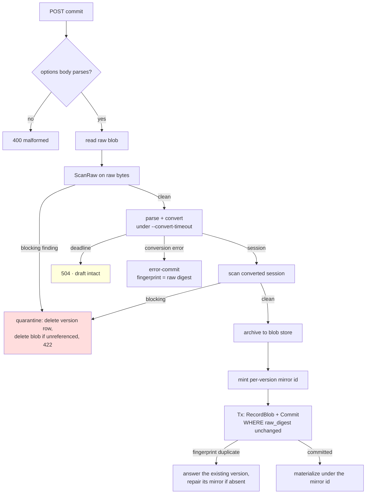

# PROJECT REPORT - Agentlogic - The First Outside Review and the Alignment With Datalab

This report continues [[PROJECT REPORT - Agentlogic - A Transcript Analysis Workbench Built on PBUI]], which describes the system as built. Between that report and this one, two things happened. An automated reviewer (Codex, on the platform's first pull request) produced twenty-one findings against the backend and frontend, and the upstream PBUI repository replaced the tile model that agentlogic had ported. This report analyzes both events: what the findings have in common, how each class was closed, what the upstream change means for this codebase, and the plan for converging agentlogic and Datalab onto one shared package.

> [!summary]
> - The twenty-one review findings reduce to **five systemic causes**, and every finding sits at a **subsystem boundary** — none was reachable by the unit tests, the browser checks, or the real-transcript smoke runs that found the previous twenty-four defects.
> - The fixes were made at the cause level, each one writing its rule into the code that must obey it: three commits, thirteen new regression tests, one test rewritten to assert a corrected contract.
> - Upstream's `DATALAB-VIEW-001` release does **not** force a migration — agentlogic consumes only the generic PBUI package — but it replaced the exact model agentlogic ports, and it answers an open design question (DR-20) better than any of the three options recorded for it.
> - The convergence plan is **promote, don't copy**: extraction is complete only when `datalab-ui` deletes its own copy of the extracted thing.

## 1. Why this report exists

The first report ends with a defect taxonomy: twenty-four defects, classified by the mechanism that found each one. Two came from unit tests, eight from a running browser, eight from real transcripts, three from another person using the system, one from reading a sibling codebase, and two from writing a new caller. The taxonomy's claim is that each verification mechanism reaches a class of defect the others do not.

The outside review is a seventh mechanism, and its results extend the claim in a specific direction. All twenty-one of its findings — ten of them severity P1 — sit where two subsystems meet: a content-addressed blob store meets version rows that share digests; a commit handler meets a scanner that runs on only one of its branches; a cookie principal meets a token principal that carries scopes; an analytics mirror keyed globally meets version rows scoped by project. No single subsystem was wrong. The seams were.

This is the same lesson the first report drew from its green-suite episode ("the suite was green while five defects were live"), promoted one level: a test that exercises one subsystem cannot see an invariant that only exists between two.

## 2. The review in numbers

| Measure | Value |
|---|---|
| Findings | 21 (10 P1, 11 P2) |
| Files implicated | 14 across `pkg/server`, `pkg/store`, `pkg/blob`, `pkg/ingest`, `pkg/index`, `pkg/cli`, `ui/`, `Makefile` |
| Systemic causes after grouping | 5 |
| Fix commits | `0b2b36c` (unrelated lint, separated first), `7a241d6` (backend: 23 files, +881/−103), `9ab091e` (UI, Makefile, README), `0b80caa` (diary) |
| New regression tests | 13 (9 server, 3 ingest, 1 blob), plus 1 rewritten |
| Findings fixed structurally | 18 |
| Findings fixed by restoration or documentation | 3 (a `make install` placeholder regression; the `file:../../pbui` dependency, documented and guarded until the package is published) |

The grouping is the analytically important step. Twenty-one point fixes would have left the underlying rules unstated, and an unstated rule is re-broken by the next handler that touches the seam. The rest of this report walks the five causes.

## 3. Cause one: inline deletion against a content-addressed store

The blob store maps a SHA-256 digest to bytes on disk. Content addressing gives deduplication for free — two versions holding identical bytes share one file — and that property makes unconditional deletion unsafe: deleting "this version's blob" deletes every other version's blob when the bytes coincide.

The store itself already encoded the safe pattern. `Sweep(referenced, minAge)` deletes only blobs that no version row names and that are older than one hour, and `ReferencedDigests` computes the reference set from the database. Two handler paths bypassed this machinery and called deletion directly:

- `PutVerified` — the digest-checked upload — stored the incoming bytes at their true address, and on a digest mismatch removed that address to clean up. When the incoming bytes happened to equal bytes the store already held for another version, the cleanup destroyed shared content. The mismatched upload was rejected; the *pre-existing* transcript stopped downloading.
- The quarantine path — a committed upload found to hold a credential — deleted the raw blob unconditionally, with the same shared-digest exposure.

The fix states the rule where it must hold: **inline deletion of a content-addressed blob is never safe without a reference check.** `PutVerified` no longer deletes at all; a mismatch leaves the bytes for the reference-aware sweep, which collects them after the minimum age if nothing ever references them. The quarantine path — which cannot wait for a sweep, because its purpose is to stop retaining a leaked key — deletes its own version row first and then removes the blob only when a new query, `store.DigestReferenced`, confirms no other row names the digest:

```go
// DigestReferenced reports whether ANY version row still names one digest.
func (s *Store) DigestReferenced(ctx context.Context, digest string) (bool, error) {
	var one int
	err := s.db.QueryRowContext(ctx, `
		SELECT 1 FROM transcript_versions
		WHERE raw_digest = ? OR archive_digest = ?
		LIMIT 1`, digest, digest).Scan(&one)
	...
}
```

The rewritten blob test asserts the new contract directly: a mismatched `PutVerified` whose bytes coincide with an existing blob must leave that blob readable.

## 4. Cause two: invariants that lived on one branch

`handleCommit` is the pipeline that turns an uploaded draft into an immutable version: sniff the format, parse, convert to a `minitrace.Session`, scan for credentials, archive, commit, materialize into the analytics mirror. The handler had one success path and several failure branches, and its invariants were enforced on the success path only.

The most serious instance: the product's advertised rule is "the server scans every upload," and the scanner ran only after a *successful* conversion. A transcript that failed to convert — an unsupported format, a malformed file — committed anyway (by design: decision DR-8 says a silent drop of a user's upload is the worst available behavior) and retained its raw bytes forever, unscanned. A malformed transcript holds a GitHub token exactly as well as a well-formed one.

The structural fix moves the scan to the front of the pipeline, where it guards every branch by position rather than by discipline. The commit path now reads:



Four more branch-local invariants received the same treatment:

**Idempotency on the failure branch.** A successful commit carries a source fingerprint, and a unique index makes a repeated push of the same transcript a no-op. The error-commit omitted the fingerprint, so retrying an unconvertible file — the one upload a user *will* retry — created a new retained copy every time. The error-commit now fingerprints with the raw digest.

**The snapshot the commit publishes.** The handler converts the draft's raw digest as read at the start of the request. A concurrent `PUT .../raw` on the same draft could swap the bytes before the commit transaction ran, publishing an immutable version whose raw transcript and archive describe different uploads. The commit's `UPDATE` now requires `COALESCE(raw_digest, '') = ?` with the digest that was converted; zero rows updated is a conflict, not a commit.

**The timeout that did nothing.** `--convert-timeout` created a context that only the *database* operations after conversion observed; the conversion itself — synchronous parse and adapter work — ran unbounded. The conversion now runs in a goroutine selected against the deadline. Past the deadline the handler answers 504 and the draft stays a draft, so raising the limit and retrying commits the same upload. This bounds the *answer*, not the *work*: the adapters take no `context.Context`, so the abandoned conversion finishes in the background and is discarded. The doc comment states the limitation; threading a context through the adapters is the complete fix.

**The body that failed silently.** The commit options body was decoded with `_ = json.NewDecoder(...).Decode(...)`. A truncated `{"source_format": "cha` read as "no override," and the server sniffed and irreversibly committed under a different adapter than the caller named. A shared `decodeOptionalJSON` helper now accepts an empty body and answers 400 for a present-but-invalid one.

The general form of this cause is worth stating because it recurs in every service with a long handler: **an invariant enforced inside one branch is a property of that branch, not of the endpoint.** The fix is always the same movement — hoist the invariant above the branch point, or route every branch through one helper that owns it (the quarantine helper now owns deletion; `decodeOptionalJSON` now owns body strictness).

## 5. Cause three: one global key under project-scoped rows

The analytics mirror is minitracedb's ten-table schema, living in the same SQLite file as the product tables so that access control is a join (first report, §7). Mirror rows are keyed by session id. Version rows are keyed by project. The seam: `Materialize` deleted and rewrote mirror rows *globally* by the session id the source transcript carried.

Two uploads of the same session into two projects therefore fought over one set of mirror rows — materializing either replaced both, deleting either version removed the other project's analytics — and two *snapshots* of one evolving session in one project aliased the same way.

The constraint on the fix is that the mirror tables belong to minitracedb; agentlogic cannot add a project column to them. What agentlogic does control is *which identifier goes in*. The commit handler now mints a fresh per-version id, stores it in `transcript_versions.session_id` — the column the analytics scope view already joins through, so query scoping is unchanged — and materializes a shallow copy of the session under it:

```go
mirrorID := store.MustNewID("ses")
fields := commitFieldsFrom(session, result, draft, ..., mirrorID)
...
mirror := *session
mirror.ID = mirrorID
index.Materialize(ctx, s.store.DB(), &mirror, safeSourceName(draft.OriginalName))
```

The source-carried id is not lost; it stays inside the archived session JSON, which is the record of what the source said. The API's `session_id` field changes meaning — it is now the mirror key, not the source's identifier — and this is the one externally visible semantic change of the whole review response.

The same seam held a second finding: a *transiently failed* materialization was permanent, because the repeated-push path answered from the fingerprint before ever reaching `Materialize`, and no rebuild command existed. The repeated push is now itself the repair: it carries a freshly converted session, probes the mirror with a new `index.HasSession`, and fills the gap under the existing version's key. A standalone `agentlogic index rebuild` command remains future work; the re-push covers the case a user actually encounters.

## 6. Cause four: authority changing shape

Two findings shared one root: an authorization fact established in one representation was lost when the credential changed representation.

**Scopes across the token-to-cookie exchange.** `POST /v1/auth/token-login` exchanges a working API token for a browser session, and its documented justification is that it converts "a credential the caller HAS into a different shape of the same authority." The session row stored only the user id. When the cookie came back, the reconstructed principal had an empty scope list — and `HasScope` treats an empty list as unrestricted, which is the correct convention for a session minted by a real identity-provider sign-in. The composition of the two correct rules was an escalation: a *read-only* token minted an *unrestricted* cookie. Migration `0002` adds `login_sessions.scopes`; the exchange stores the token's scopes; the cookie principal carries them. The regression test signs in with a read-only token's cookie and asserts that a write answers 403 even though the user's own role would permit it.

The durable rule: **a convention of "empty means unrestricted" is safe at the point of issue and a trap at every point of derivation.** Anything derived from a scoped credential must copy the scopes, or the derivation escalates silently.

**Possession of a name as authorization.** `POST /v1/projects/{project}/claim` gives an unowned project to the caller — the intended flow for projects the root credential creates, which have no owner by design. The endpoint required only a valid account, so any account that guessed the slug of an unowned *private* project claimed it and received admin over its transcripts. Claiming now requires root authority or existing visibility (public read, or a membership), and the refusal is a 404 — the same answer as for a project that does not exist, so the probe learns nothing.

Adjacent to these, one data-exposure finding: the client-supplied `original_name` — typically an absolute local path such as `/Users/jane/work/acme-secret/session.jsonl`, which names an employer — was stored and served verbatim in every version view. The reduction to the file's own name now happens where the value enters the store (`handleOpenDraft`) and again where it leaves (`viewOf`), the second application covering rows written before the first existed.

## 7. Cause five: contracts declared but unenforced at some boundaries

The platform declares several cross-cutting contracts: every error is RFC 9457 problem+json; the CLI's exit codes are stable (0 success, 1 error, 2 usage, 3 auth, 4 not found, 5 validation); the project picker's transcript count matches what the listing shows. Each was enforced at most boundaries and violated at the remainder.

**Routing.** `http.ServeMux` answers an unmatched path or a wrong method itself, with a text/plain body — so precisely the requests made by a client with a typo received the one error shape the supplied clients cannot parse. The fix wraps the mux: a matched request passes through untouched (through `mux.ServeHTTP`, not the returned handler — only `ServeHTTP` populates `r.PathValue`), and an unmatched one has the built-in handler run against a recording probe to learn *which* built-in answer it is, then restates it as problem+json, preserving the 405's `Allow` header.

**Exit codes.** Cobra reports a wrong argument count and an unknown flag as plain errors, indistinguishable from operational failures, so every usage mistake exited 1 against a documented 2. The fix marks them once for the whole command tree — a `SetFlagErrorFunc` wrapping flag errors, and a walk that wraps every command's `Args` validator — rather than per command. One verification note worth keeping: `go run` masked the fix during testing by reporting its own exit status; only the built binary shows the program's true codes. Instrument with the artifact you ship.

**Counts.** The picker counted every `transcripts` row, including rows holding only an abandoned draft, so it promised transcripts the listing could not show. The subquery now requires an `EXISTS` committed version.

**Ingest edges.** Three parser findings, each a boundary between "what the format allows" and "what the code checked": a JSON document opening with whitespace was misrouted to the line parser (valid JSON may open with whitespace; the check read the literal first byte); a JSONL file holding exactly one record parsed as a document and never reached the record scorer (an unknown document now falls through to it); and a multi-conversation account export converted `records[0]` and reported success while silently discarding every other conversation. The last is the interesting one: the pipeline's unit is one session per version, so the honest fix is an explicit refusal with instructions ("the export holds 2 conversations; split the export…"), not a partial success. An upload the system cannot represent completely must fail loudly.

## 8. What the review adds to the defect taxonomy

The first report's taxonomy, extended:

| Mechanism | Defects found | Characteristic class |
|---|---:|---|
| Unit tests | 2 | Pure-function edge cases |
| A running browser | 8 | Composition and rendering |
| Real transcripts | 8 | Distribution of real data |
| Another person using it | 4 | Assumptions the author cannot see (now includes the `max-age=300` cache lie) |
| Reading a sibling codebase | 1 | Divergence |
| Writing a new caller | 2 | API ergonomics |
| **An outside reviewer over the whole diff** | **21** | **Cross-subsystem invariants** |

The last row's class is distinct from all six above it. Every one of the twenty-one findings required holding two subsystems in mind at once, and most required imagining a *sequence* — a concurrent upload during a commit, a quarantine after an earlier version retained the same bytes, an exchange followed by a write. Those are exactly the defects that per-subsystem tests structurally cannot reach and that a human author, having designed each subsystem's rule correctly in isolation, does not go looking for.

The response discipline mattered as much as the findings: group before fixing. The twenty-one findings became seven work items; several findings fell to one structural change (moving the scan to the front of the pipeline closed the scan bypass and simplified quarantine into the single deletion-owning helper); and the grouping surfaced one improvement no finding asked for (the `COALESCE` form of the commit precondition, forced by an existing test that commits without raw bytes).

## 9. The upstream shift: the model agentlogic ports was replaced

While the review response was in progress, the PBUI repository landed `DATALAB-VIEW-001`: four commits separating *logical application views* from *workspace tile placements*. The full design is in [[PROJECT REPORT - PBUI Application Views - Logical Views, Linked Placements, and the Launcher Foundation]]; the shape of the change is that a layout leaf no longer carries an application id — it carries a reference:

```ts
// before (and what agentlogic runs today)
{ id, type: "leaf", app: string }

// after
{ id, type: "leaf", viewId: ViewId }
views[viewId] = { id, appId, documents: Record<string, DocId>, title? }
```

Three facts determine what this means for agentlogic.

**No migration is forced.** The release changes `datalab-ui` internals only; the generic `@hyperslop-systems/pbui` package agentlogic depends on has no source changes in it. agentlogic imports fourteen plain components and no Datalab internals. Nothing breaks.

**The port is now a port of a replaced model.** agentlogic's `store/layout.ts`, `appkit/registry.ts` and `LauncherApp` are ports of exactly the structures upstream just normalized away. The divergence is structural now, not cosmetic. The migration is cheaper than it appears: fourteen of agentlogic's fifteen applications declare their props as `_props: AppProps` and ignore them, so changing the contract from `{leafId}` to `{placementId, view}` touches one application. The transferable upstream pieces are the pure ones — `layoutTree.ts` (96 lines, no Redux) and `ViewSwitcher/model.ts` (78 lines of selection policy).

**It answers DR-20.** The open decision "where does a cross-session tile mount?" had three recorded options: a second shell, a nullable session in the type fourteen tiles read, or a tile that fetches for itself. `AppView.documents` is a fourth option that dominates all three — a view names its own bindings, so a session-bound tile carries its session and a project tile carries its project, in one shell, with no nullable types and no tile-owned fetching. It also yields the gesture a transcript-analysis tool most obviously lacks: two transcripts open side by side.

One incidental hazard the analysis surfaced: agentlogic persists its layout with `JSON.parse(raw) as T` and no shape validation, so any leaf-shape change would resurrect stored layouts as undefined-field objects. Upstream's `persist.migrate` — accept only the current version, fall back to defaults — is the pattern to adopt regardless of the view-model work.

## 10. The convergence plan: promote, don't copy

The standing goal is that agentlogic and Datalab share one UX and differ mostly by backend, with a third application cheap to start. The audit in ticket `AGENTLOGIC-2` found the duplication concrete: two copies of the token sheet, two independent tiling trees whose `snapRatio` functions agree to a tolerance of 0.022, and a Go `pkg/webui` whose seven function names match datadrop's seven exactly.

The failure mode to avoid is the one that created this duplication: aligning by re-porting. A port of `datalab-ui` internals into agentlogic is a third copy with a new divergence clock. The plan instead promotes shared code **up** into `pbui`, with `datalab-ui` switching to the promoted version in the same change — extraction is complete only when `datalab-ui` deletes its own copy, because that deletion is the proof the extracted thing was actually domain-neutral.

The layering that results:

| Layer | Lives in | Contents |
|---|---|---|
| Components (exists) | `pbui` | atoms, molecules, organisms, the presentation protocol |
| Foundation (task 1) | `pbui` | `tokens.css`, `reset.css`, scrollbars — today defined only inside `datalab-ui`, unexported |
| Workbench shell (the large step) | `pbui` | the layout tree, the `AppView`/placement model, the registry contract, `Tile`, `ViewSwitcher`, the workspace strip |
| Go webkit | a shared Go module | the SPA mount discipline, font routes, auth and problem+json |
| Per application | each product | tiles, the domain model, `defaultWorkspaces`, the backend |

The dividing question for every candidate: does it know what a document is *about*? The layout tree does not. A trace tile does.

The sequence: first converge agentlogic on the new upstream shapes in place (the view model, the `IdFactory` seam that replaces agentlogic's module-level id counter, the rejecting persistence reader), so the later move is a relocation and not a redesign. Then extract the leaves — tokens, the diff engine, `SourceView`, the chart onto `plot`, the Go webkit — each small and immediately consumed by both applications. Then the shell, which requires deciding DR-27: what a shared `Tile` binds to, given that Datalab's reaches into Redux and agentlogic uses a context provider. The recorded recommendation is a small `LayoutStore` interface in `pbui` with a Redux adapter in `datalab-ui` and a `useState` adapter in agentlogic, keeping `pbui` free of a state-management dependency. Last, the proof by construction: a scaffold for a third application that is a `main.tsx`, the token import, the webkit mount, `defaultWorkspaces`, and one registered tile.

Three mechanisms keep the convergence from decaying: agentlogic joins Datalab as a consumer smoke in `pbui`'s CI, so a breaking change fails where it is made; the built-CSS check that fails on any `var(--pbui-*)` resolving to nothing runs in both repositories (the undefined-token defect cost one full build; it should be structurally impossible); and shell-breaking releases follow the migration-playbook pattern `DATALAB-VIEW-001` just established — an impact matrix and a clean schema version, no silent compatibility shims.

## 11. Working rules extracted

The rules this cycle produced, stated once here for reuse:

1. **Inline deletion of a content-addressed blob is never safe.** Only a reference check makes it safe, and a reference-aware sweep is the default deleter.
2. **An invariant enforced inside one branch is a property of that branch, not of the endpoint.** Hoist it above the branch point or route every branch through the helper that owns it.
3. **Whatever is derived from a scoped credential must copy the scopes.** "Empty means unrestricted" is safe at issue and an escalation at every derivation.
4. **Possession of a name is not authorization.** Refusals on invisible resources answer 404, and the probe learns nothing.
5. **Bound the answer when you cannot bound the work — and say which one you did.** The 504-with-intact-draft is honest; a timeout that only the post-work observes is not a timeout.
6. **A shared key must be as scoped as the rows that reference it.** When the schema is not yours to change, choose which identifier goes in.
7. **An upload the system cannot represent completely must fail with instructions**, never half-succeed.
8. **Instrument with the artifact you ship.** `go run` reports its own exit status; the binary reports the program's.
9. **Group findings before fixing them.** The grouping is where the systemic cause becomes visible, and one structural fix closes several findings.

## 12. Important project docs

- Ticket `AGENTLOGIC-1`, `reference/02-implementation-diary.md`, Step 15 — the full review response with prompt context, failures, and review instructions.
- Ticket `AGENTLOGIC-2`, `design-doc/01-what-to-extract-where-it-goes-and-in-what-order.md` — the extraction audit and ordering.
- `pbui` ticket `DATALAB-VIEW-001` — the view-model design doc and the consumer migration playbook.
- PR: https://github.com/wesen/agentlogic/pull/1 — the review findings and the fix commits (`0b2b36c`, `7a241d6`, `9ab091e`, `0b80caa`).

## 13. Open questions

- **DR-27.** What interface does a shared `Tile` take — the `LayoutStore` adapter recommended above, or `pbui` shipping the Redux slice and agentlogic adopting Redux Toolkit? The adapter keeps `pbui` dependency-light; the slice is less code. Decide when the shell extraction starts.
- **The mirror rebuild.** The repeated-push repair covers the common recovery; is an `agentlogic index rebuild` command worth its maintenance before a real deployment exists?
- **Adapter contexts.** Threading `context.Context` through the go-minitrace adapters would convert the conversion timeout from bounded-answer to bounded-work. That change belongs upstream in go-minitrace.

## 14. Near-term next steps

1. Converge agentlogic on the upstream view model in place (Phase A of the alignment plan), closing DR-20 as the fourth option and unblocking two-transcripts-side-by-side.
2. Execute AGENTLOGIC-2 tasks 1–6 (tokens, Go webkit, diff engine, `SourceView`, chart onto `plot`, `MouseDocLine`/`AcceptBanner`), which the upstream release left untouched.
3. Publish `@hyperslop-systems/pbui`, retiring the `file:../../pbui` sibling-checkout guard.
4. Re-aim AGENTLOGIC-2 task 7 (the shell extraction) at the new tree, after DR-27.

## 15. Related notes

- [[PROJECT REPORT - Agentlogic - A Transcript Analysis Workbench Built on PBUI]] — the system as built, and the first defect taxonomy.
- [[PROJECT REPORT - PBUI Application Views - Logical Views, Linked Placements, and the Launcher Foundation]] — the upstream model this report reacts to.
- [[PROJECT REPORT - Hyperslop Plot v0.2 - From Grammar to Published PBUI Runtime]] — the sibling package the chart extraction targets.
