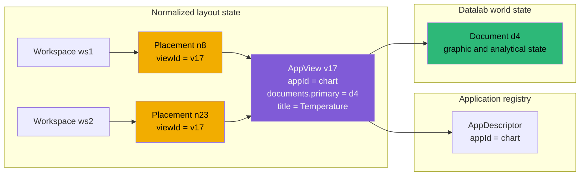

# PROJECT REPORT - PBUI Application Views - Logical Views, Linked Placements, and the Launcher Foundation

PBUI's Datalab workbench now represents an open application independently from
the rectangles that display it. A logical `AppView` owns the application
identity, document bindings, and optional user title. A workspace tree owns
only split geometry and leaf placements. Each leaf refers to a view by
`viewId`, so one view can be displayed in several tiles and across several
workspaces without copying its application state.

This report explains why that distinction is necessary, how it was implemented,
which user operations it makes possible, and how the model supports the next
launcher phase. The current implementation is complete in commit `6cff173`.
The searchable modal launcher, workspace grouping, query prefixes, active
placement, and `Mod+K` navigation are designed but not yet implemented.

The work follows the package architecture described in [[PROJ - PBUI and Datalab UI - Completed Frontend Package Refactor]].
It also supports the plotting runtime described in
[[PROJECT REPORT - Hyperslop Plot v0.2 - From Grammar to Published PBUI Runtime]]:
a Chart application view may be placed more than once while continuing to read
one Datalab graphic document and render through one Plot adapter.

> [!summary]
> - An application view and a tile placement are different entities. The view owns durable application intent; the placement owns workspace geometry.
> - **Create linked duplicate** creates another placement for the same `viewId`. **Duplicate** creates a new `AppView` and a new placement while retaining the same document bindings.
> - Tile-title actions now use one PBUI object menu for left-click, right-click, and keyboard activation. Replace and Launcher use the same scoped view-selection policy.
> - Browser persistence version 4 and portable bundle version 3 preserve normalized view identity. Older versions are rejected instead of being adapted.
> - The next phase adds a small search model and modal. `+chart` restricts results to new Chart views; `ws8 temp` restricts existing-view search to workspace 8.
> - Active placement and keyboard routing will remain per-workbench, transient frontend state. They do not require backend changes, persistence, or CRDT synchronization.

## 1. The problem was an identity problem

The former layout leaf stored four kinds of information in one object: a node
identifier, an application identifier, a document identifier, and an optional
label. That representation was sufficient while every tile was independent.
It became insufficient as soon as the product needed to answer either of these
questions:

- Can the same open application view appear in two workspaces?
- Does duplicating a tile produce another display of the same view, or a new
  view initialized from the old one?

Those questions cannot be answered consistently when the tile is both the
geometric object and the application object. A leaf identifier must remain
stable while a splitter moves or replaces a rectangle. Application state must
remain stable when a view is shown somewhere else. Document identity must
remain independent because several views can read the same document and one
view may eventually bind documents in several roles.

The completed model assigns each responsibility a distinct identity.

| Entity | Identifier | Owns | Does not own |
|---|---|---|---|
| Application descriptor | `AppId` | Component registration, title, scope, singleton and duplication policy | Open state, documents, geometry |
| Logical application view | `ViewId` | Selected application, named document bindings, optional custom title | Rectangle, split direction, workspace ownership |
| Document | `DocId` | Analytical or domain state such as a graphic, pipeline, or table definition | Application presentation and placement |
| Tile placement | `NodeId` | One leaf position in one workspace tree | Application state and document contents |
| Split node | `NodeId` | Direction, ratio, and child geometry | Application identity |

This is the central invariant:

```text
application definition != application view != document != tile placement
```

The distinction is concrete. A Chart descriptor says how to render a Chart
application. An `AppView` says that one logical Chart view is bound to document
`doc-alpha` and is titled “Temperature by station.” Two leaves can point to
that same view. The graphic document remains a separate object that could also
be read by an Encoding view.

## 2. The normalized state model

The core types live in
`packages/datalab-ui/src/store/layout.ts` and
`packages/datalab-ui/src/store/layoutTree.ts`.

```ts
export type DocumentBindings = Record<string, DocId>;

export interface AppView {
  id: ViewId;
  appId: AppId;
  documents: DocumentBindings;
  title?: string;
}

export type Node =
  | {
      id: NodeId;
      type: "leaf";
      viewId: ViewId;
    }
  | {
      id: NodeId;
      type: "split";
      dir: "row" | "col";
      a: Node;
      b: Node;
      ratio: number;
    };
```

`LayoutState` stores the normalized view table and a stable order:

```ts
export interface LayoutState {
  stages: Stage[];
  currentStageId: StageId;
  spaces: Workspace[];
  currentSpaceId: string;

  views: Record<ViewId, AppView>;
  viewOrder: ViewId[];

  pendingImport?: PendingImport | null;
  replacingId?: NodeId | null;
  renamingId?: string | null;
  notice?: Notice | null;
}
```

`views` provides identity lookup. `viewOrder` provides a deterministic launcher
and Replace order without relying on JavaScript object enumeration. Workspace
trees contain placement references, not copies of application payloads.



The graph contains two placement edges to one view and one document-binding
edge from the view to a document. Editing the view title changes both rendered
placements because both resolve `v17`. Editing document `d4` affects every
view that reads `d4`, whether those views are linked placements or independent
views.

### 2.1 Why document bindings are named

The first release needs only a primary document, but the type is
`Record<string, DocId>` rather than a single `docId` or an array. A binding is
created as:

```ts
documents: docId ? { primary: docId } : {}
```

and current application code reads it through:

```ts
export function primaryDocId(view: AppView | undefined): DocId | null {
  return view?.documents.primary ?? null;
}
```

The role name preserves a clean extension point for applications that require
more than one document. A future comparison view could use:

```ts
documents: {
  left: "doc-a",
  right: "doc-b",
}
```

That extension would not change placement identity, the workspace tree,
launcher grouping, or the distinction between linked and independent
duplicates. The implementation does not yet add application-specific binding
schemas, validation registries, or view-local property bags. Those mechanisms
should be added only when an application requires them.

## 3. State transitions

Normalization becomes useful only when every layout operation observes the new
identity rules. The reducers in `store/layout.ts` now make the intended
transition explicit.

### 3.1 Splitting creates a new Launcher view

Splitting a tile preserves the original placement on one side and creates a
new Launcher view and placement on the other:

```text
splitLeaf(targetPlacement, direction):
    newView = AppView(
        id = freshViewId(),
        appId = "launcher",
        documents = {}
    )
    register(newView)

    replace targetPlacement in current workspace tree with:
        Split(
            id = freshNodeId(),
            direction = direction,
            a = targetPlacement,
            b = Placement(
                id = freshNodeId(),
                viewId = newView.id
            )
        )
```

This creates an explicit target for choosing an application. The new leaf does
not contain a partially initialized application payload.

### 3.2 Replacing a placement can link or create

Replace has two valid outcomes.

Selecting an existing view changes only the leaf reference:

```text
replacePlacementWithView(nodeId, selectedViewId):
    require views[selectedViewId]
    placement = findLeaf(currentWorkspace.tree, nodeId)
    require placement
    placement.viewId = selectedViewId
```

Selecting a new application first creates a view, then assigns it:

```text
createViewInPlacement(nodeId, appId, optionalDocId):
    view = AppView(
        id = freshViewId(),
        appId = appId,
        documents = optionalDocId ? { primary: optionalDocId } : {}
    )
    register(view)
    findLeaf(currentWorkspace.tree, nodeId).viewId = view.id
```

The first operation creates another edge to an existing view. The second
creates a new view vertex and replaces the edge. This distinction is why the
shared switcher presents separate **Existing views** and **New view** sections.

### 3.3 Linked duplicate and duplicate are different operations

**Create linked duplicate** splits the current rectangle and gives the new leaf
the original `viewId`.

```text
createLinkedDuplicate(sourcePlacement):
    split sourcePlacement
    left.viewId  = sourcePlacement.viewId
    right.viewId = sourcePlacement.viewId
```

The result has two placements and one view:

```text
Before:
    n1 -> v1

After:
    split
    ├── n1 -> v1
    └── n2 -> v1
```

Renaming the view or changing one of its document bindings is visible in both
placements. The placements remain independently movable and closable because
their `NodeId` values differ.

**Duplicate** copies the `AppView`, creates a fresh `ViewId`, and places that
copy beside the source:

```text
duplicateView(sourcePlacement):
    source = views[sourcePlacement.viewId]
    copy = {
        ...source,
        id: freshViewId(),
        documents: copyRecord(source.documents),
        title: source.title ? source.title + " (copy)" : undefined
    }
    register(copy)
    split sourcePlacement with a new placement referencing copy.id
```

The result has two placements and two views:

```text
Before:
    n1 -> v1 -> document d1

After:
    split
    ├── n1 -> v1 -> document d1
    └── n2 -> v2 -> document d1
```

The document binding is retained intentionally. Duplicating a view means “open
an independently configurable view over the same material.” It does not mean
“copy the document.” Document duplication already exists as a separate
document action.

The shallow copy of the `documents` record matters. If the record object were
shared, later mutation of `v2.documents.primary` could mutate `v1` accidentally.
The document IDs remain shared values, while the binding maps are independent.

### 3.4 Workspace duplication links views

`cloneTree` deep-copies the layout tree with fresh node IDs while retaining each
leaf's `viewId`. The copied workspace therefore starts as another arrangement
of the same logical views.

This policy makes workspace duplication consistent with **Create linked
duplicate**. The copied workspace may be rearranged without changing the
original workspace geometry, while view title and document-binding updates
continue to be shared.

### 3.5 Closing a placement and closing a view are different

Removing a placement edits one workspace tree. It does not delete the view:

```text
removePlacement(nodeId):
    require workspace has more than one leaf
    currentWorkspace.tree = removeLeaf(currentWorkspace.tree, nodeId)
```

The view may still be placed elsewhere. It may also become unplaced. Retaining
an unplaced view is deliberate because the Launcher can expose it under a
**Not shown** group and place it again.

Closing a view removes every placement that refers to its `ViewId`, deletes the
view record, and removes the ID from `viewOrder`. A workspace that would become
empty is repaired with a Launcher view. The reducer reuses an existing Launcher
view when possible and creates one only when necessary.

```text
closeView(viewId):
    for each workspace:
        remove every leaf whose leaf.viewId == viewId

    if any workspace has no remaining leaf:
        fallback = existing launcher view or newly created launcher view
        insert a fallback placement in each empty workspace

    delete views[viewId]
    remove viewId from viewOrder
    clear rename and replace transient state
```

This repair preserves two invariants:

- Every workspace has at least one leaf.
- Every leaf references an existing view.

## 4. Rendering resolves placement to view

`components/organisms/Tile/Tile.tsx` receives a leaf node. It resolves the view
through `state.layout.views[node.viewId]`, resolves the application descriptor
through `appFor(view.appId)`, and derives the primary document through
`primaryDocId(view)`.

The rendered title has two forms:

```text
custom title:
    view.title

derived title:
    application title + optional document name
```

An empty rename is normalized to `undefined`. Rendering uses nullish
coalescing, so clearing the custom title restores the derived title rather than
rendering an empty title bar.

The application receives both placement and view context:

```ts
<Component placementId={node.id} view={view} />
```

This contract allows application code to use the correct identity for each
operation:

- Use `view.id` when changing a view binding or view-owned state.
- Use `placementId` when splitting, replacing, focusing, moving, or closing one
  rectangle.
- Use `DocId` when changing analytical document content.

Confusing these identifiers produces specific failures. Updating a document by
placement ID would fail after the view moves. Closing by view ID when the user
intended to remove one placement would close linked copies in other
workspaces. Storing focus by view ID would mark every linked placement as
focused.

## 5. The title is the view-action surface

The title bar already contains drag and geometry controls. Adding a separate
button for every view operation would make narrow tiles unusable. PBUI already
has a typed `Presentation` protocol and object menu, so the view title now
exposes one action set through left-click, right-click, and keyboard
activation.

`pbui/descriptors/tile.ts` receives a `TileRef` containing the resolved
placement, view, application, title, document, duplication policy, close
capability, and placement count. It returns serializable actions:

```text
Replace …
Rename …
Create linked duplicate
Duplicate
Split right
Split below
Copy view to clipboard
Replace from clipboard …
Save as a template …
Inspect
Remove from this workspace
Close view / Close view everywhere
```

The labels expose identity semantics directly. **Remove from this workspace**
operates on a placement. **Close view everywhere** operates on the logical
view. The menu changes the final label to **Close view** when only one
placement exists.

The descriptor does not dispatch Redux actions. It emits a serializable verb:

```ts
{ kind: "createLinkedDuplicate", placementId }
{ kind: "duplicateView", placementId }
{ kind: "removePlacement", placementId }
{ kind: "closeView", viewId }
```

`store/applyLayoutVerb.ts` is the single translation boundary from verbs to
Redux actions or thunks:

```text
PBUI Presentation
    -> tile descriptor
    -> serializable Verb
    -> actionsForLayoutVerb
    -> reducer action or effect thunk
    -> normalized layout state
```

This preserves traceability. A user operation can be described as “create a
linked duplicate” rather than as a low-level mutation of a split tree. It also
keeps the descriptor pure and testable.

## 6. Launcher and Replace share selection policy

`LauncherApp.tsx` and the title menu's Replace action both render
`components/organisms/ViewSwitcher/ViewSwitcher.tsx`. The containers differ,
but the available choices and their meaning do not.

The pure function in `ViewSwitcher/model.ts` receives:

```ts
interface ViewSwitcherModelInput {
  apps: readonly AppDescriptor[];
  views: Readonly<Record<ViewId, AppView>>;
  viewOrder: readonly ViewId[];
  currentViewId: ViewId | null;
  appFor(id: string): AppDescriptor | null;
  placementCount(viewId: ViewId): number;
  shownInCurrentWorkspace(viewId: ViewId): boolean;
}
```

It produces:

```ts
interface ViewSwitcherModel {
  existing: ExistingViewOption[];
  creatable: AppDescriptor[];
}
```

The model preserves application scope. It excludes:

- the current view;
- Launcher views;
- views whose applications are not legal in the current instance, stage, and
  workspace scope;
- creation of a second logical singleton view.

A singleton constrains logical views, not placements. If a singleton view
already exists, it remains selectable and may be linked into another
placement. The corresponding application is removed only from the **New view**
section.

Existing views are currently ranked in three groups:

1. views already shown in the current workspace;
2. unplaced views;
3. views placed only elsewhere.

The UI includes application title, document name, number of placements, and
whether the view is shown here. That metadata makes linking an existing view a
deliberate operation rather than an accidental replacement.

## 7. Persistence preserves the normalized graph

Normalization changes the durable schema because workspace trees no longer
contain application payloads. Browser persistence is version 4. The persisted
layout includes:

- normalized `views`;
- deterministic `viewOrder`;
- workspace trees whose leaves contain `viewId`;
- stages and current pointers;
- durable world and product state already owned by the workbench.

The validator checks graph integrity, not only field types. It rejects layouts
with missing view references or duplicate order entries. Transient interaction
state such as `replacingId`, `renamingId`, pending imports, notices, and future
active-placement state is not persisted.

No compatibility adapter was added for earlier browser state. A stale or
structurally invalid payload is rejected and the product restores its default
layout. This follows the project's explicit rule against adding
backwards-compatibility layers without a concrete requirement.

## 8. Portable bundles preserve shared topology

Copy, paste, templates, and workspace or stage export use a separate portable
schema in `model/portable.ts`. Bundle version 3 represents views once and makes
portable leaves refer to them by array index:

```ts
interface PortableView {
  app: string;
  documents: Record<string, number>;
  title?: string;
}

type PortableNode =
  | { leaf: { view: number } }
  | {
      split: {
        dir: "row" | "col";
        ratio: number;
        a: PortableNode;
        b: PortableNode;
      };
    };
```

Document bindings use document indices for the same reason. Export collectors
deduplicate documents and views across the bundle envelope. A stage bundle
uses one collector across every included workspace, so two workspaces that
reference the same view continue to share it after import.

Hydration happens in dependency order:

```text
parse and validate bundle
    -> mint fresh document IDs
    -> mint each portable view once
       -> translate document indices to minted DocIds
    -> hydrate every workspace tree
       -> translate view indices to minted ViewIds
       -> mint fresh placement and split NodeIds
    -> merge views, documents, and layout into local state
```

The portable envelope never reuses source IDs. This avoids collisions with the
receiving workbench while preserving relationships inside the imported
material.

```mermaid
flowchart LR
    SRC["Source runtime graph"]
    COLLECT["Collect unique docs and views"]
    BUNDLE["Portable bundle v3<br/>arrays + indices"]
    VALIDATE["Strict parser and limits"]
    MINT["Mint local DocIds and ViewIds"]
    TREES["Hydrate trees with fresh NodeIds"]
    DEST["Destination runtime graph"]

    SRC --> COLLECT --> BUNDLE --> VALIDATE --> MINT --> TREES --> DEST

    style BUNDLE fill:#805bd7,color:#f3f3ef
    style VALIDATE fill:#ef4038,color:#f3f3ef
    style DEST fill:#2db878,color:#050607
```



The important property is topology preservation. If two source leaves refer to
portable view index 2, both destination leaves refer to the one newly minted
view for index 2. Hydrating a separate view for every leaf would silently turn
linked duplicates into independent views.

Older and newer bundle versions are refused with explicit reasons. The parser
does not partially interpret incompatible structures.

## 9. Failure modes addressed by the implementation

The normalized model closes several failure modes that were difficult to
prevent in the leaf-owned representation.

### 9.1 Renaming one linked placement only

If a title remained on the leaf, linked placements could display conflicting
names for what is supposed to be one logical view. The title now belongs to
`AppView`, so rename scope is explicit.

### 9.2 Accidentally copying a document

Independent view duplication copies the binding record, not the document. A
separate document action is required to create independent analytical content.
This prevents “duplicate view” from silently multiplying large or stateful
documents.

### 9.3 Losing links during serialization

Serializing the complete view payload inside every leaf would produce
independent objects after import. Normalized persistence stores IDs, and
portable bundles use indices with one hydration map.

### 9.4 Deleting a view while placements still refer to it

`closeView` removes references across all workspaces before deleting the view.
Persistence validation also rejects missing references.

### 9.5 Empty workspaces after global close

A close operation can remove the final placement from more than one workspace.
The reducer repairs each empty workspace with a Launcher placement.

### 9.6 Singleton applications becoming impossible to reuse

Singleton policy now limits view creation rather than placement count. A
singleton can still be displayed in several workspaces by linking its existing
view.

### 9.7 Launcher and Replace disagreeing about scope

Both surfaces use `useAvailableApps` and the same pure model. Scope, singleton,
and current-view exclusions do not have separate implementations.

## 10. Verification

The implementation was validated at several levels:

- Datalab lint and TypeScript checks passed.
- The Datalab test suite passed with 37 files and 411 tests.
- The Datalab production build passed.
- The static Storybook build passed.
- Root PBUI TypeScript and tests passed with 5 files and 26 tests.
- Storybook interactions cover title activation, context activation, Rename,
  Replace, Escape focus restoration, linked duplication, independent
  duplication, and narrow-title behavior.
- The real `/ui/` workbench was exercised against the complete application
  stack. Replace linked an existing view, and the resulting placements exposed
  **Close view everywhere**.

Important regression locations include:

| Concern | Primary files |
|---|---|
| View and placement reducers | `packages/datalab-ui/src/store/layout.ts` |
| Tree geometry | `packages/datalab-ui/src/store/layoutTree.ts` |
| Tile rendering and title behavior | `packages/datalab-ui/src/components/organisms/Tile/Tile.tsx` |
| Shared selection UI | `packages/datalab-ui/src/components/organisms/ViewSwitcher/ViewSwitcher.tsx` |
| Pure selection policy | `packages/datalab-ui/src/components/organisms/ViewSwitcher/model.ts` |
| Browser schema v4 | `packages/datalab-ui/src/store/persist.ts` |
| Portable schema v3 | `packages/datalab-ui/src/model/portable.ts` |
| Bundle graph collection and hydration | `packages/datalab-ui/src/store/bundles.ts` |
| Reducer regression tests | `packages/datalab-ui/test/store.test.ts` |
| Portable graph round trips | `packages/datalab-ui/test/portable.test.ts` |
| Switcher policy tests | `packages/datalab-ui/test/view-switcher.test.ts` |
| Interaction specimens | `packages/datalab-ui/src/components/organisms/Tile/Tile.stories.tsx` |

## 11. Implementation record from the investigation diary

The ticket diary records the implementation as a sequence of dependency
changes rather than as one final diff. That sequence matters because it shows
which boundaries were established first, which errors exposed incomplete
migration, and which corrections changed the final product behavior.

### 11.1 State normalization came before rendering changes

The first implementation step changed `layoutTree.ts`, `layout.ts`, seeded
stages, fixtures, and stories. The first full TypeScript check then produced a
large but useful migration list: application props, tour predicates, bundle
fixtures, and tests still constructed or read leaf-owned `app`, `docId`, and
`label` fields.

Those failures were resolved at their actual ownership boundaries:

- Tree operations retained only `NodeId` and `ViewId`.
- Renderers resolved `AppView` before selecting an application or document.
- Tour code used the existing flattened view-snapshot helper.
- Fixtures registered views before placing them.

No temporary adapter reproduced the old leaf shape. This increased the initial
number of compiler errors, but it made the new contract complete and prevented
old and new identity models from coexisting.

The diary also records one extension that moved forward from the original
design's deferred list. Applications were changed to receive
`{ placementId, view }` during normalization. Keeping the former
`{ leafId, docId }` application prop would have left the obsolete ownership
model in the main component API. The direct `AppView` prop removed that
ambiguity without introducing generic view-property schemas.

### 11.2 Durable schemas followed the runtime graph

Persistence and bundle work came after reducers and component contracts because
the serialized form had to reflect the completed runtime graph. Version 4
browser persistence and version 3 portable bundles were implemented as clean
schema breaks.

One correction concerned pinned workspaces. The default-layout merge replaces
code-defined workspace trees on reload. If it retained the old seeded view
records as well, each reload could accumulate unreachable views. The merge now
removes view records owned only by replaced hardwired workspaces. It does not
garbage-collect ordinary user-created unplaced views.

A source-level render-boundary test also failed because it asserted the old
component invocation as a literal string. The assertion was changed to require
both `placementId` and `view={view}`. This was not a production defect, but it
confirmed that the public application contract had changed everywhere the
architecture test expected.

### 11.3 The first real switcher ordering was insufficient

The initial shared switcher was correct by scope and identity but poor in the
complete workbench. Pinned and tutorial workspaces put many views in frontend
state. A flat `viewOrder` placed current-workspace choices after dozens of
unrelated entries.

The correction did not add search, MRU timestamps, or another state machine.
The pure model introduced three stable relevance classes:

```text
current workspace -> unplaced -> placed elsewhere
```

This small policy made the current interface usable immediately. It also
provided evidence for the later workspace-grouped modal: location metadata
already changes the usefulness of a view result.

### 11.4 Accessibility implementation stopped after two failed approaches

The diary records two consecutive Biome failures involving interactive `div`
and ARIA semantics. Work stopped after the second attempt under the repository's
debugging rule:

```text
I think I'm stuck, let's TOUCH GRASS
```

After resuming, the implementation used semantic `section` elements and native
buttons. Escape handling moved to the active Replace surface, and no lint
suppression was added. The result is simpler than preserving custom interactive
containers and manually reconstructing native behavior.

### 11.5 Storybook found both a harness defect and a production layout defect

The first interactive Tile story used the workbench provider stack but omitted
`AnalysisProvider`. Applications rendered below the tile required that context,
so the story failed immediately. The correction was limited to the story
harness:

```tsx
<AnalysisProvider principalKey="storybook-tile">
  <WorkbenchProviders>{story}</WorkbenchProviders>
</AnalysisProvider>
```

The production provider hierarchy did not need modification.

The narrow long-title story exposed a real visual defect. A title wrapped,
increasing the title bar from 22 pixels to 37 pixels and changing the tile's
content geometry. The fix established a flex-width boundary and a one-line
ellipsis:

```css
.viewTitle {
  min-width: 0;
  overflow: hidden;
}

.viewTitleText {
  overflow: hidden;
  text-overflow: ellipsis;
  white-space: nowrap;
}
```

The accessible label still contains the complete title. Browser measurement
after the correction confirmed a stable 22-pixel bar.

Storybook browser checks covered left-click and context-click menus, Rename,
Replace, linked singleton selection, both duplicate flows, Escape focus
restoration, and narrow-title rendering. This is why Storybook is part of the
implementation evidence rather than only a component catalog.

### 11.6 The complete frontend revealed expected backend absence

The final browser validation used `http://127.0.0.1:5173/ui/`. It confirmed
that all four default analytical tiles rendered, current-workspace results were
ranked first, an existing Encoding view could replace the Pipeline placement,
and two resulting placements exposed **Close view everywhere**.

The page also reported a `502 Bad Gateway` for `/v1/me`. The frontend-only Vite
server had no backend proxy target. The view interactions continued to work, so
the error was recorded as an environment limitation and did not trigger
frontend changes or unrequested backend work.

### 11.7 Documentation validation found a repository-relative path error

After implementation, strict `docmgr doctor` reported sixteen missing related
files even though the files existed. The design frontmatter used paths beginning
with:

```text
repo://pbui/packages/...
```

The ticket already lives in the `pbui` repository, so these references resolved
to `pbui/pbui/packages/...`. Correcting them to:

```text
repo://packages/...
```

made the strict doctor check pass. This correction did not change the runtime,
but it restored navigable documentation references for subsequent work.

### 11.8 Final diary evidence

The diary's final verification records:

- Biome checked 427 Datalab files.
- TypeScript checks passed for Datalab and root PBUI.
- Datalab passed 411 tests across 37 files.
- Root PBUI passed 26 tests across 5 files.
- The production library build passed.
- Storybook transformed 674 modules and produced a static build.
- `git diff --check` passed.

Existing chunk-size and plugin-timing warnings remained warnings. The verified
runtime was committed separately from documentation bookkeeping as:

```text
6cff173 feat(datalab): separate views from tile placements
```

## 12. The next phase: a searchable modal launcher

The normalized model answers what a launcher result is. An existing result is
an `AppView` plus the set of workspaces and placements that refer to it. A new
result is an application descriptor that is legal in the current scope and can
create a view.

The current Launcher and Replace interface is a button grid. It works for a
small number of views, but it does not scale to many workspaces or provide a
consistent keyboard entry point. The reviewed design in ticket
`DATALAB-VIEW-001` compares three options:

| Option | Description | Decision |
|---|---|---|
| Embedded searchable tile | Add an input and groups inside the existing tile body | Retain as a possible compact fallback, but tile dimensions constrain the main experience |
| Modal launcher | Reuse one modal for Launcher, Replace, and later global navigation | Recommended |
| General command palette | Register views, commands, documents, actions, keybindings, and MRU ordering | Defer; it exceeds the current product requirement |

The recommended modal has stable geometry and enough space for workspace,
application, document, and placement metadata.

```text
┌─ QUICK LAUNCHER ─────────────────────────────────────┐
│ > temp                                              │
│ place in: ws2 explore · new tile                    │
├─────────────────────────────────────────────────────┤
│ WS2 · EXPLORE                                CURRENT│
│ ▸ Temperature by station       chart · climate      │
│   Temperature table            table · climate      │
│                                                     │
│ WS8 · COMPARE                                       │
│   Temperature histogram         chart · climate      │
│                                                     │
│ NOT SHOWN                                           │
│   Temperature scratch           chart · climate      │
│                                                     │
│ NEW VIEW                                     type + │
│   Chart   Table   Pipeline   Encoding                │
├─────────────────────────────────────────────────────┤
│ ↑↓ choose · Enter place · Esc close                 │
└─────────────────────────────────────────────────────┘
```

### 12.1 The query grammar remains deliberately small

The first parser recognizes two optional restrictions and ordinary text:

```text
temp
    Search existing views and eligible new applications.

+
    Show new applications only.

+chart
    Show new applications matching "chart".

ws8
    Show existing views placed in workspace ordinal 8.

ws8 temp
    Search "temp" among views placed in workspace ordinal 8.
```

`ws8 +chart` is invalid in the first version. A new view does not yet belong to
a workspace, so combining an existing-placement scope with new-only creation
would conceal the actual target semantics.

The parser should return a typed value rather than distribute string checks
through React:

```ts
interface LauncherQuery {
  raw: string;
  text: string;
  newOnly: boolean;
  workspaceOrdinal: number | null;
  error?: string;
}

function parseLauncherQuery(raw: string): LauncherQuery
```

Workspace aliases such as `ws8` are transient, one-based ordinals derived from
the current stage's visible WorkspaceStrip order. They are not stored in the
layout, sent to the backend, or treated as durable API identifiers. The modal
always displays the resolved workspace name beside the alias.

### 12.2 Grouping follows placement membership

A view does not have one owning workspace. The launcher builds workspace groups
by traversing trees:

```text
for each workspace in display order:
    seenInWorkspace = Set()

    for each leaf in workspace.tree:
        if leaf.viewId already in seenInWorkspace:
            continue

        add workspace membership to result[leaf.viewId]
        add leaf.id as a navigation destination
        seenInWorkspace.add(leaf.viewId)

for each registered view with no membership:
    add it to NOT SHOWN
```

A linked view appears once in each workspace group even if that workspace
contains several placements for it. The same logical view may appear under
several workspace headings because that is useful location information, not a
claim of ownership.

### 12.3 Search ranking can remain deterministic

The first release does not need a fuzzy-search dependency. A small score
function is sufficient:

```text
exact title match           100
title prefix                 80
word prefix                  60
title substring              40
application/document prefix  30
workspace-name substring     20
all tokens found somewhere   10
```

Stable ties use the current workspace order and `viewOrder`. This makes tests
deterministic and keeps relevance policy inspectable.

## 13. Invocation determines selection semantics

The same modal supports three invocation modes, but selection must not mean the
same thing in every mode.

| Invocation | Target known? | Existing-view selection | New-application selection |
|---|---:|---|---|
| Launcher tile | Yes | Assign the selected `viewId` to that placement | Create a view and assign it there |
| Replace action | Yes | Assign the selected `viewId` to that placement | Create a view and assign it there |
| `Mod+K` navigation | Not necessarily | Switch to a workspace containing the view and focus one placement | Allowed only when the active placement is already a Launcher |

Global navigation must not silently replace a working tile or create a split.
If the active placement is not a Launcher, a `+chart` result explains that the
user must focus or create an empty tile first.

The modal snapshots its invocation when it opens:

```ts
type LauncherInvocation =
  | { kind: "fill-launcher"; placementId: NodeId }
  | { kind: "replace"; placementId: NodeId }
  | { kind: "navigate"; activePlacementId: NodeId | null };
```

This prevents a focus change inside the modal from changing the target under
the user's next Enter key.

## 14. Active placement is transient interaction state

The global shortcut needs to know which workbench and tile supplied the user's
context. DOM focus alone is too narrow because focus may be inside a tile's
button, input, SVG mark, or menu trigger. View identity is too broad because
one view may have several placements.

The proposed **active placement** is the last tile in a workbench that contained
focus or received a pointer press.

```ts
interface WorkbenchInteractionState {
  activePlacementId: NodeId | null;
  launcherInvocation: LauncherInvocation | null;
}
```

It belongs in a React context mounted by
`components/pages/Workbench/WorkbenchProviders.tsx`. It does not belong in
Redux, persistence, a portable bundle, the backend, or a future CRDT:

- It has no domain meaning.
- It changes at pointer and focus frequency.
- It is local to one browser viewer.
- Synchronizing it would cause remote clients to interfere with local
  keyboard context.

A tile reports activity at its DOM boundary:

```tsx
<section
  data-placement-id={node.id}
  onFocusCapture={() => setActivePlacement(node.id)}
  onPointerDownCapture={() => setActivePlacement(node.id)}
>
  ...
</section>
```

If the active placement disappears, the provider clears it or selects a valid
placement from the current workspace. A subtle outline may be shown while the
launcher is open, but active placement should not look like durable domain
selection.

## 15. Keyboard routing begins with one route

The first keyboard system should not be a command registry. It needs one
workbench-local capture boundary and one pure route function:

```text
routeWorkbenchKey(event, context):
    if event was already handled:
        return none

    if target is editable:
        return none

    if a higher transient layer owns the key:
        return none

    if event is Mod+K:
        return openLauncherNavigate

    return none
```

The listener belongs on the workbench root through `onKeyDownCapture`, not on
`window`. A page may render more than one workbench, and only the workbench
containing browser focus should handle its shortcut.

Editable controls, PBUI accept mode, the object menu, and existing dialogs must
retain their local key behavior. Escape belongs to the topmost transient
component. The modal closes itself; the object menu closes itself; the
workbench does not broadcast Escape to every listener.

This is enough infrastructure for `Mod+K`. It does not introduce command
registration, configurable keymaps, key sequences, MRU storage, or a focus
graph before those requirements exist.

## 16. Recommended implementation sequence

The next work should proceed in three independently testable increments.

### Phase 1: pure index, grouping, and query parsing

Implement the data model without changing the visible launcher:

- Parse plain, `+`, and `wsN` queries.
- Traverse workspace trees once to build view memberships.
- Preserve current application scope and singleton rules.
- Rank matches deterministically.
- Test linked views, unplaced views, workspace aliases, invalid combined
  prefixes, and empty-query limits.

This phase should live beside `ViewSwitcher/model.ts` and remain independent of
React and Redux.

### Phase 2: modal from explicit entry points

Reuse the existing PBUI `Dialog`:

- Replace the Launcher tile's full grid with a compact open action.
- Open the modal with an explicit Launcher placement.
- Open the same modal from the title menu's Replace action.
- Keep focus in the search input and expose results through an accessible
  combobox/listbox pattern.
- Support Arrow Up, Arrow Down, Home, End, Enter, and Escape.
- Add Storybook states for empty, scoped, linked, not-shown, no-match, and
  invalid-prefix results.

Because both entry points have a target placement, this phase does not require
active-placement tracking.

### Phase 3: active placement and `Mod+K`

Add the per-workbench interaction provider:

- Track activity through tile capture handlers.
- Route `Mod+K` at the workbench root.
- Open the modal in navigate mode.
- On selection, switch stage or workspace if necessary and focus a concrete
  placement.
- Prevent creation from replacing a non-Launcher placement.
- Add interaction tests for editable targets, dialogs, object menus, multiple
  workbenches, and removed active placements.

MRU ordering should be considered only after observing real use. The normalized
view and placement model does not prevent it, but no MRU state is necessary to
ship searchable navigation.

## 17. What remains deliberately unbuilt

The implementation and launcher design establish extension points without
implementing every possible system.

The following remain deferred:

- Per-application view property schemas.
- Application-defined multi-document roles and validators.
- A general command registry.
- User-configurable keybindings.
- Alt-Tab or MRU ordering.
- Persistent or synchronized active placement.
- Backend workspace mutation APIs.
- CRDT replication.
- Implicit tile splitting from the global launcher.
- Search over fields, marks, sources, commands, or arbitrary document content.

These omissions preserve delivery speed and reduce state coordination. They do
not block later work. Durable collaborative editing can operate on normalized
views and placement trees because their identities are already separate.
Transient focus and launcher state can remain local even if durable view and
workspace operations later become synchronized.

## 18. Working rules

The following rules should guide future changes:

- Treat `NodeId` as placement or split identity, never as application identity.
- Treat `ViewId` as one logical open application, never as document identity.
- Treat `DocId` as domain-content identity, never as rendering geometry.
- A linked duplicate creates a new placement only.
- An independent duplicate creates a new view and placement but does not copy
  documents.
- Replacing with an existing view creates a link; replacing with an application
  creates a view.
- Removing a placement does not delete its view.
- Closing a view removes every placement and repairs empty workspaces.
- Serialize normalized relationships once and reference them by ID or index.
- Keep focus, launcher state, and keyboard routing local and transient.
- Reuse the pure scope and singleton policy for every view-selection surface.
- Add application-specific view state only when a concrete application needs
  it.
- Do not add compatibility adapters or generalized command infrastructure
  without an explicit product requirement.

## 19. Important project documents

The complete design and implementation record is in:

- `/home/manuel/workspaces/2026-07-28/split-datadrop/pbui/ttmp/2026/07/30/DATALAB-VIEW-001--separate-application-views-from-workspace-tile-placements/index.md`
- `/home/manuel/workspaces/2026-07-28/split-datadrop/pbui/ttmp/2026/07/30/DATALAB-VIEW-001--separate-application-views-from-workspace-tile-placements/design-doc/01-application-views-linked-tile-placements-launcher-and-replacement-switcher-implementation-guide.md`
- `/home/manuel/workspaces/2026-07-28/split-datadrop/pbui/ttmp/2026/07/30/DATALAB-VIEW-001--separate-application-views-from-workspace-tile-placements/design-doc/02-launcher-quick-search-modal-workspace-grouping-and-keyboard-routing.md`
- `/home/manuel/workspaces/2026-07-28/split-datadrop/pbui/ttmp/2026/07/30/DATALAB-VIEW-001--separate-application-views-from-workspace-tile-placements/reference/01-investigation-diary.md`

The first document specifies and records the shipped object model. The second
compares launcher options and defines the recommended staged modal, query, and
keyboard design. The diary preserves the investigation, implementation,
failures, corrections, validation commands, and review guidance.

## 20. Current status and next step

The object model is implemented, tested, demonstrated in Storybook, exercised
in the real workbench, and committed as `6cff173`. The ticket remains in review
because its launcher follow-up is a design rather than shipped behavior.

The smallest useful next step is the pure launcher index and parser. It creates
no new persistent state, no modal, no shortcut listener, and no backend
dependency. Once its behavior is covered with deterministic tests, the
existing Dialog can expose it from Launcher and Replace. Active placement and
`Mod+K` then become a separate, reviewable increment.

This sequence ships useful frontend behavior at each stage while preserving
the object boundaries required for later multi-document applications,
cross-workspace reuse, agent-authored view configurations, and synchronized
durable layout changes.
