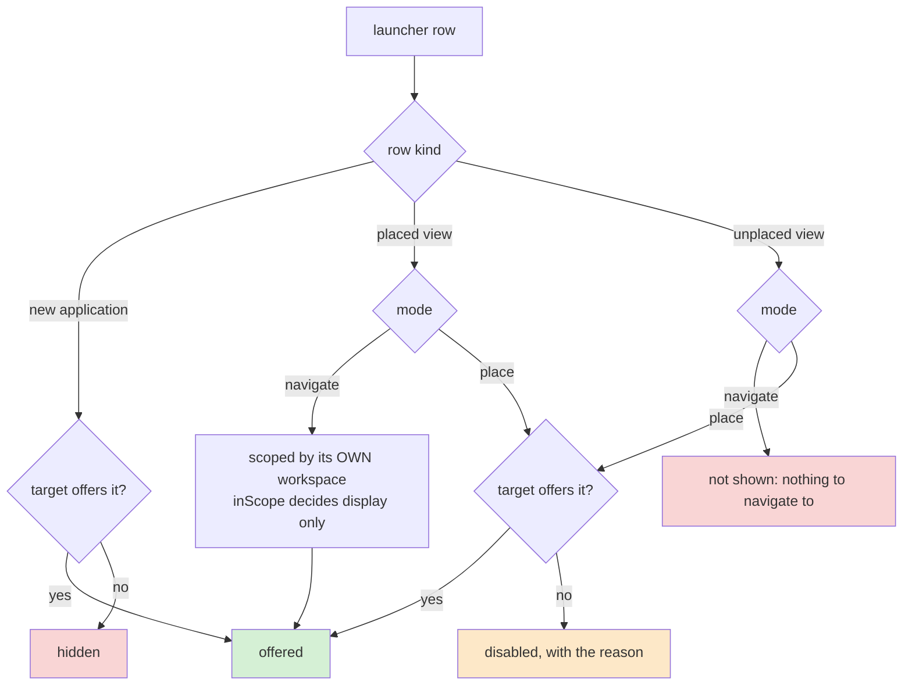
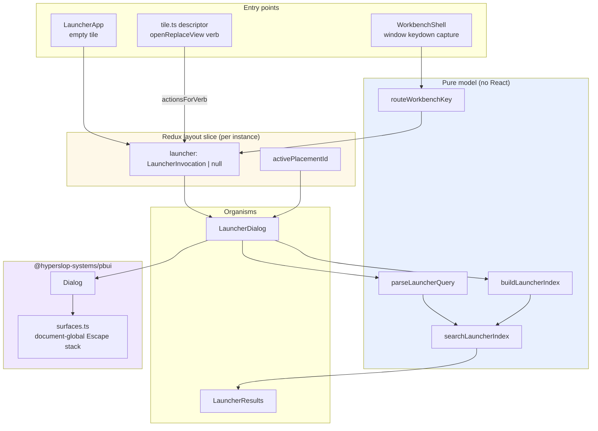

# PROJECT REPORT - PBUI Launcher - Searchable Modal, Per-Row Scope, and Document-Global Keyboard Ownership

The launcher phase described as future work in
[[PROJECT REPORT - PBUI Application Views - Logical Views, Linked Placements, and the Launcher Foundation]]
is implemented. Datalab's workbench now opens one searchable modal from three
entry points — an empty tile, a tile's Replace action, and a `Mod+K` shortcut —
over a pure search model that groups logical views by the workspaces that place
them.

This report is about the parts that did not survive contact with the code. The
design document for this phase was written while the normalized-view work was
still landing, and five of its statements turned out to be wrong. Two were
wrong on inspection, two were wrong only in a browser, and one was wrong in a
way that an automated reviewer found after the pull request was opened. Each
error has a general shape worth extracting, and the specific shapes are: state
ownership decided by whether the caller is a value or a function; scope that
splits into two questions when a list crosses a container boundary; keyboard
ownership as a document-level rather than subtree-level property; and the
distinction between an invariant and the mechanism chosen to enforce it.

The implementation is fifteen commits from `0ae6678` to `cf93ff7` on branch
`task/add-launcher` in `/home/manuel/workspaces/2026-07-30/add-launcher/pbui`,
merged into `main` as pull request #2 on 2026-07-31.

> [!summary]
> - Launcher state lives in the Redux layout slice rather than a React context, because the tile menu opens Replace through a serialisable verb emitted by a pure function that cannot call a context method.
> - Application scope is a property of each row, not of the query. Once results span workspaces, "which allow-list applies" becomes two questions: where the row is, and where it is going.
> - Escape ownership moved into the generic PBUI package as a document-global stack. Propagation cannot order handlers that all listen on `window`, and a per-store stack gives each embedded workbench its own incorrect idea of "topmost".
> - Binding a global shortcut to a React capture handler fails because `document.activeElement` is `<body>` after every page load. Focus has a null state and it is the common one.
> - An invariant is not the same as the mechanism that enforces it. "Never destroy a working tile" was first enforced by refusing to create, and is better enforced by splitting.

## 1. What the launcher does

A user opens the launcher in one of three ways, and the way determines what
selecting a result means.

| Entry point | Invocation | Selecting a result |
|---|---|---|
| Empty tile's **Search views…** button | `fill-launcher` | Assigns the view to that placement |
| Tile title menu → **Replace …** | `replace` | Assigns the view to that placement |
| `Mod+K` | `navigate` | Switches workspace and focuses an existing placement; creating splits |

The distinction matters because the first two have an explicit target and the
third does not. A modal that treated them identically would either refuse to
create anything under `Mod+K`, or would replace whatever the user last touched.
Section 8 covers how that was resolved, and how it was resolved wrongly first.

Results are grouped by workspace. A logical view placed in three workspaces
produces three rows, one under each, because in navigation mode the location is
the meaningful part of the answer. Within a workspace, a view placed twice
produces one row carrying both placement identifiers.

The query grammar is two prefixes and nothing else:

```text
query            := whitespace? prefix* search-text
prefix           := "+" | "ws" positive-integer whitespace+
```

`+chart` searches only applications that can create a view. `ws8 temp`
searches only views placed in the eighth workspace of the current stage. The
workspace token is anchored to the start of the query, so a view titled
"ws8 report" remains findable by typing its title.

## 2. The pure model

Everything about search semantics lives in two modules that import no React, no
store, and no registry global:

```text
components/organisms/ViewSwitcher/
  launcherQuery.logic.ts     the grammar
  launcherIndex.logic.ts     index, grouping, scoring, filtering
```

`buildLauncherIndex` walks every workspace tree once and produces grouped rows.
`searchLauncherIndex` applies a parsed query and a search context to that index.
Neither function can observe the DOM or dispatch anything.

The consequence is that fifty-five tests cover the whole of the search
behaviour without rendering a modal, including cases that are tedious to reach
by clicking: a linked view placed twice in one workspace and once in another,
a workspace ordinal that does not exist, a stage allow-list that differs from a
workspace allow-list, and an empty query against eight workspaces.

Scoring is a deterministic ladder rather than a fuzzy-search dependency:

```ts
if (title === query) return 100;
if (title.startsWith(query)) return 80;
if (title.split(" ").some((word) => word.startsWith(query))) return 60;
if (title.includes(query)) return 40;
// application id, application title, or document name prefix
if ([app, appId, doc].some((field) => field.startsWith(query))) return 30;
if (workspaceName && normalize(workspaceName).includes(query)) return 20;
// every query token appears somewhere
if (query.split(" ").every((token) => haystack.includes(token))) return 10;
return 0;
```

A ladder of explicit rules makes every ordering test readable as a sentence: a
word-prefix match beats a bare substring. A weighted sum would not.

The ordering *after* score is where the implementation is quieter than it
looks. The design asks for score, then current workspace, then current stage,
then workspace order, then `viewOrder` — five keys, and five chances to invert
a comparison. Instead, four of the five are encoded by construction: groups are
built current-stage-first, rows are built by walking `viewOrder`, and the
current workspace is moved to the front by one stable sort on a boolean. A
stable sort on score alone then preserves the rest. The comparator is
`(a, b) => b.score - a.score`, and the tests for "current workspace first" and
"viewOrder as the tie-break" both pass without a line mentioning either.

## 3. Where transient interaction state belongs

The design specified a per-workbench React context holding the launcher
invocation and the active placement, justified by the observation that a page
may contain several embedded workbench instances.

That justification does not distinguish the options in this codebase.
`WorkbenchInstance` constructs one Redux store per instance and wraps it in its
own `Provider`; its docstring states that "the store is the instance boundary."
Redux state is already per-instance. A context buys nothing.

The decisive argument runs the other way. The tile's Replace entry is not a
callback — it is a value:

```ts
actions.push({
  label: "Replace …",
  verb: { kind: "openReplaceView", placementId: tile.placementId },
});
```

`pbui/descriptors/tile.ts` is a pure function that holds no React. It returns
serialisable data, which `actionsForVerb` resolves into a Redux action. A
descriptor cannot call a context method. Routing the launcher through a context
would have required either a second opening path for a menu entry that already
has one, or a verb-to-context bridge that this codebase deliberately does not
have.

The codebase had already recorded this trade-off. `PendingImport`'s docstring
explains that the import dialog's state went into Redux "because the flow is
already state-shaped and because the alternatives are worse: component state
means prop-drilling from the shell through three components to reach a menu."

The general rule: **if the thing that opens a surface is a value rather than a
function, the surface's state must be reachable from a value.** Any UI whose
menus are declarative data — command registries, descriptor systems, verb
protocols — inherits this constraint whether or not it has noticed.

Transience is enforced structurally. `persist.save()` enumerates the layout
fields it writes rather than spreading the slice, so a new transient field is
excluded by default. A test asserts the property rather than the convention:

```ts
const parsed = JSON.parse(stored) as { layout: Record<string, unknown> };
expect(Object.keys(parsed.layout).sort()).toEqual([
  "currentSpaceId", "currentStageId", "spaces", "stages", "viewOrder", "views",
]);
```

The test was verified by mutation. Adding `launcher: layout.launcher` to
`save()` turns it red; reverting turns it green. A test guarding a silent
failure is worth confirming actually fails.

## 4. Scope is a property of the row, not the query

This is the most transferable result in the project, and the one the
implementation got wrong twice.

Before the launcher, every result in the view switcher was a candidate for one
placement in one workspace. `buildViewSwitcherModel` filtered candidates
through `useAvailableApps()`, which computes instance ∩ current stage ∩ current
workspace. One list, one allow-list, correct.

Grouping results across workspaces splits that into two questions that were
previously the same question:

1. **May this workspace show this view?** — asked of a row that is already
   somewhere. This is what `Mod+K` navigation needs.
2. **May the target show this view?** — asked of a row that is about to be
   placed. This is what Replace needs.

They differ exactly when two workspaces have different allow-lists, and the
failure mode of getting them confused is an *absence*: a row that should appear
and does not, or a row that should be refused and is not. An absent row looks
identical to a row that legitimately did not match the query, which is why this
needs tests rather than review.

The first version applied only the row's own workspace scope. That hid views
legitimately placed elsewhere from a `wsN` query. The design document was
amended with a new section, and the implementation followed.

The second version, caught by the automated reviewer on the pull request,
applied only the row's own scope in place mode too. The tell had been sitting in
the code the whole time:

```tsx
const blocked =
  mode === "place" && !row.inScope
    ? `${row.appTitle} is not offered in ${targetWorkspaceName}`
    : null;
```

The message names the target workspace. The condition checks `row.inScope`,
which is the *source* workspace. Message and check disagree, in one expression,
written at the same time by the same author. The practical consequence was that
opening the launcher in a workspace restricted to `signin` still offered to
create a `chart`.

The resolution puts both answers in the model, on the row:

- `inScope` — whether the row's own workspace offers its application, used for
  navigation.
- `unavailable` — set in place mode when the *target* does not offer it, read
  by both the pointer path and the keyboard path through one `blockedReason`
  function.

New-view rows the target forbids are hidden rather than disabled. Existing
rows are disabled with the reason. The split follows whether the row names
something that *exists*: "create a chart here, except you cannot" teaches
nothing, while "this view exists in ws8 but cannot come here" does.



## 5. Escape ownership is a document-level property

Four independent handlers wanted the Escape key: the dialog, the object menu, a
pending accept, and the full-frame toggle. Three of them registered on `window`.

The design proposed calling `event.stopPropagation()` in the dialog handler.
That cannot work. `stopPropagation` prevents an event reaching *other nodes*;
listeners registered on the node that calls it still run. `stopImmediatePropagation`
would suppress them, but only those registered afterwards, which makes
correctness a mount-order race between independent `useEffect` calls.

The first implementation put an ordered stack in the Datalab layout slice,
consistent with where the other transient fields live. That was wrong for a
reason that only appears with more than one workbench on a page: Escape is
delivered to the document, so "topmost" is a property of the whole page. With
a stack per store, a landing page's six instances each believed themselves
topmost, and one key press could close a dialog in one instance and leave full
frame in another.

The mechanism moved into the generic package as `src/surfaces.ts`: a
module-level LIFO of identifiers, a `useSyncExternalStore` binding, and one
question each handler asks.

```ts
export function useEscapeSurface(open: boolean, id?: string): boolean {
  const surfaceId = id ?? useId();
  const top = useSyncExternalStore(subscribeEscapeSurfaces, topEscapeSurface, serverTop);
  useEffect(() => {
    if (!open) return;
    pushEscapeSurface(surfaceId);
    return () => popEscapeSurface(surfaceId);
  }, [open, surfaceId]);
  return open && top === surfaceId;
}
```

Module state in a library that otherwise avoids it is justified by exactly the
argument that usually pushes state *into* a context: multi-root support. A
per-root context cannot see the other root, and the question is about the page.
The surface holds identifiers rather than elements or callbacks, so nothing can
retain a component or leak a closure.

Two constraints emerged while testing, both now documented in the module and
pinned by tests.

**One surface takes one registration.** `Dialog` registers for itself. A
component that wraps a `Dialog` must not register again. When `LauncherDialog`
did, Escape stopped closing anything at all — child effects run before parent
effects, so the wrapper's entry landed *above* the dialog's, and the dialog,
which is the component that actually handles the key, concluded it was not
topmost. The stack cannot detect this: a wrapper and the dialog it renders are
two components, and nothing in an identifier says they are one surface.

**Order is registration order, not DOM nesting.** For surfaces opened over time
by a click, which is every real case, the two agree. Two surfaces mounted in
the same commit, one inside the other, do not: they register bottom-up, so the
outer one ends up on top. Ordering by DOM containment would fix it and roughly
doubles the mechanism, so the behaviour is documented and asserted rather than
fixed.

## 6. Focus has a null state, and it is the common one

The design specified `onKeyDownCapture` on the workbench root, on the argument
that only the workbench containing focus should react to `Mod+K`. The argument
is right and the mechanism does not work.

`document.activeElement` is `<body>` after every page load, and again after
Escape closes the object menu. `<body>` is outside the shell element, so it is
not on the React event path, so the handler never fires. The shortcut was dead
in precisely the state a user starts in. Diagnosing it took one evaluation in
the browser:

```json
{ "activeElement": "BODY", "focusInsideShell": false, "activeIsBody": true }
```

The rule had to be stated directly rather than inherited from the event path:

```ts
const focused = document.activeElement;
const unowned = !focused || focused === document.body;
const ownsFocus = !unowned && root.contains(focused);
const lone = document.querySelectorAll("[data-workbench-shell]").length === 1;
if (!ownsFocus && !(unowned && lone)) return;
```

The workbench containing focus reacts. When nothing on the page owns focus, a
*lone* workbench reacts, because a page with one workbench cannot be ambiguous
about which was meant. Several workbenches with focus on `<body>` do nothing,
which is the honest answer: there is no way to tell, and opening six launchers
is worse than opening none.

Verified on the marketing page, which embeds six instances: with focus on
`<body>`, `Mod+K` opened nothing; with focus moved into the second instance, it
opened exactly one launcher, the second's.

## 7. Two bugs that only a browser could find

Neither was reachable from a unit test, and both are worth naming because the
class recurs.

**An optional field compared against `null`.** The shell asked whether the
launcher was open with `state.layout.launcher !== null`. The field is optional,
so before the launcher has ever opened it is `undefined`, and `undefined !== null`
is `true`. The shell therefore believed the launcher was permanently open:
`routeWorkbenchKey` saw `launcherOpen: true` and ignored every `Mod+K`, and the
active-tile outline was pinned on. No test could see it, because both consumers
take booleans as arguments and the defect is in the expression that produces
them.

**Document-global DOM queries in a multi-instance application.**
`focusPlacement` and `splitDirectionFor` used `document.querySelector`.
Placement identifiers are unique within a store, not within a document, so two
`WorkbenchInstance`s seeded from one preloaded layout hold the same identifiers.
The second launcher's focus restoration would move focus into the first
workbench. Both lookups are now scoped to the shell root that owns the
launcher, threaded in as a ref.

## 8. An invariant is not the mechanism that enforces it

The design's Decision 6 states that `Mod+K` must never destroy a working tile.
The first implementation enforced it by refusing: new-view rows were offered
only when the active placement was already an empty launcher tile.

This was reported from the running product as a defect — pressing `Mod+K`
showed only existing views. Two things were wrong. The condition depended on
`activePlacementId`, which is null until the user interacts, so on a freshly
loaded page it was unreachable and hid every new-view row. And even working, it
made the global shortcut strictly less capable than the launcher on a tile: a
shortcut that can do less than the thing it shortcuts.

Splitting keeps the invariant without the refusal. Selecting a new-view row in
navigate mode splits the target rather than replacing it — nothing is lost, the
neighbour becomes narrower — and the modal names the tile before the user
commits: *"go to: start here · beside Temperature by station"*.

The design had warned against choosing a split direction silently. The
objection is the *silence*, not the default. Naming the target in the header
turns an implicit split into a predicted one, so the direction can follow the
tile's longer axis without asking:

```ts
function splitDirectionFor(root: HTMLElement | null, placementId: NodeId): "row" | "col" {
  const element = placementElement(root, placementId);
  if (!element) return "row";
  const box = element.getBoundingClientRect();
  return box.width >= box.height ? "row" : "col";
}
```

Split-and-create is one dispatch. `splitLeaf`'s `prepare` takes an optional
application identifier, because two dispatches would render an empty launcher
tile for one frame before the real view replaced it.

## 9. Conditions that outlive their reasons

Two defects in this project had the same shape: an expression stayed
syntactically valid while the *meaning* of a term inside it changed.

`showUnplaced` read `mode === "place" || allowNewViews`. That disjunction was
correct while `allowNewViews` meant "the active tile is an empty launcher", and
wrong the moment it meant "we can split". Unplaced rows began appearing under
`Mod+K`, where `choose` handles only placed and new rows — so selecting one
silently did nothing and left the modal open.

`newViewsFirst` was scoped with `mode === "place"`, on the argument that
navigate mode "is not a place to create". True when it could not create; false
an hour later when it could. Navigate mode kept thirty-six existing rows above
the new-view section.

Neither produced a type error or a failing test. The mitigation adopted is to
write the *reason* into the comment rather than the rule, so that the next
person to change a capability can see what the condition depends on. A comment
that restates the code has no chance of catching this; a comment that states
the premise does.

## 10. Discoverability was a measurement, not an opinion

The new-view section was placed last, after the workspace groups. Opening
Replace against a real workspace produced:

```json
{ "totalOptions": 33, "optionsBeforeNewView": 25,
  "newSectionVisibleWithoutScrolling": false,
  "scrollHeight": 1268, "clientHeight": 350 }
```

Twenty-five rows and a scroll before the first new-view option. The `+` prefix
worked and was advertised in the placeholder, but a section nobody scrolls to is
a section that does not exist — which is exactly how it was reported once
`Mod+K` shipped with the same layout and thirty-six rows.

An empty query now puts new views first, in every mode. Typing text restores
existing-views-first, because a view *named* "chart" is a more specific answer
than an application whose name contains the string. The rule splits on whether
a query exists at all rather than on the invocation, which is one condition
instead of two and does not go stale when a mode gains a capability.

This ordering decision lives in the pure model as `newViewsFirst`, and the
flattened `rows` array follows it. If the rendered order and the traversal order
could disagree, arrow keys would move the highlight somewhere the eye is not.

## 11. Architecture



The layering follows the package's enforced import graph. The pure model sits
in `organisms`, importing only `store` types and `appkit` descriptors. The
Escape stack sits in the generic package because three of its four consumers
live there.

## 12. Presentation decisions

Launcher rows carry their application's tone as a four-pixel left edge, the same
`--pbui-tone-edge` idiom `Chip` uses, supplied as an inline CSS variable
reference. A chart row in the launcher is the colour of a chart tile's title
bar. Colour is never the only carrier of meaning: the application name is on
the row's second line, so nothing is lost in greyscale.

That claimed the left border, which selection had been using. The active row is
now a wash plus a `▸` marker — the marker is the part that survives a greyscale
screenshot, and the design's own mockups had drawn it all along.

Dialogs were restyled to match the workbench. The generic package ships a
default dialog with a half-rem radius, a slate hairline and a white panel, and
the Datalab theme had never mapped `--pbui-dialog-*` to its own tokens. Since
`tokens.css` declares `--pbui-radius: 0 /* everywhere */`, a rounded white card
floating over fifteen square tiles read as a component from another
application. `styles/dialogs.css` maps the variables and overrides the few
parts variables cannot reach — the package writes `border: 1px solid
var(--pbui-dialog-border)`, so a two-pixel firm border needs a rule. The
package's own selectors are `:where(...)`, zero specificity by construction,
precisely so a consumer can do this.

The restyle covers all four dialogs rather than the launcher alone. Styling one
and leaving import, export and bundle rounded would be a worse inconsistency
than the one it fixed.

## 13. Verification

| Gate | Result |
|---|---|
| `datalab-ui` tests | 495 |
| `pbui` tests | 34 |
| `tsc --noEmit` | clean, both packages |
| `biome check` | clean, 440 files |
| Storybook static build | passes |
| `pnpm consumer:smoke` | passes — packs a tarball, builds a fresh React app against it |
| CI `validate` | passes |

The clean-consumer smoke matters here specifically because this branch changed
the generic package's public API by exporting `surfaces.ts`.

Browser verification covered what Storybook cannot: Replace and fill entry
points, the full query grammar including `ws9` and `ws2 +chart`, Enter and
Escape with focus restoration, `Mod+K` navigation across workspaces, creation
by splitting, multi-instance isolation across six embedded workbenches, and the
scope rule exercised on the sign-in stage whose allow-list is genuinely
`["signin", "signup", "about"]`.

## 14. What the automated review found

An automated reviewer left seven inline comments on pull request #2 — three P1,
four P2. Each was checked against the code expecting one or two false
positives. None were wrong.

| Severity | Finding | Nature |
|---|---|---|
| P1 | Target workspace scope not applied to placeable rows | Design specified, not implemented |
| P1 | Enter bypassed the disabled check the pointer path applied | Two code paths, one rule |
| P1 | Other-stage results ignored `stageIsVisible` | Missing constraint |
| P2 | Quick-create buttons all opened a blank launcher | Docstring described unimplemented behaviour |
| P2 | Unplaced rows were a silent no-op in navigate mode | Stale disjunction (§9) |
| P2 | `focusPlacement` queried the whole document | Multi-instance (§7) |
| P2 | `Mod+K` during inline rename lost unsaved text | Missing guard |

The audience finding is worth stating precisely because its severity is easy to
overstate. It is not a security boundary — the server denies the data
regardless — but the user-visible failure is real: select a row in the
authenticated `work` stage while signed out, `setCurrentSpace` takes you there,
and the workbench gate immediately returns you, with the unreachable stage
flashing in between.

The fix for the first P1 is not the fix the reviewer proposed. The comment
suggested passing the target scope into the index; the index is shared with
navigate mode, which has no target, so the scope belongs on the search context
instead. Reading a review as a set of claims to verify rather than patches to
apply costs some minutes and is what distinguishes fixing the defect from
applying the suggestion.

## 15. Known limitations

- **Nested simultaneously-mounted Escape surfaces order by mount, not nesting.**
  Documented and asserted rather than fixed. It does not arise in this product:
  every surface is a sibling at the shell root, opened by a click.
- **Three implementations of "instance ∩ stage ∩ workspace" now exist** —
  `scopeFor` in the index, `intersectScopes` in `AppScope`, and the target-scope
  computation in the dialog. They agree, and their input shapes differ, but this
  is duplication worth collapsing.
- **The split target when nothing is focused** is the first tile in tree order.
  Deterministic and named in the header before the user commits, but arbitrary
  in the sense that there is no tile the user was looking at yet.
- **New-views-first on an empty query** is a product judgement rather than a
  correctness fix. A user who mostly reuses views will find it the wrong
  default; it is one line and four test updates to reverse.

## 16. Deliberately unbuilt

MRU ordering, a general command registry, user-configurable keybindings,
stable cross-stage workspace aliases, `/` as a second opening shortcut, and
search over documents or fields all remain unimplemented. The design argues
against each on the grounds that they require evidence the product does not yet
have, and nothing in this phase pre-builds them.

Live tile previews on hover were investigated and not built. The measurements
are worth recording because they are counter-intuitive: the analysis
coordinator already LRU-caches completed executions by semantic key and
coalesces in-flight duplicates, so a preview of a document already on screen
costs no DuckDB work; and a rendered chart is forty-two SVG nodes because marks
are paths, so node count does not scale with row count. The cost is mount
overhead — roughly thirteen milliseconds per tile in a development build — and
one hazard: `coordinator.execute` tracks a generation per document namespace, so
a preview issuing a *different* request for the same document would mark the
real tile's execution stale. A preview must issue the byte-identical request.

## 17. Working rules

- Put transient interaction state where the thing that opens it can reach.
  If menu entries are serialisable values, the state must be reachable from a
  value.
- When a list crosses a container boundary, ask which container's rules apply to
  each row, and expect the answer to differ by row kind.
- Enforce one rule in one place. Two code paths reading two computations of the
  same predicate will diverge, and the keyboard path is the one that gets
  forgotten.
- Write the premise into the comment, not the rule. Conditions go stale when a
  term's meaning changes, and only the premise records what to re-check.
- Separate an invariant from the mechanism enforcing it. Refusing is one way to
  keep a promise; find the one that does not cost the user a capability.
- Test a global keyboard shortcut from a cold load, before any click. That is
  the state a user starts in and the easiest one to skip.
- Verify in the running application. Two defects here were invisible to 495
  passing tests.

## 18. Important project documents

Repository: `/home/manuel/workspaces/2026-07-30/add-launcher/pbui`,
merged to `main` via pull request #2 (merge commit `753efe2`).

- `ttmp/2026/07/30/DATALAB-VIEW-001--.../design-doc/02-launcher-quick-search-modal-workspace-grouping-and-keyboard-routing.md`
  — the design, with each superseded decision amended in place rather than
  rewritten, so a reader sees what changed and why.
- `ttmp/2026/07/30/DATALAB-VIEW-001--.../reference/02-launcher-implementation-diary.md`
  — eight steps recording what failed, with exact errors.
- `packages/datalab-ui/GUIDELINES.md` — the layer graph, component packaging,
  and story requirements this work follows.

## 19. Related notes

- [[PROJECT REPORT - PBUI Application Views - Logical Views, Linked Placements, and the Launcher Foundation]] — the normalized view model this phase builds on.
- [[PROJECT REPORT - PBUI Workbench Control Plane - Revisioned Authoring Across React, Go, and Agents]] — the synchronization design whose wire schema predates the normalized model.
- [[PROJECT REPORT - Hyperslop Plot v0.2 - From Grammar to Published PBUI Runtime]] — the plotting runtime a Chart view renders through.

## 20. Current status

Phases one through three are implemented, reviewed, green in CI, and merged to
`main`. The seven findings from the automated review were addressed before the
merge.

The four limitations in section 15 are open. Three of them — the duplicated
scope intersections, the arbitrary split target, and new-views-first ordering —
are small, contained changes that need a product opinion rather than
investigation. The nested-surface ordering limitation is documented and
asserted, and should only be revisited if a nested pair becomes real.
