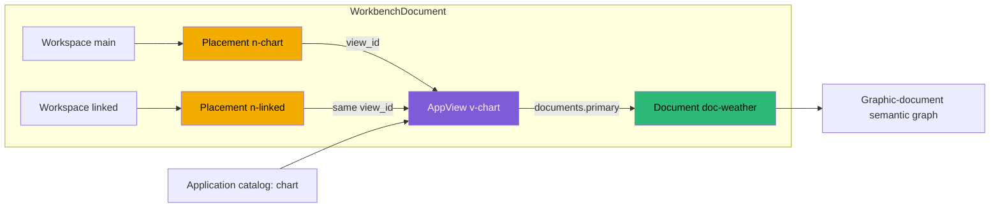

# PROJECT REPORT - PBUI Workbench Control Plane - Revisioned Authoring Across React, Go, and Agents

PBUI now has a server-owned workbench contract that can be read and modified by
the React application, Go services, command-line users, and coding agents. The
contract persists complete normalized workbench snapshots: workspace split
trees, reusable application views, named document bindings, and the analytical
documents themselves. Datadrop stores each snapshot under an owner-scoped
revision, validates every graph before committing it, and emits revision
invalidations to connected viewers. The standalone Hyperslop CLI exposes the
same operations as structured commands.

This work follows the object model established in [[PROJECT REPORT - PBUI Application Views - Logical Views, Linked Placements, and the Launcher Foundation]].
That earlier change separated a logical application view from the tile
placements that display it. The control-plane work makes that distinction
durable across processes. A second browser and an agent now agree that a linked
duplicate is another placement of one view, while an independent duplicate is a
new view that may retain or replace the source view's document bindings.

The implementation spans three ready-for-review pull requests:

- [PBUI #3](https://github.com/hyperslop-systems/pbui/pull/3) defines the
  generated protocol, shared Go invariants, frontend codec, and remote authoring
  controller.
- [hyperslop-cli #3](https://github.com/hyperslop-systems/hyperslop-cli/pull/3)
  adds query, mutation, deletion, and revision-streaming commands.
- [go-go-datadrop #11](https://github.com/go-go-golems/go-go-datadrop/pull/11)
  adds authenticated storage, HTTP and SSE endpoints, application-specific
  validation, auditing, and the shared command group.

> [!summary]
> - The first release uses complete owner-scoped snapshots, optimistic revision preconditions, durable idempotency, and SSE invalidation. It does not use a CRDT.
> - Protobuf defines the shared structural protocol and generates Go and TypeScript code. Semantic graph validation remains handwritten because protobuf cannot express cross-reference, catalog, or application-document invariants.
> - Browser edits remain ordinary Redux actions. A remote controller derives the managed workbench subgraph, saves it after a debounce, and preserves dirty local state when a competing revision appears.
> - Agent operations use typed atomic mutation batches. One batch can create document content, create or clone a view, and change placement geometry without exposing an invalid intermediate snapshot.
> - The final acceptance run exercised two real browser viewers, linked and independent duplication, placement-only removal, a dirty-browser conflict, and a live revision 8 invalidation.

## 1. The required capability is shared durable authoring

Before this work, PBUI could represent a sophisticated workbench inside one
browser. Redux held document and layout state, local persistence could restore
that state, and portable bundles could carry it between installations. None of
those mechanisms gave an agent a stable way to set up a workspace containing a
specific set of graphs. They also did not establish a concurrency rule between
two browser tabs.

The missing capability was not a generic event system. It was a narrower set of
operations over an already defined state graph:

- Read the current workbench.
- Create a complete workbench containing actual analytical documents.
- Replace the complete snapshot when a known revision is still current.
- Apply common typed mutations atomically.
- Delete a workbench conditionally.
- Notify connected viewers that a newer authoritative revision exists.

The design initially examined CRDTs because multi-tab and eventual multi-user
editing appear to be collaboration problems. The current requirement is more
specific. There is one server, one owner scope, and short edits initiated by a
browser or agent. Conflicts may be surfaced rather than merged automatically.
Under those conditions, centralized revisions preserve all required behavior
with fewer representations and fewer failure modes.

| Requirement | Revisioned snapshot | CRDT document |
|---|---:|---:|
| One user and one browser | Direct | Direct |
| One user and several tabs | Detects conflict and refetches | Merges concurrent operations |
| Agent configures a complete view | One conditional request | Requires CRDT operation encoding |
| Go implementation | Native SQL and protobuf | Requires a compatible CRDT runtime or bridge |
| Offline independent editing | Conflicts on reconnection | Can merge when operations commute |
| Current requirement | Sufficient | Not required |

The decision does not prevent later CRDT work. It establishes a durable
`WorkbenchDocument` and explicit identities first. A future collaboration
engine can produce validated snapshots at the same server boundary. It should
be introduced only if offline multi-master editing or automatic concurrent
merging becomes a measured requirement.

## 2. The workbench is a normalized graph

A workbench snapshot contains workspaces, views, and documents. Workspace trees
own geometry. Leaves point to reusable views. Views point to documents through
named bindings. Documents own domain content.



This structure gives linked and independent operations precise meanings.

```text
linked duplicate:
    create placement n2
    n2.view_id = existing view v1

independent duplicate:
    clone view v1 as v2
    create placement n2
    n2.view_id = v2
```

An independent duplicate does not necessarily clone the underlying document.
It creates a new view. That view can continue to bind the original document or
can be rebound to a new document in the same mutation batch. The distinction
matters because view-local state and document content have different sharing
semantics.

The protobuf schema states the outer graph directly:

```protobuf
message WorkbenchDocument {
  string format = 1;
  uint32 schema_version = 2;
  string id = 3;
  string name = 4;
  repeated Workspace workspaces = 5;
  map<string, AppView> views = 6;
  repeated string view_order = 7;
  map<string, DocumentPayload> documents = 8;
}

message AppView {
  string id = 1;
  string app_id = 2;
  map<string, string> documents = 3;
  optional string title = 4;
}
```

Named document bindings are deliberate. The current chart applications use
`primary`, but the representation does not assume every application consumes
exactly one document. A later comparison view can bind `left` and `right`
without changing workspace or placement identity.

## 3. Protobuf supplies structure, not domain correctness

The protocol is authored at
`pbui/proto/hyperslop/pbui/workbench/v1/workbench.proto`. Buf generates Go
messages under `gen/go` and TypeScript messages in the
`@hyperslop-systems/workbench-protocol` workspace package. HTTP continues to use
JSON, and SSE continues to use text framing. The generated messages determine
the JSON field names, optional-field presence, mutation union, and unsigned
revision representation.

The schema registry was intentionally omitted. The current protocol has one
canonical private repository, generated source is checked in, and consumers pin
that repository through normal Go and pnpm dependencies. CI runs:

```text
buf lint
buf generate
git diff --exit-code
```

Once `main` contains the first protobuf baseline, CI also performs a breaking
change comparison. The first version of that check ran unconditionally and
failed because the target branch had no `proto` directory. The corrected gate
skips only the missing-baseline case. Subsequent protocol changes have a real
schema image to compare.

Generated types cannot prove that the graph is usable. The shared Go validator
therefore checks:

- identifier presence and map-key agreement;
- workspace, view, node, and document uniqueness;
- placement references to existing views;
- view bindings to existing documents;
- exact `view_order` enumeration;
- split directions, ratios, depth, and node counts;
- application catalog and singleton rules;
- document format and schema version;
- resource limits and credential-shaped content.

Datadrop adds the application-specific validator for
`datadrop.gog.document`. It validates source declarations, dataset and stream
references, transform inputs, transform cycles, expressions, root views,
encodings, analysis definitions, scales, and reference lines. This boundary
was strengthened after a browser test found that an outer-shape check accepted
a document that later failed during frontend relation traversal.

The resulting rule is strict:

```text
accepted by server
    implies protobuf structure is valid
    implies normalized workbench references are valid
    implies application ID and bindings are valid
    implies document semantic graph is traversable
```

This does not mean every backend validates every rendering detail. It means the
backend rejects persisted state that violates the stable domain invariants the
frontend requires to load the document safely.

## 4. Typed mutation batches preserve atomic graph transitions

Complete snapshot replacement is the general browser persistence mechanism.
Agents also need stable operations that do not require downloading, editing,
and replacing unrelated state. The protocol therefore defines fifteen typed
mutation cases:

- workbench rename;
- workspace create, rename, and delete;
- document put and delete;
- view create, configure, clone, delete, and close;
- placement replace, split, and close;
- split resize.

The `Mutation` message uses a protobuf `oneof`, so generated Go and TypeScript
code agree on the discriminator and body shape. Optional view titles preserve
the difference between no change, set title, and clear title.

PBUI applies a batch by cloning the current document, applying every mutation,
and validating the complete result once:

```go
func ApplyMutations(
    ctx context.Context,
    input *Document,
    mutations []*Mutation,
    deps Dependencies,
    limits Limits,
) (*Document, error) {
    output := Clone(input)
    for index, mutation := range mutations {
        if mutation == nil || mutation.Body == nil {
            return nil, invalid("invalid_mutation", ...)
        }
        if err := applyMutation(output, mutation); err != nil {
            return nil, errors.Wrapf(err, "mutation %d", index)
        }
    }
    if err := Validate(ctx, output, deps, limits); err != nil {
        return nil, err
    }
    return output, nil
}
```

The clone prevents a rejected batch from modifying the caller's in-memory
snapshot. Final validation permits intermediate references inside the batch.
For example, an agent can put a document, create a view that binds it, and split
a new placement for that view. Validating after each individual operation would
reject the useful batch ordering or force the protocol to expose partially
constructed objects.

This is the batch shape for an independent graph view:

```json
{
  "mutations": [
    {
      "documentPut": {
        "document": {
          "id": "doc-agent",
          "format": "datadrop.gog.document",
          "schemaVersion": 1,
          "body": {}
        }
      }
    },
    {
      "viewClone": {
        "sourceViewId": "view-chart",
        "newViewId": "view-agent"
      }
    },
    {
      "viewConfigure": {
        "viewId": "view-agent",
        "replaceDocuments": {
          "values": { "primary": "doc-agent" }
        }
      }
    },
    {
      "placementSplit": {
        "workspaceId": "main",
        "placementId": "chart-placement",
        "direction": "DIRECTION_ROW",
        "ratio": 0.5,
        "splitId": "split-agent",
        "newPlacement": {
          "id": "agent-placement",
          "leaf": { "viewId": "view-agent" }
        },
        "place": "PLACEMENT_POSITION_AFTER"
      }
    }
  ]
}
```

The actual document body must satisfy the semantic graphic validator; the empty
body above shows only the structural sequence.

## 5. Persistence is owner-scoped and revisioned

Datadrop stores the complete canonical protobuf JSON snapshot in SQLite. The
database identity is the pair `(owner_id, id)`, not the workbench ID alone:

```sql
CREATE TABLE workbenches (
    id             TEXT NOT NULL,
    owner_id       TEXT NOT NULL REFERENCES users(id) ON DELETE CASCADE,
    revision       INTEGER NOT NULL CHECK (revision > 0),
    state          TEXT NOT NULL,
    created_at     TEXT NOT NULL,
    updated_at     TEXT NOT NULL,
    PRIMARY KEY(owner_id, id)
);

CREATE TABLE workbench_requests (
    owner_id     TEXT NOT NULL,
    workbench_id TEXT NOT NULL,
    request_id   TEXT NOT NULL,
    request_hash TEXT NOT NULL,
    revision     INTEGER NOT NULL,
    response     TEXT NOT NULL,
    created_at   TEXT NOT NULL,
    PRIMARY KEY(owner_id, workbench_id, request_id),
    FOREIGN KEY(owner_id, workbench_id)
      REFERENCES workbenches(owner_id, id) ON DELETE CASCADE
);
```

The first implementation added owner predicates to queries but left the
declared primary key and request foreign key global. That would have prevented
two users from creating the same ordinary name such as `default`, and
idempotency replay could have crossed owner boundaries. The migration was
corrected directly because this schema had no released users. The in-memory SSE
topic was corrected at the same time; notification isolation is an
authorization property even when an event contains only a revision.

Every write after creation carries an expected revision. The HTTP boundary uses
a strong ETag-compatible precondition:

```text
If-Match: "workbench-{workbench-id}-{revision}"
```

The store updates only when both owner identity and revision match. Under a
race, one transaction advances the revision and the other receives
`workbench_revision_conflict`. A concurrent compare-and-swap test proves that
there is one winner rather than merely testing the conflict branch with
sequential calls.

Idempotency solves a different problem. A client may lose the response after
the server commits, then retry the same request. `Idempotency-Key` is stored
with a hash of the canonical request and the exact response. Reusing the key
with the same body replays the result. Reusing it with a different body is
rejected. Records older than seven days are pruned opportunistically so the
table remains bounded without adding a scheduler.

Snapshot update, idempotency result, and audit record share one transaction:

```text
BEGIN
    load owner-scoped current revision
    compare expected revision
    check or reserve idempotency request
    update complete snapshot to revision + 1
    record replayable response
    insert attributed audit record
COMMIT
publish owner-scoped revision invalidation
```

The publish occurs after commit. A forced audit insertion failure test proves
that the snapshot is rolled back. This makes the audit guarantee
transactional, not best-effort.

## 6. HTTP separates authorization, validation, and storage

The Datadrop routes are:

| Method and path | Purpose | Scope |
|---|---|---|
| `GET /v1/workbenches` | List the owner's workbenches | `workbenches:read` |
| `POST /v1/workbenches` | Create revision 1 | `workbenches:write` |
| `GET /v1/workbenches/{id}` | Read the current snapshot | `workbenches:read` |
| `PUT /v1/workbenches/{id}` | Conditionally replace the snapshot | `workbenches:write` |
| `POST /v1/workbenches/{id}/mutate` | Conditionally apply a typed batch | `workbenches:write` |
| `DELETE /v1/workbenches/{id}` | Conditionally delete | `workbenches:write` |
| `GET /v1/workbenches/{id}/stream` | Stream revision invalidations | `workbenches:read` |

The mutation handler demonstrates the layer order:

```go
principal := authorize(workbenches:write)
expected := require If-Match
requestID := require Idempotency-Key
batch := decode strict protobuf JSON
current := store.GetWorkbench(principal.UserID, workbenchID)
updated := workbench.ApplyMutations(current.Workbench, batch, appDependencies)
resource := store.ReplaceWorkbench(
    principal.UserID, workbenchID, expected, updated, batch, requestID,
)
publish(principal.UserID, workbenchID, resource.Revision)
```

Strict protobuf JSON rejects unknown fields. Request bodies are bounded before
decoding. Resource and semantic limits reject inputs that are structurally
legal but operationally unsafe. The server returns the established Datadrop
problem response for invalid input, authorization failure, missing resources,
payload size, idempotency misuse, and revision conflict.

## 7. Browser authoring remains ordinary Redux

Remote editing does not introduce a second application state model. Datalab
applications continue to dispatch actions into `layout` and `world`. One shared
`remoteWorkbenchLoaded` action replaces both slices during the same root Redux
dispatch, so subscribers never observe new view bindings against old document
state.

`DatalabApp` selects persistence explicitly:

```tsx
<Workbench
  persistence={
    workbenchId
      ? { kind: "remote", workbenchId }
      : { kind: "local", key: WORKBENCH_KEY }
  }
/>
```

The remote controller in `useRemoteWorkbench.ts` has four responsibilities:

1. Decode a server snapshot and install its managed workspace, view, and
   document subgraph atomically.
2. Derive the current managed subgraph from Redux and compare its canonical
   fingerprint with the last applied snapshot.
3. Save dirty state after a 500 ms debounce using the current revision and a
   stable request ID for that fingerprint.
4. Subscribe to SSE and either refetch a clean browser or report a conflict in
   a dirty browser.

```mermaid
sequenceDiagram
    participant UI as React editor
    participant R as Redux
    participant C as useRemoteWorkbench
    participant API as Datadrop
    participant DB as SQLite

    UI->>R: dispatch document or layout action
    R-->>C: managed subgraph changed
    C->>C: fingerprint differs; dirty = true
    C->>API: PUT snapshot, If-Match rev 6, Idempotency-Key k
    API->>DB: validate and compare-and-swap
    DB-->>API: committed revision 7
    API-->>C: WorkbenchResource revision 7
    API-->>C: SSE workbench.updated revision 7
    C->>C: mark fingerprint applied
```

Revisions are protobuf `uint64`. JavaScript can represent only integers through
`2^53 - 1` exactly as `number`, while a protobuf revision may use the full
unsigned 64-bit range. The transport parser therefore retains `bigint` at the
protocol edge and projects cached RTK Query resources to decimal strings.
Redux never receives `bigint`, so its serializability guarantees remain intact.

The initial implementation put revisions into Redux as `bigint`. That was
correct numerically and wrong operationally: Redux Toolkit warned about
nonserializable state. Moving revision ownership into the controller and using
strings in API cache projections preserved both exactness and Redux policy.

## 8. SSE events invalidate; snapshots remain authoritative

The stream endpoint emits only workbench ID and revision:

```text
event: workbench.updated
id: 8
data: {"workbenchId":"workbench-acceptance","revision":"8"}
```

It does not carry a patch. The browser reconnects with `after={knownRevision}`.
The server immediately emits its durable current revision if it is newer, then
emits later commits and periodic keepalives.

Invalidation keeps one authoritative representation. A clean browser refetches
the complete snapshot. A dirty browser must not apply a newer snapshot because
doing so would destroy unsaved local work. It records:

```text
expected revision: revision from which local edits began
current revision: newer server revision from SSE or conflict response
detail: user-visible explanation
```

Automatic saving stops until the user reloads or retries. Reload discards the
local edit and fetches server state. Retry is appropriate only after the caller
has resolved the conflicting intent. The first version does not attempt a
three-way structural merge.

This policy was tested with two real browser tabs. One tab submitted a local
inline title edit and became dirty. An agent committed a competing title at the
same base revision. The clean tab refetched the server title. The dirty tab
kept its local title and displayed the conflict. A subsequent CLI read proved
the server retained the agent-authored revision; the browser had not
overwritten it.

## 9. The CLI is the agent control surface

The reusable command group lives in Hyperslop CLI and is registered by both the
standalone `hyperslop` binary and Datadrop's administration binary.

```text
hyperslop ui list
hyperslop ui get WORKBENCH
hyperslop ui create --file workbench.json
hyperslop ui replace WORKBENCH --revision N --file workbench.json
hyperslop ui mutate WORKBENCH --revision N --file mutations.json
hyperslop ui delete WORKBENCH --revision N
hyperslop ui stream WORKBENCH --after N
```

Each command uses Glazed structured output. Resource revisions are emitted as
decimal strings. Mutating commands accept generated protobuf JSON from a file
or standard input, forward the revision precondition, and generate an
idempotency key when the caller does not provide one.

The stream command defaults to JSONL because it is unbounded:

```json
{"revision":"8","workbench_id":"workbench-acceptance"}
```

The CLI stream currently exits if its underlying SSE connection ends. Browser
streaming reconnects because an open workbench is expected to remain live
through transient transport failures. Automatic CLI reconnection remains a
future operational requirement rather than additional first-version machinery.

The Datadrop dependency pin matters. Registering an imported command group does
not make newly added verbs appear until the server repository pins the commit
that contains them. Datadrop's complete command-surface test caught this
integration boundary: after the dependency upgrade, the test failed because
its explicit expected leaves did not yet include `ui stream`. Adding the new
leaf updated the declared binary contract.

## 10. Acceptance verified the distinctions that unit tests cannot

The implementation includes Go unit tests, TypeScript codec and controller
tests, HTTP tests, storage concurrency tests, generated-protocol checks, and a
real browser acceptance run. The browser run used separate tmux panes for the
Datadrop API, Vite frontend, and CLI stream against a fresh SQLite database.

The workbench advanced through eight revisions:

1. Create a workbench with an initial launcher.
2. Atomically add a graphic document, chart and table views, a split main
   workspace, and a linked workspace.
3. Rename the linked chart view; both placements in both browsers update.
4. Close the linked workspace placement; the main placement and shared view
   remain.
5. Clone a view, add a distinct document and binding, and split an independent
   placement; original and duplicate render different marks.
6. Commit an ordinary agent title after the first attempted browser conflict
   setup failed to create dirty state.
7. Repeat with a submitted local edit; clean and dirty tabs follow their
   respective refetch and conflict policies.
8. Start `ui stream --after 7`, commit one mutation, and observe the exact
   revision 8 JSONL row.

The failed conflict setup is relevant. Opening the inline rename editor did not
change Redux state. The first agent write therefore committed normally. The
scenario was repeated after submitting the local edit, which established the
dirty fingerprint and exercised the actual conflict branch. A visible form is
not evidence of durable state.

The isolated database did not contain the production datasets referenced by
the graphic fixture, so the browser logged expected source `404` responses.
Those errors did not invalidate the layout, synchronization, placement, or
conflict assertions. They do identify a separate frontend requirement: remote
source failures should have a deliberate tile state and should not be confused
with workbench synchronization errors.

## 11. Verification and current status

The final broad verification set was:

```text
PBUI
  go test ./...                                      PASS
  pnpm test                                          PASS (26 tests)
  pnpm typecheck                                     PASS
  pnpm build                                         PASS
  buf lint                                           PASS
  buf generate && git diff --exit-code               PASS

hyperslop-cli
  GOWORK=off go test ./...                           PASS
  GOWORK=off golangci-lint run -v                    PASS (0 issues)

go-go-datadrop
  GOWORK=off go test ./...                           PASS
  make lint                                          PASS (0 issues)
```

Additional evidence covers every generated mutation kind, the normalized graph
validation matrix, same workbench IDs owned by different users, strict unknown
field and body size handling, idempotency expiry, audit rollback, a concurrent
CAS race, and two subscribers receiving one committed revision.

The implementation heads are:

| Repository | Commit | Pull request |
|---|---|---|
| PBUI | `18f1684` | [#3](https://github.com/hyperslop-systems/pbui/pull/3) |
| hyperslop-cli | `2e43899` | [#3](https://github.com/hyperslop-systems/hyperslop-cli/pull/3) |
| go-go-datadrop | `4de0f53` | [#11](https://github.com/go-go-golems/go-go-datadrop/pull/11) |

DATADROP-18 is complete. The CRDT evidence gate remains deliberately open as a
future conditional task, not as unfinished first-release implementation.

## 12. How to extend the system

The next useful work should preserve the current boundaries.

### Add editing support to another application

An application should select its bound view or document and dispatch ordinary
serializable Redux actions. The remote controller will include that state in
the next snapshot. A new application ID must also be allowed by Datadrop's
catalog. A new document format requires matching TypeScript and Go semantic
validators. The repository playbook is:

`pbui/docs/playbooks/adding-editing-support-to-a-pbui-application.md`

### Add an agent operation

Add a generated protobuf mutation when the operation is reusable and must be
atomic. Implement it in the shared Go mutation engine, validate the final graph,
and add it to the every-mutation-kind test. Do not introduce a handwritten
discriminator beside the generated `oneof`.

### Add richer conflict handling

The next pragmatic improvement is not a CRDT. It is a user-visible comparison
between the local dirty snapshot and the newer server snapshot, followed by an
explicit keep-local, use-server, or manually reconcile decision. The API
already supplies the two revisions needed to frame that operation.

### Evaluate a CRDT only with evidence

Run the deferred evidence gate if the product requires edits made offline in
several replicas to merge automatically, or if concurrent multi-user editing
must converge without human conflict resolution. Evaluate the actual normalized
workbench and document operations, not a generic text-editing benchmark. The
stable snapshot and validation boundary should remain the server's accepted
state even if a CRDT becomes the collaboration transport.

## Working rules

- Treat `(owner_id, workbench_id)` as the identity in storage, caches,
  idempotency, topics, metrics, and background work.
- Keep placement geometry, logical view state, and document content as separate
  identities.
- Validate every cross-reference and semantic document graph before commit.
- Keep `uint64` revisions exact at protocol boundaries and out of Redux as
  `bigint`.
- Publish invalidations only after the snapshot, replay record, and audit record
  commit together.
- Preserve dirty browser state when a newer revision arrives.
- Use complete replacement as the general persistence mechanism and typed
  mutation batches for reusable atomic agent operations.
- Do not add a compatibility adapter for an unpublished shape.
- Do not introduce a CRDT until the deferred evidence gate is triggered by a
  concrete collaboration requirement.

## Source trail

- Pragmatic design:
  `/home/manuel/workspaces/2026-07-28/split-datadrop/go-go-datadrop/ttmp/2026/07/30/DATADROP-18--pbui-collaborative-workspace-synchronization-service/design-doc/02-pragmatic-workspace-snapshot-and-agent-mutation-api.md`
- Twenty-step implementation diary:
  `/home/manuel/workspaces/2026-07-28/split-datadrop/go-go-datadrop/ttmp/2026/07/30/DATADROP-18--pbui-collaborative-workspace-synchronization-service/reference/01-investigation-diary.md`
- Shared schema and mutation engine:
  `pbui/proto/hyperslop/pbui/workbench/v1/workbench.proto`,
  `pbui/pkg/workbench/validate.go`, and `pbui/pkg/workbench/mutation.go`
- Frontend remote controller:
  `pbui/packages/datalab-ui/src/appkit/useRemoteWorkbench.ts`,
  `pbui/packages/datalab-ui/src/remote/codec.ts`, and
  `pbui/packages/datalab-ui/src/api/workbenchStream.ts`
- Datadrop persistence and transport:
  `go-go-datadrop/pkg/store/workbenches.go`,
  `go-go-datadrop/pkg/server/handlers_workbenches.go`, and
  `go-go-datadrop/pkg/workbenchapp/graphic_validation.go`
- Agent and operator client:
  `hyperslop-cli/pkg/client/workbenches.go` and
  `hyperslop-cli/pkg/cli/uicmd/`
- Related object-model report:
  [[PROJECT REPORT - PBUI Application Views - Logical Views, Linked Placements, and the Launcher Foundation]]
- Related plotting runtime:
  [[PROJECT REPORT - Hyperslop Plot v0.2 - From Grammar to Published PBUI Runtime]]
