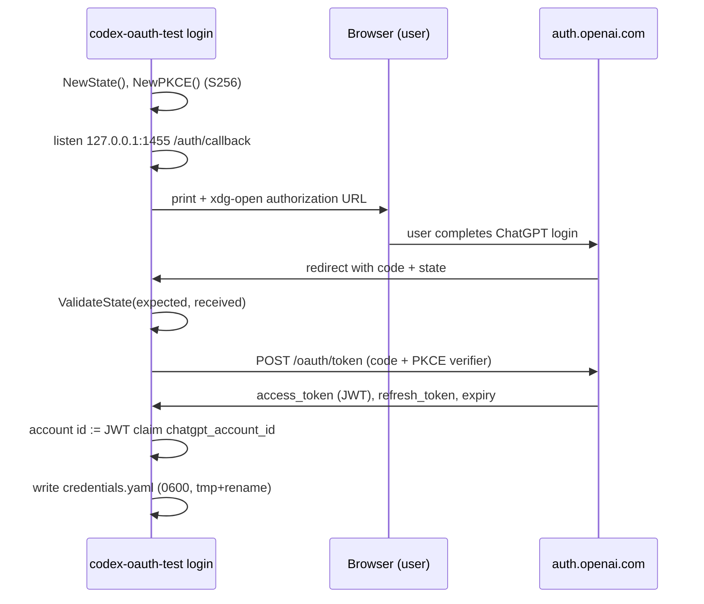
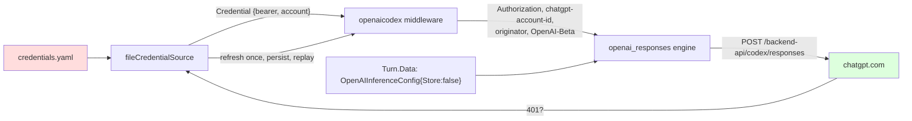

# Codex OAuth for gpt-5.6-luna: Subscription-Plan Inference Through Geppetto's OpenAI-Codex Transport

This report documents a one-day provider-engineering investigation inside the rag-ttc project: whether `gpt-5.6-luna`, the model assigned to statement extraction in the LLM-as-a-judge design (ticket RAG-TTC-JUDGE-001), can be served by the ChatGPT Codex subscription through OAuth rather than by a metered API key. The question was settled affirmatively with a self-contained smoke-test program, `scripts/codex-oauth-test/`, which performs the browser PKCE login against `auth.openai.com` and drives Geppetto's `openaicodex` request transport directly. The report records the protocol facts that had to be discovered empirically, the exact code path that works, the failures encountered on the way, and the consequences for the judge pipeline's provider layer.

> [!summary]
> - `gpt-5.6-luna` answers over the ChatGPT subscription through Geppetto's shipped `openaicodex` transport: 1.4–3.1 s per short request, genuine token accounting, and server-side model-name validation. No Geppetto changes were required.
> - Three protocol facts had to be discovered empirically: the OAuth client rejects the binary-embedded `api` scope with `invalid_scope`; the Codex backend requires an explicit `"store": false` in every Responses payload; and the ChatGPT account id is not configuration but a claim inside the access-token JWT.
> - The pinocchio OAuth profile layer cannot yet select this transport (no `api_type`, no account-id concept), so the smoke test bypasses profiles entirely; the remaining JUDGE-001 provider work is wiring, not protocol discovery.

## Why this project exists

The judge design in RAG-TTC-JUDGE-001 splits evaluation into two model roles: statement extraction on `gpt-5.6-luna` (an inexpensive OpenAI model comparable to gpt-5-nano) and verdict rendering on GLM 5.2. Judging a single answer-quality run of 148 queries × 3 arms produces on the order of a thousand small LLM calls, and every judged experiment repeats that cost. The user's ChatGPT Codex subscription already covers exactly this class of traffic; routing the statements model through it removes the metered-key cost for roughly half of every judged run.

The intern guide for the ticket (`design-doc/01-intern-guide-the-llm-as-a-judge-pipeline.md`, section 2.6) had documented the machinery but left one seam explicitly unverified. Geppetto ships a transport for the ChatGPT Codex backend (`pkg/steps/ai/providers/openaicodex`), and pinocchio ships OAuth-bearer profiles (`pinocchio.oauth@v1` extension, 0600 direct registries, `pinocchio auth login`), but nothing connects them: no profile `api_type` selects the Codex transport, and the OAuth profile schema has no field for the account id the transport requires. Section 2.6 therefore ended in a three-way fork to be settled by a smoke test:

1. OAuth-direct works — the subscription serves the model through the shipped transport, and the rest is plumbing.
2. The plan demands transport features that need upstream wiring in geppetto/pinocchio first.
3. Neither works soon enough — fall back to the metered-key composite profile.

The user then requested the deciding artifact directly: a self-contained test program in a `scripts/` directory with its own clean profiles file, using Geppetto, with the constraint that the program must not scavenge existing tokens (the user performs the browser login themselves). This report describes that program and what it proved. Outcome 1 won.

## Current project status

Working and committed on the rag-ttc branch `task/rag-ttc-tui-polish`:

- `scripts/codex-oauth-test/` — standalone Go module with `login`, `status`, and `query` subcommands (commit `b1d7626`).
- A completed real login: 10-day access token, 196-byte rotating refresh token, account id extracted from the token JWT, all stored in a gitignored 0600 `credentials.yaml`.
- Three verification probes: a hello query (3.06 s, 21 input / 16 output tokens), an arithmetic query answered correctly (1.39 s), and a deliberately wrong model name rejected by the server in 320 ms.
- Ticket bookkeeping: diary Step 1, a "SETTLED" addendum to guide section 2.6, and rewritten Provider-setup tasks (commit `832f662`).

Not yet done: wiring the proven path into rag-ttc's judge bundle construction, and the upstream decision (rag-ttc-side credential source versus a Geppetto/pinocchio `api_type` registration).

## Project shape

```
rag-ttc/scripts/codex-oauth-test/
├── main.go          # login / status / query; ~450 lines, all logic
├── profiles.yaml    # secret-free OAuth client config, pinocchio.oauth@v1 shape
├── credentials.yaml # token tuple; 0600; created by login; GITIGNORED
├── go.mod           # own module; geppetto pinned to rag-ttc's exact pseudo-version
├── go.work          # "use ." — defeats capture by the workspace-root go.work
├── .gitignore       # credentials.yaml + built binary
└── README.md        # constants provenance, usage, JUDGE-001 linkage
```

Two design rules shaped the file layout. First, secrets and configuration never share a file: `profiles.yaml` holds only the OAuth client constants (all public — the client id is a public PKCE client embedded in every Codex CLI installation) and is committed; the token tuple lives exclusively in `credentials.yaml`, which is created with mode 0600 and ignored by git. Second, the profiles file deliberately uses the `pinocchio.oauth@v1` extension shape even though no pinocchio code reads it here, so the file doubles as a worked template for the future real registry.

## The transport under test

Geppetto's `openaicodex` package (in `pkg/steps/ai/providers/openaicodex/codex.go` of the geppetto repository) is an adapter for the shared OpenAI Responses engine core, not an engine of its own. It contributes three things:

- **A fixed route.** `Route.Resolve` accepts only the canonical base URL `https://chatgpt.com/backend-api` — scheme, host, path, and absence of query/fragment/userinfo are all checked — and rewrites the path to `/backend-api/codex/responses`. A profile-configured URL therefore cannot redirect subscription credentials to an arbitrary host; a non-canonical target fails before any credential is even looked up (verified by the package's own tests).
- **A typed credential middleware.** The transport disables the core's ordinary bearer middleware and instead requires an `openaicodex.Source`, which returns a `Credential{BearerToken, AccountID}` pair. Per request it sets four headers: `Authorization: Bearer …`, `chatgpt-account-id`, `originator`, and `OpenAI-Beta: responses=experimental`.
- **A one-replay 401 protocol.** If the source also implements `UnauthorizedSource`, a pre-stream 401 triggers exactly one credential replacement and one replay; a second 401 fails the request.

The engine itself is the ordinary `openai_responses.NewEngine`, constructed with `WithRequestTransport(adapter)`; everything else about request building, streaming, and usage accounting is the shared Responses code path that rag-ttc already uses for its metered profiles. This is the central architectural point: the subscription path differs from the metered path only in transport and credential handling, so any success transfers directly to the judge harness.

## Implementation details

### Obtaining the OAuth constants without documentation

No public documentation states the OAuth parameters for the Codex login. The constants were recovered from the installed Codex CLI itself (`@openai/codex` 0.145.0). Two practical details mattered. `command -v codex` returns a pnpm shell shim, not the program; the native binary lives under pnpm's content store at `…/@openai+codex@0.145.0-linux-x64/…/vendor/x86_64-unknown-linux-musl/bin/codex`. Running `strings` over that binary and filtering yielded:

| Constant | Value |
|---|---|
| authorization endpoint | `https://auth.openai.com/oauth/authorize` |
| token endpoint | `https://auth.openai.com/oauth/token` |
| client id | `app_EMoamEEZ73f0CkXaXp7hrann` (public PKCE client, no secret) |
| redirect | `http://localhost:1455/auth/callback` |
| scope string | `openid profile email offline_access api` |
| originator header | `codex_cli_rs` |

The token files in `~/.codex/` were never read; the user's constraint was that the program performs its own login. This separation also produced a cleaner result: every constant above was validated live against the authorization server rather than inherited from another tool's state.

One embedded constant turned out to be wrong for this flow. The first authorization attempt bounced immediately with `invalid_scope`: "The OAuth 2.0 Client is not allowed to request scope 'api'." The `api` scope belongs to the CLI's other login mode, in which the ChatGPT login is exchanged for a platform API key against `api.openai.com`. The subscription path never touches that surface, so the working scope set is `openid profile email offline_access` — recorded as a comment in `profiles.yaml` precisely so that a future reader does not "correct" it back to match the binary. The general lesson: a string embedded in a binary documents what the program can send in some flow, not what every flow accepts; only the authorization server's response is authoritative.

### The login flow



The flow is standard authorization-code-with-PKCE, implemented with Geppetto's protocol client (`pkg/steps/ai/credentials/oauth`): `NewPKCE` produces the RFC 7636 verifier/challenge pair, `NewState`/`ValidateState` handle CSRF state, `AuthorizationURL` builds the request, and `ExchangeAuthorizationCode` performs the token POST. The program contributes only the local callback server and persistence. Because the client is public (no secret), possession of the redirect port plus PKCE is the entire client authentication story; the callback server binds `127.0.0.1:1455` and accepts the first state-valid callback, which is adequate for a local smoke tool but flagged in the diary as unsuitable for anything long-running without hardening.

The account id resolution deserves emphasis because it removes a schema question. Geppetto's exchange returns only `{AccessToken, RefreshToken, ExpiresAt}` — no id token is surfaced. But the ChatGPT access token is itself a JWT, and its payload carries the claim:

```json
"https://api.openai.com/auth": { "chatgpt_account_id": "a8ec8fbd-…" }
```

Decoding the JWT payload (base64url, no signature verification needed since the value is only echoed back to the issuing server as a header) yields the account id the transport must send as `chatgpt-account-id`. Consequently an OAuth profile schema does not strictly need an account-id field at all: a codex-aware credential source can derive it from the token it already holds. A `--account-id` override exists as a fallback for the case where the claim shape changes.

### The query path



The program's `fileCredentialSource` implements both `openaicodex.Source` and `UnauthorizedSource` over the stored file. Freshness is enforced at two points: before the request, a credential within 60 seconds of expiry is refreshed eagerly (Geppetto's `Credential.Usable(now, skew)`); during the request, a 401 triggers the transport's single refresh-and-replay, with the rotated tuple persisted before the replay so a crash cannot strand a consumed refresh token in memory only. Engine construction is the pattern from the package's own tests, and is exactly what the judge harness would reuse:

```go
transport, _ := openaicodex.RequestTransport(source,
    openaicodex.Options{Originator: "codex_cli_rs"})
engine, _ := openai_responses.NewEngine(&settings.InferenceSettings{
    API:  &settings.APISettings{BaseUrls: map[string]string{
        "open-responses-base-url": "https://chatgpt.com/backend-api"}},
    Chat: &settings.ChatSettings{Engine: &model},   // "gpt-5.6-luna"
    Client: &settings.ClientSettings{HTTPClient: &http.Client{}},
}, openai_responses.WithRequestTransport(transport))
```

### The store=false requirement

The first live query failed in 590 ms with `400 {"detail": "Store must be set to false"}`. The Responses API's `store` field controls server-side persistence of the response object (retrieval by id, chaining via `previous_response_id`). The subscription backend is stateless by policy and refuses rather than ignores: the payload must literally contain `"store": false`. Omission is not acceptance — Geppetto's request struct declares `Store *bool` with `omitempty`, so the default nil sends no field at all, which the backend also rejects.

Locating the knob was the one genuinely non-obvious step of the day, because `store` does not exist in `settings.InferenceSettings`. It is exclusively a per-turn override: the request builder calls `engine.ResolveOpenAIInferenceConfig(turn)`, which reads a typed value from `Turn.Data` under `KeyOpenAIInferenceConfig` and copies `Store` into the outgoing request. The fix is three lines at the call site:

```go
storeFalse := false
engine.KeyOpenAIInferenceConfig.Set(&turn.Data,
    engine.OpenAIInferenceConfig{Store: &storeFalse})
```

The design consequence for JUDGE-001 is stated plainly in the ticket: whatever component constructs judge turns owns this stamping, because forgetting it converts every request into an immediate 400. It also means no Geppetto modification was needed anywhere in this project — the per-turn override system already carried the required setting.

### The go.work capture failure

The first build failed with "main module (github.com/the-tree-center/rag-ttc) does not contain package …/scripts/codex-oauth-test": a `go.work` at the workspace root enumerates rag-ttc but not the new module, and Go workspace resolution walks upward from the working directory. The fix is a local `go.work` containing `use .` inside the module, which wins by proximity. This is worth remembering as a pattern for any self-contained tool embedded in a repository that participates in a Go workspace: the tool must carry its own workspace file or every consumer must remember `GOWORK=off`.

## Empirical results

All calls on 2026-07-31, after a real browser login by the user:

| Probe | Latency | Result |
|---|---|---|
| hello query | 3.06 s | "Hello! I'm ChatGPT, an AI language model." — 21 in / 16 out tokens |
| arithmetic (17×23) | 1.39 s | "391" — 19 in / 20 out tokens |
| fake model name | 320 ms | 400 "The 'gpt-5.6-luna-does-not-exist' model is not supported when using Codex with a ChatGPT account." |
| pre-fix store probe | 590 ms | 400 "Store must be set to false" |

Three observations. Latency for short prompts sits in the low seconds, comfortably inside the judge design's per-cell budget. Token accounting is present and plausible, which matters because token accounting — not response acceptance — is this project's standing method for verifying that a parameter actually took effect (a rule earned earlier in the chunk-lab campaign when a gateway silently ignored `reasoning_effort: "off"`). And the fake-model rejection is affirmative evidence, not merely error handling: the backend validates model names against the plan, so the passing runs are genuinely served `gpt-5.6-luna` rather than silently remapped to a default model. The access token carries a ~240-hour TTL, and the refresh token rotates on refresh; both facts are now recorded where the judge harness will need them.

## Consequences for the judge pipeline

The section-2.6 fork resolves to outcome 1, which converts the remaining provider work from research into plumbing with two viable placements:

- **Harness-side (near-term):** rag-ttc builds the statements bundle itself — a codex credential source (the `fileCredentialSource` logic, hardened), the `RequestTransport`/`NewEngine` construction above, and the `Store=false` stamp on every judge turn. No upstream changes; the `ttc-judge-statements` profile becomes a marker that selects this construction path.
- **Upstream (durable):** Geppetto/pinocchio gain an `api_type` that selects the `openaicodex` transport from profile YAML, and the `pinocchio.oauth@v1` schema either adds an account-id field or — better, given the JWT-claim finding — derives it. Then the ordinary profile machinery (`pinocchio auth login`, 0600 direct registries, `factory.WithBearerTokenSource`) serves the whole flow and the smoke program retires.

Both are recorded as tasks in RAG-TTC-JUDGE-001, along with the open token-storage decision (the smoke tool's `credentials.yaml` versus a `~/.config` location; never the repo profiles file). Three review flags stand in the diary: the callback server's trust-first-valid-callback behavior, the refresh-rotation persistence window in `CredentialAfterUnauthorized`, and the policy (not technical) question of whether third-party tooling should present a distinct `originator` value rather than `codex_cli_rs`.

## Important project docs

- Ticket: `rag-ttc/ttmp/2026/07/31/RAG-TTC-JUDGE-001--llm-as-a-judge-for-answer-quality-decomposed-faithfulness-and-relevance-scoring/` — intern guide (section 2.6 now carries the SETTLED addendum), diary Step 1, tasks.
- Program: `rag-ttc/scripts/codex-oauth-test/` (README documents constants provenance).
- Transport source: geppetto `pkg/steps/ai/providers/openaicodex/codex.go`; OAuth protocol client `pkg/steps/ai/credentials/oauth/`; per-turn overrides `pkg/inference/engine/inference_config.go`.
- Pinocchio OAuth layer (the not-yet-connected half): `pkg/oauthprofiles/` and `cmd/pinocchio/cmds/auth/`.
- Commits: `b1d7626` (program), `832f662` (ticket documentation).

## Open questions

- Does OpenAI's subscription policy require a distinct `originator` for non-Codex tooling, and does the answer change rate limits?
- Where do judge-run tokens durably live once this leaves the smoke tool — and should refresh be centralized so concurrent judge workers do not race the rotating refresh token?
- Should the upstream `api_type` land in geppetto (transport registration) or pinocchio (profile resolution), and which repository owns account-id derivation from the JWT claim?

## Related notes

- [[PROJ - RAG-TTC Chunk Lab Results - From BM25 Screening to the Hybrid Retrieval Reversal]] — the campaign whose judge phase this provider work serves.
- [[ARTICLE - RAG Evaluation and LLM Judges - Behavioral Benchmarks, Judged Metrics, and Judge Reliability]] — why the judge design needs two model families at all.
- [[ARTICLE - Measurement Discipline and LLM IO - Throughput, Batching, and Structured Output]] — the token-accounting verification rule applied here to the store and scope findings.
- [[geppetto]] — the framework whose transport and per-turn override system carried the entire path unmodified.
