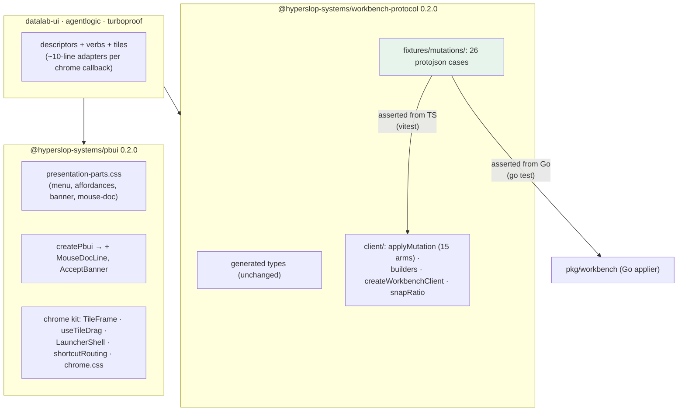

# PBUI Family Unification: Extracting the Chrome, the Parts CSS, and the Mutation Layer

Three products — datalab, agentlogic, and turboproof — are built on pbui's presentation system and are supposed to share one look, one window chrome, and one set of interaction mechanics. Until this cycle they achieved that by carrying private copies of the same code: the same stylesheet block transcribed three times, the same drag hit-test written three times with two different geometries, the same workbench mutation layer copied file for file. This note documents PBUI-UNIFY-001, the ticket that turned the sharing from a discipline into an import — designed in the morning, implemented across four repositories the same day by an orchestrator and five subagents, and closed with every product migrated, every suite green, and the copies deleted.

Two earlier notes carry the background: [[PROJ - Turboproof - A pbui Proof Workbench for Lean 4]] (the family architecture) and [[PROJ - Turboproof Tier A - The Real Editor, LSP-Native Tiles, and the Chrome Parity Campaign]], whose closing section — the eleven-row duplication inventory written for exactly this hand-off — became the ticket's design input. The incident that forced the ticket is analyzed there as well; its short form opens the next section, because every design decision in this cycle traces back to it.

> [!summary]
> - pbui 0.2.0 ships the presentation-parts stylesheet (the block whose absence once rendered a product's object menu invisibly), two instance chrome strips returned from `createPbui`, and a document-model-agnostic chrome kit: `TileFrame`, `useTileDrag`, `LauncherShell`, `shortcutRouting`.
> - workbench-protocol 0.2.0 ships a `./client` layer — the TypeScript applier and verb builders — pinned to the Go applier by a 26-fixture parity corpus asserted from both languages. The corpus found four real semantic divergences on day one; all were resolved toward the server.
> - All three products adopted the shared modules and deleted their copies: roughly 950 lines of store code and 365 lines of transcribed CSS removed, with zero product test edits required — a fact that is itself a finding about where applier semantics were (not) being pinned.
> - The cycle doubles as a case study in multi-agent implementation: five subagents with strict no-commit rules in shared repositories, per-agent diaries, and a geometry-measuring acceptance rule inherited from the incident.

## Why this project exists

On the morning of this same day, turboproof shipped with pbui's presentation system fully wired and fully invisible. pbui's components emit *structure* — `data-part` attributes — and each product styles those hooks itself; turboproof had never transcribed the styling block, so its object menu had no `position: fixed` rule and rendered in normal document flow after the footer. It opened on every click, at the bottom of the page, unseen. Every mechanical verification passed, because accessibility trees and synthetic clicks do not measure geometry; a user's visual report was the only diagnostic that worked.

The incident generalizes. A required private copy is a dependency the build system cannot see: forgetting it does not fail compilation, and drifting it does not fail review. The inventory in the Tier A note found eleven duplicated capabilities across the three products, including one demonstrably drifted (the drag-zone geometry: datalab classified drop zones with a band of 30 % of the smaller tile dimension capped at 110 px, while agentlogic and turboproof used fixed 25 % quarters) and one demonstrably fatal when absent. The unification's premise: everything that is a pure function of pbui's own state, or of the workbench protocol's document type, belongs in the packages this repository publishes, and the products keep only what genuinely differs — descriptors, verbs, and tiles.

## The target architecture

The design (ticket PBUI-UNIFY-001, `pbui/ttmp/2026/07/31/`) sorts the eleven rows into three homes and six decision records (DR-U1 through DR-U6). The structural constraint that shaped the API more than any other: agentlogic and turboproof hold the protocol's `WorkbenchDocument` directly in Redux, while datalab still runs a private layout store. The chrome kit therefore never sees a document — components take callbacks and DOM ids (DR-U3) — so datalab adopts the chrome now and the document layer whenever its own migration lands.



The highlighted box is the load-bearing novelty. Both appliers — TypeScript and Go — must accept and reject the same mutations with the same results, or the products' apply-then-queue outbox contract breaks (a mutation the client applies and the server rejects leaves the local document diverged until the next rebase). Before this cycle that equivalence was a hope maintained by hand in three places; now it is one fixture directory read by both test suites:

```
fixtures/mutations/<name>.json = { document, mutation, expected }   # protojson
                                 or { document, mutation, error: true, errorCode }

vitest:  expect(toJson(apply(document, mutation))).toEqual(expected)
go test: got := applyMutation(doc, m); assert proto.Equal(got, expected)
```

## What the parity corpus found on day one

The corpus was generated deterministically through the TypeScript port and then verified against Go — and the verification failed four ways, which is the strongest possible argument for its existence. In each case the products' local appliers had silently diverged from the server, and in each case the shared layer adopted the Go semantics, because the server is authoritative:

| Divergence | Products' copies | Go applier (adopted) |
|---|---|---|
| Name and title handling | stored verbatim | trims whitespace (workbench/workspace names, viewConfigure titles and app ids) |
| `PLACEMENT_POSITION_UNSPECIFIED` | silently treated as AFTER | rejected as `invalid_position` |
| `documentDelete` | deleted unconditionally | validates unknown-document and in-use-by-binding |
| `documentPut` | stored the payload by reference | clones it |

The instructive coda arrived during adoption: swapping the appliers out from under both protocol products required **zero test edits**. No product test relied on any of the four behaviors — meaning no product test pinned applier semantics at all. The parity corpus is now the only thing pinning them, which is exactly where that pinning belongs, but the observation is worth keeping: a client-side mirror of server logic can drift for a long time before any product-level signal fires.

## Implementation details

### Phase 1: the stylesheet and the instance strips

The package's static CSS ships from `public/` (vite copies it into `dist/` untouched — discovered by elimination, since no build step references the existing `components.css`). `presentation-parts.css` carries the hover affordance (dotted outline plus selected wash), the acceptable-state pulse with its reduced-motion fallback (outline AND animation, never animation alone — the outline must carry the whole meaning when the pulse is removed), and the object menu block whose `position: fixed; z-index: 100` is the incident's regression test, asserted by a package-level test that reads the file and checks the rule. Every value reads a `--pbui-*` token *with a fallback*, because pbui defines no token values.

`MouseDocLine` and `AcceptBanner` are pure functions of pbui instance state, so they are returned from `createPbui` exactly as `ObjectMenu` is — closing over the instance's `usePbui`, which is what a standalone export could not do. The banner keeps its escape-surface participation: a pending accept must not abort because a dialog opened above it took an Escape meant for the dialog.

### Phase 2: the chrome kit

Four modules under `src/chrome/`, all store-free:

- **`useTileDrag`** is datalab's `useDrag` with the Redux dispatch replaced by `onSwap`/`onDock` callbacks. The module-level tile registry (synchronous reads for a per-pointer-move hit test; `isConnected` checked at hit-test time so a closed tile cannot become a phantom drop target) and the banded `zoneFor` survive verbatim. DR-U4 makes the banded geometry the family standard; the quarters variants are gone, and the feel change in two products is a recorded, deliberate delta.
- **`TileFrame` / `DropZoneOverlay`**: tone-as-title-bar (datadrop's DR-26), a grip slot, a *title slot* — the product wraps its own `<tile>` presentation there, which keeps the chrome buttons and the object menu two doors to the same verbs — and the labeled overlay that names a drag's outcome before the release. The overlay became declarative everywhere: the hook reports `zone` on the target tile and the target renders its own overlay; turboproof's imperative classList painting had existed only because it lacked the shared registry.
- **`LauncherShell`** extracts the modal, the combobox input, and the keyboard loop from datalab's `LauncherDialog`, leaving the rows model and the choose() policy in each product (DR-U6). The two invariants are documented at the extraction point so the next product reads them instead of rediscovering them: Escape has exactly one owner (the `Dialog`; a second escape-surface registration makes Escape close nothing), and a global new view never destroys a working tile (`splitDirectionFor` splits the active tile along its longer *rendered* axis — the DOM knows pixels; layout trees know only ratios).
- **`shortcutRouting`** moved verbatim with its pure tests: `isModKey` (Meta on Apple platforms, Control elsewhere), editable-target detection, and the transient-surface blocking table.

One portability lesson: `CSS.escape` does not exist under the package's jsdom, and selectors built from product-minted row ids are a whole class of latent bugs; `getElementById` sidesteps them.

### Phase 3: the client layer

`workbench-protocol/client` splits along config dependence. Config-independent pieces are plain exports: the applier (all fifteen mutation arms — the products' copies implemented nine), the tree queries, `splitPlacement`/`closePlacement`/`swapPlacements`/`dockPlacement`/`resizeSplit`, `snapRatio`. Product-flavored verbs close over a `ClientConfig`:

```ts
const client = createWorkbenchClient({
  sourceBinding: "source",          // turboproof; agentlogic uses "transcript"
  launcherAppId: "launcher",
  isBindableDocument: (payload) => payload.format === LEAN_SOURCE_FORMAT,
});
// client.replaceApp / linkViewIntoPlacement / splitWithApp / defaultSourceDocumentId
```

`defaultSourceDocumentId` — follow the document existing views already bind, else the first bindable document — is the generalization of turboproof's unbound-launcher-tile fix, which means the whole family now inherits that repair through one builder.

### Phase 4: the adoptions

| Product | What moved | Deleted | Gates |
|---|---|---|---|
| datalab-ui | parts CSS, instance strips, `useTileDrag` + overlay, shortcutRouting | `pbui.module.css` 183→14 lines (the survivor: `menu-target`, a part only datalab emits), `useDrag.ts`, local strips | typecheck, 509/509, build |
| turboproof | all of the above plus `TileFrame`, `LauncherShell`, Mod+K routing, and the full client layer | 257 CSS lines; `store/workbench.ts` 688→272 | typecheck, 45/45, token check, build, go build, **measured geometry** |
| agentlogic | `TileFrame` + `useTileDrag`, parts CSS, client layer | 108 CSS lines; `store/workbench.ts` 512→169 | typecheck, 105/1-skipped, builds, go test |

Two field corrections came back from the adopters and are worth preserving, because they show the value of instructing agents to *study before applying the map*: agentlogic has no `createPbui` runtime at all yet (the inventory's rows for its presentation CSS overstated a pre-migration state; the parts CSS is imported for the future), and its source binding is `"transcript"` with format `agentlogic.transcript-ref` — verified in its Go catalog, not assumed from the family convention.

The datalab deferral is deliberate and recorded: its `Tile` and `LauncherDialog` are the policy-rich references the kit was extracted *from* (inline rename in the title slot, active-placement capture props, the query language), and rewriting the reference implementation for cosmetic sameness is churn without risk reduction. When it adopts, `TileFrame` will need a `rootProps` pass-through — a limitation already noted twice.

### The closing measurement

The final smoke ran on the adopted stack end to end: a split performed through the shared `TileFrame` button flowed through the shared TypeScript applier, synced to the Go applier's server (7→8 tiles, sync green), and the object menu measured `position: fixed`, z-index 100, in-viewport at the pointer. Bundle cost where tracked: agentlogic's committed bundle grew 7.1 kB of JS and 4.0 kB of CSS — the shared surface is larger than any single product's copy, because it ships all fifteen mutation arms and the launcher styles whether or not the product uses them yet.

## The method: five subagents, one orchestrator

The cycle is also a data point on multi-agent implementation. The orchestrator implemented Phases 1–2 and the datalab adoption; subagents ran Phase 3 and the four product adoptions, two at a time. Three rules made it work without a single cross-repo incident:

- **Shared repositories are single-writer.** Agents working inside the pbui repository never touched git; the orchestrator reviewed and committed their work. Agents in product repositories committed freely — the repositories were theirs for the duration.
- **Every worker keeps a diary.** Six diaries in the ticket's `reference/` directory record each worker's failures verbatim (the orchestrator's includes the `CSS.escape` and vitest-URL-scheme traps; the Phase-3 agent's records each parity failure as it was found). The diaries are where the field corrections surfaced.
- **Acceptance asserts geometry, not presence.** The rule the incident taught is now procedural: turboproof's adoption was accepted only after measuring the menu's computed position against the contextmenu coordinates (Δ=0) and the overlay's rectangle against the target's half. Presence in the accessibility tree proved nothing last time; it is not accepted as proof now.

## Current project status

All eleven ticket tasks are checked and `docmgr doctor` is green. pbui stands at 0.2.0 (49 package tests) and workbench-protocol at 0.2.0 (43 TypeScript tests; 26/26 Go parity subtests), both unpublished; the two product repositories reference them by temporary `file:` paths, flagged in the adoption commit messages. Twelve commits in pbui, four in turboproof, three in agentlogic, all local to their working branches.

## Open questions

- When datalab migrates its layout store onto the protocol document, should the migration adopt `client/` from day one? (It should — that is half the point — but the migration is its own project.)
- The drag registry is module-level and therefore bundle-global; two independent workbench stores on one page would share it. Placement ids are unique per store today; an instance scope is the escape hatch if that ever changes.
- Should the fixture corpus gain batch-mutation cases? Single mutations are covered from both languages; batches only from TypeScript.

## Near-term next steps

- Publish pbui 0.2.0 and workbench-protocol 0.2.0 through the CONFIRM_LATEST-gated workflows, then flip the three `file:` dependencies to pinned registry versions.
- Add the CI regenerate-and-diff check for `fixtures/mutations/` (the generator is deterministic; drift should fail a build, not a code review).
- `rootProps` on `TileFrame` when its third consumer needs root attributes.

## Project working rule

When the same block of code exists in more than one repository, treat the copies as one system with an invisible dependency edge, and ask what fails — and how loudly — when one copy is missing or stale. If the answer is "nothing fails; the product silently degrades," the extraction is not refactoring hygiene, it is a correctness fix, and it should be prioritized like one. The four applier divergences and the invisible menu were both exactly this: not bugs anyone wrote, but bugs the architecture of copies guaranteed someone would eventually own.
