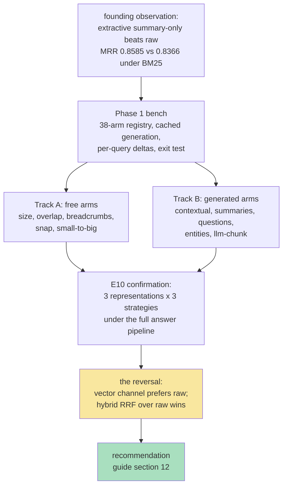

# RAG-TTC Chunk Lab Results: From BM25 Screening to the Hybrid Retrieval Reversal

This report closes the measurement campaign opened in [[PROJ - RAG-TTC Chunk Lab - Chunking and Representation Experiments on a Free LLM Gateway]]. That note described the design and the bench mid-flight; this one records what the completed campaign found: twenty-one measured configurations across three tracks, six operational incidents that each produced a durable engineering rule, and a final result that partially reverses the campaign's own founding observation. Ticket: `RAG-TTC-CHUNKLAB-001` (with the confirmation infrastructure landing under the same ticket in `cmd/rag-ttc/cmds/experiments/answerquality/`). Every number below cites its run directory.

> [!summary]
> 1. The founding observation — condensed representations outrank raw text — survived screening across nine generated variants, but E10's confirmation showed it is a *lexical-channel* truth: the vector channel prefers raw text, and hybrid vector+BM25 fusion over raw representations dominates every configuration measured (MRR 0.9221, Hit@10 0.9792, run `29af511fe4e7`).
> 2. The recommendation, run-cited: hybrid RRF strategy; raw representations for the embedded channel; summaries only for embedding-free deployments; chunk size 1,600–2,400 runes with zero overlap.
> 3. Generation economics moved twice by an order of magnitude during the campaign — once by measurement (batching plus disabling hidden reasoning, ~16×), once by diagnosis (a silently ignored `reasoning_effort: "off"`, ~20×) — and both corrections came from refusing to accept an unexplained number.
> 4. The screening bench, the confirmation harness, and the production bundle builder share one generation cache keyed on semantic identity; the entire campaign is replayable at zero provider cost.

## Why this report exists

The campaign's mid-flight note recorded the design; designs are cheap and results are not. This report exists because three things are now true that were not true then: every experiment in the menu has a number; the numbers compose into a defensible production recommendation; and the operational incidents along the way — a gateway death, two silently ignored parameters, a latent identity collision — generalize beyond this project and deserve their consolidated statement. A reader who wants the system's architecture should read the earlier note and the nine companion articles; a reader who wants what the system *found* should read this one.

## Current project status

Complete, with recorded open threads. Tracks A (free chunking experiments), B (generated representations), and the E10 confirmation are done; the recommendation is written into the ticket guide's section 12 and delivered to reMarkable. Open, with owners recorded in `tasks.md`: E10b (per-channel representation fusion), E11 (strategy cross, five arms — no reranking provider exists in the environment, recorded with evidence), the SYSLAB behavioral/judged-evaluation program (`RAG-TTC-SYSLAB-001`, E14–E21), and the full-corpus rerun gated on `RAG-TTC-SCALE-001`.

## The campaign in one diagram

## Results

All retrieval metrics are unit-level over 144 evaluated queries (4 of 148 carry no judgments; a coverage audit verified no query's relevant units fall outside the corpus). Screening numbers (Tracks A/B) come from the in-memory BM25 bench at retrieval depth 20; confirmation numbers (E10) come from the answer-quality harness's full pipeline and are comparable only within their own table.

### Track A — cuts are half-live (run `bb5bf94dbb6f`)

| arm | MRR | R@10 | Hit@10 | vs baseline |
| --- | ---: | ---: | ---: | --- |
| markdown 1200/120 (baseline) | 0.8366 | 0.7986 | 0.9236 | — |
| size-1600 | 0.8508 | 0.8160 | 0.9375 | +9/−2 |
| size-2400 | 0.8486 | 0.8212 | 0.9514 | +8/−2 |
| size-3000 | 0.8554 | 0.8142 | 0.9444 | +11/−2 |
| overlap-0 | 0.8401 | 0.8056 | 0.9236 | +2/−1 |
| breadcrumb | 0.8453 | 0.7951 | 0.9236 | +4/−0 |
| sentence-snap | 0.8437 | 0.8021 | 0.9236 | +5/−1 |
| small-to-big (= size-300) | 0.8414 | 0.7569 | 0.9097 | +6/−6 |

Chunk size is a live lever with its knee at 1,600–2,400 runes. Overlap contributes nothing to retrieval — zero overlap scored marginally above the 10% convention while shrinking the index. Breadcrumbs (deterministic heading paths) are a strict improvement. The chunking *algorithm* remains a dead lever on this corpus (heading-aware and window cuts produce identical metrics), while chunk *placement* is not fully dead: the llm-chunk arm below beat the fixed window.

### Track B — condensed wins the lexical channel (runs `41f123cc2b70`, `3fe5abf7261a`)

| arm | MRR | R@10 | nDCG@10 | Hit@10 | +/− |
| --- | ---: | ---: | ---: | ---: | --- |
| summary-only (extractive) | **0.8585** | 0.8079 | 0.7839 | 0.9306 | +10/−2 |
| llm-summary-2sent | 0.8544 | **0.8281** | **0.7907** | **0.9514** | +12/−5 |
| questions-only | 0.8528 | 0.7789 | 0.7694 | 0.9097 | +15/−9 |
| llm-chunk | 0.8515 | 0.8090 | 0.7858 | 0.9236 | +8/−4 |
| contextual-blurb-only | 0.8498 | 0.8038 | 0.7761 | 0.9306 | +12/−9 |
| contextual-lite | 0.8446 | 0.8044 | 0.7729 | 0.9236 | +6/−3 |
| entity-expand | 0.8401 | 0.7986 | 0.7681 | 0.9236 | +3/−2 |
| llm-summary-keywords | 0.8295 | 0.8003 | 0.7636 | 0.9306 | +9/−8 |
| all four raw+condensed mixes | 0.834–0.848 | 0.760–0.785 | — | — | net losses |

Five findings. Model-written two-sentence summaries take the best breadth; the free extractive lead sentence keeps the best first-position quality. llm-chunk — the model proposes cut points as verbatim opening-word markers, aligned locally to byte offsets — beat the fixed window on every metric while preserving the exact-slice provenance invariant. Mixing raw with any condensed kind lost in all five tests, which under BM25's length normalization is expected: the mixed population re-dilutes the term density the condensed representation existed to create. Question representations churn (+15/−9 with the weakest recall): they behave like an additional retrieval channel, not an index replacement. Entity expansion and telegraphic keyword summaries underdeliver; Anthropic-style contextual blurbs trail summaries on this corpus, and the whole-document variant was skipped by recorded decision.

### E10 — the reversal (runs `29af511fe4e7`, `5b27b093199a`, `0a3eba7acb83`)

Three representation populations (raw, extractive summary-only, LLM two-sentence summaries), each measured under three retrieval strategies through the full grounded-answer pipeline:

| representation | strategy | MRR | R@10 | Hit@10 | valid answers /148 |
| --- | --- | ---: | ---: | ---: | ---: |
| raw | **vector** | 0.9196 | **0.8449** | **0.9792** | 132 |
| raw | **rrf** | **0.9221** | 0.8183 | 0.9722 | 128 |
| raw | bm25 | 0.8162 | 0.6765 | 0.8681 | 122 |
| summary-only | vector | 0.8941 | 0.8142 | 0.9306 | 128 |
| summary-only | rrf | 0.8743 | 0.8142 | 0.9375 | 133 |
| summary-only | bm25 | 0.8553 | 0.7581 | 0.9167 | 135 |
| llm-2sent | rrf | 0.9071 | 0.8333 | 0.9653 | 133 |
| llm-2sent | vector | 0.8582 | 0.8154 | 0.9444 | 132 |
| llm-2sent | bm25 | 0.8336 | 0.7106 | 0.8750 | 123 |

Within the BM25 rows, screening is confirmed: summaries beat raw, in the same order the bench found. Across channels, the picture inverts. The vector channel prefers raw text — the full chunk gives the embedding more semantic material than a two-sentence condensation — and vector or fused retrieval over raw dominates every configuration in the table. The mechanism analysis: the summary advantage was always a property of BM25's document-length normalization (a shorter surrogate concentrates term density), not of retrieval in general; an embedding has no length-normalization pressure and loses information with the text. The screening conclusion was true, channel-local, and would have been production-misleading if stated without its channel — which is the precise justification for the screen-then-confirm design.

## The recommendation (guide §12, verbatim in substance)

1. **Strategy: hybrid vector+BM25 under reciprocal rank fusion.** The step from lexical-only to fused retrieval outweighs every representation intervention measured (raw MRR 0.8162 → 0.9221).
2. **Representation: raw for the embedded channel.** Summaries earn their keep only in embedding-free deployments, where extractive summary-only is a zero-cost +0.039 MRR.
3. **Cut size: 1,600–2,400 runes; overlap zero** for retrieval, with the generation-side evidence-budget trade to be measured by SYSLAB E20.
4. **E10b, recorded**: per-channel representation selection — BM25 over summaries fused with vector over raw. The channels' measured preferences diverge; no configuration fused them. This requires a harness extension (two representation populations, one per channel) and is the one further experiment the data itself proposes.
5. **Scope**: 200-document subset; the full-corpus rerun (`RAG-TTC-SCALE-001`) gates production claims.

## Implementation details: what the campaign built

The measurement infrastructure, all under `RAG-TTC-CHUNKLAB-001` commits:

- **The screening bench** (`cmd/rag-ttc/cmds/experiments/chunkcompare/`): a 38-arm builder registry with canonical permanent names, budget-refusal arithmetic stated before any provider call, per-query first-relevant-rank deltas against an always-run baseline, and a digit-exact reproduction exit test against the pre-existing recorded table.
- **Batched generation with repair** (`pkg/rag/representations/batched.go`): one call per ~12-chunk document group under a JSON-array contract; per-item repair fallbacks that render byte-identical single-item requests, so repairs hit the single-item cache population.
- **LLM-directed chunking** (`chunkcompare/llmchunk.go`, `pkg/rag/chunking/ranges.go`): boundary markers aligned by case-insensitive forward word-sequence search with prefix-matched final words; unmatched markers merge, never guess; `FromRanges` validates every produced slice.
- **The promotion seam** (`answerquality/representationarm.go`): `--representation-arm` resolves any registry arm inside the confirmation harness — same builders, same prompts, same cache — so a screened arm is confirmed with zero new generation; the arm's generation carries its own fail-closed resource plan.
- **Retry beneath the cache** (`pkg/rag/generation/retry.go`): exponential backoff with jitter for rate-limit and transport failures, applied to representation generation first and — after two 504-killed runs — to answer generation as well.

## The incident catalog

Each incident cost hours and produced a rule; the rules are the durable output.

| incident | mechanism | rule |
| --- | --- | --- |
| 75 s/call latency model, wrong by ~50× | every probe ran while the workload held the gateway's concurrency cap | never benchmark a capped resource while being its principal consumer; reconcile token accounting with every latency figure |
| ~80% of tokens were an unread `reasoning` stream | deployment defaults to chain-of-thought; the pipeline discards the field | disable output streams the pipeline does not consume; verify by token counts |
| `reasoning_effort: "off"` did nothing on the second provider | endpoint silently ignores invalid values; only `"none"` disables | validate parameter *effects* by output accounting, not by request acceptance |
| a 429 killed a multi-hour batch | org-level concurrency cap; batch layer fails fast; no per-item retry existed | absorb transients per item, beneath the cache; fail batches fast |
| a commit silently missing its files | unanchored `.gitignore` pattern (`experiments/`) matched a source directory | anchor ignore patterns to the repository root; read `--stat` on commits that matter |
| review-ID collision under cached generation | blinded-review identity digested query, evidence, and answer but not the strategy; caching made identical-evidence arms byte-identical | a deterministic identity must include every axis the caller varies |
| liveness monitors that could not see death | `pgrep -f` matched the monitor scripts' own command strings | probe the binary, not the phrase |

The two throughput corrections compounded: batching plus reasoning-off multiplied effective coverage ~16× on the first gateway; diagnosing the ignored parameter recovered ~20× on the second provider. Both began as someone refusing to accept an unexplained number — the second time it was the user's question, not the diary's.

## Economics

The campaign's paid surface: roughly 2,000 gateway calls on the free LunaRoute window before its death, ~1,100 calls on the Umans API (the majority at ~460 content tokens after the reasoning fix), and ~6,000 cached OpenAI embeddings across the three E10 representation sets — on the order of a few tens of cents total. Every generation and embedding is content-addressed in the shared cache; both failed batches and both provider migrations lost zero paid work, and every run in this report replays from cache with `generation_work_calls = 0`.

## Important project docs

- Ticket: `ttmp/2026/07/30/RAG-TTC-CHUNKLAB-001--...` — the intern guide with §12 Outcome, the twelve-step execution diary (`reference/01-diary.md`), results under `sources/01`–`04`.
- Follow-on program: `ttmp/2026/07/31/RAG-TTC-SYSLAB-001--...` — E14–E21 (evidence position, robustness probes, judged evaluation), designed from the survey study.
- Companion theory: the nine `ARTICLE` notes of 2026-07-30, especially [[ARTICLE - Retrieval Models - Lexical, Vector, and Hybrid Retrieval in RAG Systems]], [[ARTICLE - Representation Theory for Retrieval - Indexing Descriptions Instead of Content]], and [[ARTICLE - Measurement Discipline and LLM IO - Throughput, Batching, and Structured Output]].

## Open questions

- Does per-channel representation fusion (E10b) capture both channels' preferences, or does RRF's agreement-weighting neutralize the summary channel's precision?
- Does the llm-chunk advantage survive composition with the winning strategy (it was screened under BM25 only)?
- Do any of these orderings survive the 15× larger corpus?

## Near-term next steps

- E10b harness extension and run; E11 five-arm strategy cross.
- The SYSLAB program, starting with the free measurements (E20 evidence-k curve, E14 evidence position).
- Full-corpus rerun when SCALE-001's extraction lands.

## Project working rule

Screen cheap, confirm expensive, and treat every screening conclusion as channel-local until the confirmation says otherwise. State every number with its run id, every parameter with its measured effect, and every absent arm with the evidence of its absence.

## Related notes

- [[PROJ - RAG-TTC Chunk Lab - Chunking and Representation Experiments on a Free LLM Gateway]] — the design-time report this one closes
- [[ARTICLE - Study - RAG for AIGC Survey Zhao et al 2026 - Digest and Experiment Candidates]] — where the follow-on program came from
- [[ARTICLE - RAG Evaluation and LLM Judges - Behavioral Benchmarks, Judged Metrics, and Judge Reliability]] — the evaluation doctrine the next phase applies
