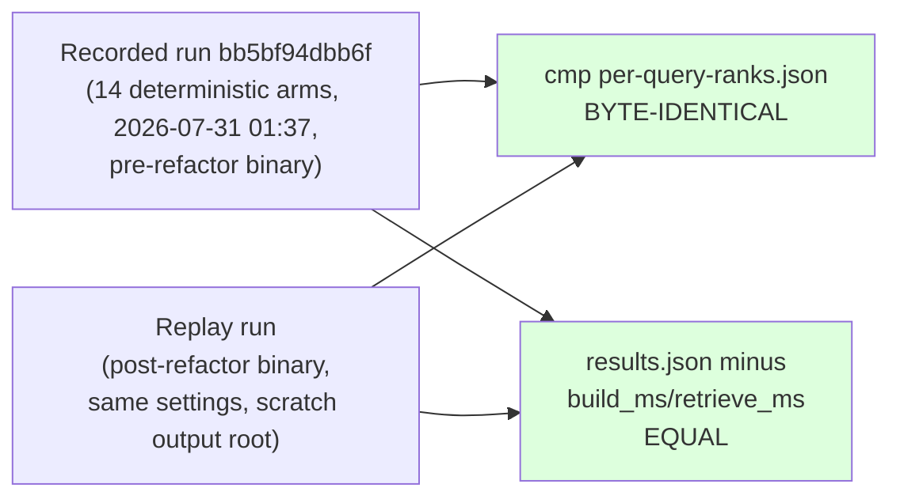

# RAG-TTC Codebase Consolidation: Review-Then-Execute from 49k Lines to a Two-Track Repository

This report documents a single-day review-then-execute cycle on the rag-ttc repository, performed as the precondition for the LLM-as-a-judge implementation (ticket RAG-TTC-JUDGE-001). The cycle had two halves with an explicit approval gate between them. The first half produced a full-repository architecture review and code review — 49,448 lines of Go across 54 packages, surveyed by three parallel read-only exploration agents plus baseline verification — with verdicts sorted into three categories: move out or deprecate, refactor for reuse, and overengineered-versus-load-bearing. The second half, approved with two amendments that made it stricter than the review proposed, executed the plan: 3,152 lines deleted in the main deletion commit, the 20k-line interactive stack physically relocated under `pkg/app/` behind an enforced dependency boundary, and the shared harness glue extracted into a new package — all validated by replaying a recorded experiment run on the refactored binary and comparing artifacts byte-for-byte.

The report also records the two review verdicts that were reversed during execution, because the reversals carry the cycle's most reusable methodological lesson: caller-count claims from exploration sweeps are hypotheses, and each one must be re-verified at the moment of deletion.

> [!summary]
> - The repository was two projects sharing one module: a research lab and a Bubble Tea chat application occupying ~41% of the code. `go list -deps` proved the dependency direction strictly one-way, which converted the largest structural question into a mechanical move: the app now lives under `pkg/app/`, and a boundary test fails the build if any research package ever imports it.
> - Deletion (user-upgraded from the review's "archive"): the superseded `summary-perf` harness, the closed-question `backend-bakeoff` harness plus the entire `sqlitefts` backend it alone consumed, the untested `pkg/rag/report` package, four of six tutorial examples, and a zero-caller execution primitive.
> - The one refactor the judge needs — a single `harness.Open` owning the budget-preflight-cache sequence previously hand-rolled at four call sites — landed with all call sites converted, and the whole cycle closed on a byte-identical replay of a recorded 14-arm benchmark run.
> - Two verdicts reversed on verification: a "production-callerless" observation wrapper had a live caller, and the "duplicate caching shapes" were two different jobs (batch corpus work versus single query-time calls). Both reversals are recorded in the review document rather than silently absorbed.

## Why this project exists

The judge pipeline (decomposed faithfulness and relevance scoring over the answer-quality harness) was about to become the fifth consumer of a block of glue code that already existed in four hand-rolled copies. The user directed a review before implementation: identify what can be moved out or deprecated, what should become modular and reusable, and what is overengineered for the repository's actual purpose, which is practical RAG research. The same instruction fixed a model policy with cache consequences: `gpt-5.6-luna` generates answers and all up-front representations from now on; Umans GLM 5.2 judges. Since the model name participates in the generation cache key, this policy deliberately invalidates existing representation caches — a planned cost, not an accident, and the review had to state it as such.

A structural fact discovered in the first minutes framed everything else: `pkg/chatui` alone was 16.5k lines — the single largest component in a 49.4k-line repository — supported by `pkg/chat`, `pkg/session`, and `pkg/annotation`. The repository's git history (265 commits on `task/rag-ttc-tui-polish`) is substantially the history of that application, while the README describes only the research side. Any honest review had to begin by deciding what the repository *is*.

## Current project status

Executed and verified, in seven commits on 2026-07-31 (`a42c9ac` through `8aac4e2`):

- Review document stored in the ticket (design-doc 02, fourteen sections plus an execution-outcome addendum) and delivered to reMarkable.
- Phases 0–2 of its plan complete: hygiene, deletion, the `pkg/app/` move, and the modularization that serves the judge.
- Gate passed: full test suite green (with ticket archives newly excluded from the build by a module marker), and the recorded Track A chunk-compare run `bb5bf94dbb6f` replayed on the refactored binary with `per-query-ranks.json` byte-identical and `results.json` identical after removing wall-clock fields.
- Phase 3 — `judge.go` itself — deliberately not started, per instruction.

## The review method

The review combined three parallel read-only exploration agents with the reviewer's own baseline verification, each with a disjoint territory: the interactive stack, the core `pkg/rag` libraries, and the experiments-plus-control-plane machinery. Each agent returned a data report with file:line evidence and no recommendations; synthesis and verdicts stayed with the reviewer. Baseline facts were established independently before any verdict: the build was green; all 52 non-ttmp packages passed tests; the only failing test in the module was a deliberately committed upstream-bug reproduction inside a ticket archive; and the entire `pkg/` + `cmd/` tree contained zero TODO/FIXME/deprecated markers and no commented-out code.

That last measurement redirected the whole review. A codebase with no lint-level debt offers a conventional code review nothing to do; every finding of value was structural — import graphs, caller counts, per-package commit recency, and output-column liveness. Three examples of the evidence style:

- `summary-perf` was condemned by three independent signals that agreed: frozen commit history (untouched through three subsequent ticket campaigns), absorbed function (its representation work had moved to `indexes build` and the chunk-compare arms), and dead outputs (two result columns never assigned anywhere — constant zeros in every CSV the harness ever produced).
- The `pkg/vector` / `pkg/rag/vector` and `chunking` / `gochunk` "duplication" suspicions both dissolved under import analysis into layered dependencies (math primitives under an index implementation; a Go-AST superset wrapper over generic chunkers).
- The decisive fact for the app split was falsifiable and checked, not assumed: `go list -deps` over every research package matched zero chat-side import paths.

## Project shape after execution

```text
rag-ttc/
├── pkg/rag/          contracts + components (chunking, representations,
│   │                 generation, embedding, lexical/bleve, vector/sqliteexact,
│   │                 retrieval, answering, reranking, evaluation, dataset,
│   │                 indexbundle, providers/geppetto{,/profile})
│   ├── target.go     NEW: one Target vocabulary, aliased by retrieval + evaluation
├── pkg/harness/      NEW: Open() = preflight -> budgets -> limiters -> cache
├── pkg/execution/    limits, caches, budgets (MapCachedGroups deleted)
├── pkg/experiment/   immutable run directories
├── pkg/app/          MOVED: chatui, chat, session, annotation (the application track)
├── cmd/rag-ttc/
│   ├── boundary_test.go   NEW: research packages must not import pkg/app
│   └── cmds/         experiments{answerquality,chunkcompare}, indexes, corpus,
│                     queries, chat, sessions, workspace
├── examples/         01_chunking, 06_end_to_end_experiment (02-05 deleted)
├── scripts/codex-oauth-test/   subscription-OAuth smoke tool (previous report)
└── ttmp/             ticket archives; own go.mod so ./... skips them
```

## Implementation details

### The track split and its enforcement

The interactive stack moved wholesale: `git mv` of four packages, then a two-pattern `sed` over the fifty files whose import blocks referenced them. The pattern pair matters: `rag-ttc/pkg/chatui` rewrites freely, but `pkg/chat` is a prefix of `pkg/chatui`, so the second pattern anchors on the closing quote (`rag-ttc/pkg/chat"`), which distinguishes the two without a lookahead. The move is enforced rather than documented:

```go
// cmd/rag-ttc/boundary_test.go — the mechanism, abbreviated
const appPrefix = "github.com/the-tree-center/rag-ttc/pkg/app"
var researchTrees = []string{"pkg/rag", "pkg/execution", "pkg/experiment", ...}

for each tree: walk *.go files
    parse with parser.ImportsOnly
    fail if any import equals appPrefix or begins appPrefix + "/"
```

Guarding a path prefix instead of a package list means every future package created under `pkg/app/` is covered automatically. A transitive research→app dependency cannot exist without a direct one somewhere in the scanned trees, so imports-only parsing suffices. The residual weakness is the hand-maintained `researchTrees` list: a research tree added at a new path must be appended by hand.

Two prior layering violations were corrected as part of the same phase: the provider bootstrap (`Resolve`, used by chat, workspace, and indexes alike) moved out of `cmds/experiments/` into `pkg/rag/providers/geppetto/profile`, and the deletion sweep removed the pressure the misplacement had created.

### The deletions and the judgment calls inside them

The user upgraded the review's archive verdicts to deletion, with git history as the only archive; `experiments/root.go` carries a comment naming the last pre-deletion commit so recovery is one command. Two deletions involved judgment beyond the review:

- **Which examples survive.** Examples 02–05 each demonstrated one library feature (in-memory BM25, hybrid fusion, execution controls, cache recovery) now covered better by package tests; 01 (identity and chunking — the exact-slice invariant a newcomer must internalize first) and 06 (the anatomy of a complete experiment directory) are the two an intern actually needs, and they kept the oracle packages (`pkg/rag/lexical`, `pkg/rag/vector`) alive as their dependencies.
- **What follows a deletion transitively.** `execution.MapCachedGroups` had exactly one production caller — inside `summary-perf`. Deleting the harness made the primitive dead, so it went in the same phase, with its tests. `sqlitefts` followed `backend-bakeoff` by the same logic.

Example 06 absorbed the one API loss: `pkg/rag/report` re-averaged metrics that `evaluation.Report` already aggregates (two drift-prone aggregation paths), so the example now computes its three means inline from `evaluation.RetrievalMetrics` — twelve lines replacing a 116-line package with no tests.

### The harness extraction

Every harness repeated the same sequence with local variations: build `[]execution.ResourcePlan`, optionally run the monetary preflight, construct budgets and composed limiters, open a file cache at `<cacheRoot>/provider-steps`, and snapshot spend into the run directory. The new `pkg/harness` owns exactly that and nothing else:

```go
resources, err := harness.Open(harness.Options{
    Plans:          plans,               // fail-closed: refusal precedes any provider call
    CacheDirectory: cfg.CacheDirectory,  // cache at <dir>/provider-steps; empty -> nil cache
    Preflight:      &harness.Preflight{MaxEstimatedUSD: ..., AllowUnpriced: ..., AllowPartial: ...},
})
// resources.Budgets, resources.Limiters, resources.Cost, resources.Cache
// resources.Snapshots() -> map[string]execution.BudgetSnapshot for run artifacts
```

Design constraints worth stating because they are easy to erode: `Preflight` is a pointer so that callers which state their own refusal arithmetic (the chunk-compare bench prints the exact call count its arms require before refusing) can skip cost validation without losing budgets; `ProviderStepsDirectory` is now the single spelling of the shared cache location — the chunk-compare → answer-quality promotion seam, where a screened arm replays its generations for free at confirmation time, depends on both harnesses resolving the same directory. The package's declared scope ceiling ("anything beyond budgets, cache, and snapshots belongs to the individual harness") is written into its doc comment, because glue packages grow into frameworks by default. All four call sites converted in one commit; the judge becomes the fifth caller of `Open`, not the fifth copy of the sequence.

Two smaller unifications rode along. The multi-query and HyDE prompts — previously hardcoded, domain-specific string literals inside `answering.Service` — became `Service.MultiQueryPrompt`/`HyDEPrompt` fields with exported defaults, which is precisely the seam experiment E11 needs to make query-transformation prompts an identified experimental variable. And the two independent `Target` types (retrieval's chunk/document, evaluation's four-level superset) collapsed into one definition in `pkg/rag` with type aliases in both packages — a migration with zero call-site churn, because a Go type alias plus untyped constant aliases is call-site-invisible.

### The verification gate



Unit tests validate components; only a recorded-run replay validates that a refactor preserved *identity* — cache keys, chunker identity strings, rank ordering — end to end. The Track A benchmark run was chosen because its fourteen arms are fully deterministic (no provider calls), so the replay isolates the refactor as the only variable. The comparison held byte-for-byte on the ranks artifact and exactly on every metric. Alongside it, the full suite ran green after every phase commit, and a long-standing irritation was retired on user instruction: a one-line `go.mod` at `ttmp/` makes the ticket archives a separate module, so `go test ./...` no longer compiles committed bug reproductions (one of which panicked by design).

### The two reversals, and the rule they produced

Both wrong verdicts originated in one exploration agent's caller-count claims:

1. `generation.ObservedGenerator` was reported as having only test callers and was scheduled for deletion. The pre-deletion grep found a live production caller — the answer-quality runner wraps its answer generator in it to record observations. The wrapper stayed.
2. The "two caching shapes per provider package" finding recommended converging on the stateful wrappers. Verification showed the shapes are different jobs: batch free functions drive corpus-scale work with per-item cache commit; stateful wrappers serve single-call query-time paths; `GenerateCached` had two live callers. The recommendation was withdrawn.

Both reversals are recorded in the review document's execution-outcome section with the original claims left visible and struck by annotation, not rewritten. The standing rule extracted: an exploration sweep's negative claims ("no callers", "test-only") are cheap to re-verify — one grep — and must be, at the moment of acting on them. The asymmetry justifies the rule: the grep costs seconds; deleting a live observation path costs a debugging session weeks later.

## Common failure modes encountered

Recorded because they recur: zsh does not word-split unquoted parameters by default, so a `for f in $FILES` loop over `rg -l` output executed `sed` once against a newline-joined pseudo-filename (fix: pipe to `xargs`); bare `===`-style separators in zsh trigger glob expansion and abort compound commands; `grep -c` exits nonzero on a zero count, silently breaking `&&` chains that treat "no failures found" as success; and campaign run directories exist under two roots (`experiments/` and `experiments/runs/`) because harness defaults diverged — the replay initially "found no runs" until the layout inconsistency was noticed. A permission-classifier denial of a batched `git rm -r` was correctly resolved by plain `rm` plus `git add -A` per the classifier's own guidance, the deletions being explicitly user-authorized.

## Open questions

- `profile.Resolve` silently falls back to the user's real pinocchio configuration when handed nil parsed values — discovered when a unit test failed *by succeeding* against `~/.config`. Convenient interactively; a misfired harness would quietly run on the default profile. Should nil values be rejected?
- When does the app track leave the module entirely? The `pkg/app/` move plus boundary test made extraction mechanical; the timing is a scheduling decision, not an engineering one.
- The luna-era regeneration of representations (model name is in the cache key) is budgeted but not yet run; chunk-lab-era numbers and luna-era numbers will form two comparability series, and write-ups must say which series they cite.

## Near-term next steps

- Phase 3: `judge.go` on the cleaned seams — GLM 5.2 statements and verdicts over luna-generated answers (cross-family by construction under the new policy), budgeted through `harness.Open`, cached under the judge adapter identity.
- Deferred with intent: `indexbundle`'s inspect/statistics half (893 lines serving two read-only consumers) splits only if it grows; E11 wires the new prompt fields into run configs; run-directory layout unification waits for the next natural harness change.

## Important project docs

- Ticket: `rag-ttc/ttmp/2026/07/31/RAG-TTC-JUDGE-001--llm-as-a-judge-.../` — design-doc 02 (the review, with §15 execution outcome), diary Steps 2–3, tasks with per-phase evidence.
- Key new code: `pkg/harness/harness.go`, `cmd/rag-ttc/boundary_test.go`, `pkg/rag/target.go`, `ttmp/go.mod`.
- Commits: `a42c9ac` (review + model policy), `c2345e5` (Phase 0), `0746894` (Phase 1, −3,152 lines), `0082c00` (pkg/app move), `ca35ce3` (harness), `241b91b` (profile move), `8aac4e2` (Phase 2c + docs).

## Related notes

- [[PROJ - Codex OAuth for gpt-5.6-luna - Subscription-Plan Inference Through Geppetto's OpenAI-Codex Transport]] — same day's provider work; the model that now generates answers under the new policy.
- [[PROJ - RAG-TTC Chunk Lab Results - From BM25 Screening to the Hybrid Retrieval Reversal]] — the campaign whose identity discipline (digests, budgets, exact-slice chunks) this cleanup explicitly protected in its do-not-simplify list.
- [[ARTICLE - Reproducibility Engineering - Digests, Caches, Budgets, and Provenance]] — the conceptual background for why the replay gate is the correct acceptance test for a refactor of this kind.
- [[ARTICLE - RAG Evaluation and LLM Judges - Behavioral Benchmarks, Judged Metrics, and Judge Reliability]] — the destination: the judge this consolidation clears the ground for.
