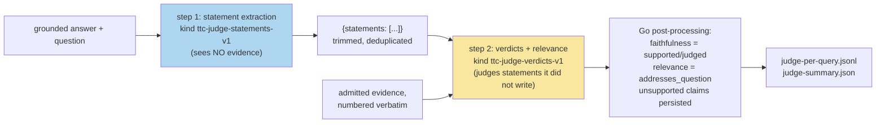

# RAG-TTC LLM Judge: A Two-Step Decomposed Faithfulness Pipeline from Design to Live Run

This report documents the implementation of the LLM-as-a-judge stage in the rag-ttc answer-quality harness (ticket RAG-TTC-JUDGE-001), from its designed contracts to a first full-scale live run. The judge scores every grounded answer on two axes — decomposed faithfulness (which fraction of the answer's atomic claims the admitted evidence supports) and anchored answer relevance — using a two-step pipeline: statement extraction, then per-statement verdicts. Faithfulness is computed in Go from the verdicts; no model is ever asked for a holistic score. The stage was built in one session on the seams prepared by the same-day codebase consolidation, validated by eight unit tests and a live five-query smoke that passed on the first attempt, and is, at the time of writing, mid-way through judging the full E10 confirmation series (148 queries × 3 retrieval arms, ~850 live model calls).

The report also records two facts of independent value: the small resolver (`profile.ResolveNamed`) that lets one command operate three model roles under three different provider profiles without upstream changes, and the discovery — made by watching the live run's call rate — that the judge profiles inherit GLM 5.2's reasoning overhead, which sets judge throughput, not answer generation, as the binding cost of judged experiments.

> [!summary]
> - Two steps, deliberately separated: the extractor sees the question and answer but never the evidence (it cannot bias statements toward what is supported); the verdict model judges statements it did not write. Faithfulness = supported/judged, computed deterministically.
> - Every judge outcome belongs to a closed taxonomy — judged, partial, unjudged, abstained, invalid — with exact budget and scoring semantics per status; abstention is scored by convention and excluded from arm means so it cannot be exploited.
> - Judge calls carry their own cache identity, so a re-judge of an unchanged run is a 100% cache replay (proved in-test), and the judge budget is fail-closed at two calls per valid non-abstained answer.
> - The model policy of the day makes judging cross-family by construction for future runs (gpt-5.6-luna answers, Umans GLM 5.2 judges); the current run judges the cached GLM-answered E10 series and therefore carries `same_family_verdicts: true`, computed and recorded automatically.

## Why this project exists

Retrieval metrics (MRR, recall, nDCG) score rankings against judged sets; they say nothing about whether the generated answer is actually grounded in the evidence it cited. The chunk-lab campaign produced three confirmation runs (the E10 series) whose retrieval quality is now well characterized, but whose answer quality had only two witnesses: a deterministic answer contract (parse/grounding checks, not quality) and a blinded human pairwise review (expensive, sparse). The judge adds a third witness that scales: model-scored faithfulness and relevance for every cell, cheap enough to run over every experiment.

The design rests on one empirical result from the literature: decomposition is load-bearing. RAGAS-style decomposed faithfulness — verify each atomic claim against evidence separately — reports ~0.95 agreement with human raters, whereas holistic paragraph scoring achieves 0.70–0.78. Verifying one short assertion against provided passages is a tractable judging task; scoring a whole answer is not. The judge is also explicitly a *witness, not a gate*: it never changes what an arm produced, and its own reliability is treated as an open experimental question (a 20-verdict human spot audit gates any citation of its numbers).

## Current project status

- Implementation complete and merged (commits `123d13e` judge stage + resolver, `dfc406c` tests, `08ba431` ticket bookkeeping); full test suite green.
- Live smoke passed on first attempt: 5 queries, answers replayed from cache, 8 live GLM calls, 4 judged / 1 abstained, correct same-family labeling.
- Full run in flight over the E10 configuration: all 444 answer cells replayed from cache instantly; the judge's ~850 live calls proceeding at ~6 calls/min (see §7 on why), completion expected within hours of writing.
- Open validation gates: the human spot audit, and a reasoning-on versus reasoning-off judge ablation that the cache makes cheap.

## The two-step design



The information barriers are the point of the split. If the extractor saw the evidence, it could (and models do) quietly restate the answer in evidence-shaped terms, inflating faithfulness. If the verdict model both invented and judged the statements, decomposition would be theater. Splitting the steps makes each model's task narrow and each failure legible.

**Step 1 contract.** Input: question and answer text. Output: `{"statements": ["..."]}` — atomic factual claims, compound sentences split, nothing added or evaluated. An empty list is legal. Parsing is fence-tolerant (first `{` to last `}`); statements are trimmed and order-preserving deduplicated; a malformed response marks the cell *unjudged* — recorded, never guessed, never retried beyond the transport retry.

**Step 2 contract.** Input: question, the verbatim admitted evidence chunks numbered in admission order, and the numbered statements. Output: per-statement `{"statement": n, "supported": true|false, "evidence": [n...], "reason": "..."}` plus one anchored relevance rating `addresses_question ∈ {0, 0.5, 1}`. Post-processing drops out-of-range statement numbers, keeps the first verdict on duplicates, computes faithfulness over the judged subset (marking the cell *partial* when coverage is incomplete), and refuses — rather than clamps — a relevance value outside [0, 1].

**The outcome taxonomy** is closed and each member has exact semantics:

| Status | Meaning | Budget cost | In faithfulness mean? |
|---|---|---|---|
| `judged` | every statement received a verdict | 2 calls | yes |
| `partial` | verdicts cover a strict subset; subset size recorded | 2 calls | yes (over subset) |
| `unjudged` | malformed response or zero statements extracted | 1–2 calls | no |
| `abstained` | answer abstained; faithfulness vacuously 1 by convention, relevance not judged | 0 calls | **no** |
| `invalid` | answer failed its deterministic contract; never sent to the judge | 0 calls | no |

The two zero-cost rows and the abstention exclusion are deliberate economics: abstained and invalid cells never reach step 1, and the vacuous-faithfulness convention is excluded from arm means so an arm cannot buy faithfulness by abstaining. Each of these rules is pinned by a test.

## Implementation details

### Multi-profile resolution: `ResolveNamed`

The 2026-07-31 model policy assigns three roles to one command invocation: answers on `gpt-5.6-luna` (`ttc-live-luna`), both judge steps on Umans GLM 5.2 (`ttc-judge-statements`, `ttc-judge-verdicts`). Pinocchio's profile selection, however, is invocation-scoped — one profile per command, from flag or environment. The gap closed with ~70 lines in `pkg/rag/providers/geppetto/profile/resolve.go`: pinocchio's resolution pipeline is exported piecewise (base settings, parsed overlays, the composed registry chain from `ResolveCLIProfileRuntime`), so a resolver can rebuild it and override exactly one field:

```go
resolveInput := chain.DefaultProfileResolve      // registry default from the invocation
resolveInput.EngineProfileSlug = parsedSlug      // the ONLY divergence
resolved := chain.Registry.ResolveEngineProfile(ctx, resolveInput)
final := gepprofiles.MergeInferenceSettings(base, resolved.InferenceSettings)
// hand-assembled ResolvedCLIEngineSettings -> the same OAuth-capable engine factory
```

One semantic choice distinguishes it from the ordinary path: a missing registry chain is an *error*, not a fallback to base settings. A caller naming a profile wants that profile or a refusal — never a silent default. (This mirrors the `Resolve(nil)`-falls-back-to-user-config hazard flagged in the consolidation report.)

### Cache identity and byte-determinism

Judge calls flow through the same cached-generation path as everything else, under their own adapter identity (`ttc-judge-adapter-v1` / `answer-evidence-v1`), which partitions the shared `provider-steps` cache into a judge region distinct from representations and answers. Two construction rules protect the identity:

- **All content lives in the request's `Text` field**, never the structured `Evidence` field — the cache key hashes the text fields, so routing evidence through the structured field would make the key blind to evidence changes. A test asserts the verdicts request's exact bytes, numbered evidence and all.
- **Prompts are constants and constitute experiment identity** (method rule 6): a changed judge prompt is a new judge arm, never an update.

The payoff is proved in-test and observed live: a re-judge of an unchanged run is a 100% cache-hit replay, and the five smoke cells' statement results were already free when the full run started. One dependency worth stating: verdicts-request determinism rests on evidence *admission order* (`Context.Evidence`), which is deterministic given the run — but any future change to admission ordering would silently fork the judge cache.

### Budget and orchestration

```text
judgeAnswers(cfg, answerModel, bundles, answers):
    partition answers -> invalid | abstained | judgeable   # first two scored by rule, cost 0
    ceiling = 2 * len(judgeable)
    refuse unless JudgeBudget >= ceiling                    # refusal states the arithmetic
    resources = harness.Open({judging: ceiling/budget}, cacheDir)
    step1 = GenerateCached(statementsRequests, retry(statements engine))
    parse -> unjudged cells drop out; zero-statement cells skip step 2
    step2 = GenerateCached(verdictsRequests, retry(verdicts engine))   # only surviving cells
    score cells (§ taxonomy) ; summarize per arm ; stable sort by (arm, query)
```

The budget plan is a fifth caller of `harness.Open` — three lines where the pre-consolidation harnesses each hand-rolled forty. Provider *errors* fail the run loudly after the transport retry (six attempts, backoff); provider *nonsense* is per-cell data. This distinction — errors kill, malformation records — keeps partial judgments from masquerading as complete ones.

### Provenance: the same-family flag

Verdicts rendered by the same model family that wrote the answers are structurally suspect of self-preference (the self-recognition link is documented in the evaluation-and-judges article). The run config therefore records, at creation time, both judge identities plus a *computed* `same_family_verdicts` boolean — the label cannot be omitted by accident. The heuristic takes the leading letter-run of each model name (`glm-5.2` → `glm`, `gpt-5.6-luna` → `gpt`) and is deliberately crude; the full identities sit beside the flag for manual override. The current run judges the cached GLM-answered E10 series and is correctly flagged `true`; future luna-answered runs will be cross-family by construction, and the flag will clear itself.

## Validation performed

Eight tests (`judge_test.go`) — parser tolerance (fences, prose wrappers, duplicates, type-mismatched JSON), verdict parsing with absent relevance, the complete score-rule table (full support, mixed, subset→partial, out-of-range dropped, duplicate-keeps-first, nothing-in-range→unjudged, relevance refusal), the family heuristic, request byte-determinism, an end-to-end run over one judged + one abstained + one invalid cell with a full cache-replay assertion, budget-refusal wording, and the unparseable-statements path including that no verdict call is spent on an unjudged cell.

Then the live smoke, which is worth reporting in its particulars because everything behaved on the first post-flag attempt: five queries, bm25 arm, answers replayed from the E10 cache (5/5 instantly), eight live GLM calls. Four cells judged — the statement decomposition visibly correct (a compound shipping-confirmation sentence split into three atomic claims: email-on-ship, tracking-number-included, trackable-via-FedEx), all supported by evidence, relevance 1.0 — one cell abstained and scored by convention. The single failure en route was the preflight refusing the unpriced umans profile until `--allow-unpriced-provider` was passed: the fail-closed machinery working as designed.

## The live run and the reasoning-overhead discovery

The full run (bm25, vector, rrf × 148 queries) confirmed the cost model's shape immediately: all 444 answer cells completed in seconds as cache replays, so every provider call spent is a judge call. The judge pace then measured ~6 calls/min at 4 workers — well under the ~16 calls/min the same gateway sustained during the campaign. The explanation is configuration, not congestion: the `ttc-judge-*` composites stack plain `umans-glm-5.2`, whose default reasoning behavior spends the majority of output tokens on hidden reasoning (measured that morning: `reasoning_effort:"none"` 3.4 s/call versus ~68 s default).

The decision was to let it run: verdict-rendering is precisely the task class where reasoning plausibly earns its cost, and this run thereby defines the judge's *primary* configuration. The alternative was measured and remains available at near-zero cost — because the reasoning setting is deliberately excluded from the cache key (a recorded approximation, not identity), a no-reasoning re-judge replays every completed call free and re-runs only the remainder — but switching mid-run would have blended two judge behaviors inside one run's artifacts. The general lesson generalizes beyond this run: **in judged experiments the judge, not the answerer, is the throughput bottleneck**, and judge-profile latency deserves the same measurement discipline as any other provider parameter.

## Open questions

- The 20-verdict human spot audit gates any citation of judged numbers; the smoke's five cells looked right, but that is not the audit.
- Reasoning-on versus reasoning-off verdicts: same engine, cache-compatible, one cheap ablation — does reasoning measurably change verdict agreement with humans?
- The family heuristic mislabels same-family pairs with differently-shaped names (`o4-mini` vs `gpt-4o`); acceptable while the model set is {glm, gpt}, revisit if it grows.
- Judge workers currently reuse `--generation-workers`; a dedicated knob was omitted to keep the flag surface at the guide's four.

## Near-term next steps

- When the run lands: read `results/judge-summary.json`, spot-check verdicts against evidence, record per-arm faithfulness/relevance beside the retrieval table in the ticket, feed SYSLAB E14/E15/E20.
- The cross-family run: luna-generated answers (new policy) judged by GLM — `same_family_verdicts: false` by construction, and the deliberate luna representation regeneration comes with it.

## Important project docs

- Ticket: `rag-ttc/ttmp/2026/07/31/RAG-TTC-JUDGE-001--llm-as-a-judge-.../` — design-doc 01 (contracts, §2.6 Codex OAuth), design-doc 02 (the consolidation that prepared the seams), diary Steps 1–4.
- Code: `cmd/rag-ttc/cmds/experiments/answerquality/judge.go` (+`judge_test.go`), `pkg/rag/providers/geppetto/profile/resolve.go` (`ResolveNamed`), `pkg/harness/harness.go`.
- Runs: smoke `…-answer-quality-86f44f4c0a6d`; full run `…-answer-quality-3566e8654e92` (in flight).
- Commits: `123d13e`, `dfc406c`, `08ba431`.

## Related notes

- [[ARTICLE - RAG Evaluation and LLM Judges - Behavioral Benchmarks, Judged Metrics, and Judge Reliability]] — the literature base: decomposition's agreement advantage, judge biases, the witness-not-gate stance.
- [[PROJ - RAG-TTC Codebase Consolidation - Review-Then-Execute from 49k Lines to a Two-Track Repository]] — the same-day cleanup whose `pkg/harness` and profile relocation this build consumed directly.
- [[PROJ - Codex OAuth for gpt-5.6-luna - Subscription-Plan Inference Through Geppetto's OpenAI-Codex Transport]] — the answering model's subscription path, and the eventual home of the cross-family run's answer generation.
- [[PROJ - RAG-TTC Chunk Lab Results - From BM25 Screening to the Hybrid Retrieval Reversal]] — the E10 series being judged.
- [[ARTICLE - Measurement Discipline and LLM IO - Throughput, Batching, and Structured Output]] — the token-accounting habit that identified the reasoning overhead from the call rate alone.
